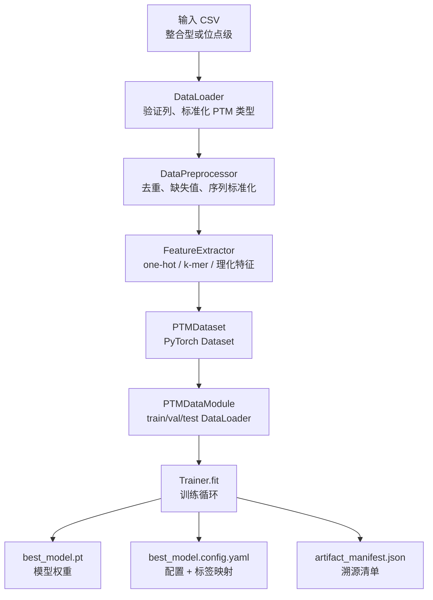
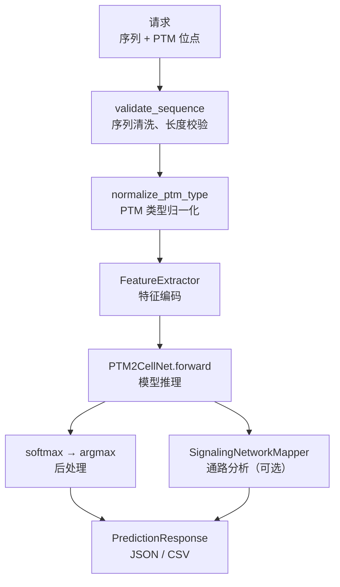

# PTM2CellNet 输入输出文件说明

**版本**: v1.0  
**日期**: 2026-07-06  
**目的**: 全面说明 PTM2CellNet 项目的所有输入输出文件格式、结构及解读方法

---

## 1. 概述

PTM2CellNet 使用多种文件格式作为数据输入、配置、模型权重和结果输出。本文档系统性地分类并详细说明每种文件的格式、字段含义和使用方式。

---

## 2. 输入文件

### 2.1 训练数据文件

PTM2CellNet 支持两种主要的数据组织方式：

#### 2.1.1 整合型训练 CSV（细胞状态预测）

这是主要的训练数据格式，用于端到端的细胞状态预测。

**文件**: `data/processed/ptm_integrated_human_labeled.csv`

**列定义**:

| 列名 | 类型 | 必填 | 说明 |
|------|------|------|------|
| `id` | string | 是 | 样本唯一标识符（如 `PMADS_5`） |
| `sequence` | string | 是 | 蛋白质氨基酸序列，仅含 20 种标准氨基酸 |
| `ptm_sites` | string (JSON) | 是 | PTM 位点 JSON 数组，每个位点含 `position`、`type`、`amino_acid` |
| `cell_state` | string | 是 | 细胞状态标签（目标变量），如 `Quiescent`、`Activated` |
| `uniprot_id` | string | 否 | UniProt 蛋白质登录号，用于溯源 |
| `seq_length` | integer | 否 | 序列长度（自动衍生） |
| `num_ptm_sites` | integer | 否 | PTM 位点数量（自动衍生） |

**`ptm_sites` JSON 格式**:
```json
[
  {"position": 491, "type": "Phosphorylation", "amino_acid": "T"},
  {"position": 599, "type": "Phosphorylation", "amino_acid": "S"}
]
```

**`cell_state` 常见取值**: `Quiescent`（静息）、`Activated`（激活）、`Apoptosis`（凋亡）、`Proliferation`（增殖）、`Senescence`（衰老）

**示例行**:
```
PMADS_5,KVEPS.PGHPK...TP,[{"position":491,"type":"Phosphorylation","amino_acid":"T"}],Activated,P12345,491,5
```

#### 2.1.2 训练/验证/测试拆分 CSV

**文件**: `data/processed/train.csv`, `val.csv`, `test.csv`

**列定义**:

| 列名 | 类型 | 说明 |
|------|------|------|
| `id` | string | 样本标识符 |
| `sequence` | string | 氨基酸序列 |
| `ptm_sites` | string (JSON) | PTM 位点 JSON（格式同 2.1.1） |
| `cell_state` | string | 细胞状态标签 |

**特点**: 这些文件是 2.1.1 整合数据的子集，按训练/验证/测试集拆分，通常使用分层采样保持标签分布一致。

#### 2.1.3 PTM 位点二分类训练 CSV（位点级预测）

用于单个 PTM 位点的修饰状态预测（"该位点是否被修饰"）。

**文件**: `data/processed/ptm_train_phosphorylation.csv`（以及其他 PTM 类型对应的文件）

**列定义**:

| 列名 | 类型 | 说明 |
|------|------|------|
| `uniprot_id` | string | UniProt 蛋白质登录号 |
| `position` | integer | PTM 位点在序列中的位置（1-based 索引） |
| `aa` | string | 该位点的单字母氨基酸代码 |
| `sequence_window` | string | 以 PTM 位点为中心、包含侧翼残基的固定长度窗口 |
| `label` | integer | 二分类标签：`1`=已修饰，`0`=未修饰 |
| `ptm_type` | string | PTM 类型（如 `Phosphorylation`） |

**支持的 PTM 类型文件**:
| 文件 | PTM 类型 | 大小估算 |
|------|---------|---------|
| `ptm_train_phosphorylation.csv` | 磷酸化 | ~800k 行 |
| `ptm_train_acetylation.csv` | 乙酰化 | ~80k 行 |
| `ptm_train_methylation.csv` | 甲基化 | ~10k 行 |
| `ptm_train_succinylation.csv` | 琥珀酰化 | ~12k 行 |
| `ptm_train_sumoylation.csv` | SUMO 化 | ~4k 行 |
| `ptm_train_ubiquitination.csv` | 泛素化 | ~80k 行 |

**示例行**:
```
P04637,53,S,GSRASSSSSSILPDKFLQNS...,1,Phosphorylation
```

#### 2.1.4 示例/候选 CSV

**文件**: `data/processed/example_candidates.csv`

**列定义**: `sample_id`, `protein_id`, `sequence`, `ptm_sites`

**用途**: 测试和演示用的小型数据集（通常只有 2-3 行）。

#### 2.1.5 同源拆分 CSV

**文件**: `data/processed/phosphorylation_homology_split.csv`

**列定义**: 与 2.1.3 相同，但增加 `split` 列（取值：`train`、`val`、`test`）

**用途**: 基于 k-mer Jaccard 相似度的同源感知数据拆分的训练数据。

---

### 2.2 外部数据加载器输入格式

PTM2CellNet 可以从多种外部数据源导入，通过列别名映射实现灵活兼容。

**PTM 数据库标准列**:

| 标准列名 | 别名 | 是否必需 |
|---------|------|---------|
| `protein_accession` | `accession`, `protein_id`, `uniprot`, `uniprot_accession` | **必需** |
| `position` | `site`, `ptm_position` | **必需** |
| `ptm_type` | `modification` | **必需** |
| `amino_acid` | `residue`, `residue_aa` | **必需** |
| `source` | `database`, `origin` | 可选 |
| `confidence` | `score`, `probability` | 可选 |

**支持的标准化 PTM 类型**（29 种）:

| 类别 | 类型 |
|------|------|
| 核心 | phosphorylation, acetylation, methylation, ubiquitination, sumoylation |
| 类泛素化 | neddylation |
| 酰基化 | succinylation, malonylation, glutarylation, propionylation, butyrylation, formylation |
| 糖基化 | glycosylation, oglcnacylation |
| 氧化还原 | oxidation, nitrosylation, hydroxylation, carbonylation |
| 脂修饰 | palmitoylation, myristoylation, prenylation |
| 其他 | citrullination, deamidation, adpribosylation, sulfation, amidation, disulfidebond, lactylation, crotonylation |

**PTM 类型命名归一化**: 系统自动处理以下变体：
- 大小写: `Phosphorylation` → `phosphorylation`
- 连字符: `ADP-ribosylation` → `adpribosylation`
- 空格: `Disulfide bond` → `disulfidebond`
- 前缀: `N-myristoylation` → `myristoylation`
- （详见 `src/data/aa_constants.py` 中的 `normalize_ptm_type()` 函数）

---

### 2.3 配置文件（YAML）

所有配置使用 YAML 格式，支持分层覆盖。

#### 2.3.1 默认配置 (`configs/default.yaml`)

**结构**（5 个主要部分）:

`project` → `paths` → `data` → `features` → `model` → `augmentation` → `training` → `logging`

**项目级配置**:
```yaml
project:
  name: "PTM2CellNet"      # 项目名称
  version: "1.0.0"         # 版本
  seed: 42                 # 全局随机种子
```

**数据级配置**:
```yaml
data:
  max_sequence_length: 1000          # 最大序列长度
  valid_amino_acids: "ACDEFGHIKLMNPQRSTVWY"  # 有效氨基酸集合
  preprocessing:
    remove_duplicates: true          # 去重
    handle_missing: "drop"           # 缺失值策略: drop/mean/median
    normalize_sequences: true        # 序列标准化
  ptm_types:                          # 支持的 PTM 类型
    - phosphorylation
    - acetylation
    - methylation
    - ubiquitination
    - sumoylation
  split:
    train_ratio: 0.7                 # 训练集比例
    val_ratio: 0.15                  # 验证集比例
    test_ratio: 0.15                 # 测试集比例
    stratified: true                 # 分层采样
```

**模型级配置**:
```yaml
model:
  encoder_type: "transformer"        # 编码器类型
  hidden_dim: 256                    # 隐藏维度
  num_layers: 6                      # 层数
  num_heads: 8                       # 注意力头数
  dropout: 0.1                       # Dropout 比例
  ptm_fusion_type: "attention"       # PTM 融合方式: attention/gated/concat
  task_type: "classification"        # 任务类型
  num_classes: 4                     # 分类数
```

**训练级配置**:
```yaml
training:
  batch_size: 32                     # 批次大小
  learning_rate: 0.001               # 学习率
  max_epochs: 100                    # 最大训练轮次
  optimizer: "adamw"                 # 优化器
  scheduler: "cosine"                # 学习率调度
  grad_clip_norm: 1.0                # 梯度裁剪范数
  use_amp: true                      # 自动混合精度
  gradient_accumulation_steps: 1     # 梯度累积步数
  warmup_steps: 0                    # 学习率预热步数
```

#### 2.3.2 DAVF 集成配置 (`configs/davf_integration.yaml`)

```yaml
davf:
  state_space: "scvi_latent"           # 状态空间: scvi_latent 或 gene
  checkpoint_path: "..."              # DAVF 检查点路径
  scvi_model_path: null               # scVI 模型路径（null=降级）
  geneformer_path: null               # Geneformer 路径（null=随机嵌入）
  gene_names_path: null               # 基因名映射路径
  feature_dim: 128                    # DAVF 特征维度
  hidden_dim: 256                     # DAVF 隐藏维度
  latent_dim: 10                      # 潜在空间维度
  num_genes: 5000                     # 基因数量
  num_steps: 50                       # ODE 积分步数
  freeze: true                        # 是否冻结 DAVF 权重

ptm_mapper:
  max_targets: 32                     # 最大靶基因数

integration:
  concat_point: "before_predictor"    # 拼接点
  zero_features_on_missing_checkpoint: true  # 缺失检查点时使用零特征
  zero_features_on_empty_ptm: true    # 空 PTM 时使用零特征
```

#### 2.3.3 预训练编码器配置

**`configs/pretrained/` 目录中的文件**为各种编码器提供专门配置:

| 文件 | 编码器 | batch_size | lr | 精度 | epoch |
|------|--------|-----------|-----|------|-------|
| `esm2_8m.yaml` | ESM-2 8M | 32 | 1e-3 | 32-true | 50 |
| `esm2_35m.yaml` | ESM-2 35M | 16 | 1e-4 | 32-true | 50 |
| `esm2_150m.yaml` | ESM-2 150M | 8 | 1e-4 | 32-true | 50 |
| `esm2_650m.yaml` | ESM-2 650M | 4 | 1e-5 | bf16-mixed | 30 |
| `esm3_sm_open.yaml` | ESM-3 Small | 4 | 1e-5 | bf16-mixed | 30 |
| `protbert.yaml` | ProtBERT | 16 | 1e-4 | 32-true | 50 |

---

### 2.4 模型检查点文件

#### 2.4.1 标准检查点

**格式**: PyTorch `state_dict`（`.pt` 文件）

**内容**: 模型所有参数的序列化字典，键为参数路径（如 `encoder.conv1.weight`），值为 `torch.Tensor`。

**支持的加载格式**:
1. **裸 state_dict**: 直接 `torch.load()` → 所有值均为 Tensor 的字典
2. **Lightning `.ckpt`**: 包含 `"state_dict"` 键，模型参数前缀 `model.`
3. **旧格式**: 包含 `"model_state_dict"` 键

**典型大小**: 95 MB（小型 PTM2CellNet 模型）

#### 2.4.2 ESM-3 权重文件

**位置**: `checkpoints/esm3/`

| 文件 | 大小 | 用途 |
|------|------|------|
| `esm3_sm_open_v1.pth` | 2.80 GB | ESM-3 主模型权重（48 层 Transformer） |
| `esm3_structure_decoder_v0.pth` | 1.24 GB | 结构解码器权重 |
| `esm3_structure_encoder_v0.pth` | 62.3 MB | 结构编码器权重 |
| `esm3_function_decoder_v0.pth` | 1.30 GB | 功能解码器权重 |

**总计**: ~5.27 GB，支持多模态输入（序列 + 结构 + 功能标记）。

#### 2.4.3 DAVF 检查点

**位置**: `checkpoints/latent_davf_ibd_norman/best_model.pt`（及其他变体）

**典型大小**: 95 MB

**可用变体**:
- `latent_davf_ibd_norman/best_model.pt` — IBD Norman scVI 潜在空间 DAVF
- `latent_davf_ibd_replogle/best_model.pt` — Replogle 扰动数据
- `latent_davf_ibd_tcm_aware/best_model.pt` — TCM 感知变体
- `davf/model_a_finetuned/best_model.pt` — Model A 微调版
- `davf/model_a_4018/best_model.pt` — Model A 4018 版

---

## 3. 输出文件

### 3.1 模型训练产物

每一次训练完成或 `finetune_davf` 运行后，会在指定输出目录下生成以下文件：

```
outputs/models/<run_name>/
├── best_model.pt              # 模型权重文件
├── best_model.config.yaml     # 模型配置 + 标签映射
└── artifact_manifest.json     # 机器可读的模型溯源清单
```

#### 3.1.1 模型权重文件 (`best_model.pt`)

**格式**: PyTorch `torch.save(model.state_dict())` 序列化的二进制文件  
**加载方式**: `model.load_state_dict(torch.load("best_model.pt", weights_only=True))`  
**用途**: 模型推理、继续训练、迁移学习

#### 3.1.2 模型配置文件 (`best_model.config.yaml`)

**内容**: 训练时使用的完整配置，附加从训练数据自动推导的标签映射:
```yaml
data:
  cell_states: ["Quiescent", "Activated", "Apoptosis", "Proliferation"]
  label_to_idx: {"Quiescent": 0, "Activated": 1, "Apoptosis": 2, "Proliferation": 3}
model:
  num_classes: 4
  encoder_type: "transformer"
  # ... 其他训练时配置 ...
```

#### 3.1.3 溯源清单 (`artifact_manifest.json`)

**格式**: JSON  
**用途**: 模型发布和质量控制的审计追踪

**完整结构**:

| 字段 | 类型 | 说明 |
|------|------|------|
| `checkpoint_path` | string | 检查点绝对路径 |
| `config_path` | string | 配置文件绝对路径 |
| `training_entrypoint` | string | 训练脚本路径 |
| `model_class` | string | 模型类名（如 `PTM2CellNet`） |
| `num_classes` | integer | 分类类别数 |
| `cell_states` | list[string] | 细胞状态标签列表 |
| `max_sequence_length` | integer | 最大序列长度 |
| `ptm_types` | list[string] | 支持的 PTM 类型 |
| `git_commit` | string | 训练时的 git 提交哈希（前16字符） |
| `created_at` | string | 创建时间（ISO 8601） |
| `model_kind` | string | 模型性质：`demo`（演示）/ `real`（真实）/ `synthetic_fallback` |
| `model_card` | object | 模型卡片（用途、训练数据、限制） |
| `data_provenance` | object | 数据来源信息 |
| `encoder` | object | 编码器类型和参数 |
| `dataset_hash` | string | 训练数据集的 SHA-256 哈希（前16字符） |
| `dataset_stats` | object | 数据集统计（行数、列数） |
| `dataset_profile` | object | 数据集画像 |
| `split_strategy` | string | 数据集拆分策略 |
| `metrics` | object | 评估指标（accuracy、f1 等） |
| `intended_use` | string | 预期用途说明 |
| `limitations` | string | 模型限制说明 |
| `release_gate` | object | 发布门控检查项 |
| `deployable` | boolean | 是否可部署 |

**`model_kind` 解读**:
| 值 | 含义 | 是否可用于生物学研究 |
|----|------|---------------------|
| `demo` | 合成数据训练，仅供演示 | ❌ 不可 |
| `real` | 真实生物学数据训练 | ✅ 可（需验证） |
| `synthetic_fallback` | 真实数据不可用时降级合成 | ❌ 不可 |

#### 3.1.4 DAVF 微调产物

**`scripts/finetune_davf_e2e.py` 产生的文件**:

```
<output_dir>/
├── best_model_stage1.pt       # 阶段1最佳模型（冻结DAVF训练TaskHead）
├── best_model_stage2.pt       # 阶段2最佳模型（解冻DAVF端到端微调）
├── final_model.pt             # 最终模型
└── finetune_results.json      # 微调评估指标
```

**`finetune_results.json` 结构**:
```json
{
  "stage1": {
    "train_loss": 0.45, "val_accuracy": 0.82, "val_f1": 0.79, "best_epoch": 3
  },
  "stage2": {
    "train_loss": 0.32, "val_accuracy": 0.89, "val_f1": 0.87, "best_epoch": 8
  },
  "test": {
    "accuracy": 0.88, "f1": 0.86, "auc_roc": 0.93
  }
}
```

---

### 3.2 预测输出

#### 3.2.1 单样本预测 CSV

**产生脚本**: `scripts/predict.py`（单样本模式）  
**默认路径**: `outputs/results/predictions.csv`  
**编码**: UTF-8  
**分隔符**: 逗号

**列定义**:

| 列名 | 类型 | 说明 |
|------|------|------|
| `id` | string | 样本唯一标识符 |
| `sequence` | string | 氨基酸序列 |
| `ptm_sites` | string (JSON) | PTM 位点 JSON |
| `ptm_count` | integer | PTM 位点总数 |
| `predicted_cell_state` | string | 预测的细胞状态标签 |
| `confidence` | float | 预测置信度（0.0 ~ 1.0） |
| `prob_<state1>` | float | 状态1 的预测概率 |
| `prob_<state2>` | float | 状态2 的预测概率 |
| `...` | float | 其他状态概率列（动态生成） |

**解读方法**:
- `predicted_cell_state`: 取所有 `prob_*` 列中概率最高的状态
- `confidence`: 最大概率值 — 数值越高，模型越确定
- `prob_*` 列: 各行所有概率之和约为 1.0

**示例行**:
```
PMADS_5,...APOPTOSIS_SIG...,[{"position":491,...}],2,Apoptosis,0.95,0.02,0.02,0.01,0.95
```

#### 3.2.2 批量预测 CSV

**产生脚本**: `scripts/predict.py`（批量模式）

| 列名 | 类型 | 说明 |
|------|------|------|
| `id` | string | 样本标识符 |
| `sequence` | string | 氨基酸序列 |
| `ptm_count` | integer | PTM 位点总数 |
| `predicted_cell_state` | string | 预测的细胞状态 |

与单样本模式的区别：不包含 `ptm_sites` 列（减少文件大小），概率列动态生成。

---

### 3.3 评估指标 (JSON)

#### 3.3.1 测试指标

**产生脚本**: `scripts/train.py`  
**路径**: `outputs/results/test_metrics.json`

```json
{
  "accuracy": 0.88,
  "precision_weighted": 0.87,
  "recall_weighted": 0.88,
  "f1_weighted": 0.87,
  "auc_roc": 0.93,
  "auc_pr": 0.89,
  "ndcg": 0.91,
  "confusion_matrix": [[45, 2, 1, 0], [3, 38, 2, 1], ...]
}
```

#### 3.3.2 评估脚本输出

**产生脚本**: `scripts/evaluate.py`  
**路径**: `outputs/evaluation_metrics.json`

**结构**: 与测试指标相同，但可能包含交叉验证的结果（平均值 ± 标准差）。

---

### 3.4 通路分析输出

#### 3.4.1 通路分析 JSON

**产生脚本**: `scripts/train.py`  
**路径**: `outputs/results/pathway_analysis.json`

#### 3.4.2 通路分析 CSV

**产生脚本**: `scripts/predict.py`  
**路径**: `<output_dir>/pathway_analysis.csv`

**内容**: 每个 PTM 位点对已知信号通路的影响评估。

---

### 3.5 日志文件

**路径**: `outputs/logs/`

**格式**: 纯文本日志，Python `logging` 标准格式  
**级别**: INFO（默认），可通过配置修改为 DEBUG/WARNING/ERROR

**日志示例**:
```
2026-07-06 10:00:01 INFO  Trainer.__init__: 已从配置设置随机种子: 42
2026-07-06 10:00:02 INFO  Trainer.fit: 开始训练 - 50 epochs
2026-07-06 10:00:15 INFO  Trainer._train_epoch: Epoch 1/50 - train_loss: 1.234, val_accuracy: 0.456
```

**关键日志事件**:
| 事件 | 日志消息 |
|------|---------|
| 训练开始 | `开始训练 - N epochs` |
| 轮次进度 | `Epoch X/N - train_loss: ..., val_accuracy: ...` |
| 早停 | `Early stopping at epoch X` |
| 检查点保存 | `Model saved to outputs/models/.../best_model.pt` |
| 演示模型训练 | `WARNING: 使用合成数据训练（演示模型）` |
| 溯源导出 | `导出 artifact_manifest.json` |

**TensorBoard 日志**: 当启用 Lightning 训练时，使用 `logger.type: "tensorboard"` 配置日志记录，保存在 `outputs/logs/` 下的 TensorBoard 事件文件中。

---

## 4. API 请求与响应格式

### 4.1 请求格式

#### 4.1.1 预测请求 (`POST /predict`)

```json
{
  "sequence": "MVLSPADKTNVKAAWGKVGAHAGEYGAEALERMF...",  // 必需，氨基酸序列
  "ptm_sites": [                                          // 可选，PTM 位点列表
    {
      "position": 3,                    // 必需，≥1
      "type": "phosphorylation",        // 必需，PTM 类型
      "amino_acid": "L",                // 可选，氨基酸
      "gene_symbol": "HBA1"             // 可选，DAVF 启用时推荐填写
    }
  ],
  "use_davf": false                      // 可选，默认 false
}
```

#### 4.1.2 批量预测请求 (`POST /batch_predict`)

```json
{
  "samples": [
    {"sequence": "...", "ptm_sites": [...]},
    {"sequence": "...", "ptm_sites": [...]}
  ]
}
```

限制：最多 1000 个样本。

#### 4.1.3 变体预测请求 (`POST /predict/variant`)

```json
{
  "hgvs": "BRAF:p.V600E",               // 必需，HGVS 格式变体描述
  "sequence": "MVLSPAD...",              // 可选，蛋白质序列
  "uniprot_id": "P15056",               // 可选，UniProt ID
  "include_pathways": true               // 可选，默认 true
}
```

### 4.2 响应格式

#### 4.2.1 预测响应 (`POST /predict`)

```json
{
  "cell_state": "apoptosis",                      // 预测的细胞状态
  "predicted_cell_state": "apoptosis",            // 同上（旧字段名，兼容）
  "confidence": 0.95,                             // 置信度 (0.0 ~ 1.0)
  "probabilities": {                              // 所有类别的概率分布
    "proliferation": 0.02,
    "apoptosis": 0.95,
    "quiescence": 0.02,
    "senescence": 0.01
  },
  "pathway_impacts": [                            // 信号通路影响（可选）
    {
      "pathway_name": "MAPK/ERK",
      "activity_change": 0.5,
      "confidence": "high",
      "key_genes": ["BRAF", "MEK1", "ERK1"]
    }
  ],
  "model_kind": "real",                          // 模型性质
  "is_demo_model": false,                        // 是否为演示模型
  "processing_time_ms": 45.2                     // 处理耗时（毫秒）
}
```

#### 4.2.2 响应字段深度解读

**`cell_state` / `predicted_cell_state`**:
- 预测结果：模型认为该蛋白质序列最可能诱导的细胞状态
- 对应 `probabilities` 中最大概率的类别
- `predicted_cell_state` 为旧字段，保留向后兼容

**`confidence`**:
- 取值范围：0.0 ~ 1.0
- 含义：模型对预测结果的确信度（最大概率值）
- 解读建议：
  - `> 0.9`: 高置信度预测
  - `0.7 - 0.9`: 中等置信度，建议结合其他证据
  - `< 0.7`: 低置信度，预测应谨慎对待

**`probabilities`**:
- 所有可能的细胞状态类别及其预测概率
- 所有概率之和约为 1.0
- 概率分布越集中 → 模型区分能力越强

**`pathway_impacts`**:
- 仅在 PTM 位点包含 `gene_symbol` 且模型支持通路分析时返回
- `activity_change`: 正数=激活，负数=抑制
- `confidence`: `high` / `medium` / `low`
- `key_genes`: 受影响的关键基因列表

**`model_kind`**:
- `real`: 真实生物学数据训练
- `demo`: 合成/演示数据训练，不可用于生物学研究
- `synthetic_fallback`: 真实数据不可用时的降级

**`is_demo_model`**:
- `true`: **不可用于真实生物学研究**
- `false`: 模型可用于生物学预测

**`processing_time_ms`**:
- API 处理该请求的耗时（毫秒）
- 包含序列验证、特征提取、模型推理、通路分析的时间

#### 4.2.3 健康检查响应 (`GET /health`)

```json
{
  "status": "healthy",
  "version": "1.0.0",
  "model_loaded": true,
  "timestamp": "2026-07-06T10:00:00Z"
}
```

#### 4.2.4 模型信息响应 (`GET /model/info`)

```json
{
  "model_name": "PTM2CellNet",
  "encoder_type": "transformer",
  "num_classes": 4,
  "cell_states": ["proliferation", "apoptosis", "quiescence", "senescence"],
  "supported_ptm_types": ["phosphorylation", "acetylation", "methylation", "ubiquitination", "sumoylation"],
  "model_kind": "real",
  "is_demo_model": false,
  "checkpoint_path": "outputs/models/v1/best_model.pt",
  "config_path": "outputs/models/v1/best_model.config.yaml"
}
```

---

## 5. 数据流图

### 5.1 训练数据流



### 5.2 推理数据流



---

## 6. 文件完整性校验

### 6.1 检查点验证

```bash
# 验证检查点文件是否完整加载
python -c "
import torch
state_dict = torch.load('outputs/models/v1/best_model.pt', weights_only=True)
print(f'参数数量: {len(state_dict)}')
print(f'总参数量: {sum(v.numel() for v in state_dict.values()):,}')
"
```

### 6.2 清单验证

```bash
# 验证 artifact_manifest.json 完整性
python -c "
import json
with open('outputs/models/v1/artifact_manifest.json') as f:
    manifest = json.load(f)
print(f'模型: {manifest[\"model_class\"]}')
print(f'类别: {manifest[\"cell_states\"]}')
print(f'可部署: {manifest[\"deployable\"]}')
print(f'模型性质: {manifest[\"model_kind\"]}')
"
```

### 6.3 预测输出验证

```bash
# 验证预测 CSV 格式正确
python -c "
import pandas as pd
df = pd.read_csv('outputs/results/predictions.csv')
print(f'预测样本数: {len(df)}')
print(f'列名: {list(df.columns)}')
print(f'置信度范围: {df[\"confidence\"].min():.3f} - {df[\"confidence\"].max():.3f}')
print(f'置信度均值: {df[\"confidence\"].mean():.3f}')
"
```

---

## 7. 常见问题

**Q: 模型加载失败，报 "Unexpected key(s) in state_dict"?**
A: 检查点格式不匹配。使用 `extract_model_state_dict()` 自动处理旧格式，或检查是否为裸 state_dict。

**Q: PTM 类型 "SUMOylation" 未被识别?**
A: 系统会自动归一化为 `sumoylation`。使用 `normalize_ptm_type("SUMOylation")` 验证。

**Q: is_demo_model 为 true，能否用于研究?**
A: 不能。演示模型使用合成数据训练，预测结果不可用于生物学结论。

**Q: 如何判断模型质量?**
A: 检查 `artifact_manifest.json` 中的 `metrics` 和 `release_gate`。`deployable: true` 表示通过质量门控。

---

**文档版本**: v1.0  
**最后更新**: 2026-07-06  
**相关文档**: PTM2CellNet_技术文档.md（架构与算法说明）
