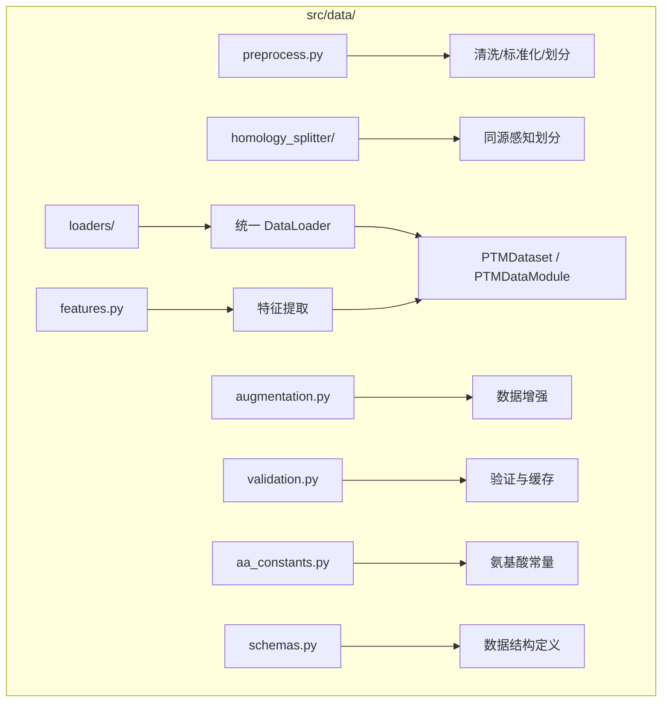
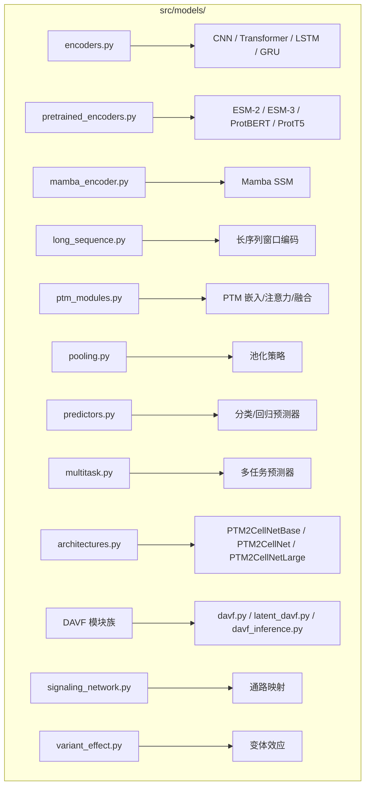
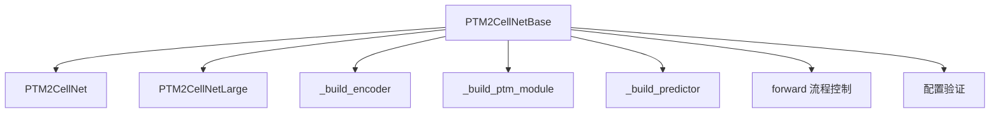
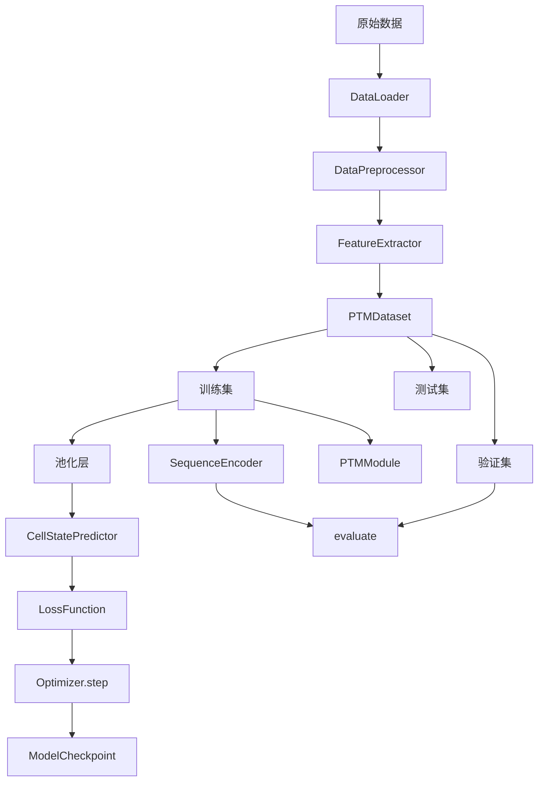
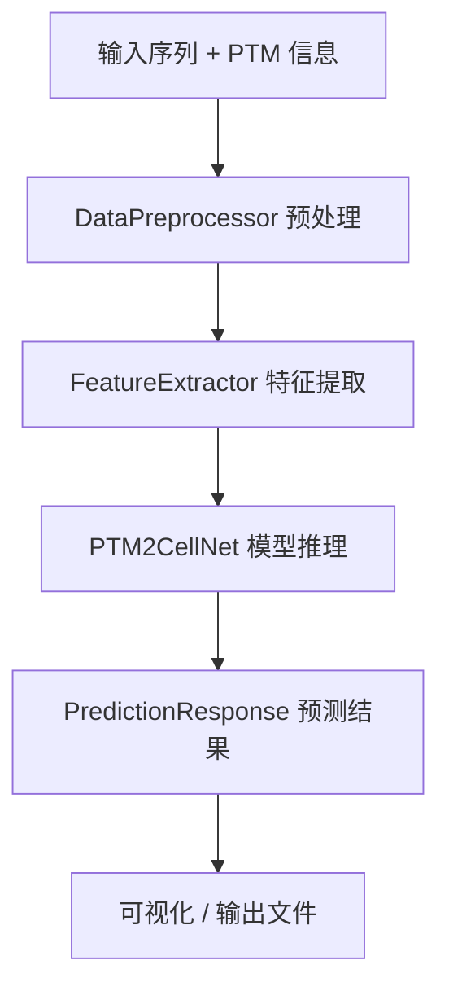
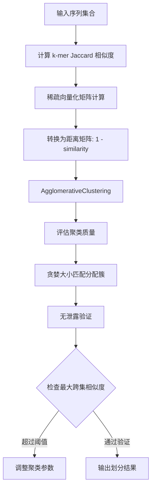
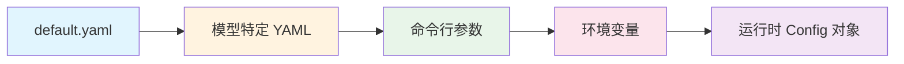

# PTM2CellNet 项目文档

> **文档版本**: v2.0  
> **最后更新**: 2026-07-11  
> **项目状态**: 积极开发中（src/ 93+ Python 文件, tests/ 100+ 文件, 单元测试 1531+）

---

## 目录

1. [代码架构说明](#chapter-1-代码架构说明)
2. [算法说明](#chapter-2-算法说明)
3. [安装指南](#chapter-3-安装指南)
4. [调试指南](#chapter-4-调试指南)
5. [配置说明](#chapter-5-配置说明)
6. [使用说明](#chapter-6-使用说明)

---

# Chapter 1: 代码架构说明

## 1.1 设计哲学

### 配置驱动架构（Configuration-Driven Architecture）

所有关键类统一接受 `config: Dict` 参数，实现 YAML 驱动的模型/训练/数据配置。这种设计模式带来以下优势：

- **关注点分离**：配置文件与业务代码完全分离
- **实验可重复**：每次实验的完整配置可被记录和复现
- **快速迭代**：修改参数无需修改源码
- **分层配置**：全局默认值（default.yaml）+ 环境特定覆盖 + 命令行覆盖

### 依赖注入（Dependency Injection）

模块之间通过接口依赖而非具体实现，便于测试和替换：

```python
# 编码器接口
class SequenceEncoder(nn.Module):
    def forward(self, sequences: torch.Tensor) -> torch.Tensor
    # 具体实现：CNNEncoder / TransformerEncoder / LSTMEncoder / MambaEncoder

# 预测器接口
class CellStatePredictor(nn.Module):
    def forward(self, features: torch.Tensor) -> Dict[str, torch.Tensor]
    # 具体实现：ClassificationPredictor / RegressionPredictor
```

### 事件驱动训练（Event-Driven Training）

训练过程使用回调机制处理各类事件：

- **ModelCheckpoint**：Top-K 检查点保存（含完整优化器状态）
- **EarlyStopping**：基于验证指标的提前停止
- **LearningRateMonitor**：学习率监控与日志
- **TensorBoardCallback**：训练指标可视化
- **ProgressBarCallback**：进度条显示

### 管道模式（Pipeline Pattern）

数据处理采用管道模式，各步骤独立可替换：

```
原始数据 → DataLoader → Preprocessor → FeatureExtractor → Dataset → 模型
```

### 延迟导入模式（Lazy Import Pattern）

`evaluation/__init__.py`、`analysis/__init__.py`、`integration/__init__.py` 使用 `LazyImport` 或 `__getattr__` 延迟加载具有可选依赖的模块：

```python
class LazyImport:
    """延迟导入包装器，避免依赖缺失时立即报错"""
    def __init__(self, module_path: str):
        self._module_path = module_path
        self._module = None

    def is_available(self) -> bool:
        try:
            self._load()
            return True
        except ImportError:
            return False
```

### 安全 IO 分层防御（Safe IO Layered Defense）

```
SafeUnpickler → safe_pickle_load → safe_torch_load
```
- **SafeUnpickler**：继承 `pickle.Unpickler`，重写 `find_class`，只加载白名单类
- **safe_pickle_load**：封装 SafeUnpickler，提供便捷调用
- **safe_torch_load**：在 `torch.load` 基础上增加白名单验证和文件大小校验

## 1.2 模块结构

项目包含 9 个顶层模块，位于 `src/` 下：

```
src/
├── data/          # 21 文件 + 3 子包 — 数据处理
├── models/        # 30 文件 + 1 子包 — 模型架构
├── training/      # 12 文件 — 训练管理
├── evaluation/    # 4 文件 — 评估指标
├── utils/         # 9 文件 — 通用工具
├── api/           # 9 文件 + 1 子包 — REST API
├── analysis/      # 5 文件 — 变体分析
├── integration/   # 6 文件 + 1 子包 — 第三方集成
└── project/       # 2 文件 — 项目管理
```

### 1.2.1 数据处理模块 `src/data/`

#### 架构概览



#### `loaders/` 子包 — 多继承数据加载器

数据加载器通过多继承组合多个 Mixin 类的功能：

```python
class DataLoader(
    FileLoaderMixin,          # CSV/FASTA/JSON 文件加载
    PTMDatabaseLoaderMixin,   # PhosphoSitePlus/dbPTM/CPLM 数据库
    UniProtLoaderMixin,       # UniProt REST API
    DataLoaderBase,           # 共享工具方法 + Protocol
):
    """统一数据加载器"""
```

| 文件 | 类/功能 | 说明 |
|------|---------|------|
| `loader.py` | `DataLoader` | 统一加载器入口 |
| `file_loaders.py` | `FileLoaderMixin` | CSV/FASTA/JSON 文件解析 |
| `uniprot_loader.py` | `UniProtLoaderMixin` | UniProt API 调用（URL 长度分块 + 安全下载） |
| `ptm_database_loaders.py` | `PTMDatabaseLoaderMixin` | PhosphoSitePlus / dbPTM / CPLM |
| `legacy_loaders.py` | — | 遗留版本兼容 |
| `types.py` | `UniProtRecord`, `UniProtRow`, `JsonRecord` | TypedDict 类型定义 |
| `base.py` | `DataLoaderBase` | 共享工具方法 + Protocol 协议 |

#### 数据预处理 — `preprocess.py`

`DataPreprocessor` 提供以下功能：

- **序列清洗**：去除非法氨基酸、标准化大小写
- **PTM 标签处理**：别名归一化、格式标准化
- **数据划分**：训练/验证/测试集划分（支持同源感知划分）
- **缺失值处理**：支持 `drop` / `fill` 策略

#### 特征工程 — `features.py`

`FeatureExtractor` 提供向量化的特征提取：

- **One-hot 编码**：21 氨基酸（20 标准 + 间隔），向量化批量操作 `extract_batch_onehot_sequence`
- **k-mer 频率**：支持 k=2, 3, 4，使用 `collections.Counter`
- **理化性质**：亲水性（mean/std/min/max）、电荷（sum/mean）、AA 组成频率，向量化查找表
- **降维**：PCA / SVD / tSNE
- **结构特征**：Chou-Fasman 螺旋/折叠/卷曲倾向性

#### 数据集定义 — `datasets.py` 及相关文件

| 文件 | 主要类 | 说明 |
|------|--------|------|
| `datasets.py` | `PTMDataset`, `PTMPlainDataModule`, `ESMTokenizedDataset` | 数据集与 DataModule |
| `dataset_base.py` | `PTMDatasetBase`, `DatasetConfig` | 基类与配置 Dataclass |
| `lightning_datamodule.py` | `PTMLightningDataModule` | Lightning DataModule（别名 `PTMDataModule`） |
| `multitask_dataset.py` | 多任务数据集 | 多任务联合训练 |
| `ptm_site_dataset.py` | PTM 位点数据集 | 位点级预解析 |

#### 数据增强 — `augmentation.py`

| 增强器 | 功能 |
|--------|------|
| `SequenceAugmenter` | 序列级增强（随机突变、插入、删除） |
| `PTMAugmenter` | PTM 级增强 |
| `DAVFSiteAugmenter` | DAVF 兼容的位点增强 |

#### 同源感知划分 — `homology_splitter/` 子包


| 文件 | 类/功能 | 说明 |
|------|---------|------|
| `similarity.py` | `SequenceSimilarityCalculator` | k-mer Jaccard + 局部比对 |
| `matrix.py` | 稀疏向量化 | 高效 k-mer Jaccard 矩阵计算 |
| `splitter.py` | `HomologyAwareSplitter` | 聚类 + 贪婪划分 |

#### 辅助模块

| 文件 | 功能 |
|------|------|
| `validation.py` | `DataValidator` + `DatasetCache`（pickle / safetensors 缓存） |
| `aa_constants.py` | 氨基酸常量单一事实来源 + `PTM_TYPE_ALIASES` + `normalize_ptm_type()` |
| `schemas.py` | `PTMSite` dataclass + `PTMSiteDict` TypedDict |
| `labels.py` | `derive_label_mapping` 工具函数 |

### 1.2.2 模型模块 `src/models/`

#### 架构概览



#### 编码器 — `encoders.py`

所有编码器继承自 `SequenceEncoder`（抽象基类 ABC）：

| 编码器 | 输出维度 | 时间复杂度 | 空间复杂度 |
|--------|---------|-----------|-----------|
| `CNNEncoder` | [B, L, d] | O(L·d²) | O(L·d) |
| `TransformerEncoder` | [B, L, d] | O(L²·d) | O(L² + L·d) |
| `LSTMEncoder` | [B, L, d] | O(L·d²) | O(L·d) |
| `GRUEncoder` | [B, L, d] | O(L·d²) | O(L·d) |

**Pooled 变体**（返回值通过池化压缩为固定向量）：
- `PooledCNNEncoder`
- `PooledTransformerEncoder`
- `PooledLSTMEncoder`

#### 预训练编码器 — `pretrained_encoders.py`

`PretrainedEncoder` 封装 HuggingFace 模型列表：

| 模型 | 参数量 | 推荐批次 | 精度 |
|------|--------|---------|------|
| ESM-2 8M | 8M | batch=32 | FP32 |
| ESM-2 35M | 35M | batch=8 | FP32 |
| ESM-2 150M | 150M | batch=16 | BF16 |
| ESM-2 650M | 650M | batch=8 | BF16 |
| ESM-3 Open Small | 1.4B | batch=4 | BF16, frozen |
| ProtBERT | ~470M | batch=16 | BF16 |
| ProtT5 | ~580M | batch=16 | BF16 |

#### Mamba SSM 编码器 — `mamba_encoder.py`

Mamba 编码器实现选择性状态空间模型，提供三种实现：

| 实现 | 适用场景 | 说明 |
|------|---------|------|
| `_ssm_step_fused` | GPU（推荐） | CUDA kernel via `mamba_ssm.selective_scan_fn`，最快 |
| `_ssm_step_parallel` | CPU/GPU | 向量化并行扫描（cumprod + cumsum），推荐的备选 |
| `_ssm_step_sequential` | 调试 | Python 循环，仅用于调试 |

特点：
- HiPPO-LegS 初始化 A 矩阵
- 输入依赖的 delta/B/C 投影（选择性机制）
- Depthwise 1D 因果卷积 → SiLU 激活 → SSM → 门控 → 输出投影
- **时间复杂度**：O(L·d)（线性于序列长度 — 关键优势）

#### 长序列处理 — `long_sequence.py`

针对超过模型最大长度限制的序列，采用窗口式编码策略：

- 序列分割为重叠窗口
- 各窗口独立编码
- 通过聚合（平均/注意力）融合为全局表示

#### PTM 融合模块 — `ptm_modules.py`

| 模块 | 机制 | 输入 | 输出 |
|------|------|------|------|
| `PTMEmbedding` | 类型嵌入 + 位置嵌入 → 求和 | (ptm_type_idx, position) | [B, L, d] |
| `PTMAttention` | 序列→PTM 交叉注意力 | (seq_emb, ptm_emb, mask) | [B, L, d] |
| `GatedPTMFusion` | 门控融合 gate = σ(W·[seq; ptm]) | (seq_emb, ptm_emb) | [B, L, d] |

**PTMAttention 安全机制**：安全处理全掩码序列（key_padding_mask），避免 NaN 传播。

#### 池化层 — `pooling.py`

| 池化策略 | 机制 | 适用场景 |
|---------|------|---------|
| `AttentionPooling` | 单一可学习查询向量 + 多头注意力 | 通用 |
| `MultiHeadAttentionPooling` | 多可学习查询向量 | 需要多视图 |
| `WeightedMeanPooling` | 加权求和（权重通过 Linear + softmax 学习） | 序列级加权 |

工厂函数 `create_pooling_layer()` 根据配置字符串创建对应池化层。

#### 预测器 — `predictors.py`

| 预测器 | 任务类型 | 输出 |
|--------|---------|------|
| `ClassificationPredictor` | 多分类 | logits [B, num_classes] |
| `RegressionPredictor` | 回归 | scores [B, 1] |

#### 多任务预测器 — `multitask.py`

| 预测器 | 功能 |
|--------|------|
| `MultiTaskPredictor` | 多个任务头共享 backbone |
| `HierarchicalMultiTaskPredictor` | 层级化多任务结构 |

#### 主架构 — `architectures.py`



`PTM2CellNetBase`（644 行）是抽象基类，消除两个具体实现间的代码重复：

| 类 | embed_dim | num_layers | 适用场景 |
|----|-----------|------------|---------|
| `PTM2CellNet` | 128 | 2 | 基础实验、快速原型 |
| `PTM2CellNetLarge` | 256 | 4 | 大规模数据、生产部署 |

前向传播流程：

```
输入批次 (sequence + PTM sites)
  → SequenceEncoder → 序列嵌入 [B, L, d]
  → PTMModule → PTM 特征 [B, L, ptm_dim]
  → 融合层（门控/注意力/拼接）
  → 池化 → 固定向量 [B, d]
  → [可选 DAVF 分支] → DAVF 特征 [B, 128]
  → CellStatePredictor → 分类/回归输出
```

#### 模型集成 — `ensemble.py`

`PTM2CellNetEnsemble` 支持三种聚合策略：

| 策略 | 机制 | 说明 |
|------|------|------|
| `mean` | 平均 logits | 简单高效 |
| `voting` | One-hot argmax → 投票 | 鲁棒性高 |
| `weighted` | 加权平均 logits | 需额外权重 |

#### DAVF 模块族

DAVF（Direction-Aware Velocity Field）是 PTM2CellNet 的特色功能，用于模拟基因扰动效应：

```mermaid
graph TD
    A[BiPerturbEncoder] --> B[方向编码 KO/KD/OE]
    B --> C[基因→方向交叉注意力]
    
    D[DAVF / LatentDAVF] --> E[速度场训练]
    E --> F[Flow Matching: x_t = (1-t)x_0 + t·x_1]
    E --> G[损失: MSE + 0.3·Mag + 0.1·Dir]
    
    H[DAVFInferenceModule] --> I[ODE 推理包装]
    I --> J[Euler 积分 num_steps 步]
    I --> K[输出: [B×128] 特征]
    
    L[DeltaPredictor] --> M[直接 MLP 替代 ODE]
    
    N[PTMDirectionMapper] --> O[PTM 类型→方向映射]
```

| 文件 | 类/功能 | 说明 |
|------|---------|------|
| `davf.py` | `DAVF` | Flow Matching 训练/推理 |
| `davf_encoder.py` | `DAVFConfig`, `TimeEncoder`, `GeneSpecificModulation` | DAVF 编码配置 |
| `davf_attention.py` | `DirectionAwareAttention` | 方向感知的多目标注意力 |
| `davf_losses.py` | `DAVFLoss`, `DirectionConsistencyLoss` | DAVF 损失函数 |
| `davf_velocity.py` | `ConditionalVelocityField` | 条件速度场 |
| `davf_inference.py` | `DAVFInferenceModule`, `DAVFInferenceConfig` | 推理封装 |
| `davf_checkpoint_utils.py` | save/load checkpoint | 检查点管理 |
| `latent_davf.py` | `LatentDAVF` | scVI 潜空间 DAVF |
| `delta_predictor.py` | `DeltaPredictor` | 直接 MLP 替代 ODE |
| `ptm_direction_mapper.py` | `PTMDirectionMapper`, `PTM_DIRECTION_MAP` | PTM 方向映射 |
| `biperturb.py` | `BiPerturbEncoder`, `BiPerturb`, `BiPerturbLoss` | 双扰动编码 |

**BiPerturbEncoder** 处理流程：

1. 方向编码：KO = -0.5, KD = -0.25, OE = +0.5（初始化值）
2. 交叉注意力：基因嵌入 → 方向嵌入
3. 输入投影：concat(gene, dir, optional mag) → Linear → hidden_dim
4. 方向调制：modulated = combined · (0.5 + σ(MLP(dir_emb)))
5. 方向感知多头目标注意力
6. 残差 + FFN + LayerNorm
7. 方向符号加权平均池化
8. 输出投影

#### 辅助模型模块

| 文件 | 功能 |
|------|------|
| `geneformer_embedding.py` | Geneformer 嵌入加载（向量化批量查找，失败时回退随机） |
| `scvi_adapter.py` | scVI 基因↔潜空间映射（可选依赖） |
| `signaling_network.py` | SignalingNetworkMapper（KEGG/Reactome 通路集成） |
| `variant_effect.py` | VariantPTMEffectPredictor（变体效应预测） |
| `external_tools/` | AlphaFoldClient, BLASTClient, ClustalWClient, PSIPREDClient |

### 1.2.3 训练模块 `src/training/`

```mermaid
graph TD
    subgraph "src/training/"
        A[trainers.py] --> B[Trainer 类 + train() 函数]
        C[lightning_module.py] --> D[PTM2CellNetLightning]
        E[ptm_site_lightning.py] --> F[PTM Site LightningModule]
        G[losses.py] --> H[Focal / Dice / MultiTask]
        I[optimizers.py] --> J[AdamW + 调度器]
        K[callbacks.py] --> L[Checkpoint / EarlyStop / TensorBoard]
        M[artifacts.py] --> N[推理产物导出]
        O[self_supervised.py] --> P[预训练]
    end
```

| 文件 | 主要功能 | 说明 |
|------|---------|------|
| `trainers.py` | `Trainer` 类 + 独立 `train()` 函数 | AMP / grad clip / 梯度累积 / warmup |
| `lightning_module.py` | `PTM2CellNetLightning` | Lightning 包装，支持 LoRA（通过 `peft_config.py`） |
| `ptm_site_lightning.py` | PTM Site LightningModule | PTM 位点级训练 |
| `losses.py` | `FocalLoss`, `DiceLoss`, `MultiTaskLoss` | Focal: `from_class_counts()` 工厂方法 |
| `optimizers.py` | `configure_optimizer()` | Adam/AdamW/SGD + Cosine/Plateau/Step 调度器 |
| `callbacks.py` | `Callback`, `ModelCheckpoint`, `EarlyStopping`, `LearningRateMonitor`, `TensorBoardCallback`, `ProgressBarCallback` | Top-K + 完整状态保存 |
| `artifacts.py` | `export_inference_artifact`, `write_artifact_manifest`, `evaluate_release_gate`, `dataset_hash` | 共享训练产物导出 |
| `self_supervised.py` | `MaskedPTMPrediction`, `pretrain_masked_ptm` | 掩码 PTM 预训练 |
| `peft_config.py` | LoRA/PEFT 配置 | 可选依赖 |
| `distributed.py` | 分布式训练辅助 | 多 GPU/多节点 |
| `amp_compat.py` | AMP 兼容性垫片 | PyTorch 版本兼容 |
| `logging_config.py` | `configure_default_logger`, `build_logger` | 日志配置 |

### 1.2.4 评估模块 `src/evaluation/`

```mermaid
graph TD
    subgraph "src/evaluation/"
        A[metrics.py] --> B[分类/回归/排序指标]
        A --> C[置信区间: bootstrap + t-dist]
        D[evaluators.py] --> E[evaluate() 函数]
        D --> F[cross_validate() 函数]
        G[explainers.py] --> H[LeaveOnePTMOut]
        G --> I[两阶段解释管道]
        J[visualization.py] --> K[ROC / PR / 混淆矩阵]
    end
```

#### 评估指标 — `metrics.py`

| 类别 | 指标 | 说明 |
|------|------|------|
| 分类 | `accuracy`, `precision`, `recall`, `F1`, `AUC-ROC`, `AUC-PR`, `MCC`, `confusion_matrix` | 完整分类评估 |
| 回归 | `MAE`, `MSE`, `RMSE`, `R²` | 回归评估 |
| 排序 | `NDCG`（cutoff k）, `MAP` | 排序质量 |
| 置信区间 | bootstrap（百分位法）, t-distribution（CV 折） | 不确定性量化 |
| 细分 | 按 PTM 类型分层评估 | — |

#### 评估器 — `evaluators.py`

提供独立函数（与 AGENTS.md 契约一致）：

- `evaluate(model, dataloader, device) → Dict[str, float]`：单次评估
- `cross_validate(model_class, dataset, n_splits) → Dict[str, np.ndarray]`：交叉验证
- `Evaluator` 类：封装评估流程

#### 解释器 — `explainers.py`

- `LeaveOnePTMOutScorer`：逐一排除每个 PTM 位点，评估其对预测的影响
- `TwoStageExplanationPipeline`：三遍流程（Score → GenKI batch → Aggregate）

### 1.2.5 工具模块 `src/utils/`

| 文件 | 主要功能 | 说明 |
|------|---------|------|
| `config.py` | `Config` 类 | YAML 加载、字典访问 |
| `logging.py` | `setup_logger()` | 文本 + JSON 格式 |
| `io.py` | `safe_torch_load`, save/load pickle, save/load model, HDF5 | 文件 IO |
| `safe_io.py` | `SafeUnpickler`, `safe_pickle_load` | 沙盒化反序列化 |
| `helpers.py` | `validate_sequence`, `validate_ptm_site`, `clean_sequence` | 序列验证 |
| `checkpoint_utils.py` | `load_checkpoint_with_config`, `resolve_inference_config`, `diagnose_mismatch` | 检查点工具 |
| `dependency_check.py` | `DependencyStatus`, `assert_scvi_available`, `check_dependency` | 依赖检查 |
| `lazy_import.py` | `LazyImport` 类 | 延迟导入 |
| `runtime.py` | `bootstrap_runtime` | 运行时启动 |

### 1.2.6 API 模块 `src/api/`

#### API 中间件栈

```
Request → RequestBodySizeLimit (10MB) → RateLimit (600rpm/60burst) → 
OptionalAuth (API key) → Metrics → CORS → Route Handler
```

| 文件 | 主要功能 | 说明 |
|------|---------|------|
| `app.py` | `create_app()` 工厂 + `lifespan` 上下文 + 模块级 `app` 实例 | 应用入口 |
| `autoinit.py` | 自动初始化 | 启动时加载模型 |
| `schemas.py` | Pydantic 模型 | PTMSite(gene_symbol), PredictionRequest(use_davf) |
| `middleware.py` | `_RequestBodySizeLimitMiddleware`, `_RateLimitMiddleware`, `_OptionalAuthMiddleware`, `_MetricsMiddleware` | 中间件栈 |
| `monitoring.py` | `/metrics` + `/health/detailed` | 可观测性 |
| `production_security.py` | 生产安全配置 | 安全加固 |
| `routes/` | predictions.py, initialize.py, state.py, model_info.py | 路由处理 |

#### Pydantic Schemas — `schemas.py`

核心数据模型：

```python
class PTMSite(BaseModel):
    position: int
    type: str
    amino_acid: str
    gene_symbol: Optional[str] = None  # 新增

class PredictionRequest(BaseModel):
    sequence: str
    ptm_sites: List[PTMSite]
    use_davf: bool = False  # 新增
```

### 1.2.7 分析模块 `src/analysis/`

| 文件 | 主要类 | 说明 |
|------|--------|------|
| `variant_parser.py` | `HGVSVariantParser`, `VariantComponents` | HGVS 格式解析 |
| `variant_workflow.py` | `VariantEffectWorkflow`, `VariantEffectResult` | 变体效应工作流 |
| `gene_mapper.py` | `GeneMapper`, `_RequestsUniProtMapper` | 基因映射 |
| `pathway_integration.py` | `PathwayDatabaseIntegration` | 通路整合 |
| `pdc_client.py` | `PDCClient` | PDC 数据客户端 |

### 1.2.8 集成模块 `src/integration/`

| 文件 | 主要类/功能 | 说明 |
|------|-------------|------|
| `contracts.py` | `CandidateRecord`, `GenePerturbationRequest`, `PerturbationResult` | 集成契约 |
| `genki_adapter.py` | `GenKIAdapter` | GenKI 扰动模拟门面 |
| `genki_reports.py` | Result rendering | Markdown / DataFrame / GSEA 输出 |
| `ptm_gene_mapper.py` | `ProteinGeneMapper` | 蛋白质↔基因映射 |
| `ptm_virtual_perturbation.py` | `PTMPerturbationProfile`, `apply_soft_perturbation` | PTM 虚拟扰动 |
| `genki/` | `graph_utils.py`, `perturbation.py`, `reference_data.py`, `significance.py` | GenKI 子包 |

### 1.2.9 项目管理模块 `src/project/`

| 文件 | 功能 | 说明 |
|------|------|------|
| `scope.py` | `DeferredFeature`, `CancelledFeature`, `DEFERRED_FEATURES`, `CANCELLED_FEATURES` | 功能状态追踪 |

## 1.3 核心数据流

### 端到端训练数据流



### 推理数据流


### 预测数据流



## 1.4 关键设计决策

| # | 决策 | 理由 |
|---|------|------|
| 1 | PTM2CellNetBase 抽象基类 | 消除 PTM2CellNet/PTM2CellNetLarge 代码重复（644 行复用） |
| 2 | 多继承 DataLoader | 组合 FileLoaderMixin + PTMDatabaseLoaderMixin + UniProtLoaderMixin |
| 3 | LazyImport 模式 | 避免可选依赖缺失导致的硬失败 |
| 4 | SafeUnpickler + safe_torch_load 分层防御 | 反序列化攻击防护 |
| 5 | DAVF 双模式（scvi_latent / gene） | 适应不同粒度需求 |
| 6 | Geneformer 批量查找向量化 | 消除嵌套 Python 循环，提升性能 |
| 7 | 同源感知划分：稀疏 k-mer Jaccard + AgglomerativeClustering | 避免数据泄露 |

---

# Chapter 2: 算法说明

## 2.1 序列编码算法

### 2.1.1 CNN 编码器

```
输入序列 [B, L]
  → Embedding(vocab_size → embed_dim) [B, L, d]
  → Conv1d(in=d, out=d, kernel=3, padding=1) [B, d, L]
  → Dropout [B, d, L]
  → Transpose [B, L, d]
```

- **机制**：多尺度 1D 卷积（kernel size 3, padding 1）
- **时间复杂度**：O(L × d²)
- **空间复杂度**：O(L × d)

### 2.1.2 Transformer 编码器

```
输入序列 [B, L]
  → Embedding [B, L, d]
  → PositionalEncoding（正弦/可学习）[B, L, d]
  → N × TransformerEncoderLayer:
       Multi-head Self-Attention → Dropout → Residual → LayerNorm
       FFN → Dropout → Residual → LayerNorm
  → 输出 [B, L, d]
```

- **位置编码**：正弦位置编码或可学习位置编码（PyTorch 版本兼容）
- **设置**：`batch_first=True`（旧版 PyTorch 有回退方案）
- **时间复杂度**：O(L² × d)（自注意力主导）
- **空间复杂度**：O(L² + L × d)

### 2.1.3 LSTM / GRU 编码器

```
输入序列 [B, L]
  → Embedding [B, L, d]
  → BiLSTM/BiGRU [B, L, 2×hidden]
  → Linear(2×hidden → d) [B, L, d]
```

- **机制**：双向循环网络
- **时间复杂度**：O(L × d²)
- **空间复杂度**：O(L × d)

### 2.1.4 Mamba SSM 编码器

Mamba 基于选择性状态空间模型，是 Transformer 在长序列任务上的高效替代方案。

#### 核心机制

```
输入 [B, L, d]
  → Depthwise 1D 因果卷积
  → SiLU 激活
  → 选择性 SSM（输入依赖的 Δ/B/C 投影）
  → 门控（SiLU 激活的残差分支）
  → 输出投影 [B, L, d]
```

#### SSM 状态方程

```
h'(t) = A·h(t) + B·x(t)    （状态演化）
y(t)  = C·h(t)              （输出投影）
```

其中 A, B, C 是输入依赖的（选择性机制），Δ 控制离散化步长。

#### 三种实现

| 实现 | 描述 | 适用场景 |
|------|------|---------|
| `_ssm_step_fused` | CUDA kernel via `mamba_ssm.selective_scan_fn` | GPU，最快 |
| `_ssm_step_parallel` | 向量化并行扫描（cumprod + cumsum） | CPU/GPU 均可 |
| `_ssm_step_sequential` | Python 逐步循环 | 仅调试 |

- **初始化**：HiPPO-LegS 初始化 A 矩阵
- **时间复杂度**：O(L × d)（线性于序列长度 — Mamba 的核心优势）
- **空间复杂度**：O(L × d + N × d)，其中 N = state_dim

#### 配置示例（mamba_small_gpu.yaml）

```yaml
model:
  encoder_type: "mamba"
  hidden_dim: 256
  num_layers: 6
  state_dim: 16
  conv_kernel: 4
  expand_factor: 2
```

## 2.2 PTM 融合算法

### 2.2.1 PTMEmbedding

```
PTM 类型索引 + 位置索引 → Embedding + Embedding → 求和 → Dropout
输入: ptm_types [B, L], positions [B, L]
输出: [B, L, embed_dim]
```

### 2.2.2 PTMAttention（交叉注意力）

```
序列嵌入 [B, L, d] ← 注意力 ← PTM 嵌入 [B, L, d]  （key/value）
  → 通过 key_padding_mask 处理掩码
  → 残差 + LayerNorm
```

安全机制：正确处理全掩码序列，避免 NaN 传播。

### 2.2.3 GatedPTMFusion

```python
gate = sigmoid(W_g @ concat(seq_emb, ptm_emb))
fused = gate * seq_emb + (1 - gate) * ptm_emb
# 可选：残差连接 + LayerNorm
```

- **门控机制**：可学习的软门控，控制序列特征和 PTM 特征的融合比例
- **参数更新**：通过反向传播端到端学习

## 2.3 池化算法

### 2.3.1 AttentionPooling

- **机制**：单一可学习查询向量 + 多头注意力
- 输入序列 [B, L, d] → 与查询向量 Q 计算注意力权重
- Xavier 初始化 key_proj / value_proj / out_proj
- 支持 attention mask

### 2.3.2 MultiHeadAttentionPooling

- **机制**：多个可学习查询向量
- 通过 `nn.MultiheadAttention` 实现
- 若 num_queries > 1，额外通过 Linear 聚合

### 2.3.3 WeightedMeanPooling

- **机制**：每个位置可学习的权重
- 权重 = softmax(Linear(hidden_dim → 1))
- 加权求和

## 2.4 DAVF（方向感知速度场）

### 2.4.1 Flow Matching 训练

```
x_0 (初始细胞状态) + x_1 (扰动后目标状态)
  → t ~ U(0,1)                              # 采样时间步
  → x_t = (1-t)·x_0 + t·x_1                 # 线性插值
  → v(x_t, t, gene_ids, directions)         # 预测速度场
  → Loss = MSE(v_t, u_t) + 0.3·MagLoss + 0.1·DirLoss
    其中 u_t = x_1 - x_0                    # 目标速度
```

### 2.4.2 ODE 推理

```
x_0 + gene_ids + directions
  → Euler 积分（num_steps 步）
  → x_1_pred = 扰动预测结果
```

### 2.4.3 DAVF 损失组件

| 损失 | 权重 | 目的 |
|------|------|------|
| MSE Loss | 1.0 | 速度方向准确性 |
| Magnitude Loss | 0.3 | 预测幅度匹配真实幅度 |
| Direction Loss | 0.1 | 符号一致性（余弦相似度） |

**自适应权重策略**：训练过程中 MSE 权重衰减，幅度和方向权重递增。

### 2.4.4 DAVF 检查点保存格式

```python
checkpoint = {
    'epoch': int,
    'model_state_dict': dict,
    'optimizer_state_dict': dict,
    'config': DAVFConfig,
    'best_val_loss': float,
    'gene_vocab': dict,        # 基因词汇表
    'direction_vocab': dict,   # 方向词汇表
}
```

### 2.4.5 BiPerturbEncoder 详细步骤

```
1. 方向编码:
   - KO  → -0.5 (初始化)
   - KD  → -0.25
   - OE  → +0.5
   
2. 交叉注意力: 基因嵌入 → 方向嵌入

3. 输入投影:
   combined = concat(gene_emb, dir_emb, [mag_emb])
   projected = Linear(combined)

4. 方向调制:
   modulated = projected · (0.5 + sigmoid(MLP(dir_emb)))

5. DirectionAwareAttention: 方向感知的多目标注意力

6. 残差 + FFN + LayerNorm

7. 方向符号加权平均池化

8. 输出投影
```

### 2.4.6 BiPerturbLoss 组件

- **MSE**：回归损失
- **Pearson correlation**：相关性损失
- **Direction consistency**：方向一致性（惩罚符号不一致）

## 2.5 同源感知划分

### 2.5.1 算法流程



### 2.5.2 k-mer Jaccard 相似度

```
J(A, B) = |kmer(A) ∩ kmer(B)| / |kmer(A) ∪ kmer(B)|
```

- **默认 k=3**（三肽指纹）
- **稀疏向量化实现**：高效处理大量序列
- **阈值**：相似度 > 0.8 视为同源

## 2.6 特征提取算法

### 2.6.1 One-hot 编码

- **词汇表**：21 氨基酸（20 标准 + 间隔 gap）
- **表示**：每个残基 → 21 维 one-hot 向量
- **批量操作**：`extract_batch_onehot_sequence()` 向量化实现

### 2.6.2 k-mer 频率特征

- 使用 `collections.Counter` 统计 k-mer 频率
- 支持 k = 2（二肽）、k = 3（三肽）、k = 4（四肽）

### 2.6.3 理化特征

| 特征 | 计算方式 | 说明 |
|------|---------|------|
| 亲水性 | mean / std / min / max | KYTE-DOOLITTLE 标度 |
| 电荷 | sum / mean | 等电点相关 |
| AA 组成 | 频率 | 20 种氨基酸比例 |

**向量化实现**：通过查找表批量计算，避免逐序列循环。

### 2.6.4 结构特征

- **Chou-Fasman 倾向性**：螺旋 / 折叠 / 卷曲
- **第三方工具回退**：AlphaFold / PSIPRED（通过 `external_tools/`）

## 2.7 损失函数

### 2.7.1 FocalLoss

```
FL(p_t) = -α_t · (1 - p_t)^γ · log(p_t)
```

- **γ（聚焦参数）**：降低易分类样本的损失贡献
- **α_t（类别权重）**：通过 `from_class_counts()` 工厂方法基于逆频率计算
- **适用场景**：类别不平衡的分类任务

### 2.7.2 DiceLoss

```
DL = (2·|X∩Y| + smooth) / (|X| + |Y| + smooth)
```

- **适用场景**：分割任务、正样本稀疏的场景
- **smooth**：防止除零

### 2.7.3 MultiTaskLoss

```python
MultiTaskLoss = sum(w_i * loss_i for i in tasks)
```

- 多个损失函数的加权组合
- 权重可通过配置或自动学习

## 2.8 评估指标

### 2.8.1 排序指标

#### NDCG（Normalized Discounted Cumulative Gain）

```
NDCG@k = DCG@k / IDCG@k
DCG@k = Σ (2^rel_i - 1) / log₂(i + 1)
```

- cutoff k 可配置

#### MAP（Mean Average Precision）

```
AP = Σ (P@k · rel_k) / (relevant items count)
MAP = mean(AP over all queries)
```

### 2.8.2 置信区间

| 方法 | 机制 | 适用 |
|------|------|------|
| Bootstrap CI | 百分位法重采样 | 单次评估结果 |
| Cross-validation CI | t-分布 CI + 正态近似回退 | CV 折评估 |

## 2.9 模型集成聚合

| 策略 | 计算方式 | 特性 |
|------|---------|------|
| Mean | `mean(logits₁, ..., logitsₙ)` | 简单，无额外参数 |
| Voting | One-hot → argmax → sum → argmax | 鲁棒性高 |
| Weighted | `Σ w_i · logits_i` | 需额外学习或设定权重 |

---

# Chapter 3: 安装指南

## 3.1 环境要求

| 项目 | 最低要求 | 推荐 |
|------|---------|------|
| Python | >= 3.10 | 3.10 ~ 3.12 |
| PyTorch | >= 2.0, < 3.0 | 2.4.1 |
| CUDA | 11.7+（GPU 训练） | 11.8 / 12.1 |
| RAM | 16 GB（CPU 推理） | 32 GB+ |
| GPU VRAM | 8 GB（GPU 训练） | 24 GB+ |
| OS | Linux / macOS / Windows* | Linux |

> *Windows 支持有限，推荐使用 WSL2 或 Docker

## 3.2 依赖文件

项目使用 8 个依赖文件，按功能分层：

### requirements-core.txt（28 个依赖）

核心依赖，适用于所有场景：

```
numpy<2
pandas
scipy
torch>=2,<3
scikit-learn
torchmetrics
networkx
biopython
datasketch
matplotlib
seaborn
pyyaml
tqdm
h5py
requests
fastapi
uvicorn
pydantic
starlette
joblib
safetensors
setuptools>=68,<81
```

### requirements-pretrained.txt（+core）

预训练模型支持：

```
transformers
peft
einops
lightning
torchmetrics
tensorboard
esm>=3
```

### requirements-mamba.txt（+core）

Mamba SSM 编码器（要求 CUDA）：

```
mamba-ssm
lion-pytorch
einops
```

### requirements-analysis.txt（+core）

变体与通路分析：

```
anndata>=0.10,<0.12
sspa
scvi-tools
zarr<3
hgvs
uniprot-id-mapper
UniProtMapper
torch-geometric
sphinx
```

### requirements-dev.txt

开发工具：

```
types-requests
types-PyYAML
types-setuptools
ruff
mypy
```

### requirements-docs.txt

文档构建：

```
sphinx>=7
myst-parser
sphinx-rtd-theme
```

### requirements-lock.txt（275 行）

完全锁定版本的生产环境依赖：

```
torch==2.4.1+cu118
lightning==2.6.5
transformers==4.57.6
numpy==2.4.3
pandas==2.3.3
scikit-learn==1.8.0
```

### requirements.txt

聚合 `core + pretrained` 的全量依赖。

## 3.3 安装步骤

### 基础安装

```bash
git clone <repo-url>
cd PTM2CellNet

# 方式一：仅核心功能
pip install -r requirements-core.txt

# 方式二：包含预训练模型
pip install -r requirements-pretrained.txt

# 方式三：包含 Mamba SSM（需 CUDA）
pip install -r requirements-mamba.txt

# 方式四：包含分析工具
pip install -r requirements-analysis.txt

# 开发工具
pip install -r requirements-dev.txt
```

### 可编辑安装（开发模式）

```bash
# 核心安装
pip install -e .

# 各功能附加安装
pip install -e ".[pretrained]"      # ESM-2, ESM-3, ProtBERT, ProtT5
pip install -e ".[mamba]"           # mamba-ssm, causal-conv1d
pip install -e ".[analysis]"        # sspa, anndata, UniProtMapper
pip install -e ".[genki]"           # torch-geometric, scvi-tools
pip install -e ".[api]"             # fastapi, uvicorn, pydantic
pip install -e ".[all]"             # 全部安装
```

### ESM-3 安装

```bash
pip install esm>=3.0.0
# 下载权重至 checkpoints/esm3/（约 5.27 GB 总量）
```

### 锁定版本安装

```bash
# 解决依赖冲突时使用完全锁定版本
pip install -r requirements-lock.txt
```

## 3.4 Docker 部署

### Dockerfile 配置

| 项目 | 值 |
|------|-----|
| 基础镜像 | python:3.10-slim |
| 构建参数 | INSTALL_PRETRAINED=0, INSTALL_MAMBA=0, INSTALL_ANALYSIS=0 |
| 安全 | 非 root 用户 appuser（UID 1000） |
| 健康检查 | `curl -f http://localhost:8000/api/v1/ready`（30s 启动期） |
| 启动命令 | `uvicorn src.api.app:app --host 0.0.0.0 --port 8000 --workers 4` |

### Docker Compose

```yaml
# docker-compose.yml 核心配置
services:
  ptm2cellnet:
    build: .
    ports:
      - "8000:8000"
    environment:
      - PYTHONUNBUFFERED=1
      - HF_ENDPOINT=https://hf-mirror.com
      - PTM2CELLNET_CHECKPOINT=/app/checkpoints/best_model.pt
      - PTM2CELLNET_CONFIG=/app/configs/production.yaml
    volumes:
      - ./checkpoints:/app/checkpoints
      - ./configs:/app/configs
```

```bash
# 启动
docker-compose up -d

# API 地址: http://localhost:8000
# 健康检查: http://localhost:8000/health
```

## 3.5 兼容性说明

| 依赖项 | 限制 | 原因 |
|--------|------|------|
| numpy | < 2 | 核心依赖锁定 |
| anndata | < 0.12 | scvi-tools 兼容性 |
| setuptools | >= 68, < 81 | 保持 pkg_resources 可用 |
| mamba-ssm | 需 CUDA | GPU 专属；CPU 回退使用 `_ssm_step_parallel` |
| ESM-3 | 导入失败回退 ESM-2 | 自动降级 |
| mypy | 10 文件 ignore-errors | 技术债（非阻断） |

---

# Chapter 4: 调试指南

## 4.1 常见问题与解决方案

### CUDA Out of Memory（显存不足）

```bash
# 方案一：减小 batch_size
python scripts/train.py --config configs/mamba_small_gpu.yaml --batch-size 8

# 方案二：使用 CPU
python scripts/train.py --device cpu

# 方案三：使用梯度累积（配置文件中设置）
# training.accumulate_grad_batches: 4
```

**显存估算**（以 embed_dim=256 为例）：
| 模型 | batch=16 | batch=32 | batch=64 |
|------|---------|---------|---------|
| CNN | ~2 GB | ~3 GB | ~5 GB |
| Transformer | ~4 GB | ~7 GB | ~12 GB |
| Mamba | ~3 GB | ~5 GB | ~9 GB |
| ESM-2 150M | ~8 GB | ~14 GB | — |
| ESM-2 650M | ~14 GB | — | — |

### ESM-3 Import 失败

```bash
# 检查 ESM 版本
python -c "import esm; print(esm.__version__)"

# 如果 ESM-3 不可用，系统自动回退到 ESM-2
# 日志输出: "Failed to import esm3, falling back to esm2"
```

### 测试失败

```bash
# 确认使用正确的 Python 环境
which python3

# 通过 python3 -m pytest 而非 bare pytest
python3 -m pytest tests/unit -q

# 常见失败原因：
# 1. 缺少测试数据 → 运行 tests/download_fixtures.sh
# 2. 版本不匹配 → pip install -r requirements-lock.txt
# 3. 硬件不兼容 → 调整测试配置
```

### Mamba SSM 不可用

```bash
# mamba-ssm 要求 CUDA，在 CPU 上不可用
# 回退方案：_ssm_step_parallel（向量化并行扫描）
# 该实现使用 cumprod + cumsum，在 CPU 和 GPU 上均可工作
# 调试回退：_ssm_step_sequential（Python 循环，仅调试用）
```

### 依赖冲突

```bash
# 使用完全锁定版本
pip install -r requirements-lock.txt

# 检查已安装包
pip list | grep -E "torch|lightning|transformers"

# 清理冲突
pip uninstall -y <conflicting-package> && pip install -r requirements-lock.txt
```

### 模型加载失败

```bash
# 检查 checkpoint 路径
ls -la outputs/models/best_model.pt

# 检查 checkpoint 格式
python -c "import torch; ckpt = torch.load('outputs/models/best_model.pt', map_location='cpu'); print(type(ckpt), list(ckpt.keys())[:5])"

# 维度不匹配 → 使用 diagnose_mismatch 工具
python -c "from src.utils.checkpoint_utils import diagnose_mismatch; diagnose_mismatch('outputs/models/best_model.pt', model)"
```

## 4.2 调试命令

### 测试运行

```bash
# 单元测试（1531+）
python3 -m pytest tests/unit -q

# 集成测试（67+）
python3 -m pytest tests/integration -q

# E2E 测试（42+）
python3 -m pytest tests/e2e -q

# 真实资产验收测试（需要权重文件）
PTM2CELLNET_RUN_REAL_ASSET_TESTS=1 python3 -m pytest tests/real_assets/ -v

# 指定测试文件
python3 -m pytest tests/unit/test_architectures.py -v

# 指定测试函数
python3 -m pytest tests/unit/test_architectures.py::test_ptm2cellnet_forward -v
```

### 代码质量检查

```bash
# 代码风格检查
ruff check .

# 类型检查
python3 -m mypy src --show-error-codes

# 全量 CI 检查
ruff check . && python3 -m mypy src && python3 -m pytest tests/unit -q
```

### 调试运行时

```bash
# 详细日志模式
LOG_LEVEL=DEBUG python scripts/train.py --config configs/default.yaml

# 单步调试
python -m pdb scripts/train.py --config configs/default.yaml

# 追踪张量形状
TORCH_DISTRIBUTED_DEBUG=DETAIL python scripts/train.py --config configs/default.yaml
```

## 4.3 日志系统

### 日志配置

```python
from src.utils.logging import setup_logger

# 设置日志器
logger = setup_logger(
    name="ptm2cellnet",
    log_file="outputs/logs/training.log",
    level=logging.INFO
)
```

- **控制台 + 文件双重输出**
- **JSON 格式选项**（适合日志聚合系统）
- **默认级别**：INFO

### 关键日志消息

| 消息 | 级别 | 触发场景 |
|------|------|---------|
| "PTM2CellNet API 启动" | INFO | API 服务启动 |
| "PTM2CellNet API 关闭" | INFO | API 服务关闭 |
| "Rate limiting enabled/disabled" | INFO | 限流中间件状态 |
| "API-key authentication enabled/disabled" | INFO | 认证中间件状态 |
| "Strict model assets mode enabled" | INFO | 严格资产模式启动 |
| "PTM site at position %d skipped by DAVF" | DEBUG | DAVF 输入验证跳过 |
| "Optional pathway analysis failed: %s" | WARNING | 通路分析非关键失败 |

### 日志级别指南

| 级别 | 用途 |
|------|------|
| DEBUG | 每位点 DAVF 跳过原因、详细预处理步骤 |
| INFO | API 生命周期、中间件状态、模型加载 |
| WARNING | 无效 PTM 位点跳过、通路分析失败、CORS 安全警告 |
| ERROR | 模型输出错误、未处理异常 |

## 4.4 远程调试

```bash
# API 调试（单 worker）
uvicorn src.api.app:app --host 0.0.0.0 --port 8000 --workers 1 --log-level debug

# Docker 开发模式（挂载源码）
docker run -v $(pwd)/src:/app/src ptm2cellnet:latest

# 远程 PDB
python -m pdb -c "from src.api.app import app; import uvicorn; uvicorn.run(app, host='0.0.0.0', port=8000)"
```

## 4.5 性能调试

### Prometheus 监控端点

`GET /api/v1/metrics` 提供以下指标：

| 指标 | 类型 | 说明 |
|------|------|------|
| `http_requests_total` | Counter | 总请求数（按 method/path/status 标注） |
| `http_request_duration_seconds` | Histogram | 请求延迟（p50/p95/p99 + 桶分布） |
| `http_errors_total` | Counter | 错误请求数 |
| `model_inference_duration_seconds` | Histogram | 模型推理延迟 |

### TensorBoard 监控

```bash
tensorboard --logdir outputs/logs/tensorboard/
```

监控指标：
- `train_loss` / `val_loss` — 训练/验证损失
- `train_acc` / `val_acc` — 训练/验证准确率
- `learning_rate` — 学习率变化

### GPU 监控

```bash
# 实时监控
watch -n 1 nvidia-smi

# 程序内获取
python -c "
from src.utils.runtime import bootstrap_runtime
stats = bootstrap_runtime()
print(f'GPU 利用率: {stats.gpu_utilization_pct}%')
print(f'显存分配: {stats.gpu_memory_allocated_mb} MB')
print(f'显存预留: {stats.gpu_memory_reserved_mb} MB')
"
```

### 模型信息查询

```bash
curl http://localhost:8000/api/v1/model/info
# 返回: encoder_type, embed_dim, num_classes, model_kind
```

---

# Chapter 5: 配置说明

## 5.1 配置层次结构

```
configs/
├── default.yaml                     # 全局默认值
├── production.yaml                  # 生产服务器
├── lightning.yaml                   # PyTorch Lightning
├── davf_integration.yaml            # DAVF 推理
│
├── mamba.yaml                       # Mamba Medium（hidden=768, 12层）
├── mamba_large.yaml                 # Mamba Large（hidden=1024, 24层）
├── mamba_small.yaml                 # Mamba Small（hidden=256, 6层）
├── mamba_small_gpu.yaml             # Mamba Small GPU（seq_len=500）
├── mamba_tiny_gpu.yaml              # Mamba Tiny（hidden=128, 2层）
├── mamba_sd4.yaml                   # Mamba state_dim=4 实验
├── mamba_gated_fusion.yaml          # Mamba + 门控 PTM 融合
├── cnn_gated_fusion_112k.yaml       # CNN + 门控融合（112k 数据集）
├── lstm_small_gpu.yaml              # LSTM Small GPU（双向, 6层）
├── transformer_small_gpu.yaml       # Transformer Small GPU（6层, 8头）
│
├── model/
│   ├── ptm2cellnet_base.yaml        # Transformer + 门控融合, hidden=256
│   ├── ptm2cellnet_large.yaml       # hidden=512, 8层, seq_len=1000
│   └── ptm2cellnet_mamba.yaml       # Mamba 变体 + 门控融合
│
├── smoke/
│   ├── cnn_cpu.yaml                 # 烟雾测试（CNN, 1 epoch, CPU）
│   └── lightning_cnn_cpu.yaml       # Lightning 烟雾测试
│
├── pretrained/
│   ├── esm2_8m.yaml                 # ESM-2 8M
│   ├── esm2_35m.yaml                # ESM-2 35M
│   ├── esm2_150m.yaml               # ESM-2 150M
│   ├── esm2_650m.yaml               # ESM-2 650M
│   ├── esm3_sm_open.yaml            # ESM-3 Open Small 1.4B
│   └── protbert.yaml                # ProtBERT
│
├── research/
│   └── transformer.yaml             # 研究配置（6层, 256 hidden）
│
├── training/
│   └── finetune_binary.yaml         # 二分类微调
│
└── integration/
    ├── two_stage_explanation.yaml   # 两阶段解释
    └── ptm_virtual_perturbation.yaml # PTM 虚拟扰动
```

### 配置加载优先级



优先级从低到高：**default.yaml < 模型特定 YAML < 命令行参数 < 环境变量**

## 5.2 核心配置项

### Model 配置（default.yaml）

| 键 | 类型 | 默认值 | 说明 | 可选值 |
|---|------|--------|------|--------|
| `model.encoder_type` | str | `"transformer"` | 编码器类型 | `cnn` / `transformer` / `lstm` / `gru` / `mamba` / `esm2_*` / `esm3_*` / `protbert` / `prott5` |
| `model.vocab_size` | int | 21 | 氨基酸词汇表大小 | 20（标准）+ 1（gap） |
| `model.embed_dim` | int | 128 | 嵌入维度 | 64 ~ 1024 |
| `model.num_layers` | int | 4 | 编码器层数 | 1 ~ 24 |
| `model.num_heads` | int | 8 | 注意力头数（transformer） | 需整除 embed_dim |
| `model.dropout` | float | 0.1 | Dropout 率 | 0.0 ~ 0.5 |
| `model.ptm_fusion_type` | str | `"attention"` | PTM 融合类型 | `attention` / `gated` / `concat` |
| `model.task_type` | str | `"classification"` | 任务类型 | `classification` / `regression` |
| `model.num_classes` | int | 4 | 输出类别数 | 根据任务设置 |
| `model.hidden_multiplier` | int | 2 | 预测器 MLP 乘数 | 1 ~ 4 |

### Training 配置（default.yaml）

| 键 | 类型 | 默认值 | 说明 |
|---|------|--------|------|
| `training.batch_size` | int | 32 | 批次大小 |
| `training.epochs` | int | 50 | 训练轮数 |
| `training.learning_rate` | float | 0.001 | 学习率 |
| `training.optimizer` | str | `"adamw"` | 优化器（adam / adamw / sgd） |
| `training.scheduler` | str | `"cosine"` | 学习率调度器（cosine / plateau / step） |
| `training.grad_clip_norm` | float | 1.0 | 梯度裁剪范数 |
| `training.use_amp` | bool | true | 是否使用自动混合精度 |
| `training.seed` | int | 42 | 随机种子 |
| `training.weight_decay` | float | 0.01 | 权重衰减 |
| `training.accumulate_grad_batches` | int | 1 | 梯度累积步数 |
| `training.loss_type` | str | `"cross_entropy"` | 损失函数类型 |
| `training.focal_gamma` | float | 2.0 | Focal Loss γ 参数 |
| `training.label_smoothing` | float | 0.0 | 标签平滑 |

### Data 配置（default.yaml）

| 键 | 类型 | 默认值 | 说明 |
|---|------|--------|------|
| `data.max_sequence_length` | int | 1000 | 最大序列长度 |
| `data.valid_amino_acids` | str | `"ACDEFGHIKLMNPQRSTVWY"` | 有效氨基酸集合 |
| `data.preprocessing.remove_duplicates` | bool | true | 是否去重 |
| `data.preprocessing.handle_missing` | str | `"drop"` | 缺失值策略（drop / fill） |
| `data.split.train_ratio` | float | 0.8 | 训练集比例 |
| `data.split.val_ratio` | float | 0.1 | 验证集比例 |
| `data.homology_split.enabled` | bool | false | 是否启用同源感知划分 |
| `data.homology_split.kmer_size` | int | 3 | k-mer 大小 |
| `data.homology_split.similarity_threshold` | float | 0.8 | 同源相似度阈值 |

### DAVF 配置（davf_integration.yaml）

| 键 | 类型 | 默认值 | 说明 |
|---|------|--------|------|
| `davf.state_space` | str | `"scvi_latent"` | 状态空间类型（scvi_latent / gene） |
| `davf.checkpoint_path` | str | — | DAVF 检查点路径 |
| `davf.feature_dim` | int | 128 | DAVF 特征输出维度 |
| `davf.hidden_dim` | int | 256 | DAVF 隐藏维度 |
| `davf.latent_dim` | int | 10 | scVI 潜空间维度 |
| `davf.num_steps` | int | 50 | ODE 积分步数 |
| `davf.freeze` | bool | true | 是否冻结 DAVF 编码器 |

### Production 配置（production.yaml）

| 键 | 类型 | 默认值 | 说明 |
|---|------|--------|------|
| `server.host` | str | `"0.0.0.0"` | 服务器绑定地址 |
| `server.port` | int | 8000 | 服务器端口 |
| `server.workers` | int | 4 | uvicorn worker 数量 |
| `monitoring.enabled` | bool | true | 启用 Prometheus 指标 |

## 5.3 环境变量

| 变量名 | 默认值 | 说明 |
|--------|--------|------|
| `PTM2CELLNET_CHECKPOINT` | — | 模型检查点路径 |
| `PTM2CELLNET_CONFIG` | — | 配置文件 YAML 路径 |
| `PTM2CELLNET_API_KEY` | — | API 密钥（未设置 = 不启用认证） |
| `PTM2CELLNET_RATE_LIMIT_RPM` | `600` | 每分钟请求上限（0 = 禁用） |
| `PTM2CELLNET_RATE_LIMIT_BURST` | `60` | 限流突发上限 |
| `PTM2CELLNET_MAX_REQUEST_SIZE` | `10485760` | 请求体上限（10 MB） |
| `PTM2CELLNET_CORS_ORIGINS` | — | 逗号分隔的 CORS 源 |
| `PTM2CELLNET_ENV` | — | 环境（"development" 启用 localhost CORS） |
| `PTM2CELLNET_API_PREFIX` | `/api/v1` | API 路由前缀 |
| `PTM2CELLNET_STRICT_MODEL_ASSETS` | `"0"` | 严格资产模式（"1" = 模型资产缺失时快速失败） |
| `PTM2CELLNET_RUN_REAL_ASSET_TESTS` | — | 启用真实资产验收测试 |
| `HF_ENDPOINT` | — | HuggingFace 镜像端点 |
| `PYTHONUNBUFFERED` | `1` | Python 无缓冲输出 |

## 5.4 配置依赖与约束

| 约束 | 说明 |
|------|------|
| `encoder_type="mamba"` | 需安装 mamba-ssm（CUDA）；CPU 回退使用 `_ssm_step_parallel` |
| `encoder_type="esm2_*" / "esm3_*" / "protbert" / "prott5"` | 需安装 requirements-pretrained.txt |
| `use_davf=true` | 需要 DAVF 检查点 + scvi-tools（scvi_latent 模式） |
| `ptm_fusion_type="gated"` | 需要 GatedPTMFusion 兼容的维度 |
| `model.num_heads` | 必须能整除 `model.embed_dim`（transformer 编码器） |
| `training.batch_size` | 大模型需减小（参考各 GPU 配置） |
| `training.accumulate_grad_batches` | 补偿小 batch_size 的有效手段 |

### Mamba 配置示例（mamba_small_gpu.yaml）

```yaml
model:
  encoder_type: "mamba"
  embed_dim: 256
  num_layers: 6
  state_dim: 16
  conv_kernel: 4
  expand_factor: 2
  dropout: 0.1
  ptm_fusion_type: "attention"
  task_type: "classification"
  num_classes: 4

training:
  batch_size: 16
  epochs: 100
  learning_rate: 0.001
  optimizer: "adamw"
  scheduler: "cosine"
  accumulate_grad_batches: 4
  use_amp: true
  seed: 42

data:
  max_sequence_length: 500
```

### Mamba Medium 配置示例（mamba.yaml）

```yaml
model:
  encoder_type: "mamba"
  embed_dim: 768
  num_layers: 12
  state_dim: 16
  expand_factor: 2
```

### ESM-3 配置示例（esm3_sm_open.yaml）

```yaml
model:
  encoder_type: "esm3_sm_open"
  embed_dim: 1536
  pretrained:
    freeze_backbone: true
    pool_type: "mean"

training:
  batch_size: 4
  learning_rate: 1e-4
  use_amp: true
  precision: "bf16"
```

---

# Chapter 6: 使用说明

## 6.1 CLI 训练

### 基础训练

```bash
# 默认配置（Transformer, 128 dim, 4层, 50 epochs）
python scripts/train.py --config configs/default.yaml

# 自定义输出目录和名称
python scripts/train.py \
  --config configs/default.yaml \
  --output-dir outputs/my_experiment \
  --run-name experiment_v1
```

### 不同编码器训练

```bash
# CNN 编码器
python scripts/train.py --config configs/smoke/cnn_cpu.yaml

# Mamba 编码器
python scripts/train.py --config configs/mamba_small_gpu.yaml

# LSTM 编码器
python scripts/train.py --config configs/lstm_small_gpu.yaml

# Transformer 编码器
python scripts/train.py --config configs/transformer_small_gpu.yaml
```

### 预训练模型训练

```bash
# ESM-2 8M
python scripts/train_pretrained.py --model esm2_8M

# ESM-2 150M
python scripts/train_pretrained.py --model esm2_150M

# ESM-2 650M（需要较大显存）
python scripts/train_pretrained.py --model esm2_650M \
  --config configs/pretrained/esm2_650m.yaml

# ESM-3 Open Small
python scripts/train_pretrained.py --model esm3_sm_open \
  --config configs/pretrained/esm3_sm_open.yaml

# ProtBERT
python scripts/train_pretrained.py --model protbert \
  --config configs/pretrained/protbert.yaml
```

### Lightning 训练（多 GPU）

```bash
# 单 GPU
python scripts/train_lightning.py --config configs/lightning.yaml

# 多 GPU
python scripts/train_lightning.py --config configs/lightning.yaml --devices 2

# 混合精度
python scripts/train_lightning.py --config configs/lightning.yaml \
  --precision bf16 --devices 4
```

### 专用训练脚本

```bash
# 二分类微调
python scripts/train_binary.py \
  --config configs/training/finetune_binary.yaml

# PTM 位点级训练
python scripts/train_ptm_site.py --config configs/default.yaml

# 多任务 PTM 训练
python scripts/train_multitask_ptm.py --config configs/default.yaml
```

### 训练参数覆盖

```bash
# 命令行覆盖 YAML 参数
python scripts/train.py --config configs/default.yaml \
  --batch-size 64 \
  --epochs 200 \
  --learning-rate 5e-4 \
  --seed 123

# 恢复训练
python scripts/train.py --config configs/default.yaml \
  --resume outputs/models/checkpoint_epoch_25.pt
```

## 6.2 CLI 预测

### 单序列预测

```bash
python scripts/predict.py \
  --checkpoint outputs/models/best_model.pt \
  --sequence "MVLSPADKTNVKAAWGKVGAHAGEYGAEALERMFLSFPTTKTYFPHFDLSHGSAQVKGHGKKVADALTNAVAHVDDMPNALSALSDLHAHKLRVDPVNFKLLSHCLLVTLAAHLPAEFTPAVHASLDKFLASVSTVLTSKYR" \
  --ptm-sites '[{"position":3,"type":"phosphorylation","amino_acid":"L"}]'

# 输出演示模型警告（若使用随机权重）
# 输出: cell_state, confidence, probabilities
```

### 批量预测

```bash
# 从 CSV 文件批量预测
python scripts/batch_predict.py \
  --checkpoint outputs/models/best_model.pt \
  --input data/processed/ptm_integrated_human_labeled.csv \
  --output outputs/results/predictions.csv

# 指定批次大小
python scripts/batch_predict.py \
  --checkpoint outputs/models/best_model.pt \
  --input data/processed/ptm_integrated_human_labeled.csv \
  --batch-size 64 \
  --output outputs/results/predictions.csv
```

### 集成预测

```bash
# 平均集成
python scripts/ensemble_predict.py \
  --checkpoints model1.pt model2.pt model3.pt \
  --strategy mean

# 投票集成
python scripts/ensemble_predict.py \
  --checkpoints model1.pt model2.pt \
  --strategy voting

# 加权集成
python scripts/ensemble_predict.py \
  --checkpoints model1.pt model2.pt model3.pt \
  --strategy weighted \
  --weights 0.5 0.3 0.2
```

### 变体效应预测

```bash
# HGVS 格式变体
python scripts/predict_variant_effect.py \
  --hgvs "BRAF:p.V600E"

# 包含通路分析
python scripts/predict_variant_effect.py \
  --hgvs "BRAF:p.V600E" \
  --include-pathways

# 批量变体文件
python scripts/predict_variant_effect.py \
  --input variants.txt \
  --output outputs/results/variant_effects.csv
```

## 6.3 DAVF 微调

```bash
# 两阶段 DAVF 微调
python scripts/finetune_davf_e2e.py \
  --data data/processed/ptm_integrated_human_labeled.csv \
  --checkpoint checkpoints/latent_davf_ibd_norman/best_model.pt \
  --output outputs/davf_finetune \
  --stage1-epochs 5 \
  --stage2-epochs 15
```

### 两阶段策略

```mermaid
flowchart LR
    subgraph Stage 1[阶段一：冻结 DAVF]
        A1[冻结 DAVF 编码器] --> A2[训练 TaskHead]
        A2 --> A3[lr=1e-3, epochs=5]
    end
    
    subgraph Stage 2[阶段二：端到端]
        B1[解冻 DAVF] --> B2[全模型微调]
        B2 --> B3[lr=1e-5, epochs=15]
    end
    
    Stage 1 --> Stage 2
```

## 6.4 评估

### 单次评估

```bash
python scripts/evaluate.py \
  --checkpoint outputs/models/best_model.pt \
  --data data/processed/test.csv

# 输出: accuracy, precision, recall, F1, AUC-ROC
```

### 交叉验证

```bash
# 5 折交叉验证
python scripts/evaluate.py \
  --checkpoint outputs/models/best_model.pt \
  --data data/processed/train.csv \
  --cross-validate \
  --n-splits 5

# 输出: 每折指标 + 均值 ± 标准差 + 置信区间
```

### 按 PTM 类型分层评估

```bash
python scripts/evaluate.py \
  --checkpoint outputs/models/best_model.pt \
  --data data/processed/test.csv \
  --by-ptm-type

# 输出: 每种 PTM 类型的分类指标
```

## 6.5 API 服务

### 启动 API

```bash
# 直接 uvicorn 启动
python -m uvicorn src.api.app:app --host 0.0.0.0 --port 8000

# 热加载开发模式
python -m uvicorn src.api.app:app --host 0.0.0.0 --port 8000 --reload

# 自定义模型路径
PTM2CELLNET_CHECKPOINT=/path/to/best_model.pt \
PTM2CELLNET_CONFIG=/path/to/config.yaml \
python -m uvicorn src.api.app:app --host 0.0.0.0 --port 8000

# 生产部署（多 worker）
python -m uvicorn src.api.app:app \
  --host 0.0.0.0 --port 8000 \
  --workers 4 \
  --limit-max-requests 10000

# Docker 部署
docker-compose up -d
```

### API 端点

| 方法 | 路径 | 说明 | 限流 |
|------|------|------|------|
| POST | `/api/v1/predict` | 单样本预测 | 是 |
| POST | `/api/v1/batch_predict` | 批量预测（最多 1000 样本） | 是 |
| POST | `/api/v1/predict/variant` | 变体效应预测 | 是 |
| POST | `/api/v1/initialize` | 初始化模型 | 否 |
| GET | `/api/v1/health` | 健康检查 | 否 |
| GET | `/api/v1/live` | 存活探针 | 否 |
| GET | `/api/v1/ready` | 就绪探针 | 否 |
| GET | `/api/v1/model/info` | 模型信息 | 否 |
| GET | `/api/v1/metrics` | Prometheus 指标 | 否 |

### 请求格式

#### 单样本预测

```bash
curl -X POST http://localhost:8000/api/v1/predict \
  -H "Content-Type: application/json" \
  -d '{
    "sequence": "MVLSPADKTNVKAAWGKVGAHAGEYGAEALERMFLSFPTTKTYFPHFDLSHGSAQVKGHGKKVADALTNAVAHVDDMPNALSALSDLHAHKLRVDPVNFKLLSHCLLVTLAAHLPAEFTPAVHASLDKFLASVSTVLTSKYR",
    "ptm_sites": [
      {
        "position": 3,
        "type": "phosphorylation",
        "amino_acid": "L",
        "gene_symbol": "HBA1"
      }
    ],
    "use_davf": false
  }'
```

#### 批量预测

```bash
curl -X POST http://localhost:8000/api/v1/batch_predict \
  -H "Content-Type: application/json" \
  -d '{
    "samples": [
      {
        "sequence": "MVLSPADKTNVKAAWGKVGAHAGEYGAEALERMFLSFPTTKTYFPHFDLSHGSAQVKGHGKKVADALTNAVAHVDDMPNALSALSDLHAHKLRVDPVNFKLLSHCLLVTLAAHLPAEFTPAVHASLDKFLASVSTVLTSKYR",
        "ptm_sites": [{"position": 3, "type": "phosphorylation", "amino_acid": "L"}]
      }
    ]
  }'
```

### 响应格式

```json
{
  "cell_state": "apoptosis",
  "predicted_cell_state": "apoptosis",
  "confidence": 0.87,
  "probabilities": {
    "apoptosis": 0.87,
    "proliferation": 0.08,
    "quiescence": 0.03,
    "senescence": 0.02
  },
  "pathway_impacts": [
    {
      "pathway_name": "MAPK signaling",
      "activity_change": 0.65,
      "confidence": "high",
      "key_genes": ["BRAF", "MAPK1"]
    }
  ],
  "model_kind": "demo",
  "is_demo_model": true,
  "processing_time_ms": 45.2
}
```

### 变体预测请求/响应

```bash
curl -X POST http://localhost:8000/api/v1/predict/variant \
  -H "Content-Type: application/json" \
  -d '{
    "hgvs": "BRAF:p.V600E",
    "include_pathways": true
  }'
```

```json
{
  "variant": {
    "hgvs": "BRAF:p.V600E",
    "gene_symbol": "BRAF",
    "position": 600,
    "ref_aa": "V",
    "alt_aa": "E"
  },
  "ptm_effects": [
    {
      "ptm_type": "Phosphorylation",
      "wildtype_prob": 0.82,
      "mutant_prob": 0.15,
      "delta_prob": -0.67,
      "effect": "loss"
    }
  ],
  "pathway_impacts": [
    {
      "pathway_name": "MAPK signaling",
      "activity_change": 0.92,
      "confidence": "high",
      "key_genes": ["BRAF", "MAPK1", "MAP2K1"]
    }
  ],
  "confidence": 0.91
}
```

### 错误码

| 状态码 | 说明 | 处理建议 |
|--------|------|---------|
| 400 | 无效序列或 PTM 位点格式 | 检查输入格式 |
| 401 | 需要 API Key（认证启用时） | 在 Header 中添加 `X-API-Key` |
| 403 | API Key 无效 | 检查 API Key 是否正确 |
| 413 | 请求体超过 10MB | 减小请求批量大小 |
| 429 | 请求频率超限 | 降低请求频率，检查 `Retry-After` 响应头 |
| 503 | 模型未初始化 | 确保已调用 `/initialize` 或启动时自动初始化 |

## 6.6 Python API

### 完整训练流程

```python
from src.models.architectures import PTM2CellNet
from src.data.datasets import PTMDataset
from src.training.trainers import Trainer
from src.evaluation.evaluators import evaluate

# 1. 构建模型
model = PTM2CellNet(
    encoder_type="transformer",
    embed_dim=128,
    num_layers=4,
    num_heads=8,
    num_classes=4,
    ptm_fusion_type="attention",
)

# 2. 加载数据
dataset = PTMDataset(csv_path="data/processed/train.csv")
val_dataset = PTMDataset(csv_path="data/processed/val.csv")

# 3. 创建训练器
trainer = Trainer(
    model,
    config={
        "training": {
            "epochs": 50,
            "batch_size": 32,
            "learning_rate": 0.001,
            "optimizer": "adamw",
            "scheduler": "cosine",
            "use_amp": True,
            "seed": 42,
        }
    }
)

# 4. 训练
trainer.fit(
    train_loader=dataset.train_dataloader(),
    val_loader=val_dataset.val_dataloader(),
)

# 5. 评估
results = evaluate(
    model=model,
    dataloader=val_dataset.test_dataloader(),
    device="cuda"
)
print(f"Accuracy: {results['accuracy']:.4f}")
print(f"AUC-ROC: {results['auc_roc']:.4f}")
print(f"F1 Score: {results['f1']:.4f}")
```

### 推理 API

```python
import torch
from src.models.architectures import PTM2CellNet
from src.utils.checkpoint_utils import load_checkpoint_with_config

# 加载模型
model, config = load_checkpoint_with_config(
    checkpoint_path="outputs/models/best_model.pt",
    config_path="configs/default.yaml",
    device="cuda"
)
model.eval()

# 推理
sequence = "MVLSPADKTNVKAAWGKVGAHAGEYGAEALERMFLSFPTTKTYFPHFDLSHGSAQVKGHGKKVADALTNAVAHVDDMPNALSALSDLHAHKLRVDPVNFKLLSHCLLVTLAAHLPAEFTPAVHASLDKFLASVSTVLTSKYR"
ptm_sites = [{"position": 3, "type": "phosphorylation", "amino_acid": "L"}]

# 预处理
from src.data.preprocess import DataPreprocessor
preprocessor = DataPreprocessor(config)
batch = preprocessor.prepare_inference(sequence, ptm_sites)

# 推理
with torch.no_grad():
    outputs = model(batch)
    probs = torch.softmax(outputs["logits"], dim=-1)

print(f"预测类别: {torch.argmax(probs, dim=-1).item()}")
print(f"置信度: {torch.max(probs).item():.4f}")
```

### DAVF 推理

```python
from src.models.davf_inference import DAVFInferenceModule
from src.models.davf import DAVF
from src.models.davf_encoder import DAVFConfig

# 加载 DAVF 模型
config = DAVFConfig(
    state_space="scvi_latent",
    feature_dim=128,
    hidden_dim=256,
    latent_dim=10,
    num_steps=50,
)
davf = DAVF(config)
inference = DAVFInferenceModule(davf, config)

# 推理
gene_ids = torch.tensor([101, 205, 310])  # 基因索引
directions = torch.tensor([0, 1, 2])       # KO, KD, OE
x_0 = torch.randn(1, config.latent_dim)    # 初始状态

with torch.no_grad():
    x_1_pred = inference(x_0, gene_ids, directions)
    davf_features = inference.extract_features(x_0, gene_ids, directions)
```

## 6.7 数据集成

### 多源数据集成

```bash
# 整合多个数据源
python scripts/integrate_data_v2.py \
  --uniprot data/raw/uniprot/ \
  --phosphosite data/raw/phosphositeplus/ \
  --dbptm data/raw/dbptm/ \
  --output data/processed/ptm_integrated_human_labeled.csv

# 下载 UniProt 全部人类蛋白
python scripts/download_uniprot_all_human.py \
  --output data/raw/uniprot/human_proteins.fasta
```

### 数据预处理

```bash
# 准备 PTM 数据（过滤、标准化、标注）
python scripts/prepare_ptm_data.py \
  --input data/processed/ptm_integrated_human_labeled.csv \
  --output data/processed/ptm_ready.csv \
  --min-sequence-length 50 \
  --max-sequence-length 1000

# 同源感知划分
python scripts/homology_split.py \
  --input data/processed/ptm_ready.csv \
  --output-dir data/splits/ \
  --kmer-size 3 \
  --similarity-threshold 0.8

# 数据统计
python scripts/data_statistics.py \
  --input data/processed/ptm_integrated_human_labeled.csv \
  --output outputs/stats/data_report.html
```

## 6.8 外部工具集成

### 外部工具富化

```bash
python scripts/enrich_with_external_tools.py \
  --input data/processed/ptm_ready.csv \
  --output data/processed/ptm_enriched.csv \
  --use-alphaFold \
  --use-psipred
```

### 通路分析集成

```bash
python scripts/run_ptm_virtual_perturbation.py \
  --config configs/integration/ptm_virtual_perturbation.yaml \
  --checkpoint outputs/models/best_model.pt \
  --output outputs/results/perturbation_analysis/
```

### 两阶段解释

```bash
python scripts/run_two_stage_explanation.py \
  --config configs/integration/two_stage_explanation.yaml \
  --checkpoint outputs/models/best_model.pt \
  --output outputs/results/explanation/
```

## 6.9 Noteboks

```bash
# 启动 Jupyter
jupyter notebook notebooks/

# 可用 notebooks
notebooks/
├── exploratory/
│   └── 01_data_exploration.ipynb    # 数据探索
└── experiments/
    └── 01_train_predict_smoke.ipynb # 训练预测烟雾测试
```

## 6.10 扩展与二次开发

### 添加新编码器

1. 在 `src/models/encoders.py` 中继承 `SequenceEncoder`
2. 实现 `forward(self, sequences) -> Tensor`
3. 在 `PTM2CellNetBase._build_encoder()`（`architectures.py`）中注册
4. 在 `configs/` 下创建配置文件

```python
class MyNewEncoder(SequenceEncoder):
    """自定义编码器示例"""
    def __init__(self, vocab_size: int, embed_dim: int, num_layers: int, dropout: float = 0.1):
        super().__init__()
        self.embedding = nn.Embedding(vocab_size, embed_dim)
        # ... 自定义层

    def forward(self, sequences: torch.Tensor) -> torch.Tensor:
        x = self.embedding(sequences)
        # ... 前向传播
        return x
```

### 添加新 PTM 融合策略

1. 在 `src/models/ptm_modules.py` 中实现融合模块
2. 在 `PTMModule.__init__()` 的 `fusion_type` 分支中注册
3. 配置项 `model.ptm_fusion_type` 添加新选项

### 添加新损失函数

1. 在 `src/training/losses.py` 中继承 `nn.Module`
2. 在 `PTM2CellNetLightning._create_criterion()` 中注册
3. 配置项 `training.loss_type` 添加新选项

### 添加新 API Endpoint

1. 在 `src/api/schemas.py` 中定义 Pydantic 模型
2. 在 `src/api/routes/` 下添加路由文件
3. 在 `src/api/routes/__init__.py` 中注册 router

---

## 附录 A：支持 PTM 类型（29 种）

| 类别 | PTM 类型 |
|------|---------|
| 核心磷酸化 | phosphorylation |
| 酰基化 | acetylation, succinylation, malonylation, glutarylation, propionylation, butyrylation, formylation |
| 泛素样修饰 | ubiquitination, sumoylation, neddylation |
| 甲基化 | methylation |
| 糖基化 | glycosylation, oglcnacylation |
| 氧化还原 | oxidation, nitrosylation, hydroxylation, carbonylation |
| 脂质修饰 | palmitoylation, myristoylation, prenylation |
| 其他 | citrullination, deamidation, adpribosylation, sulfation, amidation, disulfidebond, lactylation, crotonylation |

## 附录 B：测试系统

| 测试级别 | 数量 | 命令 |
|---------|------|------|
| 单元测试 | 1531+ | `python3 -m pytest tests/unit -q` |
| 集成测试 | 67+ | `python3 -m pytest tests/integration -q` |
| E2E 测试 | 42+ | `python3 -m pytest tests/e2e -q` |
| 真实资产测试 | 8（门控） | `PTM2CELLNET_RUN_REAL_ASSET_TESTS=1 python3 -m pytest tests/real_assets/ -v` |

### 测试文件结构

```
tests/
├── unit/                  # 单元测试
│   ├── data/              # 数据模块测试
│   ├── models/            # 模型模块测试
│   ├── training/          # 训练模块测试
│   └── utils/             # 工具模块测试
├── integration/           # 集成测试
│   ├── test_pipeline.py   # 端到端管道测试
│   └── test_api.py        # API 集成测试
├── e2e/                   # 端到端测试
│   ├── test_training_pipeline.py
│   └── test_prediction_pipeline.py
├── real_assets/           # 真实资产测试（需要权重）
│   └── test_with_weights.py
└── fixtures/              # 测试数据
    ├── sample_sequences.csv
    └── sample_ptm_data.csv
```

## 附录 C：取消功能（请勿重新实现）

以下功能已被正式取消，不应作为 roadmap、plan 或 agent 任务目标：

| 功能 | 取消原因 |
|------|---------|
| 实时质谱流 | 需求裁剪（2026-07-05） |
| 自定义 PTM 数据库 | 需求裁剪（2026-07-05） |
| GUI 界面 | 需求裁剪（2026-07-05） |
| API Key 功能扩展 | 需求裁剪（2026-07-05） |

> 现有兼容性代码可以保留，但不得据此重新规划新增实现。

## 附录 D：技术债清单

| 项目 | 状态 | 说明 |
|------|------|------|
| 10 文件 mypy ignore-errors | 未解决 | 类型标注不完整 |
| Mamba SSM 串行实现 | 仅调试用 | `_ssm_step_sequential` 仅供调试 |
| 长序列窗口逻辑重复 | 未解决 | 待重构 |
| `estimate_max_batch_size` 硬编码层数 | 未解决 | 待参数化 |

## 附录 E：外部工具/API 集成点

| 工具/数据库 | 用途 | 集成方式 |
|------------|------|---------|
| UniProt | 蛋白质序列数据 | REST API / 本地下载（URL 长度分块 + 安全下载） |
| PhosphoSitePlus | 磷酸化数据 | 批量下载 |
| dbPTM | 综合 PTM 数据 | 批量下载 |
| CPLM | 赖氨酸修饰数据 | 批量下载 |
| ESM-2 | 蛋白质语言模型 | HuggingFace Transformers |
| ESM-3 | 蛋白质语言模型 | HuggingFace Transformers |
| ProtBERT | 蛋白质语言模型 | HuggingFace Transformers |
| ProtT5 | 蛋白质语言模型 | HuggingFace Transformers |
| AlphaFold | 结构预测 | 本地部署 / API |
| BLAST | 序列比对 | 本地安装 / API |
| ClustalW | 多序列比对 | 本地安装 |
| PSIPRED | 二级结构预测 | 本地安装 / API |
| scVI-tools | 单细胞数据分析 | 可选 Python 包 |

---

> **文档版本**: v2.0 | **最后更新**: 2026-07-11 | **维护者**: PTM2CellNet 开发团队
>
> 本文档自动生成自项目代码现状映射。如有不一致，以代码为准。
