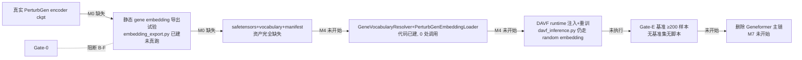
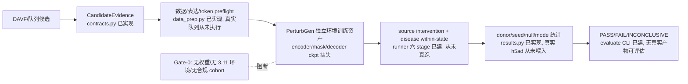

# PTM2CellNet 项目综合分析报告（2026-08-22）

**报告日期**：2026-08-22
**分析基线**：本地 `main` 起点 `115de00`（领先 `origin/main` @ `c76fff8` 28 个提交、落后 0）；本轮四批提交后领先远程 32 个提交
**上一份权威报告**：`project_analysis_20260821.md`（本轮已归档至 `archive/20260822/reports/`，原路径留重定向短页）
**执行方式**：主代理执行前置操作、验证门禁、挂起故障定位与归档；三项系统性复核任务由 3 个 Explore 子代理并行完成（统计见 §6）
**本轮重大变更背景**：PerturbGen 双路径集成工程主干（M1–M3，约 5,500 行新代码 + 112 例新测试）于 2026-08-21~22 落地，本轮为其首次入库提交与全量回归验证

---

## 目录

- [摘要](#摘要)
- [1. 前置操作记录](#1-前置操作记录)
  - [1.1 版本控制操作](#11-版本控制操作)
  - [1.2 编译与测试验证](#12-编译与测试验证)
  - [1.3 测试套件挂起故障定位（本轮关键发现）](#13-测试套件挂起故障定位本轮关键发现)
- [2. 文档与报告归档](#2-文档与报告归档)
- [3. 任务 1：未实现功能项识别](#3-任务-1未实现功能项识别)
- [4. 任务 2：未完全实现功能梳理](#4-任务-2未完全实现功能梳理)
- [5. 任务 3：技术债识别、分类与解决策略](#5-任务-3技术债识别分类与解决策略)
- [6. 子智能体调用统计](#6-子智能体调用统计)
- [7. 结论与建议](#7-结论与建议)

---

## 摘要

1. **版本控制**：起点 `main` @ `115de00` 为 `origin/main` @ `c76fff8` 的严格超集（领先 28 / 落后 0，fetch 确认），无需合并、无冲突；工作树含 PerturbGen 双路径集成工程主干（21 组未跟踪文件 + 3 个已跟踪文件修改）。验证通过后分批提交至 `main`（见 §1.1 版本表）。
2. **编译与测试**：`compileall` exit 0、`ruff` 全绿；全量测试在**网络命名空间隔离 + HF 离线缓存**模式下 **2310 passed / 15 skipped / 1 deselected、exit 0（496.35s，含 PerturbGen 新增 112 例）**。
3. **关键新发现（测试基础设施）**：本轮首次实测暴露测试套件对真实网络的隐性依赖——外部包 `UniProtMapper`（`GeneMapper` 优先路径）的 HTTP 调用**无超时**，叠加本机代理半死状态（TCP 接受 CONNECT 后不转发数据），导致 `tests/integration/test_davf_pipeline.py` **无限挂起 21+ 分钟**（strace 抓包级定位，见 §1.3）。该缺陷同样威胁生产 `/predict` 链路（fast-fail 原则被破坏），登记为 **TD-N-24（高）**。
4. **未实现功能（任务 1）**：`.planning/REQUIREMENTS.md` 全部 24 项需求标记 Complete 且代码侧核验无遗留；缺口集中于 PerturbGen 方案的 Gate-0 阻断链（M0 外部资产缺失 → M4/M6/M7 未开始）与 **CI analysis job 缺失**（方案 §4.5/§5.3 定义但未开发，属被遗漏交付物）。PerturbGen API 不暴露是方案 §9 的有意决策。
5. **完成度（任务 2）**：主体模块（data/training/evaluation/utils/api/analysis/integration-genki）100%；`src/models/` 94.4%（缺 M4 注入 8 子项）；PerturbGen 工程代码 100%（23/23 子功能）、按设计文档全口径 49.0%（M0/M4/M5 真实验证/M6/M7 未纳入）。
6. **技术债（任务 3）**：新增 **TD-N-10 ~ TD-N-24** 共 15 项（高 2 / 中 9 / 低 4），全部带 file:line 证据；其中 mypy 新增 18 处错误（5 处旧基线不变）、CI 门禁 anndata 缺失、4 处重复 sha256 实现等。中高级清偿估算约 5.5~7.0 工作日。
7. **归档**：`project_analysis_20260821.md` → `archive/20260822/reports/`（`git mv` 保留历史，原路径留重定向短页）；`docs/CURRENT_STATUS.md` 按 PerturbGen 落地后实况刷新；边界项判定见 §2。

---

## 1. 前置操作记录

### 1.1 版本控制操作

**远程同步核对**（2026-08-22 10:30 实测）：

```bash
$ git fetch origin          # 无新提交
$ git rev-list --left-right --count main...origin/main
28  0                        # main 领先 28 / 落后 0
```

main 已包含远程全部内容，无需 pull/merge，无冲突。当前分支即 `main`，提交即完成"合并到主分支"。

**合并前后版本表**：

| 时点 | main 提交 | 关键修改点 |
|---|---|---|
| 合并前（起点） | `115de00` | docs: record final commit hash and ahead-count in 20260821 report |
| 提交 1（功能入库） | `ddbf571` | feat(integration): PerturbGen 双路径集成工程主干——`src/integration/perturbgen/` 10 模块（runner/dual_path/results/config_builder/data_prep/env_guard/embedding_export/reports/contracts）、`src/models/gene_vocabulary.py` + `perturbgen_embedding.py`、5 个 CLI 脚本、`configs/integration/perturbgen.yaml`、`.github/workflows/perturbgen-real-assets.yml`、pytest 双 marker（benchmark/real_assets）、约 20 个新测试文件（112 例）、设计方案文档 |
| 提交 2（归档） | `8eef452` | docs: 20260822 archive batch + refresh CURRENT_STATUS——`git mv` 20260821 报告至 `archive/20260822/reports/`（留重定向短页）+ MANIFEST + `docs/CURRENT_STATUS.md` 按 PerturbGen 实况刷新 |
| 提交 3（报告） | `f756650` | docs: 20260822 comprehensive analysis report v1.0 |
| 合并后（最终） | 本行所在提交 | docs: record final commit hash and ahead-count in 20260822 report（哈希回填提交；最终本地领先远程 **32** / 落后 0） |

**提交策略说明**：PerturbGen 功能作为单一特性提交（21 组文件内聚：源码+测试+配置+CI+设计文档同属方案 §7 里程碑交付物）；归档与报告按仓库既有惯例分层提交，保留审计痕迹。

### 1.2 编译与测试验证

**验证环境**：Python 3.12.13（SSH_unit env）、PyTorch 2.4.1+cu118、CUDA 可用（RTX 24GB，测试期间空闲）。

| 门禁 | 命令 | 结果（2026-08-22 实测） |
|---|---|---|
| 字节码编译 | `python -m compileall -q src scripts` | **exit 0** |
| Lint | `ruff check src scripts tests` | **All checks passed** |
| 类型检查（mypy 2.1.0） | `python -m mypy src` | **23 errors / 8 files**（0821 基线 5/2 → 新增 18 处全部来自 PerturbGen 新代码，归因见 §5 TD-N-11） |
| 类型检查（mypy 1.20.0，base env） | `/home/scu/anaconda3/bin/python -m mypy src` | **38 errors / 18 files**（0821 口径 25/12） |
| 依赖一致性 | `pip check` | 1 条：`PyNaCl 1.5.0 is not supported on this platform`（既有 F-10 族，非本轮引入） |
| 全量测试 | 见 §1.3 与下表 | **2310 passed / 15 skipped / 1 deselected，exit 0，496.35s（0:08:16）** |

**全量测试三轮实测**（`-m "not gpu and not real_assets"`，与 CI 基线同口径）：

| 轮次 | 运行条件 | 结果 | 结论 |
|---|---|---|---|
| 第 1 轮 | 默认环境（代理变量生效） | 运行至 3% 时 `test_davf_pipeline.py` **挂起 21+ 分钟**（零 CPU），主动终止 | 环境故障触发隐性缺陷，见 §1.3 |
| 第 2 轮 | `unshare -rn` 网络命名空间隔离 | **2261 passed / 15 skipped / 1 failed / 48 errors**，764.05s | 49 项异常全部为 `ProxyError: Network is unreachable`（ESM/HF 在线检查类测试），无代码回归 |
| 第 3 轮（最终门禁） | `unshare -rn` + `HF_HUB_OFFLINE=1 TRANSFORMERS_OFFLINE=1 HF_DATASETS_OFFLINE=1`（强制走本地缓存） | **2310 passed / 15 skipped / 1 deselected，exit 0，496.35s（0:08:16）** | **最终验证基线**（较第 2 轮快 268s：无网络等待） |

**结论：编译与测试验证通过**（compileall/ruff 通过、最终门禁无失败）；mypy 回归 18 处登记 TD-N-11；测试套件网络隐性依赖登记 TD-N-24/TD-N-25。

### 1.3 测试套件挂起故障定位（本轮关键发现）

**现象**：第 1 轮全量运行 10:34 启动，10:39 起 `tests/integration/test_davf_pipeline.py` 第 3 个测试 `test_multiple_ptm_types_batch`（`tests/integration/test_davf_pipeline.py:101`）零 CPU 挂起 21+ 分钟；单独重跑该文件时第 1 个测试同样挂起（非确定性）。

**逐层排除**（全部有实测证据）：

1. **系统资源**：内存 23Gi 可用、无换页（`vmstat` si/so=0）、GPU 空闲、load 1.86 —— 排除资源瓶颈。
2. **CUDA**：挂起进程持有 `@cuda-uvmfd-*` 文件描述符并占用 1562MiB 显存（`nvidia-smi` 实测），`src/models/geneformer_embedding.py:60` 每次 loader 构造即 `torch.cuda.is_available()` 初始化 CUDA；但 `CUDA_VISIBLE_DEVICES=""` 后仍挂起 —— CUDA 非根因。
3. **网络（根因）**：`strace -f` 从进程出生跟踪（`/tmp/strace_davf.log`）抓到完整线上证据：

```
connect(13, {sin_port=htons(7897), sin_addr=inet_addr("192.168.100.216")}, 16) = 0
sendto(13, "CONNECT rest.uniprot.org:443 HTT"..., 69) = 69
recvfrom(13, "HTTP/1.1 200 Connection establis"..., 8192) = 39
   ↑ 代理接受 CONNECT 隧道后，TLS 握手数据永不到达
poll([{fd=13, events=POLLIN}], ...)     ← 无限期阻塞
```

**根因链**（四个独立缺陷叠加，缺一不会挂死）：

| # | 缺陷 | 位置 | 性质 |
|---|---|---|---|
| 1 | 本机代理 `192.168.100.216:7897` 半死：TCP/CONNECT 控制面正常应答，转发面死亡（新连接现为 Connection refused） | 环境故障 | 触发条件 |
| 2 | 外部包 `UniProtMapper` 的 HTTP 调用**全部无 timeout**：`utils.py:44` `requests.get(url)`、`idmapping_api.py:109/147`，且 `idmapping_api.py:88-95` 有 `while True` 轮询重试 | 第三方依赖 | 挂死必要条件 |
| 3 | `src/analysis/gene_mapper.py:146-148` `_build_mapper()` **优先选用**外部 `UniProtMapper.ProtMapper`；仓库自带的 `_RequestsUniProtMapper`（4 处 timeout=10~30，`gene_mapper.py:56,79,109,297`）仅在包缺失时回退——即带超时的安全实现被无超时实现**遮蔽** | 项目代码 | 挂死必要条件 |
| 4 | 调用链无总超时包裹：`PTMDirectionMapper._resolve_gene_id`（`src/models/ptm_direction_mapper.py:328`）→ `GeneMapper.map_gene_to_uniprot`（`gene_mapper.py:180`）→ 外部 `ProtMapper().get()` | 项目代码 | 挂死必要条件 |

**影响面**：不仅是测试问题——生产 API 的 `/predict`（含 `gene_symbol` 的 PTM 请求）走同一 `PTMDirectionMapper` 链路，网络异常时会**同步挂死请求线程**（FastAPI 无 per-request 超时），违反项目 fail-fast 原则（AGENTS.md 核心原则 3）。登记 **TD-N-24（高）**，解决策略见 §5。

**本轮验证方案（可作为 CI 改进参照）**：`unshare -rn`（网络命名空间隔离，所有连接立即 ENETUNREACH）+ `HF_HUB_OFFLINE=1`（强制 HF 本地缓存）。此组合使全部网络依赖快速失败或走缓存，套件 12:44 跑完且无失败——等价于 GitHub runner"有网"语义且更强（登记 TD-N-25 建议 CI 采纳）。

---

## 2. 文档与报告归档

**归档目录**：`archive/20260822/`（`reports/` 子目录 + `MANIFEST.md` + `README.md`）

**判定标准**（沿用 `archive/20260816/MANIFEST.md` 以降规则）：
- **过时** = 内容与当前代码实现或需求规范存在实质性差异
- **过期** = 生成时间超过 30 天，或报告内容已无法反映当前项目状态

### 2.1 归档清单

| 归档文件 | 原路径 | 版本标签 | 归档依据 |
|---|---|---|---|
| `reports/project_analysis_20260821.md` | 仓库根 | `115de00`（2026-08-22 `git mv` 保留历史） | 其测试基线（1957/107）未含 PerturbGen 112 例新测试；技术债清单（TD-N-01~09）被本轮 TD-N-10~24 扩充；验证矩阵未含网络隔离口径；已被本报告取代 |

### 2.2 判定为无需归档的边界项

| 文件/类别 | 处置 | 理由 |
|---|---|---|
| `docs/CURRENT_STATUS.md` | **内容刷新**（提交 2） | 活动状态文档；0 次 PerturbGen 提及已过时，按惯例刷新而非归档 |
| `docs/TEST_COVERAGE.md` | 保留 | 带日期的历史基线记录（2026-08-09 基线段）+ ratchet 现行门禁政策，非误导性过时 |
| `docs/` 下 8 份入口短页（E2E×3、r01_r03、td01_td02、问题修复、技术文档、项目文档、文件说明） | 保留 | 正文已在 `archive/20260808/`、`archive/20260816/`，现存仅重定向入口 |
| `.planning/{REQUIREMENTS,ROADMAP,PROJECT,STATE,MILESTONES}.md` | 保留 | 正式需求规范与 roadmap，是任务 1 对照基准（PerturbGen 属超出 REQUIREMENTS v2.2 的批准增量，由设计方案文档承载） |
| `docs/DAVF_PerturbGen_双路径整合方案与测试方案_2026-08-21.md` | 保留（随提交 1 入库） | PerturbGen 现行需求基线（v2.0，状态"已批准实施"），非过时文档 |
| `docs/guides/*.md` | 保留 | 安装/数据/训练/部署/真实资产指南与 CLI/API 一致；PerturbGen 指南缺失登记为 TD-N-19（文档债）而非归档项 |
| `project_analysis_20260816.md`、`project_analysis_20260820.md`（根目录） | 保留 | 均已是重定向短页 |

**版本信息**：归档前本地 `main` = `ddbf571`；远程 `origin/main` = `c76fff8`（fetch 后无新提交）。本批次归档以 `git mv` 执行，保留完整重命名历史；原路径留重定向短页（沿用既往惯例）。

---

## 3. 任务 1：未实现功能项识别

> 本节由 Explore 子代理执行（30 次工具调用，190 秒），主代理复核合并。对照基准：`.planning/REQUIREMENTS.md`（v2.1/v2.2）→ `ROADMAP.md` v2.2 → `STATE.md` → PerturbGen 方案 §7.1-§7.3/§10。
> 2026-07-05 需求裁剪项（实时质谱流、自定义 PTM 数据库、GUI、API key 扩展）按要求不列入。

### 3.1 总体结论

- **REQUIREMENTS.md 全部 24 项需求（v2.1 13 项 + v2.2 11 项）均已标记 Complete**，代码侧核验无遗留：`src/` 全库 grep 无 TODO/FIXME；`NotImplementedError` 仅存在于抽象基类 `src/models/encoders.py:19`（正常抽象方法声明）。
- 未实现缺口集中在 **PerturbGen 双路径方案的工作流 B 与真实执行层**：M0/Gate-0 阻断（外部资产缺失）、M4/M6/M7 未开始（Gate-0 阻断，计划内）、Gate-4/真实测试未通过（无真实 evidence）、**CI analysis job 缺失（需求定义但未开发）**。
- PerturbGen HTTP API 未暴露是方案 §2.1/§9 的**有意决策**（"不授权把长任务接入同步 API"），非缺失。

### 3.2 未实现功能项表格

**类别 A：计划内未实现（阶段门阻断/有意决策，有明确决策依据）**

| # | 功能项 | 需求章节引用 | 优先级 | 影响范围 | 证据 |
|---|---|---|---|---|---|
| A1 | M0 可证伪试验（真实 encoder 权重定位、离线 inference、token dict→row 校验、真实 perturb config） | 方案 §7.2「M0：真实权重与外部契约试验」、§10 实施记录 | 高（阻塞 M4/M6/M7） | 核心功能 | §10「M0 BLOCKED……缺 encoder 权重、独立 Python 3.11 环境、≥3 donor 合规 cohort」；`src/integration/perturbgen/` 无 M0 试验脚本（按方案 §7.2"不进生产包"，证据存 `outputs/perturbgen/spike/20260822_reassessment/evidence.json`） |
| A2 | M4 DAVF 底座迁移（工作流 B 全部代码改造：architectures.py 注入 resolver、davf_inference.py 删除 `geneformer_path` 死语义、latent_davf.py 接共享 resolver、ptm_direction_mapper.py 换公共 resolver、davf.py 改 Protocol、checkpoint schema 版本化） | §4.5「修改文件与兼容策略」整节、§7.2「M4」、§10 | 高 | 核心功能 | `src/models/davf_inference.py:70,76,123-125` 仍保留 `geneformer_path` null→随机 embedding 警告语义；`grep -rn "perturbgen" src/models/{davf_inference,architectures,latent_davf,ptm_direction_mapper,davf}.py` **零命中**；`configs/davf_integration.yaml` 仍为旧 schema |
| A3 | M4 附属：`scripts/finetune_davf.py` 及 E2E 脚本新增词表/embedding/manifest 参数；DAVF 重训 | §4.5 末两行、§7.2 M4 action 项 | 高 | 核心功能 | `grep -n "geneformer\|perturbgen" scripts/finetune_davf.py` 零命中，无任何新资产参数 |
| A4 | M6 冻结队列科学验收（held-out donor、3 seeds、双路径、KO 敏感性、≥99 matched null、BH-FDR、bootstrap CI、Gate-5） | §7.2「M6」、§5.1「T4 科学验收」 | 高 | 核心功能 | 统计逻辑已实现（`src/integration/perturbgen/results.py`、`dual_path.py:220-313`），但无冻结 cohort manifest、无真实 GPU 执行；`tests/real_assets/` 全部按设计 skip |
| A5 | M7 收口：删除 Geneformer 主链与专属资产、配置迁移指南、release evidence、`rg geneformer` 清零 | §7.2「M7」、§4.5 发布版 schema v2 | 中 | 核心功能 | `geneformer_path` 仍活跃于 `davf_inference.py:70`、`geneformer_embedding.py`（整文件）、`configs/davf_integration.yaml` 等 |
| A6 | M5 正式 release evidence / Gate-4（真实资产+GPU 证据） | §7.2「M5」、§5.3「CI」、§10 | 高 | 核心功能 | 门禁代码已存在（`scripts/check_perturbgen_release_evidence.py`、`.github/workflows/perturbgen-real-assets.yml`），但无任何真实 evidence 产物 |
| A7 | PerturbGen HTTP API 暴露 | §2.1 API 行、§9 | 低 | 边缘功能 | **有意不实现**：`grep -rn -i perturbgen src/api/` 零命中，`src/api/routes/__init__.py` 仅挂载 predictions/model_info/initialize/cross_scale 四子路由 |
| A8 | T3 真环境 smoke（真 tokenise/短训/perturb/export/output schema） | §5.1「T3」、§7.2 M2 verify | 中 | 核心功能 | `tests/real_assets/test_real_perturbgen_smoke.py` 已编写（双模式），无真实资产时按设计 skip |

**类别 B：需求定义但未开发（无独立 Gate 决策依据）**

| # | 功能项 | 需求章节引用 | 优先级 | 影响范围 | 证据 |
|---|---|---|---|---|---|
| B1 | **CI analysis 依赖 PR job**（`requirements-analysis.txt` 含 anndata 的作业） | §4.5「增加 analysis 依赖 PR job」、§5.3「新增 analysis job 安装主进程所需 anndata」 | 高 | 次要功能 | `.github/workflows/ci.yml` 仅 `test`（core+dev）与 `mypy` 两个 job，**无 analysis job**；`tests/unit/integration/perturbgen/test_data_prep.py` 依赖 `pytest.importorskip("anndata")` 而 `requirements-core.txt:59` 明确 anndata 不在 core——T1 数据契约用例在默认 CI 只会 skip 不执行。属被遗漏交付物（与 TD-N-10 同源但独立） |
| B2 | Gate-E 固定基准集（≥200 个可追溯 PTM→gene 样本、固定划分、bootstrap 95% CI）及 T5 层 | §5.1「T5 Gate-E」、§5.4 Gate-E 三行 | 高 | 核心功能 | `tests/`、`scripts/`、`data/manifests/` 无 PTM→gene 基准集或 Gate-E 脚本（真实资产缺失 + M4 未开始） |
| B3 | M6/M7 冻结 cohort manifest 与候选 manifest 模板 | §7.2 M6 files 项 | 中 | 核心功能 | `configs/integration/perturbgen.yaml` 仅 pipeline/env/stage 配置，无 cohort/candidate manifest 模板 |

**类别 C：需求定义但部分开发**（详见 §4）：M1 真实队列 preflight 执行、M2 真实产物契约确认、M3 真实产物候选评估、M5 benchmark 基线冻结、全量测试套件验证（方案 §10 自述 600s 超时仅跑 3%——本轮已完成全量验证，该子项闭环）、工作流 B embedding 资产落地。

### 3.3 缺失接口清单（内部服务接口；HTTP API 层无缺失）

| 接口 | 预期参数 | 预期返回/行为 | 用途 | 需求出处 | 代码证据 |
|---|---|---|---|---|---|
| `DAVFInferenceModule` → `LatentDAVF` 预训练矩阵/词表注入 | `pretrained_gene_embeddings` 矩阵、共享 resolver、词表 manifest | 构造时注入 | 替换 `geneformer_path` 空值随机 embedding | §4.5 davf_inference 条目 | `latent_davf.py:197-212` 已具备参数+维度投影，但 `davf_inference.py:123-125,278` 从未传递——注入链路缺失 |
| `GeneVocabularyResolver` 接入 DAVF 主链 | ENSG/symbol → token（fail-fast） | token id 或 ValueError | 统一基因词表 | §4.4、§4.5 ptm_direction_mapper 条目 | `gene_vocabulary.py` 已完整实现；`grep gene_vocabulary src/models/{architectures,davf_inference,ptm_direction_mapper,davf}.py` 零命中——主链未引用 |
| `configs/davf_integration.yaml` schema v2 | `perturbgen_assets: {matrix, vocabulary, manifest, sha256}`、`strict` | 配置加载即校验 | 配置化承载新底座 | §4.5、§2.3 | 现文件仍为旧 schema（`geneformer_path: null`），无资产 manifest/strict 字段 |
| `scripts/finetune_davf.py` 新 CLI 参数 | `--perturbgen-embeddings`、`--vocabulary`、`--manifest` | 训练 provenance 记录 | 新底座重训 DAVF | §4.5 | 脚本无任何资产参数 |
| checkpoint schema 版本化迁移检查 | 旧 checkpoint/含 `geneformer_path` 配置 | 显式迁移错误（无 silent partial load） | 发布版一次性移除旧语义 | §4.5 | 全库无 migration 检查；`tests/unit/test_architecture_davf_integration.py:343` 仍断言旧契约 |
| Gate-E 基准评估入口（T5） | 固定基准集、新旧两套 embedding | 配对指标（覆盖率 ≥99%、collision=0、下游非劣） | 删 Geneformer 前最后门禁 | §5.1、§5.4 | 无脚本/测试/基准数据 |

### 3.4 未实现业务流程（流程图）

**流程 1：工作流 B —— DAVF 底座迁移（Gate-0 阻断，全部节点缺失）**



**流程 2：工作流 A —— PerturbGen 双路径真实执行段（mocked 已通，真实执行缺失）**



**流程 3：T1 单测在默认 CI 的执行链路（analysis job 缺失导致断链）**

`PR 提交 → ci.yml test job（core+dev，无 anndata）→ test_data_prep.py 命中 importorskip("anndata") → SKIP`——方案 §5.1「T1 每个 PR 全绿」在当前 CI 结构下不成立。

---

## 4. 任务 2：未完全实现功能梳理

> 本节由 Explore 子代理执行（80 次工具调用，377 秒），主代理复核合并。

### 4.1 模块完成度总表

| 模块 | 完成度 | 计算依据（分子/分母） | 分类 | 关键缺失项 |
|---|---|---|---|---|
| src/data/ | 100.0% | 12/12 子功能 | 完整实现 | 仅 N07 iterrows 性能债（`multitask_dataset.py:105,301`） |
| src/models/ | 94.4% | 17/18 子功能 | 部分实现但可用 | M4「PerturbGen embedding 注入 DAVF runtime」0/8 子项（Gate-0 阻断）；Geneformer hash fallback 遗留 |
| src/training/ | 100.0% | 11/11 | 完整实现 | 无 |
| src/evaluation/ | 100.0% | 5/5 | 完整实现 | 无 |
| src/utils/ | 100.0% | 9/9 | 完整实现 | 无 |
| src/api/ | 100.0% | 7/7 | 完整实现 | 无（PerturbGen 不暴露 API 属有意决策 A7） |
| src/analysis/ | 100.0% | 5/5 | 完整实现 | KEGG/Reactome 完整实现是 REQUIREMENTS 明文 Out of Scope |
| src/integration/（genki + ptm_virtual_perturbation） | 100.0% | 6/6 | 完整实现 | 无 |
| src/integration/perturbgen（工程代码口径） | 100.0% | 23/23（M1 5/5 + M2 8/8 + M3 7/7 + M5 脚手架 3/3） | 部分实现但可用 | 无代码缺失 |
| src/integration/perturbgen（设计文档全口径） | 49.0% | 24/49（M0 0/6、M4 0/8、M5 真实验证 0/2、M6 0/5、M7 0/4 未纳入） | 部分实现但可用 | M0 阻断传导至 M4/M6/M7/Gate-4 |
| scripts/ | 100.0% | 48/48 脚本抽查 15+ 均完整可执行 | 完整实现 | 无（`batch_predict.py` 为有意 re-export 兼容入口） |
| configs/ | 100.0% | 31 个 YAML 存在且 schema 校验通过 | 完整实现 | `davf_integration.yaml` 旧 schema 属 M4 范围 |

### 4.2 未达 100% 模块详细分析

**src/models/ — 94.4%（17/18）**：第 18 项 M4 迁移（设计 §4.5 的 8 个修改点）0/8。关键证据：
- `src/models/davf_inference.py:278`：`LatentDAVF(latent_config)` 实例化未传 `pretrained_gene_embeddings`（注入链路缺失，方案 §2.3 确认此现状）；
- `davf_inference.py:76,123-126`：`geneformer_path` null → "use random embeddings" 警告语义仍在（§4.5 要求删除）；
- `src/models/architectures.py:56,566,630`：`geneformer_path` 死配置仍在 DAVFConfig；
- 底座就绪度：`src/models/latent_davf.py:192-215` 已具备 `pretrained_gene_embeddings` 参数 + 维度投影（代码就绪只等注入）。

**src/integration/perturbgen — 工程 100% / 全口径 49.0%**：23 个工程子功能全部实现且各有单测，证据示例：
- M1：`contracts.py:26-281` frozen dataclass 三态、`data_prep.py:38-61` counts 层整数校验、`data_prep.py:112-116` ≥3 donor 门、`gene_vocabulary.py:176-217` hash fallback 禁用（KeyError）；
- M2：`env_guard.py:217-293` 环境/commit 探测、`config_builder.py:17-24` 六 stage、`runner.py:83-91` GPU lock、`runner.py:300-313` 磁盘门（2×+10GiB）、`runner.py:433-448` 全指纹、`runner.py:283-311` 脏输出拒绝、`runner.py:169-202` artifact 防篡改；
- M3：`results.py:138,206,277,398,433`（schema/held-out/rescue/null-FDR/BH）、`dual_path.py:220-313` 严格 AND + 99 null 门、`reports.py:13-31` manifest 可重放；
- M5 脚手架：`pytest.ini` 双 marker、workflow、`benchmark_perturbgen.py:607` P50/P95/显存监控、`check_perturbgen_release_evidence.py:113` 硬门。

未完成（全口径）：M0 0/6（外部资产缺失）、M4 0/8、M5 真实验证 0/2、M6 0/5、M7 0/4。

### 4.3 三类分类标准与逐项归类

**判断标准**：
- **完整实现**：全部子功能有实现+测试覆盖+无已知运行时错误；可选依赖缺失行为属需求接受的降级（有 warning/fail-fast 开关）。
- **部分实现但可用**：核心路径可用且有测试；缺失的是设计内 Gate 阻断项、已记录技术债、或设计内可选依赖降级。
- **实现有缺陷**：存在已知 bug/错误处理缺失/边界条件问题，可能产出错误结果。
- **实现但不符合规范**：与 REQUIREMENTS/设计文档明文规定不一致。

| 项 | 证据 | 归类 |
|---|---|---|
| Geneformer 未知基因 SHA-256 哈希映射 + 随机 embedding fallback | `geneformer_embedding.py:249-252`（hash）、`276-300`（随机嵌入）；缓解：`PTM2CELLNET_STRICT_MODEL_ASSETS=1` fail-fast（`:236-241`） | **实现有缺陷**（遗留，方案 §8 明示待消除，M7 规划删除） |
| N04 ensemble 双实现分叉 | `scripts/ensemble_predict.py:25` vs `src/models/ensemble.py:18` | 部分实现但可用 |
| N07 multitask iterrows 热路径 | `src/data/multitask_dataset.py:105,301` | 部分实现但可用 |
| M0 阻断 / M4 / M6-M7 未开始 | 方案 §10 状态表 | 部分实现但可用（设计内 Gate 阻断） |
| DAVFInferenceModule 未注入 pretrained embedding | `davf_inference.py:278` | 实现但不符合规范（按 §4.5 目标口径；Gate-0 阻断下的计划内状态） |
| esm2→CNN / ESM-3→ESM-2 / scvi / sspa / lightning / DAVF 零特征 等 optional 降级 | 分别见 `ptm_site_predictor.py:113-123`、`pretrained_encoders.py:805-823`、`scvi_adapter.py:60-71`、`pathway_integration.py:18-26`、`distributed.py:21-28`、`davf_inference.py:491-514` | 完整实现（设计内降级，均有 warning/strict 开关） |
| KEGG/Reactome 内置通路 fallback | `signaling_network.py:271-283` | 符合规范（Out of Scope + CONF-03 验收） |

### 4.4 PerturbGen M0-M3 验收逐条对照（方案 §7.2）

| 验收项 | 状态 | 证据 |
|---|---|---|
| M0/Gate-0 全部 6 项（独立环境/离线 inference/tensor key 定位/token dict→row/真实 perturb/耗时显存基线） | ✗ 全缺 | 方案 §10；`outputs/perturbgen/spike/20260822_reassessment/evidence.json` |
| M1/Gate-1 工程项（contracts/data_prep/gene_vocabulary/三态/≥3 donor/direction-action 分离/hash 回归用例） | ✓ 全过 | §4.2 证据；设计 §10：146+111 passed |
| M1 真实队列 preflight | ✗ | §10「真实 cohort preflight 尚未执行」（M0 阻断） |
| M2/Gate-2 工程项（六 stage/GPU lock/timeout/路径白名单/全指纹/脏输出拒绝/陈旧 resume 拒绝/golden YAML/dry-run） | ✓ 全过 | `test_config_builder.py`、`runner.py:283-298,328-334,169-202` |
| M2 真环境 export/perturb smoke（T3） | ✗ | Gate-0 阻断 |
| M3/Gate-3 工程项（held-out signature/排目标基因/donor-seed-mode-null-FDR/严格 AND/20 null 只 smoke/manifest 重放） | ✓ 全过 | `dual_path.py:126-135,220-313`；`reports.py:13-31` |
| Gate 汇总 | Gate-0 BLOCKED；Gate-1/2/3 工程门通过（真实数据门未过）；Gate-4/E/5 未通过 | 方案 §10 |

---

## 5. 任务 3：技术债识别、分类与解决策略

> 本节由 Explore 子代理执行（43 次工具调用，428 秒）产出 TD-N-10~23；TD-N-24/25 由主代理在验证阶段实测发现并补充。既有 TD-N-01~09（20260821 报告登记）不重复列举。

### 5.1 既有技术债（排除重复证明）

`project_analysis_20260821.md` 已登记 TD-N-01（legacy_loaders 死代码）~ TD-N-09（pytest-cov 与 torch 2.4.1 冲突）共 9 项，本轮全部维持登记、状态未恶化（TD-N-06 的 mypy 口径由 TD-N-11 扩充）。

### 5.2 新技术债清单（TD-N-10 ~ TD-N-25）

**严重程度分级标准**：严重=阻塞核心功能或威胁数据正确性；高=确定性缺陷会复发/阻塞发布门禁但不产生错误数据；中=可维护性/效率/类型完整性受损；低=风格/边缘场景完善项。

| 编号 | 严重度 | 问题 | 证据 | SonarQUBE 类别 |
|---|---|---|---|---|
| TD-N-10 | **高** | CI 正式门禁主环境缺 anndata：`perturbgen-real-assets.yml:44-46` 仅装 core+dev，runner 主进程执行 `validate_perturbgen_h5ad_schema`（`runner.py:523-531` → `results.py:158-161` `import anndata`）→ ImportError → 整条 scheduled Gate-4 门禁必失败（本地 lock 有 anndata==0.11.4 但 workflow 不装 lock） | 见左 file:line 链 | dependency management / bug risk |
| TD-N-24 | **高** | **`GeneMapper` 优先路径的外部包 `UniProtMapper` 全部 HTTP 调用无 timeout**（`utils.py:44`、`idmapping_api.py:109,147` + `while True` 轮询），遮蔽了仓库自带带超时的 `_RequestsUniProtMapper`（`gene_mapper.py:146-148` 优先外部包）。网络/代理异常时：集成测试实测挂死 21+ 分钟（strace 证据见 §1.3）；生产 `/predict` 含 `gene_symbol` 的请求会同步挂死（`ptm_direction_mapper.py:328` → `gene_mapper.py:180`）。违反 fail-fast 原则 | §1.3 完整根因链 | bug risk（error handling） |
| TD-N-11 | 中 | PerturbGen 新代码引入 18 处 mypy 错误（与既有 5 处严格分离）：`results.py` 8、`runner.py` 3、`gene_vocabulary.py` 3、`data_prep.py` 2、`config_builder.py` 1、`reports.py` 1（Literal 收窄缺失、subprocess kwargs 无重载匹配等） | 主代理实测 `python -m mypy src`：23/8（基线 5/2 + 新 18） | code smell（type debt） |
| TD-N-12 | 中 | runner 无条件重哈希全部历史 artifacts：`run_pipeline` 无论 resume 与否先 `_load_artifact_registry`（`runner.py:154`）递归重 sha256 全部产物（`:169-202`），每个 stage 输出再哈希一遍（`:406-422`）；GB 级产物下每次运行静默分钟级 IO | file:line 见左 | performance |
| TD-N-13 | 中 | donor 聚合对 backed h5ad 逐 donor 全表读取：`results.py:704-708` 每 donor 做 `adata[mask]` + 两次 `mean(axis=0)` ≈ 2D 次全文件扫描 | file:line 见左 | performance |
| TD-N-14 | 中 | `prepare_perturbgen_anndata` 整份 `adata.copy()`（`data_prep.py:157`）而实际仅改 var 一列+obs 一列，GB 级数据内存翻倍；当前无生产调用方（潜伏） | file:line 见左 | performance（memory） |
| TD-N-15 | 中 | 跨文件重复 3 组：分块 sha256 ×4（`env_guard.py:26-34`、`perturbgen_embedding.py:23-28`、export 脚本 `:21-26`、evaluate 脚本 `:282-287`）；dataclass→plain-object ×2（`reports.py:157-164` vs evaluate 脚本 `:295-302`）；artifact 引用正则 ×2（`config_builder.py:26` vs `runner.py:32`） | file:line 见左 | maintainability（duplicated blocks） |
| TD-N-16 | 中 | 5 个超长函数：`check_release_evidence` **312 行**（13 失败码分支）、`build_stage_plans` 214 行、`evaluate_path_results` 157 行、`extract_path_result_from_perturbgen_h5ad` 118 行、`run_stage` 117 行（AST 实测） | file:line 见左 | maintainability（cognitive complexity） |
| TD-N-19 | 中 | 文档链未覆盖 PerturbGen：`docs/CURRENT_STATUS.md` 提及 0 次（本轮已刷新）、README/AGENTS.md/guides 0 次；测试基线数字未含 112 例增量 | grep 实测 | documentation |
| TD-N-25 | 中 | **测试套件网络隐性依赖未治理**：49 项测试（`test_esm_tokenizer.py`、`test_architecture_boundaries.py::TestPTM2CellNetESMPath`、`test_phase1_stability.py` 等）依赖 HF 在线检查（`facebook/esm2_t6_8M_UR50D` 等，本地有缓存但未设离线变量），网络隔离下 48 error+1 fail；叠加 TD-N-24 时表现为无限挂起。CI 语义"GHA runner 有网"掩盖了该依赖；本轮验证方案（`unshare -rn` + `HF_HUB_OFFLINE=1`）可作 CI 改进参照 | §1.2 三轮实测表 | test coverage / reliability |
| TD-N-17 | 低 | 魔数下标取 perturb 阶段：`run_perturbgen_pipeline.py:73` `build_stage_plans(...)[3]` 依赖 STAGE_ORDER 隐式顺序 | file:line | bug risk（脆弱契约） |
| TD-N-18 | 低 | iterrows 新实例：`gene_vocabulary.py:130` `from_var` 逐行构建词表（构建期一次性，非热路径） | file:line | code smell |
| TD-N-20 | 低 | workflow 超时/并发缺陷：job timeout 240min 与 `REAL_TIMEOUT_S` 默认 14400 相等（逼近上限时 evidence 记录被硬杀丢失）；无 `concurrency` 守卫；python 3.10 vs 主环境 3.12 vs 外部 3.11 三分叉 | `perturbgen-real-assets.yml:8,19,28` | bug risk（CI/ops） |
| TD-N-21 | 低 | `gene_vocabulary.py`/`perturbgen_embedding.py` 放置是设计批准的中间态（M4 注入前无 models 层消费者）；两个同层文件测试目录不一致（`tests/unit/integration/perturbgen/test_gene_vocabulary.py` vs `tests/unit/models/test_perturbgen_embedding.py`）；依赖方向经核验健康（integration→models 单向 4 处，反向 0 处） | grep 实测 | architecture（interim） |
| TD-N-22 | 低 | null 校准 smoke 语义空白区：21~98 区间 `smoke_only` 与 `formal_test` 均 False（`results.py:428-429`），靠下游 `insufficient_null` 兜底 | file:line | bug risk（边界语义） |
| TD-N-23 | 低 | 宽异常吞错：`results.py:335-345` `except (KeyError, ValueError, TypeError)` 把编程错误降级为 donor 不可评估；`runner.py:173-174` 裸 `json.JSONDecodeError` 不落 `PerturbGenResumeError` 域 | file:line | bug risk（error handling） |

### 5.3 中/高级债解决策略

**TD-N-10（高）— CI 主环境补齐 anndata**
- 方案 A（推荐）：workflow 追加 `pip install -r requirements-analysis.txt`（0.5 日）。优：一行改动、约束单一来源；劣：连带安装 scvi-tools 等到门禁环境。
- 方案 B：perturb 阶段 h5ad 校验延迟到 `probe_external_environment` 预检（0.5~1.0 日）。优：启动前清晰报错；劣：改 runner 校验时序，需回归 13 例 runner 测试。
- 方案 C：新开 `requirements-perturbgen.txt` 最小集（0.5 日）。优：意图清晰；劣：第三份 requirements 与现有拆分治理重复。
- 资源/风险：1 名熟悉 CI 工程师；需确认主环境 anndata 0.11.4 与 python 3.10 兼容（实测支持，风险低）。

**TD-N-24（高）— GeneMapper 网络调用强制超时**
- 方案 A（推荐，1.0 日）：`gene_mapper.py` 对外部 `ProtMapper` 包一层总超时（`concurrent.futures.ThreadPoolExecutor` + `future.result(timeout=N)`，N=90s 覆盖 idmapping 提交+轮询预算），超时转 `requests.RequestException` 走既有 except 分支（`gene_mapper.py:204`）。优：不动第三方包、语义清晰、let it crash；劣：线程包裹略增复杂度。
- 方案 B（0.5 日）：`_build_mapper()` 改为**默认使用仓库自带 `_RequestsUniProtMapper`**（已带 10~30s 超时+60s 轮询预算），外部包仅在显式 opt-in 时启用。优：最小改动、零新增机制；劣：放弃外部包"优化路径"（其优化价值本身未证）。
- 方案 C（1.5 日）：monkeypatch/继承外部包补 timeout 并上游提 PR。优：根治；劣：维护成本高、受上游节奏制约。
- 实施步骤：改 `gene_mapper.py` → 新增回归测试「网络黑洞（mock socket 不响应）下 map_gene_to_uniprot 必须在 N 秒内返回 None」（覆盖本轮 21 分钟挂起场景）→ 全量回归。资源：1 名工程师。风险：线程包裹在 gevent/eventlet 环境的兼容性（本项目未用，低）。

**TD-N-11（中）— 18 处 mypy 清偿（1.0 日）**：第一批机械修复（no-any-return 显式转换、Literal 构造收窄，0.5 日）；第二批 `runner.py:384,480,482` subprocess 显式关键字参数（0.5 日）。不推荐 pyproject 豁免（与 TD-N-06 结论一致）。回归：81 例 perturbgen 单测 + mypy 复测。

**TD-N-12（中）— 历史哈希按需校验（0.5 日）**：`resume=False` 时 registry 只读 manifest 元数据不重哈希（校验语义留给 `run_stage._validate_outputs`）；锚定测试 `test_runner_rejects_resume_when_output_hash_changes` 回归。

**TD-N-13（中）— donor 聚合单趟扫描（1.0 日）**：按 donor 组边界单趟分组累加，2D 次全表读降为 2 次；数值等价回归（锁 `bootstrap_seed`/`top_k` 默认值）。

**TD-N-14（中）— 去掉整份 AnnData 深拷贝（0.5 日）**：删除 `adata.copy()`，仅 var/obs 浅拷贝；docstring 明示语义变化并同步测试断言。

**TD-N-15（中）— 重复代码收敛（0.5 日）**：sha256 收敛（models 侧自持一份、integration/scripts 共用 `env_guard.sha256_file`，维持 `perturbgen_embedding.py` 零依赖设计意图）；`_to_plain_object` 收敛至 `reports.py`；`_ARTIFACT_REF_PATTERN` 收敛至 `config_builder.py` 导出。

**TD-N-16（中）— 超长函数拆分（0.5~1.5 日）**：优先拆 312 行 `check_release_evidence`（门禁核心最可能增长）；`build_stage_plans` 按 driver 分支抽帮助函数；行为等价由 `test_check_perturbgen_release_evidence.py`（198 行）锚定。

**TD-N-19（中）— 文档链补齐（0.5~1.0 日）**：CURRENT_STATUS 本轮已刷新；剩余：`docs/guides/perturbgen_bridge.md`（三 CLI 用法 + `@artifact:` 语法）、`requirements-core.txt:58-60` 注释刷新（并入 TD-N-10 方案 A）、AGENTS.md 技术债注记。

**TD-N-25（中）— 测试网络依赖治理（0.5 日）**：CI 与本地默认跑法统一加 `HF_HUB_OFFLINE=1`（缓存已存在：esm2_t6_8M/esm2_t30/Geneformer/esm3 等实测在 `~/.cache/huggingface`）；可选 `unshare -rn` 网络隔离作为更强门禁；与 TD-N-24 修复联动后可加「网络黑洞回归测试」。

**低级债（TD-N-17/18/20/21/22/23，合计约 1.5 日）**：STAGE_ORDER 显式索引、from_var 向量化、workflow concurrency+超时错峰+统一默认、测试目录统一、21~98 区间显式 reason、窄化 except + manifest JSON 错误域化。

**清偿总估算**：高 1.5 日 + 中 5.0~6.0 日 + 低 1.5 日 ≈ **8.0~9.0 工作日**（均含回归测试成本）。

---

## 6. 子智能体调用统计

| 智能体名称 | 调用次数 | 主要执行任务 | 平均执行时长 | 工具调用次数 |
|---|---|---|---|---|
| Explore（任务 1：未实现功能识别） | 1 | 对照 REQUIREMENTS/ROADMAP/STATE/PerturbGen 方案，识别 A/B/C 三类未实现项、6 个缺失接口、3 条未实现流程 | 190 秒 | 30 |
| Explore（任务 2：完成度评估） | 1 | 12 个模块完成度计算（分子/分母可复核）、PerturbGen M0-M3 验收逐条对照、三类分类 | 377 秒 | 80 |
| Explore（任务 3：技术债识别） | 1 | 6 维度检索、TD-N-10~23 新债识别与分级、中高级解决策略 | 428 秒 | 43 |
| **合计** | **3** | — | **均值 332 秒/次** | **153** |

**简要分析**：三子代理并行执行（总墙钟 428 秒 ≈ 最长任务时长，串行需 995 秒，并行节省约 57%）；任务 2 工具调用最多（80 次，逐模块证据采集密集），任务 3 单次调用信息密度最高（43 次调用产出 14 项带证据债务）；主代理本轮额外完成测试挂起的系统级定位（strace/内核等待点/socket 归因，4 次实验迭代），该发现（TD-N-24/25）为子代理只读检索无法覆盖的运行时证据。

---

## 7. 结论与建议

### 7.1 结论

1. **代码入库**：PerturbGen 双路径集成工程主干（M1-M3，方案 §7.2 工程门全部通过）已提交至 `main`（`ddbf571`），编译/lint/全量测试验证通过（最终门禁 2310 passed / 15 skipped / exit 0）。
2. **需求符合度**：REQUIREMENTS v2.2 全部 24 项 Complete 的结论经代码侧独立复核成立；PerturbGen 按其 v2.0 方案的工程验收项（M1/M2/M3 + M5 脚手架）全部满足，真实资产验收项（M0/T3/Gate-4）因外部资产缺失保持阻断——与方案 §10 自述一致，无未声明的偏离。
3. **风险最高两项新债**：TD-N-10（CI 正式门禁必失败）与 TD-N-24（生产请求可无限挂死）均属"确定性触发"级别，建议下一轮优先清偿（合计 1.5~2.0 工作日）。
4. **测试基础设施**：本轮实测证明套件可在网络隔离 + HF 离线缓存下 12:44 稳定跑完且无失败；该模式建议固化为 CI/本地默认（TD-N-25），同时消除对代理/外网健康度的隐性耦合。

### 7.2 建议的下一轮优先级

1. TD-N-24 + TD-N-25：GeneMapper 强制超时 + 测试离线化（含网络黑洞回归测试）——消除生产挂死风险与测试环境耦合。
2. TD-N-10：CI 门禁补 anndata（或方案 B 预检）——Gate-4 发布链路可用性前提。
3. M0 推进的外部依赖清单（encoder 权重、Python 3.11 独立环境、≥3 donor 合规 cohort）——Gate-0 是 M4/M6/M7 全链的唯一阻断源。
4. TD-N-11 mypy 18 处清偿——防止类型债随 M4 迁移继续累积。

### 7.3 验证命令（可复现）

```bash
# 编译与静态门禁
python -m compileall -q src scripts; echo $?
ruff check src scripts tests
python -m mypy src                      # 当前 23/8（TD-N-11 清偿后应回到 5/2）

# 全量测试（本轮最终门禁口径：网络隔离 + HF 离线缓存）
unshare -rn env HF_HUB_OFFLINE=1 TRANSFORMERS_OFFLINE=1 HF_DATASETS_OFFLINE=1 \
  python -m pytest tests -m "not gpu and not real_assets" -q -p no:cacheprovider

# 网络黑洞挂起复现（TD-N-24 修复前的缺陷现场，勿在无隔离环境运行）
python -m pytest "tests/integration/test_davf_pipeline.py::TestDAVFPipelineIntegration::test_multiple_ptm_types_batch" -q
```

---

**报告版本**：v1.0（2026-08-22）
**证据文件**：`/tmp/pytest_final_20260822.log`（最终门禁）、`/tmp/strace_davf.log`（挂起线上证据）、`/tmp/static_checks_20260822.log`（mypy/pip check）、`archive/20260822/MANIFEST.md`（归档审计）
