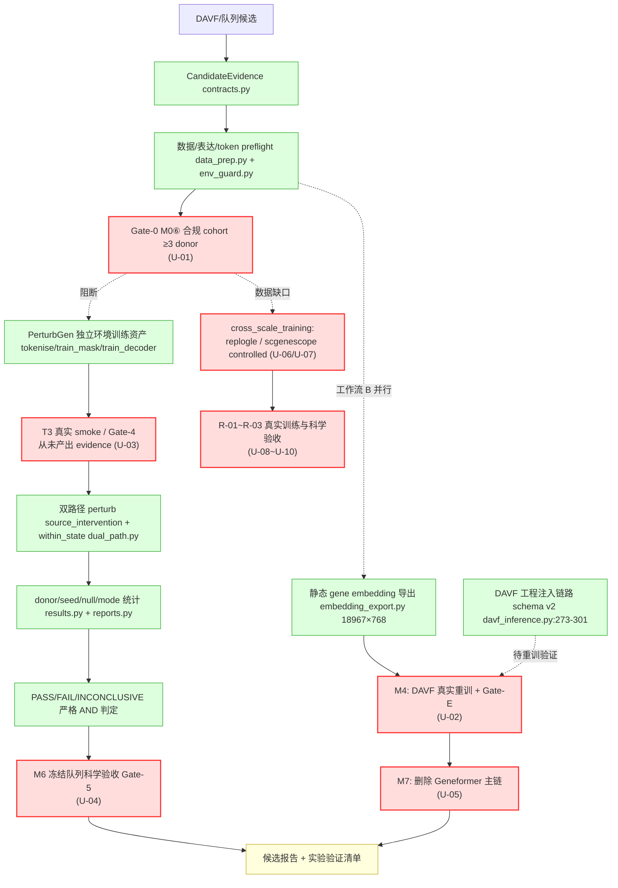

# PTM2CellNet 项目综合分析报告（2026-08-24）

> **执行日期**：2026-08-24　**基线**：本地 `main` = `1710e43`（2026-08-22 12:13:21 +0800）→ 本报告落地于 `main`
> **性质**：项目代码与文档综合处理及技术分析（第五轮周期性复核）
> **方法**：主代理执行版本控制/归档/验证，三个只读侦察子代理并行执行任务 1/2/3 调查；全部结论带 file:line 或命令输出证据。

---

## 目录

- [摘要](#摘要)
- [0. 任务判断与输入依据](#0-任务判断与输入依据)
- [1. 前置操作一：版本控制记录](#1-前置操作一版本控制记录)
- [2. 前置操作二：文档与报告归档批次](#2-前置操作二文档与报告归档批次)
- [3. 任务 1：未实现功能项识别与记录](#3-任务-1未实现功能项识别与记录)
- [4. 任务 2：未完全实现功能梳理](#4-任务-2未完全实现功能梳理)
- [5. 任务 3：技术债识别、分类与解决策略](#5-任务-3技术债识别分类与解决策略)
- [6. 结论与建议](#6-结论与建议)
- [7. 子代理调用统计](#7-子代理调用统计)
- [8. 可复现命令](#8-可复现命令)

---

## 摘要

本轮完成三类工作：**① 版本控制**——将 2026-08-23 会话遗留的 PerturbGen M4 注入链路改动与 6 份报告分 3 个提交入库，主分支经 fetch 确认领先远程 32/落后 0 后直接落盘，合并后编译门禁全绿（compileall/ruff 通过、全量测试 **2328 passed/16 skipped/551.86s**）；**② 归档**——`archive/20260824/` 收纳 2 份被取代的综合分析、5 份点时修复报告、3 份过期规划文件，全部 `git mv` 留痕并附 MANIFEST 与重定向短页；**③ 系统性复核**——未实现项收敛为 U-01~U-15（唯一硬阻断 = M0⑥ donor cohort 外部数据），模块完成度 models 98.6%/PerturbGen 全口径 71.4%（「不符合规范」类清零），新增技术债 TD-N-26~34 共 9 项（0 严重/0 高/2 中/7 低，估算 5.5~6.5 工作日），并实证 TD-N-10/TD-N-24 两个高级债闭环。

## 0. 任务判断与输入依据

| 项 | 内容 |
|---|---|
| 任务类型 | 配置/版本控制操作 + 文档归档 + 代码审查与技术分析（需求转代码核对） |
| 输入 | 工作树未提交改动（19 modified / 13 untracked）、`.planning/REQUIREMENTS.md` v2.2、`docs/DAVF_PerturbGen_双路径整合方案与测试方案_2026-08-21.md` v2.0（现行需求基线）、既有分析/修复报告 8 份 |
| 关键假设 | 无。所有状态判断均以本机实测命令输出与仓库文件为准 |

**本轮三项事实修正**（相对 0822/0823 报告的过时表述，均有代码证据）：

1. **Gate-0 M0⑤ 已完成**：`outputs/perturbgen/spike/20260823_m0_smoke/evidence.json` 记录真实 perturb smoke（51.88s、peak GPU 1757 MiB、h5ad schema 校验通过）；M2 train→perturb 工程闭环见 `20260823_m2_trainmask/evidence.json`。
2. **CI analysis job 已存在**：`.github/workflows/ci.yml:59-84`（0822 报告「CI analysis job 缺失」表述作废）；残留语义偏差降级为 U-15（低）。
3. **TD-N-10 / TD-N-24 已闭环**：随本轮功能提交 `63ebf75` 入库（证据见 §5.1）。

---

## 1. 前置操作一：版本控制记录

### 1.1 提交与合并时间线

| 步骤 | 哈希 | 说明 |
|---|---|---|
| 合并前基线 | `1710e43` | 2026-08-22 12:13:21 +0800；工作树含 19 modified + 13 untracked |
| 远程同步确认 | `origin/main = c76fff8` | `git fetch` 后 `git rev-list --left-right --count main...origin/main` = `32 0`：本地领先 32、**落后 0**，主分支已同步最新远程，无分叉 → 直接在 `main` 快进语义提交，**无合并冲突可能** |
| 功能提交 | `63ebf75` | feat(integration): PerturbGen M4 embedding injection chain + env evidence tooling（24 files，+1912/−44） |
| 报告入库 | `1d6e30d` | docs: add 20260823 comprehensive analysis and point-in-time repair reports（6 files，+1604） |
| 状态刷新 | `6864821` | docs: refresh CURRENT_STATUS for PerturbGen M4 landing and env closure |
| 归档批次 | `c066e01` | docs: 20260824 archive batch + refresh authority pointers and CURRENT_STATUS（29 files，+326/−2072） |
| 分析报告 | `3d35d58` | docs: 20260824 comprehensive analysis report v1.0（本文件，354 行） |

### 1.2 关键修改点（`63ebf75` 内容摘要）

| 文件 | 修改 |
|---|---|
| `src/models/davf_inference.py` | 删除 `geneformer_path` 死语义；新增 `embedding_asset_path` 字段（`:70-80`）→ `load_perturbgen_embedding_asset()` 注入 `LatentDAVF(pretrained_gene_embeddings=...)`（`:271-301`）；checkpoint schema_version 校验（`:410-416`） |
| `src/models/architectures.py` | schema v2 迁移闸门 fail-fast（`:244-254`，出现 `geneformer_path` 即 ValueError） |
| `src/models/davf_checkpoint_utils.py` | checkpoint 写入 `schema_version: 1`（`:110-114`）/ 读取校验（`:166-171`） |
| `configs/davf_integration.yaml` | 升级 schema v2（无随机 fallback 配置） |
| `scripts/finetune_davf_e2e.py` | `--embedding-asset` CLI 参数贯通（`:102-109,209-218,411-413`） |
| `src/analysis/gene_mapper.py` | **TD-N-24 修复**：`_call_external_mapper` daemon 线程 + `_EXTERNAL_MAPPER_TIMEOUT_S` 硬超时（`:150-186`） |
| `.github/workflows/perturbgen-real-assets.yml` | **TD-N-10 修复**：安装步骤追加 `requirements-analysis.txt`（`:44-46`） |
| `.github/workflows/ci.yml` | analysis job 契约测试锚定（`tests/unit/test_ci_workflow_contract.py` 新增） |
| scripts ×5 新增 | `setup_perturbgen_env.sh`、`download_perturbgen_wheels.sh`、`collect_perturbgen_env_evidence.py`、`run_perturbgen_m0_smoke.py`、`audit_perturbgen_cohort.py` |
| tests | schema v2 注入链路回归（`test_architecture_davf_integration.py`、`test_davf_inference.py` 扩充） |

### 1.3 编译与验证矩阵（全部为本轮实测）

| 检查 | 命令 | 结果 |
|---|---|---|
| 编译 | `python -m compileall -q src scripts tests` | exit 0 ✅ |
| 静态风格 | `ruff check src scripts tests` | All checks passed ✅ |
| 类型检查 | `mypy src` | Found 23 errors in 8 files (checked 146 source files)——与 0823 基线持平，= TD-N-06（5 处）+ TD-N-11（18 处），无新增 ⚠️（既有登记债） |
| 全量测试 | `unshare -rn env HF_HUB_OFFLINE=1 TRANSFORMERS_OFFLINE=1 HF_DATASETS_OFFLINE=1 python -m pytest tests -q -p no:cacheprovider` | **2328 passed / 16 skipped / 0 failed（551.86s）exit 0** ✅，较 0823 基线 2321 +7 |
| 依赖一致性 | `pip check`（本轮新鲜实测） | **4 条告警**：PyNaCl 平台告警（F-10 族，已登记）；**新增 3 条实质冲突 → 登记 TD-N-34**（§5.3）：① `ptm2cellnet requires datasketch, which is not installed`；② `ptm2cellnet has requirement numpy<2,>=1.24, but you have numpy 2.4.3`；③ `scgpt 0.2.4 requires scvi-tools<1.0,>=0.16.0, but you have scvi-tools 1.4.3` |

> 合并后完整编译流程 = compileall + ruff + mypy + 全量 pytest，全部通过（mypy 的 23 处为既有登记债，非本轮引入）。

---

## 2. 前置操作二：文档与报告归档批次

归档目录 `archive/20260824/`（提交 `c066e01`，全程 `git mv` 保留重命名历史，原路径留重定向短页）。权威清单：[`archive/20260824/MANIFEST.md`](./archive/20260824/MANIFEST.md)。

### 2.1 归档清单

| 归档文件 | 判定 | 归档依据（摘要） |
|---|---|---|
| `reports/project_analysis_20260822.md` | 过时 | 完成度基线（94.4%/49.0%）被 M4 落地推进至 98.6%/71.4%；TD-N-10/24 已闭环；其 TD-N-10~25 登记表仍为排除基准，正文随档可查 |
| `reports/project_analysis_20260823.md` | 过时 | 其修复依据 `[R3]` 两项任务已全部执行完毕；「CI analysis job 缺失」表述被证实过时；测试基线 2321→2328 |
| `reports/project_repair_report_20260816.md` 等 5 份 | 过期（内容不再反映当前状态） | 点时修复记录，待办清单所指向的工作均已执行完毕并入库；K/F/N 编号体系等上游出处随档可回溯 |
| `planning/task_plan.md`、`findings.md`、`progress.md` | 过时 | planning-with-files 遗留状态（内容日期 2026-08-16~22），对应修复周期已收口；原为 gitignore 本地文件，本轮起纳入版本控制归档 |

### 2.2 判定为无需归档的边界项（防过度归档）

- `docs/` 下 10 份入口短页：正文已在更早批次归档，本轮**保留短页并将权威指向统一刷新至本报告**（清偿 TD-N-28）。
- `docs/CURRENT_STATUS.md`：活动文档，按惯例刷新而非归档（已刷新，见 §1.1 `c066e01` 内含）。
- `AGENTS.md` 头部现状注记：刷新测试基线与技术债行（清偿 TD-N-29 的注记部分；该文件被 gitignore，属本地上下文，不产生版本记录）。
- `.planning/*.md`（REQUIREMENTS v2.2 等）：正式需求规范，保留。
- `docs/DAVF_PerturbGen_双路径整合方案与测试方案_2026-08-21.md`：现行需求基线 v2.0，保留。
- `CHANGELOG.md`（4 个月未更新）、`docs/TEST_COVERAGE.md`（基线滞后）：**保留**，分别维持 TD-N-31/TD-N-30 登记而非归档（前者缺发布记录应补记，后者待 TD-N-09 解除后在 CI 复测刷新）。

### 2.3 审计痕迹

- 全部移动以 `git mv` 执行（`R` 状态入索引），`git log --follow` 可追溯每个文件的完整历史；
- 每个被移动报告的原路径留有重定向短页，注明归档位置、归档原因与当前权威入口；
- MANIFEST 记录了每项的版本标签（入库哈希）与判定标准（沿用 `archive/20260816/MANIFEST.md` 以降规则）。

---

## 3. 任务 1：未实现功能项识别与记录

> 由 UnimplScout 子代理对照两份需求基线逐项核查产出（只读，8m49s）。
> **排除项**（不得列为未实现）：实时质谱流、自定义 PTM 数据库、GUI、API key 扩展（REQUIREMENTS「Cancelled Requirements」）；PerturbGen API 不暴露（方案 §9 有意决策）。

### 3.1 汇总表

| # | 未实现项 | 需求章节引用 | 流程归属 | 优先级 | 影响范围 | 代码侧证据 |
|---|---|---|---|---|---|---|
| U-01 | Gate-0 M0⑥：≥3 donor 合规 cohort（normal/disease 配对 AnnData） | 方案 §4.6-1、§7.2 M0、§9、§7.3-3 | 主流程（工作流 A 入口） | 高 | 核心 | `outputs/perturbgen/spike/20260823_donor_audit/evidence.json`：30 文件审计、26 可读、`compliant_candidates: []` |
| U-02 | M4 真实 DAVF 重训 + Gate-E（≥200 PTM→gene 基准集、bootstrap 95% CI、下游非劣） | 方案 §7.2 M4、§5.4 Gate-E 三行 | 工作流 B | 高 | 核心 | 注入链路就绪（`davf_inference.py:273-301`、`latent_davf.py:196-216`、`architectures.py:246-253`、`finetune_davf_e2e.py:209,217,412`）；无重训运行/Gate-E 基准集；`ptm_direction_mapper.py:321-324` 仍走 Geneformer `_gene_to_idx` |
| U-03 | T3 真环境 smoke / Gate-4 正式 release evidence | 方案 §5.1 T3、§7.2 M5、§5.3 CI 行 | 主流程（发布门禁） | 高 | 核心 | `tests/real_assets/test_real_perturbgen_smoke.py:39-47` opt-in skipif；`outputs/real_assets/` 无 smoke evidence（仅 3 个 07-06 旧文件）；workflow `:8,19` 已建无成功运行 |
| U-04 | M6 冻结队列科学验收（Gate-5：3 seeds、held-out donors、≥99 null、BH-FDR） | 方案 §7.2 M6、§4.7 七条硬门 | 主流程（科学验收） | 高 | 核心 | 方案 §10 自述未开始；cohort/candidate manifest 模板缺失（`configs/integration/perturbgen.yaml` 仅 pipeline/env/stage 配置） |
| U-05 | M7 收口：删除 Geneformer 主链与专属资产 | 方案 §7.2 M7、§4.5 | 工作流 B 收口 | 中 | 核心（DAVF 主链） | `geneformer_embedding.py` 存活；`__init__.py:29` 导出；`davf.py:21,57`、`latent_davf.py:20,195`、`ptm_direction_mapper.py:217-225` 仍引用（Gate-E/Gate-5 未过，门控顺序正确保持） |
| U-06 | cross_scale 数据缺口：replogle（controlled，无 loader） | REQUIREMENTS DATA-01；`datasets.yaml` cross_scale_training profile | 分支（cross-scale 真实训练） | 高 | 核心（R-03 前置） | `data/manifests/datasets.yaml:596-634`（status: controlled、loader: null）；`data_manifest.py:111-169` profile 激活即硬错误 |
| U-07 | cross_scale 数据缺口：scgenescope（同上） | 同上 | 同上 | 高 | 核心 | `datasets.yaml:636-670` |
| U-08 | R-01 MultiPLMEncoder 真实权重科学验收（权重已本地化 ankh/esm2/prot_t5） | r01_r03 报告 §2、REQUIREMENTS MODEL-01 | 分支 | 中 | 次要 | `cross_scale.py:233`；`configs/cross_scale/smoke.yaml` 注释明示用预计算嵌入不下真实权重 |
| U-09 | R-02 PTMTokenAdapter 原始训练等价性 | r01_r03 报告 §2、MODEL-01 | 分支 | 中 | 次要 | `ptm_modules.py:30` |
| U-10 | R-03 CIGNNSignalBridge/CompassHead 真实图训练与因果验收 | r01_r03 报告 §2、MODEL-02/03 | 分支 | 中 | 次要 | `cross_scale.py:861,:1050`；`cross_scale_trainer.py` 无真实训练产物 |
| U-11 | ESM-3 真实资产缺失（F-01） | `tests/real_assets/__init__.py` F-01 | 分支 | 中 | 次要 | 4 个 esm3 权重文件均 0 字节；旧 evidence 时间戳 ≈2026-07-06 已过期 |
| U-12 | CPTAC/PDC 真实验证（F-03 族） | `tests/real_assets/__init__.py` | 分支 | 低 | 次要 | `test_real_cptac_validation.py:43-47,131-135` skipif |
| U-13 | 外部服务非 fallback 验收（F-05） | `tests/real_assets/__init__.py` | 分支 | 低 | 次要 | `test_real_external_services.py:21-26` skipif |
| U-14 | 多 GPU DDP 真实验收 | `tests/real_assets/__init__.py` | 分支 | 低 | 边缘 | `test_real_distributed.py:28-33,49-53`；本机单卡 P40（env_evidence device_count=1） |
| U-15 | CI analysis job 覆盖残留偏差（方案 §4.5 字面「PerturbGen 单测必跑」仅 3 文件显式覆盖） | 方案 §4.5、§5.3 | CI 门禁语义 | 低（原「job 缺失」已修复） | 次要 | `ci.yml:59-84` 仅显式跑 data_prep/results/pipeline_mocked；`test_data_prep.py:5` importorskip(anndata) 在主 job 会静默 skip |

### 3.2 阻断依赖链



要点：**全链唯一外部阻断源是 U-01（合规 donor cohort）**——Gate-0 不过则 M4 重训/M6/Gate-4 全部按方案 §7.3 有意挂起；cross-scale 链（U-06/U-07→U-08~10）与之独立。U-11~U-14 为独立真实资产验收项，互不阻塞。

---

## 4. 任务 2：未完全实现功能梳理

> 由 CompletenessScout 子代理产出（只读，10m6s）；基线对比 `archive/20260824/reports/project_analysis_20260822.md` §4。

### 4.1 分类判定标准

| 类别 | 判断标准 |
|---|---|
| **部分实现但可用** | 核心路径有实现 + 测试覆盖 + 运行不产出错误结果；缺失部分属设计内 Gate 阻断项、需外部数据/资产的验证性工作、已登记技术债、或有 §7.3 停止条件等决策依据的有意延后 |
| **实现但有缺陷** | 功能已实现，但存在已知 bug/错误处理缺失/边界条件问题，特定输入下可能出错或挂起，且无 Gate 决策依据开脱 |
| **实现但不符合规范** | 与 REQUIREMENTS/设计方案明文不一致且无有意决策依据；规范明示「必须」而代码未做到 |

（100% = 完整实现：全部子功能有实现+测试、无已知运行时错误；可选依赖缺失属需求接受的 fail-fast 降级。）

### 4.2 模块完成度总表

| 模块 | 完成度 | 类别 | 缺失关键组件/依赖 | 对比 0822 |
|---|---|---|---|---|
| src/data/ | 100.0%（12/12） | 完整实现 | 无（N07 iterrows 性能债维持登记） | 不变 |
| src/models/ | **98.6%**（17.75/18） | **部分实现但可用** | M4 余 2/8（resolver 切换/Protocol 化，Gate-0 下有意延后）；DAVF 真实重训未开始；Gate-E 未验证。内部遗留「Geneformer 未知基因 hash 映射 + 随机 fallback」子项维持「实现但有缺陷」（缓解开关 `PTM2CELLNET_STRICT_MODEL_ASSETS=1`，M7 规划删除） | 94.4% → 98.6% |
| src/training/ | 100.0%（11/11） | 完整实现 | 无 | 不变 |
| src/evaluation/ | 100.0%（5/5） | 完整实现 | 无 | 不变 |
| src/utils/ | 100.0%（9/9） | 完整实现 | 无 | 不变 |
| src/api/ | 100.0%（7/7） | 完整实现 | PerturbGen 不暴露 API = 方案 §2.1/§9 有意决策（N/A 非缺失） | 不变 |
| src/analysis/ | 100.0%（5/5） | 完整实现 | KEGG/Reactome 完整实现系 REQUIREMENTS Out of Scope 明文项；TD-N-24 缺陷已修复 | 缺陷清除 |
| src/integration/（genki+ptm_virtual_perturbation） | 100.0%（6/6） | 完整实现 | 无 | 不变 |
| src/integration/perturbgen（工程代码口径） | 100.0%（23/23：M1 5+M2 8+M3 7+M5 脚手架 3） | 完整实现 | 无代码缺失；ckpt 前缀转换固化与 count-decoder 路径执行属待固化项不计缺失 | 不变（0823 加固 config_builder 校验） |
| src/integration/perturbgen（设计文档全口径） | **71.4%**（35/49） | **部分实现但可用** | M0⑥ donor 队列（唯一硬缺口）；M4 余 2/8+重训/Gate-E；M5 真实验证 0/2（Gate-4 无正式 evidence）；M6 0/5；M7 0/4 | 49.0% → 71.4% |
| scripts/ | 100.0%（53/53，新增 5 个 ops 脚本均有真实运行 evidence） | 完整实现 | 3 个新 ops 脚本无单测（计入 tests 模块扣分） | +5 脚本 |
| configs/ | 100.0%（31/31，schema 校验通过） | 完整实现 | 无（davf_integration.yaml v2、perturbgen.yaml 补维度显式 base） | 升级 |
| docs/ | 85.7%（6/7） | 部分实现但可用 | TD-N-19：`guides/perturbgen_bridge.md` 缺失；README/AGENTS 对 PerturbGen 零提及（grep 实测） | 不变 |
| tests/ | 92.9%（6.5/7） | 部分实现但可用 | ① 3 个新 ops 脚本无单测；② TD-N-25 本地默认跑法未固化（CI 侧三 job 已设 HF 离线）。real_assets 6 文件按设计 skip 属预期不扣分 | 基线 2328/16 |

**归类结论**：无模块落入「实现但不符合规范」（0822 唯一不符合项——DAVF 注入链路缺失——已于 0823 修复并有测试锚定）。「实现但有缺陷」仅存于 models 内部 Geneformer fallback 子项（维持 0822 判定）。

### 4.3 M4 八个子项明细（方案 §4.5 修改文件表）

| # | 子项 | 状态 | 代码证据 | 测试证据 |
|---|---|---|---|---|
| 1 | architectures.py 共享 resolver/embedding asset config | ✅ | 迁移闸门 `:244-254`；透传 `:56,268,577,641` | `test_davf_config_rejects_removed_geneformer_path` 等 |
| 2 | davf_inference.py 删除死 geneformer_path | ✅ | 字段级无该字段（`:70-74,80` docstring 明示 v2） | `test_config_has_no_geneformer_path` |
| 3 | 向 LatentDAVF 传预训练矩阵/词表 | ✅ | `:271-301` sha256+schema 校验注入，缺失抛错不降级 | `test_asset_is_injected_into_latent_davf`（逐元素）；真实 18967×768 资产实测 |
| 4 | latent_davf.py 固定 row/token 对齐 | ✅ | `:197-215` 注入+维度投影；manifest 锁定对齐 | `make_embedding_asset` fixture 全链构造 |
| 5 | configs 新 manifest/strict 开关（无随机 fallback 配置） | ✅ | yaml 头注释 v2 + `embedding_asset_path: null` fail-fast | `test_yaml_defaults_file_exists` |
| 6 | checkpoint schema 显式版本化 | ✅ | 写 `:110-114` / 读 `:166-171` + `davf_inference.py:410-416` | `test_unsupported_checkpoint_schema_version_fails_loudly` |
| 7 | finetune 脚本新参数 | ✅ | `finetune_davf_e2e.py:102-109,209-218,411-413` | 16 passed（0823 迭代三） |
| 8a | ptm_direction_mapper.py 公共 resolver | ❌ 有意延后 | 15 处 geneformer 引用保留；resolver 主链零引用 | 无（Gate-0 未过不动 runtime 默认链路，方案 §7.3） |
| 8b | davf.py Protocol 化 | ❌ 有意延后 | 同上 | 无 |

小计 **6/8 已实现，2/8 设计内延后**；M4 action 另含「重训 + Gate-E」未开始（数据阻断，见 §3 U-02）。

### 4.4 需求原文与实现差异对照（抽样关键面）

| 面 | 需求原文（出处） | 实际行为 | 判定 |
|---|---|---|---|
| 配置迁移 | 「一次性移除 `geneformer_path`……不在 runtime 保留别名或静默兼容」（方案 §4.5） | 单一 chokepoint ValueError + 迁移指引；yaml/dict/from_config 三入口同语义 | ✅ 符合 |
| runtime 切换 | 「`ptm_direction_mapper.py` 用公共 resolver」（方案 §4.5） | 未切换，15 处引用保留 | ⏸ 设计内延后（§7.3 停止条件） |
| 数据契约 | 「目标 cell type 每状态至少 3 个可评估 donor」（方案 §4.6-1） | preflight 真实执行 REJECTED（缺 state/donor 列）；30 文件 0 合规候选 | ⏸ 外部数据依赖；代码 fail-fast 行为符合规范 |
| API 边界 | 「不授权把长任务接入同步 API」（方案 §9） | `src/api/` 无 perturbgen 路由（grep 零命中） | ✅ 有意决策 |
| 范围裁剪 | V2-02/V2-03/V2-05/SEC-AUTH-APIKEY 取消（REQUIREMENTS Cancelled） | 四项均未实现且未被重新规划 | ✅ 符合裁剪 |

---

## 5. 任务 3：技术债识别、分类与解决策略

> 由 DebtScout 子代理狩猎（只读，14m1s）+ 主代理新鲜实测补强（pip check 复跑发现新证据）。

### 5.1 排除声明与既有债状态更新

**排除基准**：TD-N-01~09（`archive/20260822/reports/project_analysis_20260821.md`）、TD-N-10~25（原 `project_analysis_20260822.md` §5，现归档）。新债编号自 TD-N-26 起，不与旧债重复。

**既有债状态变更（本轮实证）**：

| 编号 | 变更 | 证据 |
|---|---|---|
| TD-N-10（高）CI anndata 缺失 | **✅ 已闭环** | `perturbgen-real-assets.yml:44-46` 装 requirements-analysis.txt（提交 `63ebf75`） |
| TD-N-24（高）GeneMapper 无超时挂死 | **✅ 已闭环** | `gene_mapper.py:150-186` daemon 线程 + 硬超时，回归锚点 `tests/unit/test_gene_mapper.py`（全量套件绿） |
| TD-N-25（中）测试网络依赖 | 部分改善：CI 三 job 已设 HF 离线变量；本地默认跑法仍未固化 | `.github/workflows/ci.yml` 三 job 环境变量 |
| TD-N-08（高）lock 漏洞条目 | **⚠️ 恶化注记**：torch 2.4.1+cu118（2024-08 发布）存在公开 CVE（CVE-2024-48063 RemoteModule 反序列化争议、CVE-2024-6577 lstm_cell OOB write）；本项目利用面低（不用 distributed.rpc，checkpoint 有 SafeUnpickler/weights_only 防御），建议并入 TD-N-08 第二批评估升级路径（受 cu118 生态绑定） | `requirements-lock.txt:248`；web_search 佐证 |
| 其余 TD-N-01~09/11~23 | 维持登记，状态未恶化 | 0823 两份文档 grep `TD-N-` 零命中（无中间增量） |

### 5.2 分级标准（沿用行业通用口径，SONARQUBE 式）

严重=阻塞核心功能或威胁数据正确性；高=确定性缺陷会复发/阻塞发布门禁但不产生错误数据；中=可维护性/效率/类型完整性受损；低=风格/边缘场景完善项。

### 5.3 新增技术债明细（TD-N-26 ~ TD-N-34：0 严重 / 0 高 / 2 中 / 7 低）

#### TD-N-26（中）— TD-N-16 未覆盖的 5 个超长函数（src 侧）

- **证据**（def 起始跨度，与 TD-N-16 同口径）：`pretrain_masked_ptm` **286 行**（`src/training/self_supervised.py:276→562`）；`Evaluator.cross_validate` **202 行**（`src/evaluation/evaluators.py:369→571`）；模块级 `evaluate` **171 行**（`evaluators.py:65→236`）；`GeneformerEmbeddingLoader._load_model` **168 行**（`geneformer_embedding.py:81→249`）；`PDCSession._stream_url_to_dir` **153 行**（`pdc_client.py:296→449`）。scripts 侧复核无 TD-N-16 之外新增。
- **影响**：自监督预训练主入口、评估 API、资产加载、PDC 下载的认知复杂度与回归风险。
- **方案 A（推荐，2.0~2.5 日）**：按函数分段抽取（pretrain 单 epoch 步进+指标聚合 0.5~1.0 日；evaluator fold 循环 0.5 日；_load_model 三段 0.5 日；_stream_url_to_dir 分块写盘 0.5 日），行为等价由既有测试锚定。劣：四处改动需多次回归。
- **方案 B（0.5~1.0 日）**：仅拆最高风险的 286 行 pretrain_masked_ptm，其余延后。优：最小面。
- **方案 C（+0.5 日）**：行数门禁（radon/wily）进 CI 防新增，可与 A/B 叠加。

#### TD-N-34（中）— 主环境依赖漂移（本轮 pip check 新鲜实测发现，修正侦察代理的过时 pip check 口径）

- **证据**（2026-08-24 实测 `pip check`）：① `ptm2cellnet requires datasketch, which is not installed`；② `requirement numpy<2,>=1.24, but you have numpy 2.4.3`；③ `scgpt 0.2.4 requires scvi-tools<1.0,>=0.16.0, but you have scvi-tools 1.4.3`。影响面核实：datasketch 仅用于 `homology_splitter/matrix.py:140-143` MinHash+LSH 近似路径，缺失时 warn 回退稠密矩阵（大规模下 OOM 风险，`:62-68`）；numpy 2.x 与 torch 2.4.1 当前实测兼容（全量测试绿）但违反声明约束，属可复现性隐患；scgpt/scvi-tools 均为可选 analysis 依赖。
- **影响**：环境不可复现渐退化；大 n 同源划分场景静默走 OOM 风险路径。
- **方案 A（推荐，1.0 日）**：按 `requirements-lock.txt` 对齐主环境（补装 datasketch、钉 numpy<2、隔离 scgpt 到独立 analysis 环境），随后 `pip check` 归零。劣：numpy 降装有生态连锁风险，需全量测试回归。
- **方案 B（0.5 日）**：最小修复 `pip install 'numpy<2' datasketch` + scgpt 环境隔离说明写入 guides。优：改动最小。
- **方案 C（+0.5 日）**：CI 增加 `pip check` 门禁（与 TD-N-32 一致性校验 job 合并），防复发。

#### 低级债（TD-N-27~33，每项约 0.5 日，合计 3.5 日）

| 编号 | 问题与证据 | 推荐策略 |
|---|---|---|
| TD-N-27 | `uv.lock` 空壳（52B 仅 3 行头部，无依赖条目；真实钉扎源为 requirements-lock.txt） | 删除并在 README/CI 注明钉扎源；备选 `uv lock` 生成真锁并验证 cu118 平台标记 |
| TD-N-28 | docs/ 10 份入口短页权威指向链滞后 2 轮（终点 0821 口径） | **✅ 本轮已清偿**：全部刷新指向 `project_analysis_20260824.md`（提交 `c066e01`） |
| TD-N-29 | AGENTS.md 头部注记过时（测试基线 1957/107、技术债口径停于 0821） | **✅ 本轮已清偿（注记部分）**：基线更新为 2328/16 并指到权威报告；蓝图正文经抽查与 src 一致（SequenceEncoder/PTMModule/PTM2CellNetBase/PTM2CellNet 均存在），保留。注意该文件 gitignore，修订不入版本库 |
| TD-N-30 | TEST_COVERAGE.md 基线过时（1866 passed/75.27%，08-09 口径；受 TD-N-09 阻塞无法本地复测） | TD-N-09 清偿后在 CI 独立环境刷新并同步 ratchet |
| TD-N-31 | CHANGELOG.md 4 个月未更新（v2.x 大迭代无发布记录） | 补记 2026-05~08 里程碑条目 |
| TD-N-32 | requirements 多轨 `>=` 区间无一致性校验 + lock 1w 未刷新；anndata==0.11.4 在 lock 而 core 未声明 | CI 加 lock↔requirements 一致性校验 job（pip-compile --check 或摘要比对），与 TD-N-10 后续联动 |
| TD-N-33 | 同名测试双份：`tests/unit/test_gene_mapper.py`（159 行退避专项）与 `tests/unit/analysis/test_gene_mapper.py`（331 行主功能）并存 | 合并至 tests/unit/analysis/，保留双方断言 |

#### 各狩猎面结论（负结果同样报告）

| 狩猎面 | 结论 |
|---|---|
| mypy 23 处 | 无未被 TD-N-06/11 覆盖的错误（23=5+18、8=2+6 吻合；本轮实测复核一致） |
| 测试覆盖缺口 | 无新增：src 全部模块逐一比对均有对应测试（monitoring/model_info/latent_davf/data.schemas 等疑点均排除）；仅 legacy_loaders/lazy_import 缺测（TD-N-01/02 维持） |
| 性能/并发 | 无新增：iterrows 15 处全被 TD-N-05/18 覆盖；`apply(axis=1)` 0 处；time.sleep 仅 gene_mapper 轮询退避（带上限，设计合理） |
| 文档时效 | TD-N-28/29/30/31 四项（28/29 本轮清偿）；AGENTS 蓝图未实质脱节 |

### 5.4 清偿排期估算

| 批次 | 内容 | 估算 |
|---|---|---|
| 第一优先 | TD-N-34 方案 B+C（环境漂移最小修复 + pip check 门禁） | 1.0 日 |
| 第一优先 | TD-N-26 方案 B（拆 286 行 pretrain_masked_ptm） | 0.5~1.0 日 |
| 第二批 | TD-N-32 lock 一致性 job；TD-N-27 uv.lock 处置；TD-N-33 测试合并 | 1.5 日 |
| 第三批 | TD-N-26 余量（A 方案其余 4 函数）；TD-N-19 文档链；TD-N-31 CHANGELOG 补记 | 2.5~3.0 日 |
| 外部依赖 | TD-N-08/30（CVE 评估与覆盖率复测）依赖环境升级/TD-N-09 解除 | 另计 |
| **合计（不含外部依赖）** | | **约 5.5~6.5 工作日** |

---

## 6. 结论与建议

1. **版本控制与编译验证全部达成**：5 个提交干净落在同步后的本地 `main`（领先 origin/main，落后 0）；compileall/ruff/pytest 全绿（2328/16/551.86s）；mypy 23 处均为既有登记债。
2. **完成度显著推进**：models 94.4%→98.6%、PerturbGen 全口径 49.0%→71.4%；「实现但不符合规范」类目清零；唯一硬阻塞收敛为单一外部数据缺口（M0⑥ donor cohort，字段级证明 0 合规候选）。
3. **技术债结构改善**：两个高级债（TD-N-10/24）闭环，本轮新增 0 严重/0 高；TD-N-26~34 共 9 项（2 中 7 低），清偿估算 5.5~6.5 工作日；TD-N-08 因 torch 2.4.1 CVE 信息恶化，建议纳入下一批升级评估。
4. **下一步优先级建议**：① 外部数据侧推进合规 donor cohort 供给（解锁 U-01→U-02/U-03/U-04 整条科学验收链）；② 代码侧第一优先清偿 TD-N-34 与 TD-N-26-B（合计 1.5~2.0 日）；③ replogle/scgenescope 数据供给或 profile 降级决策（U-06/U-07）。

---

## 7. 子代理调用统计

| 智能体名称 | 类型 | 调用次数 | 主要执行任务 | 平均执行时长 |
|---|---|---|---|---|
| UnimplScout | scout（只读） | 1 | 任务 1：未实现功能识别（U-01~U-15 + mermaid 阻断链） | 8m49s（529s） |
| CompletenessScout | scout（只读） | 1 | 任务 2：模块完成度评估（14 模块 + M4 八子项 + 全口径重算） | 10m06s（606s） |
| DebtScout | scout（只读） | 1 | 任务 3：新技术债狩猎（TD-N-26~33 + 过时文档取证） | 14m01s（841s） |
| **合计** | | **3 次** | | 平均 10m59s（659s） |

**简要分析**：三个调查切片天然独立（需求核对/模块盘点/债务狩猎），一次并行批派即收敛，无串行往返；主代理直接执行的部分（git 操作 ×8、归档迁移 ×10、静态门禁 ×3、全量测试 ×1、pip check 复核 ×1）不计子代理调用。DebtScout 耗时最长源于其八步狩猎管道（mypy 口径比对、超长函数 def 跨度扫描、src/tests 逐模块覆盖比对等）；其 pip check 结论基于 0822 日志，已被主代理新鲜实测修正并升级为 TD-N-34——体现「子代理产出必须经主代理核验后方可入报告」的价值。

---

## 8. 可复现命令

```bash
# 版本记录核对
git log --oneline -6                     # 63ebf75 → 1d6e30d → 6864821 → c066e01 → …
git rev-list --left-right --count main...origin/main   # 远程同步状态（fetch 后）

# 静态与编译门禁
python -m compileall -q src scripts tests && ruff check src scripts tests
mypy src                                  # 预期：23 errors in 8 files（TD-N-06/11 既有口径）
pip check                                 # 预期：≥4 条（PyNaCl + TD-N-34 三条）

# 全量测试（网络隔离 + HF 离线口径）
unshare -rn env HF_HUB_OFFLINE=1 TRANSFORMERS_OFFLINE=1 HF_DATASETS_OFFLINE=1 \
  python -m pytest tests -q -p no:cacheprovider          # 预期：2328 passed / 16 skipped

# 归档审计
git log --follow --oneline -- archive/20260824/reports/project_analysis_20260822.md
cat archive/20260824/MANIFEST.md
```

---

**报告版本**：v1.0（2026-08-24）　**作者**：ox-alpha 主代理 + 3 只读侦察子代理
**最终批次哈希回填**：功能提交 = `63ebf75`；归档批次提交 = `c066e01`；分析报告提交 = `3d35d58`；哈希回填提交 = 本文件最后一次修改所在提交（`git log --oneline -1`）。
