# PTM2CellNet 项目代码与文档综合分析报告

> 审计日期：2026-09-01 
> 审计范围：当前 `main`、`origin/main`、`src/`、`scripts/`、`tests/`、`docs/`、`.planning/`、归档目录与本轮 DAVF × PerturbGen 变更 
> 权威关系：本报告取代 [2026-08-27 报告](archive/20260901/reports/project_analysis_20260827.md)；未变化的历史审计证据继续由归档报告提供。

## 目录

- [1. 任务判断与摘要](#1-任务判断与摘要)
- [2. 范围、方法与版本基线](#2-范围方法与版本基线)
- [3. 文档与报告归档](#3-文档与报告归档)
- [4. 未实现功能、缺失接口与业务流程](#4-未实现功能缺失接口与业务流程)
- [5. 未完全实现功能与完成度](#5-未完全实现功能与完成度)
- [6. 技术债、等级标准与解决策略](#6-技术债等级标准与解决策略)
- [7. 验证结果与证据](#7-验证结果与证据)
- [8. 子智能体执行统计](#8-子智能体执行统计)
- [9. 结论与建议](#9-结论与建议)

## 1. 任务判断与摘要

### 1.1 任务类型

| 类型 | 本次交付 |
|---|---|
| 代码审查与技术分析 | 复核 DAVF 输入、词表、表达方向、方向门控和 PerturbGen 双路径边界 |
| 功能实现与测试补充 | 增加严格 gene-token 映射、DAVF gene-level delta 解码、方向 gate、主线决策契约和回归测试 |
| 文档与归档 | 归档过时的 2026-08-27 报告，生成本报告，刷新活动文档入口 |
| 版本控制与构建 | 提交代码、确认 `main` 含远端最新提交、执行快进合并检查、完整编译和全量测试 |

### 1.2 摘要结论

1. 本轮已把三个独立方向明确分开：PTM 上游提议方向、DAVF gene-level 表达 delta 方向、normal/disease 观测方向。只有三者一致且 FDR 达标，才会创建 `CandidateEvidence`；实现见 [`direction_gate.py`](src/integration/perturbgen/direction_gate.py#L36-L171) 和 [`contracts.py`](src/integration/perturbgen/contracts.py#L27-L228)。
2. API 的 DAVF 输入现在要求每个有效 PTM 位点提供 `gene_symbol`，缺失时返回 400；批量和 CLI 也保留异构 DAVF 列表，不再对列表调用 tensor 方法。证据见 [`predictions.py`](src/api/routes/predictions.py#L112-L136)、[`predictions.py`](src/api/routes/predictions.py#L394-L409) 和 [`scripts/predict.py`](scripts/predict.py#L67-L75)。
3. 配置了 verified PerturbGen embedding asset 时，`gene_to_token` 会注入 DAVF 并成为 mapper 的唯一词表；未知基因直接 mask。证据见 [`architectures.py`](src/models/architectures.py#L255-L279)、[`davf_inference.py`](src/models/davf_inference.py#L278-L354) 和 [`ptm_direction_mapper.py`](src/models/ptm_direction_mapper.py#L322-L378)。
4. 代码层面的 DAVF→方向门控→双路径决策入口已存在，但 [`scripts/run_perturbgen_pipeline.py`](scripts/run_perturbgen_pipeline.py#L87-L106) 仍只调用 `PerturbGenRunner`；当前没有生产 runner/API 自动调用 `evaluate_davf_perturbgen_candidate`。因此工程组件已实现，科学主流程仍未闭环。
5. 全量离线回归为 **2357 passed / 16 skipped / 47 warnings**，退出码 0；编译和 Ruff 规则检查通过。真实 donor、真实 DAVF checkpoint、真实双路径 release evidence 仍未验收，不能把 synthetic、mock 或 fallback 结果写成生物学结论。

### 1.3 范围边界

实时质谱流、自定义 PTM 数据库、GUI、API key 功能扩展已按 2026-07-05 的需求裁剪取消，不作为本报告的未实现项或新增 roadmap。正式 v2.1/v2.2 需求的 24 项工程契约与后续科学验收边界，仍以 [`.planning/REQUIREMENTS.md`](.planning/REQUIREMENTS.md#L8-L108) 和 [双路径方案 §4、§7](docs/DAVF_PerturbGen_双路径整合方案与测试方案_2026-08-21.md#L148-L191) 为准。

## 2. 范围、方法与版本基线

### 2.1 证据方法

| 证据 | 用途 |
|---|---|
| CodeGraph 与源码定位 | 查询调用关系、类/函数接口和生产接线；具体文件再用行号复核 |
| `rg`、`nl`、Git 历史 | 核对文字、路径、实现差异和版本记录 |
| pytest、compileall、Ruff、mypy、pip check | 验证行为、语法、规则、类型和解释器依赖 |
| 需求/方案/状态文档 | 识别已定义但未实现、未验收或与代码冲突的项目 |
| 真实资产目录和 real-assets tests | 区分工程 smoke 与真实科学证据；缺资产时不推断通过 |

### 2.2 版本控制记录

| 节点 | 版本/结果 |
|---|---|
| 代码变更前 `HEAD` | `b1a315572ecd2bdd2b6dfe013e117ec8f81d20df` (`b1a3155`) |
| 远程快照 | `origin/main = c76fff881f268f9bd0b39d68db8ba547115ec4cf` |
| 代码与测试提交 | `19024a1b5255d07bc04d5a4ee178ee111869c1d3` (`19024a1`) |
| 主分支合并 | `git merge --ff-only origin/main` → `Already up to date.`，无冲突 |
| 合并后关系 | `origin/main...main = 0 48`；本地包含远端全部提交并领先 48 个本地提交 |
| 当前分支 | `main`；本轮代码提交后测试工作树干净 |

关键修改点：新增严格方向证据契约和 gate、注入 verified gene-token 词表、增加 DAVF 表达 delta 解码入口、修正 API/CLI 异构 batch 处理、对变体可选 cell-state 预测做明确不可用告警；提交 `19024a1` 共包含 16 个文件、约 1,379 行新增和 53 行删除。

### 2.3 当前环境

| 项目 | 实测值 |
|---|---|
| Python | 3.12.13，`/home/scu/anaconda3/envs/SSH_unit/bin/python` |
| PyTorch | 2.4.1+cu118 |
| pytest | 9.0.3 |
| 包版本 | `ptm2cellnet 1.0.0` |
| GPU | 环境可见；本次完整回归按离线 CPU/HF 缓存口径执行 |

## 3. 文档与报告归档

### 3.1 判定规则

- 文档内容与当前代码或正式规范有实质差异，判为过时；仅日期较早不足以单独触发归档。
- 报告生成超过 30 天，或其中测试基线、提交状态、技术债和结论被后续状态取代，判为过期。
- 已在历史 `archive/` 中的材料不重复移动；当前仍承担约束的需求和 AGENTS 文档保留为活动文档并修订入口。

### 3.2 本批次处理

| 原路径 | 新路径/处理 | 原始版本与原因 |
|---|---|---|
| `project_analysis_20260827.md` | [`archive/20260901/reports/project_analysis_20260827.md`](archive/20260901/reports/project_analysis_20260827.md) | `b1a3155`；其中 F-01/F-04 等已被本轮 API、词表和方向契约改动取代 |
| `docs/CURRENT_STATUS.md` | 修订为 2026-09-01 活动入口 | 保留活动状态，更新测试、代码门控和报告链接 |
| `docs/TEST_COVERAGE.md` | 修订报告链接和当前验证基线 | 覆盖率治理仍是活动规则，不归档 |
| `API_DOCUMENTATION.md`、PerturbGen 指南及历史入口 | 修订链接 | 防止链接继续指向已归档的 2026-08-27 正文 |

归档动作使用 Git rename，原始修改记录可用 `git log --follow -- archive/20260901/reports/project_analysis_20260827.md` 追溯。批次清单见 [`archive/20260901/MANIFEST.md`](archive/20260901/MANIFEST.md)。

## 4. 未实现功能、缺失接口与业务流程

### 4.1 未实现或未验收项

| 编号 | 项目与需求章节 | 当前证据 | 优先级 | 影响 |
|---|---|---|---|---|
| U-01 | 合规 normal/disease paired donor 队列；方案 §4.6、§7 | 既有 donor audit 为 30 个文件、0 个合规候选，见 [历史报告](archive/20260901/reports/project_analysis_20260827.md#L80-L101) | 高 | 核心功能 |
| U-02 | 真实 DAVF checkpoint、scVI adapter 和 Gate-E；方案 §5、§7.3 | 新代码对缺失资产 fail-fast，但本地仍无真实可验收闭环，见 [`davf_inference.py`](src/models/davf_inference.py#L626-L651) | 高 | 核心功能 |
| U-03 | DAVF candidate → runner → evaluator → formal evidence 自动入口；方案 §4.7、§7 | `mainline.py` 只有公开函数，生产 pipeline 没有调用它，见 [`run_perturbgen_pipeline.py`](scripts/run_perturbgen_pipeline.py#L87-L106) | 高 | 核心功能 |
| U-04 | 三 seeds、≥99 matched null、≥3 donor、BH-FDR 的真实冻结队列验收；方案 §4.7 | evaluator 有统计门控，但没有真实 donor 队列和 self-contained release evidence | 高 | 核心功能 |
| U-05 | Replogle / scGeneScope 真实 loader 和训练输入；正式需求 DATA-01/02 | manifest 仍是本地导入约束，真实路径未提供，见 [datasets.yaml](data/manifests/datasets.yaml#L596-L648) | 中 | 核心功能 |
| U-06 | 真实 Ankh39/ESM-2/ProtT5、PPI/kinase-substrate 图和科学非劣验收；正式需求 MODEL-02/03 | 代码和 synthetic tests 存在，真实权重/数据验收仍是 opt-in | 中 | 核心功能 |
| U-07 | 真实 ESM-3、CPTAC/PDC、外部服务、多 GPU DDP 验收；real-assets 测试契约 | 资源不足时测试按设计 skip，不能形成发布证据 | 低/中 | 次要或边缘功能 |

### 4.2 缺失或未闭合接口

| 接口名称 | 输入参数 | 预期返回 | 当前状态与用途 |
|---|---|---|---|
| `PTM site → PTMDirectionMapper` | `position`、`type/ptm_type`、`gene_symbol`，批量时一一对齐 | `gene_ids[B,K]`、`directions[B,K]`、`attention_mask[B,K]` | 已修复 dict/对象边界和批量长度校验，见 [`ptm_direction_mapper.py`](src/models/ptm_direction_mapper.py#L374-L520) |
| `embedding asset → DAVF` | `embedding_asset_path`、`gene_to_token`、checkpoint | 注入同一 compact row 语义的 `LatentDAVF` | 已接入；真实 checkpoint 和真实词表身份仍需 Gate-E 验证，见 [`davf_inference.py`](src/models/davf_inference.py#L278-L310) |
| `DAVF → expression direction` | mapper output、`z_0[B,latent_dim]`、scVI `decode()`、目标 gene indices/IDs | 每个目标 gene 的 delta、`up/down/None`、provenance | 已提供严格函数；旧 `LegacyLatentDAVF` 无 `predict()` 时显式失败，见 [`davf_inference.py`](src/models/davf_inference.py#L599-L747) |
| `PTM proposal + DAVF + observed DE → direction gate` | 三个方向、FDR、gene symbol/ENSG、模型和 embedding provenance | `PASS/FAIL/INCONCLUSIVE`、理由、KO/KD/OE corrective action | 已提供，但尚未由生产 runner 自动调用，见 [`direction_gate.py`](src/integration/perturbgen/direction_gate.py#L36-L127) |
| `direction gate → PerturbGen dual path` | gate 通过的 `CandidateEvidence`、两路 path results、q-value、seed/null/donor 统计 | 双路径 verdict 和可序列化报告 | 已提供 `evaluate_davf_perturbgen_candidate`，但 runner/CLI/API 尚未接线，见 [`mainline.py`](src/integration/perturbgen/mainline.py#L34-L106) |
| `candidate decision → formal release manifest` | candidate、stage artifacts、donor cohort、seeds、null、版本/provenance | self-contained JSON + report + stable verdict | 未形成统一生产入口；当前需分别运行 pipeline/evaluator/report 脚本 |
| `gene_names_path → decoder index mapping` | 配置中的 gene names 文件、asset vocabulary、scVI `var` | symbol↔ENSG↔decoder row 的可审计映射 | 配置字段存在，但当前推理方法仍直接接收 `target_gene_indices`；文件格式和加载器未定义 |

### 4.3 主流程与缺失部分

```mermaid
flowchart LR
    A[PTM site prediction] --> B[PTMSite + gene_symbol]
    B --> C[PTMDirectionMapper]
    C --> D[DAVF latent predict]
    D --> E[scVI decode baseline/perturbed]
    E --> F[up/down delta evidence]
    B --> G[normal/disease observed DE]
    F --> H{three-way direction gate}
    G --> H
    H -->|PASS| I[CandidateEvidence]
    H -->|FAIL/INCONCLUSIVE| X[stop; no PerturbGen]
    I --> J[source_intervention + within_state]
    J --> K[dual-path evaluator]
    K --> L[formal release evidence]
    I -. current production runner has no caller .-> J
    L -. real donor/checkpoint evidence missing .-> Y[Gate-E/Gate-4 blocked]
```

当前已经实现 A→H 的契约和独立函数；缺失的是把真实 PTM-site 预测、DAVF 表达方向、观测 DE 和 `run_perturbgen_pipeline.py` 的 stage manifest 绑定为一个可重放入口。`PASS` gate 不会让缺少 path results 的候选自动通过，缺 path 时返回 `INCONCLUSIVE`，见 [`mainline.py`](src/integration/perturbgen/mainline.py#L69-L105)。

## 5. 未完全实现功能与完成度

### 5.1 分类标准

| 分类 | 判断标准 |
|---|---|
| 部分实现但可用 | 受支持输入有明确入口并能完成主要工作；缺少的是可选资产、扩展路径或真实验收 |
| 实现但有缺陷 | 入口可达，但存在确定性异常、静默截断、状态混用或错误语义 |
| 实现但不符合规范 | 代码能运行，但与需求、数据契约、科学门禁或文档原文不一致 |

### 5.2 完成度表

百分比是工程闭合度，不是测试覆盖率、模型准确率或生物学完成度。计算口径固定为：核心实现 40%、调用链闭合 25%、测试证据 20%、文档/发布证据 15%；真实资产缺失时，科学验收单独计分。

| 功能模块 | 完成度 | 分类 | 缺失组件/依赖 | 主要证据 |
|---|---:|---|---|---|
| PTM direction mapper 与 API 输入契约 | 93.0% | 部分实现但可用 | 资产 symbol/ENSG 统一解析仍需明确 | [`ptm_direction_mapper.py`](src/models/ptm_direction_mapper.py#L322-L520)、[`predictions.py`](src/api/routes/predictions.py#L394-L409) |
| DAVF `gene-level delta` 推理 | 77.0% | 部分实现但可用 | 真实 checkpoint、scVI model、decoder row mapping | [`davf_inference.py`](src/models/davf_inference.py#L626-L747) |
| DAVF → PerturbGen 方向 gate | 82.0% | 实现但未完全接线 | 生产 runner/API 调用、真实候选来源 | [`direction_gate.py`](src/integration/perturbgen/direction_gate.py#L130-L171) |
| PerturbGen runner/evaluator/report | 68.0% | 实现但不符合规范 | candidate manifest、自动 preflight、正式 evidence 编排 | [`run_perturbgen_pipeline.py`](scripts/run_perturbgen_pipeline.py#L87-L106)、[`dual_path.py`](src/integration/perturbgen/dual_path.py#L220-L310) |
| API 预测与 variant 可选 cell-state | 78.0% | 实现但有缺陷 | `use_davf` 仍受静态模型构造开关影响；variant PTM 没有 gene symbol | [`predictions.py`](src/api/routes/predictions.py#L742-L793) |
| 数据、训练和模型主模块 | 86.0% | 部分实现但可用 | 真实 Replogle/scGeneScope、真实 PLM/图数据验收 | [历史完整模块表](archive/20260901/reports/project_analysis_20260827.md#L286-L319) |
| 测试体系 | 73.5% | 部分实现但可用 | 真实资产、Gate-E/Gate-4、公共主线 E2E 仍缺 | `2357 passed / 16 skipped`；见 [§7](#7-验证结果与证据) |
| 真实资产与科学 Gate-0/E/4/5 | 31.0% | 部分实现但不可发布 | 合规 donor、真实 decoder、正式 release evidence | [历史真实资产表](archive/20260901/reports/project_analysis_20260827.md#L380-L406) |

### 5.3 文档原文与实际实现对比

| 文档原文/契约 | 实际实现 | 判断 |
|---|---|---|
| 方案 §4.3 明确 `PTMDirectionMapper` 的 direction 是干预 action，不是 observed `up/down`，并要求两者分开 | 新增 `PTMSiteDirectionProposal`、`DAVFDirectionEvidence` 和 `CandidateEvidence.observed_direction`；gate 只在三者一致时创建候选 | 该差异已修复，测试见 [`test_direction_gate.py`](tests/unit/integration/perturbgen/test_direction_gate.py#L47-L235) |
| DAVF 请求应带 gene identifier 并进入 mapper | API 现在对缺少 `gene_symbol` 的有效位点返回 400，而不是静默丢弃；mapper 兼容 `type`/`ptm_type` | 该接口缺陷已修复，测试见 [`test_davf_direction_integration.py`](tests/unit/test_davf_direction_integration.py#L139-L202) |
| verified embedding 的 row 语义必须和 DAVF 运行时一致 | `DAVFInferenceModule` 保存 asset 的 `gene_to_token`，架构按 asset 构造 strict mapper；未知 key mask | 代码已接入，真实 asset/decoder identity 仍待验收，见 [`test_architecture_davf_integration.py`](tests/unit/test_architecture_davf_integration.py#L150-L170) |
| 若直接给出表达方向，必须新增并验证 DAVF gene-level delta 契约 | 新增 `predict_expression_direction()`，要求 real checkpoint、scVI decode、asset provenance；legacy 模块缺 `predict()` 时抛出明确错误 | 工程实现完成，真实科学验证未完成，见 [`test_davf_direction_integration.py`](tests/unit/test_davf_direction_integration.py#L236-L297) |
| 双路径结论必须由 source_intervention 与 within_state 的 AND 结果产生 | 新 `mainline.py` 会先 gate，再调用既有 `evaluate_dual_path_candidate`；但 pipeline CLI 没有调用新入口 | 实现但未完全接线，属于当前最大主流程缺口 |

## 6. 技术债、等级标准与解决策略

### 6.1 严重度标准

| 等级 | 判定标准 |
|---|---|
| 严重 | 数据不可恢复丢失、生产安全边界失效，或核心结果系统性错误且没有可接受绕行 |
| 高 | 支持的 API/CLI/release 路径确定失败，或可能输出语义错误的核心预测/科学证据 |
| 中 | 扩展路径、类型契约、安装发布、规划证据或文档有实质问题，但有人工绕行 |
| 低 | 不阻断支持结果，只增加维护、测试隔离或环境使用成本 |

本轮没有发现“严重”级债务。2026-08-27 报告的 TD-N-35 至 TD-N-56 继续有效；下表更新已修复项状态并登记本轮新增债务。

### 6.2 当前债务清单

| 编号 | 等级 | 状态 | 问题、证据与影响 |
|---|---|---|---|
| TD-N-46 | 高 | 部分修复 | API gene-symbol 校验、dict mapper 边界和 variant list tensor 已修复；但 `request.use_davf` 仍不能改变已构造模型的 `self.use_davf`，见 [`predictions.py`](src/api/routes/predictions.py#L136-L149) 与 [`architectures.py`](src/models/architectures.py#L232-L239)。影响 API 请求语义。 |
| TD-N-47 | 高 | 部分修复 | asset `gene_to_token` 已注入并严格解析；真实 checkpoint/decoder vocabulary 尚未在 Gate-E 验收，且 `gene_names_path` 没有加载契约。影响真实 DAVF 的 row 语义。 |
| TD-N-48 | 高 | 开放 | gate/mainline 只在库函数中存在，runner/CLI/API 未自动编排 candidate、双路径和报告。影响正式 evidence 可重放性。 |
| TD-N-55 | 高 | 开放 | donor=0、random decoder 或 zero fallback 仍可能产生工程 smoke 记录；新 gate 会拒绝 fallback，但没有真实 Gate-0/E/4 发布入口。影响科学发布门禁。 |
| TD-N-57 | 高 | 新增 | `evaluate_davf_perturbgen_candidate` 在 `src/` 和测试中有调用，生产 pipeline 无调用。核心主流程仍可绕过方向 gate，影响候选筛选的科学语义。 |
| TD-N-58 | 中 | 新增 | `target_gene_indices` 由调用方直接提供，`gene_names_path` 未定义格式；symbol、ENSG 和 decoder row 的统一映射不能由配置自动重放。影响资产迁移和审计。 |
| TD-N-36 | 高 | 开放 | `ruff format --check src scripts tests` 当前报告 298 files would be reformatted；规则检查虽通过，格式门禁仍不稳定。影响 CI 合并质量。 |
| TD-N-42 | 中 | 开放 | Pydantic v1 `@validator`/class Config 产生弃用警告。证据见全量测试 warning summary；影响未来依赖升级。 |
| TD-N-44 | 低 | 开放 | `pip check` 的冲突来自当前共享解释器，裸命令和项目解释器容易得到不同结果。影响验证可复现性。 |

### 6.3 高等级债务解决策略

#### TD-N-46：API DAVF runtime 语义

| 方案 | 工期 | 优点 | 缺点、资源与风险 |
|---|---:|---|---|
| A：构造不可变 runtime snapshot，初始化完整成功后一次替换 | 1.5 天 | 模型、特征器、开关和长度始终一致 | 需 API/PyTorch 开发者改造状态读取；热加载时有显存峰值风险 |
| B：明确 `use_davf` 只能匹配模型能力，不匹配直接 4xx | 0.5 天 | 最小改动，语义不会伪装成功 | 放弃按请求动态切换；需补兼容文档和错误测试 |
| C：每类请求使用独立已构造模型实例 | 2.0 天 | 开关语义直观 | 内存和初始化时间增加；并发资源风险高 |

#### TD-N-47：真实 asset/checkpoint/row 语义

| 方案 | 工期 | 优点 | 缺点、资源与风险 |
|---|---:|---|---|
| A：冻结 asset manifest、symbol↔ENSG↔row resolver，要求 strict checkpoint 和真实 Gate-E | 3.0 天 | 语义完整、可审计，能支持正式发布 | 依赖真实 checkpoint、scVI 和 donor；需要生信/ML/工程协作 |
| B：正式方向接口只允许已验证 asset + 当前 `target_gene_indices`，暂时拒绝 `gene_names_path` | 1.0 天 | 快速收紧输入边界 | 功能较窄，仍需后续统一 resolver |
| C：把 decoder vocabulary 导出为 asset 的强制组成部分并在加载时交叉校验 | 2.0 天 | 消除调用方手传错误 index | 需要修改导出工具和历史 asset；有迁移成本 |

#### TD-N-48、TD-N-57：主流程自动接线

| 方案 | 工期 | 优点 | 缺点、资源与风险 |
|---|---:|---|---|
| A：增加一个 orchestrator，接收 candidate manifest，依次执行 gate、两路 runner、evaluator、report | 3.0 天 | 一条命令可重放，最符合方案 §7 | 依赖真实环境和资产；跨环境失败定位需要日志设计 |
| B：保持 stage 分离，但由 pipeline 生成 typed candidate manifest 并由 report stage 强制消费 | 2.0 天 | 改动较小，保留现有六阶段结构 | 操作者仍要管理多个 stage；需处理 stage 版本不一致 |
| C：先只把 gate 接到 `run_perturbgen_pipeline.py`，不自动运行真实评估 | 1.0 天 | 立即阻止绕过方向 gate | 只解决阻断，不形成正式 evidence；不能宣称闭环 |

#### TD-N-55：真实发布门禁

| 方案 | 工期 | 优点 | 缺点、资源与风险 |
|---|---:|---|---|
| A：取得 ≥3 donor 的 paired cohort，跑 3 seeds、≥99 null、BH-FDR，并生成 self-contained manifest | 5.0 天 | 完整覆盖 Gate-0→Gate-5 | 主要风险是外部数据、GPU 和真实 checkpoint 不可用；需要生信/统计/ML 人员 |
| B：先把 zero/random/fallback 和 donor<3 固定为 `INCONCLUSIVE`，增加 release validator | 1.5 天 | 立即避免假绿色证据 | 不产生真实科学结论；需要维护 evidence schema |
| C：保留当前工程 smoke，但把输出强制标记 `engineering_only` 并禁止发布脚本接受 | 0.5 天 | 最快收紧发布边界 | 只能治理表述，不能替代真实验收 |

### 6.4 中低等级债务策略

| 债务 | 方案 | 工期 | 资源与风险 |
|---|---|---:|---|
| TD-N-58 | 统一 `GeneVocabularyResolver` 为唯一 symbol↔ENSG↔row 入口；备选是强制所有正式接口只传 ENSG；仅补文档不能解决问题 | 2.0 / 1.0 / 0.5 天 | 需数据契约和 asset 导出维护者；历史 token 迁移可能破坏旧 fixture |
| TD-N-36 | 一次格式化全仓；或建立历史 baseline 只检查变更文件；或将 format job 纳入 CI | 1.0 / 0.5 / 0.75 天 | 全仓格式化 diff 大，需维护者复核冲突 |
| TD-N-42 | 迁移 Pydantic v2 API；或固定 pydantic<3 并延期迁移；不建议仅过滤 warning | 1.5 / 0.5 / 0.5 天 | 需 API 回归测试；schema 序列化行为可能变化 |
| TD-N-44 | 所有验证命令统一 `python -m ...`；备选建立锁定 conda/容器环境 | 0.5 / 1.5 天 | 环境维护成本增加，但结果更可复现 |

## 7. 验证结果与证据

### 7.1 已执行命令

| 命令 | 结果 |
|---|---|
| `python -m pytest -q -p no:cacheprovider` 定向 DAVF/API/双路径/E2E 集合 | 107 passed、1 skipped、15 warnings、155.87s |
| `unshare -rn env HF_HUB_OFFLINE=1 TRANSFORMERS_OFFLINE=1 HF_DATASETS_OFFLINE=1 python -m pytest tests -q -p no:cacheprovider` | **2357 passed、16 skipped、47 warnings、536.65s、exit 0**；2373 项收集 |
| `python -m compileall -q src scripts tests` | 通过，exit 0 |
| `ruff check src scripts tests` | `All checks passed!` |
| `ruff format --check src scripts tests` | 未通过：298 files would be reformatted、103 already formatted；历史格式债，未在本轮全仓格式化 |
| `python -m mypy src` | 未通过：5 errors，位于 `config_builder.py`、`gene_vocabulary.py`、`reports.py`；未发现新增方向 gate 文件错误 |
| `python -m pip check` | 未通过：3 个已知环境冲突，见 §7.2 |
| `python setup.py --name --version` | `ptm2cellnet` / `1.0.0` |
| `git diff --check` | 通过；提交后 `git status --short --branch` 仅显示干净 `main` |

### 7.2 警告和依赖冲突

47 个 pytest warning 主要来自 Pydantic v2 弃用、Mamba AMP API、Lightning worker/checkpoint、anndata index 转换和已取消功能的 roadmap 测试。`pip check` 的具体冲突为：`ptm2cellnet` 要求 `numpy<2` 但当前为 2.4.3；`scgpt` 要求 `scvi-tools<1` 但当前为 1.4.3；`ssh-unit` 要求 `torchaudio>=2.5` 但当前为 2.4.1+cu118。它们没有阻断本次全量离线测试，但不能写成依赖环境完全一致。

### 7.3 证据边界

| 证据 | 可以证明 | 不能证明 |
|---|---|---|
| 2357 项离线测试通过 | 工程回归、契约和 mock/fixture 路径通过 | 真实 donor、真实 checkpoint 或生物学效果 |
| strict mapper 单测 | 未知 gene 不会走 hash/GeneMapper fallback | asset vocabulary 与真实 decoder row 已科学等价 |
| DAVF direction 单测 | delta 解码、provenance 和 fallback/legacy 失败边界存在 | 当前本地 checkpoint 能产出可信 delta |
| mainline 单测 | gate 通过后才调用双路径函数，缺 path 返回 inconclusive | 生产 pipeline 已自动执行该入口 |
| real-assets skip | 当前环境没有相应真实资源或未启用测试 | real asset 已通过 |

## 8. 子智能体执行统计

### 8.1 统计口径

调用次数按显式子智能体任务调用计数；`wait`/关闭管理操作不重复计数。平台没有提供可靠的每个任务开始/完成时间字段，因此平均执行时长不伪造，统一记为“无法计算”。

### 8.2 统计表

| 智能体名称 | 调用次数 | 主要执行任务 | 平均执行时长 |
|---|---:|---|---|
| Halley（前一轮审计） | 1 | 需求、设计文档、活动文档和 Gate 缺口 | 无法计算 |
| Cicero（前一轮审计） | 1 | API、DAVF/PerturbGen 调用链和接口契约 | 无法计算 |
| Dalton（前一轮审计） | 1 | 技术债、CI、打包、版本和测试维护审计 | 无法计算 |
| Gauss（前一轮审计） | 1 | GSD 阶段集成和真实资产证据审计 | 无法计算 |
| Explorer-1（本轮续作，平台未返回名称） | 1 | DAVF 方向门控与主线生产接线只读检查 | 无法计算；任务未返回完成时长 |
| Explorer-2（本轮续作，平台未返回名称） | 1 | API/DAVF 数据流和契约只读检查 | 无法计算；任务未返回完成时长 |
| 合计 | **6** | 需求、调用链、技术债、跨阶段证据和本轮方向链路复核 | 无法计算 |

统计分析：前一轮四个角色覆盖需求、调用链、质量和 GSD 证据；本轮两个只读探索任务用于交叉检查方向 gate 是否真正接入生产链。未把主代理的 shell、CodeGraph 或测试调用计入子智能体次数，也没有子智能体修改、提交或创建 worktree。

## 9. 结论与建议

### 9.1 已完成

- 代码和测试已提交至本地 `main`：`19024a1`。
- `origin/main` 已抓取并确认本地 `main` 已包含远端最新提交；快进合并无冲突。
- API/CLI/DAVF 输入边界、strict gene vocabulary、gene-level direction evidence 和方向 gate 已实现并有回归测试。
- 完整编译、Ruff 规则检查和全量离线 pytest 已通过。
- 旧综合报告已归档，当前报告和活动文档链接已刷新。

### 9.2 不能宣称完成

- 不能宣称真实 DAVF checkpoint、真实 scVI decoder 或真实 donor cohort 已验收。
- 不能宣称 `run_perturbgen_pipeline.py` 已自动执行方向 gate 和正式双路径 evidence。
- 不能把 zero fallback、random decoder、mock 或 synthetic batch 当作科学结果。
- 不能把 Ruff format、mypy、pip check 的失败隐藏为全项目质量通过。

### 9.3 建议顺序

1. 先处理 TD-N-57：把 `mainline` 接入 candidate manifest、runner、evaluator 和 report，至少让绕过方向 gate 的生产路径不存在。
2. 取得合规 donor 和真实 DAVF/scVI 资产，完成 TD-N-47、TD-N-55 的 Gate-E/Gate-4 证据链。
3. 决定 TD-N-46 的 runtime 开关契约，避免请求标志与静态模型能力不一致。
4. 再治理 resolver/format/mypy/Pydantic/依赖环境债务。

本报告生成于 2026-09-01；代码基线为 `19024a1`，远程同步检查输出为 `Already up to date.`。
