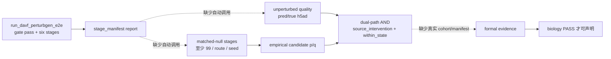

# PTM2CellNet 项目代码与文档综合分析（2026-09-13）

- **日期**：2026-09-13
- **仓库**：`/home/scu/PTM2CellNet`
- **Git/编译状态（2026-09-13 第三轮：契约硬化提交与全量验证）**：pre HEAD 为 `b13fe28`；fetch 后 `main...origin/main` 为 `63 0`（本地已含远程全部提交，无需 merge）。内容提交 `96ee544`（`feat: enforce semantic context and harden null/gate-e asset contracts`，24 files，+883/−311）后 push 至 `origin/main`（GitHub 仓库已更名 `PTM2CellNet`，remote URL 已同步更新），最终 `main...origin/main` 为 `0 0`。全量验证：pytest `not slow and not gpu` **2623 passed / 1 failed（已知旧资产暴露）/ 21 skipped / 933.65s**；ruff check、mypy（165 文件 0 错误）、compileall、requirements consistency（274 pins）通过；format check 退出 1（339 文件，已知债）。详见 §2。上一轮（同日早些时候）记录：pre HEAD `f3374d2`、提交 `520e992`，当时按任务规则未运行 pytest。
- **事实来源**：当前代码、测试、CI、`docs/CURRENT_STATUS.md`、`lessons.md` 最新条目、`docs/DAVF_PerturbGen_双路径整合方案与测试方案_2026-08-21.md`。历史报告只作背景。
- **可视化**：[project-analysis-20260913 canvas](/home/scu/.cursor/projects/home-scu-PTM2CellNet/canvases/project-analysis-20260913.canvas.tsx)

## 目录

- [1. 执行摘要](#1-执行摘要)
- [2. Phase 1：Git、编译与验证记录](#2-phase-1git编译与验证记录)
  - [2.0a 第三轮 VCS 记录](#20a-第三轮契约硬化提交本节为最新)
- [3. Phase 2：归档记录](#3-phase-2归档记录)
  - [3.1 stale_docs 只读清单与保留边界](#31-staledocs-只读清单与保留边界)
  - [3.2 第三轮增量归档复核](#32-第三轮增量归档复核2026-09-13-晚提交-96ee544-前后)
- [4. Task 1：未实现功能与后续验收缺口](#4-task-1未实现功能与后续验收缺口)
  - [4.5 未实现接口与业务流程](#45-本轮代码审计未实现接口与业务流程)
  - [4.5a 第三轮状态更新](#45a-第三轮状态更新提交-96ee544-后复核)
- [5. Task 2：部分实现模块](#5-task-2部分实现模块)
  - [5.3 主线细分完成度](#53-本轮主线细分完成度静态估算)
  - [5.3a 第三轮重估](#53a-第三轮重估提交-96ee544-后)
- [6. Task 3：技术债](#6-task-3技术债)
  - [6.2 F-01～F-09 当前未闭合技术债](#62-f-01f-09-当前未闭合技术债)
  - [6.3a 第三轮新识别技术债](#63a-第三轮新识别技术债早前报告未提及)
- [7. 结论与建议](#7-结论与建议)
- [8. 子代理调用统计](#8-子代理调用统计)
  - [8.1 第三轮调用统计](#81-第三轮调用统计2026-09-13-晚契约硬化提交与增量复核)

## 1. 执行摘要

主线工程按三个终点组织：候选准入（推理桥接）为 `PTM proposal/candidate_spec → scVI/PTMDirectionMapper → DAVF decode 方向 → 三方方向 gate → CandidateEvidence → PerturbGenInvocation`；准备/运行由 PerturbGen 六阶段完成；统计验收再汇总真实 null、质量、效用和双路径证据。2026-09-13 已把 runner 报告绑定到当前 YAML 身份、把 KO/KD rescue 模式写成显式 route，并把 tokenise/`result_h5ad` lineage 写进评估输入。这些是代码事实，不是生物学 PASS。

历史报告记录过 `2578 passed`、`2610 passed` 等结果；本轮执行代理没有重跑 pytest/业务训练，按授权完成了编译、打包和静态检查。`ruff format --check` 的当前结果仍为退出 1；所有离线工程数字均不代表生物学结果。

同日后续代码已闭合 U-01～U-05 的匹配 null 生成、候选 empirical-p 聚合、formal 输入隔离、未扰动质量提取和 donor split 接口；U-06 仅为不影响双路径判决的 pathway 次级接口。当前科学闭环仍受以下条件限制：

1. 本机 2026-09-13 donor audit：30 个 h5ad、26 可读、**0 个合规** `normal/disease + raw counts + explicit donor + ≥3 shared + Ensembl` 候选。
2. E2E 仍不自动接续 null/q-value、未扰动质量和 dual-path 统计；report 只汇总 `stage_manifest`，因此真实多 seed、≥99 matched-null 和 formal evidence 尚未形成。
3. 训练/E2E donor 参数已有，但真实 cohort 的训练-only/held-out 列表、冻结 manifest 绑定和 held-out DAVF 方向指标尚未验证。

取消项（实时质谱流、自定义 PTM 库、GUI、新 API-key）不列入未实现。Gate-E 工具和 M6 verifier 已存在；缺的是合规队列、冻结资产和真实统计证据，不是缺模块文件。

**2026-09-13 第三轮（契约硬化提交）后的对抗性复核结论**：本轮把工作树遗留的 21 个源码/测试文件改动连同文档以 `96ee544` 提交入库并 push 同步远程。相对本报告早先版本，§4.5/§6.2 的 F 系列缺口状态发生实质变化——**F-04（语义合同）、F-05（null record 身份绑定）、F-06（Gate-E 必需证据）、F-07（canonical Ensembl）、F-08（M6 行级 modes）五项已在代码层闭合**；F-03 训练侧已 fail-fast 但 tokenise 行绑定仍开放；F-01 只完成"显式声明不接续"（E2E report 写出 `statistical_evidence=inconclusive`）而未实现统计接续；F-02/F-09 无变化。科学验收状态**未变**：合规 cohort 仍为 0，无生物学 PASS。本轮另识别 4 项早前未记录的技术债（TD-13-13～16，见 §6.3a）。

## 2. Phase 1：Git、编译与验证记录

### 2.0 2026-09-13 执行代理真实 VCS 记录

#### 2.0a 第三轮（契约硬化提交，本节为最新）

| 项 | 本次真实结果 |
|---|---|
| 操作前 HEAD | `b13fe28`（`docs: finalize audit call statistics`） |
| `git fetch origin` | 成功；fetch 后 `main...origin/main` 为 `63 0`（本地领先 63、落后 0） |
| merge | `merge=no-op`；已在 `main`，远程无落后提交，不创建 merge commit |
| 内容提交 | `96ee544` — `feat: enforce semantic context and harden null/gate-e asset contracts`（24 files，+883/−311） |
| 提交内容 | SemanticContext 七字段合同贯穿 proposal→gate→evidence→invocation；NullStageRecord 身份绑定与双重校验；Gate-E 必需证据（benchmark/vocab/davf 全要求）+ canonical ENSG coverage；checkpoint `scvi.gene_names` canonical ENSG strict check；frozen cohort 行级 modes；训练 donor_split metadata fail-fast；E2E `statistical_evidence` 显式 inconclusive；11 个新测试函数；文档同步 |
| push | `c76fff8..96ee544 main -> main` 成功；GitHub 仓库已更名 `PTM2CellNet`，remote URL 已更新为 `git@github.com:valleyhe/PTM2CellNet.git` |
| 最终同步状态 | `main...origin/main` 为 `0 0`（完全同步） |
| 提交后工作树 | 本报告更新前 clean |

**本轮编译/验证流程（全部真实执行）**：

| 检查 | 结果 |
|---|---|
| `python -m pytest -m "not slow and not gpu" --timeout=300` | **1 failed, 2623 passed, 21 skipped, 67 warnings in 933.65s**；唯一失败 `tests/integration/test_scvi_davf_connection.py::test_real_current_davf_direction_keeps_token_and_decoder_indices_separate` 为已知资产行为：本地旧 checkpoint `latent_davf_perturbgen_4018/best_model.pt` 的 `gene_names` 非 canonical ENSG，被本轮落地的 strict check 正确暴露（fail-fast 生效），非代码回退；与提交前基线一致，本轮改动未引入新失败 |
| `ruff check src scripts tests` | exit 0；All checks passed |
| `python -m ruff format --check src scripts tests` | exit 1；339 文件需格式化、124 已格式化（与既有记录一致，未批量改写） |
| `python -m mypy src/ --ignore-missing-imports` | exit 0；165 source files 无问题 |
| `python scripts/check_requirements_consistency.py` | exit 0；274 lock pins 满足约束 |
| `python -m compileall -q src scripts` | exit 0 |

#### 2.0b 第二轮（早先记录，保留）

本节回填第二次执行结果；下方 2.0c 为第一次。

| 项 | 本次真实结果 |
|---|---|
| 操作前 HEAD | `f3374d223a11749edd76a3ee6ad83e9b84b8ebdf` |
| `git fetch origin main` | 成功，2026-09-13 18:45:30–18:45:37 CST，exit 0 |
| fetch 后 `origin/main` | `c76fff881f268f9bd0b39d68db8ba547115ec4cf` |
| fetch 后 `main...origin/main` | `59 0`（本地领先 59、落后 0） |
| merge | `merge=no-op`；已在 `main`，远程无落后提交，不创建 merge commit |
| 内容提交 | `520e99249e41ba837965ccd4cbb33f0eac1e2cdf` — `feat: align PTM-DAVF-PerturbGen evidence pipeline` |
| 内容提交后 `main...origin/main` | `60 0` |
| 检查后工作树 | clean；报告回填前无 staged/unstaged 路径 |

本节回填本次真实执行结果；下方旧表格保留历史审计背景，不覆盖历史结论。

### 2.1 版本标识（历史快照，不代表当前 VCS）

> 下表来自既有审计/修复记录，仅作历史背景；当前真实 VCS、编译和验证结果见 §2“Git、编译与验证记录”。

| 项 | 值 |
|---|---|
| 默认分支 | `main`（已检出） |
| 远程 | `origin` = `git@github.com:valleyhe/PTM2CellNET.git`（无 NAS remote） |
| 提交前 HEAD | `2cb77d8330699a1caa02d47603f460c6c9f4c320` |
| `origin/main` | `c76fff881f268f9bd0b39d68db8ba547115ec4cf`（本地祖先；fetch 成功；本地超前，**未 push**） |
| 修复提交 | `6a194a111ecc3bab5441763358f178f39c963019` |
| 分析+归档提交 | `6e3feaf1b82f7ee116231954205121f814707ac6` |
| 合并 | 已在 `main`，无需 merge commit |
| 标签 | `v2.0`、`v1.0`（本轮未打新 tag） |
| 工作树状态（提交修复后、本报告前） | clean except 后续归档/报告 |

### 2.2 修复提交在做什么

`6a194a1` 把 2026-09-10/13 已完成的 DAVF–PerturbGen 契约收口入库：**为什么**是防止 runner 接受另一份 YAML 的通过报告、防止 KD/up 被错误要求 mask/pad/delete、以及防止评估层用目录 latest 猜测 tokenise/`h5ad` 身份。71 files, +9142/−1555。未纳入 secrets。`scripts/predict.py` 大 diff 是 CRLF→LF。

### 2.3 验证命令（2026-09-13 执行代理结果；pytest 按规则未运行）

命令按 `AGENTS.md`：

```bash
python -m pytest -m "not slow and not gpu" --timeout=300
ruff check src scripts tests
python -m ruff format --check src scripts tests
python -m mypy src/ --ignore-missing-imports
python scripts/check_requirements_consistency.py
```

| 检查 | 本次真实结果 |
|---|---|
| `python -m compileall -q src scripts` | exit 0 |
| `python -m build --sdist --wheel --no-isolation --outdir /tmp/ptm2cellnet-build-20260913` | exit 0；生成 `ptm2cellnet-1.0.0.tar.gz` 与 `ptm2cellnet-1.0.0-py3-none-any.whl` |
| `ruff check src scripts` | exit 0；All checks passed |
| `python -m ruff format --check src scripts` | exit 1；182 个文件需格式化，58 个已格式化 |
| `python -m mypy src/ --ignore-missing-imports` | exit 0；165 个 source files 无问题 |
| `python scripts/check_requirements_consistency.py` | exit 0；274 个 lock pins 满足约束 |
| pytest / 业务训练 | 未运行；任务明确禁止，因而没有 pytest exit code |

> **第三轮更新（2026-09-13 晚）**：第三轮已补跑全量 pytest，真实结果为 **2623 passed / 1 failed（已知旧资产暴露，非代码回退）/ 21 skipped / 933.65s**，其余静态检查全部通过（详见 §2.0a）。`ruff format --check` 当前为 339 文件待格式化（`src scripts tests` 口径）。

### 2.3a 历史验证记录（仅作背景）

| 检查 | 既有记录（非本次结果） |
|---|---|
| pytest（Python 3.12.13，`SSH_unit`） | **2578 passed, 21 skipped, 69 warnings in 798.65s (0:13:18)**，exit 0；收集 2599 items |
| `ruff check src scripts tests` | All checks passed，exit 0 |
| `ruff format --check` | **329 files would be reformatted, 124 already formatted**，exit 1 |
| `mypy src/ --ignore-missing-imports` | Success: no issues found in **161** source files，exit 0 |
| `check_requirements_consistency.py` | lock consistency OK（274 pins），exit 0 |
| `python -m pip check`（环境，非门禁） | `ptm2cellnet` vs NumPy 2.4.3；`scgpt` vs `scvi-tools 1.4.3`；`ssh-unit` vs `torchaudio 2.4.1+cu118` |

相对 2026-09-10 记录的 2573 passed / 15 skipped（当时额外排除 `real_assets`、timeout 600），上述差异只是历史记录之间的比较。**不能**把该离线数字写成生物学 PASS。未跑 `--cov`，不宣称当前覆盖率百分比。

### 2.4 关键变化要点（相对 `2cb77d8`）

- Runner 必须用当前 base YAML 的 gene/mode/route/ENSG/seed/path 绑定 E2E report（`scripts/run_perturbgen_pipeline.py`）。
- Dual-path：KO/up 才要求 mask+pad+delete 二取三；KD/up 只要求 mask；down 为 overexpress。
- N-05 assembler 精确 tokenise lineage，并复制 runner 已登记的 `result_h5ad.sha256`。
- Gate-0 对原始 tokenise 输入做 canonical Ensembl 硬检查。
- 新增 `candidate_spec` / `eval_assembly` / `frozen_cohort` / `gate_e` / `null_selection` 及其测试（其中后几项在 9/10 工作树已存在，本轮才入库）。

## 3. Phase 2：归档记录

目录：`archive/20260913/`。清单：[`ARCHIVE_MANIFEST.md`](archive/20260913/ARCHIVE_MANIFEST.md)。

| 类别 | 原路径 | 现路径 | 原因 |
|---|---|---|---|
| 权威分析 | `project_analysis_20260910.md` | `archive/20260913/reports/` | 被本报告取代 |
| 修复日志 | `project_repair_report_20260910.md` | `archive/20260913/reports/` | 被 `project_repair_report_20260913.md` 覆盖 |
| E2E 点时报告 | `docs/guides/davf_perturbgen_e2e_execution_report_20260902.md` | `archive/20260913/reports/` | 不能反映 9/13 契约 |
| 过时计划 | `docs/guides/davf_perturbgen_retraining_plan_20260902.md` | `archive/20260913/guides/` | 自声明被 KO/KD 训练指南取代 |
| 点时战役 | `docs/guides/davf_cell_baseline_training_plan_20260904.md` | `archive/20260913/guides/` | 命令已进入 `davf_ko_kd_training.md` |
| 入口 stub ×12 | 根目录 `project_analysis_202608*` / `project_repair_report_202608*` | `archive/20260913/stubs/` | 正文早已归档；stub 仍自称当前权威 |

未移动 `docs/` 整树。`project_repair_report_20260913.md` 留在根目录作修复证据。先前 `project_analysis_20260901.md` 已在 `archive/20260910/reports/`。

### 3.1 stale_docs 只读清单与保留边界

本节引用本轮 `stale_docs_audit` 的只读盘点（清单时间 2026-09-13；**tracked 文件归档基线**为 `6a194a1`，**ignored 文件追加移动前 HEAD** 为 `f3374d2`）；本报告整合期间没有移动、删除或归档文件。盘点共建议处理 **17 个已跟踪过时入口**：根目录 202608* 的分析/修复 stub 12 个、2026-09-10 的分析与修复报告 2 个、日期化 guide 3 个。它们的正文分别已经在 `archive/20260910/` 或 `archive/20260913/`，根目录和 docs 下的同名入口仍可能把旧文档说成当前权威，需后续由专门执行代理按清单处理。

已经归档、应视为历史证据的目录包括 `archive/20260816`～`archive/20260824` 的分析/修复正文以及 `archive/20260910/reports/project_analysis_20260901.md`；`archive/20260913/` 中已有的 reports/guides/stubs 也只作历史追溯。建议后续归档的具体路径为 `project_analysis_20260910.md`、`project_repair_report_20260910.md`，以及 `docs/guides/davf_perturbgen_e2e_execution_report_20260902.md`、`docs/guides/davf_perturbgen_retraining_plan_20260902.md`、`docs/guides/davf_cell_baseline_training_plan_20260904.md`。后两份计划已自声明被现行 KO/KD 指南取代；E2E 点时报告不能反映 9/13 契约。

应保留的活文档是 `README.md`、`AGENTS.md`、`CLAUDE.md`、`lessons.md`、`docs/CURRENT_STATUS.md`、`pyproject.toml`、`pytest.ini`、现行安装/数据整合/训练/部署/真实资产验收/`davf_perturbgen_e2e`/bridge/KO-KD guides、`docs/DAVF_PerturbGen_双路径整合方案与测试方案_2026-08-21.md`、`project_repair_report_20260913.md`、`docs/guides/gse_normal_disease_davf_plan_20260904.md` 和源码/测试。GSE 计划是唯一操作性 GSE 文档，不能因日期归档。`docs/PTM2CellNet_技术文档.md`、`docs/文件说明.md`、`docs/项目文档.md` 是 Sphinx 入口 stub，当前应保留但需要刷新其中指向旧报告的链接。上述区分只描述盘点结果，不表示本次已执行归档。

### 3.2 第三轮增量归档复核（2026-09-13 晚，提交 `96ee544` 前后）

按同一判定标准（过时 DOCUMENT = 与代码/现行需求实质差异；过期 REPORT = 生成超 30 天即 2026-08-14 前，或已不反映当前状态）对全仓未归档文档做了对抗性增量复核，结论：**零新增归档对象**。依据：

| 候选 | 最后修改 | 处置 | 依据 |
|---|---|---|---|
| `CLAUDE.md` | 2026-04-14（git log） | 保留 | 内容为 AI 协作规范（提示词工程/确定性原则），不描述项目实现状态，与当前代码无实质冲突；日期旧不等于过时 |
| `CHANGELOG.md` | 2026-08-24 | 保留 | 未超 30 天阈值 |
| `task_plan.md` | 2026-09-13（`520e992`） | 保留 | 历史计划快照，全部条目 `[completed]`，对旧报告的引用仅在"已完成"历史条目中，不声称当前权威 |
| `IBD_dataset.md`、`PerturbGen_分析与预训练模型使用指南.md` | 2026-09-13 | 保留 | 当日已刷新；头部明确 cohort=0、下载不能替代 preflight，与现行契约一致 |
| `docs/PTM2CellNet_{技术,项目,文件说明}文档.md` 等 Sphinx 入口 | 2026-09-13（`6e3feaf`） | 保留 | 指针已在上轮刷新 |
| `docs/_build/` | — | 无需处理 | `git ls-files docs/_build` 为 0，构建产物未被跟踪 |
| 根目录其余 `.md`（README/AGENTS/lessons/CURRENT_STATUS 等） | 2026-09-13 | 保留 | 活文档 |

同时确认本轮代码变更（SemanticContext 等新公开合同）与文档的一致性缺口：`API_DOCUMENTATION.md` 与 `docs/guides/perturbgen_bridge.md` 尚未提及 `semantic_context`（`davf_perturbgen_e2e.md` 已同步，含 3 处）。这是文档漂移技术债（TD-13-13，见 §6.3a），按"文档在维护中"处理而不是归档。

## 4. Task 1：未实现功能与后续验收缺口

### 4.1 方法与排除项

对比现行需求（方案 v2.0、lessons L-2026-0821-02 至 L-2026-0902-03、guides、测试）与 `src/integration/perturbgen/`、相关 scripts。已读取 `AGENTS.md`、`docs/CURRENT_STATUS.md`、本报告、`project_repair_report_20260913.md`、`README.md`、存在时的 `task_plan.md`、`.planning/REQUIREMENTS.md`、`.planning/ROADMAP.md`、`.planning/STATE.md`、`lessons.md` 及 `docs/guides/` 中安装、数据、训练、E2E、bridge、真实资产验收和 KO/KD 相关文件。基础审计时 CodeGraph 为 465 files / 9912 nodes。以下 U-01～U-05 先保留基础审计时的缺口定位，再标注同日后续修复状态，避免把历史记录改写成现状。

**方法与证据口径**：本轮代码审计以源码定义/调用关系、CLI 参数与序列化字段、配置/manifest 契约、测试是否覆盖正式分支、指南与当前状态文档交叉核对；不把普通函数存在当作真实资产可用，不把 smoke/synthetic/mock/bridge 或历史测试数字当作生物学 PASS。证据等级依次为：源码路径+精确行号（实现事实）、测试/CI 配置（可重复性边界）、具名 manifest/资产（可追溯输入）、真实 cohort 的实际输出（正式 biology evidence）。本次报告整合阶段没有重新运行测试、编译、业务命令或联网；百分比是按 §5.1 静态估算。

**已实现、不得再列为未实现（代码层）**：三方 gate、`PerturbGenInvocation` 硬要求 `direction_gate_status=='pass'`、candidate_spec、eval_assembly、frozen verifier、Gate-E **工具**、null **选择/生成/汇总/loader**、候选 empirical-p 聚合、formal 输入隔离、未扰动质量提取、donor split 接口、六阶段 runner、LatentDAVF schema v2 + embedding asset、9/13 YAML binding。E2E 仍未自动把这些统计接续为正式科学结论。

**取消项（`src/project/scope.py`）**：V2-02 实时质谱流、V2-03 自定义 PTM 库、V2-05 GUI、SEC-AUTH-APIKEY 新 API-key。兼容 auth 只靠测试维护。不暴露 PerturbGen HTTP API 是有意决策。

### 4.2 代码缺口与后续闭合状态

#### U-01 匹配 null 的 batch stage 生成端 — 历史高缺口，代码已闭合；真实验收未完成

- **需求**：方案 §4.7 / §5.4 正式 ≥99 匹配 null，分层预计算写入 manifest。
- **基础审计时现状**：`select_matched_nulls`（`src/integration/perturbgen/null_selection.py:155`）无生产 callers，且无 batch 生成器；N-05 要求**外部** null manifest。
- **后续代码状态（U-01）**：已新增 `src/integration/perturbgen/null_generation.py` 与 `scripts/run_matched_null_stages.py`，复用现有 stage plan，并要求真实 GPU 路径提供 `rescue_extractor`；代码接口闭合。正式 ≥99 null 的真实 GPU 矩阵、rescue 分布和 manifest 仍待 A-01/A-05。

#### U-02 候选级 empirical-p 聚合 — 历史高缺口，代码已闭合；真实验收未完成

- **需求**：方案 §4.7 条件 6，候选层 `q_value < 0.05`。
- **基础审计时现状**：单 run `(k+1)/(n+1)` 与外部 `candidate_pvalue` 可进入汇总，候选层聚合规则未定。
- **后续代码状态（U-02）**：已实现 `aggregate_candidate_empirical_pvalues`，formal estimand 为 `conservative_max_required_runs`；跨 path/mode/seed 缺覆盖即失败，p 只在候选层用于 BH，path AND 仍由 rescue/donor/null count 决定。真实 null 运行与正式 q 仍待 A-05。

#### U-03 `uniform_candidate_pvalue` 无 formal 隔离 — 历史高缺口，代码已闭合；真实验收未完成

- **需求**：L-2026-0902-03；方案 §3 tiny smoke ≠ 科学验收。
- **基础审计时现状**：`build_eval_input_payload`（`eval_assembly.py:364-372`）在无 table 时接受 uniform p，且无 formal 隔离。
- **后续代码状态（U-03）**：assembler/evaluator/CLI 的 `evaluation_mode=formal` 已拒绝 uniform、外部表和手填 p；engineering 路径可保留 synthetic 结果并标为非科学验收。真实 formal null/q 仍未形成。

#### U-04 未扰动质量无数据生产者 — 历史高缺口，代码已闭合；真实验收未完成

- **需求**：方案 §5.4 未扰动预测质量门。
- **基础审计时现状**：`evaluate_unperturbed_quality` 仅测试调用，CLI 可手填 quality status；`dual_path.py:309-314` 非 `pass` 则不能 AND PASS。
- **后续代码状态（U-04）**：已实现 `extract_unperturbed_quality_from_h5ad`，formal 要求该生产来源；仍需真实 pred/true h5ad 才能形成质量证据。

#### U-05 训练/tokenise 无 donor split — 历史高缺口，接口已闭合；真实验收未完成

- **需求**：方案 §4.6-2、§7.2 M6；frozen 契约 ≥2 train + ≥3 held-out disjoint（`frozen_cohort.py:153-169`）⇒ 完整 M6 至少 5 个 shared donor。
- **基础审计时现状**：`train_donors` 只出现在 frozen manifest，训练入口不接收 donor；Gate-0 只保证 `min_donors>=3`。
- **后续代码状态（U-05）**：`train_latent_davf.py` 与 E2E 已接收 `train_donors`/`held_out_donors` 并可绑定 frozen manifest；未提供列表时明确为 unspecified。真实 ≥2/≥3 划分、历史 checkpoint provenance 和 held-out DAVF 指标仍待 A-02/A-03。

#### U-06 PerturbGen pathway/GSEA — M / secondary；次级接口已存在

- **需求**：L-2026-0901-01 写明 pathway 效用；方案 §4.7 硬 PASS **未**列 pathway。
- **现状**：已有 `pathway_evidence.py` 次级接口，默认 `backend=none` 为 inconclusive，且不影响 dual-path 判决；尚未接入有签字 GMT 的 gseapy 执行。

#### U-07 M7 删除 Geneformer — M / secondary（Gate-E 门控）

- **需求**：L-2026-0821-02；方案 §7.2 M7。Gate-E 未过不得删。
- **现状**：`geneformer_embedding.py` 仍在；非 semantic vocab 时 `_stable_gene_index` SHA-256 取模（`:353-356`）；load 失败可 random fallback（`:358-377`）。正式 orchestrator 已要求 PerturbGen vocab（`orchestrator.py:230-234`）。实现名是 `load_perturbgen_embedding_asset`，不是 lessons 里的类名 `PerturbGenEmbeddingLoader`——能力已有，不另列缺类。

### 4.3 验收缺口（工具在，资产不在）

| ID | 缺口 | 优先级 | 证据 |
|---|---|---|---|
| A-01 | Gate-0 合规 cohort | H | `outputs/perturbgen/spike/20260913_donor_audit/evidence.json`：30/26/0 |
| A-02 | 真实 M6 冻结队列 | H | `frozen_cohort.py` + `run_frozen_acceptance.py` 在；真实未跑 |
| A-03 | Held-out donor DAVF 方向指标 | H | donor split 接口已在；真实列表、冻结绑定和 held-out 指标未跑 |
| A-04 | Gate-E ≥200 + 旧基线 | H | `gate_e.py` `MIN_BENCHMARK_SAMPLES = 200`；无真实 CSV |
| A-05 | 正式 3 seed × 双路径 × ≥99 null GPU 矩阵 | H | null 生成端已在；无合规数据和真实 GPU 运行 |
| A-06 | Gate-4 formal evidence | M | `perturbgen-real-assets.yml` 存在；无 formal donor 配置 |
| A-08 | R-01～R-03 真实图/扰动 | M | CURRENT_STATUS；opt-in，不挡主线工程 |

### 4.4 主线流程图（准入、运行、统计验收分开）

```mermaid
flowchart TD
  A[PTM site presence] --> B[PTM proposal / candidate_spec<br/>用户假设或逐 site override]
  B --> C[scVI context + PTMDirectionMapper]
  C --> D[DAVF decode<br/>decode(z_intervened)-decode(z_context)]
  Obs[donor-level observed<br/>disease-normal] --> E{三方方向 gate}
  D --> E
  E -->|fail / inconclusive| Z[不生成 invocation]
  E -->|pass| F[CandidateEvidence<br/>PerturbGenInvocation]
  F --> G[准备/运行：六阶段]
  G --> H[tokenise → train_mask → train_decoder]
  H --> I[perturb]
  I --> S[source_intervention=[src]]
  I --> W[within_state=[tgt]+pert_tps]
  S --> J[export_gene_embeddings → report]
  W --> J
  J --> K[report 仅汇总 stage_manifest]
  K --> L[统计验收：matched null<br/>未扰动质量 + candidate p/q + dual-path]
  L --> M{真实资产与 donor/manifest 证据}
  M -->|缺失：当前 0 合规 cohort| A01[[工程结果，不能 formal PASS]]
  M -->|齐备| N[formal evidence / dual-path AND]
```

普通 CLI 选择 `perturb`/`--path` 时（`run_perturbgen_pipeline.py:364`）必须提供 `--e2e-gate-report`，并绑定通过的 invocation；`PerturbGenInvocation` 本身也要求 gate 通过。底层 `runner.py:127` 只执行 `StagePlan`，不自行检查 gate，正式 invocation 执行边界仍待统一落实，不另建门禁框架。测试锚点：`test_direction_gate_passes_for_three_agreeing_directions`、`test_mainline_does_not_produce_dual_path_when_direction_gate_does_not_pass`、`test_failed_e2e_gate_report_is_rejected`。

方向字段的代码锚点是：site presence 合同见 `contracts.py:30`，proposal 的默认方向与逐 site override 见 `scripts/build_candidate_spec.py:60`；donor-level observed disease−normal 见 `src/data/gse_normal_disease.py:663`，DAVF decode 与 delta 见 `src/models/davf_inference.py:1097`、`:1133`，gate 的 up/down 直接比较见 `src/integration/perturbgen/direction_gate.py:101`。当前尚未统一参考轴；这些字段必须带各自来源，不能汇总成自动因果方向，也不能简单全局取反。

### 4.5 本轮代码审计：未实现接口与业务流程

下表把“普通接口存在”与“真实资产/生物学 PASS”分开。参数/返回按源码签名和序列化 payload 归纳；百分比与状态均来自静态代码、文档和既有证据，未通过本轮运行推断。优先级沿用需求中的 H/M；影响描述的是对正式发布或主线行为的影响。

| ID | 接口/参数/返回/用途 | 需求章节、优先级、影响 | 当前状态与精确证据 |
|---|---|---|---|
| F-01 | `run_davf_perturbgen_e2e.py` 接收 candidate/config/gate 参数，返回 `stage_manifest` 型 report；缺少把 `null_generation.run_matched_null_stages`、`eval_assembly.build_eval_input_payload`、quality extractor、empirical-p 和 `dual_path.evaluate_dual_path_candidate` 串回 report 的统计编排。 | 方案 §4.7/§5.4、A-05，H；没有 q/质量/双路径 formal evidence，不能正式发布。 | **部分实现但可用**：`scripts/run_davf_perturbgen_e2e.py:357-379,405-435` 只序列化 stages；可复用接口分别在 `src/integration/perturbgen/null_generation.py:277-399`、`src/integration/perturbgen/eval_assembly.py:334-555`、`src/integration/perturbgen/results.py:144-251`、`src/integration/perturbgen/empirical_pvalue.py:79-160`、`src/integration/perturbgen/dual_path.py:241-359`，E2E 未调用它们。 |
| F-02 | E2E 的 candidates 列表、每候选输出根和 `Orchestrator` 输入；期望公共 `tokenise/train_mask/train_decoder` 准备一次，候选循环只传 route 到两路 `perturb`/效用。当前无跨候选 prepare/reuse 返回。 | 2026-09-13 约束“固定 cohort/词表/训练配置/资产后公共准备一次”，H；多候选第二次 tokenise 可能冲突或重复 GPU。 | **部分实现但可用（单候选）**：`scripts/run_davf_perturbgen_e2e.py:412-427` 按候选建 root；`src/integration/perturbgen/orchestrator.py:498-573` 只在一次 invocation 内规划公共 stage；`src/integration/perturbgen/config_builder.py:299-313` 使用固定 tokenized 目录；`src/integration/perturbgen/runner.py:341-356,419-422` 拒绝已有外部输出。 |
| F-03 | donor split 参数 `train_donors`/`held_out_donors`、split manifest 和训练返回状态；期望 tokenise 输入行的 donor 身份、train/held-out 行集合及下游 checkpoint 一一绑定。 | 方案 §4.6-2、§7.2 M6、A-02/A-03，H；仅有 donor 名单而无行绑定会让 held-out 方向指标不能证明无泄漏。 | **部分实现但有缺陷**：`src/integration/perturbgen/donor_split.py:78-150` 只产生 canonical 列表/hash；`src/data/davf_scperturb.py:530-553,625-641,724-761` 的 split/metadata 不强制 donor 行；`src/models/train_latent_davf.py:369-377,471-493` 缺 metadata 时可继续；`scripts/run_davf_perturbgen_e2e.py:383-403` 仅写 payload/config。 |
| F-04 | PTM proposal、DAVF evidence、gate/candidate 应返回 `context`、`intervention`、baseline、objective、cohort、origin/source 及参考轴；当前字段只覆盖 gene/PTM/direction/confidence 等。 | lessons L-2026-0901-01/L-2026-0902-03、2026-09-13 方向语义约束，H；观测 disease−normal、DAVF decode delta 和 PerturbGen utility 可能被误读为同一因果效应。 | **缺失**：`src/integration/perturbgen/contracts.py:30-62,65-121,124-185` 无上述语义字段；`src/integration/perturbgen/direction_gate.py:96-116` 直接比较并做 KO/OE 映射；`src/data/gse_normal_disease.py:620-696` 与 `src/models/davf_inference.py` 的来源未在共同合同保留；`src/integration/perturbgen/candidate_spec.py:316-354` 仅保存字符串 source。 |
| F-05 | null 记录应绑定 candidate identity、route/path/mode/seed/config/asset 并由执行返回记录、重算 digest 后与 invocation 比对；当前 `collect_null_stage_records` 只收路径/hash 字段。 | 方案 §4.7、A-05，H；未绑定的 null 可进入经验 p/q，破坏 formal estimand。 | **部分实现但有缺陷**：`src/integration/perturbgen/null_generation.py:105-123` 的 `_stage_output_record` 只有定义；`:217-274` 仅复制调用方记录并检查非空；`:360-388` 接受 executor 返回的 `NullStageRecord`；`src/integration/perturbgen/eval_assembly.py:68-84` 的 identity 只取首个 pass gene/ENSG，`:126-214` 由调用方提供 mode/seed/path。 |
| F-06 | Gate-E CLI 应同时要求 benchmark、old/new vocab、paired DAVF 结果，且 canonical ENSG coverage ≥.99；返回 formal pass/fail evidence。 | M7/Gate-E、A-04，H；现有单指标或 symbol coverage 可能让 Gate-E 误报通过，阻断 Geneformer 删除和 formal 资产替换。 | **部分实现但有缺陷**：`scripts/evaluate_gate_e.py:53-56` 接受两种 vocab 或 paired 结果；`src/integration/perturbgen/gate_e.py:317-344` 只把存在的 metrics 加入 required list；`src/integration/perturbgen/gate_e.py:141-155` 以 symbol 或 ENSG 计 coverage。门槛常量在 `src/integration/perturbgen/gate_e.py:31-48`。 |
| F-07 | checkpoint/scVI gene metadata 应返回 canonical Ensembl ID 列表并与 decoder index/冻结 embedding manifest 对齐；当前仅检查字符串列表长度、唯一性和顺序。 | lessons 的 canonical Ensembl/scVI gene order 约束、A-02/A-04，H；symbol/Ensembl 混用会使 decoder index 与 PerturbGen token index 错配。 | **实现但不符合规范**：`src/models/latent_davf_dataset.py:165-180` 只 unique 字符串；`src/models/davf_checkpoint_contract.py:148-169,338-369` 只校验类型/长度/顺序；`src/models/scvi_adapter.py:748-777` 只校验维度/顺序；`src/data/data_prep.py:130-155` 的输入检查未约束保存资产元数据。冻结表等值校验在 `davf_checkpoint_contract.py:126-145`，不能替代 ID 语义校验。 |
| F-08 | M6 verifier/CLI 应允许 candidate 行级 route（KO/KD/OE）并返回按 route 的 mask/pad/delete 结果；当前 `run_frozen_acceptance.py` 使用统一 modes。 | 方案 §7.2 M6、A-02，M；混合 KO/KD CSV 无法在同一默认 invocation 中表达，KD 使用 pad/delete 会直接失败或误配。 | **部分实现但可用（单一 route）**：`scripts/run_frozen_acceptance.py:51-53` 默认 `mask,pad,delete`；`src/integration/perturbgen/frozen_cohort.py:86-93` 拒绝 KD 的 pad/delete，`:216-261` 对所有候选应用统一 modes。 |
| F-09 | 正式 invocation 已应验证通过 gate report；runner 低层只接收 `StagePlan`，应明确是外层边界还是统一在 runner 验证，避免 Python caller 绕过。 | 2026-09-13 runner/invocation 约束、A-06，M；把 runner 缺口写成已解决会掩盖绕过路径，把 runner 自行重查又会改变内部 null/engineering 调用。 | **规范边界/部分实现**：`src/integration/perturbgen/runner.py:127-168,597-612` 只执行 StagePlan/写 stage manifest；外层 `scripts/run_perturbgen_pipeline.py:363-385` 要求 `--e2e-gate-report`，`orchestrator.py:369-402` 走 invocation。 |

#### 4.5a 第三轮状态更新（提交 `96ee544` 后复核）

上表按基础审计时点保留；本轮契约硬化提交后，F 系列实际状态如下（证据为 `96ee544` diff 与源码复核）：

| ID | 基础审计状态 | 当前状态 | 闭合证据（`96ee544`） |
|---|---|---|---|
| F-01 | 部分实现但可用 | **边界显式化，统计接续仍未实现** | `scripts/run_davf_perturbgen_e2e.py` 现写出 `statistical_evidence: {status: inconclusive, scientific_acceptance: false}` 及未接续接口清单；null/质量/p/q/dual-path 仍未被 E2E 调用 |
| F-02 | 部分实现但可用（单候选） | **未闭合** | `orchestrator.py` 本轮仅新增 SemanticContext import/传递；跨候选公共 prepare/reuse 无变化 |
| F-03 | 部分实现但有缺陷 | **训练侧已闭合；tokenise 行绑定仍开放** | `train_latent_davf.py` 新增 `_validate_donor_split_metadata`：NPZ metadata 缺 `donor_split`/`dataset.donor_rows`、sha 不匹配或 donor 越界均 fail-fast；`src/data/davf_scperturb.py`（tokenise 输入侧）本轮未改 |
| F-04 | 缺失 | **已闭合（代码）** | `contracts.py` 新增 `SemanticContext` 七字段 frozen dataclass + `normalize_semantic_context`，`research_objective` 限 `association/replication/reversal`；`CandidateEvidence.semantic_context`、`build_direction_gated_candidate`、E2E 候选校验与 `run_perturbgen_pipeline.py` invocation 均贯穿；缺字段/非法值 fail-fast |
| F-05 | 部分实现但有缺陷 | **已闭合（代码）** | `NullStageRecord` 新增 `candidate_ensembl_id/path/mode/seed` 字段并规范化；`_validate_record_binding` 在 `collect_null_stage_records` 与 `run_matched_null_stages`（stage_executor 与 rescue_extractor 两路）逐记录比对 |
| F-06 | 部分实现但有缺陷 | **已闭合（代码）** | `gate_e.py` 的 `build_gate_e_report` 现要求 benchmark、vocabulary_migration、davf_noninferiority 三节全存在（`required` 含存在性），显式输出 `missing_sections`；coverage 只按 `normalize_ensembl_id` 的 canonical ENSG 计；benchmark 行 `ensembl_id` 强校验 |
| F-07 | 实现但不符合规范 | **已闭合（代码）** | `davf_checkpoint_contract.py` 对 `checkpoint.scvi.gene_names` 逐项 `normalize_ensembl_id` 且要求与原列表相等（无版本后缀）、无重复；本地旧 checkpoint `latent_davf_perturbgen_4018` 被正确暴露为不合规资产（pytest 唯一失败即此 fail-fast 生效） |
| F-08 | 部分实现但可用（单一 route） | **已闭合（代码）** | `frozen_cohort.py` 的 `FrozenCandidate` 支持 candidates CSV 行级 `modes` 覆盖统一默认 |
| F-09 | 规范边界/部分实现 | **未闭合** | `runner.py` 零修改；外层 `--e2e-gate-report` 约束不变 |

缺失的统计业务衔接可以明确画成如下流程；现有各节点接口不等于连线已经存在：




该图也限定了六阶段边界：`tokenise → train_mask → train_decoder` 属于准备，`perturb` 同时执行 `source_intervention=[src]` 与 `within_state=[tgt]+pert_tps`，最后 `export_gene_embeddings → report` 输出资产/报告；PTM/DAVF/gate 只负责候选准入，不能把 PerturbGen 结果回灌为本次 DAVF 方向。

## 5. Task 2：部分实现模块

### 5.1 评分规则（100 分，1 位小数）

| 桶 | 满分 | 计分 |
|---|---:|---|
| A 代码已接线且正式路径 fail-fast | 40 | 缺真实运行/静默回退扣分 |
| B 默认 CI 能收集的契约测试 | 25 | 只有 KO 覆盖 KO/KD 内核扣分 |
| C 指南与代码一致 | 10 | 把工程闭环写成科学闭环扣分 |
| D 具名真实资产路径存在 | 15 | 仅 Datlinger/smoke 不得给满 |
| E 正式生物学验收已执行 | 10 | 本审计全部模块 **0.0** |

分类：

- **partial but usable**：能跑、合成测试过、缺口是资产或真实运行，不是静默错答案。
- **implemented but defective**：可以输出会被外部禁止输入改写的正式 `pass`。
- **implemented but non-compliant**：能跑但与现行主线/schema 冲突。

### 5.2 得分板

本表分数沿用基础审计时点；后续代码接口闭合不等于真实科学验收已完成。

| 模块 | % | 分类 | 证据要点 |
|---|---:|---|---|
| PTM site / datasets / training | 72.0 | partial but usable | classifier 只预测 site presence；`candidate_spec.py` 接收用户/逐 site 方向；CPTAC 为 `real_assets` skip |
| API 推理 | 71.0 | implemented but non-compliant | `/predict` 输出细胞状态；`use_davf` 是 128-d 融合特征，不走三方 gate（`davf_inference.py:986-988`）。融合默认 `latent_dim=10, num_genes=5000`，正式契约是 64×4018 |
| DAVF LatentDAVF / scVI / asset | 75.0 | partial but usable | `predict_expression_direction` 要求 schema v2 + embedding asset（`:1001-1018`）；donor split 参数已接入，但真实列表、绑定和 held-out 指标未验证 |
| 三方 gate + orchestrator | 76.0 | partial but usable | `build_direction_gated_candidate` 仅 pass 才建 candidate；`PerturbGenInvocation.__post_init__` 拒绝非 pass（`orchestrator.py:116-117`）。候选方向来自显式 proposal，三路同号不等于三个独立证据，也不产生治疗因果结论 |
| PerturbGen runner/manifest | 80.0 | partial but usable | 六阶段、disk/GPU lock、`env_guard.py`；当前每候选重做 `tokenise/train_mask/train_decoder`、两路径和 export/report，Datlinger smoke ≠ donor cohort |
| Dual-path 评价 | 59.5 | partial but usable | 分数沿用基础审计；AND + route-aware 已实现（AND 证据见 `dual_path.py:276`），formal p/quality 隔离、matched-null 生成和候选 p 聚合代码已补齐，真实统计尚未接续到 E2E。`src`/`tgt` 是场景，单路通过不等于正式双路径效用 |
| Frozen / M6 verifier | 66.0 | partial but usable | `frozen_cohort.py` leakage audit；synthetic verify；无真实 M6 |
| Gate-E | 57.0 | partial but usable | `MIN_BENCHMARK_SAMPLES=200` 硬失败；单元测试用 3 行 CSV + `min_samples=3` |
| Cross-scale（opt-in） | 61.0 | partial but usable | 合成 fixture；replogle/scgenescope 未验 |
| Analysis（mapper/IBD/GSE/variant） | 63.0 | partial but usable | TD-N-24 超时已修（`gene_mapper.py:159-193`）；外部服务仍 opt-in |
| pLM / R-01～R-03 | 66.0 | partial but usable | 权重已本地化；真实图/扰动未验 |
| Geneformer→PerturbGen 迁移 | 50.0 | partial but usable | asset 导出/加载在（`scripts/export_perturbgen_gene_embeddings.py`）；Geneformer 未删，符合 Gate-E 门控 |

加权观感：工程主链约七成可用；科学验收桶全 0。

### 5.3 本轮主线细分完成度（静态估算）

为避免把一个宽模块的分数掩盖在子流程中，下面按当前主线重新拆分；它不是运行成功率，也不是生物学效应大小。估算口径仍是 §5.1 的五桶：代码接线/正式 fail-fast 40%、默认契约测试 25%、指南一致性 10%、具名资产 15%、正式生物学验收 10%；本轮未执行验证，且真实合规 cohort 为 0，因此所有行的最后一桶为 0.0。对 F-01～F-09 所在连线按其可能导致的错误 verdict 或重复运行扣除，百分比只保留一位小数。

| 细分模块 | 完成度 | 判定 | 静态证据与限制 |
|---|---:|---|---|
| PTM site presence / proposal / candidate_spec | 72.0% | 部分实现但可用 | classifier 只做 site presence；候选方向由 proposal/override 提供；缺统一研究语义。 |
| scVI context / DAVF decode / frozen embedding asset | 73.0% | 实现但不符合规范 | schema v2、embedding 等值和冻结接口存在；canonical Ensembl 与 decoder/token index 语义仍未硬校验（F-07）。 |
| 三方 direction gate | 76.0% | 部分实现但可用 | 只有三方 pass 才建立 candidate/invocation；context/intervention/reference axis 未进入合同（F-04）。 |
| PerturbGen invocation / orchestrator | 70.0% | 部分实现但有缺陷 | 外层 gate 绑定有效；多候选共享 prepare 和统计回接缺失（F-01/F-02）。 |
| 六阶段 runner / 双路径执行 | 72.0% | 部分实现但可用 | 六阶段和 `src`/`tgt` 两路可规划；runner 只执行 StagePlan，底层边界未统一（F-09），单候选 smoke 不等于真实效用。 |
| Gate-0 cohort / raw counts / donor | 58.0% | 部分实现但有缺陷 | 入口校验存在；当前 donor audit 是 30 个 h5ad 中 0 个合规 cohort，不能给 biology 分。 |
| donor split / frozen M6 | 52.0% | 部分实现但有缺陷 | donor 列表、leakage audit 和 verifier 存在；tokenise 行与 donor 身份未绑定（F-03），M6 无真实队列。 |
| matched-null / quality / candidate p/q | 64.0% | 部分实现但有缺陷 | 生成、质量提取、经验 p 聚合接口存在；E2E 未调用，null record 尚未与 invocation 重算比对（F-01/F-05）。 |
| dual-path AND / Workflow A formal utility | 42.0% | 部分实现但有缺陷 | route-aware AND 函数存在；真实 null、质量、q、donor 和 report 尚未组成正式闭环。 |
| Workflow B / Gate-E / encoder 生命周期 | 54.0% | 部分实现但有缺陷 | 基础 encoder export 与 Gate-E 工具存在；Gate-E 必需证据可被部分指标绕过（F-06），无 ≥200 真实 benchmark。 |

“部分实现但可用”表示接口、正常输入和失败路径能支持工程联调，缺口主要是资产或真实运行；“实现但有缺陷”表示可能接受不完整/未绑定证据，需修复后才可作为正式输入；“实现但不符合规范”表示功能可执行，但 ID、语义或资产契约与当前需求不一致。表中分数是审计估算，不能替代 Gate-0、Gate-E、Gate-4/5 或生物学 PASS。

#### 5.3a 第三轮重估（提交 `96ee544` 后）

评分口径不变（接线 fail-fast 40 / 默认契约测试 25 / 指南一致 10 / 具名资产 15 / 正式生物学验收 10）。本轮变化集中在接线桶（F-04/05/06/07/08 闭合带来的 fail-fast 强化）与测试桶（11 个新测试函数、2623 passed 全量回归）；资产桶与科学验收桶不变（cohort=0，biology 仍 0.0）。重估只调整受 F 系列闭合影响的行：

| 细分模块 | 基础审计 | 第三轮 | 变化依据 |
|---|---:|---:|---|
| PTM site presence / proposal / candidate_spec | 72.0% | **76.0%** | E2E 候选必须携带七字段 `semantic_context` 并贯穿 invocation（F-04） |
| scVI context / DAVF decode / frozen embedding asset | 73.0% | **82.0%** | F-07 闭合：canonical ENSG/无后缀/无重复 strict check；分类由“实现但不符合规范”改为“部分实现但可用” |
| 三方 direction gate | 76.0% | **84.0%** | F-04 闭合：语义字段进合同，缺字段/非法 objective fail-fast |
| PerturbGen invocation / orchestrator | 70.0% | **75.0%** | invocation 传递并校验 `semantic_context`（`run_perturbgen_pipeline.py`） |
| 六阶段 runner / 双路径执行 | 72.0% | 72.0% | F-09 未闭合，无变化 |
| Gate-0 cohort / raw counts / donor | 58.0% | 58.0% | cohort=0 未变 |
| donor split / frozen M6 | 52.0% | **61.0%** | F-03 训练侧 fail-fast + F-08 行级 modes 闭合；tokenise 行级 donor 绑定仍开放 |
| matched-null / quality / candidate p/q | 64.0% | **72.0%** | F-05 闭合（record 身份绑定）；E2E 自动接续仍缺（F-01） |
| dual-path AND / Workflow A formal utility | 42.0% | **46.0%** | F-05 闭合收益；F-01/F-02 仍开放，真实统计证据未形成 |
| Workflow B / Gate-E / encoder 生命周期 | 54.0% | **63.0%** | F-06 闭合（三节必需 + canonical coverage + benchmark 行校验）；≥200 真实 benchmark 仍缺 |

对应 §5.2 广模块行的更新：三方 gate + orchestrator 76.0→**81.0**；DAVF LatentDAVF / scVI / asset 75.0→**80.0**；Dual-path 评价 59.5→**63.5**；Frozen / M6 verifier 66.0→**70.0**；Gate-E 57.0→**64.0**；其余行不变。加权观感不变：工程主链约七成半可用；科学验收桶全 0。

### 5.4 规格 vs 实现摘录

方案/lessons（L-2026-0901-01）：DAVF 只提供方向/置信，PerturbGen 负责效用。

实现：正式 CLI `run_davf_perturbgen_e2e.py` 默认**不**跑六阶段，必须 `--run-perturbgen`（`:424`）。符合“避免把不完整效用当 PASS”。

方案 §4.7：候选 q 来自匹配 null 的经验校准。

实现：`run_matched_null_stages`、`aggregate_candidate_empirical_pvalues` 和 formal 输入隔离已在代码中；但 E2E report 仍只汇总 `stage_manifest`，不会自动执行 null/q-value、未扰动质量或 dual-path 统计。真实运行完成前不能把工程接口写成 formal evidence。

资产边界：`export_gene_embeddings` 从 `configs/integration/perturbgen.yaml:257` 读取固定基础 encoder checkpoint，不消费候选结果，也不回灌当前 DAVF。encoder → 静态冻结 embedding asset → LatentDAVF 重训/Gate-E 是独立的 Workflow B；gate → PerturbGen utility 是 Workflow A。当前六阶段没有按这两个资产生命周期自动拆分，不能反写成已实现的跨候选公共准备。

## 6. Task 3：技术债

严重度：严重 = 数据损坏 / gate 绕过 / 密钥泄漏 / 阻断主线；高 = 可产生虚假正式 PASS、身份错配、挂死、错误科学 verdict；中 = 可维护性/覆盖/格式/类型；低 = 风格。

本轮**未**把已关闭的 TD-N-24（mapper 超时）和 TD-N-10（CI analysis job）再打开；TD-13-01～04 的接口/隔离问题也已由同日 U-01～U-05 修复在代码层闭合。`.github/workflows/ci.yml:59-84` 已有 analysis job。缺真实 donor **不是**代码味，除非代码把 biology 标 PASS。

技术债覆盖面：F-01/F-05/F-06/F-07 主要是代码契约与数据完整性，F-02/F-03/F-09 是编排/架构边界，F-02 还带来 GPU/磁盘性能成本，F-04 是研究语义与文档契约；既有 TD-13-05～07、TD-13-09 覆盖格式、依赖、测试/覆盖率和 CI，TD-13-10～12 覆盖 API/遗留 loader/部署文档。这样既保留已闭合债务的状态，也避免把同一缺口重复计数。

### 6.1 高（历史问题与当前状态）

#### TD-13-01 外部/uniform 候选 p 可改正式 verdict — 已闭合（代码）；真实验收未完成

- **基础审计时问题**：`build_eval_input_payload` 允许 `uniform_candidate_pvalue`；evaluator 对该字段 BH 后写入 `q_value`。`empirical_pvalue` 不参与 AND。
- **场景**：有人用 `0.04` uniform 跑 `evaluate_perturbgen_dual_path.py`，dual-path 其它门都过就会 `pass`。
- **基础审计时方案（后续修复采用的方向）**：
  1. formal 模式拒绝 uniform/手填 p，只接受带 provenance 的 empirical 聚合。优点：堵住假 PASS。缺点：现有合成测试要改夹具。约 **1.0 人日**。
  2. 保留 uniform，但报告 schema 强制 `evidence_class=synthetic`，发布脚本拒绝该类。优点：演示仍可用。缺点：调用方可漏看字段。约 **0.5 人日**。
  3. 先由统计负责人定义 estimand 再实现聚合。优点：科学正确。缺点：规则未定前不能写死。约 **1.0–2.0 人日**（不含讨论）。
- **风险**：未定义聚合就硬编码会锁死错误 estimand。
- **技能**：Python、多重检验、现有 `benjamini_hochberg`。
- **当前状态**：formal 已拒绝 uniform/外部表/手填 p；`conservative_max_required_runs` 已用于候选层聚合。engineering synthetic 仍可运行，但不能作为科学验收。

#### TD-13-02 null 生成端缺失 — 已闭合（代码）；真实验收未完成

- **基础审计时问题/影响**：见 U-01。没有真实 null rescue 就不能声称 G-1/BH 闭环。
- **基础审计时方案（后续修复采用的方向）**：
  1. 对 selection manifest 循环调用现有 stage plan（mask/OE 按 route）。优点：复用 runner。缺点：GPU 墙钟长。**2.0–3.0 人日** + GPU。
  2. 预计算共享 null 池再按 candidate 绑定。优点：省计算。缺点：要证明匹配距离仍有效。**3.0+ 人日**。
  3. 继续外部手工跑 null，只硬化 manifest 校验。优点：立刻。缺点：不能规模化。**0.5 人日**。
- **依赖**：A-01 合规 cohort，否则只能合成。
- **当前状态**：`run_matched_null_stages` 与 CLI 已存在；正式 ≥99 null 的真实 GPU 矩阵和 rescue 分布仍依赖 A-01/A-05。

#### TD-13-03 训练入口无 donor split — 接口已闭合；真实验收未完成

- **基础审计时问题**：frozen 要 split，训练不要。无法证明 held-out 未进 DAVF/tokenise。
- **基础审计时方案（后续修复采用的方向）**：
  1. 训练/latent-pair/E2E 增加显式 donor 列表并写入 manifest。**1.5 人日**。
  2. 只在 frozen verify 比对训练 manifest 的 donor SHA。**1.0 人日**，但要先有训练写出该字段。
  3. 维持现状、文档禁止声称 held-out biology。已部分做到。**0 人日**，科学声明仍禁。
- **当前状态**：`donor_split.py` 与训练/E2E 参数已存在，可绑定 frozen manifest；未提供列表时为 `unspecified`。真实 ≥2 train + ≥3 held-out 划分、历史 checkpoint provenance 和 held-out DAVF 指标仍未验证。

#### TD-13-04 Geneformer mapper 与 PerturbGen asset 身份错配 — 已闭合（代码）；历史 checkpoint 需隔离

- **基础审计时问题**：
  1. `scripts/finetune_davf_e2e.py` 的 `build_model` 把 `embedding_asset_path` 写入 DAVF，却无条件 `PTMDirectionMapper()`（`:205-225`）。默认 mapper 走 `get_geneformer_loader()`；token ID 再去索引 PerturbGen `gene_embed_table`，静默错配。
  2. `PTM2CellNetBase` 在无 asset 时仍建 Geneformer mapper（`architectures.py:276-279`）。
  3. `get_gene_embedding` 在非 semantic vocab 时 hash（`geneformer_embedding.py:353-356`）；load 失败可 random（`:358-376`）。正式 orchestrator 已要求 PerturbGen vocab，但 finetune/API 融合路径没有。
- **场景**：`--embedding-asset` 的 e2e finetune、或 `use_davf=True` 且未配 asset 的 `/predict`。
- **方案**：
  1. `build_model` 在 asset 存在时必须 `davf_module.build_perturbgen_direction_mapper()`；否则硬失败，禁止 Geneformer 默认。优点：堵住错配。缺点：依赖 Geneformer 的 demo 会挂。**0.5–1.0 人日**。
  2. 校验 mapper vocab 来源与 asset 一致（gene_to_idx hash），不一致即失败。优点：可检测混用。缺点：仍允许纯 Geneformer 跑。**0.5 人日**。
  3. Gate-E 过后再删 `geneformer_embedding.py`（M7）。正确顺序，不能提前。
- **风险**：用混用 ID 训出的旧 finetune checkpoint 无法只靠改 mapper 挽救。
- **当前状态**：`finetune_davf_e2e.py` 已要求 embedding asset 并使用对应 mapper；历史混用 checkpoint 仍需隔离，Geneformer 删除继续受 Gate-E 门控。

### 6.2 F-01～F-09 当前未闭合技术债

以下条目是本轮代码审计对现有 TD/U/A 记录的补充或深化；已在 §4.2 明确“代码层闭合”的 U-01～U-05 不重新当作缺失接口，但其真实资产和 E2E 统计限制仍保留。工期均按 **0.5 个工作日**为最小粒度估算，未把真实 cohort 获取、GPU 墙钟或科学方案讨论伪装成编码工期。

> **第三轮状态标注（`96ee544` 后）**：F-04、F-05、F-06、F-07、F-08 已在代码层闭合（逐项证据见 §4.5a），不再计为未闭合债务；F-01 降级为“E2E 统计接续缺失（边界已显式化）”，F-02/F-09 维持原判，F-03 剩余 tokenise 行绑定部分。下列各条保留原文与原方案供追溯，方案已被采纳的标注如下：F-04≈方案 A、F-05≈方案 B、F-06≈方案 A+B、F-07≈方案 A、F-08≈方案 B。

#### F-01 E2E 没有自动接续 null、质量、p/q 与 dual-path — 高

- **证据/影响**：`scripts/run_davf_perturbgen_e2e.py:357-379` 组装 payload 时 `perturbgen_runs` 为空，`:405-435` 只循环 invocation 并序列化 stages；没有调用 `run_matched_null_stages`、`extract_unperturbed_quality_from_h5ad`、`aggregate_candidate_empirical_pvalues`、`build_eval_input_payload` 或 `evaluate_dual_path_candidate`。可复用接口分别在 `src/integration/perturbgen/null_generation.py:277-399`、`eval_assembly.py:334-555`、`results.py:144-251`、`empirical_pvalue.py:79-160`、`dual_path.py:241-359`。对应方案 §4.7/§5.4、A-05；没有统计证据就不能形成 formal PASS。
- **方案**：A. 在 E2E report 后串接现有接口并把 provenance 写回 report，**3.0–5.0 天**；优点是单条 lineage、正式入口清晰，缺点是依赖真实 H5AD/GPU 和统计定义。B. 增加独立 post-run CLI，输入 stage report/manifest 输出 formal evidence，**2.0–3.0 天**；优点是改动面小，缺点是两步调用容易漏接。C. 保持 stage-only 并只把 report 标成 engineering，**0.5 天**；优点是立即澄清边界，缺点是不能满足正式需求。
- **资源/风险**：Python/PerturbGen 编排维护者、anndata/pandas、GPU、统计/生物学负责人；最大风险是把 path/mode/seed 的聚合误定成错误 estimand。

#### F-02 多候选没有公共 prepare/reuse，固定 tokenise 输出会冲突 — 高

- **证据/影响**：`scripts/run_davf_perturbgen_e2e.py:412-427` 为每个 candidate 建 root；`src/integration/perturbgen/orchestrator.py:498-573` 的公共 stage 只在一次 invocation 内计划；`src/integration/perturbgen/config_builder.py:299-313` 使用固定外部 `ref/T_perturb/tokenized_data/<dataset>/...`；`src/integration/perturbgen/runner.py:341-356,419-422` 对预存外部输出拒绝。单候选可用，多候选第二次可能失败或重复 GPU，违背 2026-09-13 的公共准备约束。
- **方案**：A. 固定 cohort/词表/训练配置后公共执行 `tokenise → train_mask → train_decoder`，候选循环只执行两路 perturb，**2.0–4.0 天**；优点是省 GPU、资产 lineage 单一，缺点是需要重新设计 E2E 生命周期。B. 为每候选生成独立 dataset namespace，**1.0–2.0 天**；优点是隔离简单，缺点是重复准备和磁盘成本高。C. 暂时对 candidates 数量 >1 硬失败，**0.5 天**；优点是避免静默冲突，缺点是只提供限制，未实现需求。
- **资源/风险**：runner/orchestrator 维护者、GPU、磁盘和外部 PerturbGen 环境；风险是复用旧资产时误把不同 cohort/词表当同一 lineage，不能靠“最新文件”补救。

#### F-03 donor split 没有绑定 tokenise 行和下游资产 — 高

- **证据/影响**：`src/integration/perturbgen/donor_split.py:78-150` 只生成 canonical donor 列表/hash；`src/data/davf_scperturb.py:530-553,625-641,724-761` 的 split/metadata 没有强制每行 donor 身份；`src/models/train_latent_davf.py:369-377` 仅在 metadata 存在时检查，`:471-493` 写入的是 CLI 状态；`scripts/run_davf_perturbgen_e2e.py:383-403` 只将 donor 放进 payload/config。缺行级集合绑定时，held-out 指标可能无法证明无泄漏，影响方案 §4.6-2/§7.2 M6、A-02/A-03。
- **方案**：A. 在 tokenise 输入生成 row ID→donor membership manifest，并由训练/冻结 verifier 比对，**1.5–3.0 天**；优点是证据闭环，缺点是需重建既有输入。B. 重建 train/held-out H5AD/NPZ 与 checkpoint，将 donor 写入每行 metadata，**2.0–4.0 天代码 + 2.0–8.0 天数据/GPU**；优点是语义最清楚，缺点是资源和历史资产迁移成本高。C. 缺 metadata 直接 formal hard-fail，**0.5–1.0 天**；优点是先阻断泄漏声明，缺点是不能产生新的 held-out 结果。
- **资源/风险**：anndata/scVI 数据维护者、GPU、真实 donor cohort、冻结资产负责人；风险是旧 NPZ/checkpoint 不能事后证明行级 provenance。

#### F-04 context/intervention/reference axis 没有进入共同证据合同 — 高

- **证据/影响**：`src/integration/perturbgen/contracts.py:30-62,65-121,124-185` 的 proposal/evidence/gate/candidate 没有 context、intervention、baseline、objective、cohort/source 等字段；`direction_gate.py:96-116` 直接比较方向并把 observed up 映射到 KO/down；`src/data/gse_normal_disease.py:620-696` 是 donor disease−normal，DAVF 是干预 decode delta；`candidate_spec.py:316-354` 只有字符串 source。它们不能被写成同一统计独立证据，影响 lessons L-2026-0901-01/L-2026-0902-03 及 2026-09-13 方向约束。
- **方案**：A. 增加版本化 `StudyContext/EvidenceOrigin` 合同并在 proposal→gate→invocation 贯穿，**1.5–3.0 天**；优点是每个来源和参考轴可审计，缺点是需同步 schema/fixtures。B. 用独立 study manifest sidecar 绑定现有对象，**1.0–2.0 天**；优点是兼容对象结构，缺点是调用方可能漏传/漏读。C. formal 模式缺字段直接硬失败，**0.5–1.0 天**；优点是立即防止误解释，缺点是暂时减少可运行输入。
- **资源/风险**：统计与生物学负责人、contracts/evidence 维护者、文档维护者；风险是未经研究负责人确认就固定错误的参考轴或把观察关联当干预 ground truth。

#### F-05 null record/hash helper 未被调用，identity 只取首个候选 — 高

- **证据/影响**：`src/integration/perturbgen/null_generation.py:105-123` 定义 `_stage_output_record`，仓库调用搜索只有定义；`:217-274` 的 `collect_null_stage_records` 复制调用方路径/hash 并仅检查非空，`:360-388` 接受 executor 返回记录；`src/integration/perturbgen/eval_assembly.py:68-84` 的 `candidate_identity_from_e2e_report` 只取第一个 pass gene/ENSG，`:126-214` 的 null plan 接受调用方 mode/seed/path。未重算并比对 invocation identity 时，外部 null 可能被错误纳入经验 p/q。
- **方案**：A. 在现有 runner 输出后调用 helper，重算 digest 并逐项比对 candidate/route/mode/seed/config/asset，**1.0–2.0 天**；优点是最小改动、可复用现有记录，缺点是旧 manifest 需迁移。B. 扩充 `NullStageRecord` 携带 invocation lineage，由 executor 生成，**1.0–1.5 天**；优点是来源更近，缺点是所有 executor 都要改。C. formal 模式拒绝无 lineage 的 null，**0.5 天**；优点是先消除假 PASS，缺点是不能验证现有外部池。
- **资源/风险**：runner/null 维护者、GPU 输出目录、manifest 负责人；风险是把路径字符串或单个 gene 当完整身份，产生看似成功但不可复现的 q 值。

#### F-06 Gate-E 的必需证据可由“存在的指标”缩短，coverage 接受 symbol — 高

- **证据/影响**：`scripts/evaluate_gate_e.py:53-56` 接受 old/new vocab 或 paired DAVF 结果；`src/integration/perturbgen/gate_e.py:317-344` 仅把实际存在的 metrics 放入 required list，`:141-155` 以 symbol 或 ENSG 计 coverage。虽然 `gate_e.py:31-48` 定义 benchmark ≥200、coverage ≥.99、collision=0、agreement=1 和 margin=.01，仍可能在缺 benchmark/paired 证据时写 `gate_e_passed=true`，影响 M7/A-04。
- **方案**：A. formal Gate-E 固定要求 benchmark、old/new vocab、paired DAVF 全部存在并逐项失败，**0.5–1.0 天**；优点是堵住证据短路，缺点是历史 fixture 需补齐。B. coverage 只接受 canonical ENSG 并单独记录 symbol 数，**0.5–1.0 天**；优点是符合 ID 契约，缺点是旧 symbol 资产需要重导出。C. 分离 engineering 与 formal 两个 CLI/schema，**1.0 天**；优点是演示仍可用，缺点是接口/文档多一层维护。
- **资源/风险**：Gate-E 维护者、真实 benchmark ≥200、DAVF paired 资产；风险是修正后会暴露旧报告/fixture 不能复验，不能用降低阈值解决。

#### F-07 checkpoint/scVI gene names 没有强制 canonical Ensembl — 高

- **证据/影响**：`src/models/latent_davf_dataset.py:165-180` 只检查唯一字符串；`src/models/davf_checkpoint_contract.py:148-169,338-369` 只检查类型/长度/顺序并写 names；`src/models/scvi_adapter.py:748-777` 只检查维度/顺序；`src/data/data_prep.py:130-155` 的输入检查未约束 checkpoint metadata。`davf_checkpoint_contract.py:126-145` 的冻结表等值校验也不能证明 ID 语义。结果可能混用 symbol、canonical ENSG、scVI decoder index 和 PerturbGen token index，影响 lessons 的 asset 契约。
- **方案**：A. 在 checkpoint loader/contract 调用既有 `normalize_ensembl_id` 并拒绝非 canonical ID，**1.0–1.5 天**；优点是直接符合硬约束，缺点是旧 symbol checkpoint 会硬失败。B. 导出显式 scVI gene-ID manifest，逐项映射 decoder index/embedding asset，**1.5–2.5 天**；优点是审计证据完整，缺点是需要重导出资产。C. 对 legacy symbol checkpoint 只允许非 formal 使用并在 formal hard-fail，**0.5–1.0 天**；优点是边界清楚，缺点是不能修复旧资产。
- **资源/风险**：scVI/asset 维护者、canonical Ensembl 参考表、冻结 embedding owner；风险是 ID 归一化改变基因集合，必须重新确认 checkpoint 版本和维度。

#### F-08 M6 默认混用 KO/KD modes，不能表达候选级 route — 中

- **证据/影响**：`scripts/run_frozen_acceptance.py:51-53` 默认 `mask,pad,delete`；`src/integration/perturbgen/frozen_cohort.py:86-93` 拒绝 KD 的 pad/delete，`:216-261` 对所有候选采用统一 modes。混合 KO/KD candidate CSV 无法按行表达，影响方案 §7.2 M6/A-02，但属于可局部修复的执行契约问题。
- **方案**：A. 按 route 拆分 manifests/acceptance runs，**0.5–1.0 天**；优点是语义清晰、改动小，缺点是报告需合并。B. 让 candidate row 携带 route→modes 映射，**1.0–2.0 天**；优点是一次执行，缺点是 schema 和测试复杂。C. mixed route 直接 hard-fail 并要求调用方分批，**0.5 天**；优点是避免错误 mode，缺点是牺牲批量便利。
- **资源/风险**：M6/verifier 维护者、route 负责人；风险是把 KD 的 `pad/delete` 结果误标为 KO acceptance。

#### F-09 gate 边界在外层 invocation 与底层 runner 之间未统一 — 中

- **证据/影响**：`src/integration/perturbgen/runner.py:127-168` 只接收并执行 `StagePlan`，`:597-612` 只写 stage manifest；`scripts/run_perturbgen_pipeline.py:363-385` 在选择 `perturb`/`--path` 时要求 `--e2e-gate-report`，`src/integration/perturbgen/orchestrator.py:369-402` 走 invocation。当前外层正式 CLI 有约束，但其他 Python caller 可直接使用 runner，不能把 runner 自检写成已解决。
- **方案**：A. 固定“formal invocation wrapper 是唯一公开正式入口”，并在 runner 文档/API 注明 StagePlan 仅工程执行，**0.5–1.0 天**；优点是不影响内部 null/准备调用，缺点是仍依赖调用方遵守入口。B. 让 runner 接收并验证 gate context，**1.5–3.0 天**；优点是边界统一，缺点是会波及 null/engineering/internal caller。C. 保持现状但增加静态 caller 审计和 formal 发布检查，**1.0–1.5 天**；优点是无需改 runner，缺点是不能从接口层阻断绕过。
- **资源/风险**：API/runner 维护者、CLI 文档维护者；风险是过度下沉 gate 检查改变内部 StagePlan 复用，过度依赖文档又留下绕过路径。

### 6.3 中

#### TD-13-05 全仓 ruff format 债 — CODE_SMELL，中

基础审计时 329 文件，后续新增文件后为 335 文件。AGENTS 要求 format check，CI **没有** ruff job（`.github/workflows/` 零 `ruff` 命中）。本轮不批量改写；可选一次性 format PR或只检查新增文件，继续记录真实结果。

#### TD-13-06 pip 元数据冲突 — deps，中

与 CI `full-test.yml` 已知取舍一致：scgpt/scvi-tools、ssh-unit/torchaudio、本包 numpy pin vs 环境 NumPy 2。core job 的 `pip check` 只装 core+dev。不要为可选 extra 把 core pin 放宽。选项：文档化；拆 extra 元数据；不装 scgpt 到主环境。

#### TD-13-07 覆盖率未刷新 — tests，中

`.coveragerc` `fail_under=74`；`docs/TEST_COVERAGE.md` 仍写 2026-09-01 2357 passed。本轮无 `--cov`。下一轮独立环境刷新，禁止用历史 75.27%。

#### TD-13-08 `empirical_pvalue` 死字段 — 已闭合（代码）；真实统计未跑

基础审计时 dual_path 存储但不用于判决，容易让调用方误以为已校准。现已作为带 provenance 的候选层统计字段接入；真实 null 运行和 formal evidence 仍未完成。

#### TD-13-09 CI 默认 job 不含 e2e；timeout 已与 AGENTS 对齐

`ci.yml` 核心 job 仍分层运行 `tests/unit/ tests/integration/ tests/test_*.py`，完整 e2e 在 `full-test.yml` nightly；本轮 timeout 已改为 300。不是功能缺失，但 PR 默认仍看不到完整 PTM site e2e。

#### TD-13-10 API/融合 DAVF 默认 10×5000 — 生产边界已闭合；历史路径保留

相对 L-2026-0902-01 正式 64×4018，fusion 仍是历史路径。生产环境无 schema v2 asset 时已硬失败；非生产可保留 legacy fusion demo，不能当正式 DAVF 结果。

#### TD-13-11 Geneformer `pickle.load` 词表 — 生产边界已闭合；遗留 loader 仍在

`geneformer_embedding.py:150` 对官方 vocab pickle 使用 `pickle.load`。正式主线使用 PerturbGen safetensors asset；production/strict 已要求 pin 或明确授权，遗留 loader 仍待 Gate-E 后的 M7 删除。

#### TD-13-12 生产可选 API-key — 已文档化；不扩展产品范围

`production_security.py` 已在 `PTM2CELLNET_ENV=production` 缺 key 时 fail-fast（可被 `ALLOW_UNAUTHED_PROD` 关掉）。非 production 默认无 key。取消了新 API-key 产品化，但部署文档必须把 production env 写清楚。约 **0.5 人日** 文档/启动检查测试。

### 6.3a 第三轮新识别技术债（早前报告未提及）

分级标准沿用 §6 开头定义，并对齐任务要求的四级口径：**严重** = 数据损坏/gate 绕过/密钥泄漏/阻断主线；**高** = 可产生虚假正式 PASS、身份错配、挂死或错误科学 verdict；**中** = 影响可维护性、覆盖或文档正确性，随时间会放大修复成本；**低** = 风格/局部性能，不影响正确性。本轮未发现新的“严重”级代码项。

#### TD-13-13 新公开合同未同步 API 文档与 bridge 指南 — 文档缺失（DOCUMENTATION），中

- **证据**：`API_DOCUMENTATION.md` 全文 0 处 `SemanticContext`/`semantic_context`；`docs/guides/perturbgen_bridge.md` 同为 0 处；而 `src/integration/perturbgen/__init__.py` 已导出 `SemanticContext`、`normalize_semantic_context`，E2E 候选输入必填七字段（`docs/guides/davf_perturbgen_e2e.md` 已同步，3 处）。违反 AGENTS.md“改变公开行为时同步更新对应指南”。
- **影响**：外部调用方按旧文档构造候选会直接被 fail-fast 拒绝，且不知道原因；bridge 指南的评估入口示例缺语义上下文。
- **方案**：A. 在 `API_DOCUMENTATION.md` 增补 perturbgen contracts 小节并在 bridge 指南评估入口补七字段示例，**0.5 天**；优点是最小改动，缺点是手工文档仍会再漂移。B. 由 `docs/api/*.rst` 自动生成（sphinx-apidoc/apystyle）并让根目录 API 文档指向生成物，**1.0–1.5 天**；优点是长期消除漂移，缺点是需要 CI 接入与首次大面积重排。
- **资源/风险**：文档维护者；风险低。

#### TD-13-14 `davf_losses.py` 损失函数无任何测试引用 — 测试覆盖（TEST），中

- **证据**：模块级扫描（143 个 src 模块名与 `tests/` 全部 `test_*.py` 交叉比对）显示 5 个模块零测试引用：`src/models/davf_losses.py`、`src/data/loaders/file_loaders.py`、`src/data/loaders/ptm_database_loaders.py`、`src/utils/lazy_import.py`、`src/models/legacy_davf.py`。其中 `davf_losses` 是训练数值正确性的核心（损失函数错则全部 DAVF 训练无效）；`legacy_davf` 受 Gate-E/M7 门控等待删除。
- **影响**：损失函数的数值行为（边界、掩码、归一化）回归只能靠端到端测试间接暴露。
- **方案**：A. 为 `davf_losses` 增加数值断言单测（已知输入→精确损失值、掩码边界），**1.0 天**；优点是直接锚定正确性。B. 一并为 loaders/lazy_import 补冒烟测试，**+0.5 天**；优点是消除全部盲区，缺点是 loader 依赖外部文件夹具。
- **资源/风险**：熟悉 LatentDAVF 训练目标的人；风险低。

#### TD-13-15 19 个超长函数（>150 行）— 可维护性（CODE_SMELL），低

- **证据**：AST 扫描 `src/`，前五名：`src/data/davf_scperturb.py:build_scperturb_latent_pairs`（277 行）、`src/data/data_manifest.py:validate_manifest`（232）、`src/integration/perturbgen/config_builder.py:build_stage_plans`（223）、`src/integration/perturbgen/eval_assembly.py:build_eval_input_payload`（222）、`src/training/self_supervised.py:pretrain_combined`（221）；共 19 个。
- **影响**：审查与定位成本高；`build_scperturb_latent_pairs` 同时是 F-03 行绑定的修改点，长函数会放大后续改动风险。
- **方案**：A. 只在下次触碰对应文件时顺带拆分（童子军军规），**0 天额外**；B. 集中拆 top-5，**1.5–2.0 天**。推荐 A，避免为拆而拆。
- **资源/风险**：常规；风险是拆分时误改行为，需靠既有测试兜底（`build_eval_input_payload` 等已有测试）。

#### TD-13-16 10 处 `DataFrame.iterrows` 热点 — 性能（PERFORMANCE），低

- **证据**：`grep -F "iterrows()"` 共 10 处：`src/evaluation/explainers.py:228,289,345,480`、`src/analysis/gene_mapper.py:338`、`src/analysis/pathway_integration.py:261,337`、`src/models/gene_vocabulary.py:136`、`src/models/signaling_network.py:437`、`src/data/data_contract.py:190`。
- **影响**：均为中小 DataFrame（基因/PTM 级，~10³–10⁴ 行），当前规模无用户可感瓶颈；`gene_vocabulary.py:136` 在词表构建路径，行数随参考词表增长。
- **方案**：A. 仅在 profiling 显示瓶颈时向量化对应循环，**0 天现在**；B. 全部替换为 itertuples/向量化，**1.0 天**。推荐 A：当前证据不支持的优化不做（AGENTS.md 排障顺序原则）。
- **资源/风险**：常规；风险是盲改向量化引入语义差异（PMADS iterrows 回归曾发生过，见 CURRENT_STATUS 2026-09-10 收口记录）。

### 6.4 低

- ~~少量 TODO：`signaling_network.py`、`encoders.py`、`pathway_knowledge_base.py`~~ **第三轮复核已清零**：`grep -c TODO` 对三文件均为 0（唯一命中 `pathway_knowledge_base.py:327` 是正则字符串 `'[ST]XXX[ST]P'`，非标记）。
- CodeGraph 未索引 `env_guard.py`（磁盘存在，runner 有 import）——索引滞后，不是缺模块。
- `LatentDAVF` 仍 `import GeneformerEmbeddingLoader`（`latent_davf.py:20`）——M7 前可接受。
- `src/models/legacy_davf.py`、`src/data/loaders/{file_loaders,ptm_database_loaders}.py`、`src/utils/lazy_import.py` 无测试引用（并入 TD-13-14 处理范围，其中 `legacy_davf` 等 M7 删除）。

### 6.5 未发现新的严重级代码项

正式 CLI/orchestrator 的候选入口已有 pass invocation 约束：选择 `perturb`/`--path` 时需绑定通过的 E2E gate report；底层 `runner.py:127` 只执行 `StagePlan`，不自行检查 gate，正式 invocation 执行边界仍待统一落实。未发现新的密钥写入。缺 cohort 阻断的是**科学发布**，不是仓库编译。

## 7. 结论与建议

1. **工程主线可用，科学主线未闭合。** 候选准入、六阶段运行和统计验收是三个终点；U-01～U-05 的代码接口已闭合，第三轮（`96ee544`）进一步闭合 F-04（方向语义合同）、F-05（null 身份绑定）、F-06（Gate-E 必需证据）、F-07（canonical Ensembl）与 F-08（M6 行级 modes）；仍未闭合的是 F-01 的 E2E 统计回接（已显式声明 inconclusive）、F-02 的跨候选公共准备、F-03 的 tokenise 行级 donor 绑定与 F-09 的 invocation/runner 边界统一，donor audit 仍为 0 个合规 cohort。
2. **当前可推进的工作**：先固定 context/intervention/比较基准/研究目标及方向来源；取得真实 cohort 后绑定训练-only/held-out donor 与冻结 manifest；在现有 invocation/runner 边界内接续 null、质量、p/q 和 dual-path 统计。不要把接口存在写成科学结果。
3. **有资产后的顺序**：Gate-0 ≥3 shared → 完整 M6 ≥2 train + ≥3 held-out disjoint → held-out DAVF 方向 → 双路径 3 seed + ≥99 matched null → Gate-E ≥200 与 formal evidence。不要跳步把 Datlinger smoke 写成 PASS。
4. **方向与路径边界**：观测 disease−normal 与 DAVF decode delta 必须保留参考轴；`src`/`tgt` 是实验场景，正式双路径保留 AND，单路通过不表示普遍治疗效用或治疗因果性。
5. **不要做**：重建取消模块；猜 checkpoint/token 映射；新增 hash/调度框架/任务开关来假设跨候选 reuse；在 Gate-E 前删 Geneformer；把历史 `2578 passed` 或 `2610 passed` 当本次验证或生物学结果。VCS/编译真实结果见 §2。
6. **文档**：本文件取代 20260910 分析；修复细节见根目录 `project_repair_report_20260913.md`。

建议优先级（第三轮更新）：F-04/F-05/F-06/F-07/F-08 已闭合，下一步先清 TD-13-13 文档同步（0.5 天）与 F-09 invocation 边界统一，再完成 F-02 公共 prepare/reuse、F-03 剩余 tokenise 行级 donor 绑定和 F-01 统计接续 lineage，随后取得 A-01 合规 cohort，执行 A-02/A-03、A-05 和 Gate-E/formal evidence；代码接口已有项不重复规划。

## 8. 子代理调用统计

本节只统计本次已完成审计代理实际发出的 `functions.exec` 调用；并行读取在同一个外层工具调用中的每个执行仍按实际 exec 次数计，拒绝后未执行的请求不计入次数。耗时按代理首尾时间，只有明确给出的时段按秒计算；`约`表示编排元数据或总时长估算。`functions.exec` 与 `apply_patch` 分开计数；VCS 最终提交已计入 `vcs_recon` 的 26 次，报告维护调用也与审计代理阶段分开记录。

| 审计代理 | exec 次数 | 时间（CST） | 平均耗时 | 主要范围与口径说明 |
|---|---:|---|---:|---|
| `vcs_recon` | 26 | 约 9 分 11 秒 | 约 21.2 秒/次 | 11 次初盘点 + 1 次 fetch + 10 次 VCS/编译 + 3 次报告修订 + 1 次本次最终提交预计；其中 1 次命令被拒绝未执行。 |
| `stale_docs_audit` | 约 28 | 约 10 分 22 秒（近似） | 约 22.2 秒/次（近似） | 初始审计约 21 次 + 5 次归档 + 2 次指南修订；初始数字为约数，耗时按累计总时长估算。 |
| `code_requirements_audit` | 64 | 约 23 分 05 秒 | 约 21.6 秒/次 | 41 次需求/代码审计 + 16 次报告编辑 + 4 次最终复核 + 3 次本次修订；报告编辑阶段未运行测试/业务命令。 |

### 8.1 第三轮调用统计（2026-09-13 晚，契约硬化提交与增量复核）

本轮计划按“子代理分流”原则派发 3 个并行子代理（归档增量识别、任务1+2 未实现功能与完成度、任务3 技术债），**全部 3 次调用在约 0.4–0.5 秒内失败**（环境错误：`Model provider is not configured: builtin:zai`，子代理模型提供方在当前会话未配置），未产生任何分析输出。全部对抗性分析随后由主上下文自行完成。

| 智能体 | 调用次数 | 状态 | 平均执行时长 | 主要执行任务 |
|---|---:|---|---:|---|
| Explore（归档遗漏对抗识别） | 1 | 失败（模型提供方未配置） | 0.4 秒 | 计划：过时文档/过期报告增量识别 |
| general-purpose（未实现功能与完成度） | 1 | 失败（同上） | 0.5 秒 | 计划：任务 1+2 对抗性复核 |
| general-purpose（技术债识别） | 1 | 失败（同上） | 0.4 秒 | 计划：任务 3 增量技术债扫描 |
| 主上下文（兜底执行） | — | 完成 | — | VCS 提交/push、全量验证、归档增量复核、F 系列状态复核、技术债扫描（AST/grep 工具化）、报告更新 |

主上下文本轮关键工具调用构成：3 次 Agent 派发（失败）、1 次后台 pytest（933.65s）、约 15 次静态扫描/复核命令（ruff/mypy/compileall/requirements/AST 超长函数/iterrows/测试引用交叉比对/文档时效抽查）、约 12 次报告编辑。简要分析：子代理层不可用时，任务收敛到主上下文串行执行，总耗时主要被全量 pytest（15.5 分钟）支配；分析类扫描均为秒级命令，未因失去并行子代理显著变慢。3 次失败调用已如实计入，未从统计中剔除。

审计代理合计约 **118 次已执行 functions.exec**（26 + 约28 + 64）；这是工具调用统计，不是测试次数、代码行数或子代理数量。VCS/编译真实结果见 §2；pytest/业务训练未运行，本节不据调用次数推断通过与否。
