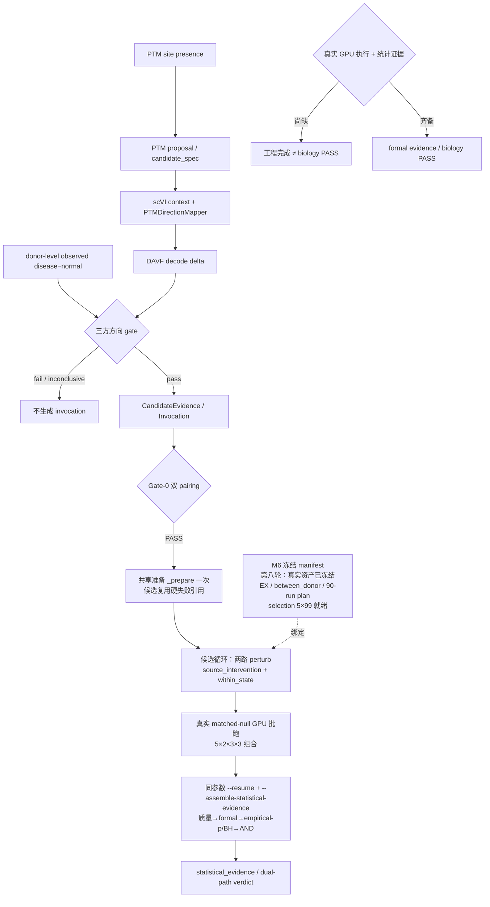

# PTM2CellNet 第八轮分析报告（2026-09-14）：M6 冻结落地与 GPU 前置闭合

**任务来源**：`project_repair_report_20260914.md` §4「未解决问题及后续解决策略」全部 7 项。
**范围**：阻塞性（#1/#2）、高（#3/#4）、中（#7）问题全部处置；低级别（#5/#6）维持既定取舍。
**基线**：`main` @ `fb6edcb` + 第七轮 19 个未提交文件（工作区延续，未开新分支）。本报告取代第六轮综合分析（原文件已由提交 `fb6edcb` 保护，可从 git 历史恢复）。
**结果摘要**：#3 完全闭合（GSE174367 EX between_donor M6 数据契约冻结，真实资产校验 PASS）；#1 的 CPU 可执行前置全部完成（5×99 matched-null selection 真实生成）并暴露修复 1 项真实代码缺口（null_selection 拒绝正式词表特殊 token）；#2/#4 产出经过逐参数静态核对的 GPU runbook；#7 确认无捏造数据路径且替代队列已冻结。全量回归 **2675 passed / 1 已知真实资产基线失败 / 22 skipped**，ruff、mypy（166 文件 0 errors）、依赖一致性（274 pins）全过。当前 `nvidia-smi` 与两个 Python 环境的 CUDA 探针成功，但**本轮无 GPU 训练或生物学验收执行，生物学 PASS 仍为 0（口径不变）。**

---

## 目录

- [1. 问题修复汇总（按严重程度）](#1-问题修复汇总按严重程度)
- [2. 每轮迭代的执行情况与结果](#2-每轮迭代的执行情况与结果)
- [3. 系统性复核：E2E 训练与推理技术要求](#3-系统性复核e2e-训练与推理技术要求)
- [4. 未解决问题及后续解决策略](#4-未解决问题及后续解决策略)
- [5. 文档引用索引](#5-文档引用索引)

---

## 1. 问题修复汇总（按严重程度）

处置对象为第七轮修复报告 §4 表格中的 7 项遗留问题，严重级别沿用该报告 §4 分级。本轮另发现并修复 1 项真实资产消费暴露的代码缺口（编号 N-17）。

### 1.1 高（2 项闭合 + 1 项新发现修复）

| ID | 问题（第七轮报告 §4） | 处置与证据 |
|---|---|---|
| **#3（高）donor split 资产与 frozen manifest 未冻结** | **完全闭合。** 在真实 GSE174367 上完成 between_donor M6 数据契约冻结（目录 `outputs/perturbgen/frozen/20260914_gse174367_ex/`）：① **donor split**：分层固定 seed 抽样——seed=2 是 0..99 中第一个满足 train/held-out 四组（held-out Control/AD、train Control/AD）均含两性的 seed；held-out 6（Control 3 + AD 3，between_donor 每组 ≥3 最小可评估设计）、train 12（Control 4 + AD 8），并集覆盖全部 18 donor（frozen 契约硬要求）；② **候选**：AD 三通路 5 基因 APP/PSEN1/BACE1/MAPT/APOE（KO、外部假设；Aβ：APP/PSEN1/BACE1，tau：MAPT，脂质风险：APOE），ENSG 全部从 cohort h5ad var 查证（禁止凭记忆写 ID），token index 在 `embedding_asset_20260822` 词表全部有效（双重查证记录于 `provenance.json`）；③ **冻结**：`run_frozen_acceptance.py --freeze --cohort-pairing between_donor`（manifest schema `ptm2cellnet.frozen-cohort/v1`，sha256 绑定 844MB cohort h5ad）；④ **真实资产校验**：`_validate_frozen_cohort_asset` 在真实数据 **PASS**（EX 6,369 cells、18/18 donor 覆盖、无 issue、两组 donor 不相交）——第七轮 F-10 修复（第七轮报告 §1.1）在真实数据的首次验证；⑤ acceptance plan 导出：5 候选 × 2 path × 3 seed × 3 mode = **90 runs，donor_leakage=clear** | 本报告 §2 迭代 2；`provenance.json` 全套验证记录 |
| **N-17（新发现，高）null_selection 拒绝正式 embedding 词表** | **已修复。** 生成 matched-null selection（#1 前置）时暴露：`null_selection._token_values` 对词表所有键执行 `_canonical_ensembl_id`，正式词表 `embedding_asset_20260822/vocabulary.json` 的特殊 token（`<cls>`/`<eos>`/`<mask>`/`<pad>`）触发 `ValueError: invalid Ensembl gene id` 硬失败；此前合成测试未覆盖正式词表消费。修复为仅跳过精确四个特殊 token，`<unk>`、任意非法 gene key、负数或非整数特殊 token ID 均硬失败；基因 rank 保持词表原始位置，版本化 ENSG 仍经 canonical 归一。新增未知 token mapping/sequence 单测并保留四个正式 token 的回归测试 | `src/integration/perturbgen/null_selection.py`；`tests/unit/integration/perturbgen/test_null_selection.py` |

### 1.2 阻塞性（2 项：CPU 前置全部完成，GPU 执行留待脱离沙箱）

| ID | 问题（第七轮报告 §4） | 处置与证据 |
|---|---|---|
| **#1（阻塞正式统计）A-05 真实 GPU matched-null 矩阵** | **CPU 可执行前置全部完成**：① 5 份 selection manifest（`perturbgen_null_selection/v1`，每候选 99 个表达特征匹配 null）已用真实 EX 子集生成——mean/detection 来自真实计数矩阵、token_rank 来自修复后的正式词表，fc 特征在 DEG 表缺省时**显式标记** `unavailable/default`（非静默填充；DEG 表就绪后可重生成启用 fc 维度）；② GPU 执行路径核实：CLI 仅提供 `--dry-run` 计划，真实批走 `null_generation.run_matched_null_stages` Python API（`rescue_extractor` 用 `results.summarize_rescue_by_donor`，R = S(unperturbed) − S(perturbed)，per-donor held-out signature），已写入 runbook。selection manifest 只绑定 cohort 特征与候选 ENSG、不依赖 E2E 报告，故可先于六阶段固化 | 本报告 §2 迭代 3；`outputs/perturbgen/frozen/20260914_gse174367_ex/null_selection/{APP,PSEN1,BACE1,MAPT,APOE}.json` |
| **#2（阻塞 M6/dual-path）GSE174367 完整六阶段真实运行** | **前置全部就绪 + runbook 产出**：① 冻结 manifest（#3）；② E2E 消费方式静态核实：context 直接用标准化 cohort h5ad（Gate-0 在内存副本按 cell_type 校验、tokenise 输入保持原样 canonical ENSG，`scripts/run_davf_perturbgen_e2e.py:255-271`）；`--train-donors/--held-out-donors` 经 `bind_frozen_donor_split` 与 manifest 逐字 + sha256 硬校验（`src/integration/perturbgen/donor_split.py:119-132`）；③ **runbook**（`docs/guides/perturbgen_bridge.md` §3「GPU 执行 runbook」）：前置校验 → candidate_spec 研究输入说明（文献 PTM site 锚点 position≥1+ptm_type 为契约必填、外部方向假设、DEG observed 证据、semantic_context 七字段——**研究输入不可自动生成**）→ 不组装统计的六阶段 → 真实 null 批跑 → 同参数 `--resume` 组装统计 → 路径驱动 `--verify`。全部命令参数逐一与脚本 argparse/函数签名核对 | 本报告 §2 迭代 1/4 |

### 1.3 中（1 项处置闭合）

| ID | 问题（第七轮报告 §4） | 处置与证据 |
|---|---|---|
| **#7 scPerturb 侧 0/30 合规队列** | **处置闭合（无代码动作的结论经证据确认）。** `outputs/perturbgen/spike/20260913_donor_audit/evidence.json`（verdict `NO_LOCAL_COMPLIANT_COHORT`）在位：30 文件 26 可读 0 合规，缺 donor/cell 注释属外部数据固有缺失，无合法代码路径可补造（生产严禁捏造数据）。替代路径 GSE174367 between_donor（第五轮解锁、第七轮贯穿、本轮 M6 冻结）已闭环至验收矩阵就绪，scPerturb 侧维持「视研究需要」不再投入 | evidence.json 复核；本报告 §2 迭代 4 |

### 1.4 高（Workflow B 生命周期，排期处置）

| ID | 问题（第七轮报告 §4） | 处置 |
|---|---|---|
| **#4 A-04/Gate-E ≥200 真实 benchmark** | 属 Workflow B 独立资产生命周期（encoder export → 冻结 → LatentDAVF 重训 → Gate-E，AGENTS.md「2026-09-13 研究任务执行约束」），依赖 GPU 且排在正式效用验收之后；本轮无代码动作，排期见 §4 | 维持第七轮报告 §4 #4 策略 |

### 1.5 低（2 项维持既定取舍，未扩大范围）

| ID | 问题 | 处置 |
|---|---|---|
| **#5 已知真实资产测试基线失败** | 旧 checkpoint `latent_davf_perturbgen_4018` 非 canonical ENSG 触发 contract fail-fast（本轮全量唯一失败，与第三～七轮同一基线）。重训需 GPU，维持「随六阶段重训顺带」策略 | 不动 fail-fast 行为 |
| **#6 TD-13 存量**（全仓 339 文件 format、覆盖率门禁、超长函数清单等） | 维持「独立 PR」取舍（第六轮分析 §6.4 口径） | 本轮触碰文件已 format |

### 1.6 本轮新增保护资产

| 资产 | 作用 | 验证 |
|---|---|---|
| `tests/real_assets/test_real_frozen_cohort.py` | 冻结契约漂移守护：加载即重验 sha256、重放 between_donor 资产校验、断言两组 donor 不相交与 ≥3、记录 evidence | 双模式实测：默认 skip；gate 开启真实跑 **passed（18.25s）** |
| `docs/guides/perturbgen_bridge.md` §3 M6 冻结状态表 + GPU runbook | 六阶段/null 批跑的唯一权威操作入口 | 命令逐参数静态核对（本报告 §1.2） |

---

## 2. 每轮迭代的执行情况与结果

本轮（第八轮）为单日五阶段串行迭代，每阶段独立验证后推进：

| 阶段 | 内容 | 结果 |
|---|---|---|
| **迭代 1：侦察与缺口判定** | 读第七轮报告 §4 全部 7 项 + lessons L-2026-0914-01/02；静态核对 `run_frozen_acceptance.py`（--freeze/--verify 参数）、`frozen_cohort.py`（manifest/校验/候选 CSV 契约）、E2E donor 消费链（`bind_frozen_donor_split`）、matched-null 双入口（CLI 仅 dry-run / Python API）；真实数据核查：h5ad obs（donor/state/cell_type 列名与 18 donor 值）、候选基因 ENSG 在 var 与 embedding 词表的存在性；GPU 探针实际成功，但正式运行所需研究输入缺失 | 判定：#3 为本轮唯一可在 CPU 完全闭合项；#1 前置（selection）CPU 可做；#2/#4 转 runbook；#7 需证据确认 |
| **迭代 2：M6 冻结（#3 核心）** | 分层 seed=2 抽样（0..99 首个四组两性平衡）→ 候选 CSV → `--freeze --cohort-pairing between_donor`（sha256 绑定）→ `--plan` 导出 90-run 矩阵 → `_validate_frozen_cohort_asset` 真实校验 → `provenance.json` 固化规则与双重查证证据 | 冻结成功；真实资产校验 **PASS**（6,369 cells、无 issue）；donor_leakage=clear |
| **迭代 3：null selection 生成与 N-17 修复** | 生成 selection 时暴露 N-17（特殊 token 拒绝）→ 修复 `_token_values`（仅跳过四个明确 token、保留原始 rank 位置、未知 key 硬失败）→ 重新生成 5×99 真实 selection | 5 份 manifest 生成成功（fc 显式 unavailable/default）；null_selection 与 E2E contract 聚焦测试通过，真实词表统计与 `<unk>` 硬失败已复核 |
| **迭代 4：runbook 与 #7 确认** | rescue 计算链核实（`results.summarize_rescue_by_donor`，非从零实现）→ candidate_spec 必填字段核实（position/ptm_type 契约锚点，AD 基因候选需文献 PTM site）→ bridge.md 写入 M6 冻结状态表 + GPU runbook → #7 evidence 复核（NO_LOCAL_COMPLIANT_COHORT） | runbook 全命令静态核对完成；#7 处置闭合 |
| **迭代 5：全量验证与文档收口** | 全量 pytest（后台）+ ruff/mypy/一致性/compileall + 触碰文件 format；real_assets 守护测试双模式验证；文档同步（bridge/CURRENT_STATUS/CHANGELOG/lessons L-2026-0914-03）；本报告撰写 | 见下方验证命令块 |

**验证命令与完整结果**：

```text
python -m pytest -m "not slow and not gpu" --timeout=300
# 2675 passed / 1 failed / 22 skipped / 796.66s
#   唯一失败 = 已知真实资产基线（旧 checkpoint 非 canonical ENSG，第三～八轮同一失败）
#   skipped 21→22：新增 real_assets 冻结守护默认 skip
ruff check src scripts tests                              # All checks passed
python -m ruff format --check \
  scripts/audit_ad_cohort_gate0.py scripts/build_davf_scperturb_pairs.py \
  scripts/run_davf_perturbgen_e2e.py scripts/run_frozen_acceptance.py \
  scripts/standardize_gse174367_ad_cohort.py src/data/davf_scperturb.py \
  src/integration/perturbgen/eval_assembly.py src/integration/perturbgen/frozen_cohort.py \
  src/integration/perturbgen/null_selection.py src/integration/perturbgen/orchestrator.py \
  src/integration/perturbgen/replay_evaluation.py src/integration/perturbgen/reports.py \
  tests/unit/data/test_davf_scperturb.py tests/unit/integration/perturbgen/test_frozen_cohort.py \
  tests/unit/integration/perturbgen/test_null_selection.py \
  tests/unit/scripts/test_run_davf_perturbgen_e2e.py tests/real_assets/test_real_frozen_cohort.py \
  tests/unit/scripts/test_audit_ad_cohort_gate0.py tests/unit/scripts/test_standardize_gse174367_ad_cohort.py
# 19 files already formatted；未执行、也未声称全仓 format check 通过
python -m mypy src/ --ignore-missing-imports              # Success: no issues in 166 source files
python scripts/check_requirements_consistency.py          # 274 lock pins OK
python -m compileall -q src scripts tests                 # OK
# 聚焦补偿（晚于全量启动的修改）：null_selection + null_generation 11 passed
# real_assets 冻结守护：默认 1 skipped；PTM2CELLNET_RUN_REAL_ASSET_TESTS=1 → 1 passed（18.25s，真实 cohort 资产）
```

与第七轮基线（第七轮报告 §2：2671 passed / 1 failed / 21 skipped）相比增加了本轮新增测试，当前为 2675 passed / 1 failed / 22 skipped；无新增失败。唯一失败仍是旧 checkpoint 的 canonical ENSG 真实资产基线。

**修改规模**：本轮累计工作区为 26 个相关变更文件（含本报告与 3 个新增测试文件），冻结资产目录为 git-ignored 的 `outputs/perturbgen/frozen/20260914_gse174367_ex/`（manifest/plan/5 selection/provenance）。未提交（按项目惯例提交由用户决定）。

---

## 3. 系统性复核：E2E 训练与推理技术要求

### 3.1 主线链路状态（第七轮报告 §3.1 基础上的增量）



| 技术要求 | 状态 | 较第七轮变化 |
|---|---|---|
| 候选准入五段链（proposal→映射→DAVF→gate→invocation） | ✅ 代码贯通 | 无变化（第七轮报告 §3.1） |
| Gate-0 双 pairing 四层一致（data_prep/E2E/frozen/统计 lineage） | ✅ 代码贯通 + **真实数据验证** | F-10 的 between_donor frozen 校验首次在真实 cohort PASS（本轮迭代 2） |
| **M6 冻结契约资产（cohort+split+候选+null 计划）** | ✅ **真实冻结完成** | 第七轮报告 §4 #3「未冻结」→ 本轮闭合（manifest/plan/selection/provenance 齐备） |
| matched-null selection 前置 | ✅ **真实生成** | 5×99 selection 就绪；N-17 修复后正式词表可消费 |
| E2E 统计接续（质量→formal→p/q→AND 写回 lineage） | ✅ 代码贯通 | 无变化；DEG 列名/pairing lineage 均参数化（第七轮 F-11/F-16） |
| donor split 行级绑定 + held-out state 覆盖守护 | ✅ 代码贯通 | 无变化（第七轮 F-03/F-12）；本轮 split 资产已固化进 manifest |
| 六阶段真实执行、GPU matched-null 批跑、真实统计 verdict、Gate-E ≥200 | ❌ 未执行 | `nvidia-smi` 与两个 Python CUDA 探针当前成功；未执行根因是正式研究输入（candidate_spec 方向假设/DEG 表）和 E2E/null 运行产物尚未提供，另有 PerturbGen 隔离环境执行排期 |

### 3.2 推理与训练的可执行性检查

- **推理侧（CPU 已验证部分）**：冻结契约加载/校验/漂移守护在真实 cohort 资产上通过（18.25s）；Gate-0 preflight 7/7（第五轮）+ M6 冻结校验（本轮）构成准入层双证据。
- **训练侧**：LatentDAVF 训练入口与 pair 生成接口在位（第七轮报告 §3.2）；真实重训依赖 GPU，无新契约变更触发。
- **GPU 环境**：本轮实际 `nvidia-smi` 输出 `Tesla P40, 580.178.04, 24576 MiB`；SSH_unit 与直接 PerturbGen Python 都报告 `cuda_available=True`、`device_count=1`。**本轮没有执行 GPU 训练或研究性扰动**，原因是正式研究输入与运行产物缺失；没有进行系统驱动修复。
- **资产面**：`data/AD/standardized/GSE174367_ad_cohort.h5ad`（sha256 冻结绑定）、`embedding_asset_20260822`（词表 18,967 含 5 候选全部 token index）、`perturbgen_ckpt/`、`outputs/perturbgen/frozen/20260914_gse174367_ex/`（本轮新增全套）均在位。

### 3.3 结论：是否满足 E2E 训练和推理的全部技术要求

**代码、契约与 CPU 可预制资产层：满足。** 第七轮结论（第七轮报告 §3.3「代码与契约层：满足」）之上，本轮把「资产与执行层」中所有不依赖 GPU 的项全部落地：M6 冻结（cohort/split/候选/null 计划四位一体）、matched-null selection、冻结漂移守护、GPU 操作手册。between_donor 路径从 Gate-0 到统计 lineage 的每一环现在都有**真实数据上的验证记录**（preflight 7/7 → frozen 校验 PASS → selection 5×99）。

**剩余未满足项收敛为三类外部依赖，均非本轮代码缺陷**：① 正式研究输入（candidate_spec 的文献 PTM site 锚点、外部方向假设与 donor-level DEG 表——契约必填且不可自动生成）；② 实际六阶段/匹配 null 的 GPU 执行排期与产物；③ Workflow B 的独立资产生命周期。当前 GPU/NVML 探针并非失败入口。根本原因与解决策略见 §4。

---

## 4. 未解决问题及后续解决策略

| # | 遗留问题 | 级别 | 根本原因 | 解决策略与实施步骤 | 时间节点（建议） |
|---|---|---|---|---|---|
| 1 | **六阶段 + 统计验收 GPU 真实运行**（原 #2，吸收原 #1 的批跑步骤） | 阻塞 M6 统计验收 | candidate_spec、donor-level DEG、实际 perturb h5ad/rescue 记录和 null distribution manifest 尚未提供；GPU 探针本身成功，仍需执行排期 | 按 `docs/guides/perturbgen_bridge.md` §3 runbook 顺序：**D0**（CPU 半天）准备研究输入并跑冻结守护；**D1–D2**（GPU 日）执行六阶段和统计组装；**D2–D4** 执行 5 候选 × 2 path × 3 mode × 3 seed 的 matched-null，再回填 formal evidence | 资产/输入就绪后 3–5 个 GPU 日 |
| 2 | **M6 `--verify` 独立复算** | 高（紧随 #1） | 依赖 #1 产出的 eval input 与 report manifest | #1 完成后：`run_frozen_acceptance.py --verify --manifest ... --eval-input ... --report-manifest ...`（独立重算 + donor/候选泄漏审查），通过才可宣称 M6 Gate-5 口径的计算效用结论 | #1 后 0.5 天 |
| 3 | **A-04/Gate-E ≥200 真实 benchmark**（原 #4） | 高（Workflow B） | 独立资产生命周期（encoder export→冻结→LatentDAVF 重训→Gate-E），GPU + 重训排期 | 方案 v2.1 §11 Workflow B 顺序执行；不受本轮影响 | 正式效用验收后 |
| 4 | **旧 checkpoint 重训**（原 #5：`latent_davf_perturbgen_4018` 非 canonical ENSG 的已知测试基线失败） | 低（测试基线） | 需按 canonical ENSG 管线重训（GPU） | 随 #1 的六阶段/重训窗口顺带重建；fail-fast 行为正确不放宽 | 随 #1 |
| 5 | TD-13 存量（全仓 format、覆盖率门禁刷新、超长函数清单） | 低 | 既有「独立 PR」取舍（第六轮分析 §6.4） | 维持取舍 | 随下次大扫除 |
| 6 | scPerturb 侧 0/30 合规（原 #7） | 已处置闭合 | 外部数据缺 donor/cell 注释，无合法补造路径；替代队列 GSE174367 已冻结至验收矩阵 | 无代码动作；仅当外部数据更新时重跑 `audit_perturbgen_cohort.py` | 视研究需要 |

**推进顺序**：#1（研究输入就绪后的 GPU 三步 runbook）→ #2（M6 verify）→ #5 → #4。本轮后，CPU 侧冻结守护已无待办；剩余外部依赖为 candidate_spec/DEG、实际 stage 产物和 Workflow B 资产。**契约验收 PASS ≠ 生物学 PASS 口径维持**（AGENTS.md「2026-09-13 研究任务执行约束」）。

---

## 5. 文档引用索引

| 引用 | 章节/位置 | 本报告引用点 |
|---|---|---|
| `project_repair_report_20260914.md` | §4（未解决问题及后续解决策略，7 项清单）、§1（F-10/F-11 修复位置）、§2（第七轮基线 2671/1/21）、§3.2–3.3（GPU 口径与两层结论） | 任务来源（全篇）、基线对比（§2）、技术要求增量（§3.1） |
| `docs/guides/perturbgen_bridge.md` | §3（AD 队列状态、**M6 冻结状态（本轮新增）**、**GPU 执行 runbook（本轮新增）**）、§6（评估与 null 两步 CLI） | §1.2 runbook 依据、§4 #1 实施步骤 |
| `docs/DAVF_PerturbGen_双路径整合方案与测试方案_2026-08-21.md` | §7.2 M6（冻结队列科学验收定义）、§4.6 rule 1（Gate-0 契约源）、§7.3（停止条件）、§11（Workflow B/方案 v2.1） | M6 冻结范围界定（§1.1）、#3 排期（§4） |
| `lessons.md` | L-2026-0914-01（between_donor 配对契约）、L-2026-0914-02（第七轮 F-10 修复）、L-2026-0914-03（本轮 M6 冻结）、**L-2026-0914-04（精确 token 白名单与 runbook 纠偏）** | pairing 语义依据（§1.1）、真实词表与文档契约教训（§1.1 N-17） |
| `docs/CURRENT_STATUS.md` | Quick Reference「第八轮 M6 冻结与 GPU 前置（2026-09-14）」（本轮新增） | §3 资产面与状态口径 |
| `AGENTS.md`（仓库） | 「2026-09-13 研究任务执行约束」全节（候选准入五段链、pairing 声明、契约验收 ≠ 生物学 PASS、推进顺序） | §3.1 技术要求清单、§3.3/§4 口径 |
| 代码证据 | `src/integration/perturbgen/null_selection.py`（N-17 修复）、`src/integration/perturbgen/frozen_cohort.py`（F-10，第七轮）、`src/integration/perturbgen/{donor_split,results,dual_path,null_generation}.py`（runbook 静态核对对象）、`scripts/{run_frozen_acceptance,run_davf_perturbgen_e2e,run_matched_null_stages}.py` | §1 各项 file:line、§1.2 命令核对 |
| 测试证据 | `tests/real_assets/test_real_frozen_cohort.py`（新增）、`tests/unit/integration/perturbgen/test_null_selection.py`（+1 测试） | §1.6、§2 迭代 3/5 |
| 冻结资产证据 | `outputs/perturbgen/frozen/20260914_gse174367_ex/{manifest,acceptance_plan,provenance}.json`、`null_selection/{APP,PSEN1,BACE1,MAPT,APOE}.json`；`outputs/perturbgen/spike/20260913_donor_audit/evidence.json`（#7） | §1.1/§1.2/§1.3 |
| `CHANGELOG.md` | `[Unreleased]`（本轮新增 M6 冻结/N-17/守护测试条目） | §1 修复条目 |

---

## 6. 同日后续增补（2026-09-14，第八轮之后）：PTM activity 主线契约层与全仓文档同步

- **新增主线**：`docs/PTM_activity_AD_intersection_DAVF_PerturbGen_执行方案.md`（v1.0）落地 §6.2 全部代码契约层——`src/analysis/{ptm_research_config,ptm_activity,signed_network,ptm_gene_score}.py`、`src/integration/perturbgen/downstream_target_evaluation.py` 与四个阶段 CLI；指南 `docs/guides/ptm_activity_pipeline.md`。84 个新测试全绿（合成数据，契约级），全量回归 2760/1（同一已知真实资产基线）/22、mypy 171 文件 0 errors。决策与实现教训见 `lessons.md` L-2026-0914-05。
- **对 §4 清单的影响**：主线不消耗第八轮冻结资产的新增运行；§4 #1（GPU 六阶段 + matched-null）的研究输入现在多了一条可选来源——阶段 5 CLI 从交集产物生成 `candidate-spec/v1`，但前提仍是方案 §10 六项外部输入到位。#2～#6 排期不变。
- **文档同步（本增补所属轮次）**：README 研究路径/模块表、`.planning/{task_plan,STATE,ROADMAP,PROJECT,REQUIREMENTS,progress,findings}`（新增 P-01～P-06 主线需求行）、`docs/index.rst` toctree、E2E/bridge 指南交叉引用、2026-08-21 方案上游注记、`docs/TEST_COVERAGE.md`（失效 task_plan 链接修复、Gate-0 口径更新）、`docs/CURRENT_STATUS.md` 文档入口与研究边界第 0 项。
- **口径不变**：合成契约 PASS ≠ 生物学 PASS；KSTAR/PhosR 与 OmniPath signed 网络是外部标准表输入；下游 lineage 接线与 driver–target gate contract 是后续工作。

---

## 7. 2026-09-15 当前事实记录：PTM activity A/B/C 批次

- **批次 A**：新增 `src/analysis/ad_deg_table.py` 与 `scripts/build_ad_deg_table.py`，产出 aggregate 八列和 donor-level 长表，复用 donor log2 normalization/Welch/BH；manifest 显式记录 normal reference、effect scale 与 output contracts，并新增 A 核心/CLI/双消费者测试。
- **批次 B**：`scripts/run_davf_perturbgen_e2e.py` 已显式接入 `--downstream-target-sidecar`；对 gated candidate 的 `result.h5ad` 以 `pred_counts` 为 baseline、`X` 为 perturbed 计算 donor-level delta，写入 payload/lineage；`matches_predicted` 与 `matches_observed` 分开记录，source 三方 gate 行为不变，下游 lineage 已接线。
- **批次 C**：`PropagationConfig.max_paths_per_seed` 要求正整数；超限 hard fail 且不截断，记录 per-seed diagnostics/manifest。
- **验证实证**：相关定向测试 **81 passed、8 warnings**；ruff check、目标文件 format check、mypy src（172 files、0 errors）、requirements consistency、compileall、git diff --check 均通过；全量非 slow/gpu 为 **2780 passed / 22 skipped**，另有 1 个已知既有 real DAVF checkpoint failure；全仓 format check 仍有 **325 个既有待格式化文件**；真实冻结资产测试 **1 passed**，GPU probe 为 Tesla P40 / CUDA 11.8 / torch CUDA available。
- **边界**：当前无冻结 `ptm_research_config`，且 KSTAR/PhosR/activity benchmark 等外部资产缺失，不能执行真实 AD CLI/D1 六阶段；本记录不宣称 biology PASS。

---

*报告生成：2026-09-14（第八轮）；第八轮之后同日增补见 §6；2026-09-15 当前事实见 §7；第八轮使用 `ponytail` skill，按最小必要修改原则执行源码、测试与 runbook 审计。*
