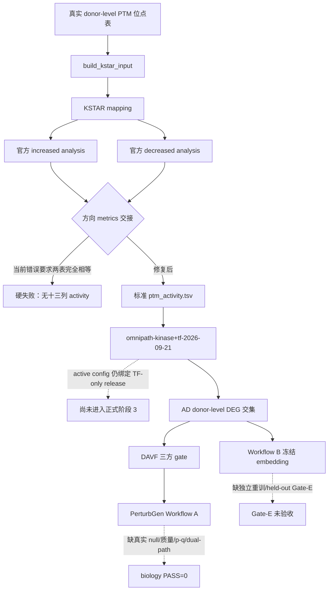

# PTM2CellNet 项目综合代码、文档与技术分析报告（2026-09-20；续审更新 2026-09-21）

## 目录

- [1. 摘要](#1-摘要)
- [2. 审计边界与证据等级](#2-审计边界与证据等级)
- [3. 版本、协作与工作树基线](#3-版本协作与工作树基线)
- [4. 需求对照与模块完成度](#4-需求对照与模块完成度)
- [5. 未实现功能、缺失接口与流程](#5-未实现功能缺失接口与流程)
- [6. 未完全实现功能分类](#6-未完全实现功能分类)
- [7. 技术债与解决策略](#7-技术债与解决策略)
- [8. 过时文档与报告归档](#8-过时文档与报告归档)
- [9. 验证结果](#9-验证结果)
- [10. 执行工具与代理边界](#10-执行工具与代理边界)
- [11. 结论与建议](#11-结论与建议)

## 1. 摘要

本报告在 2026-09-20 审计基础上，于 2026-09-21 通过 **Q015_mcp 的 DevSpace MCP**
直接复核 `/home/scu/PTM2CellNet` 当前工作树、KSTAR 独立环境、真实 ST/Y network、
新增源码/测试、冻结资产摘要和主线文档。未使用 OpenAI Developers 插件；未执行
`reset`、`clean`、checkout、覆盖或提交操作，所有未提交 KSTAR 修改均原样保留。

当前最重要结论：

- `formal biology PASS` 仍为 **0**。真实 PTM 队列、预注册 kinase benchmark、正式
  KSTAR activity、PerturbGen 真实统计闭环和 Workflow B / Gate-E 均未完成。
- 2026-09-20 报告中的“官方 KSTAR network 仍缺失/HTTP 202 阻塞”已被当前事实取代：
  本机 KSTAR 包目录现有 204 MiB `NETWORKS.tar.gz`（SHA256 `2fb054e6905f...`）及
  ST/Y 各 50 个非空 network 文件；两路 `unique_reference_id` 均为
  `a7dfa119afa4f833375dfaf0c503ee1bca28c9fe7d868e4249907442d7821c64`。
- 独立环境 Python 3.12.14、`kstar==1.2.0` 及五个 companion 文件 hash 校验通过；
  正式 runner 的 `mapping` 模式在 `/tmp` 复跑成功，8 个完整位点得到 7 行映射。
- 正式 runner 的 ST `analysis` 在 8 进程下完成 increased/decreased 两次官方计算，
  但随后被实现缺陷阻断：140 个激酶中 98 个的 `n_substrates/network_coverage` 随方向
  evidence 不同，代码却要求两张 metrics 表完全相等，因此未能写出十三列
  `ptm_activity.tsv`。这不是“没有方向证据”：139/140 个激酶的两路 p 值不相等。
- 新 `omnipath-kinase+tf-2026-09-21` 表有 28,011 个原始行；当前正式 loader 审计为
  28,009 条有效传播边，因为 1 组异号平行关系的 2 行被按契约整体剔除。文档和 manifest
  必须区分 raw rows 与 effective propagation edges。
- 主研究配置仍绑定 TF-only `omnipath-2026-09-16`，且
  `ptm_cohort=PENDING_EXTERNAL_PTM_COHORT`；新网尚未进入活动正式配置。更重要的是，
  该 sentinel 当前会被 config/CLI 正常接受，并不会按文档所述硬失败。
- 方案要求阶段 0 冻结 PTM score 过滤策略，但 config 没有相关字段；
  `activities_for_propagation` 会选择所有非零 activity，即使 `qvalue=1.0`、
  `n_substrates=0`、`network_coverage=0`。因此“弱但非零方向”目前也会进入传播。
- 当前工作树为 7 个已跟踪修改 + 14 个未跟踪文件，共 21 个实际文件；Git porcelain
  将 `environments/` 折叠为一个路径，因此显示 12 个 untracked path group。KSTAR 批次
  不能按旧报告的“41 路径/最终 clean tree”口径解释。

## 2. 审计边界与证据等级

### 2.1 审计范围

本次续审直接检查：

- 当前 Git/ZMemory 基线、`project_analysis_20260920.md` 与所有未提交 KSTAR 文件；
- `docs/CURRENT_STATUS.md`、KSTAR/PTM/real-assets 指南、`lessons.md`
  L-2026-0920-01/02 与 L-2026-0921-01；
- KSTAR adapter、resource verifier、runner、环境安装脚本、kinase/TF network builder
  及其 22 项定向单测；
- 本机 `kstar` 环境的实际解释器、包版本、RESOURCE_FILES、ST/Y network、archive hash；
- `data/manifests/kstar_signed_network_release_20260921.json` 所引用的本地忽略资产、
  原始/有效边数和 active research config；
- DAVF/PerturbGen 既有主线只复核当前边界，未重跑 GPU、real-assets 或 formal E2E。

`origin/main...main=0/28` 仅基于当前本地 remote-tracking ref；本次未执行 fetch，不能把它写成
2026-09-21 远端实时状态。

### 2.2 证据等级

| 等级 | 判定 | 本报告用法 |
|---|---|---|
| A | 当前源码/测试/命令输出直接证明 | 可称“已实现”或“检查通过” |
| B | 当前文档引用明确产物，源码入口可定位 | 可称“契约层已实现”，不能扩大为 biology PASS |
| C | 历史报告或旧产物，当前未复跑 | 仅作历史背景 |
| D | 需求文字但没有当前实现/资产 | 记录为未实现或阻塞 |

### 2.3 不能推出的结论

Smoke、synthetic、mock、bridge、外部资产契约验证和单元测试均不能推出正式生物学有效性；
正式验收仍需真实 PTM、真实 normal/disease raw counts、显式 donor、canonical Ensembl、
冻结 embedding/manifest、真实 null/质量/p-q/双路径证据。

## 3. 版本、协作与工作树基线

### 3.1 Git 基线（2026-09-21 续审）

| 项目 | 当前事实 |
|---|---|
| workspace | `ws_51189cde01` → `/home/scu/PTM2CellNet` |
| 当前分支/HEAD | `main` / `323ab4d`（`docs: finalize audit version wording`） |
| 本地相对已有 `origin/main` ref | `0 behind / 28 ahead`；本次未 fetch，不能代表实时远端 |
| tracked 修改 | 7：`.gitignore`、3 份 KSTAR/PTM 指南、`CURRENT_STATUS.md`、`lessons.md`、本报告 |
| untracked 文件 | 14：KSTAR 环境 3、实现脚本 4、分析模块 2、测试 4、network 摘要 manifest 1 |
| porcelain untracked path group | 12；`environments/` 被折叠显示，不等于只有 12 个文件 |
| 合并/提交 | 本次未 merge、未 commit、未 push |
| 保护动作 | 未执行 reset、clean、checkout、restore 或覆盖 KSTAR 写集；测试只写 `/tmp` |

当前 21 个实际文件构成一个仍未提交、尚未通过完整验收的 KSTAR 工程批次。旧报告关于
“41 路径”“最终工作树干净”“27 ahead”的描述只属于上一轮历史，不能作为当前基线。
本次也没有把本机 680 MiB network 目录、204 MiB archive 或被 `.gitignore` 排除的
OmniPath/组合网文件加入 Git。

### 3.2 ZMemory

- `zmemory resume` 返回 `no active runs`；不存在可直接恢复的 run state。
- 已注册 `agent=gpt-5.6-sol-pro`、`session=chatgpt-q015-20260921-audit`。
- 对报告和全部 KSTAR 目标先执行 `zmemory who`；初始均无有效 claim。
- 仅声明 `project_analysis_20260920.md` 进行报告更新；KSTAR 源码、测试、文档和资产
  始终保持只读审计。
- claim 到期后再次 `who/claim`，未抢占他人有效写集；完成后须记录事件并释放。

## 4. 需求对照与模块完成度

### 4.1 完成度口径

百分比表示“当前需求契约在本仓库中的可执行完成度”，不是科学可信度。存在真实输入、
独立验证或正式资产缺失时，完成度不能按接口数量直接记满。

### 4.2 模块矩阵

| 模块 | 工程完成度 | 当前证据 | 主要缺口/阻塞 | 分类 |
|---|---:|---|---|---|
| PTM 输入与 KSTAR activity | 65% | 独立环境、精确包版本、RESOURCE_FILES hash、真实 ST/Y network、二元 evidence adapter、mapping CLI 已复核 | ST analysis 双方向均算完后被错误的 metrics 全表相等断言阻断；无真实 PTM、benchmark、十三列完整 CLI 产物 | **实现但有严重缺陷** |
| Research config / activity admission | 45% | contrast、method、network release、AD FDR、传播参数可冻结 | `PENDING_EXTERNAL_PTM_COHORT` 未硬失败；方案要求的 PTM score filtering strategy 没有 schema/CLI 实现，所有非零 activity 均会传播 | **实现但不符合规范** |
| KSTAR 资源冻结 | 70% | archive、ST/Y 各 50 个非空文件、reference ID 与 KSTAR 自身 network IDs 可读 | 仓库 manifest 未冻结 archive SHA256、ST/Y `unique_network_id` 或逐文件完整性；verifier 只查目录存在/reference ID | 部分实现但不可充分复现 |
| Signed kinase+TF network | 80% | 原始 15,133 kinase 行 + 12,878 TF 行；组合表 hash 与 manifest 一致；loader 可传播 | 28,011 raw rows 实际为 28,009 effective edges；资产文件和映射表被 ignore，active config 仍使用 TF-only release | 部分实现但未接入主线 |
| AD donor-level DEG 与交集 | 85% | donor-level、pseudobulk、canonical Ensembl、signed admission 已接线 | observed 显著行仍为 0；真实扩展队列/研究决策证据不足 | 实现但输入不完整 |
| 五候选 KO 路由 | 90% | candidate routing、CLI、sidecar、lineage isolation、KO-only policy | 无 formal invocation；APP/PSEN1/BACE1/MAPT DAVF 训练轴缺失 | 部分实现但可用 |
| DAVF 方向 | 45% | APOE KO route 有工程/真实解码证据；axis audit 可审计 | 其余候选训练轴缺失；KD out of scope；词表 coverage 不能替代训练 evidence | 实现但输入不完整 |
| PerturbGen Workflow A | 70% | 六阶段、shared prepare、gate wrapper、统计组装和 verifier 接口存在 | formal cohort、null/质量/p-q/双路径真实统计未完成 | 工程实现但科学未验收 |
| Workflow B / Gate-E | 40% | embedding/benchmark 入口与资产边界存在 | 冻结 embedding、LatentDAVF 重训、held-out Gate-E 未完成 | 不符合正式验收 |
| 文档与可复现性 | 60% | 指南、lessons、manifest 边界较完整；shared prepare 文档已在当前工作树修正 | 多处仍写“network 缺失”；`CURRENT_STATUS.md` 仍指向 20260917 为权威；本地大资产无可移植交付路径 | 实现但存在明显漂移 |

百分比只表示当前工程契约/执行链覆盖，不表示科学可信度或 biology acceptance。

## 5. 未实现功能、缺失接口与流程

### 5.1 接口状态与缺失边界

| 接口/边界 | 当前实测状态 | 预期返回或职责 | 未闭合点 |
|---|---|---|---|
| `verify_kstar_resource_files` | **通过**：五个 RESOURCE_FILES 的 size/hash 与冻结 manifest 一致 | 验证 KSTAR companion 资源 | 已实现；但 network 不在这组逐文件 hash 内 |
| `verify_kstar_network_dir` | **通过当前资产**：ST/Y reference ID 一致、各 50 个非空文件 | 验证官方 network 可用 | 当前函数只检查 `RUN_INFORMATION.txt` 和目录存在；空目录也能通过单测，未校验 `unique_network_id`、文件数、大小或 archive hash |
| `build_kstar_input` | **通过**：50 行 smoke 输入→8 个完整位点、4 increased/4 decreased | 标准化 PTM→双方向二元 evidence | 只校验 `protein_id` 非空，未强制 UniProt accession namespace；input manifest 仅要求 JSON object，不绑定内容 hash |
| `PTMResearchConfig` + `activities_for_propagation` | **不符合方案阶段 0**：pending cohort 被接受；`q=1.0/n=0/coverage=0` 的非零 score 仍被选择 | 冻结 PTM score admission 并只向传播提供获准 seed | config 无 score filter schema；传播入口不读取 q-value、substrate count 或 coverage 阈值 |
| `run_kstar_activity.py --mode mapping` | **当前复跑通过**：7 mapped rows，输出只写 `/tmp` | 官方 ExperimentMapper handover | setup 将该 smoke 绑定到被 ignore 的历史输出目录，干净检出不自包含 |
| `run_kstar_activity.py --mode analysis` | **当前复跑失败**：两路官方计算均完成，之后 exit 1 | 十三列 `ptm_activity.tsv` + adapter manifest | `increased_metrics.equals(decreased_metrics)` 是错误前提；98/140 激酶的方向 metrics 合理不同，完整 CLI 交接被阻断 |
| `convert_kstar_outputs` | DataFrame 单测通过，可生成十三列 | 双方向 p-value→signed score/q-value | API 只接收一张 metrics 表，尚无“按最终选中方向选择对应 metrics”的模型；也未验证调用方是否把 increased/decreased 文件传反 |
| `build_kinase_signed_edges.py` | 本地资产已生成，hash 与摘要一致 | OmniPath export→中间 signed edges | formal 模式未强制 enzyme whitelist；mapping/whitelist 本身未写 hash；mypy 有类型错误 |
| `build_kinase_tf_network_release.py` | 本地组合表可加载传播 | kinase 中间边 + TF terminal 边→新 release | manifest 未写 output SHA256；未登记 raw/effective edge 差异；mypy 有类型错误 |
| `bind_external_evidence_to_formal_lineage(...)` | 未实现获批 consumer | supplementary evidence→formal payload 或硬失败 | 当前 `may_enter_lineage=false`，只能隔离不能晋级 |
| Workflow A / B 正式入口 | 工程 verifier/CLI 存在 | Gate-4/5 与 Gate-E verdict | 缺真实 cohort/null/quality/p-q/dual-path 与 held-out evidence |

### 5.2 当前阻断流程

### 5.3 业务流程缺口

1. **KSTAR 完整 CLI 当前不可交付**：network 已存在，不再是首要 blocker；首要 blocker 是
   双方向 metrics 的数据模型/断言错误。修复前不能把 unit-level adapter 通过写成 end-to-end activity pass。
2. **pending cohort 没有代码门禁**：`PENDING_EXTERNAL_PTM_COHORT` 只存在于 YAML 注释/文档，
   config、阶段 1、KSTAR runner 和阶段 3 均不会拒绝；可产生带 pending lineage 的正式形状文件。
3. **PTM seed admission 未实现**：方案阶段 0 要求冻结 activity q-value/rank/coverage/null 策略，
   当前 schema 无该字段，传播函数选择全部非零 score，弱证据也会成为 seed。
4. **正式输入和科学验收仍缺**：没有真实 donor-level phosphoproteome、预注册 kinase
   perturbation benchmark 或获批 lineage promotion。
5. **新网未进入正式配置**：active config 仍绑定 `omnipath-2026-09-16`；不能在旧配置下宣称
   kinase activity 已可传播，也不能为了演示直接改写冻结配置而不换研究版本。
6. **资产不可移植**：raw OmniPath、kinase 表、组合表、symbol map 和 enzyme whitelist 均存在于本机，
   但被 `data/*` ignore；摘要 manifest 没有下载 URI/对象存储位置/恢复命令，干净检出无法重建。
7. **下游正式闭环未变**：四候选 DAVF 训练轴、Workflow A 真实统计和 Workflow B Gate-E 仍未完成；
   KO 不得推导 KD，smoke/synthetic 不得进入 biology PASS。

## 6. 未完全实现功能分类

### 6.1 判断标准

| 分类 | 判定标准 |
|---|---|
| 部分实现但可用 | 契约、入口、错误边界和可执行验证存在；缺口主要是外部输入或明确未启用路径 |
| 实现但有缺陷 | 入口声称可完成目标，但真实执行暴露确定性错误、不可达输出或静态质量失败 |
| 实现但不符合规范 | 工程可运行，但资产冻结、配置、lineage 或研究语义没有满足现行规范 |
| 未完成 | 需求有明确模块/证据目标，当前没有可交付执行结果或正式资产 |

### 6.2 当前分类

- **部分实现但可用**：KSTAR 环境/companion hash、官方 network 的本机可读性、mapping 模式、
  PTM 表契约、signed propagation、AD donor DEG、candidate routing、shared prepare 和 formal verifier。
- **实现但有缺陷**：
  1. `run_kstar_activity.py` 对两路方向 metrics 做全表相等断言，真实官方运行必然可能失败；
  2. network verifier 对空 `INDIVIDUAL_NETWORKS` 目录也会通过现有单测；
  3. setup 验收依赖被 ignore 的既有 `outputs/.../standardized_ptm.tsv`；
  4. 两个 network builder 加其共享 `_edge_sign` 路径存在 4 个 mypy 错误；
  5. assembler 未把 loader 丢弃的 sign-conflict 反映到 effective edge 统计。
- **实现但不符合完整冻结/研究规范**：KSTAR archive/network IDs 未进入 resource manifest；组合网等大资产
  只在本机、被 Git ignore；active config 仍绑定旧 TF-only release；adapter manifest 未绑定 network
  path/hash/IDs；protein identifier namespace 与 enzyme whitelist 没有 formal 强制；pending cohort sentinel
  不会硬失败；方案要求的 PTM score admission/filtering 没有进入 config 或传播入口。
- **已在当前工作树修正**：`docs/guides/real_assets_acceptance.md` 现已描述每 route 一次 shared
  prepare；旧报告把它列为当前冲突已经过时，归档副本仅保留历史状态。
- **未完成**：真实 PTM activity、kinase benchmark、lineage promotion、四候选 DAVF 训练轴、
  Workflow A formal biology acceptance、Workflow B Gate-E。

## 7. 技术债与解决策略

### 7.1 严重度标准

| 等级 | 客观标准 |
|---|---|
| 严重 | 阻断核心研究结论，或会把错误证据写成 formal/biology PASS |
| 高 | 阻断核心模块正式验收，但不直接造成数据损坏或科学误报 |
| 中 | 影响可复现性、维护成本或单一分支，存在明确绕行方式 |
| 低 | 文档、命名、重复代码或非关键体验问题，不阻塞当前主线 |

### 7.2 债务清单

| ID | 等级 | 证据与影响 |
|---|---|---|
| TD-21-01 | **严重** | 双方向 KSTAR 官方计算完成后，错误的 metrics 相等断言使完整 activity CLI 必然可能硬失败；当前真实 smoke 已复现。 |
| TD-21-02 | **严重** | 真实 PTM、预注册 kinase benchmark 和 lineage promotion 未完成；即使修复 CLI 也不能形成 formal biology evidence。 |
| TD-20-02 | **严重** | Workflow A 的真实 cohort/null/quality/p-q/dual-path 组合尚未执行；影响最终科学结论。 |
| TD-21-03 | 高 | KSTAR network freeze 不充分：archive SHA256 和 ST/Y `unique_network_id` 未入 manifest，verifier 不查文件集完整性。 |
| TD-21-04 | 高 | 新 signed network 资产被 Git ignore 且无外部恢复位置；active config 仍绑定 TF-only release，干净检出不可复现/不可启用。 |
| TD-21-08 | **高** | `PENDING_EXTERNAL_PTM_COHORT` 没有运行时门禁；与文档“pending 状态不得产出正式 PTM score”不一致。 |
| TD-21-09 | **高** | 阶段 0 要求的 PTM score filtering strategy 未实现；所有非零 activity 不论 q-value/substrate/coverage 都进入传播。 |
| TD-20-03 | 高 | 4 个候选 DAVF 训练轴缺失且 KD out of scope；词表覆盖不能替代训练证据。 |
| TD-20-04 | 高 | Workflow B 冻结 embedding、LatentDAVF 重训和 held-out Gate-E 未完成。 |
| TD-21-05 | 中 | setup 将环境验收与历史生成输出耦合；干净检出可因 smoke 输入缺失而误报安装失败。 |
| TD-21-06 | 中 | input/network provenance 不完整：未强制 UniProt namespace、formal enzyme whitelist，mapping/whitelist/hash 未全部入 manifest。 |
| TD-21-07 | 中 | 新 builder 路径有 4 个 mypy 错误，单测未覆盖官方双方向 metrics 分歧和空 network 目录。 |
| TD-20-06 | 中 | 外部 evidence 只有 supplementary-only 隔离，没有获批后 formal consumer。 |
| TD-20-07 | 低 | `CURRENT_STATUS.md` 权威报告指针和 KSTAR “network 缺失”文字已漂移，增加审计成本。 |

### 7.3 严重/高/中债务的方案

#### TD-21-01～04：KSTAR 完整交接、冻结与主线接入

**首选修复顺序：**

1. 重构 `_run_direction` / `convert_kstar_outputs` 的 metrics 接口：分别保留 increased/decreased
   metrics，按每个激酶最终选择的 activity direction 取对应 `n_substrates` 与
   `network_coverage`；不得用 `equals()` 要求整表相同，也不得用 max/平均掩盖方向语义。
2. 增加真实 KSTAR API integration fixture：两路 evidence 集必须不同，断言能写出十三列、
   Ensembl regulator、非零 signed score，并验证交换方向文件会硬失败。
3. 把 archive SHA256 `2fb054e6905f...`、ST/Y `unique_network_id`
   （ST=`0c85777e396f8931cc6662138fef6e6273acf706ec3503c178cd31e40ec04810`，
   Y=`23ce4b6c19d912d314e6893a993c48ad18129e9d88766b994ca5fc6f8fd2e8b5`）、reference ID、network 数量、文件集摘要写入
   resource manifest；verifier 至少检查 50+50 个非空文件和预期 network IDs。
4. 为被 ignore 的 OmniPath/export/combined network/map/whitelist 提供可解析的外部资产 URI、
   获取命令和 hash；或者在允许许可/体积的前提下调整数据版本管理。仅有本机绝对路径不是冻结交付。
5. 将 setup 拆为“环境/资源验证”和“可选 mapping smoke”；smoke 使用仓库内小 fixture 或先调用
   生成器，不依赖历史 `outputs/`。
6. 扩展 research-config schema：显式声明 PTM activity admission（例如 frozen q-value、最小
   substrate/coverage、rank 或 independent-null policy），在阶段 3 统一执行并写审计计数；未声明时
   正式运行硬失败，而不是默认传播全部非零行。
7. 对 `PENDING_*`/placeholder cohort 增加正式模式 fail-fast；smoke 必须使用显式
   `engineering_only`/fixture 配置，不能仅靠注释区分。
8. 真实 PTM 到位后新建研究 config 版本显式绑定
   `omnipath-kinase+tf-2026-09-21`，不要原地篡改既有 TF-only 冻结；随后跑 benchmark，
   benchmark 通过前继续 `may_enter_lineage=false`。

2026-09-21 实测状态：环境、companion hash、network reference、mapping 均通过；8 进程 ST
analysis 两路官方计算完成，但在 metrics equality 处 exit 1。故当前准确结论是
**“KSTAR runtime/network/mapping PASS，完整 activity adapter FAIL，biology PASS=0”**。

#### TD-20-02：formal biology acceptance

| 方案 | 优点 | 缺点 |
|---|---|---|
| A：完成现有 APOE KO lane | 复用已有 frozen cohort、verifier 和 shared prepare | 结论仅覆盖 APOE KO |
| B：补齐五候选真实训练轴后全量执行 | 覆盖完整研究目标 | 数据/GPU/时间成本高，当前 KD 仍不做 |
| C：维持 blocked 并只交付工程报告 | 不制造伪科学结论 | 核心验收不推进 |

实施：研究目标/候选冻结 0.5 天；Gate-0/manifest 核对 0.5 天；六阶段 1–2 GPU 天；null/质量/p-q/双路径 2–3 GPU 天；独立复核 0.5 天。风险：真实 donor 数、显存、旧 checkpoint schema。

#### TD-20-03：DAVF 训练轴缺失

| 方案 | 优点 | 缺点 |
|---|---|---|
| A：收缩到有训练轴的 APOE KO | 最短路径，证据边界清晰 | 放弃四个候选 |
| B：提供四候选真实 KO 训练资产 | 保留五候选目标 | 需要外部数据和新训练 |
| C：保留 exploratory sidecar | 记录研究线索且不进 formal | 不能形成 DAVF 因果方向 |

实施：候选决策 0.5 天；资产 manifest 0.5 天；每候选准备/训练 1–3 天；axis audit 0.5 天。风险：把词表命中误认为训练轴、checkpoint 与 decoder index 混用。

#### TD-20-04：Workflow B / Gate-E

| 方案 | 优点 | 缺点 |
|---|---|---|
| A：复用现有 encoder export 并冻结 manifest | 变更少 | 仍需独立 LatentDAVF 重训和 held-out 验证 |
| B：暂停 Workflow B | 不消耗 GPU | 跨尺度结论长期缺失 |

实施：embedding manifest 0.5 天；冻结资产校验 0.5 天；LatentDAVF 1–2 GPU 天；held-out Gate-E 1 天。风险：gene order、embedding asset 与 decoder index 不一致。

#### TD-21-05～07 与 TD-20-06：安装、质量门禁和 external consumer

`real_assets_acceptance.md` 的 shared prepare 文字已在当前工作树修正，不再作为活动债务。
剩余动作是：拆分 setup 与 smoke、修复 4 个 mypy 错误、补官方双方向 integration test、
补空/截断 network 负例、为 external evidence 增加经过批准且绑定 gate report 的 consumer contract。
在 consumer 和科学门禁完成前，继续 hard isolation 比增加隐式 fallback 更安全。

## 8. 过时文档与报告归档

### 8.1 判定规则

“超过 30 天”在当前日期下没有命中本轮报告目录；因此本轮仅按“内容与当前实现存在实质差异”
归档，不按文件日期自动移动。归档使用复制保留时间戳，原文件仍在原路径。

### 8.2 历史归档与当前状态

2026-09-20 已存在的归档映射继续保留，不删除、不覆盖：

| 原路径 | 归档路径 | 2026-09-21 解释 |
|---|---|---|
| `project_analysis_20260917.md` | `archive/20260920/project_analysis_20260917.md` | 只作为历史基线；当前 Git/KSTAR 事实以本报告续审段落为准。 |
| `docs/guides/real_assets_acceptance.md` | `archive/20260920/real_assets_acceptance.md` | 归档副本保留旧冲突；当前原文件已改为 shared `_prepare/` 语义，不再把它列为活动缺陷。 |

本次续审没有新增 archive 文件，也没有移动或删除源文档。

### 8.3 当前文档漂移

| 文件 | 漂移 | 处理要求 |
|---|---|---|
| `docs/CURRENT_STATUS.md` | 仍把 `project_analysis_20260917.md` 写成当前权威报告 | 本批次验收后改指向本报告或新的日期化权威报告 |
| `CURRENT_STATUS.md`、KSTAR/PTM 指南、L-2026-0920/0921 lessons | 多处仍写官方 ST/Y network 缺失/HTTP 202 阻塞 | 保留历史下载诊断，但补充 2026-09-21 本机资产已到位；当前 blocker 是 metrics 交接、真实 PTM 与 benchmark |
| KSTAR network 摘要 manifest | 把 28,011 写成组合“边”且无 effective count | 分开写 `raw_rows=28011`、`effective_propagation_edges=28009`、sign-conflict 计数 |
| active `ptm_research_config.yaml` | 仍绑定 TF-only release | 这是冻结研究配置，不应静默原地改；批准真实 PTM run 时创建新版本并显式切换 |

旧 lessons 中当时真实的 HTTP 202/403 诊断不应删除，但必须标注“后续已获得本地 archive/network”，
否则读者会把历史下载失败误解为当前资产状态。

## 9. 验证结果

### 9.1 当前续审的直接证据

| 检查 | 结果 | 解释 |
|---|---|---|
| Q015 DevSpace | PASS | `ws_51189cde01` 正确指向 `/home/scu/PTM2CellNet`，branch=`main`，HEAD=`323ab4d` |
| ZMemory resume/claims | PASS | `resume` 无 active run；KSTAR 文件无 claim；仅报告被本会话声明 |
| Git 保护性复核 | PASS | 状态在测试前后相同；未 reset/clean/checkout/commit；7 tracked +14 untracked files |
| KSTAR env pin | PASS | Python 3.12.14、KSTAR 1.2.0、pandas 3.0.6、numpy 2.5.3、scipy 1.18.1 |
| RESOURCE_FILES | PASS | 五个冻结文件的 size/SHA256 全部匹配 `resource_hashes.json` |
| 官方 ST/Y network | PASS（资产存在性） | reference ID 均匹配；ST/Y 各 50 个非空文件，约 332,139,803 / 90,932,356 bytes |
| network archive | PASS（本机文件） | 213,639,737 bytes；SHA256=`2fb054e6905f4b693e7a1df7fc3eda0121020122ecb4613c7138a0874279321a` |
| KSTAR 自身 network IDs | 已读取 | ST=`0c85777e396f8931cc6662138fef6e6273acf706ec3503c178cd31e40ec04810`；Y=`23ce4b6c19d912d314e6893a993c48ad18129e9d88766b994ca5fc6f8fd2e8b5`；当前仓库 manifest 尚未冻结 |
| runner mapping | PASS | 8 complete sites → 7 mapped rows；manifest 保持 `biology_pass=false`、`may_enter_lineage=false` |
| runner analysis，1 process | 未完成 | 300 秒工具上限内停在小 evidence 的随机 null 生成，无代码 traceback、无十三列输出 |
| runner analysis，8 processes | **FAIL（实现缺陷）** | increased/decreased 两路官方计算和保存均完成，随后因 metrics 不相等 exit 1 |
| 双方向 metrics 诊断 | FAIL 条件确认 | 140 行中 98 行 `n_substrates/coverage` 不同；139 行 p-value 不等，故不是无方向 evidence |
| signed network hashes | PASS | kinase、combined、TF-only、raw OmniPath 的本地 SHA256 与摘要 manifest 一致 |
| signed network loader | 部分 PASS | `raw_rows=28011`、`effective_edges=28009`、`sign_conflict_groups=1`、unsigned/self-loop=0 |
| active research config | BLOCKED | 仍为 TF-only `omnipath-2026-09-16` + pending PTM cohort |
| pending/filter contract probe | **FAIL** | config 接受 `PENDING_EXTERNAL_PTM_COHORT`；`q=1.0, n_substrates=0, coverage=0` 的非零 activity 仍被选择为传播 seed |

所有 runner 输出均位于 `/tmp/q015_kstar_*`，未写入项目工作树。

### 9.2 测试与静态检查

| 检查 | Exit | 当前实际结果 |
|---|---:|---|
| 四个 KSTAR/network test files | 0 | **22 passed / 8 warnings / 3.09s** |
| targeted Ruff check | 0 | 9 个相关源码/测试文件通过 |
| targeted Ruff format check | 0 | 9 files already formatted |
| `mypy src/ --ignore-missing-imports` | 0 | 182 source files 无问题 |
| KSTAR adapter/resource/runner focused mypy | 0 | 3 source files 无问题 |
| KSTAR + network builders focused mypy | 1 | **4 errors / 3 files**：`_edge_sign` 参数类型 2 处、manifest `object` 索引 2 处 |
| `git diff --check` | 0 | 无输出 |

单测全绿不能覆盖本次真实 API 失败：现有 tests 用同一张 synthetic metrics 表喂给两路结果，
没有构造 increased/decreased evidence 导致 metrics 不同的场景；resource tests 还用空
`INDIVIDUAL_NETWORKS` 目录作为通过 fixture，证明 verifier 覆盖不足。

### 9.3 未执行与历史结果边界

本次续审没有重跑全量 `not slow and not gpu`、GPU、real-assets、formal E2E、matched-null、
PhosR 或 biology acceptance。旧报告中的 2913 passed 等数字保留为历史 C 级证据，不能冒充
当前 21 文件工作树的全量验收。也未运行可能创建/更新 conda 资产的完整 setup 脚本；环境与资源
采用只读等价检查，正式 runner 仅向 `/tmp` 写测试输出。

### 9.4 当前交付门槛

当前不能提交为“完整 KSTAR activity 已实现”：至少必须先修复 TD-21-01、补真实 API integration
回归、清除 4 个 mypy 错误、完善 network freeze/asset restoration，并重新执行全量非 slow/gpu
测试。科学交付还必须另行满足真实 PTM、benchmark 与 formal downstream gates。

## 10. 执行工具与代理边界

### 10.1 2026-09-21 续审

| 项目 | 当前事实 |
|---|---|
| DevSpace 连接 | 仅使用 `Q015_mcp`，workspace=`ws_51189cde01` |
| OpenAI Developers 插件 | **未使用** |
| 子代理调用 | **0**；所有读取、测试、诊断和报告编辑均由当前会话直接执行 |
| Web/外部检索 | 未使用；外部资产状态以本机文件、KSTAR 配置和仓库证据为准 |
| 写入范围 | 仅编辑本报告；KSTAR 源码/测试/文档/资产保持原样 |

旧版报告列出的 13 次 `gpt-5.6-luna` 调用属于 2026-09-20 历史执行记录，不是本次
Q015 续审的调用统计；不再把两轮数字混合为“本轮”。

## 11. 结论与建议

### 11.1 当前结论

当前准确状态不是“全部工程 contract pass”，而是：

> **KSTAR 环境/资源/官方 network/mapping PASS；完整双方向 activity CLI FAIL；新 signed network
> 本机可用但未形成可移植交付、未接入 active config；formal biology PASS=0。**

网络下载的历史阻塞已经局部解除，但它揭示了更深的交接缺陷：真实 increased/decreased evidence
会产生不同 metrics，而现实现要求完全相同。该缺陷被 unit tests 漏掉，必须在任何提交/发布
“正式 KSTAR activity 已实现”的声明前修复。即使工程修复完成，真实 PTM、benchmark、DAVF
训练轴、Workflow A 统计闭环和 Workflow B Gate-E 仍是独立科学门槛。

### 11.2 建议顺序

1. **先修 TD-21-01**：按最终选中方向绑定对应 metrics，补真实官方 KSTAR API integration test，
   删除错误的整表相等断言；同时验证方向文件交换会被拒绝。
2. **完成质量门禁**：修复 4 个 mypy 错误，补空/截断 network、不同方向 metrics、clean-checkout
   setup 的负例/集成测试，再跑全量非 slow/gpu。
3. **完成资源冻结与恢复合同**：登记 archive hash、ST/Y network IDs、文件集摘要、资产 URI/恢复命令，
   并在 adapter manifest 中绑定 network/resource hashes；不得只记录本机绝对路径。
4. **完善输入/构网 provenance**：formal KSTAR 输入强制 UniProt accession；formal network 构建强制
   enzyme whitelist，并 hash symbol map、whitelist、raw export 与输出。
5. **版本化接入主线**：真实 PTM 获批后新建 research config 版本切换到 kinase+TF release；保留旧
   TF-only config，不原地重写历史冻结。
6. **再做科学验收**：预注册 kinase perturbation benchmark；通过前维持
   `may_enter_lineage=false`。随后才进入 AD intersection、APOE/五候选决策、Workflow A formal 统计。
7. Workflow B 继续独立完成冻结 embedding、LatentDAVF 重训和 held-out Gate-E，不把 export
   反向当作本次候选训练证据。

本次续审只更新报告，不提交、不合并，也不修改任何受保护 KSTAR 实现或资产。
