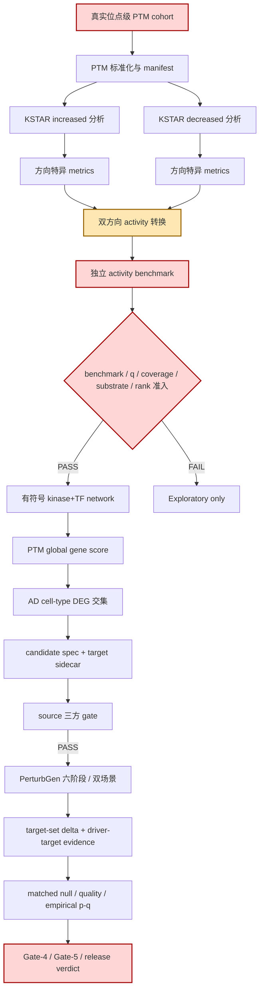
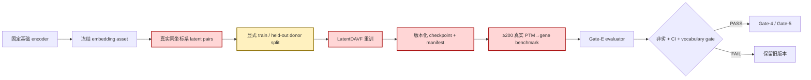

# PTM2CellNet 项目代码与文档综合分析报告

> **审计日期**：2026-09-21<br>
> **审计工作区**：`/home/scu/PTM2CellNet`<br>
> **分支 / 基线**：`main` / `323ab4d6436341c0f5dd526a30aa780d4737591d`<br>
> **报告性质**：对抗性复核；代码、测试、配置、运行证据优先于历史报告中的完成声明<br>
> **保护约束**：保留全部未提交 KSTAR 相关修改；未执行 `reset`、`clean`、强制 checkout 或覆盖<br>
> **输出文件**：`project_analysis_20260921.md`

---

## 目录

- [1. 执行摘要](#1-执行摘要)
- [2. 审计方法、证据层级与判定标准](#2-审计方法证据层级与判定标准)
- [3. 未实现功能、接口与业务流程](#3-未实现功能接口与业务流程)
- [4. 未完全实现功能与完成度](#4-未完全实现功能与完成度)
- [5. 需求文档与实际实现差异](#5-需求文档与实际实现差异)
- [6. 技术债清单与严重程度](#6-技术债清单与严重程度)
- [7. 严重、高、中级技术债解决策略](#7-严重高中级技术债解决策略)
- [8. 测试、静态检查与真实资产证据](#8-测试静态检查与真实资产证据)
- [9. 优先级路线图与资源估算](#9-优先级路线图与资源估算)
- [10. 结论与建议](#10-结论与建议)
- [11. 子智能体调用统计](#11-子智能体调用统计)
- [12. 审计轨迹](#12-审计轨迹)
- [附录 A：需求—实现—证据追踪矩阵](#附录-a需求实现证据追踪矩阵)
- [附录 B：关键命令与结果摘要](#附录-b关键命令与结果摘要)
- [附录 C：完成度计算方法](#附录-c完成度计算方法)

---

# 1. 执行摘要

## 1.1 总体结论

本项目当前应被准确描述为：

> **工程合同层和大部分合成/模拟测试链已经成熟，真实 PTM 主线与正式生物学验收仍未闭环；当前工作树新增的 KSTAR 与 kinase+TF 网络能力显著推进了工程可执行性，但真实 KSTAR 全流程存在确定性阻断缺陷，且 activity benchmark/准入门禁尚未实现。**

按本报告定义的加权审计模型，当前主线综合完成度为 **62.1%**。该数字不是代码覆盖率，而是按“实现、合同校验、自动测试、可复现资产、正式真实证据”五个维度计算的工程/研究闭环完成度，详见[附录 C](#附录-c完成度计算方法)。

最重要的结论如下：

1. **正式生物学 PASS 仍为 0**。最终复核时对 `outputs/` 下 1,057 个可读 JSON/YAML/TSV/Markdown 证据文件扫描，未发现 `biology_pass=true`、`may_enter_lineage=true` 或 `scientific_acceptance=true`。
2. **真实 KSTAR 资产不是缺失项**：本机 KSTAR 1.2.0 环境、资源文件、ST/Y 各 50 个非空网络文件和官方网络压缩包均真实存在并可复核；真正阻断点是 runner 错误要求增加/降低两个方向的 metrics 全表完全相等，以及 verifier 没有验证网络文件数量、非空性和网络 ID。
3. **activity benchmark 与 activity admission 是当前最关键的功能缺口**。方案要求 benchmark 未通过只能 exploratory，且传播前应冻结 q-value、substrate、coverage、rank/null 规则；实际 `activities_for_propagation()` 只按 method/contrast 选择所有非零 activity，未执行任何正式准入。
4. **P-06 已实现，不应继续列为未完成**。E2E 已加载 target-set sidecar、绑定通过的 source gate、解析真实结果 H5AD、计算 target delta 和 driver–target gate，并写入 lineage；`.planning/REQUIREMENTS.md` 与 `.planning/STATE.md` 的“仍待接线”已经过时。
5. **Workflow B 仍是真正未实现的主模块**：固定 encoder → 冻结 embedding asset → 真实 latent pair → LatentDAVF 重训 → 至少 200 条可追溯真实 benchmark → Gate-E 的完整资产生命周期尚未形成可重放 orchestration。
6. **依赖/供应链状态达到发布阻断级别**：当前环境 `pip check` 失败；`pip-audit --local` 原始输出为 18 个包、152 条已知漏洞记录。该 152 是 scanner 原始记录数，包含重复 advisory/重复分发记录，不能直接表述为 152 个独立可利用漏洞，但在完成去重和可利用性评估前不应发布。
7. **测试健康度高，但测试分层失效**：本轮唯一计数的测试结果为 **2,735 通过、22 跳过**；全量收集 2,945 项，另有 188 项未在本次单次 300 秒限制内完成。`not slow and not gpu` 仍收集 2,945 项，说明 slow/gpu/real-assets marker 没有有效承担时长分层。
8. **仓库可维护性风险显著**：Ruff 复杂度规则在生产代码 `src/` + `scripts/` 中产生 527 项，全仓含测试为 543 项；正式 E2E、冻结验收、数据准备和训练入口存在复杂度 35–69、分支 34–72、单函数 95–277 条语句的热点。

## 1.2 状态总览

| 维度 | 当前状态 | 结论 |
|---|---:|---|
| 工程合同与输入校验 | 较成熟 | 多数 schema、fail-fast 校验和合成测试已落地 |
| KSTAR 环境与资源 | 部分完成 | 真实资源完整；完整性 verifier 不足，真实双方向执行被逻辑缺陷阻断 |
| PTM activity 正式准入 | 未完成 | 无 benchmark evaluator、无冻结 admission policy、无传播前硬门禁 |
| Signed network | 部分可用 | kinase+TF release 文件和 hash 存在；未绑定 active config，底层资产被忽略且不可移植 |
| PTM→gene 传播 | 工程可用但不合正式规范 | 所有非零 activity 均可传播，未消费 q/coverage/substrate/benchmark |
| AD DEG/交集 | 部分完成 | 数据合同和交集逻辑具备；原始 FDR 准入规范与当前 `signed_direction_without_fdr_cutoff` 决策不一致 |
| Candidate/sidecar | 高完成 | 生成和消费接口已接通；真实 PTM source proposal 仍缺 |
| E2E downstream target | 已接线 | P-06 文档状态应改为 landed；真实正式运行证据仍缺 |
| Null/quality/dual-scene | 接口完成、证据未完成 | 统计组装具备；真实 GPU matched-null/双场景验收未执行 |
| Workflow B / Gate-E | 未完成 | evaluator/部分资产工具存在；重训生命周期和真实 benchmark 未闭环 |
| 正式发布证据 | 未完成 | Gate-E/Gate-4/Gate-5 与正式六阶段证据未通过 |
| 依赖与安全 | 阻断 | 环境冲突与已知漏洞扫描不通过 |
| 文档追踪 | 漂移 | P-04/P-05/P-06、STATE、API 文档指针与当前代码事实不一致 |

## 1.3 最高优先级阻断项

| 排名 | 阻断项 | 严重度 | 影响 |
|---:|---|---|---|
| 1 | KSTAR 双方向 metrics 被错误要求完全相等 | 严重 | 真实 activity 全流程确定性失败，核心功能不可完成 |
| 2 | activity benchmark/admission gate 未实现 | 严重 | exploratory activity 可被直接传播，正式研究边界失效 |
| 3 | 当前运行环境依赖冲突且漏洞审计不通过 | 严重 | 发布不可重复，网络/API/解析依赖存在已知风险 |
| 4 | `PENDING_EXTERNAL_PTM_COHORT` 仅被当作非空字符串接受 | 高 | “外部输入未到位”可能越过配置层，依赖人工记忆阻止正式运行 |
| 5 | KSTAR network verifier 可接受空网络目录 | 高 | 损坏或空资产可通过完整性门禁 |
| 6 | signed-network 实体资产被 `.gitignore` 排除且无可移植 resolver | 高 | clean checkout/换机不可重放 manifest 指向的 release |
| 7 | Workflow B 重训与 Gate-E 生命周期未实现 | 高 | A-07/A-08 无法关闭，旧/新底座迁移不能正式验收 |
| 8 | 正式 E2E/冻结验收函数复杂度过高 | 高 | 修改易引入跨分支回归，难以证明每个科学边界均被执行 |

---

# 2. 审计方法、证据层级与判定标准

## 2.1 证据优先级

本轮采用以下优先级，低层证据不得推翻高层事实：

1. 当前工作树中的可执行代码、配置、测试和真实运行产物；
2. 当前日期的真实资产 hash、行数、网络文件和环境探针；
3. `docs/CURRENT_STATUS.md`、`lessons.md`、现行研究方案和 guide；
4. `.planning/REQUIREMENTS.md`、`.planning/STATE.md`、roadmap；
5. 历史 `project_analysis_*.md` 和过时快照。

因此，本报告不会仅凭 requirement 表中的 “Landed/Open” 判断完成状态，而会核对调用路径、返回值、测试覆盖和真实运行证据。

## 2.2 功能分类标准

| 分类 | 判定标准 |
|---|---|
| **未实现** | 需求明确要求，但没有可调用接口、无等价实现或只有文字说明/配置占位 |
| **部分实现但可用** | 主 happy path 可执行，缺失项不阻止工程用途；但尚不满足正式研究/发布定义 |
| **实现但有缺陷** | 接口与主体逻辑存在，但确定性 bug、错误校验或数据解释会阻断合法输入或产生错误结果 |
| **实现但不符合规范** | 代码可以执行，但与权威需求的字段、阈值、准入、资产或流程边界不一致 |
| **接口完成、证据未完成** | 代码合同和测试已落地，缺少真实资产、真实 GPU 执行、独立 benchmark 或正式 verdict |
| **文档状态漂移** | 代码事实已变化，但 requirement/status/API 文档仍记录旧状态 |

## 2.3 严重程度标准

参考 SonarQube Blocker/Critical/Major/Minor 的影响思想，但按本项目研究属性重新定义：

| 本报告等级 | 类比 | 客观标准 |
|---|---|---|
| **严重** | Blocker | 阻断核心主线或发布；可造成错误科学准入、数据完整性破坏、已知安全风险进入部署；无可靠人工 workaround |
| **高** | Critical | 主要功能、可复现性或正式证据受到显著影响；存在 workaround，但容易误用或成本高 |
| **中** | Major | 不立即改变科学结论，但显著增加维护、回归、审计或未来升级风险 |
| **低** | Minor | 局部卫生、警告或文档体验问题；短期可接受且影响可控 |

## 2.4 审计范围

本轮覆盖：

- 最新需求、roadmap、current status、PTM activity 方案、KSTAR/real-assets guides；
- `src/` 182 个 Python 源文件、`scripts/` 100 个 Python 源文件、`tests/` 245 个测试文件；
- 当前未提交 KSTAR adapter/resource/runner/network builder 和相关测试；
- KSTAR 独立环境及实际 ST/Y 网络；
- signed network release manifest 及被忽略的底层数据资产；
- 单元、集成、CI、real-assets gate 测试；
- Ruff、mypy、依赖一致性、`pip check`、`pip-audit`；
- 输出目录中的 biology/lineage/scientific PASS 标志。

未把以下内容误判为失败：

- 因真实资产环境变量未开启而跳过的 real-assets 测试；
- 超过 DevSpace 单次 300 秒限制的测试组；
- 已取消范围：实时质谱、自定义 PTM 数据库、GUI、API key 扩展；
- 抽象基类中的 `NotImplementedError`；
- 明确限定为人类物种的 gene mapping 对非人类输入的拒绝。

---

# 3. 未实现功能、接口与业务流程

## 3.1 已明确要求但真正未实现的功能

| ID | 未实现项 | 需求依据 | 当前证据 | 优先级 | 影响范围 |
|---|---|---|---|---|---|
| U-01 | **Activity benchmark evaluator 与正式 admission gate** | 方案 §5.2：已知 perturbation benchmark；benchmark 未通过不得进入正式 proposal；§4.6/§8 要求冻结 q-value、rank、coverage 或独立 null | `src/analysis/ptm_activity.py:389-426` 只按 method/contrast 选择所有非零 score；config schema 无 admission policy 字段 | 高 | 核心功能 |
| U-02 | **Workflow B 完整重训生命周期**：固定 encoder → frozen embedding → latent pairs → LatentDAVF retrain → Gate-E | `.planning/REQUIREMENTS.md:A-07`；双路径方案 §5.4、M4；roadmap Workflow B | 已有 embedding loader、train/evaluate 脚本与 Gate-E evaluator，但没有统一可重放 orchestration、资产绑定和正式输出 manifest | 高 | 核心功能/发布 |
| U-03 | **至少 200 条可追溯真实 PTM→gene benchmark 的正式 Gate-E 执行** | A-08；双路径方案要求 ≥200、固定划分、bootstrap CI、DAVF 非劣 | 当前 60,030 行 Gate-E 产物是 vocabulary migration benchmark，不是方向预测 benchmark；无正式 Gate-E PASS | 高 | 核心功能/发布 |
| U-04 | **Formal PTM cohort admission contract** | 方案阶段 0/1、§10、完成定义：真实位点级 PTM、species/contrast/donor/provenance 可追溯 | active config 为 `ptm_cohort: PENDING_EXTERNAL_PTM_COHORT`；`PTMResearchConfig.__post_init__` 只要求非空字符串（`src/analysis/ptm_research_config.py:123-127`）；KSTAR `_require_manifest()` 只要求任意 JSON object（`kstar_adapter.py:92-103`），实测空 `{}` manifest 与每状态仅 1 donor 也可进入 evidence，无 pairing/min-donor/hash gate | 高 | 核心功能 |
| U-05 | **可移植 signed-network/KSTAR release resolver** | A-06 要求固定 cohort、vocabulary、training config、asset versions；方案要求 release 可重放 | manifest 有相对路径/hash，但实体 TSV 与原始导出全部被 `data/*` 忽略；无 DVC/LFS/object-store/cache resolver | 高 | 核心功能/复现 |
| U-06 | **正式真实六阶段、matched-null、双场景、Gate-4/Gate-5 证据执行** | A-02/A-04/A-05/A-08；方案 §7/§9 | 接口和 frozen plan 大多存在，但输出扫描无正式 PASS；real-assets 测试 15 项全部 gate skip | 高 | 核心功能/科学验收 |

### 3.1.1 不应误列为未实现的项目

- **P-06 downstream target-set wiring**：已实现，详见 `scripts/run_davf_perturbgen_e2e.py:539-784,995-1010`。
- **KSTAR 网络资源**：真实存在，ST/Y 各 50 个非空文件；缺的是严格 verifier 和真实 runner 修复。
- **Gate-E evaluator**：`src/integration/perturbgen/gate_e.py` 与 `scripts/evaluate_gate_e.py` 已存在；缺的是 Workflow B 训练资产和正式真实执行。
- **PhosR runner**：现行 P-04 将 KSTAR/PhosR 定义为外部工具输出消费；因此仓库内无 PhosR 执行器不是必然代码缺陷，但 sensitivity output 仍是未到位的外部证据。
- **external GEARS/Geneformer formal consumer**：`src/analysis/ad_candidate_routing.py:262-273` 明确根据 2026-09-18 决策保持 `supplementary_only`，属于冻结研究决策，不应擅自补成主线。

## 3.2 建议补齐的接口清单

以下名称为本报告建议的新接口或现有接口的版本化替代，不代表它们当前已经存在。

| 接口 | 参数 | 返回值 | 用途 | 关联缺口 |
|---|---|---|---|---|
| `validate_formal_ptm_cohort(config: PTMResearchConfig, manifest_path: Path, standardized_table: Path) -> PTMCohortAdmissionReport` | 冻结 config、输入 manifest、标准化 PTM 表 | 包含 `admitted`、原因、pairing、每状态 donor/site 统计、species/contrast/provenance 与输入 hash 的不可变报告 | 拒绝 `PENDING_*`、空/不足 donor、未声明或矛盾 pairing、错误物种/对比轴、manifest 与表 hash 不绑定及不可追溯输入 | U-04 |
| `ActivityAdmissionPolicy` | `max_qvalue`、`min_substrates`、`min_network_coverage`、`rank_percentile`、`benchmark_manifest`、`require_benchmark_pass` | 不可变 policy 对象 | 把方案中的冻结准入策略变成 schema，而非注释 | U-01 |
| `select_activities_for_propagation(frame: DataFrame, *, method: str, contrast: str, policy: ActivityAdmissionPolicy) -> ActivitySelectionResult` | activity 表、方法、contrast、冻结 policy | admitted/rejected 两张表及逐行原因、policy hash | 在传播前执行 q/coverage/substrate/rank/benchmark 门禁 | U-01 |
| `evaluate_activity_benchmark(activity_table: DataFrame, benchmark_table: DataFrame, *, criteria: ActivityBenchmarkCriteria) -> ActivityBenchmarkReport` | activity、独立 benchmark、预注册阈值 | 指标、CI、PASS/FAIL、lineage、输入 hash | 将“benchmark 未通过只能 exploratory”变成可执行合同 | U-01/U-03 |
| `convert_kstar_outputs(..., increased_metrics: DataFrame, decreased_metrics: DataFrame, ...) -> DataFrame` | 两方向结果与两方向 metrics | 每个 kinase 按胜出方向选择对应 `n_substrates/coverage` 的标准 activity 表 | 替代当前单 metrics 参数，消除合法双方向差异被拒绝的问题 | TD-01 |
| `verify_kstar_network_release(network_dir: Path, manifest: KSTARNetworkManifest) -> KSTARNetworkAudit` | 网络目录、冻结 manifest | 文件数量、总字节、per-file/archive hash、reference/network IDs、PASS/FAIL | 防止空目录、缺文件、截断或网络版本漂移通过 | U-05/TD-05 |
| `resolve_signed_network_release(manifest_path: Path, cache_dir: Path) -> ResolvedSignedNetworkRelease` | release manifest、缓存目录 | 已下载/校验的本地路径、hash 与 provenance | clean checkout/换机恢复被忽略的实体资产 | U-05 |
| `run_workflow_b_retraining(base_encoder: Path, embedding_asset: Path, latent_pairs: Path, split_manifest: Path, config: WorkflowBConfig) -> WorkflowBRunManifest` | 固定 encoder、embedding、真实训练对、donor split、配置 | checkpoint、训练/验证指标、资产 hash、环境、seed | 形成独立、可重放的 Workflow B 生命周期 | U-02 |
| `evaluate_workflow_b_gate_e(old_checkpoint: Path, new_checkpoint: Path, benchmark: Path, criteria: GateECriteria) -> GateEReport` | 冻结旧/新 checkpoint、真实 benchmark、阈值 | coverage/collision/action invariance、配对下游指标、bootstrap CI、verdict | 关闭 A-07/A-08 | U-02/U-03 |

## 3.3 缺失业务流程图

### 3.3.1 PTM activity → proposal → formal evidence



**缺失/缺陷位置**：

- A：真实 PTM cohort 尚未到位；
- G：当前 runner 在进入转换前错误要求 E/F 全表相等；
- H/I：独立 benchmark evaluator 与正式 admission policy 未实现；
- R：正式真实证据未执行，输出中无 PASS。

### 3.3.2 Workflow B



### 3.3.3 文档与发布追踪流程


当前主要依赖人工同步，导致 P-04/P-05/P-06、STATE 与 API 文档入口发生漂移。

---

# 4. 未完全实现功能与完成度

## 4.1 模块完成度

| 模块 | 权重 | 完成度 | 分类 | 已完成 | 主要缺失/缺陷 |
|---|---:|---:|---|---|---|
| 阶段 0 研究配置 | 5% | **72.0%** | 实现但不完全符合规范 | objective/axis/contrast/cell types/donor/FDR/传播参数/semantic context schema | 无 activity admission policy；`PENDING_EXTERNAL_*` 仅非空校验；active network release 仍为 TF-only |
| PTM 输入标准化 | 6% | **70.0%** | 部分实现但可用 | 位点、重复、映射、manifest、exploratory 标记合同及测试 | 真实 PTM cohort 缺失；formal admission 未硬门禁 |
| KSTAR 环境与资源 | 5% | **78.0%** | 部分实现但可用 | 独立环境、pin、资源 hash、真实 ST/Y 网络与 archive | verifier 不检查文件数量/非空/network ID/archive hash；资产不可移植 |
| KSTAR runner/adapter | 8% | **55.0%** | 实现但有缺陷 | 双方向调用、p/q 转换、标准表输出、mapping 模式、测试 | metrics equality 缺陷阻断真实 full run；单 metrics 语义错误 |
| Activity benchmark/admission | 8% | **20.0%** | 未实现 | 文档规则、字段与 exploratory 边界存在 | 无 evaluator、policy schema、准入结果/原因、正式 gate |
| Signed network 构建/加载 | 7% | **82.0%** | 部分实现但可用 | kinase 15,133 + TF 12,878，combined 28,011 行；hash 匹配；loader 有冲突剔除 | active config 未绑定 combined release；实体资产被忽略；builder 有 4 个 mypy 错误 |
| Signed propagation/global score | 8% | **75.0%** | 实现但不符合正式规范 | 有符号路径、decay、coverage、degree normalization、direction-only 输出、测试 | 传播前未执行 activity q/coverage/substrate/benchmark 准入；无真实 activity |
| AD DEG/交集 | 8% | **78.0%** | 部分实现但规范漂移 | donor pseudobulk、cell-type join、方向字段、candidate evidence | 原方案要求 FDR gate，当前 config 改为只按 signed direction；需正式修订权威规范 |
| Candidate spec/sidecar | 6% | **88.0%** | 部分实现但可用 | source/target 分离、cell-type context、Ensembl/token 校验、sidecar | 真实 PTM source proposal 与正式 activity lineage 缺失 |
| E2E downstream target | 7% | **92.0%** | 接口完成、证据未完成 | sidecar/spec/run 一致性、真实 H5AD delta、driver-target gate、lineage | 正式真实六阶段输出未验收 |
| Donor/null/statistics/双场景 | 10% | **70.0%** | 接口完成、证据未完成 | frozen split、null selection、统计 assembly、dual-path AND 合同 | 正式 GPU matched-null、多 seed、双场景与 M6 verify 未执行 |
| Workflow B/Gate-E 生命周期 | 8% | **35.0%** | 未实现/部分基础存在 | embedding asset 工具、训练/evaluate 组件、Gate-E evaluator、vocabulary benchmark | 无统一重训 lifecycle；无真实方向 benchmark；无正式 verdict |
| 正式 biology/release | 9% | **15.0%** | 未完成 | 边界字段、false-by-default manifest、release checker 框架 | 0 个正式 PASS；Gate-E/4/5 和真实六阶段证据缺失 |
| FastAPI/公开工程接口 | 3% | **82.0%** | 部分实现但可用 | 路由、schema、初始化、health/metrics、单元/集成测试 | Pydantic v1 deprecated API；无 versioned OpenAPI golden；API 文档指针过时 |
| 文档/测试/复现治理 | 2% | **55.0%** | 实现但有缺陷 | 多层 guide、current status、2,700+ 测试、manifest/hash 习惯 | requirement 状态漂移、marker 分层失效、ignored 资产/根目录垃圾不可见 |
| **加权总计** | **100%** | **62.1%** | — | — | — |

## 4.2 分类结果

### 4.2.1 部分实现但可用

- PTM 标准化与表合同；
- KSTAR mapping/resource 安装和检查的基础路径；
- kinase+TF signed network builder/loader；
- signed propagation/global score 的工程路径；
- AD DEG/交集与 candidate spec；
- FastAPI/API 工程接口。

这些功能可用于工程验证或 exploratory 分析，但不能据此宣称正式生物学闭环。

### 4.2.2 实现但有缺陷

- KSTAR runner 的双方向 metrics equality；
- KSTAR verifier 对空 `INDIVIDUAL_NETWORKS` 目录也通过；
- `.gitignore` 使关键底层资产和根目录污染不出现在 `git status`；
- 当前环境依赖与项目约束不一致；
- grouped test suite 无有效 slow/real 分层，造成常规回归超时。

### 4.2.3 实现但不符合规范

- `activities_for_propagation()` 忽略 activity q-value、n_substrates、network_coverage、rank/null 与 benchmark；
- 主方案定义 AD FDR/donor gate，active config 使用 `signed_direction_without_fdr_cutoff`；该变化虽在 current status 中有研究原因，但权威方案/requirements 未完成正式修订；
- active config 仍绑定 `omnipath-2026-09-16` TF-only release，而新 combined release 已生成；
- P-04/P-05/P-06 的 requirement 状态与当前代码事实不一致。

### 4.2.4 接口完成、证据未完成

- downstream target-set E2E wiring；
- donor split/frozen cohort 接口；
- matched-null selection 与 statistical evidence assembly；
- dual-scene/dual-path evaluator；
- Gate-E evaluator。

缺失的是正式真实输入、GPU execution、独立 benchmark、CI 与最终 verdict，而不是所有代码接口。

---

# 5. 需求文档与实际实现差异

## 5.1 逐项差异

| 文档原状态/原文摘要 | 实际实现 | 判定 | 影响 |
|---|---|---|---|
| `.planning/REQUIREMENTS.md:140` P-04：仓库不存在 KSTAR/PhosR/OmniPath execution entry | 当前工作树已有 `scripts/run_kstar_activity.py`、`src/analysis/kstar_adapter.py`、`src/analysis/kstar_resources.py`、两个 network builder 和单元测试 | 文档状态漂移 | 需求追踪会错误重复规划已存在的入口 |
| `.planning/REQUIREMENTS.md:141` P-05：六类输入“全部 owner-supplied” | KSTAR 资源、ST/Y network、OmniPath kinase+TF release 和 AD DEG 资产已有本地证据；真实 PTM cohort 与独立 activity benchmark 仍缺 | 部分过时 | 无法准确识别剩余外部阻断项 |
| `.planning/REQUIREMENTS.md:142` P-06：E2E lineage wiring 与 gate contract 仍 open | `run_davf_perturbgen_e2e.py:539-784,995-1010` 已完整接线，并保持 source gate 为唯一 pass/fail、target concordance 为补充证据 | 文档状态错误 | 可能重复开发并破坏已有边界 |
| `docs/guides/kstar_activity_plan.md:75-76,200-201,219-220` 仍称“当前只完成 mapping / analysis 仍待 ST/Y network” | 匹配冻结 `unique_reference_id` 的 ST/Y 各 50 个非空网络已经存在；真实双方向计算已走到 metrics 交接并因错误 equality 断言失败 | 指南内部状态漂移 | 将真正 blocker 从 runner 正确性误写成资产缺失 |
| `.planning/STATE.md` 仍把 downstream lineage 接线列为 next work | 同上 | 文档状态漂移 | 当前执行顺序失真 |
| 方案 §4.6/§5.2/§8：传播前冻结 activity q/rank/coverage/null；benchmark 未通过不得正式 proposal | `activities_for_propagation()` 仅过滤 method/contrast，并返回全部非零 score（`src/analysis/ptm_activity.py:389-426`） | 实现不符合规范 | exploratory 结果可能进入正式候选链 |
| 方案 §4.5/§4.6：AD 交集要求 FDR 和 donor support | config `observed_admission_rule: signed_direction_without_fdr_cutoff`（`configs/research/ptm_research_config.yaml:29-34`） | 冻结决策与原规范不一致 | 研究语义必须在权威需求中显式改版，否则审计无法判断合规 |
| Active config `network_release: omnipath-2026-09-16` | 新 manifest 为 `omnipath-kinase+tf-2026-09-21`，28,011 原始行、28,009 有效边 | 配置未升级 | 正式传播仍不会自动使用新 kinase+TF release |
| `API_DOCUMENTATION.md:11` 指向 `project_analysis_20260917.md` | 当前已有 20260920 与本报告 20260921；接口/风险已变化 | 文档指针过时 | 使用者可能阅读错误的当前状态 |
| `.gitignore` 注释“only these are tracked”，根目录默认 `/*` | 根目录存在 `=1.0.0`、`=3.0.0` 等 pip 输出残留且 `git status` 不可见 | 审计能力缺陷 | 工作区污染和误生成文件不能被版本控制流程发现 |

## 5.2 关键代码对比证据

### 5.2.1 KSTAR 双方向合法差异被拒绝

当前 runner：

```python
increased_path, increased_metrics = _run_direction(..., direction="increased")
decreased_path, decreased_metrics = _run_direction(..., direction="decreased")
if not increased_metrics.equals(decreased_metrics):
    raise KSTARAdapterError(
        "increased and decreased KSTAR runs produced different network metrics"
    )
```

位置：`scripts/run_kstar_activity.py:349-368`。

两次 KSTAR 分析使用不同 evidence column；`n_substrates` 与 `network_coverage` 可以合理不同，因此全表 equality 不是合法完整性条件。随后 adapter 只接收 `metrics=increased_metrics`（`scripts/run_kstar_activity.py:369-376`），即使 lower p-value 来自 decreased，也会绑定 increased metrics。

### 5.2.2 activity 字段被验证但未用于准入

`load_ptm_activity_table()` 会验证：

- `activity_qvalue ∈ [0,1]`；
- `n_substrates >= 0`；
- `network_coverage ∈ [0,1]`。

但 `activities_for_propagation()` 只执行：

```python
selected = activity_frame[activity_frame["method"] == method]
selected = selected[selected["condition_or_contrast"] == condition_or_contrast]
activities[regulator_id] = float(record["activity_score"])
```

位置：`src/analysis/ptm_activity.py:285-338,389-426`。因此 q=1、0 substrate、0 coverage 的非零 score 也可以传播。

### 5.2.3 网络 verifier 的测试证明空目录会通过

`tests/unit/analysis/test_kstar_resources.py:88-96` 创建 ST/Y 的空 `INDIVIDUAL_NETWORKS` 目录，仅写 `RUN_INFORMATION.txt`，随后断言 verifier 成功。该测试不是遗漏，而是把弱校验固化成了预期行为。

### 5.2.4 P-06 实际已完成

`_assemble_downstream_target_evaluation()`：

- 校验 sidecar 与 candidate 的 cell type、Ensembl、source activity 和 gene；
- 只处理 `status == "pass"` 且有 invocation/direction gate 的候选；
- 要求完成的 `--run-perturbgen` 结果；
- 解析真实 H5AD 的 baseline `pred_counts` 与 perturbed `X`；
- 计算 target-set delta；
- 写入 `driver_target_gate` 和 lineage；
- 明确记录 source 三方 gate 才是 pass/fail，target-set 是 supplementary。

证据：`scripts/run_davf_perturbgen_e2e.py:539-784,995-1010`。

---

# 6. 技术债清单与严重程度

## 6.1 总表

| ID | 技术债 | 类型 | 严重度 | 来源状态 | 证据/客观依据 |
|---|---|---|---|---|---|
| TD-01 | KSTAR 两方向 metrics equality + 单 metrics 绑定 | Correctness | **严重** | 既有报告发现，本轮复核确认 | `run_kstar_activity.py:349-376`；合法真实输入被阻断，或方向与 metrics 错配 |
| TD-02 | 无 activity benchmark/admission gate | Scientific correctness | **严重** | 既有阻断，本轮细化接口 | 方案 §5.2；`activities_for_propagation()` 不用 q/coverage/substrate/benchmark |
| TD-03 | 环境依赖冲突与已知漏洞扫描失败 | Security/Dependency | **严重** | **本轮新增** | `pip check` 3 组冲突；`pip-audit` 原始 18 包/152 条记录 |
| TD-04 | Formal PTM intake 只做非空/形状校验，未绑定 cohort manifest、hash 与 donor design | Contract | **高** | 本轮新增证据 | config 接受 `PENDING_EXTERNAL_PTM_COHORT`；`_require_manifest()` 接受空 `{}`；实测每状态仅 1 donor 仍生成 KSTAR evidence，且无 pairing/min-donor/hash gate |
| TD-05 | KSTAR network verifier 不检查 50+50 文件、非空、network ID/hash | Integrity | **高** | 既有问题，本轮用真实资产和测试反证 | verifier 只检查目录与 reference ID；单元测试接受空目录 |
| TD-06 | signed/KSTAR 实体资产不可移植且被忽略 | Reproducibility | **高** | 既有问题的扩展证据 | `data/*` 被 ignore；manifest 指向本地相对文件；无 resolver/object store |
| TD-07 | active config 未绑定 kinase+TF 2026-09-21 release | Configuration | **高** | 本轮新增 | config 仍是 TF-only 2026-09-16；新 manifest/hash 已存在 |
| TD-08 | Workflow B 无统一可重放 lifecycle | Architecture | **高** | 已知 requirement open | A-07/A-08；组件分散，无正式 training/run manifest 和 Gate-E PASS |
| TD-09 | 核心 E2E/冻结/数据函数复杂度过高 | Maintainability | **高** | **本轮新增量化** | Ruff complexity：`src/` + `scripts/` 527 项，全仓含测试 543 项；最高 C901=69、分支=72、语句=277 |
| TD-10 | broad exception/silent pass 缺乏风险登记 | Reliability/Security | **中** | **本轮新增** | 34 BLE001、6 try-except-pass、2 try-except-continue |
| TD-11 | 生产代码静态安全规则 127 项未按威胁模型分流 | Security governance | **中** | **本轮新增** | `src/` + `scripts/`：assert 56、noncrypto random 20、subprocess 13、pickle 10、URL open 8 等；含测试全仓为 6,289 项，其中 6,157 项是 S101 测试断言 |
| TD-12 | 测试 marker 与分片策略失效 | Testing | **中** | **本轮新增** | `not slow and not gpu` 仍收集 2,945；grouped suite >300s；real tests 仅运行时 gate skip |
| TD-13 | KSTAR/network builder 仍有 4 个 mypy 错误 | Code quality | **中** | **本轮新增** | 3 个脚本中 pandas record/object typing 错误；`src/` 本身 182 文件 0 error |
| TD-14 | Pydantic v1/Starlette TestClient 兼容层已弃用 | Compatibility | **中** | **本轮新增** | `src/api/schemas.py:85,136,141`；测试发出 Pydantic v3 removal 警告 |
| TD-15 | 无 versioned OpenAPI golden/static compatibility gate | API governance | **中** | **本轮新增** | API 文档依赖运行时 `/docs`；无版本化 schema diff；入口指向旧报告 |
| TD-16 | requirement/status/guide 状态漂移 | Documentation | **中** | **本轮新增系统化清单** | P-04/P-05/P-06、STATE、API doc、KSTAR guide 与 active network release 不一致 |
| TD-17 | 根目录默认 ignore 隐藏工作区污染 | Auditability | **中** | **本轮新增** | `/*` 隐藏 `=1.0.0`、`=3.0.0` pip 输出及多个空残留文件 |
| TD-18 | 第三方 `mamba_ssm` 使用 deprecated AMP API | Dependency | **低** | 本轮新增 | 多测试重复 FutureWarning；项目已有部分 AMP compatibility，但第三方仍发警告 |
| TD-19 | 小型统计 fixture 出现 precision-loss warning | Test hygiene | **低** | 本轮新增 | SciPy catastrophic cancellation；真实结论不受影响，但警告噪声削弱信号 |

## 6.2 复杂度热点

以下不是“函数长”这一主观判断，而是 Ruff C901/PLR 的可复现实测：

| 文件/函数 | C901 | 分支 | 语句/参数 | 风险 |
|---|---:|---:|---:|---|
| `src/data/davf_scperturb.py::build_scperturb_latent_pairs` | 69 | 72 | 246 语句、19 参数 | 数据切分、过滤、provenance 和输出耦合，单点修改风险极高 |
| `scripts/train.py::main` | 56 | 57 | 277 语句 | 训练配置、数据、模型、恢复和记录混杂 |
| `scripts/check_perturbgen_release_evidence.py::check_release_evidence` | 44 | 45 | 119 语句 | 正式发布判定难以局部证明 |
| `scripts/run_davf_perturbgen_e2e.py::_assemble_downstream_target_evaluation` | 41 | 41 | 139 语句 | target lineage、H5AD、gate、序列化混杂 |
| `scripts/run_davf_perturbgen_e2e.py::_run` | 35 | 34 | 109 语句 | orchestration 与业务规则耦合 |
| `src/integration/perturbgen/eval_assembly.py::build_eval_input_payload` | 40 | 43 | 108 语句、24 参数 | 评估输入完整性边界难审计 |
| `src/integration/perturbgen/frozen_cohort.py` 多函数 | 30–40 | 30–45 | 95–128 语句 | frozen asset/lineage/replay 验证容易遗漏分支 |
| `src/analysis/kstar_adapter.py::build_kstar_input` | 20 | 20 | 88 语句 | 新路径尚未稳定即形成复杂热点 |

## 6.3 依赖与供应链风险

### 6.3.1 `pip check`

当前主环境存在：

- `ptm2cellnet 1.0.0` 要求 `numpy>=1.24,<2`，实际为 `numpy 2.4.3`；
- `scgpt 0.2.4` 要求 `scvi-tools>=0.16,<1.0`，实际为 `1.4.3`；
- `ssh-unit 0.1.0` 要求 `torchaudio>=2.5`，实际为 `2.4.1+cu118`。

这说明“lock 文件内部自洽”与“正在执行测试的环境可重现”不是同一件事。`scripts/check_requirements_consistency.py` 通过，只能证明 lock/constraint 文本一致，不能证明当前环境符合约束。

### 6.3.2 `pip-audit`

原始结果：**18 个包、152 条已知漏洞记录**。需要注意：

- 输出中同一 advisory 多次出现，可能来自重复 distribution 或 metadata；
- 152 不是已经去重的 CVE 数，也不是已证明在本项目调用路径上可利用的数量；
- 仍存在必须优先处理的网络、解析和服务依赖，例如 `aiohttp`、`anyio`、`urllib3`、`pillow`、`pypdf`、`transformers`、`lightning/pytorch-lightning`、`setuptools`；
- `accelerate`、`mamba-ssm`、部分 `transformers`/`pytorch-lightning` advisory 没有直接修复版本，需要隔离、功能关闭或风险接受；
- 本地 CUDA wheel 和项目包无法由 PyPI audit，属于未审计区域而非安全通过。

---

# 7. 严重、高、中级技术债解决策略

> 时间均为工程工作日，精确到 0.5 天；不包含外部数据获取等待、长时间 GPU 训练或伦理/数据许可审批。

## 7.1 核心正确性与科学准入

### TD-01：KSTAR 方向 metrics

| 方案 | 内容 | 优点 | 缺点 | 估时 |
|---|---|---|---|---:|
| A（推荐） | adapter 显式接收 `increased_metrics`/`decreased_metrics`；按较小 p-value 的胜出方向绑定对应 metrics；manifest 同时保留两方向统计 | 最符合 KSTAR 双方向语义；改动局部；向后兼容可控 | 需要 schema/version 与 runner/adapter 测试升级 | **2.0 天** |
| B | 从未按方向过滤的 mapped input 独立计算统一 substrate/coverage，p-value 仍分方向 | metrics 稳定且只有一份 | 可能与 KSTAR 实际参与检验的 direction-specific evidence 不一致 | **1.5 天** |
| C | 每个 kinase 输出 increased/decreased 两行，下游单独选择方向 | 最大限度保留原始证据 | 改变 `ptm_activity.tsv` 一行/kinase 合同，影响最大 | **3.0 天** |

实施步骤：

1. 增加方向化 metrics dataclass/schema；
2. 删除全表 equality；
3. adapter 对 winning direction 选 metrics，并保存 losing direction provenance；
4. 新增“两个方向 substrate/coverage 不同”的 runner 集成测试；
5. 在真实小型 phosphosite fixture 上执行 KSTAR full mode；
6. 升级 manifest schema 并保留旧 mapping-only 兼容。

资源：熟悉 pandas、KSTAR API、统计语义的后端/计算生物工程师。

风险：KSTAR 内部输出列在版本间变化；需要用 KSTAR 1.2.0 fixture 锁定。

### TD-02：Activity benchmark/admission

| 方案 | 内容 | 优点 | 缺点 | 估时 |
|---|---|---|---|---:|
| A（推荐） | 增加 `ActivityAdmissionPolicy` + `ActivitySelectionResult`；传播入口必须消费 selection manifest | 规则可审计、可预注册、拒绝原因明确 | 需要 config schema v2 与下游 manifest 升级 | **2.5 天** |
| B | 在 global-score builder 内直接过滤 q/coverage/substrate | 改动较小 | benchmark 与传播耦合；容易被其他调用入口绕过 | **2.0 天** |
| C | 提供独立 prefilter CLI，输出 admitted activity TSV | 易与外部 KSTAR/PhosR 对接 | 仅靠调用纪律，无法阻止使用原始表 | **1.5 天** |

实施步骤：冻结阈值字段 → 独立 benchmark schema → 评估与 CI fixture → admitted/rejected 表 → global score 只接受 policy hash 匹配的 admitted manifest → exploratory 结果强制 `may_enter_lineage=false`。

资源：计算生物学、统计验证、Python schema。

风险：没有独立 benchmark 时不能伪造阈值；必须保留 explicit exploratory 模式。

### TD-04：Formal PTM cohort admission

| 方案 | 内容 | 优点 | 缺点 | 估时 |
|---|---|---|---|---:|
| A（推荐） | 引入 `mode: exploratory|formal` 和 typed input manifest；formal 模式拒绝所有 `PENDING_*`，并强制 manifest schema/hash、pairing、每状态 donor 下限、species/contrast/site/provenance | 边界最明确；兼容 exploratory；输入与运行可重放 | schema 迁移，且 donor 下限需研究负责人预注册 | **2.0 天** |
| B | 仅在 CLI 对 `PENDING_*` 做字符串拒绝 | 快速止血 | Python API/其他入口仍可能绕过 | **0.5 天** |
| C | formal/exploratory 使用两个完全分离的 config schema | 最强类型隔离 | 维护两套 schema，迁移工作大 | **3.0 天** |

实施步骤：定义 versioned manifest → 冻结 `within_donor`/`between_donor` 与 donor 下限 → 绑定标准表 path/size/SHA256 → config、KSTAR runner、global-score CLI 共用 admission 函数 → 为 pending、空 manifest、单 donor、donor overlap、hash 漂移增加负测试 → exploratory 输出固定 `may_enter_lineage=false`。

资源：Python dataclass/Pydantic、数据合同、熟悉 PTM 研究设计与 donor estimand 的计算生物学人员。

风险：已有合成测试依赖 pending sentinel；需要明确迁移 fixture；若真实 PTM 是技术重复而非独立 donor，不能机械套用 AD 的 3+3 阈值，必须由研究设计显式声明。

### TD-07：active release 绑定

| 方案 | 内容 | 优点 | 缺点 | 估时 |
|---|---|---|---|---:|
| A（推荐） | config 引用 release manifest 路径与 hash，而不是自由文本 release；启动时 loader 验证 | 防止字符串与文件漂移 | 需要 manifest resolver | **1.0 天** |
| B | 直接把 `network_release` 改为 2026-09-21 并增加路径字段 | 快速 | 仍不可移植，hash 绑定弱 | **0.5 天** |
| C | release registry（name→manifest URI/hash） | 多环境治理更强 | 需要额外 registry 服务/文件 | **2.0 天** |

### TD-08：Workflow B

| 方案 | 内容 | 优点 | 缺点 | 估时 |
|---|---|---|---|---:|
| A（推荐） | 新增单一 `run_workflow_b.py`，编排 asset verify、latent pair、donor split、train、evaluate、Gate-E，产出不可变 run manifest | 可重放、边界清晰、最适合正式验收 | 初次实现工作量较大 | **5.0 天** |
| B | 用 Makefile/Snakemake/现有脚本组合，增加顶层 manifest | 较快、复用现有 CLI | 参数和错误模型分散 | **3.0 天** |
| C | 仅完善 runbook，人工逐步执行 | 最快 | 不满足可重复/机器校验要求 | **1.0 天** |

外部资源：可追溯真实 benchmark、冻结旧/新 checkpoint、同坐标系 latent pairs、GPU。

主要风险：训练数据不足、benchmark 与训练泄漏、旧/新 vocab 对齐错误。

## 7.2 资产完整性与复现

### TD-05/TD-06：KSTAR 与 signed-network release

| 方案 | 内容 | 优点 | 缺点 | 估时 |
|---|---|---|---|---:|
| A（推荐） | manifest 记录 archive SHA256、Unique Network ID、ST/Y 各 50 文件的清单/hash/总字节；resolver 从受控 URI/cache 恢复并校验 | 完整、可移植、适合 CI clean-room | manifest 较大；需要确定资产托管位置 | **3.0 天** |
| B | DVC/Git LFS 管理大资产 | 成熟工具，版本与代码关联 | 引入服务、凭据和配额管理 | **2.5 天** |
| C | 在不可变容器镜像中封装 KSTAR 网络和 signed release | 运行环境最稳定 | 镜像大；数据更新需要重建；不便独立复用 | **2.0 天** |

实施步骤：

1. 生成 network inventory（当前已知 ST/Y 各 50、总字节和 IDs）；
2. verifier 检查数量、非空、命名、network/reference ID、hash；
3. signed release manifest 增加 source URL/对象 ID/恢复命令；
4. clean checkout CI 下载/恢复并验证；
5. active config 只接受 resolver 返回的 verified path；
6. 删除“空目录也通过”的测试，改为缺 1 个文件/0 字节/ID 漂移均失败。

资源：DevOps/数据工程、对象存储或 LFS/DVC。

风险：外部官方 archive URL 不稳定；应将 hash 和内部镜像作为主恢复源。

## 7.3 依赖与安全

### TD-03：环境冲突与漏洞

| 方案 | 内容 | 优点 | 缺点 | 估时 |
|---|---|---|---|---:|
| A（推荐） | 从空环境重建 core/API/analysis/KSTAR 各 profile；升级有修复版本的包；重新 lock；CI 执行 `pip check` + 去重后的 audit policy | 解决根因；最可审计 | 可能触发 API/数值回归 | **4.0 天** |
| B | 最小 production image，仅保留 API/推理必需依赖；训练/分析独立镜像 | 显著缩小攻击面和冲突面 | 多镜像维护成本 | **5.0 天** |
| C | 建立临时 advisory allowlist，逐条记录 CVSS、调用面、到期日；先修网络/API高风险包 | 上线前快速风险收敛 | 不能替代升级；容易形成永久例外 | **2.0 天** |

实施步骤：导出实际依赖图 → 去重 advisory → 按部署调用面分类 → 先修 `aiohttp/anyio/urllib3/pillow/pypdf/lightning` 等有明确 fix 的包 → 对无 fix 包隔离或关闭功能 → 全测试与数值回归 → SBOM/lock/CI gate。

资源：Python packaging、CUDA/torch 环境、应用安全。

风险：升级 `transformers`、Lightning、NumPy 可能影响 checkpoint、serialization 和数值结果；必须在隔离分支及冻结资产上验证。

### TD-10/TD-11：异常与静态安全发现

| 方案 | 内容 | 优点 | 缺点 | 估时 |
|---|---|---|---|---:|
| A（推荐） | 对 formal pipeline 的 broad exception 逐个改为具体异常；silent pass 必须 log+audit reason；S 规则按调用面建立 triage 表和负测试 | 降低数据静默丢失；可审计 | 需要逐路径理解 | **3.0 天** |
| B | 在 orchestration 边界统一捕获，内部保持具体异常；建立 error code taxonomy | 错误处理一致 | 不能自动修复内部 silent continue | **2.5 天** |
| C | 保留必要例外，但每个 `noqa` 绑定风险登记、owner、到期日 | 改动最小 | 技术债仍存在 | **1.5 天** |

重点优先级：不可信 pickle/load、外部 URL 下载、subprocess partial path、release evidence 与数据导入中的 silent pass；测试中的 assert/noncrypto random 不应与生产漏洞等价处理。

## 7.4 可维护性、测试和 API

### TD-09：复杂度

| 方案 | 内容 | 优点 | 缺点 | 估时 |
|---|---|---|---|---:|
| A | 按领域全面拆分 validator/service/serializer/orchestrator，建立 typed context 对象 | 长期结构最佳 | 范围大、回归风险高 | **6.0 天** |
| B（推荐） | 先对 6 个最高风险函数做“纯 helper + dataclass context + façade”增量拆分；保持外部签名 | 可逐步合并，风险较低 | 不能一次消除生产代码 527 项（全仓 543 项） | **4.0 天** |
| C | 仅增加 snapshot/branch tests，不改结构 | 短期保护 | 不解决理解和修改成本 | **1.5 天** |

首批对象：`run_davf_perturbgen_e2e._run`、`_assemble_downstream_target_evaluation`、`build_eval_input_payload`、`check_release_evidence`、`build_scperturb_latent_pairs`、KSTAR input builder。

### TD-12：测试分层

| 方案 | 内容 | 优点 | 缺点 | 估时 |
|---|---|---|---|---:|
| A（推荐） | 给 slow/gpu/real_assets/integration 用例显式 marker；CI 建立 unit-fast、integration-slow、real-assets、GPU jobs | 语义清楚；开发反馈快 | 需要逐文件标记和 CI 修改 | **1.5 天** |
| B | 用历史 duration 自动分片（pytest-split/CI sharding） | 总时长均衡 | 对新增测试/缓存敏感 | **2.0 天** |
| C | 仅按目录并行 job | 最简单 | 当前长尾仍会集中在单目录 | **1.0 天** |

验收：`pytest -m "not slow and not gpu and not real_assets"` 应在目标 CI 时间内稳定完成；full matrix 汇总不得把 skip 当 pass。

### TD-13：mypy

| 方案 | 内容 | 优点 | 缺点 | 估时 |
|---|---|---|---|---:|
| A（推荐） | 为 pandas records 增加 TypedDict/显式 Series 转换；对 object index 前做类型收窄 | 保留类型安全 | 少量样板代码 | **1.0 天** |
| B | 在边界使用精确 `cast` 并加运行校验 | 快 | cast 可能掩盖未来 shape 漂移 | **0.5 天** |
| C | 从 mypy 排除 builder scripts | 无开发成本 | 失去新正式资产路径的静态保护，不推荐 | **0.5 天** |

### TD-14/TD-15：Pydantic 与 API contract

| 方案 | 内容 | 优点 | 缺点 | 估时 |
|---|---|---|---|---:|
| A（推荐） | 迁移 `field_validator`/`ConfigDict`；生成 versioned `openapi.json`；CI 做 breaking-change diff | 兼容未来 Pydantic v3；API 可审计 | 需更新 alias/response tests | **2.0 天** |
| B | 写内部兼容 decorator/config wrapper，并暂时支持 v1/v2 | 改动较小 | 延迟真正迁移 | **1.5 天** |
| C | pin 旧 Pydantic/Starlette/httpx | 快速止警告 | 安全与生态升级停滞 | **0.5 天** |

### TD-16：文档追踪

| 方案 | 内容 | 优点 | 缺点 | 估时 |
|---|---|---|---|---:|
| A | 从代码/manifest/test 生成 requirements traceability 表 | 状态更可信 | 生成器建设成本 | **2.0 天** |
| B（推荐） | CI 检查 authority pointers、P 状态和 active release；PR checklist 要求同步 CURRENT_STATUS/REQUIREMENTS/STATE | 成本适中 | 仍有人工判断 | **1.0 天** |
| C | 本次手工修正 P-04/P-05/P-06、STATE、KSTAR guide、API 指针 | 立即止血 | 后续仍会漂移 | **0.5 天** |

### TD-17：根目录 ignore

| 方案 | 内容 | 优点 | 缺点 | 估时 |
|---|---|---|---|---:|
| A（推荐） | 取消根级 `/*` whitelist，改用常规目标化 ignore；明确忽略 outputs/cache/large data | `git status` 恢复审计能力 | 初次会显示大量现存文件，需要整理 | **1.0 天** |
| B | 保留 whitelist，但增加 root guard 脚本，拒绝未列入 allowlist 的根文件 | 改动小 | `git status` 仍不可见，依赖额外命令 | **0.5 天** |
| C | CI clean-room clone + root inventory 对比 | 能防发布包污染 | 本地开发仍可能隐藏垃圾 | **1.0 天** |

## 7.5 资源、工具与风险矩阵

下表补充所有严重、高、中级债务的实施资源和主要风险；具体方案和工期见前述各节。

| 债务 | 所需技能/工具 | 主要风险 | 风险控制 |
|---|---|---|---|
| TD-01 | KSTAR 1.2.0、pandas、计算生物学、方向化 fixture | KSTAR 输出 schema 变化；direction 与 metrics 再次错配 | pin 版本；保存两方向原始结果；真实差异 fixture + manifest schema test |
| TD-02 | 统计学、磷酸化组学、schema/CLI、独立 benchmark | 数据泄漏；阈值事后调优；无 benchmark 时被迫造规则 | 预注册 criteria；train/benchmark 来源分离；无 benchmark 强制 exploratory |
| TD-03 | Python packaging、CUDA/torch、SBOM、`pip-audit`、容器 | 升级破坏 checkpoint/数值兼容；无 fix advisory | 隔离环境；冻结模型回归；最小生产镜像；时限化风险接受 |
| TD-04 | 数据合同、Pydantic/dataclass、manifest | 旧 fixture/脚本依赖 sentinel；入口绕过 | schema version；formal/exploratory 分离；所有 CLI/Python API 共用 admission 函数 |
| TD-05 | 文件完整性、tar/hash、KSTAR network 语义 | 官方 archive/URL 漂移；大量 per-file hash 成本 | 内部镜像；archive+inventory 双重校验；缓存后增量验证 |
| TD-06 | DVC/LFS/对象存储、resolver、CI clean clone | 凭据/配额失效；资产不可下载 | 内容寻址；离线镜像；恢复演练；明确 owner |
| TD-07 | config schema、release manifest、loader | active release 改变传播结果；旧结果不可比较 | release version bump；并行旧/新 replay；禁止静默切换 |
| TD-08 | PyTorch/Lightning、DAVF、donor split、GPU/MLOps | 训练/benchmark 泄漏；vocab/坐标系错配；GPU 非确定性 | frozen split/hash；轴一致性检查；seed/环境记录；旧基线不可覆盖 |
| TD-09 | Python 架构重构、characterization tests、Ruff | 重构改变科学语义；跨分支遗漏 | 外部签名不变；纯函数提取；golden fixture；小步合并 |
| TD-10 | 异常设计、日志、负测试、审计码 | 把可恢复异常改成硬失败；日志泄露路径/数据 | error taxonomy；敏感字段脱敏；按 formal/exploratory 定义恢复策略 |
| TD-11 | 应用安全、Bandit/Ruff S、威胁建模 | 误把测试 assert/随机数当生产漏洞，或漏掉真实 pickle/URL 风险 | 按调用面分流；每项结论带证据、owner、到期日 |
| TD-12 | pytest markers、CI matrix、duration sharding | 错误 marker 导致关键测试不运行；分片不平衡 | collect-only gate；每 job 报告 collected/pass/skip；定期 full matrix |
| TD-13 | mypy、pandas typing、TypedDict | 过度 `cast` 掩盖真实 shape 漂移 | 运行时列/类型校验；最小范围 cast；focused mypy CI |
| TD-14 | Pydantic v2、FastAPI、Starlette/httpx | alias/序列化响应变化，破坏客户端 | OpenAPI golden；v1/v2 payload 回归；明确 deprecation window |
| TD-15 | OpenAPI、schema diff、API versioning | golden 频繁噪声；误判兼容变化 | 规范化 schema；breaking/non-breaking 分类；人工批准例外 |
| TD-16 | 文档生成、CI traceability、release checklist | 自动状态从测试通过推断科学 PASS | 生成器只汇总事实，不自动升级 biology verdict；owner 审批 |
| TD-17 | Git ignore、root guard、clean-room CI | 取消 whitelist 后大量本地文件误纳入 | 先 inventory；分阶段调整；大资产规则和 pre-commit guard |

---

# 8. 测试、静态检查与真实资产证据

## 8.1 测试结果

### 8.1.1 唯一计数结果

为避免重复，独立复核的 66 项 focused 测试是 903 项分区的子集，不重复加入总数。

| 分区 | 通过 | 跳过 | 失败 | 说明 |
|---|---:|---:|---:|---|
| `tests/unit/analysis` + `tests/unit/integration` + `tests/unit/scripts` | 903 | 0 | 0 | PTM、KSTAR、PerturbGen 合同和脚本层 |
| 其余 unit：API/data/model/training/evaluation 等 | 1,759 | 6 | 0 | 88.52 秒 |
| 本轮完成的 integration 文件 | 61 | 1 | 0 | 含 data manifest、DAVF pipeline、cross-scale、Lightning 等 |
| CI contract | 12 | 0 | 0 | `tests/ci/test_esm3_ci_smoke.py` |
| real-assets gate | 0 | 15 | 0 | 因真实资产 gate 未开启全部 skip |
| **唯一总计** | **2,735** | **22** | **0** | 共 2,757 个已得到结果的 test nodes |

全量 `not slow and not gpu` 收集 **2,945** 项；本轮仍有 **188** 项未在时间限制内完成。全套/合并 integration+E2E 运行超过 DevSpace 单次 300 秒限制且没有可信 summary，因此本报告既不记为通过，也不记为失败。

### 8.1.2 长尾证据

- `tests/integration/test_data_manifest_cli.py`：6/6 通过，70.49 秒；最慢单项 26.64 秒。
- `tests/integration/test_davf_pipeline.py`：15 通过、1 跳过，51.77 秒。
- 分开运行后两者均通过，说明 grouped timeout 主要是分片/预算问题，而不是已确认功能失败。

## 8.2 静态检查

| 检查 | 结果 | 解释 |
|---|---|---|
| Targeted Ruff（9 个 KSTAR/构网文件） | 通过 | 当前新增文件基本 lint 规范 |
| Targeted Ruff format | 通过 | 9 个文件已格式化 |
| `mypy src/ --ignore-missing-imports` | 通过 | 182 个 source 文件 0 error |
| KSTAR/builders focused mypy | **4 errors** | 3 个 builder 脚本的 pandas 类型错误 |
| Ruff complexity | **527 findings（`src/` + `scripts/`）；543 findings（含 `tests/`）** | 不是功能失败，但为可维护性高风险；两种口径均由同一规则集复现 |
| Ruff BLE/silent | **42 findings（`src/` + `scripts/`）；51 findings（含 `tests/`）** | 生产代码为 34 broad except、6 silent pass、2 silent continue |
| Ruff security rules | **127 findings（`src/` + `scripts/`）；6,289 findings（含 `tests/`）** | 全仓数字被 6,157 个 S101 测试断言主导；必须按生产/测试调用面分流，不能全部等同漏洞 |
| Requirements/lock consistency | 通过 | 274 lock pins 与声明约束文本一致 |
| Formal intake 直接探针 | **失败边界被复现** | active config 接受 `PENDING_EXTERNAL_PTM_COHORT`；空 `{}` manifest + 每状态 1 donor 仍生成 KSTAR evidence；q=1、0 substrate、0 coverage 的非零 activity 仍被传播入口选择 |
| `pip check` | **失败** | 当前执行环境不符合项目/插件依赖约束 |
| `pip-audit --local` | **失败** | 原始 18 包/152 条 known-vulnerability records |
| `git diff --check` | 通过 | 当前 tracked diff 无空白错误 |

## 8.3 KSTAR 实体资产

| 项目 | 实测值 |
|---|---|
| Python | 3.12.14 |
| KSTAR | 1.2.0 |
| pandas / NumPy / SciPy | 3.0.6 / 2.5.3 / 1.18.1 |
| Resource files | 全部匹配 `environments/kstar/resource_hashes.json` |
| ST 网络 | 50 个非空文件；332,139,803 bytes |
| Y 网络 | 50 个非空文件；90,932,356 bytes |
| ST Unique Network ID | `0c85777e396f8931cc6662138fef6e6273acf706ec3503c178cd31e40ec04810` |
| Y Unique Network ID | `23ce4b6c19d912d314e6893a993c48ad18129e9d88766b994ca5fc6f8fd2e8b5` |
| Unique Reference ID | `a7dfa119afa4f833375dfaf0c503ee1bca28c9fe7d868e4249907442d7821c64` |
| `NETWORKS.tar.gz` | 213,639,737 bytes |
| Archive SHA256 | `2fb054e6905f4b693e7a1df7fc3eda0121020122ecb4613c7138a0874279321a` |

结论：本机资产完整，但当前 verifier 无法证明以上事实；manifest 也未记录 archive/network IDs/per-file inventory。

## 8.4 Signed network release

`data/manifests/kstar_signed_network_release_20260921.json` 与实体文件复核：

| 资产 | manifest 行数 | 实际行数 | SHA256 | 结果 |
|---|---:|---:|---|---|
| TF-only 2026-09-16 | 12,878 | 12,878 | 匹配 | PASS |
| kinase 2026-09-21 | 15,133 | 15,133 | 匹配 | PASS |
| combined kinase+TF | 28,011 | 28,011 | 匹配 | PASS |
| OmniPath raw export | — | 文件存在 | 匹配 | PASS |

Loader audit：

- raw rows：28,011；
- propagation edges：28,009；
- unsigned：0；
- self-loop：0；
- sign-conflict groups：1；
- default confidence：0；
- edge types：`kinase_substrate:signaling`、`tf_regulation`。

这证明 combined release 本身有效，但 config、版本控制与恢复合同尚未闭环。

## 8.5 正式科学证据

扫描结果：

```text
files_scanned=1057
biology_pass_true=0
may_enter_lineage_true=0
scientific_acceptance_true=0
```

因此以下表述均不成立：

- “正式生物学验收已通过”；
- “KSTAR activity 已可进入正式 lineage”；
- “Gate-E/Gate-4/Gate-5 已关闭”；
- “真实双路径治疗效果已验证”。

当前可以成立的表述是：

- 工程合同、fixture、mock/synthetic 和部分真实资产 preflight 已通过；
- KSTAR 环境和网络资产真实存在；
- kinase+TF signed network release 文件可复核；
- 正式 PTM activity、benchmark 和 biology release 尚未通过。

---

# 9. 优先级路线图与资源估算

## 9.1 P0：恢复正确性与发布安全（0–5 个工作日）

| 顺序 | 工作 | 估时 | 退出条件 |
|---:|---|---:|---|
| 1 | 修复 KSTAR direction-specific metrics，并加真实差异 fixture | 2.0 天 | full mode 不再要求 metrics 相等；方向与 metrics 正确绑定 |
| 2 | 加 formal/exploratory PTM intake gate，拒绝 pending sentinel | 2.0 天 | formal 模式无法在缺真实 cohort 时运行 |
| 3 | 对依赖 audit 去重和调用面分级；升级有 fix 的网络/API高风险包 | 4.0 天，可并行 | clean env `pip check` 通过；高风险 advisory 有修复或有时限例外 |
| 4 | 把 P-04/P-05/P-06、STATE、KSTAR guide、API 指针同步到代码事实 | 0.5 天 | authority docs 无已知状态冲突 |

P0 所需技能：KSTAR/计算生物、Python packaging、应用安全、测试工程。

## 9.2 P1：补齐正式 activity 与资产复现（5–12 个工作日）

| 工作 | 估时 | 退出条件 |
|---|---:|---|
| ActivityAdmissionPolicy + benchmark evaluator | 2.5 天 | benchmark FAIL 强制 exploratory；传播只接收 admitted manifest |
| 严格 KSTAR network verifier + release resolver | 3.0 天 | 缺文件/0 字节/ID/hash 漂移均硬失败；clean checkout 可恢复 |
| 绑定 active kinase+TF release | 1.0 天 | config 通过 manifest/hash 指向 verified release |
| 修复 4 个 builder mypy errors | 1.0 天 | focused mypy 0 error |
| 测试 marker/CI matrix | 1.5 天 | fast suite 稳定在目标窗口，slow/real/GPU 独立汇总 |

## 9.3 P2：架构降债与正式科学执行（12–30+ 个工作日）

| 工作 | 代码估时 | 外部/运行依赖 |
|---|---:|---|
| 拆分 6 个最高风险复杂函数 | 4.0 天 | 需要完整回归窗口 |
| broad exception/security triage | 3.0 天 | 需 threat model 与负测试 |
| Pydantic v2 + OpenAPI golden | 2.0 天 | 客户端兼容验证 |
| Workflow B orchestration | 5.0 天 | 真实 latent pairs、GPU、冻结 checkpoint |
| 真实 KSTAR benchmark 与 formal PTM run | 代码外 | 真实位点级 PTM、独立 perturbation benchmark |
| 正式 six-stage/null/dual-scene/Gate-E/4/5 | 代码外+运行 | GPU、donor split、99 null/候选、多 seed、统计复核 |

## 9.4 建议人员配置

| 角色 | 主要任务 |
|---|---|
| 计算生物学/磷酸化组学工程师 | KSTAR 方向语义、benchmark、activity policy、PTM cohort 兼容性 |
| Python/数据平台工程师 | adapter、manifest、resolver、typed contracts、复杂度拆分 |
| MLOps/DevOps | 环境分层、lock、容器、对象存储、CI sharding、GPU run |
| 应用安全/依赖治理 | advisory 去重、可利用性评估、SBOM、例外到期管理 |
| 统计学审阅者 | benchmark criteria、bootstrap CI、donor/null/多重检验 |

---

# 10. 结论与建议

## 10.1 可以确认的完成项

1. PTM 标准表、signed network、gene score、intersection、candidate/sidecar 的合同层已形成；
2. E2E target-set wiring 已完成，P-06 应更新为 landed；
3. KSTAR 1.2.0 环境和官方网络资源真实存在；
4. kinase+TF signed release 的行数和 SHA256 与 manifest 一致；
5. 大规模单元/合同测试健康，本轮 2,735 pass、0 fail；
6. downstream target concordance 未被错误替代为 source gate 或因果验证；
7. formal biology 默认 false 的边界仍然有效。

## 10.2 不能确认的完成项

1. 不能确认真实 KSTAR full activity 已成功运行；
2. 不能确认任何 activity 已通过独立 benchmark；
3. 不能确认正式 PTM cohort 已接入；
4. 不能确认 active propagation 使用 2026-09-21 kinase+TF release；
5. 不能确认真实六阶段/matched-null/双场景/Gate-E/4/5 已通过；
6. 不能确认当前 Python 环境可用于安全发布；
7. 不能确认 2,945 项全测试通过，因 188 项未在本轮完成。

## 10.3 最终建议

在任何新功能扩张前，先执行以下不可交换顺序：

1. 修复 KSTAR 双方向 metrics；
2. formal config 拒绝 pending 输入；
3. 实现 activity benchmark/admission；
4. 严格校验并可移植恢复 KSTAR/signed-network 资产；
5. 清理依赖冲突和高风险 advisory；
6. 绑定 combined network release；
7. 获取真实 PTM 与独立 benchmark；
8. 运行真实 activity → propagation → candidate；
9. 再运行六阶段/null/dual-scene；
10. 最后实施 Workflow B 和 Gate-E/4/5。

在第 7–10 步完成前，任何“PTM 导致某 cell type 表达变化”或“正式生物学 PASS”均应继续禁止；允许的结论上限是“工程合同通过”或“PTM/activity/network 预测与 AD DEG/模型输出方向一致的探索性证据”。

---

# 11. 子智能体调用统计

本次任务未启用可独立调度的子智能体；所有调查由当前主审计会话通过 Q015 DevSpace 工具完成。Q015 MCP 是工作区工具，不计为子智能体。

| 智能体名称 | 调用次数 | 主要执行任务 | 平均执行时长 |
|---|---:|---|---:|
| 子智能体（未启用） | **0** | 无 | N/A |

简要分析：由于本会话可直接访问同一 DevSpace 工作区，并需严格保护未提交 KSTAR 修改，未并行启用子智能体可避免多个写入者对同一 checkout 造成冲突。该统计是精确计数，不包含 shell、read、write 等工具调用。

---

# 12. 审计轨迹

## 12.1 版本控制状态

审计开始时：

- branch：`main`；
- HEAD：`323ab4d6436341c0f5dd526a30aa780d4737591d`；
- 已存在未提交 KSTAR 相关 tracked/untracked 修改；
- 本轮将这些文件视为受保护现场证据。

本轮执行：

- 未执行 `git reset`；
- 未执行 `git clean`；
- 未执行强制 checkout；
- 未覆盖既有 KSTAR 文件；
- 未改动任何 tracked 业务源码、配置或测试；仅新增本报告 `project_analysis_20260921.md`；
- 验证测试在被 `.gitignore` 排除的运行目录中生成/更新了 `outputs/logs/lightning_logs/version_711/hparams.yaml`、`outputs/models/best_model.config.yaml`、`outputs/models/artifact_manifest.json`，这些是测试副产物，不是本轮功能实现；
- 写入前通过 ZMemory 对目标报告取得 claim。

## 12.2 可复核命令类别

- `git status --short --branch`、`git rev-parse`、`git diff --check`；
- `pytest` 分区、collect-only、real-assets gate、CI contract；
- `ruff check`、`ruff format --check`、`mypy`；
- `scripts/check_requirements_consistency.py`；
- KSTAR Python 包版本、resource hash、network inventory、archive SHA256；
- signed-network manifest 行数/hash 与 loader audit；
- `pip check`、`pip-audit --local`；
- `outputs/` 的 biology/lineage/scientific PASS 标志扫描。

---

# 附录 A：需求—实现—证据追踪矩阵

| Requirement | 代码/接口 | 测试/资产证据 | 本轮判定 |
|---|---|---|---|
| A-01 Gate-0 real cohort | Gate-0 contracts、GSE174367 frozen assets | 既有 preflight；real-assets 当前 gate skip | 部分完成，正式运行未完成 |
| A-02 train/held-out donor | donor split/frozen cohort interfaces | unit contracts；formal held-out metrics 未验收 | 接口完成、证据未完成 |
| A-03 direction semantics | separate fields、semantic context、3-way gate | 大量 unit/E2E tests | 工程合同基本完成 |
| A-04 dual scenes | orchestrator/runner/evaluator | mocked/contracts；真实双场景未运行 | 接口完成、证据未完成 |
| A-05 null/quality/statistics | statistical assembly、null selection | unit/integration pass；真实 GPU null 未运行 | 部分完成 |
| A-06 prepare/reuse/assets | shared prepare/reuse | tests pass；无 portable release resolver | 主要实现，资产治理缺失 |
| A-07 Workflow B | 分散 train/evaluate/asset 组件 | 无统一 run manifest/PASS | 未实现完整生命周期 |
| A-08 formal release | release evidence checker/Gate-E evaluator | 0 biology PASS | 未完成 |
| P-01 Stage 0–5 contracts | config/activity/network/gene score/candidate | 903 分区含相关测试全通过 | 已落地 |
| P-02 direction semantics | per-field direction + source/target split | tests pass | 已落地 |
| P-03 no PTM significance without null | `prediction_status=direction_only` | tests pass | 合同已落地 |
| P-04 external consumption/execution | loaders + 新 KSTAR runner/builders | KSTAR 资产和 focused tests | 文档状态过时；runner 有阻断缺陷 |
| P-05 external inputs | 部分真实资产已到位 | real PTM/benchmark 仍缺 | 部分完成，原“全部缺失”过时 |
| P-06 downstream lineage | `_assemble_downstream_target_evaluation` | unit + E2E script tests | 已落地，文档应更新 |

---

# 附录 B：关键命令与结果摘要

```text
# 唯一测试计数
2735 passed, 22 skipped, 0 failed
full collection: 2945
not completed in this audit window: 188

# Focused KSTAR/PTM/E2E subset（包含于上面的 903，不重复计数）
66 passed

# Source typing
mypy src/: Success, 182 source files
focused builders: 4 errors in 3 files

# Dependency text consistency
274 lock pins satisfy core/optional constraints

# Runtime environment consistency
pip check: failed (3 incompatibility groups)

# Vulnerability scan
pip-audit raw: 152 known-vulnerability records in 18 packages

# Complexity
Ruff C901/PLR: 527 findings in src/scripts; 543 including tests

# Broad exception/silent handling
BLE001=34, S110=6, S112=2

# Formal output scan
1057 files scanned; biology_pass_true=0; may_enter_lineage_true=0;
scientific_acceptance_true=0
```

---

# 附录 C：完成度计算方法

## C.1 评分维度

每个模块按以下五维评估：

| 维度 | 模块内权重 | 说明 |
|---|---:|---|
| 主体实现 | 35% | 核心算法/流程是否存在且可调用 |
| 合同与校验 | 20% | schema、fail-fast、provenance、边界是否机器执行 |
| 自动测试 | 15% | 正常/异常/边界/集成是否覆盖 |
| 可复现资产 | 15% | hash、版本、恢复、环境、manifest 是否完整 |
| 正式真实证据 | 15% | 真实输入、独立 benchmark、held-out/null/GPU/verdict 是否通过 |

模块再按主线重要度加权，得到 62.1%。示例：

- E2E downstream target 的代码与测试高度完成，但无正式真实执行，故为 92.0% 而非 100%；
- activity admission 只有文档和字段，缺机器 gate，故为 20.0%；
- formal biology release 有 false-by-default 边界但 0 PASS，故为 15.0%；
- Workflow B 有若干基础组件，但没有生命周期闭环，故为 35.0%。

## C.2 解释边界

- 完成度不是 LOC 百分比；
- 通过合成/fixture 测试不会自动提高“正式真实证据”维度；
- 外部数据尚未提供不一定是代码缺陷，但会降低主线闭环完成度；
- 文档宣称完成但代码/运行证据不支持时，以代码和证据为准；
- 接口存在但被确定性 bug 阻断时，不能按“已实现”满分计算。
