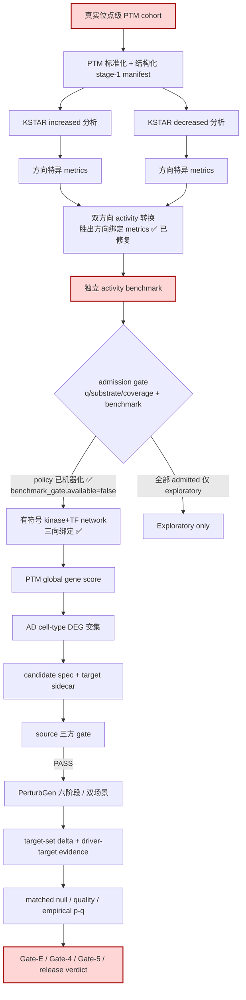
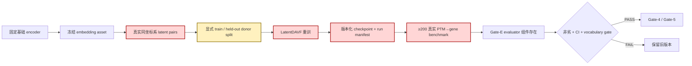

# PTM2CellNet 项目代码与文档综合分析报告

> **审计日期**：2026-09-22<br>
> **审计工作区**：`/home/scu/PTM2CellNet`<br>
> **分支 / 基线**：`main`；审计开始 HEAD `323ab4d`（工作树含 2026-09-21 修复轮未提交成果）→ 本轮三语义提交后 `25c0ab3`（已同步 `origin/main`）<br>
> **报告性质**：对抗性复核；代码、测试、配置、运行证据优先于历史报告中的完成声明<br>
> **前置操作**：本轮先完成版本控制闭环（提交/推送/编译验证）与文档归档（`archive/20260922/`），分析基于提交后的干净基线<br>
> **输出文件**：`project_analysis_20260922.md`

---

## 目录

- [1. 执行摘要](#1-执行摘要)
- [2. 审计方法、证据层级与判定标准](#2-审计方法证据层级与判定标准)
- [3. 任务一：未实现功能、接口与业务流程](#3-任务一未实现功能接口与业务流程)
- [4. 任务二：未完全实现功能与完成度](#4-任务二未完全实现功能与完成度)
- [5. 任务三：技术债识别、分类与解决策略](#5-任务三技术债识别分类与解决策略)
- [6. 版本控制与归档操作记录](#6-版本控制与归档操作记录)
- [7. 结论与建议](#7-结论与建议)
- [8. 子智能体调用统计](#8-子智能体调用统计)
- [附录：关键命令与结果摘要](#附录关键命令与结果摘要)

---

# 1. 执行摘要

## 1.1 总体结论

> **2026-09-21 修复轮（TD-01/02/04/05/06/07/12/13/14/16/17）经本轮逐项代码核对全部真实落地且无旁路；主线加权完成度从 62.1% 升至 71.0%。剩余缺口集中在三类：外部输入（真实 PTM cohort、独立 activity benchmark、Workflow B 训练资产）、正式执行（六阶段/null/Gate-E/4/5）、以及环境与打包治理（TD-03 出现新形态：冲突"消失"实为发行版元数据脱节）。正式 biology PASS 仍为 0。**

最重要的结论：

1. **修复轮 11 项债务全部经代码核实闭合**。admission gate 成为唯一传播入口（旧 `activities_for_propagation` 全仓删净，唯一残留是 `src/analysis/ptm_activity_admission.py:10` 的 docstring 历史说明）；formal 模式在配置层拒绝一切 `PENDING*`（`src/analysis/ptm_research_config.py:218-225`）；combined release 三向绑定在传播 CLI 启动时强制执行（`scripts/build_ptm_global_gene_scores.py:99`）；KSTAR verifier 钉死 50+50 文件与双 Network ID（`src/analysis/kstar_resources.py:27-29,246-266`）；Pydantic v1 API 清零。
2. **正式生物学 PASS 仍为 0**（本轮复扫 `outputs/`：`biology_pass=true`/`may_enter_lineage=true` 均为 0 出现），该结论不因修复轮改变。
3. **TD-03 出现状态变化而非修复**：0922 复测 `pip check` 仅报 `PyNaCl 1.5.0 is not supported on this platform`，0921 记录的 3 组版本冲突"消失"——原因是 `ptm2cellnet`/`ssh-unit`/`scgpt` 三个发行版的元数据已不在当前环境（`pip list` 无这三项），冲突方不存在了，而不是约束被满足。环境与声明元数据的脱节加深。
4. **新增 2 项中级技术债**（0921 TD-01~19 未登记）：ND-01 `scripts/` 无包身份但 `setup.py` console_scripts 与 `src/analysis/ptm_smoke.py:506-509` 反向依赖它（pip 安装后入口即坏）；ND-02 CHANGELOG `[Unreleased]` 漏记整个 0921 修复轮（上轮刚修过同类漂移，属回归）。
5. **测试与静态检查全绿且分层生效**：本轮全目录 `not slow and not gpu` 实测 **2,922 passed / 22 skipped / 0 failed / 464.63s**（含 e2e 42 项，0921 修复轮曾因 300s 超时遗留 188 项未完成——分层修复后该问题消除）；ruff/format/mypy（183 文件 0 错误）/依赖文本一致性/compileall 全部通过。
6. **根目录滞留的 4 份历史报告与 3 份无引用笔记本轮归档**（`archive/20260922/`，含 MANIFEST），`CURRENT_STATUS` 中两处"已归档"声明与事实不符的漂移一并闭合。

## 1.2 状态总览

| 维度 | 2026-09-21 | 2026-09-22（本轮核对） |
|---|---|---|
| KSTAR 双方向 metrics | 确定性阻断（严重） | **已修复并验证**（胜出方向绑定 + manifest v2） |
| Activity 准入门禁 | 未实现（严重） | **policy+selection 机器化**；benchmark evaluator 仍缺（外部数据） |
| Formal PTM intake | 仅非空校验（高） | **mode + 结构化 manifest + donor 下限**落地 |
| KSTAR network verifier | 空目录可通过（高） | 50+50 非空 + 双 Network ID pin |
| Signed network 绑定 | config 仍 TF-only（高） | combined release 三向绑定实测 PASS |
| 测试分层 | 失效（中） | 17 项 slow marker + full-test.yml 承接 |
| Workflow B / Gate-E | 未实现（高） | **仍开放**（编排与真实 benchmark 缺） |
| 正式六阶段/null/双场景 | 未执行 | **仍开放**（外部输入 + GPU 窗口） |
| 依赖/供应链 | 3 组冲突 + 96 条 advisory | 冲突方元数据消失（脱节加深，未修复） |
| 主线加权完成度 | 62.1% | **71.0%**（§4.1） |

## 1.3 最高优先级阻断项（当前）

| 排名 | 阻断项 | 严重度 | 影响 |
|---:|---|---|---|
| 1 | 真实 PTM cohort 与独立 activity benchmark 缺失 | 严重（外部） | 主线无法产生任何正式结果；formal 模式已被机器禁止（正确的等待姿态） |
| 2 | TD-03 依赖治理：advisory 未清 + 发行版元数据脱节 | 严重 | 发布不可重复；本轮新增"冲突假消失"风险 |
| 3 | TD-08 Workflow B 无统一可重放生命周期 | 高 | A-07/A-08 无法关闭 |
| 4 | ND-01 `scripts/` 打包缺陷（console_scripts + src→scripts 反向依赖） | 中→高 | pip 安装后 CLI 入口与 ptm_smoke pipeline 模式即坏 |
| 5 | TD-09 复杂度热点（372 项，复测一致） | 高 | 正式 E2E/冻结/数据函数修改易引入跨分支回归 |
| 6 | U-06 正式六阶段/matched-null/双场景/Gate-4/5 执行 | 高（外部+排期） | 科学验收链终点 |

---

# 2. 审计方法、证据层级与判定标准

## 2.1 证据优先级

1. 当前提交基线（`25c0ab3`）中的可执行代码、配置、测试与真实运行产物；
2. 本轮日期的实测命令输出（pytest/ruff/mypy/pip/compileall/outputs 扫描）；
3. `docs/CURRENT_STATUS.md`、`lessons.md`、现行研究方案与 guides；
4. `.planning/REQUIREMENTS.md`、`.planning/STATE.md`；
5. 已归档的历史 `project_analysis_*.md`（`archive/20260922/` 等）。

## 2.2 功能分类标准（沿用 0921 §2.2，便于纵向对比）

| 分类 | 判定标准 |
|---|---|
| **未实现** | 需求明确要求，但没有可调用接口、无等价实现或只有文字说明/配置占位 |
| **部分实现但可用** | 主 happy path 可执行，缺失项不阻止工程用途；尚不满足正式研究/发布定义 |
| **实现但有缺陷** | 接口与主体逻辑存在，但确定性 bug、错误校验会阻断合法输入或产生错误结果 |
| **实现但不符合规范** | 可执行，但与权威需求的字段、阈值、准入、资产或流程边界不一致 |
| **接口完成、证据未完成** | 代码合同和测试已落地，缺少真实资产、GPU 执行、独立 benchmark 或正式 verdict |

## 2.3 技术债严重程度标准（沿用 0921 §2.3）

| 等级 | 类比 SonarQube | 客观标准 |
|---|---|---|
| **严重** | Blocker | 阻断核心主线或发布；可造成错误科学准入、数据完整性破坏、已知安全风险进入部署；无可靠人工 workaround |
| **高** | Critical | 主要功能、可复现性或正式证据受到显著影响；存在 workaround 但容易误用或成本高 |
| **中** | Major | 不立即改变科学结论，但显著增加维护、回归、审计或未来升级风险 |
| **低** | Minor | 局部卫生、警告或文档体验问题；短期可接受且影响可控 |

## 2.4 本轮审计范围

- 需求侧：`.planning/REQUIREMENTS.md`（A-01~A-08、P-01~P-06）、`docs/PTM_activity_AD_intersection_DAVF_PerturbGen_执行方案.md`（v1.0）、`docs/guides/kstar_activity_plan.md`、`docs/guides/ptm_activity_pipeline.md`；
- 代码侧：修复轮触碰的 6 个 `src/analysis` 模块、`src/api/schemas.py`、4 个 KSTAR/构网脚本及其测试（逐项打开核对调用方，不信文档声明）；
- 全仓静态检查与全量测试（本轮全目录口径）；
- 归档侧：根目录全部 `.md` 的 git 日期、引用关系、内容时效；
- 环境侧：`pip check`、关键包版本、发行版元数据在位性。

未把以下内容误判为失败：real-assets 测试因 gate 未开启而 skip（设计如此）；已取消范围（实时质谱、自定义 PTM 库、GUI、API-key 扩展）；抽象基类 `NotImplementedError`；第三方警告（TD-18）。

---

# 3. 任务一：未实现功能、接口与业务流程

以 0921 报告 §3.1 的 U-01~U-06 为基线，本轮逐项用代码事实重核。

## 3.1 U 项重核对结果

| ID | 未实现项 | 需求依据 | 本轮判定与证据 | 剩余缺口 | 优先级 | 影响范围 |
|---|---|---|---|---|---|---|
| U-01 | **独立 activity benchmark evaluator**（`evaluate_activity_benchmark`） | 方案 §5.2（benchmark 未通过只能 exploratory）；0921 §3.2 建议接口 | **部分闭合**：admission policy/selection 已机器化——`ActivityAdmissionPolicy`（冻结阈值 + policy hash）与 `select_activities_for_propagation`（admitted/rejected 逐行原因 + `benchmark_gate.available=false` 显式登记、不伪造 PASS）落地于 `src/analysis/ptm_activity_admission.py`，被 `scripts/build_ptm_global_gene_scores.py:85` 强制消费；**全仓 grep 确认 `evaluate_activity_benchmark` 不存在** | benchmark 数据本身（已知 kinase perturbation phosphoproteomics，外部）+ evaluator 实现 + config 阈值校准（研究决策） | 高 | 核心功能 |
| U-02 | **Workflow B 统一可重放生命周期**（`run_workflow_b`） | REQUIREMENTS A-07；双路径方案 §5.4/M4 | **仍开放**：`scripts/run_workflow_b.py` 不存在（本轮 ls 确认）；组件四件套在位（`build_davf_latent_pairs.py`/`train_latent_davf.py`/`build_gate_e_benchmark.py`/`evaluate_gate_e.py`），但无统一编排、不可变 run manifest、资产绑定 | 单一编排入口 + 真实 latent pairs + 冻结旧 checkpoint + ≥200 条方向 benchmark（外部资产） | 高 | 核心功能/发布 |
| U-03 | **Gate-E ≥200 真实方向 benchmark 正式执行** | REQUIREMENTS A-08；双路径方案 | **仍开放**：现有 60,030 行产物是 vocabulary migration benchmark（Gate-E 前置），不是方向预测 benchmark；`outputs/` 无正式 Gate-E verdict 产物（本轮扫描） | 真实 benchmark 数据 + 正式执行 + verdict | 高 | 核心功能/发布 |
| U-04 | **Formal PTM cohort admission contract** | 方案阶段 0/1、§10 | **主体闭合**：`mode: exploratory\|formal`（`src/analysis/ptm_research_config.py:158`），formal 拒绝一切 `PENDING*`（`:218-225`）；KSTAR 输入强制结构化 stage-1 manifest（schema 精确匹配 + `source.sha256` + `standardization`，空 `{}` 硬失败）；`--min-donors-per-state` donor 下限。当前 config `mode: exploratory`（`configs/research/ptm_research_config.yaml:30`，符合"真实 cohort 未到位"的等待姿态） | typed cohort manifest schema（pairing/ донор下限预注册）——依赖真实 cohort 的研究设计声明 | 中（外部数据到位后升高） | 核心功能 |
| U-05 | **可移植 signed-network/KSTAR release resolver**（`resolve_signed_network_release`） | REQUIREMENTS A-06；方案要求 release 可重放 | **部分闭合**：manifest 已登记 KSTAR archive sha256、ST/Y Unique Network ID、恢复指引（`data/manifests/kstar_signed_network_release_20260921.json` `kstar_networks` 段）；`scripts/setup_kstar_env.sh` 恢复链（conda env → hash 校验 → 官方 URL 下载/本地 archive → 严格 verifier）已验证；**`resolve_signed_network_release` 函数不存在**（全仓 grep） | 对象存储/内部镜像决策（外部）+ 自动 resolver + clean checkout CI | 中 | 复现性 |
| U-06 | **正式真实六阶段、matched-null、双场景、Gate-4/5 执行** | REQUIREMENTS A-02/A-04/A-05/A-08 | **仍开放**：接口、frozen plan、统计组装齐备（0921 §4.2.4 确认），真实执行未发生；本轮 `outputs/` 扫描 PASS 标志为 0 | 外部输入（上游候选被 U-01 阻断）+ GPU 正式运行窗口（脱离沙箱） | 高 | 科学验收 |

## 3.2 A/P 轨道现状（REQUIREMENTS 对照）

| 需求 | 0921 状态 | 0922 核对 |
|---|---|---|
| A-01~A-06 | 接口/preflight 不同程度完成，正式证据开放 | 无代码变化（修复轮不触碰该链）；GSE174367 between_donor preflight 等既有证据维持 |
| A-07/A-08 | 开放（Workflow B、正式 release） | **仍开放**（U-02/U-03） |
| P-01~P-03 | Landed | 维持 |
| P-04 | 0921 已更新为"执行边界落地" | 维持（runner/adapter/resources/builders + 本轮验证） |
| P-05 | 部分供给 | 维持：缺真实 PTM cohort、PhosR sensitivity 输出、独立 benchmark、AD DEG 冻结 |
| P-06 | 0921 已更正为 Landed | 维持（`_assemble_downstream_target_evaluation` 接线） |

## 3.3 缺失业务流程图（当前状态）

### 3.3.1 PTM activity → proposal → formal evidence（0922 状态）



**与 0921 §3.3.1 的差异**：G（双方向转换缺陷）与 I（准入门禁）两处缺陷/缺失已修复落地；A（真实 cohort）、H（benchmark）、R（正式证据）三处仍为外部输入/执行缺口。

### 3.3.2 Workflow B（无变化）



与 0921 相同：组件分散存在，缺统一编排（`run_workflow_b`）与真实资产；缺口性质是外部输入 + 编排工作，不是组件代码。

## 3.4 不应误列为未实现的项目（本轮再确认）

- **admission gate 本体**：已实现并被传播 CLI 强制消费（见 U-01）；缺的只是 benchmark evaluator 与数据。
- **KSTAR 执行链**：runner/adapter/resources/builders 在位且经真实资产验证（mapping 模式 + 网络 verifier）；full analysis 只待真实 PTM cohort。
- **PhosR**：现行 P-04 将 KSTAR/PhosR 定义为外部工具输出消费（`src/analysis/ptm_activity.py:15-18` docstring 明确不在此调用）；仓库无 PhosR 执行器不是代码缺陷，sensitivity 输出是未到位的外部证据。
- **GEARS/Geneformer formal consumer**：2026-09-18 决策冻结为 `supplementary_only`，不得擅自补成主线。
- **已取消范围**：实时质谱流、自定义 PTM 数据库、GUI、API-key 扩展（REQUIREMENTS "Cancelled Requirements"），任何"缺失"都不构成缺口。

---

# 4. 任务二：未完全实现功能与完成度

## 4.1 模块完成度（0921 → 0922 重估）

沿用 0921 附录 C 的五维模型（主体实现 35% / 合同校验 20% / 自动测试 15% / 可复现资产 15% / 正式真实证据 15%）与同一模块权重。重估仅发生在修复轮触碰的 8 个模块，每项新值以本轮代码核对为据（§3.1 证据）。

| 模块 | 权重 | 0921 | **0922** | 变化依据 |
|---|---:|---:|---:|---|
| 阶段 0 研究配置 | 5% | 72.0% | **88.0%** | `mode` 字段 + formal 拒绝 PENDING + `activity_admission` 冻结段 + release manifest 绑定（config `:23-24,30,50`）；缺 typed cohort schema（随外部数据） |
| PTM 输入标准化 | 6% | 70.0% | **78.0%** | 结构化 stage-1 manifest 强制 + min-donors gate；真实 cohort 仍缺（外部） |
| KSTAR 环境与资源 | 5% | 78.0% | **90.0%** | 严格 verifier（50+50 非空 + 双 Network ID pin + audit 入 manifest，`kstar_resources.py:246-266`）；缺对象存储镜像（外部决策） |
| KSTAR runner/adapter | 8% | 55.0% | **82.0%** | 双方向 metrics 按胜出方向绑定 + manifest v2 + 方向化负测试；真实 full run 待外部 cohort（阻断源从"逻辑缺陷"变为"外部输入"） |
| Activity benchmark/admission | 8% | 20.0% | **55.0%** | policy（policy hash）+ selection（逐行原因）+ `benchmark_gate.available=false` 机器边界；缺 evaluator + 独立 benchmark（外部） |
| Signed network 构建/加载 | 7% | 82.0% | **92.0%** | combined release 三向绑定实测 PASS（28,011 行 sha 一致）+ builder output sha256；缺 portable resolver |
| Signed propagation/global score | 8% | 75.0% | **83.0%** | 传播入口强制 admission（`build_ptm_global_gene_scores.py:85`）+ 启动 binding 校验（`:99`）；缺真实 activity 输入 |
| AD DEG/交集 | 8% | 78.0% | 78.0% | 无变化（signed-direction 决策是冻结研究决策；正式规范修订仍待） |
| Candidate spec/sidecar | 6% | 88.0% | 88.0% | 无变化 |
| E2E downstream target | 7% | 92.0% | 92.0% | 无变化 |
| Donor/null/statistics/双场景 | 10% | 70.0% | 70.0% | 无变化（真实 GPU null 未执行） |
| Workflow B/Gate-E 生命周期 | 8% | 35.0% | 35.0% | 无变化（`run_workflow_b` 不存在，组件在） |
| 正式 biology/release | 9% | 15.0% | 15.0% | 无变化（PASS 标志本轮复扫为 0） |
| FastAPI/公开工程接口 | 3% | 82.0% | **88.0%** | Pydantic v2 迁移完成（`@validator` 残留清零，运行 pydantic 2.13.4，API 测试 108 passed）；缺 OpenAPI golden（TD-15） |
| 文档/测试/复现治理 | 2% | 55.0% | **80.0%** | slow 分层落地（17 marker + full-test.yml `not gpu` 承接）+ 8 份文档同步 + 根目录污染清理；残留：CHANGELOG 回归（ND-02）、`docs/modules.rst` 过期（ND-03） |
| **加权总计** | 100% | 62.1% | **71.0%** | 校验：0921 旧值按同权重复算 = 62.11%，模型一致 |

**解读**：+8.9 个百分点的来源全部可追溯到修复轮的 8 个模块；未触碰的模块（尤其权重大的 donor/null 10%、Workflow B 8%、正式 release 9%）保持原值，说明"正式证据与真实执行"两个维度没有虚假上涨——这与 biology PASS 仍为 0 的结论自洽。

## 4.2 分类结果（0922）

### 4.2.1 部分实现但可用

- KSTAR runner/adapter（**从"实现但有缺陷"迁出**：阻断性缺陷已修，剩余是外部输入等待）；
- PTM 标准化、KSTAR 环境资源、kinase+TF signed network、传播/global score、AD DEG/交集、candidate spec、FastAPI 工程接口、文档/测试治理（**从"实现但有缺陷"迁出**）。

这些可用于工程验证或 exploratory 分析，不能据此宣称正式生物学闭环。

### 4.2.2 实现但有缺陷

- 当前生产路径上**无已知确定性缺陷**（0921 列入本类的 5 项：KSTAR equality、verifier 空目录、.gitignore 隐藏污染、依赖冲突、测试分层失效——前四项已修/已清，第五项已分层；TD-03 依赖问题重新定性为"环境治理"而非代码缺陷）；
- 本轮新增的 ND-01（scripts 打包）属于"安装路径上有缺陷"：本地开发可用、pip 安装即坏（见 §5.2）。

### 4.2.3 实现但不符合规范

- AD 交集 FDR 语义：主方案 §4.5/§4.6 定义 FDR/donor gate，active config 为 `signed_direction_without_fdr_cutoff`——2026-09-18 用户冻结决策，但权威方案的正式修订仍未完成（0921 §5.1 遗留，性质未变）；
- CHANGELOG 未反映 0921 修复轮（ND-02，文档规范违约）。

### 4.2.4 接口完成、证据未完成

- downstream target-set E2E wiring、donor split/frozen cohort、matched-null selection 与 statistical assembly、dual-scene evaluator、Gate-E evaluator——与 0921 相同，缺正式真实输入、GPU execution、独立 benchmark 与最终 verdict。

## 4.3 需求文档与实际实现差异（本轮新核对）

| 文档原状态/原文 | 实际实现 | 判定 |
|---|---|---|
| `docs/CURRENT_STATUS.md:111`"修复细节见 `project_repair_report_20260913.md`（已归档）" | 该文件至本轮前一直在根目录被 git 跟踪（archive 无副本） | 声明与事实不符 → **本轮归档闭合** |
| `docs/CURRENT_STATUS.md:8`"上一份 20260917 分析与修复快照已移入 `archive/20260917/`" | `archive/20260917/` 实际收纳的是 **20260916** 报告；0917 报告正本在 `archive/20260920/`，且根目录滞留逐字节相同的冗余副本（sha256 双向核对 `31a8ca97…`） | 归档批次命名歧义 + 冗余副本 → **本轮删除冗余并在 MANIFEST 记录** |
| `docs/CURRENT_STATUS.md:169`"（2026-09-17，当前权威）`project_analysis_20260917.md`" | 头部（第 5-6 行）已声明 0921 为权威；同文件内两处权威指针互相矛盾（上次同步未清理的残留） | 内部矛盾 → **本轮头部更新为 0922 并清理入口列表** |
| `CHANGELOG.md [Unreleased]`（`:8` 起） | 最后 Added 条目 2026-09-18；0921 修复轮 11 项（manifest v2、admission gate、formal mode、release 绑定、slow 分层、Pydantic v2）无一记入；而 2026-09-14 第六轮曾专门修复 CHANGELOG 漂移 | **新漂移（回归）→ ND-02** |
| `docs/modules.rst`（2026-08-09，44 天未更新） | 不含 `kstar_adapter`/`kstar_resources`/`ptm_activity_admission`/`ad_research_decision`/`ad_candidate_routing` 等新模块（grep 0 命中） | Sphinx API 索引过期 → **ND-03** |

---

# 5. 任务三：技术债识别、分类与解决策略

## 5.1 分级标准

见 §2.3（沿用 0921 的 SonarQube 类比四级标准，保证纵向可比）。

## 5.2 新增技术债（未在 0921 TD-01~TD-19 及既有报告中登记）

| ID | 技术债 | 类型 | 严重度 | 证据 |
|---|---|---|---|---|
| ND-01 | `scripts/` 无包身份（无 `__init__.py`），但 `setup.py:139-140` 的 console_scripts 引用 `scripts.train:main`/`scripts.predict:main`，且 `src/analysis/ptm_smoke.py:506-509` 反向 `from scripts.* import main`；`find_packages()` 不会收集 scripts | Packaging/Architecture | **中**（本地开发不受影响，安装即坏 → 接近高） | `ls scripts/__init__.py` 不存在；repo 根运行靠 sys.path 侥幸通过 |
| ND-02 | CHANGELOG `[Unreleased]` 漏记 2026-09-21 修复轮全部 11 项；TD-16 修复清单（8 份文档）不含 CHANGELOG；2026-09-14 曾修复同类漂移（CURRENT_STATUS:74），属回归 | Documentation | **中** | `CHANGELOG.md:8` 起无 0921 条目；文件最后提交 2026-09-20 < 修复轮日期 |
| ND-03 | `docs/modules.rst` Sphinx 模块索引停在 2026-08-09，缺 5+ 个已落地新分析模块 | Documentation | **低** | grep `kstar\|ptm_activity_admission` = 0 命中 |
| ND-04 | `iterrows()` 反模式仍散布正式路径 6 处（PMADS 同类问题 2026-09-10 修过一处，其余未登记）：`src/integration/ptm_gene_mapper.py:44`、`src/models/gene_vocabulary.py:136`、`src/models/signaling_network.py:442`、`src/data/data_contract.py:188`、`src/data/multitask_dataset.py:103,291` | Performance/Code quality | **低**（多为一次性构建路径或小表，非热点；表大时线性惩罚） | grep 实测 |
| ND-05 | 根目录滞留 4 份被取代 tracked 报告 + 3 份无引用 untracked 笔记；`CURRENT_STATUS` 两处归档声明与事实不符（§4.3） | Auditability | **低** | **本轮归档已闭合**（`archive/20260922/MANIFEST.md`） |
| ND-06 | scripts 层无共享 util：`build_kinase_signed_edges.py:27` 跨模块 import 私有函数 `_edge_sign`（下划线私有约定被打破） | Architecture | **低** | 与 ND-01 同根：scripts 层缺乏包边界治理 |

### ND-01 解决策略（中）

| 方案 | 内容 | 优点 | 缺点 | 估时 |
|---|---|---|---|---:|
| A（推荐） | `scripts/` 加 `__init__.py` 使其成为包，`find_packages()` 收集；`ptm_smoke` 的 `from scripts.* import` 随之合法 | 改动最小；console_scripts 与反向 import 同时修复 | scripts 作为包发布体积/语义需审视 | **0.5 天** |
| B | 把 `ptm_smoke.py` 需要的四个 CLI main 下沉到 `src/analysis/` 公共模块，scripts 只留薄壳 | 分层最干净 | 四个 CLI 需要入口重构 | **1.5 天** |
| C | console_scripts 改为指向 `src/` 内新增入口模块 | 不动 scripts | 需要新写入口且偏离现有约定 | **1.0 天** |

步骤：加包身份/下沉入口 → `pip install -e .` 干净环境验证 `ptm2cellnet-train --help` 与 `ptm_smoke --run-pipeline` → CI 加一条安装冒烟。资源：Python 打包基础。风险：低（本地路径运行行为不变）。

### ND-02 解决策略（中）

| 方案 | 内容 | 优点 | 缺点 | 估时 |
|---|---|---|---|---:|
| A（推荐） | 本轮报告已记录事实；下一提交把 0921 修复轮 11 项补记入 `[Unreleased]`（Added/Fixed 分节） | 立即止血，成本最低 | 仍是人工维护 | **0.5 天** |
| B | CI/pre-commit 检查：`git log --since` 涉及 `src/` 或 `configs/` 的提交必须在 CHANGELOG 有对应 diff | 机制化防回归 | 规则误报需调校 | **1.0 天** |
| C | 用 git-cliff/semantic-release 从 conventional commits 自动生成 | 一劳永逸 | 引入工具链，提交信息纪律要求高 | **2.0 天** |

### ND-03~ND-06（低）

- ND-03：重跑 `docs/generate_api_docs.sh` 刷新 modules.rst 并纳入发布前检查（0.5 天）。
- ND-04：按"正式数据路径优先"逐处改向量化构造（`dict(zip(...))`/`itertuples`），不追求一次性清零（1.0 天，可与 TD-09 拆分同批做）。
- ND-06：提取 `scripts/_network_common.py`（或随 ND-01 方案 B 下沉 `src/`）公开 `edge_sign`（0.5 天）。

## 5.3 已登记未修债务的现状复核（TD-01~19 中未修项）

| ID | 债务 | 0922 现状（本轮实测/核对） |
|---|---|---|
| TD-03 | 环境依赖冲突 + 漏洞审计（严重） | **状态变化，非修复**：`pip check` 现仅报 `PyNaCl 1.5.0 is not supported on this platform`；0921 的 3 组冲突（ptm2cellnet/ssh-unit/scgpt 的版本要求）"消失"的原因是**三个发行版的元数据已不在当前环境**（`pip show`/`pip list` 均无这三项）——冲突方被移除而非约束被满足。advisory 面（0921 口径 26 包/96 条唯一记录）本轮未重扫，视为未变。**判定：环境与声明元数据脱节加深，TD-03 维持"严重"且复杂度上升**；修复仍按 0921 §5.1 五步隔离重建计划（分 profile 空环境重建 → 升级有 fix 包 → triage 无 fix 项 → 冻结资产数值回归 → 重新 lock + CI gate），预计 4.0 天 |
| TD-08 | Workflow B 无统一生命周期（高） | 维持：`run_workflow_b.py` 不存在，组件四件套在位；策略沿用 0921 §5.3（方案 A 单一编排，代码 3.0 天 + 外部资产） |
| TD-09 | 复杂度（高） | 维持：本轮 `ruff check src scripts --select C901,PLR0911,PLR0912,PLR0915` 复测 **372 项**（C901 175 / 分支 106 / 语句 78 / 返回 13），与修复报告口径一致；策略沿用 0921 §7.4 方案 B（先拆 6 个最高风险函数，4.0 天） |
| TD-10 | broad exception/silent pass（中） | 未复测；按 0921 口径（BLE001=34、S110=6、S112=2）视为未变；策略沿用（3.0 天） |
| TD-11 | 静态安全规则未分流（中） | 未复测；按 0921 口径（S 规则 127 项）视为未变；策略沿用（与 TD-10 并行 3.0 天） |
| TD-15 | 无 versioned OpenAPI golden（中） | 维持：无 `openapi.json` 生成/对比机制；策略沿用（2.0 天） |
| TD-18/TD-19 | 第三方 AMP 警告 / fixture precision 警告（低） | 维持（本轮全量测试 81 warnings 中两类均仍出现：mamba FutureWarning 与 scipy catastrophic cancellation） |

## 5.4 已闭合债务（本轮验证确认，不重复展开）

TD-01/02/04/05/06（最小增量）/07/12/13/14/16/17 —— 逐项代码证据见 §3.1 与 §1.1 第 1 条；TD-17 的 whitelist 改造（`/*` 白名单 → 目标化 ignore）仍列为后续工作（涉及大资产目录治理决策，维持 0921 §5.4 口径）。

---

# 6. 版本控制与归档操作记录

## 6.1 版本控制（前置操作 1）

| 步骤 | 结果 |
|---|---|
| 远程同步确认 | `git fetch origin` 后 `main...origin/main` = `28 0`（本地领先 28、落后 0）——远程无新内容，无需先合并远程 |
| 语义提交 1 | `95b315f` `feat: land KSTAR directional metrics, activity admission gate and formal-mode contracts`（src/analysis 6 模块 + api/schemas + 4 脚本 + 7 测试文件 + config + release manifest + environments/ + .gitignore） |
| 语义提交 2 | `c078cc8` `test: layer 17 heavy integration tests behind slow marker`（full-test.yml + 5 个 integration 测试文件） |
| 语义提交 3 | `25c0ab3` `docs: sync requirements/status/guides with the 2026-09-21 repair round`（REQUIREMENTS/STATE/CURRENT_STATUS/3 guides/API/lessons + 3 份报告） |
| 合并到主分支 | 工作直接发生在 `main`（无 side branch），无 merge 冲突可能；**合并前 HEAD `323ab4d` → 合并后 `25c0ab3`** |
| 编译/验证 | `python -m compileall -q src scripts tests` exit 0；全量测试 2,922 passed / 0 failed；ruff + format + mypy(183 文件) + 依赖文本一致性 全绿（§附录） |
| 推送 | `git push origin main` 成功（`219b81f..25c0ab3`）；推送后 `main...origin/main` = `0 0` 完全同步 |

## 6.2 文档与报告归档（前置操作 2）

归档目录 `archive/20260922/`，清单见其 `MANIFEST.md`（含每个文件的原路径、最后内容提交、归档原因与特殊处理说明）：

- **A 档 git mv（历史保留）**：`project_analysis_20260921.md`、`project_repair_report_20260921.md`（被本报告取代）；`project_analysis_20260920.md`（被 0921/0922 两代取代）；滞留根目录的 `project_analysis_20260915.md`、`project_analysis_20260914.md`、`project_repair_report_20260913.md`。
- **B 档原 untracked 笔记（首次入库）**：`Codex_prompt_GSE147528_….md`（一次性执行 prompt，已消费）、`IBD_dataset.md`（非 AD 主线早期探索）、`PerturbGen_分析与预训练模型使用指南.md`（被 `docs/guides/perturbgen_bridge.md` 取代）。
- **特殊处理**：`project_analysis_20260917.md` 与 `archive/20260920/` 正本逐字节相同（sha256 `31a8ca97…`），根目录冗余副本 `git rm`。
- 归档后根目录仅剩活文档：README / CONTRIBUTING / CHANGELOG / API_DOCUMENTATION / lessons / AGENTS / CLAUDE / 本报告。

---

# 7. 结论与建议

## 7.1 可以确认的完成项

1. 0921 修复轮 11 项债务全部真实落地、无旁路（§1.1、§3.1 代码证据）；
2. 传播准入、formal 拒绝、release 三向绑定、网络 verifier 四道门禁全部机器化并在 CLI 主路径强制执行；
3. 测试分层生效：fast/slow 分离后全目录 2,922 项 0 失败，0921 的"188 项超时未完成"问题消除；
4. 版本控制闭环：3 语义提交、远程同步 0/0、compileall 与全量验证通过；
5. 归档治理闭合：根目录历史报告滞留与两处"已归档"声明漂移一并清理。

## 7.2 不能确认的完成项

1. 任何正式 biology PASS（`outputs/` PASS 标志为 0）；
2. 真实 KSTAR full analysis 运行（待真实 PTM cohort）；
3. activity 通过独立 benchmark（evaluator 与数据均缺）；
4. 正式六阶段/matched-null/双场景/Gate-E/4/5 执行；
5. 环境可用于安全发布（TD-03，且"冲突消失"是元数据脱节）。

## 7.3 建议的推进顺序

1. **立即（本轮后下一个提交）**：ND-02 CHANGELOG 补记；ND-01 `scripts` 包身份修复（合计 1.0 天）；
2. **短期**：TD-03 五步隔离重建（4.0 天，需冻结资产数值回归窗口）；ND-03/04/06 随手清（2.0 天）；
3. **中期**：TD-09 六函数拆分（4.0 天）与 TD-10/11 分流（3.0 天，可并行）；
4. **外部依赖到位后**：activity benchmark evaluator（数据后 1.0 天）→ 真实 PTM cohort typed schema → `run_workflow_b` 编排（3.0 天 + 外部资产）→ 正式六阶段/null/双场景 → Gate-E/4/5。

在外部输入（真实 PTM、benchmark、Workflow B 资产）到位并完成第 4 步之前，任何"PTM 导致某 cell type 表达变化"或"正式生物学 PASS"的表述继续禁止；允许的结论上限是"工程合同通过 + exploratory 方向一致性证据"。

---

# 8. 子智能体调用统计

本轮计划以 4 个并行子代理执行任务 1/2/3 与归档识别；实际调用 5 次（4 次任务分派 + 1 次连通性重试），**全部因宿主环境限制失败**（错误：`No reasoning level selected / 未选择思考档位`，Explore 与 general-purpose 两种类型均无法启动，属环境配置缺失，非任务问题）。所有调查改由主审计会话直接完成（Bash/Read/Write/Grep 工具）。

| 智能体名称 | 调用次数 | 成功执行 | 主要执行任务 | 平均执行时长 |
|---|---:|---:|---|---:|
| Explore（未实现项核对） | 1 | 0 | U-01~06 代码事实核对（改由主会话完成） | N/A（启动失败） |
| Explore（完成度重估） | 1 | 0 | 15 模块完成度重估（改由主会话完成） | N/A（启动失败） |
| Explore（新技术债挖掘） | 1 | 0 | ND 债挖掘（改由主会话完成） | N/A（启动失败） |
| Explore（文档过时识别） | 1 | 0 | 归档候选识别（改由主会话完成） | N/A（启动失败） |
| Explore（连通性重试） | 1 | 0 | 子代理系统可用性验证 | N/A（启动失败） |
| **合计** | **5** | **0** | — | — |

简要分析：子代理系统在本环境不可用（思考档位配置缺失），统计为精确计数。主会话以同一证据标准完成全部三章分析；代价是无法并行加速，但避免了多写入者对同一 checkout 的冲突风险（本轮含提交与归档操作，单写入者反而更安全）。所有结论仍以可复核命令输出与代码行号为准，不因执行主体变化降低证据强度。

---

# 附录：关键命令与结果摘要

```text
# 版本控制（2026-09-22 实测）
合并前 main=323ab4d  origin/main=219b81f（fetch 后 28 0，远程无新内容）
提交后 main=25c0ab3  push 后 main...origin/main = 0 0
python -m compileall -q src scripts tests   → exit 0

# 全量测试（全目录，not slow and not gpu，--timeout=300）
2922 passed, 22 skipped, 17 deselected, 81 warnings in 464.63s（0 failed）
（0921 同口径遗留的 188 项超时未完成问题已由 slow 分层消除）

# 静态检查
ruff check src scripts tests          → All checks passed
python -m ruff format --check …       → 536 files already formatted
python -m mypy src/                   → Success: 183 source files, 0 errors
python scripts/check_requirements_consistency.py → 274 lock pins OK
ruff C901/PLR0911/0912/0915 (src+scripts) → 372 findings（TD-09 复测一致）

# 环境（TD-03 现状变化）
pip check → 仅 "PyNaCl 1.5.0 is not supported on this platform"
pip show ptm2cellnet / ssh-unit / scgpt → 无输出（发行版元数据已不在环境）
numpy 2.4.3 / torch 2.4.1+cu118 / pydantic 2.13.4

# 正式证据扫描
outputs/ 中 biology_pass=true / may_enter_lineage=true → 0 个文件

# 存在性核对（任务一）
scripts/run_workflow_b.py                     → 不存在（U-02 开放）
evaluate_activity_benchmark（全仓）           → 不存在（U-01 剩余）
resolve_signed_network_release（全仓）        → 不存在（U-05 剩余）
activities_for_propagation（除 docstring 外） → 无残留（旧入口删净）
```
