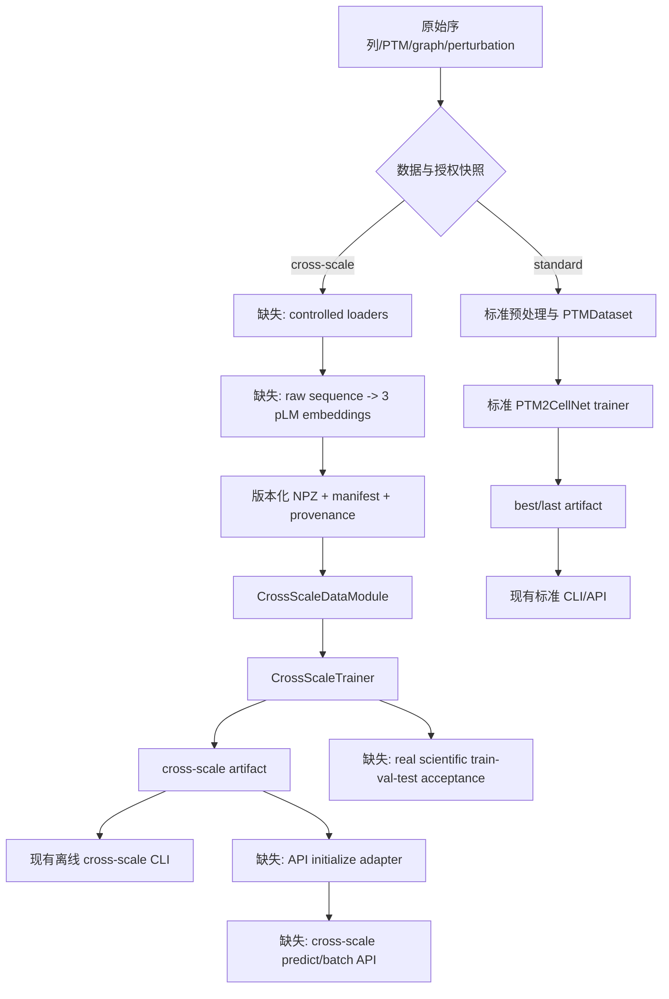

# PTM2CellNet 项目代码与文档综合分析报告

> 审计日期：2026-08-09（Asia/Shanghai）
> 审计基线：`c28f2a670885fb8ae314ec4569e30bfee6657a74`
> 审计分支：`audit/20260809-project-analysis`
> 报告性质：代码、需求/设计文档、测试、数据清单、依赖、构建和版本控制的综合审计

## 目录

1. [摘要](#1-摘要)
2. [任务判断与输入边界](#2-任务判断与输入边界)
3. [审计方法与证据规则](#3-审计方法与证据规则)
4. [版本控制与变更记录](#4-版本控制与变更记录)
5. [需求基线与文档归档审计](#5-需求基线与文档归档审计)
6. [未实现功能、接口与业务流程](#6-未实现功能接口与业务流程)
7. [未完全实现功能与完成度](#7-未完全实现功能与完成度)
8. [技术债分类、证据与解决策略](#8-技术债分类证据与解决策略)
9. [验证、编译与环境结果](#9-验证编译与环境结果)
10. [智能体调用统计](#10-智能体调用统计)
11. [结论与建议](#11-结论与建议)
12. [证据索引](#12-证据索引)

## 1. 摘要

### 1.1 总体结论

当前项目的标准 PTM2CellNet 训练、推理、artifact 和 FastAPI 工程链路可运行；本次实际全量回归为 **1897 passed、13 skipped、28 warnings**，核心覆盖率门禁为 **75.63%**，高于 `74%`。跨尺度链路已经具备模型、版本化 NPZ schema、独立训练/推理 CLI、checkpoint 和 provenance，但仍是合成/离线工程路径，不能宣称真实数据训练、科学验收或标准 API 服务能力。

最重要的未闭环项是：

1. `cross_scale_training` profile 需要的 9 个数据集只有 PMADS 本地文件，另外 8 个受控输入无路径，真实链路按设计 fail-fast；证据见 [`data/manifests/datasets.yaml:22-54`](data/manifests/datasets.yaml#L22-L54) 和本次 manifest 命令结果。
2. API 初始化路由固定构建标准 `PTM2CellNet`，没有跨尺度 model type、artifact adapter、原始序列/NPZ 输入转换和资源限制；证据见 [`src/api/routes/initialize.py:213-264`](src/api/routes/initialize.py#L213-L264) 和最新 E2E 报告 I-06/P0-02。
3. 标准 callback 的 best/wait/top-k 状态没有序列化到 checkpoint；权重、优化器、scheduler、scaler 和 RNG 可以恢复，但 early stopping 历史不连续；证据见 [`src/training/callbacks.py:146-165`](src/training/callbacks.py#L146-L165)、[`src/training/callbacks.py:289-304`](src/training/callbacks.py#L289-L304)。
4. 本次相对 2026-08-08 权威状态新增或重新确认的质量问题包括：Sphinx 严格构建仍有 40 个源码 docstring/第三方导入警告、`pip check` 有两个环境依赖冲突、完整测试 workflow 仅手动触发、覆盖率排除规则过宽、跨尺度 NPZ schema 未承载模型已支持的 `cell_edge_weight`。

### 1.2 归档结论

本次扫描未发现需要从当前活动目录移走的、仍含实质性过时正文的文档或报告。历史正文已经位于 `archive/20260808/` 或 `docs/archive/`；当前若干“历史报告入口”是短重定向页，移动它们会破坏链接，因此保留原路径。已创建 [`archive/20260809/`](archive/20260809/) 作为本次审计批次，保存判定清单和版本来源记录，实际移动文件数为 0。

### 1.3 发布判断

| 能力 | 当前判断 | 可宣称边界 |
|---|---|---|
| 标准训练/推理/API | 工程 smoke ready | 可做 CI 和本地回归；生产多 worker 限流、真实研究结论仍需额外验收 |
| 跨尺度合成训练/离线推理 | 工程 smoke ready | 可验证调用链、schema、checkpoint 和错误处理 |
| 跨尺度真实训练/推理 | blocked | 真实数据 profile 不完整，不能用 synthetic fixture 替代 |
| 跨尺度 API | 未实现 | 无服务适配器、模型类型路由和输入预处理契约 |
| 真实科学验收 | pending | 缺真实快照、指标基线、标签版本和可复现验收包 |

## 2. 任务判断与输入边界

### 2.1 本任务类型

本任务同时属于：

1. 代码与文档系统性审查；
2. 配置、依赖、环境和发布门禁审查；
3. 数据处理/manifest/自动化流程审计；
4. 测试补充与验证结果复核；
5. 需求转接口和缺失业务流程设计；
6. 版本控制、归档和审计记录处理。

本次只实现了审计范围内的低风险文档/构建维护（Sphinx 路径、归档排除、失效链接、模块索引和生成物忽略规则），没有擅自实现需求中尚未确认的跨尺度 API、真实数据 loader 或科学模型功能。

### 2.2 使用的输入

| 输入 | 用途 | 权威性/限制 |
|---|---|---|
| 工作区 `AGENTS.md` 的“实际代码现状映射” | 模块布局和已取消范围 | 工作区文件未被 Git 追踪；代码和第 0 节映射优先 |
| [`docs/CURRENT_STATUS.md`](docs/CURRENT_STATUS.md) | 当前环境、测试、覆盖率和发布边界 | 2026-08-08 更新 |
| [`docs/E2E训练与推理现状分析_2026-08-08.md`](docs/E2E训练与推理现状分析_2026-08-08.md) | 最新需求差距、P0/P1/P2 和实施计划 | 本次主要需求/状态基线 |
| [`docs/r01_r03_systematic_repair_report_20260808.md`](docs/r01_r03_systematic_repair_report_20260808.md) | R-01～R-03 工程契约与剩余科学边界 | 组件级补充证据 |
| [`data/manifests/datasets.yaml`](data/manifests/datasets.yaml) | 数据 profile、路径、哈希和 loader 声明 | 机器可执行输入契约 |
| `src/`、`scripts/`、`tests/`、`.github/workflows/` | 实现、调用链、测试和 CI | 以实际代码和命令结果为准 |
| Git history、remote 和分支状态 | 版本、合并前提和审计追踪 | 本次未执行远程 push |

### 2.3 证据边界与假设

- [假设] 用户所称“最新版需求文档”指当前工作区 `AGENTS.md` 的实际代码现状映射、`CURRENT_STATUS.md` 和 2026-08-08 E2E 现状报告；更早的蓝图只作历史意图，不能覆盖现行代码契约。
- 没有把测试 skip、mock、随机 fallback 或 synthetic fixture 当作真实生物学证据；真实资产指南明确要求显式 opt-in，见 [`docs/guides/real_assets_acceptance.md:5-10`](docs/guides/real_assets_acceptance.md#L5-L10) 和 [`:55-62`](docs/guides/real_assets_acceptance.md#L55-L62)。
- 本报告的“完成度百分比”是基于接口、核心路径、校验/恢复、运营/科学验收四个维度的审计估计，不是 pytest coverage，也不是科学效果指标；所有数值统一保留一位小数。

## 3. 审计方法与证据规则

### 3.1 检查方法

1. 用 CodeGraph 检查符号、调用链和模块结构；索引状态为 335 files、6879 nodes、7833 edges，健康状态正常。
2. 对具体文件使用行号读取，确认需求文字、配置、异常路径和接口参数。
3. 执行全量测试、核心覆盖率门禁、ruff、mypy、compileall、manifest、pLM asset、Sphinx 和 `pip check`。
4. 审查 Git 分支、远程同步关系、历史归档目录和活动入口页；不删除未明确授权的历史内容。

### 3.2 完成度计算口径

每个模块按以下四项给出审计估计：接口契约 25%、主流程 30%、校验/错误/恢复 20%、运营/真实验收 25%。若某模块的真实验收不属于当前产品范围，会在该模块说明，不能把“未纳入范围”误报为代码缺陷；但对于跨尺度需求，真实资产和 API 是明确目标，因此必须计入。

### 3.3 严重程度口径

| 等级 | 判定标准 |
|---|---|
| 严重 Critical | 阻断核心发布、真实科学结论、数据完整性或关键安全边界；没有可接受 workaround |
| 高 High | 核心/生产功能不可用或复现性显著不足；临时 workaround 不能作为正式交付 |
| 中 Medium | 有明确影响的质量、维护、测试、依赖或运维问题；短期可绕过，但会积累风险 |
| 低 Low | 局部文档、警告、清理或优化问题，不阻断当前工程路径 |

## 4. 版本控制与变更记录

### 4.1 合并前基线

本次在开始修改前执行了 `git status --short --branch`、`git fetch --prune origin`、`git branch -avv` 和 `git rev-list --left-right --count origin/main...main`：

| 项目 | 合并前记录 |
|---|---|
| 本地分支 | `main` |
| 本地 HEAD | `c28f2a670885fb8ae314ec4569e30bfee6657a74` — `feat: complete cross-scale E2E pipeline and audit artifacts` |
| 远程基线 | `origin/main` = `771d263`（本地已 fetch；远程未领先） |
| ahead/behind | `origin/main...main = 0 59`，即远程 0 ahead、本地 59 ahead |
| 工作区 | 代码修改前 clean；Sphinx 产生的 `docs/_build/` 后已加入忽略规则 |
| 远程写入 | 未执行 push |

`git fetch --prune origin` 同时清除了已不存在的 `origin/master` 远程追踪引用；因此本地 `main` 是在已同步的 `origin/main` 基础上继续审计。用户要求的“确认远程最新”已执行，未直接把工作区修改堆到 `main`，而是切出 `audit/20260809-project-analysis`。

### 4.2 本次已完成的可提交修改

| 文件/目录 | 修改目的 | 影响 |
|---|---|---|
| `.gitignore` | 忽略 Sphinx 生成目录 `docs/_build/` | 避免文档构建产物污染工作区 |
| `docs/conf.py` | 使用仓库根目录导入 `src.*`、排除历史归档、修正 PyTorch intersphinx URL、取消不存在的 static path | Sphinx API 文档可进入真实源码阶段 |
| `docs/modules.rst`、`docs/index.rst` | 修正失效 module toctree，纳入活动状态/报告入口 | 消除结构性 missing document/toctree 警告 |
| `docs/*.md`、`docs/guides/data_integration.md` | 将历史归档链接改为 GitHub 稳定链接，修正 CSV fence 和仓库链接 | 消除断链/未知 lexer，保留历史可追溯性 |
| `archive/20260809/README.md`、`MANIFEST.md` | 保存本次归档扫描、版本来源和“不移动”的审计依据 | 新增审计批次，不覆盖历史正文 |
| `project_analysis_20260809.md` | 综合分析报告 | 本报告 |

### 4.3 合并后版本记录

审计分支和合并均已完成；以下 hash 来自合并完成后的实际 Git 记录：

| 项目 | 值 |
|---|---|
| 审计分支提交 | `d0c78a1b4b7f27f39d321e79ac52be87369674cc` — `docs: audit project status and archive review` |
| `main` 合并提交 | `3087d633364d8739f5598ecd9d583402400794ff` — `merge: project code and documentation audit` |
| 合并父提交 | `c28f2a670885fb8ae314ec4569e30bfee6657a74` + `d0c78a1b4b7f27f39d321e79ac52be87369674cc` |

## 5. 需求基线与文档归档审计

### 5.1 当前权威文档关系

最新 E2E 报告明确把标准链路和跨尺度链路分开：标准链路由 `scripts/train.py`、`scripts/predict.py` 和 FastAPI 组成；跨尺度链路由 `cross_scale.py`、NPZ dataset、专用 trainer 和两个 CLI 组成，当前不属于标准 API 服务链路，见 [`docs/E2E训练与推理现状分析_2026-08-08.md:9-24`](docs/E2E训练与推理现状分析_2026-08-08.md#L9-L24)。该报告同时明确 I-06“跨尺度 API”未实现，见 [`:43-52`](docs/E2E训练与推理现状分析_2026-08-08.md#L43-L52)，因此本报告不把它误记为回归缺陷。

工作区架构蓝图中已经取消实时质谱流、自定义 PTM 数据库、GUI 和 API key 功能扩展；兼容 shim 可保留，但不能重新列入 roadmap。故本次未把这些兼容入口当作“待开发功能”。

### 5.2 扫描结果与归档判定

本次文件扫描结果：根目录 Markdown 7 个、`docs/` Markdown 109 个、`archive/20260808/` 文件 19 个、`docs/archive/` 文件 168 个。活动报告入口包括 `CURRENT_STATUS.md`、2026-08-08 E2E 报告和 2026-08-04/08-08 历史入口。

| 类别 | 典型路径 | 判定 | 处理 |
|---|---|---|---|
| 当前状态/权威报告 | `docs/CURRENT_STATUS.md`、`docs/E2E训练与推理现状分析_2026-08-08.md` | 内容与当前代码/测试边界一致 | 保留 |
| 当前操作指南 | `docs/guides/real_assets_acceptance.md`、`docs/guides/data_integration.md` | 当前命令和 fail-fast 语义仍适用；发现并修复 Sphinx fence 问题 | 保留并修复 |
| 历史入口短页 | `docs/E2E训练与推理代码修复报告_2026-08-08.md`、`docs/PTM2CellNet_技术文档.md` 等 | 是重定向页，不是过时正文 | 保留，改稳定外链 |
| 已过期正文 | `archive/20260808/reports/*`、`archive/20260808/docs/*` | 已有时间戳、版本和归档清单 | 不重复移动 |
| 更早设计/检测报告 | `docs/archive/**` | 已在既有归档说明中标为历史 | 不重复移动 |

归档操作记录见 [`archive/20260809/MANIFEST.md`](archive/20260809/MANIFEST.md)。本次没有删除或覆盖任何文件；历史文件的版本记录继续通过 `git log --follow -- <path>` 追溯。

### 5.3 本次文档一致性修复

1. 原 `docs/conf.py` 把 `src/` 放进 `sys.path`，但 API rst 使用 `automodule:: src.*`，导致模块导入失败；现改为仓库根目录。
2. 原 `docs/modules.rst` 指向不存在的 `src.data` 等文档；现改成稳定的 `api/index` 入口，并在主 index 中纳入活动文档。
3. 原 Sphinx 会读入 `docs/archive/**`，引发大量历史 cross-reference 警告；现排除历史归档源。
4. 原活动页使用 `../archive/...`，归档目录位于文档源外，Sphinx 把它解释成未知 source document；现改为仓库 GitHub 链接。
5. 原 `docs/index.rst` 的贡献链接指向 `HG-Lab/PTM2CellNet`，而实际 remote 为 `valleyhe/PTM2CellNET`；现已对齐。
6. 原 `data_integration.md` 使用未知 `csv` lexer；示例内容不需要专用 lexer，现改用 `text`。

## 6. 未实现功能、接口与业务流程

### 6.1 未实现项清单

| ID | 需求引用与证据 | 未实现内容/缺失接口 | 优先级 | 影响 |
|---|---|---|---|---|
| U-01 | E2E §4.1 P0-01，[`docs/E2E...:100-106`](docs/E2E训练与推理现状分析_2026-08-08.md#L100-L106)；manifest profile [`:32-54`](data/manifests/datasets.yaml#L32-L54) | 8 个受控 cross-scale 输入没有授权本地 snapshot/path/hash；真实 train→val→test 无法启动 | 高（P0） | 核心功能 |
| U-02 | E2E I-06/P0-02，[`docs/E2E...:108-112`](docs/E2E训练与推理现状分析_2026-08-08.md#L108-L112) | 跨尺度 API model type、artifact adapter、输入转换和资源限制 | 高（P0，若 API 属目标范围） | 核心功能 |
| U-03 | E2E P1-02，[`docs/E2E...:128-132`](docs/E2E训练与推理现状分析_2026-08-08.md#L128-L132) | 原始序列→三路 pLM embedding→NPZ/manifest/provenance 的生产预计算器 | 高（P1） | 核心数据流 |
| U-04 | E2E P0-03，[`docs/E2E...:114-118`](docs/E2E训练与推理现状分析_2026-08-08.md#L114-L118)；真实资产指南 [`:55-62`](docs/guides/real_assets_acceptance.md#L55-L62) | 真实快照、固定指标阈值、标签/graph 版本、baseline 和验收附件组成的科学验收流程 | 高（P0） | 核心发布 |
| U-05 | manifest 数据项如 `scperturb` [`:337-377`](data/manifests/datasets.yaml#L337-L377) 与 `kinase_substrate` [`:496-520`](data/manifests/datasets.yaml#L496-L520) | 受控数据的实际 loader/导入脚本仍为 `null` 或 contract-only | 高（P1/P0 数据前置） | 核心数据依赖 |
| U-06 | E2E P1-01 [`:122-126`](docs/E2E训练与推理现状分析_2026-08-08.md#L122-L126)；callbacks source | 自定义 callback 的 `state_dict()`/`load_state_dict()` 和 checkpoint `callback_states` 接口 | 中（P1） | 训练恢复 |

### 6.2 缺失接口的建议契约（待需求确认）

下表是根据当前代码缺口提出的接口设计，不代表已经实现；实现前需要产品/数据负责人确认名称、鉴权和资源策略。

| 接口 | 输入参数 | 返回值 | 用途 |
|---|---|---|---|
| `POST /api/v1/cross-scale/initialize` | `artifact_path: str`、`device: cpu\|cuda`、`strict_assets: bool`、可选 `max_batch_size: int` | `model_type`、artifact/checkpoint schema、label vocabulary、model info、manifest digest、asset provenance、readiness | 安全加载跨尺度 artifact，登记服务级模型状态 |
| `POST /api/v1/cross-scale/predict` | `sequence` 或已审计 `embedding_ref` 二选一、PTM sites、graph/manifest release、可选 sample id | `delta_expression`、cell-state logits/probabilities、labels、model/data provenance、fallback flags | 单样本跨尺度预测；必须禁止隐式随机 fallback |
| `POST /api/v1/cross-scale/batch_predict` | `samples[]`、`batch_size`、`embedding_ref/sequence`、manifest release、失败策略 | `predictions[]`、`errors[]`、summary、provenance | 批量服务预测和可审计失败报告 |
| `prepare_cross_scale_npz(...)` | sequence records、split、pLM model/revision、graph bundle、cache dir、device、max length、resume、output | train/val/test NPZ、manifest、provenance JSON、failed samples | 使离线 CLI 能从原始研究输入重建训练输入 |
| `Callback.state_dict()/load_state_dict()` | best value、wait、stopped epoch、top-k records、monitor/mode | 可 JSON/torch 保存的状态 mapping | 保证断点续训的 early stopping/best 语义连续 |
| `load_controlled_dataset(dataset_id, release, path, schema)` | manifest dataset id、release、local path、schema version、license metadata | 标准化 graph/expression/target bundle + digest | 将 manifest 的受控条目变成可执行数据入口 |

### 6.3 业务流程与缺失节点



当前已实现的主流程是 `F→H→I→K→M` 的离线工程 smoke；缺失的是 `B→D→E→F` 的真实数据生产闭环、`K→N→O` 的服务闭环和 `I→P` 的科学验收闭环。该判断与 [`scripts/train_cross_scale.py:26-37`](scripts/train_cross_scale.py#L26-L37) 只接受 NPZ、[`scripts/predict_cross_scale.py:24-31`](scripts/predict_cross_scale.py#L24-L31) 只接受 artifact+NPZ 一致。

## 7. 未完全实现功能与完成度

### 7.1 分类标准

- **部分实现但可用**：主调用链、正常输入和最小错误处理可运行，但真实资产、生产集成或边界范围尚未闭合。
- **实现但有缺陷**：功能入口存在且可执行，但测试或源码显示状态丢失、契约不完整、环境冲突或异常在过晚阶段暴露。
- **实现但不符合规范**：实现的输入/输出/文档/运行约束与当前权威需求存在直接差异；不是单纯“尚未实现”。

### 7.2 模块级完成度

| 模块 | 完成度 | 分类 | 关键缺失/依赖 | 证据 |
|---|---:|---|---|---|
| 标准数据加载、清洗和 PTM 数据集 | 90.0% | 部分实现但可用 | 受控 PTMAtlas/ProteomeTools 仍是 controlled；标准本地 PMADS 可验证 | [`data/manifests/datasets.yaml:174-229`](data/manifests/datasets.yaml#L174-L229) |
| 标准训练、resume、artifact | 91.0% | 实现但有缺陷 | callback best/wait/top-k 未进入 checkpoint；旧纯权重不能精确续训 | [`docs/E2E...:37-41`](docs/E2E训练与推理现状分析_2026-08-08.md#L37-L41)、[`src/training/callbacks.py:146-165`](src/training/callbacks.py#L146-L165) |
| 标准推理、FastAPI、安全中间件 | 89.0% | 部分实现但可用 | 仅标准模型；多 worker 共享限流/metrics 仍需外部组件 | [`src/api/routes/initialize.py:213-264`](src/api/routes/initialize.py#L213-L264)、E2E I-04/I-05 |
| 跨尺度模型与 forward/loss | 78.0% | 部分实现但可用 | 真实图、真实 pLM、科学指标未验收；部分 graph approximation 需显式策略 | [`src/models/cross_scale.py:1401-1460`](src/models/cross_scale.py#L1401-L1460) |
| 跨尺度 NPZ dataset/schema | 58.0% | 实现但不符合完整规范 | manifest 8 个输入无路径；dataset 未承载 `cell_edge_weight`，对 edge weight/type 的 fail-fast 校验不完整 | [`src/data/cross_scale_dataset.py:24-38`](src/data/cross_scale_dataset.py#L24-L38)、[`:120-177`](src/data/cross_scale_dataset.py#L120-L177) |
| 跨尺度训练/恢复/产物 CLI | 72.0% | 部分实现但可用 | 只接受预计算 NPZ；无 raw sequence 预计算器和真实 release | [`scripts/train_cross_scale.py:26-37`](scripts/train_cross_scale.py#L26-L37)、[`src/training/cross_scale_trainer.py:148-194`](src/training/cross_scale_trainer.py#L148-L194) |
| 跨尺度离线推理 | 68.0% | 部分实现但可用 | artifact/NPZ 契约可用，但无在线 API 和原始序列入口 | [`scripts/predict_cross_scale.py:24-75`](scripts/predict_cross_scale.py#L24-L75)、[`src/inference/cross_scale_predictor.py:58-116`](src/inference/cross_scale_predictor.py#L58-L116) |
| 真实资产与科学验收 | 20.0% | 未实现 | 真实数据、baseline、阈值、graph/label release 和验收附件缺失 | [`docs/guides/real_assets_acceptance.md:39-62`](docs/guides/real_assets_acceptance.md#L39-L62) |
| 评估指标、排序指标和 CI | 84.0% | 部分实现但可用 | 关键低覆盖模块仍有异常/恢复分支缺口 | [`docs/TEST_COVERAGE.md:39-62`](docs/TEST_COVERAGE.md#L39-L62) |
| 文档入口与 HTML 构建 | 72.0% | 实现但有缺陷 | 结构性问题已修复；源码 docstring/第三方导入仍有 40 个 warning | [`docs/conf.py:16-58`](docs/conf.py#L16-L58)；本次 Sphinx 结果 |
| CI、依赖和可复现环境 | 70.0% | 实现但有缺陷 | full-test 仅 `workflow_dispatch`；lock/pyproject 等文件被忽略；本地 pip 冲突 | [`.github/workflows/full-test.yml:1-5`](.github/workflows/full-test.yml#L1-L5)、[`.gitignore:1-6`](.gitignore#L1-L6) |

### 7.3 文档与实际实现对比

| 文档原文/规范 | 实际实现 | 判定 |
|---|---|---|
| “跨尺度链路目前是离线 CLI 与 NPZ artifact，不属于标准 API 服务链路”——E2E [`:9-12`](docs/E2E训练与推理现状分析_2026-08-08.md#L9-L12) | API 初始化只构建 `PTM2CellNet.from_config`，没有 `CrossScalePTM2CellNet` 路由 | 一致；是明确未实现项，不是误报 |
| “I-06 跨尺度模型由 API 直接提供真实预测：未实现”——E2E [`:47-52`](docs/E2E训练与推理现状分析_2026-08-08.md#L47-L52) | `initialize_endpoint` 输入只有 checkpoint/config/cell_states/device，并在 [`:258-262`](src/api/routes/initialize.py#L258-L262) 固定构造标准模型 | 一致；需求缺口真实存在 |
| `cross_scale_training` 要求 PMADS + 8 个 controlled datasets——manifest [`:32-44`](data/manifests/datasets.yaml#L32-L44) | 8 个条目 `path: null`，部分 `loader: null`，本次命令 exit 2 | 规范定义完整但资产实现不完整 |
| 真实资产指南规定无授权快照时 cross-scale manifest 应失败——[`docs/guides/real_assets_acceptance.md:55-58`](docs/guides/real_assets_acceptance.md#L55-L58) | 本次标准 profile exit 0，cross-scale profile exit 2 | 一致；fail-fast 是预期行为 |
| 文档要求覆盖率提升不得靠排除业务模块/无断言测试——[`docs/TEST_COVERAGE.md:14-17`](docs/TEST_COVERAGE.md#L14-L17) | `.coveragerc` 全局排除 `pass`、`raise NotImplementedError`、`except ImportError`——[`.coveragerc:12-17`](.coveragerc#L12-L17) | 部分不一致；应证明排除项不会掩盖业务分支 |
| 活动文档贡献链接应指向项目仓库 | 原链接是 `HG-Lab/PTM2CellNet`，实际 remote 是 `valleyhe/PTM2CellNET` | 本次已修复，回归风险低 |

## 8. 技术债分类、证据与解决策略

### 8.1 技术债总表

“已知/复核”表示 2026-08-08 权威报告已经记录，本次重新验证；“新增/确认”表示该报告未明确列出或本次发现了更具体的可复现实证。

| ID | 类别 | 等级 | 状态 | 问题与影响 | 证据 |
|---|---|---|---|---|---|
| TD-C01 | 数据/科学验收 | Critical | 已知/复核 | 8 个真实 cross-scale 输入缺失，不能做真实训练和科学发布 | manifest profile、本次 exit 2、E2E P0-01/P0-03 |
| TD-H01 | 架构/API | High | 已知/复核 | 跨尺度模型不在标准 API；若 API 是目标，服务能力完全缺失 | [`src/api/routes/initialize.py:258-262`](src/api/routes/initialize.py#L258-L262) |
| TD-H02 | 数据工程/性能 | High | 已知/复核 | 无 raw sequence→三路 embedding 的生产预计算、缓存、重试和 provenance | [`scripts/train_cross_scale.py:26-37`](scripts/train_cross_scale.py#L26-L37)、E2E P1-02 |
| TD-H03 | 可复现性/依赖 | High | 新增/确认 | `pyproject.toml`、`requirements-lock.txt`、`requirements-docs.txt`、`AGENTS.md` 等工作区文件被 `.gitignore` 的 `/*` 忽略，干净 clone 无法得到同等治理配置；lock 还含 `/tmp` 本地 URI | [`.gitignore:1-6`](.gitignore#L1-L6)、`requirements-lock.txt:24,98`、本次 `git ls-files` |
| TD-M01 | 训练恢复 | Medium | 已知/复核 | callback 状态未保存，resume 后 early stop/best 语义变化 | [`src/training/callbacks.py:146-165`](src/training/callbacks.py#L146-L165)、[`:289-304`](src/training/callbacks.py#L289-L304) |
| TD-M02 | 输入契约 | Medium | 新增/确认 | dataset 静态 key 无 `cell_edge_weight`，但模型 forward 会读取；`signal_edge_type`/edge weight 的 dtype/range 不能全部在 NPZ 构造时 fail-fast | [`src/data/cross_scale_dataset.py:24-38`](src/data/cross_scale_dataset.py#L24-L38)、[`:120-146`](src/data/cross_scale_dataset.py#L120-L146)、[`src/models/cross_scale.py:1411-1425`](src/models/cross_scale.py#L1411-L1425) |
| TD-M03 | 文档构建 | Medium | 新增/确认 | Sphinx 结构问题已修复，但严格构建仍因源码 docstring 和第三方导入有 40 warnings 失败；非严格构建成功 | `sphinx-build -E -b html -W` 与 `sphinx-build -E -b html` 实际结果 |
| TD-M04 | CI/测试 | Medium | 新增/确认 | 完整测试 workflow 只有 `workflow_dispatch`，push/PR 不自动跑 1910 项全套 | [`.github/workflows/full-test.yml:1-5`](.github/workflows/full-test.yml#L1-L5)、[`.github/workflows/ci.yml:1-6`](.github/workflows/ci.yml#L1-L6) |
| TD-M05 | 依赖环境 | Medium | 新增/确认 | 本地 `pip check` 报 `scgpt` 要求 `scvi-tools<1.0` 但当前为 1.4.3；`ssh-unit` 要求 `torchaudio>=2.5` 但当前为 2.4.1+cu118 | 本次 `python -m pip check` |
| TD-M06 | 测试度量 | Medium | 新增/确认 | coverage 排除通用 `pass`/ImportError/NotImplementedError，可能抬高数字并隐藏分支 | [`.coveragerc:12-17`](.coveragerc#L12-L17) |
| TD-M07 | 数据依赖 | Medium | 已知/复核 | manifest 能识别缺失，但 controlled entries 没有仓库内生成/导入闭环和负责人交付流程 | [`data/manifests/datasets.yaml:337-377`](data/manifests/datasets.yaml#L337-L377)、E2E P1-04 |
| TD-M08 | 运维/并发 | Medium | 已知/复核 | rate limit/metrics 是进程内状态；Docker 默认 4 workers 时不具备全局一致性 | E2E P2、`src/api/middleware.py` 与 Dockerfile |
| TD-M09 | 发布环境 | Medium | 已知/复核 | lock `/tmp` URI、本地 `.part/.tmp` 资产、Docker mutable base tag 降低可移植性 | E2E P2、`requirements-lock.txt:24,98` |
| TD-L01 | 文档链接 | Low | 本次已修复 | GitHub 项目链接错误；修复后需防止再次漂移 | `docs/index.rst:40` |
| TD-L02 | 依赖告警 | Low | 已知/复核 | 全量测试 28 warnings，含 Mamba AMP 弃用、Lightning worker、取消功能 deprecated tests | 全量 pytest 输出、E2E P2 |

### 8.2 TD-C01：真实资产与科学验收

**影响范围**：跨尺度训练、真实推理、科学指标、release qualification。当前 `CrossScaleNPZDataset` 只消费已生成 NPZ；没有 8 个输入的合法快照就无法验证数据维度、标签分布和图版本。

| 方案 | 实施步骤与时间 | 优点 | 缺点/风险 | 资源 |
|---|---|---|---|---|
| A. 数据负责人交付授权 snapshot（推荐） | 0.5d 统一 release/license/owner 表；1.0d 登记 8 个路径、schema、SHA-256；0.5d 跑两个 profile、保存验收附件；1.0d 真实 train/val/test smoke | 保留科学目标；机器门禁可复现 | 依赖受控数据许可和外部交付；时间受数据负责人影响 | 生物信息学数据负责人、文件存储、Python manifest 工具 |
| B. 明确 synthetic-only 工程发布边界 | 0.5d 更新 release policy；0.5d 把真实 acceptance 标为 blocked；0.5d 将 CI 只执行 smoke/profile negative test | 立即可发布工程包，风险表述清晰 | 不关闭真实需求；不能支持科学结论 | 技术负责人、文档/发布负责人 |
| C. 为每个来源实现 adapter | 3.0d/来源，首批 3 个来源 9.0d；加 schema、license、hash、fixture、real gate | 自动化程度高，长期维护好 | 受 API/许可/格式变化影响；重复实现成本高 | 数据工程、AnnData/graph/生物信息学技能；nightly 资产 runner |

### 8.3 TD-H01：跨尺度 API 缺失

**影响范围**：服务初始化、在线预测、批量请求、资源隔离和 model provenance。当前标准 API schema 没有 cross-scale 输入，初始化也固定使用 `PTM2CellNet`。

| 方案 | 实施步骤与时间 | 优点 | 缺点/风险 | 资源 |
|---|---|---|---|---|
| A. 在现有 API 增加显式 model type（推荐） | 0.5d 冻结 schema；1.5d 增加 artifact loader/状态；1.5d 单样本/批量 route；1.0d 资源限制/错误映射；1.0d 集成测试和 OpenAPI | 客户端统一；沿用鉴权、metrics、readiness | 模型内存、输入大小和 pLM 设备隔离复杂 | FastAPI/Pydantic、PyTorch、部署工程；约 5.5d |
| B. 正式声明离线-only | 0.5d 产品决策；0.5d 从 API roadmap/README 删除未授权承诺；0.5d 增加 negative contract test | 成本最低，避免错误上线 | 若需求确实要求 API，则仍是未完成 | 产品负责人、文档和测试 |
| C. 独立 cross-scale inference service | 1.5d 定义 gRPC/HTTP contract；3.0d 独立服务；1.5d artifact/health/metrics；2.0d 部署和压测 | 与标准模型隔离，扩缩容独立 | 运维组件和接口重复；跨服务 provenance 更复杂 | 服务/容器/监控工程；约 8.0d |

### 8.4 TD-H02：raw sequence 到 embedding 预计算缺失

| 方案 | 实施步骤与时间 | 优点 | 缺点/风险 | 资源 |
|---|---|---|---|---|
| A. 离线预计算 CLI（推荐） | 1.0d 输入/分片 schema；1.5d 三路 pLM batch 与 device fallback；1.0d cache key/resume/失败清单；1.0d NPZ/manifest/provenance 校验；0.5d 集成回归 | 与现有 NPZ CLI 最匹配，容易审计 | 仍需用户编排大批量任务 | PyTorch/HuggingFace、磁盘/GPU；约 5.0d |
| B. 工作流编排器 | 1.5d DAG；2.0d 分片/重试；1.5d 产物注册；1.5d split isolation；1.0d nightly test | 适合大规模研究数据 | 引入调度系统和运维依赖 | 数据平台、任务调度、对象存储；约 7.5d |
| C. 保持人工 artifact contract | 0.5d 明确输入生产 SOP；0.5d 增加 hash/provenance 校验 | 成本最低 | 无法由仓库重建数据，复现风险保持 | 数据运营人员；约 1.0d |

### 8.5 TD-H03：版本化治理文件未纳入 Git

| 方案 | 实施步骤与时间 | 优点 | 缺点/风险 | 资源 |
|---|---|---|---|---|
| A. 追踪最小治理集合（推荐） | 0.5d 清点并确认 `pyproject.toml`、docs requirements、lock 的归属；0.5d 移除对应 ignore 例外；0.5d 用可移植 URI 重生成 lock；0.5d clean-clone CI 验证 | 直接提升审计和复现性 | 需要确认这些文件是否为环境私有文件；lock 可能包含平台差异 | Python packaging、Git/CI；约 2.0d |
| B. 以容器 digest 为唯一发布物 | 1.0d 固定 base digest；1.0d 多阶段 build；0.5d SBOM/hash；0.5d clean build | 运行时最可控 | 不能替代开发环境 lock；镜像维护成本增加 | Docker/安全供应链；约 3.0d |
| C. 只发布环境 manifest | 0.5d 生成 Python/torch/CUDA/依赖清单；0.5d 加 CI 检查和文档 | 快速、低侵入 | clean clone 仍缺 lint/docs 配置，复现弱 | 发布负责人；约 1.0d |

### 8.6 TD-M01：callback 状态恢复

| 方案 | 实施步骤与时间 | 优点 | 缺点/风险 | 资源 |
|---|---|---|---|---|
| A. 实现 callback state API（推荐） | 0.5d 为 ModelCheckpoint/EarlyStopping 定义 state mapping；0.5d 加入 checkpoint；0.5d resume 顺序修正；0.5d 正常/边界/回归测试 | 改动小，保留现有 Trainer | 需兼容旧 checkpoint 的缺省状态 | PyTorch trainer、测试；约 2.0d |
| B. 迁移到 Lightning callback registry | 1.0d 统一 callback 生命周期；1.0d checkpoint state；1.0d 适配 CLI；1.0d 回归 | 复用成熟生命周期 | 自定义 Trainer 和 Lightning 双路径复杂 | Lightning 专家；约 4.0d |
| C. 明确非精确 resume | 0.5d 文档和 API response 标记；0.5d 增加 warning/negative test | 无代码风险 | 不满足精确续训需求，长期技术债不消失 | 文档/测试；约 1.0d |

### 8.7 TD-M02/TD-M07：跨尺度输入契约与 controlled loader

| 方案 | 实施步骤与时间 | 优点 | 缺点/风险 | 资源 |
|---|---|---|---|---|
| A. 扩展 NPZ v2 schema（推荐） | 0.5d 冻结 `cell_edge_weight`、edge type/range 规则；0.5d 更新 dataset keys/contract；0.5d 生成器和 manifest；0.5d 异常/回归测试 | 与模型实际能力一致，fail-fast 前移 | schema version 迁移和旧 NPZ 兼容需处理 | 数据契约、NumPy/PyTorch；约 2.0d |
| B. 禁止未实现可选字段 | 0.5d 删除/拒绝 `cell_edge_weight` 模型可选路径；0.5d 文档和测试 | 简化 contract，减少隐式差异 | 丢失加权 cell graph 能力 | 模型负责人；约 1.0d |
| C. 独立 graph adapter/loader | 1.0d 定义 controlled bundle；1.0d source adapter；0.5d hash/license；0.5d integration | 数据源和模型解耦 | 接口层增加，首批数据仍需要外部交付 | 图数据工程；约 3.0d |

### 8.8 TD-M03/TD-M04：文档严格构建与 CI 自动化

| 方案 | 实施步骤与时间 | 优点 | 缺点/风险 | 资源 |
|---|---|---|---|---|
| A. 修正文档并加入 docs job（推荐） | 0.5d 修复源码 docstring 的 4 个 error；0.5d 处理 duplicate object 或 `no-index`；0.5d CI 执行 `sphinx-build -W`；0.5d 将 full-test 设为 nightly/PR 可选 | 质量可持续，断链及时发现 | 源码 docstring 需要逐模块维护 | Sphinx/docutils、CI；约 2.0d |
| B. 分离 API docs 与历史/源码页面 | 1.0d 将 API autodoc 单独构建；0.5d 活动 Markdown strict；0.5d 历史只提供外链；0.5d CI 两套门禁 | 历史噪声隔离，定位清晰 | 构建配置和发布物增加 | 文档工程；约 2.0d |
| C. 仅降级 warning | 0.5d 允许 non-strict build 并记录 warning | 最快恢复构建 | 掩盖 docstring/依赖错误，不推荐 | 文档维护；约 0.5d |

### 8.9 TD-M05/TD-M09：依赖冲突与环境可移植性

| 方案 | 实施步骤与时间 | 优点 | 缺点/风险 | 资源 |
|---|---|---|---|---|
| A. 依赖 extras/环境隔离（推荐） | 0.5d 将 scGPT/scVI/torchaudio 分组；0.5d 给每组 constraints；0.5d CI 分环境 `pip check`；0.5d 文档安装矩阵 | 不强行让可选栈互相兼容 | 用户需选择环境；维护矩阵 | Packaging/CI；约 2.0d |
| B. 统一升级/降级版本 | 0.5d 评估 scvi-tools/torchaudio 兼容范围；0.5d 更新 requirements；0.5d 全量回归；0.5d lock 重生成 | 用户体验单环境简单 | 可能破坏 scGPT、CUDA 或模型 ABI | 依赖维护、GPU 环境；约 2.0d |
| C. 容器化并固定 digest | 1.0d 修 Docker base/torch ABI；0.5d 生成 SBOM；0.5d CI build/run smoke | 运行时稳定 | 镜像大、构建慢，开发环境仍需处理 | Docker/供应链；约 2.0d |

### 8.10 TD-M06：覆盖率盲点

| 方案 | 实施步骤与时间 | 优点 | 缺点/风险 | 资源 |
|---|---|---|---|---|
| A. 收紧排除并补契约测试（推荐） | 0.5d 只保留明确 abstract/generated 排除；1.0d 为 `pass`/ImportError 分支补测试；0.5d 对比新旧 coverage | 数字更可信，回归可见 | 短期总 coverage 可能下降 | pytest-cov、模块 owner；约 2.0d |
| B. 分层 coverage 门禁 | 0.5d 建 core/optional/real-assets 指标；1.0d 设模块阈值；0.5d CI 输出 ratchet | 更准确反映关键模块风险 | CI 配置复杂 | 测试治理；约 2.0d |
| C. 保持总门禁但增加 mutation/branch review | 1.0d 对核心模块运行 mutation 或人工 branch checklist；0.5d 每 release review | 不改现有 coverage 门禁 | 无法消除排除规则本身的盲点 | QA/研究工程；约 1.5d |

### 8.11 TD-M08：多 worker 限流与 metrics

| 方案 | 实施步骤与时间 | 优点 | 缺点/风险 | 资源 |
|---|---|---|---|---|
| A. 外置 Redis/网关 limiter（推荐） | 1.0d 定义 key/窗口；1.0d 接入共享存储；0.5d metrics multiprocess；0.5d 4-worker 压测 | 全局语义正确 | 引入外部依赖和故障模式 | Redis/API gateway/Prometheus；约 3.0d |
| B. 默认单 worker，文档限制多 worker | 0.5d 调整 Docker 默认；0.5d readiness/文档；0.5d regression | 低成本，符合当前实现 | 吞吐降低；不是水平扩展方案 | 部署维护；约 1.5d |
| C. 仅保留 defence-in-depth | 0.5d 明确 metrics/limit 非全局；0.5d 生产网关强制限流 | 改动最少 | 依赖部署纪律，误配风险高 | 运维负责人；约 1.0d |

## 9. 验证、编译与环境结果

### 9.1 环境信息

本次实际检查环境：Python `3.12.13`（`/home/scu/anaconda3/envs/SSH_unit/bin/python`）、PyTorch `2.4.1+cu118`、NumPy `2.4.3`、pandas `2.3.3`、scikit-learn `1.8.0`、FastAPI `0.138.1`、Pydantic `2.13.4`。项目 CI 配置目标 Python `3.10`，因此本次结果不能替代 Python 3.10 clean environment 验证。

### 9.2 实际执行命令与结果

| 命令 | 结果 | 备注 |
|---|---|---|
| `python -m pytest -q` | **1897 passed, 13 skipped, 28 warnings**，451.17s | 全量 1910 collected；真实资产 skip 为预期 |
| `python -m pytest tests/unit/ tests/integration/ tests/test_*.py -m "not slow and not gpu" --cov=src --cov-branch --cov-fail-under=74` | **1843 passed, 5 skipped, 21 warnings**，75.63%，288.04s | 核心 CI coverage 门禁通过 |
| `python -m ruff check src scripts tests` | 通过 | `All checks passed!` |
| `python -m mypy src --show-error-codes` | 通过 | 133 source files，0 errors |
| `python -m compileall -q src scripts tests` | 通过 | 代码编译检查通过 |
| `git diff --check` | 通过 | 无 whitespace error |
| `python scripts/validate_data_manifest.py ... --profile standard_training --check-files --verify-hashes` | 通过，exit 0 | `ok=true`，PMADS 文件和 SHA-256 通过 |
| 同命令 `--profile cross_scale_training` | 预期失败，exit 2 | 8 个 required 数据集无 path；不是脚本异常 |
| `python scripts/validate_plm_assets.py --asset-root data/weights/plm --required-backbone ankh39 --required-backbone esm2 --required-backbone prott5` | 通过，exit 0 | Ankh/ESM2/ProtT5 三个目录结构完整 |
| `sphinx-build -E -b html --keep-going docs docs/_build/html` | 通过，40 warnings | HTML 生成完成；warnings 来自源码 docstring/第三方导入 |
| `sphinx-build -E -b html -W --keep-going docs docs/_build/html` | 失败，40 warnings treated as errors | 严格构建技术债，未通过全局 suppress 隐藏 |
| `python -m pip check` | 失败，exit 1 | `scgpt`/`scvi-tools` 与 `ssh-unit`/`torchaudio` 冲突 |

### 9.3 测试覆盖边界

最新报告已经记录关键低覆盖模块：`self_supervised.py` 31.62%、`initialize.py` 47.88%、`data/validation.py` 53.65%、`cross_scale_predictor.py` 51.45%、`plm_assets.py` 66.42%，见 [`docs/E2E训练与推理现状分析_2026-08-08.md:134-138`](docs/E2E训练与推理现状分析_2026-08-08.md#L134-L138)。本次核心 coverage 总值通过门禁，但不能据此推断上述异常/恢复路径已经充分覆盖。

## 10. 智能体调用统计

### 10.1 子智能体统计

本次没有创建或调用并行子智能体；审计由当前主智能体直接使用 CodeGraph、Cognee 和本地 shell 完成。因此平均执行时长对“未调用”项为 N/A，未编造时长数据。

| 智能体名称 | 调用次数 | 主要执行任务 | 平均执行时长 |
|---|---:|---|---|
| 子智能体（未调用） | 0 | 无；未委派任务 | N/A |

### 10.2 工具调用补充（不计入子智能体）

| 工具 | 调用次数 | 任务 | 时长统计 |
|---|---:|---|---|
| CodeGraph MCP | 4 | 1 次索引健康检查、2 次上下文查询、1 次符号源码探索 | 本次未单独计时 |
| Cognee recall | 1 | 读取项目历史记忆，避免重复审计 | 本次未单独计时 |
| 本地 shell/patch | 多次 | 测试、静态检查、文档修复、归档和 Git 操作 | 各命令结果已在本报告记录 |

## 11. 结论与建议

### 11.1 立即行动顺序

1. **先决定产品边界**：确认跨尺度 API 是否仍是目标；若是，按 TD-H01 设计接口并纳入验收；若不是，正式记录 offline-only，避免兼容入口继续被误认为承诺。
2. **由数据负责人交付受控快照**：补齐 8 个 profile 输入，登记 license/release/SHA-256/owner；在资产交付前保持 cross-scale fail-fast。
3. **补 raw sequence 预计算器**：否则 NPZ 能训练只说明人工准备的 fixture 可消费，不能说明研究输入可复现。
4. **修复 callback state 和 NPZ schema**：这是代码侧最小、影响明确的中高优先级闭环。
5. **治理依赖与版本文件**：确认被 `.gitignore` 忽略的 `pyproject.toml`/lock/docs requirements 是否应成为版本化发布输入；分离可选 scGPT/scVI/torchaudio 环境。
6. **把 Sphinx/全量测试纳入自动质量门禁**：先修 40 个 warning，再让 strict docs build 和完整测试进入 nightly 或受控 PR workflow。

### 11.2 不应做的事情

- 不应把 8 个缺失的受控数据集用 synthetic fixture 填入 manifest 后宣称真实验收通过。
- 不应把标准 API 兼容代码误描述为跨尺度 API 已实现。
- 不应以全局 75.63% coverage 掩盖低覆盖核心模块。
- 不应删除既有历史归档或活动重定向页；应保留 Git 历史和稳定外链。
- 不应在未确认工作区文件归属前强制把所有被 `.gitignore` 忽略的环境私有文件加入 Git。

## 12. 证据索引

### 12.1 核心需求/现状文档

- [`docs/CURRENT_STATUS.md`](docs/CURRENT_STATUS.md)：环境、测试、覆盖率和范围裁剪。
- [`docs/E2E训练与推理现状分析_2026-08-08.md`](docs/E2E训练与推理现状分析_2026-08-08.md)：T-01～T-10、I-01～I-06、P0/P1/P2 和计划。
- [`docs/guides/real_assets_acceptance.md`](docs/guides/real_assets_acceptance.md)：真实资产 opt-in 与 profile 负向门禁。
- [`docs/r01_r03_systematic_repair_report_20260808.md`](docs/r01_r03_systematic_repair_report_20260808.md)：R-01～R-07 工程/科学边界。
- [`archive/20260809/MANIFEST.md`](archive/20260809/MANIFEST.md)：本次归档扫描与判定。

### 12.2 核心代码/配置

- [`src/api/routes/initialize.py`](src/api/routes/initialize.py)：标准 API 初始化实现。
- [`src/data/cross_scale_dataset.py`](src/data/cross_scale_dataset.py)：NPZ schema 和校验。
- [`src/models/cross_scale.py`](src/models/cross_scale.py)：跨尺度 forward 和 graph inputs。
- [`src/training/callbacks.py`](src/training/callbacks.py)：checkpoint 与 early-stopping 状态。
- [`src/training/cross_scale_trainer.py`](src/training/cross_scale_trainer.py)：跨尺度 checkpoint/artifact。
- [`data/manifests/datasets.yaml`](data/manifests/datasets.yaml)：profile 和数据条目。
- [`.coveragerc`](.coveragerc)、[`.github/workflows/ci.yml`](.github/workflows/ci.yml)、[`.github/workflows/full-test.yml`](.github/workflows/full-test.yml)：coverage 和 CI 门禁。

### 12.3 可复现命令

```bash
python -m pytest -q
python -m pytest tests/unit/ tests/integration/ tests/test_*.py \
  -m "not slow and not gpu" --cov=src --cov-branch \
  --cov-report=term-missing:skip-covered --cov-report=xml --cov-fail-under=74
python -m ruff check src scripts tests
python -m mypy src --show-error-codes
python -m compileall -q src scripts tests
python scripts/validate_data_manifest.py --manifest data/manifests/datasets.yaml \
  --profile standard_training --check-files --verify-hashes
python scripts/validate_plm_assets.py --asset-root data/weights/plm \
  --required-backbone ankh39 --required-backbone esm2 --required-backbone prott5
sphinx-build -E -b html --keep-going docs docs/_build/html
```

### 12.4 报告置信度

**高**：代码行、manifest、测试/静态命令和 Git 状态均有本次实际证据。
**中**：模块完成度百分比、工期和方案优劣是基于当前证据的工程估计；真实数据许可、产品是否要求跨尺度 API、被忽略文件的归属仍需负责人确认。
