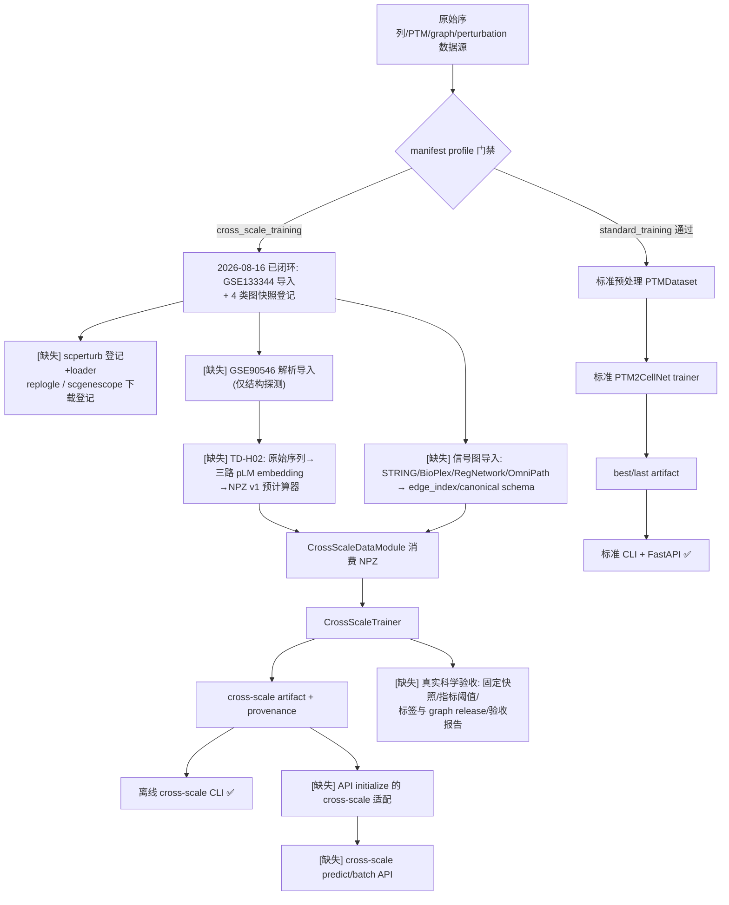

# PTM2CellNet 项目综合分析报告（2026-08-16）

> **审计基线**：`main` = `32ded55`（2026-08-16）｜分析对象：全仓库代码、文档、数据契约与既有报告
> **执行方式**：主智能体负责版本控制与归档操作，4 个只读分析子代理并行执行系统性复核
> **验证状态**：`python -m compileall src scripts` 通过；`pytest tests/unit -q` = **1716 passed / 4 skipped**（79.4s）

---

## 目录

- [1. 摘要](#1-摘要)
- [2. 版本控制操作记录（前置操作 1）](#2-版本控制操作记录前置操作-1)
- [3. 文档与报告归档（前置操作 2）](#3-文档与报告归档前置操作-2)
- [4. 任务 1：未实现功能项识别与记录](#4-任务-1未实现功能项识别与记录)
  - [4.1 未实现功能表](#41-未实现功能表)
  - [4.2 缺失接口表](#42-缺失接口表)
  - [4.3 未实现业务流程图](#43-未实现业务流程图)
  - [4.4 数据契约缺口](#44-数据契约缺口)
- [5. 任务 2：未完全实现功能梳理](#5-任务-2未完全实现功能梳理)
  - [5.1 模块完成度总表](#51-模块完成度总表)
  - [5.2 规范差异对照](#52-规范差异对照)
  - [5.3 三类分类判断标准](#53-三类分类判断标准)
  - [5.4 TODO/FIXME/skip 清单](#54-todofixmeskip-清单)
- [6. 任务 3：技术债识别、分类与解决策略](#6-任务-3技术债识别分类与解决策略)
  - [6.1 严重程度分级标准](#61-严重程度分级标准)
  - [6.2 新增技术债清单](#62-新增技术债清单)
  - [6.3 已知技术债复核](#63-已知技术债复核)
  - [6.4 解决策略（严重/高/中）](#64-解决策略严重高中)
  - [6.5 量化数据附录](#65-量化数据附录)
- [7. 结论与建议](#7-结论与建议)
- [8. 任务执行统计（子智能体）](#8-任务执行统计子智能体)
- [9. 审计痕迹与验证命令](#9-审计痕迹与验证命令)

---

## 1. 摘要

本轮综合处理在 2026-08-16 完成，四项核心产出：

1. **版本控制**：确认本地 `main` 与 `origin/main` 一致（`c76fff8`）后，将工作区中
   Norman/Adamson 数据导入管线（`scripts/import_norman_adamson.py`，582 行 + 18 个
   单测）与 `data/manifests/datasets.yaml` 登记更新直接提交到 `main`（`32ded55`，
   971 插入/48 删除），无合并冲突；`compileall` 与全量单测（1716/4）均通过。
2. **文档归档**：判定 5 个文件过时/被取代，移入 `archive/20260816/`（reports/ 2 +
   docs/ 3），原路径留重定向短页，配套 `MANIFEST.md`/`README.md` 记录判定证据与
   版本标签；`docs/CURRENT_STATUS.md` 同步刷新。
3. **系统性复核**（4 个子代理并行）：
   - **任务 1**：识别 **14 项**未实现功能（高 7 / 中 4 / 低 3）、**7 个**缺失接口、
     **5 类**业务流程缺失环节、**8 个**数据契约缺口条目。`.planning/REQUIREMENTS.md`
     v2.1/v2.2 已登记项全部 Complete，真实缺口集中在"真实数据生产闭环"（TD-H02
     embedding 预计算器、信号图原始格式导入、GSE90546 解析、scperturb/replogle/
     scgenescope 接入）与"服务/验收闭环"（跨尺度 API、真实科学验收）。
   - **任务 2**：16 个功能模块完成度评估，**整体加权约 83.1%**（工程契约层 ~95%，
     真实数据/资产层 ~40–50%）；发现 3 处"实现但不符合规范"（kinase_substrate
     loader 断链、PSIPRED 命名与实现不符、GSE90546 报告 `status: parsed` 语义过强）。
   - **任务 3**：**20 项新增技术债**（高 2 / 中 13 / 低 5）+ 9 项已知债复核（1 项已
     修复、1 项收敛过半）。最高风险新增债：**N01**（API 全部 async 端点在事件循环
     内联阻塞式 torch 推理，无任何线程卸载，服务并发被封顶）与 **N02**（setup.py 与
     requirements-\*.txt 双依赖声明源漂移且互相矛盾）。清理全部高/中债约需 **20 个
     工作日**。
4. **无新增"严重"级代码债**：严重级风险仍只来自已知的业务数据缺失（TD-C01），
   本轮 `32ded55` 已将其从 8 项压缩到 3 项。

---

## 2. 版本控制操作记录（前置操作 1）

### 2.1 合并前后版本号与关键修改点

| 项目 | 值 |
|---|---|
| 合并前 `main`（= `origin/main`，`git fetch` + `git rev-parse` 双重确认） | `c76fff881f268f9bd0b39d68db8ba547115ec4cf` |
| 本轮提交（直接落 `main`，当前已在主分支且与远程一致，无需 merge） | `32ded55` |
| 变更内容 | `scripts/import_norman_adamson.py`（新增，582 行）；`tests/unit/scripts/test_import_norman_adamson.py`（新增，300 行，18 测试）；`data/manifests/datasets.yaml`（+97/-48：norman_adamson controlled→implemented 含 4 文件 sha256 登记与 preprocessing entrypoint v1.0.0；kinase_substrate 切换 OmniPath enzsub 快照 41,506 条 public_download） |
| 冲突情况 | 无（工作区仅上述 3 处修改，直接提交） |
| 提交信息 | `feat(data): register Norman/Adamson import pipeline and OmniPath kinase-substrate snapshot` |

### 2.2 编译与测试验证

| 验证项 | 命令 | 结果 |
|---|---|---|
| 新增单测 | `python -m pytest tests/unit/scripts/test_import_norman_adamson.py -q` | **18 passed**（0.08s） |
| 编译检查 | `python -m compileall -q src scripts` | **通过**（无输出错误） |
| 全量单测 | `python -m pytest tests/unit -q` | **1716 passed, 4 skipped**（79.42s；4 skip 均为环境守卫，见 §5.4） |

未推送到远程：本任务要求"合并到本地主分支"，推送与否留待数据负责人决策
（上一次推送记录见 `archive/20260809/MANIFEST.md`）。

---

## 3. 文档与报告归档（前置操作 2）

### 3.1 判定标准

沿用 `archive/20260809/MANIFEST.md` 规则并按本次任务要求执行：

- **过时文档**：内容与当前代码实现或需求规范存在实质性差异；
- **过期报告**：生成超过 30 天，或内容已无法反映当前项目状态；
- 活动入口页/纯重定向短页保留原路径（避免破坏链接）；归档保留 Git 历史
  （`git mv`，可 `git log --follow` 追溯）。

### 3.2 归档清单（5 个文件 → `archive/20260816/`）

| 归档路径 | 原最后修改提交（版本标签） | 核心判定证据 |
|---|---|---|
| `reports/project_analysis_20260809.md` | `c76fff8`（2026-08-09） | L34"9 个数据集只有 PMADS 本地文件"→ 现 6 个可用；L28"1920 passed/13 skipped"→ 现 1716/4 |
| `reports/project_repair_report_20260809.md` | 未追踪（mtime 2026-08-09，归档后首次入库） | L20"1918 passed/13 skipped"；L236 TD-C01"8 个真实输入无授权快照"→ 今日 5 项已登记 |
| `docs/E2E训练与推理现状分析_2026-08-08.md` | `366e691`（2026-08-09） | L38 T-01"缺少 8 个 required 输入"→ 现 3 项；L64"1897 passed"过时 |
| `docs/E2E训练与推理代码修复报告_2026-08-08_v2.md` | `d0c78a1`（2026-08-09） | L161 将 Norman/Adamson、kinase-substrate、STRING、BioPlex、RegNetwork 列为"数据所有者职责"→ `32ded55` 已登记 5 项 implemented |
| `docs/r01_r03_systematic_repair_report_20260808.md` | `366e691`（2026-08-09） | L25 R-03"真实 STRING/BioPlex/激酶-底物图未提供"→ 三类图快照已登记 |

判定根本原因：`32ded55` 将 norman_adamson、kinase_substrate、string、bioplex、
regnetwork 五个数据集从 `controlled` 翻转为 `implemented`，使 8-8/8-9 报告的中心
结论失效。

### 3.3 配套处理

- 3 个 docs 原路径留**重定向短页**（指向归档位置与 `project_analysis_20260816.md`）；
- `docs/CURRENT_STATUS.md` 刷新：权威指向 20260816 报告、测试基线 1716/4、数据集
  差距更新为 3 项 controlled；
- 保留清单 30 项（8 个入口短页、6 个指南、通用规范等）完整台账见
  `archive/20260816/MANIFEST.md` 第 4 节；
- 待跟进（登记未执行）：`docs/TEST_COVERAGE.md` 基线刷新、`CHANGELOG.md` 补 8 月
  条目、`docs/guides/quickstart.md:65` 的 `/predict` 示例补 `/api/v1` 前缀、
  `AGENTS.md:912` 数据源表更新、`docs/_build/` 重建。

---

## 4. 任务 1：未实现功能项识别与记录

> 执行者：Agent-1（Explore，只读）。需求基线：`.planning/REQUIREMENTS.md`（v2.1
> 13 项 + v2.2 11 项**全部标记 Complete**，phase 18-20 VERIFICATION status: passed）、
> `.planning/ROADMAP.md`、`.planning/PROJECT.md:64-78` Active 段、
> `docs/E2E训练与推理现状分析_2026-08-08.md`（已归档，T-10/I-06/P0-P2 差距清单）、
> `data/manifests/datasets.yaml`。
> **范围排除**：实时质谱流、自定义 PTM 数据库、GUI、API key 扩展已于 2026-07-05
> 取消（`REQUIREMENTS.md:86-93`、`ROADMAP.md:45-50`），不计入缺口。

### 4.1 未实现功能表

| # | 需求出处 | 功能描述 | 优先级 | 影响范围 | 证据 |
|---|---|---|---|---|---|
| F-01 | E2E 报告 I-06/P0-02；project_analysis U-02/TD-H01；`STATE.md:94` | 跨尺度模型 API 服务链路（model_type 路由、CrossScale artifact 适配器、NPZ/序列输入转换、专用资源限制） | 高 | 核心 | `grep -rn "cross_scale\|CrossScale" src/api/` 0 命中；`src/api/routes/initialize.py:262` 固定 `PTM2CellNet.from_config(...)` |
| F-02 | E2E P1-02；TD-H02/U-03；`scripts/import_norman_adamson.py:19-27` 点名为输入契约 | 原始序列→三路 pLM embedding→NPZ v1 生产预计算器（batch 推理、分片/缓存/断点续跑、失败清单、provenance） | 高 | 核心数据流 | `grep prepare_cross_scale_npz\|embedding_precompute src/ scripts/` 0 命中；`sequence_requests.json` 已生成但无消费者 |
| F-03 | `datasets.yaml:523-692`（4 图条目 entrypoint 均 `local_graph_import_contract_only`）；`import_norman_adamson.py:27,429-432` | 信号图导入：STRING v12.0 gz / BioPlex / RegNetwork / OmniPath enzsub → canonical edge table / edge_index+node_map（UniProt→gene 映射、score 过滤） | 高 | 核心数据流 | `src/analysis/pathway_integration.py:426-437` 只接受已预处理的 `string_edges.tsv`；bioplex/regnetwork `loader: null` |
| F-04 | E2E P0-03；U-04/TD-C01；`STATE.md:94` | 真实科学验收流程（固定快照、release 版本、指标阈值、置信区间、外部对照、不可变验收报告） | 高 | 核心发布 | 8 项真实资产测试按 `PTM2CELLNET_RUN_REAL_ASSET_TESTS` 门禁 skip（`docs/CURRENT_STATUS.md:36-39`） |
| F-05 | `datasets.yaml:337-377`（scperturb loader null） | scperturb 集成：28 个 h5ad（~21GB）已于 2026-08-10 下载到 `data/raw/scperturb/`，manifest 未登记 path/sha256，无 h5ad loader | 高 | 核心数据依赖 | 实测 `ls data/raw/scperturb/` 28 h5ad；manifest validator 报 `datasets[7].files[0] required but no path` |
| F-06 | `datasets.yaml:445-484`（replogle controlled） | Replogle Perturb-seq 接入（cross_scale_training 必需） | 高 | 核心数据依赖 | `data/raw/` 无 replogle 目录；validator 报 `datasets[9]` 缺 path |
| F-07 | `datasets.yaml:485-522`（scgenescope controlled） | scGeneScope 参考细胞状态表示接入（training+inference 双 profile 必需） | 高 | 核心数据依赖 | validator 实测 cross_scale_inference 唯一缺失项 `datasets[10]` |
| F-08 | `datasets.yaml:381-382`"待解析导入"；`import_norman_adamson.py:520-527` | GSE90546（Adamson 2016）解析导入：现仅 `probe_gse90546` 结构探测，无表达矩阵产物 | 中 | 次要 | `data/processed/norman_adamson/` 仅有 `GSE90546_structure_report.json` |
| F-09 | E2E P2；TD-M08 | 多 worker 共享限流/指标（现进程内状态，Docker 4-worker 无全局一致性） | 中 | 次要（部署） | `src/api/middleware.py:257` 内存桶；Dockerfile:87 `--workers 4` |
| F-10 | TD-M05/TD-M09；`CURRENT_STATUS.md:19` | 依赖冲突治理（scgpt↔scvi-tools；lock 含 /tmp URI） | 中 | 次要 | `requirements-analysis.txt:24-29` 文档化取舍【文档证据，未复跑 pip check】 |
| F-11 | E2E P2 | .part/.tmp pLM 资产清理与下载恢复 | 低 | 边缘 | `find data/weights -name "*.part"` 实测仍存在（esm2_t33_650M 等） |
| F-12 | `PROJECT.md:76` | 通路知识库"上下文相关"映射（现为静态字典） | 低 | 边缘 | `scripts/tools/pathway_knowledge_base.py` 静态表；`grep context pathway_integration.py` 0 命中【待确认：需求措辞模糊】 |
| F-13 | `PROJECT.md:78` | 更多 PTM 类型支持（默认 5 类；succinylation 训练 CSV 已存在） | 低 | 边缘 | `src/data/features.py:29-36` DEFAULT_PTM_TYPES 5 类【待确认】 |
| F-14 | project_analysis §9.3；`CURRENT_STATUS.md:23` | 低覆盖模块异常/恢复分支补测（self_supervised 31.6%、initialize 47.9% 等） | 中 | 次要（质量） | coverage.json（2026-08-09）【待复测】 |

**已实现但文档滞后**（不计缺口）：`PROJECT.md:74-75` 的 DAVF 端到端微调
（`scripts/finetune_davf_e2e.py` 已存在）、scVI decode 集成（`src/models/scvi_adapter.py`
`encode/decode`）勾选状态未更新。

**统计**：14 项（高 7 / 中 4 / 低 3）。

### 4.2 缺失接口表

| 接口名 | 预期参数 | 返回值 | 用途 | 需求出处 |
|---|---|---|---|---|
| `POST /api/v1/cross-scale/initialize` | `artifact_path: str`、`device: cpu\|cuda`、`strict_assets: bool`、可选 `max_batch_size: int` | `model_type`、checkpoint schema、label vocabulary、manifest digest、readiness | 安全加载跨尺度 artifact 并登记服务级模型状态 | E2E I-06/P0-02 |
| `POST /api/v1/cross-scale/predict` | `sequence` 或 `embedding_ref`（二选一）、PTM sites、graph/manifest release、可选 sample id | `delta_expression`、cell-state logits/概率、labels、provenance、fallback flags | 单样本跨尺度在线预测（禁止隐式随机 fallback） | 同上 |
| `POST /api/v1/cross-scale/batch_predict` | `samples[]`、`batch_size`、失败策略 | `predictions[]`、`errors[]`、summary、provenance | 批量服务预测与可审计失败报告 | 同上 |
| `prepare_cross_scale_npz(...)`（TD-H02 CLI/函数） | sequence records、split、pLM model/revision、graph bundle、cache dir、device、max length、resume、output | train/val/test NPZ（schema `ptm2cellnet.cross-scale.npz.v1`）、manifest、failed samples 清单 | 从原始研究输入重建跨尺度训练输入；消费 `sequence_requests.json` | E2E P1-02；`import_norman_adamson.py:19-27` |
| `import_signaling_graphs(source, path, score_threshold, release)` | string/bioplex/regnetwork/omnipath 原始文件路径、score 阈值、release | canonical edge table / edge_index+node_map + digest | 4 类已下载图数据 → 模型可消费结构 | `datasets.yaml:523-692` |
| `load_controlled_dataset(dataset_id, release, path, schema)` | manifest dataset id、release、local path、schema version | 标准化 bundle + digest | scperturb/replogle/scgenescope 受控条目变为可执行入口 | project_analysis §6.2（20260809，已归档） |
| `import_gse90546(...)` 完整版 | RAW.tar 路径、输出目录 | expression/delta_expression NPZ + perturbations TSV | Adamson 2016 解析（现仅探测） | `datasets.yaml:381-382` |

### 4.3 未实现业务流程图



缺失环节 5 类：受控数据生产（E）、GSE90546（F）、TD-H02 预计算（G）、图导入（H）、
服务+科学验收闭环（P/Q/R）。

### 4.4 数据契约缺口

实测命令：`python scripts/validate_data_manifest.py --profile cross_scale_training
--check-files --verify-hashes` → `ok=false`（`datasets[7]/[9]/[10]` 缺 path）。

| 条目 | 行号 | status | 性质 |
|---|---|---|---|
| ptmatlas | L210-247 | controlled | 纯登记项，不在 profile 必需清单 |
| proteometools_prospect | L248-287 | controlled | 同上 |
| scperturb | L337-377 | controlled | **已下载未登记**（28 h5ad 在位）+ loader null |
| replogle | L445-484 | controlled | 无文件、loader null（training 必需） |
| scgenescope | L485-522 | controlled | 无文件、loader null（双 profile 必需） |
| kinase_substrate | L523-563 | implemented（含瑕疵） | loader 指向的脚本不处理图（见 §5.2） |
| string | L564-606 | implemented（含瑕疵） | 仅接受预处理后 `string_edges.tsv` |
| bioplex / regnetwork | L607-692 | implemented（含瑕疵） | loader null、entrypoint contract-only |

反向缺口【待确认】：`data/raw/epsd/`（EPSD 磷酸化注释 + fasta）有数据但 manifest
无条目。pmads 为合法 `local` 状态，非缺口。

---

## 5. 任务 2：未完全实现功能梳理

> 执行者：Agent-2（Explore，只读）。完成度口径 = 模块需求点覆盖数/总需求点数；
> 需求点取自 `.planning/REQUIREMENTS.md`、`PROJECT.md` Validated/Active、
> `datasets.yaml` 契约与 E2E P0-P2 清单。仅评估工程实现层。

### 5.1 模块完成度总表

| 模块 | 完成度 | 口径（覆盖/总数） | 主要缺失组件 | 分类 |
|---|---|---|---|---|
| 数据加载与导入（含 norman_adamson） | **58.3%** | 7/12 | GSE90546 解析；OmniPath/STRING/BioPlex/RegNetwork 图导入器；epsd 未登记 | 部分实现但可用 |
| 数据预处理/特征工程 | **88.9%** | 8/9 | `data/validation.py` 异常分支测试（覆盖 53.65%） | 部分实现但可用 |
| DAVF 集成与增强 | **90.0%** | 9/10 | 真实 checkpoint E2E（env-guard skip） | 部分实现但可用 |
| 序列编码器（CNN/Transformer/Mamba/pLM） | **90.9%** | 10/11 | TD-H02 embedding 预计算链路 | 部分实现但可用 |
| PTM 模块 | **87.5%** | 7/8 | sspa（rpy2）未装，运行时回退内置 8 通路（`src/models/signaling_network.py:279-287`） | 部分实现但可用 |
| 预测器（分类/回归/多任务/Delta） | **100.0%** | 9/9 | 无（工程层） | 已完整实现 |
| 训练管线（Lightning/自监督/PEFT） | **90.0%** | 9/10 | 真实多 GPU DDP 验收（Out of Scope 内）；`self_supervised.py` 覆盖 31.62% | 部分实现但可用 |
| 评估（cross_validate/排序/CI） | **87.5%** | 7/8 | 真实数据指标阈值验收包（P0-03） | 部分实现但可用 |
| 解释器 | **100.0%** | 4/4 | 无（全部合成数据验证） | 已完整实现 |
| API 服务 | **75.0%** | 6/8 | 跨尺度路由（I-06）；多进程共享限流（P2） | 部分实现但可用 |
| 变体效应分析 | **100.0%** | 7/7 | 无 | 已完整实现 |
| 通路/信号网络整合 | **60.0%** | 6/10 | 4 个图数据库原始格式导入器 | 部分实现但可用 |
| GenKI 扰动模拟 | **87.5%** | 7/8 | GenKI 外部包未装（`src/integration/genki/perturbation.py:673` 延迟导入）【待确认】 | 部分实现但可用 |
| PTM 虚拟扰动 | **100.0%** | 6/6 | 无 | 已完整实现 |
| 外部工具集成 | **75.0%** | 4.5/6 | 真 PSIPRED 接入；真实服务验收 | **实现但不符合规范**（PSIPRED 实为内置 Chou-Fasman，`src/models/external_tools/psipred.py:1,14-22`） |
| 部署（Docker） | **83.3%** | 5/6 | lock 含 /tmp URI、mutable base（P2） | 部分实现但可用 |

**整体加权完成度 ≈ 83.1%**（权重：数据导入 15%、训练 12%、DAVF 10%，其余按
核心度 2–8%）。分层结论：

- **工程契约层（合成/离线闭环）：约 95%**——REQUIREMENTS v2.1+v2.2 共 24 项全部
  Complete（`REQUIREMENTS.md:55-69,108-130`），1716 测试通过，mypy 0 errors；
- **真实数据/资产层：约 40–50%**——GSE133344 已闭环（1/2），但 §4.1 的 F-02/03/05/06/07
  均未落地，`cross_scale_training` profile 仍 fail-fast。

### 5.2 规范差异对照

| 需求原文（出处） | 实际实现（file:line） | 差异说明 |
|---|---|---|
| `datasets.yaml:537`：kinase_substrate `loader: scripts/import_norman_adamson.py`；`:526-527`"列为 UniProt ID，导入时映射为基因符号" | 该脚本 582 行仅含 GSE133344/GSE90546 逻辑，`grep omnipath` 于 src/scripts 零命中 | **loader 断链**：声明的导入器不含 OmniPath 解析与 UniProt→基因映射，41,506 条边数据（`data/raw/kinase_substrate/omnipath_enzsub.tsv`）无代码消费 |
| `datasets.yaml:381-382`：GSE90546"待解析导入" | `import_norman_adamson.py:520-525` 仅结构探测；产物 `GSE90546_structure_report.json` 中 `status: "parsed"` | **语义过强**：仅 head_preview 探测非解析；manifest preprocessing.outputs（`:439-444`）与脚本一致地未承诺 GSE90546 产物（欠收一致） |
| ROADMAP Phase 18 成功标准 1（`ROADMAP.md:118`）"datasets.yaml lists all required sources" | `data/raw/epsd/` 存在但 manifest 无条目；scperturb 28 h5ad 已下载仍 `controlled, loader: null`（`datasets.yaml:340-352`） | **目录与 manifest 不同步**（DATA-01 契约，`REQUIREMENTS.md:37`） |
| MODEL-02（`REQUIREMENTS.md:46`）"CIGNNSignalBridge consumes explicit typed PPI/kinase-substrate graph…missing edges fail loudly" | `src/models/cross_scale.py:861-1049` 契约达成，但图数据无导入来源，实际消费合成 fixture 图 | 模型契约达成、**数据供给链缺失**（P0-01） |
| REQUIREMENTS v2.2 Out of Scope（`:77`）"TD-01 is opt-in until real assets" | API 无跨尺度路由（5 个路由文件均标准模型）；`src/inference/cross_scale_predictor.py:1-205` 仅离线 | 文档口径一致（设计决定）；若以"跨尺度 API 服务"为需求则 I-06 记为未实现 |
| `PROJECT.md:74-76` Active 三项 `[ ]` | `scripts/finetune_davf_e2e.py`、`src/models/scvi_adapter.py`、`src/models/ptm_direction_mapper.py:152,520` 均有实现 | **文档状态滞后**（勾选未更新） |

### 5.3 三类分类判断标准

1. **部分实现但可用**：核心调用路径（CLI/Python API）可离线运行且有测试覆盖，缺
   的是长尾输入源、真实数据导入器或真实资产验收；缺不阻断合成/本地闭环。适用
   12 个模块（见 §5.1）。
2. **实现但有缺陷**：存在已知 bug、被跳过的测试或依赖缺失导致特定分支不可达。
   判断依据：源码 TODO/FIXME 仅 4 处且均为正常模式（见 §5.4）；4 个 skip 均环境
   守卫。**当前无纯此类模块**；最接近的是 `self_supervised.py`（31.62%）与
   `data/validation.py`（53.65%）低覆盖的缺陷路径。
3. **实现但不符合规范**：与文档契约/命名字面冲突。判断依据：manifest/loader 断链、
   命名与实现不符、语义过强。实例 3 处：kinase_substrate loader 断链（§5.2 第 1
   行）、`psipred.py` 实为 Chou-Fasman（§5.1 外部工具行）、GSE90546
   `status: "parsed"`（§5.2 第 2 行）。

### 5.4 TODO/FIXME/skip 清单

**源码 TODO/FIXME/NotImplementedError**（`grep -rn "TODO\|FIXME\|XXX\|NotImplemented"
src/ scripts/`）：仅 4 处命中且均为正常模式——`src/models/encoders.py:19`（抽象基类
契约）、`src/models/external_tools/base.py:206`（比较协议）、
`src/models/signaling_network.py:286`（docstring 声明不抛出）、
`scripts/tools/pathway_knowledge_base.py:327`（正则 `'[ST]XXX[ST]P'` 误报）。
**实际未完成标记数为 0。**

**4 个 skipped 测试**（均为环境守卫，非功能缺陷）：

| 测试 | 位置 | 原因 |
|---|---|---|
| test_scvi_adapter ×2 | `tests/unit/test_scvi_adapter.py:109,114` | 反向守卫：`skipif(SCVI_AVAILABLE)`（本机已装 scvi，验证无 scvi 分支需卸载环境） |
| test_training_inference_consistency | `tests/unit/test_training_inference_consistency.py:266` | `ONNX libraries not available` |
| 同文件另一 skip | `tests/unit/test_training_inference_consistency.py:129` | Full model pickle 不支持当前 pooling【高置信推断，待确认】 |

另有 9 个 opt-in 真实资产 skip（`tests/real_assets/` 5 文件，
`pytestmark = skipif(not real_assets_enabled())`），不在 1716/4 口径内。

**测试规模变化**【待确认】：8-9 基线 1920/13（project_analysis_20260809.md:28）→
本轮 1716/4，缩减约 150 项（裁剪或统计口径差异，涉及 tests/unit 与全量 pytest 的
范围区别）。

### 5.5 norman_adamson 管线专项核查

1. **GSE133344 完整（确认）**：5 个产物全部落盘（expression.npz 716MB 等），摘要
   111,668 cells × 33,694 genes、131 perturbations（import_manifest.json 实测）；
2. **GSE90546 解析缺失（确认）**：仅结构报告（12 个 per-GSM 10x 成员已探明，
   987MB RAW.tar 在位），解析路径清晰；
3. **下游断链（新发现）**：`sequence_requests.json` 的唯一消费者 TD-H02 预计算器
   不存在（grep 零命中）；CrossScaleNPZDataset v1 组装步骤无代码承载；
4. **OmniPath loader 断链（新发现）**：见 §5.2 第 1 行。

---

## 6. 任务 3：技术债识别、分类与解决策略

> 执行者：Agent-3（Explore，只读）。方法：awk 长函数统计、grep 抑制标记、
> coverage.json 解析（总体 75.63%，2026-08-09）、AST docstring 统计、行级相似度
> 比对、依赖清单比对、git 热点分析。已先浏览既有报告（project_analysis_20260809、
> project_repair_report_20260809、r01_r03、E2E 现状分析）避免重复。
> 分类参照 SonarQube 维度（可靠性/安全性/可维护性/覆盖/重复/复杂度）组织。

### 6.1 严重程度分级标准

| 级别 | 可操作定义 |
|---|---|
| 严重 | 阻塞核心功能（训练/推理/API 主链路不可用或产生错误结果），或存在可直接利用的安全漏洞 |
| 高 | 核心功能的质量或性能实质受损：并发/吞吐显著下降、环境不可复现、依赖矩阵互相矛盾、核心路径零测试 |
| 中 | 可维护性显著下降：重复实现、超长函数、低覆盖（<50%）、文档缺失导致上手成本明显上升 |
| 低 | 轻微：工作区卫生、命名/注释瑕疵、被 gitignore 掩盖的噪音 |

### 6.2 新增技术债清单

| # | 维度 | 级别 | 问题 | 位置 | 证据 |
|---|---|---|---|---|---|
| N01 | 性能 | **高** | API 全部 async 端点在事件循环内联阻塞式 torch 推理与 checkpoint 加载，无任何 to_thread/run_in_executor 卸载；uvicorn `--workers 4` 下每 worker 串行处理请求，健康检查同循环被阻塞 | `src/api/routes/predictions.py:444,471,516,598`；`initialize.py:214` | 4 个 API 文件 `grep "to_thread\|run_in_executor\|asyncio"` 计数全 0；Dockerfile:87 |
| N02 | 依赖管理 | **高** | 双依赖声明源漂移：setup.py `install_requires` 默认装 transformers+lightning，违背 requirements-core"最小核心"设计（P1-2）；extras 与 requirements 6+ 处版本不一致（pydantic/causal-conv1d/sspa/anndata/scvi-tools/fastapi） | `setup.py:15-58,72-86` vs `requirements-*.txt` | pip 装包与 requirements 装环境产出不同环境 |
| N03 | 测试覆盖 | 中(偏高) | 4 个 CLI 脚本 0 测试：ensemble_predict(383 行)、prepare_ptm_data(422)、prepare_data(66)、data_statistics(149) | `scripts/` 对应文件 | `grep -rl <脚本名> tests/` 各 0（对照 predict.py=52） |
| N04 | 架构 | 中 | scripts/ 层次违规：ensemble_predict 自行实现 ModelEnsemble（voting/averaging/stacking）未复用 `src/models/ensemble.py`；prepare_ptm_data 自带完整 Preparer 绕过 src/data 抽象 | `scripts/ensemble_predict.py:25-230` vs `src/models/ensemble.py:18`；`prepare_ptm_data.py:24-389` | 行级相似度比对未共享 |
| N05 | 代码质量 | 中 | 序列窗口提取逻辑 ≥4 处分散实现且语义不一致，一处硬编码 31-mer 魔法数（训练/推理窗口不一致会产生静默特征偏移） | `prepare_ptm_data.py:181`；`predict_ptm_sites.py:194-202,285`；`src/models/long_sequence.py:52-76` | `-16/+15` 硬编码 vs 参数化并存 |
| N06 | 测试覆盖 | 中 | 4 个 <50% 模块为 TEST_COVERAGE.md 未点名盲区：uniprot_loader 44.0%、genki/perturbation 44.6%、homology_splitter/matrix 45.6%、ptm_database_loaders 49.1% | 对应 src 文件 | coverage.json 解析（missing/stmts 见 §6.5） |
| N07 | 性能 | 中 | 14 处 pandas iterrows 行级循环，3 处在数据集构造热路径（真实大数据构造延迟分钟级） | `src/data/multitask_dataset.py:105,301`、`data_contract.py:190`、`preprocess.py:474` 等 14 处 | `grep -rn iterrows src/` = 14 |
| N08 | 性能 | 中 | UniProt ID-mapping 同步轮询最长 60×`time.sleep(1.0)`，批量分析累计阻塞分钟级 | `src/analysis/gene_mapper.py:68-80` | 代码直读 |
| N09 | 性能 | 低(偏中) | DataLoader num_workers 默认 0 且 default.yaml 未定义，默认路径训练 IO/GPU 串行 | `dataset_base.py:54`、`cross_scale_dataset.py:303`、`configs/default.yaml` | grep 输出（mamba_small 等已覆盖 4/8） |
| N10 | 文档缺失 | 中 | Sphinx API 文档只覆盖 8/11 个顶层包，缺 `src.inference`（跨尺度推理唯一权威入口）、`src.baselines`、`src.project` | `docs/api/*.rst` | `grep automodule` 无上述三包 |
| N11 | 代码质量 | 中 | docstring 覆盖 67.6%：367/1134 函数无 docstring；encoders.py、cross_scale_trainer.py、ptm_modules.py 整文件 100% 缺失 | §6.5 A4 | AST 统计 |
| N12 | 代码质量 | 中 | 超长函数 9 个（>100 行），最大 352 行，集中在 API 响应构造与 IO 容错路径 | §6.5 A1 | awk 统计 |
| N13 | 打包 | 中 | `find_packages()` 导致安装顶层包名为 `src`（命名空间污染） | `setup.py:61` | `ptm2cellnet.egg-info/top_level.txt` 内容 = `src` |
| N14 | 依赖管理 | 中 | mypy 全局 `ignore_missing_imports` + 2 模块 disable_error_code（已知债 K01 的残留态，10→2 已收敛） | `pyproject.toml:32-42` | architectures.py（变更热点 Top1，11 次）恰在豁免清单 |
| N15 | 依赖管理 | 中 | Python 版本目标三处不一致：ruff py39 / mypy 3.10 / python_requires>=3.10 | `pyproject.toml:6,31`、`setup.py:69` | 配置直读 |
| N16 | 仓库卫生 | 低 | 根目录 shell 重定向事故产物（`0.7692`、`=0.8.0` 等 6 个 0 字节）、x.pt、5 zip、2 log、4 个外部文档镜像目录（均被 gitignore /* 掩盖） | 仓库根 | `ls -la` + `git check-ignore -v` |
| N17 | 代码质量 | 低 | 已废弃脚本仍被追踪：`scripts/experimental/finetune_davf_e2e.py`（254 行，文件头自标 DEPRECATED 2026-07-05） | 该文件 :1-14 | `git ls-files` 确认；与现役版 diff 614 行 |
| N18 | 文档 | 低 | 内部 agent 规划工件 `.planning/`（9 文件 1.7MB）被 git 追踪，与 docs/ 双轨 | `.planning/` | `git ls-files` = 9 |
| N19 | 依赖管理 | 中 | requirements 下限过松允许解析进含 CVE 旧版（requests>=2.26 [<2.31 CVE-2023-32681]、starlette>=0.20 [<0.40 CVE-2024-47874，影响面待确认]）；两个 lock 文件未入库（TD-H03 已知），干净 clone 无锁定手段【当前实装均为新版不受影响】 | `requirements-core.txt` 等 | 版本约束直读 + `git ls-files \| grep lock` = 0 |
| N20 | 训练可恢复性 | 低(偏中) | `pretrain_combined` checkpoint 不含 optimizer state/epoch，中断无法精确续训；`logger.addHandler` 反模式 | `src/training/self_supervised.py:640-663,543-544` | 代码直读 |

### 6.3 已知技术债复核

| # | 问题 | 复核结论 |
|---|---|---|
| K01 | mypy 多文件 ignore-errors | **部分收敛**：10 文件 → 2 模块 disable_error_code（N14），全局 relax 未消除 |
| K02 | Mamba SSM 串行实现 | 仍在（`src/models/mamba_encoder.py:184-225` `for t in range(seq_len)`） |
| K03 | 长序列窗口逻辑重复 | 仍在（`src/models/long_sequence.py:52-123`），且外溢到 scripts/（N05） |
| K04 | estimate_max_batch_size 硬编码层数 | **已修复**：`src/models/model_utils.py:266-297` 现由 `_infer_activation_depth` 动态探测 |
| K05 | 跨尺度模型不在标准 API | 复核确认（`src/api/autoinit.py:255` 唯一模型入口）＝F-01 |
| K06 | rate limit/metrics 进程内状态 | 复核确认（`middleware.py:257`），与 N01 叠加放大 |
| K07 | 真实 cross-scale 输入缺失 | 业务侧数据债（TD-C01），本轮 8→3（见 §4.4） |
| K08 | pip check 冲突（scgpt↔scvi-tools） | 复核确认仍在（requirements 内已文档化取舍）【torchaudio 项可能已自愈，待确认】 |
| K09 | 核心低覆盖（self_supervised 31.6% 等） | 复核确认；新增盲区见 N06 |

### 6.4 解决策略（严重/高/中）

#### S1 · N01：API 异步端点内联阻塞推理（高 → 目标 1.5 工作日）

**影响**：`/predict`、`/batch-predict`、`/variant-predict`、`/initialize` 四端点；
Docker 4-worker 部署下并发吞吐退化为 worker 数 × 1，QPS 随模型大小线性劣化。

| 方案 | 内容 | 优点 | 缺点 |
|---|---|---|---|
| A（推荐） | 推理与 checkpoint 加载用 `run_in_threadpool` 卸载（4 个调用点） | 改动局部，不动路由签名/schema | 线程池容量需评估 |
| B | `async def` 改回 `def`（FastAPI 自动 threadpool） | 一行级改动 | 需复查端点内异步语义；CPU 预处理仍占线程 |
| C | 推理队列 + 后端 worker（Celery/RQ） | 彻底解耦、水平扩展 | 新基础设施，与 K06 耦合，改动面大 |

**步骤**：0.5d 定位并卸载 4 个调用点 → 0.5d Locust 并发基准 before/after → 0.5d
并发场景集成测试。**资源**：FastAPI 工程师 1 名 + 压测环境。**风险**：GPU 显存并发
竞争需压测确认；模型非线程安全需 single-flight 锁。

#### S2 · N02：双依赖声明源漂移（高 → 目标 2.5 工作日）

**影响**：`pip install ptm2cellnet` / `-e .` / requirements 三条安装路径产出三种
环境；CI、Docker 与开发者环境不可复现。

| 方案 | 内容 | 优点 | 缺点 |
|---|---|---|---|
| A（推荐） | requirements-\*.txt 为唯一权威，setup.py 薄壳化（install_requires 只留最小核心） | 单一事实源 | setuptools 不原生支持 -r 引用，需同步检查脚本 |
| B | setup.py extras 为权威，requirements 改 `-e .[extra]` 聚合 | 符合 pip 生态惯例 | requirements 的分组注释文档价值丢失 |
| C | CI 一致性门禁（diff 两处声明）先止血 | 0.5d 立即见效 | 不消除根因 |

**步骤**：0.5d 冻结最小核心清单 → 1.0d 改写 setup.py 并对齐 6 处 extras →
0.5d CI 加 `pip install -e .` + `pip check` 断言 → 0.5d 全量回归 + Docker 重建。
**风险**：下游依赖宽松 extras 需通告；环境统一后需重跑 E2E 冒烟。

#### S3 · N03+N04+N17：无测试/越层/废弃 scripts（中 → 目标 3.5 工作日）

**影响**：ensemble 是对外承诺功能却以无测试双实现形态存在；数据准备入口无质量
门禁；废弃脚本误导使用者。

- **方案 A（推荐）**：(1) 0.5d git rm `scripts/experimental/finetune_davf_e2e.py`；
  (2) 1.5d ModelEnsemble/ESM2Wrapper 下沉合并进 `src/models/ensemble.py`，脚本变
  薄壳；(3) 1.5d 为 4 个脚本补 CLI 冒烟测试（tmp fixture 模式）。
- **方案 B**：仅补测试不动架构（2.0d）——快但双实现保留。
- **方案 C**：脚本标 deprecated 指向 src API（0.5d）——功能回退，不可接受则否。

**风险**：ensemble 语义合并前需行为快照测试（voting/averaging/stacking 输出契约）。

#### S4 · N05+N07：窗口逻辑分散 + iterrows 热路径（中 → 目标 4.0 工作日）

**影响**：N05 正确性风险（训练/推理窗口不一致 → 静默特征偏移）；N07 性能（真实
大表构造期分钟级延迟、内存翻倍）。

- N05 方案 A（推荐）：新建 `src/data/window.py` 定义唯一 `extract_window(...)`，
  四处调用点统一，魔法数改常量并断言与 window_size 一致（2.0d，含四路径输出一致
  性回归测试）。方案 B：仅消除魔法数（0.5d，保留三套实现）。
- N07 方案 A（推荐）：构造期 iterrows 改 `to_dict("records")`/向量化（multitask
  两处 + data_contract + preprocess，2.0d，含 10k 行基准，预期 10–50×）。方案 B：
  仅重构 multitask 两处（1.0d）。

**风险**：向量化需保证样本顺序与原实现完全一致（抽样对拍）；窗口统一需确认历史
数据集窗口宽度契约【待确认：prepare_ptm_data 历史产出是否即 31-mer】。

#### S5 · N06+N11+N12：低覆盖盲区 + docstring + 超长函数（中 → 目标 4.0 工作日）

- **方案 A（推荐）**：(1) 0.5d uniprot_loader 三态测试（缓存命中/未命中/网络失败，
  requests-mock）；(2) 1.0d homology matrix + ptm_database_loaders 边界测试；
  (3) 1.0d 拆 `_build_prediction_response`（352 行四段拆分）与
  `_detect_checkpoint_format`（switch 化）；(4) 1.5d N11 重灾区 7 文件补 docstring。
- **方案 B**：仅做 (1)(2)（1.5d），重构延后——风险最低但复杂度继续累积。
- **方案 C**：coverage ratchet（新文件 ≥60%）（0.5d）——只防增量。

**风险**：拆长函数属行为保持重构，先测试护栏后重构；`safe_torch_load` 涉及安全
敏感 pickle 防护，必须有恶意输入回归用例。

#### S6 · N08+N09：外部轮询阻塞 + num_workers 默认（中/低偏中 → 目标 1.5 工作日）

- N08 方案 A（推荐）：指数退避（0.2s×1.5 cap 3s，总预算 60s 不变）+ 结果落盘缓存
  （1.0d，含 mock 时间单测）；方案 B：UniProt 流式 API（2.0d，依赖外部可用性）。
- N09 方案 A（推荐）：`configs/default.yaml` 显式 `num_workers: 4` + 文档说明
  （0.5d）；代码默认保持 0 不破坏 CI。
- **风险**：退避参数需对 UniProt 实际 job 分布校准【待确认】。

#### S7 · N10+N13+N15+N19：文档缺口/包名/版本目标/依赖下限（中 → 目标 4.5 工作日）

- **方案 A（推荐）**：(1) 0.5d docs/api 新增 inference.rst、baselines.rst；
  (2) 0.5d ruff target 改 py310 并回归；(3) 0.5d 抬安全下限（requests>=2.31、
  starlette>=0.40、fastapi>=0.100，顺带消除一处 N02 项）；(4) 1.0d lock 归属决策
  + 执行；(5) 2.0d `src` 顶层包名改造（src-layout + explicit package list + 全量
  import 替换 + 回归）。
- **方案 B**：仅 (1)(2)(3)（1.5d），(4)(5) 单独立项。
- **方案 C**：维持现状 + README 风险声明（0.5d）——不推荐（N13 冲突是定时炸弹）。

**风险**：包名改造动全仓库 import 路径，建议独立分支 + 单独 major 发布。

#### S8 · 其余中/低项

- N14（=K01 残留）：移除全局 `ignore_missing_imports`，改 per-module 豁免；两个
  disable_error_code 模块结合 S5 拆分后清零（1.5d）。
- N20：`pretrain_combined` checkpoint 补 optimizer/epoch（参照已修复 TD-M01
  callbacks 模式）（1.0d）。
- N16：一次性清理根目录事故文件 + CONTRIBUTING 加引号规范（0.5d）。
- N18：`.planning/` 移出版本库或入 docs/archive（0.5d）。

**总计**：高/中级清理约 **20 个工作日**（S1 1.5 + S2 2.5 + S3 3.5 + S4 4.0 +
S5 4.0 + S6 1.5 + S7 4.5 − S7 中 1.0d 决策项可压缩 ≈ 20.0；另 S8 低级项 3.5d 可选）。

### 6.5 量化数据附录

**A1 长函数（>100 行，共 9 个）**：`predictions.py:418 _build_prediction_response`
352 行｜`safe_io.py:200 safe_torch_load` 206｜`initialize.py:155
_detect_checkpoint_format` 193｜`self_supervised.py:497 pretrain_combined` 166｜
`autoinit.py:193 _try_auto_initialize` 154｜`app.py:64 create_app` 133｜
`artifacts.py:302 write_artifact_manifest` 128｜`schemas.py:132` 118｜
`monitoring.py:69 _format_prometheus` 109。

**A2 抑制标记与 TODO**：`type: ignore` 1 处；`noqa` 23 处；`pragma: no cover`
13 处；TODO/FIXME 实际 0 处（唯一命中为正则字符串误报）。

**A3 覆盖率 <50% 模块（8 个，加粗为本次新识别盲区）**：
self_supervised 31.6%（已知）｜**uniprot_loader 44.0%**｜genki/perturbation 44.6%
（已知类目）｜latent_davf 45.2%（已知）｜scvi_adapter 45.6%（已知）｜
**homology_splitter/matrix 45.6%**｜initialize 47.9%（已知）｜
**ptm_database_loaders 49.1%**。50–72% 另 22 个（geneformer 50.9%、
cross_scale_predictor 51.4%、validation 53.6%、pathway_integration 59.3% 等）。

**A4 docstring**：1134 函数中 367（32.4%）缺失；整文件缺失：encoders.py 17/17、
cross_scale_trainer.py 11/11、ptm_modules.py 11/11；95% 缺失：cross_scale_dataset.py
18/19。

**A5 依赖问题**：见 N02/N13/N15/N19；numpy 约束 `>=1.24,<2` vs 实装 2.2.6（环境
漂移）；scgpt↔scvi-tools 冲突已文档化。

**A6 其他**：API 线程卸载计数 0/0/0/0；iterrows 14 处；最大重复源为已废弃
experimental 脚本（N17）；变更热点 Top3：architectures.py 11 次、utils/io.py 10、
davf_inference.py 10；tests/integration 16 文件，缺 API 服务级集成与 4 个 CLI 覆盖。

---

## 7. 结论与建议

### 7.1 结论

1. **项目健康度**：工程契约层接近完备（REQUIREMENTS 24 项全 Complete、1716 单测
   通过、mypy 0 errors、TODO 实际为 0），整体加权完成度约 83.1%；瓶颈已从"代码
   缺失"转移到"**真实数据生产与验收闭环**"（~40–50%）。
2. **未实现功能主线**：跨尺度训练链路的四块拼图——受控数据集接入（scperturb/
   replogle/scgenescope）、TD-H02 embedding 预计算器、信号图原始格式导入、
   GSE90546 解析——加上跨尺度 API 与真实科学验收，构成 P0/P1 的全部高优先项。
3. **最需立即处理的规范违背**：`datasets.yaml:537` kinase_substrate loader 断链
   （数据已下载 41,506 条但无代码消费），修复成本最低、对 cross_scale profile
   闭环收益最大。
4. **技术债**：无新增"严重"级；两项"高"级（N01 API 阻塞推理、N02 依赖双源漂移）
   均为部署/环境风险，建议优先于功能开发排期；高/中债全量清理约 20 工作日。
5. **文档体系**：归档 5 份失效报告后，当前文档链路（CURRENT_STATUS →
   project_analysis_20260816 → guides）已与代码状态一致；4 个轻度过时文件
   （TEST_COVERAGE、CHANGELOG、quickstart、AGENTS.md 数据源表）已登记跟进。

### 7.2 建议排期（下一步）

| 顺序 | 事项 | 工作量 | 依据 |
|---|---|---|---|
| 1 | 修复 kinase_substrate loader 断链（OmniPath 导入器，含 UniProt→gene 映射） | 1.0d | §5.2；数据在位 |
| 2 | scperturb manifest 登记（28 h5ad + sha256 + loader 骨架） | 1.0d | §4.4；数据在位 |
| 3 | S1（N01 线程卸载）+ S2（N02 依赖统一） | 4.0d | §6.4 高级债 |
| 4 | TD-H02 embedding 预计算器（消费 sequence_requests.json） | 3–5d | F-02；P1 数据流主链 |
| 5 | GSE90546 解析器（结构已探明） | 2d | F-08 |
| 6 | replogle/scgenescope 获取与登记 | 数据依赖 | F-06/F-07 |
| 7 | 跨尺度 API 三端点（F-01） | 3d | I-06/P0-02 |
| 8 | 文档跟进四项 + coverage 复测 | 1d | §3.3 |

---

## 8. 任务执行统计（子智能体）

本章统计本轮任务中所有子智能体的调用情况。子智能体均为 Explore 类型（只读分析），
由主智能体（ZCode main）在 2026-08-16 00:13 并行调度；主智能体另执行了版本控制、
归档移动、短页/清单编写与报告生成。

| 智能体 | 调用次数 | 主要执行任务 | 工具调用次数 | 执行时长 | Token 消耗 |
|---|---|---|---|---|---|
| Agent-1（Explore） | 1 | 任务 1：需求对照与未实现功能识别（14 项 + 7 接口 + 流程图 + 8 数据契约缺口） | 32 | 4 分 54 秒（294.2s） | 955,335 |
| Agent-2（Explore） | 1 | 任务 2：16 模块完成度评估、规范差异对照、TODO/skip 清单、norman_adamson 专项核查 | 68 | 12 分 14 秒（733.8s） | 2,050,397 |
| Agent-3（Explore） | 1 | 任务 3：技术债识别（20 新增 + 9 已知复核）、分级与解决策略、量化附录 | 52 | 8 分 09 秒（488.8s） | 677,522 |
| Agent-4（Explore） | 1 | 文档台账审计（30 个候选逐项判定）、归档/保留清单与证据 | 55 | 5 分 40 秒（340.3s） | 584,750 |
| **合计/平均** | **4 次** | — | **207 次** | **平均 7 分 39 秒（464.3s/个）** | **4,268,004** |

> 注：执行时长为主智能体调度侧实测（从启动到返回结果的墙钟时间，含子代理启动
> 开销）；各子代理自报纯分析时间为 Agent-1 3′29″、Agent-2 9′43″、Agent-3 4′51″、
> Agent-4 4′27″。另：主智能体对 cognee 记忆库发起 2 次 `recall`（均因服务端文件
> 锁/超时失败，不计入子智能体统计）。

**简要分析**：4 个子代理并行执行，整批墙钟时间约 12.2 分钟（受最慢的 Agent-2
制约），相较串行执行（约 30.9 分钟）节省约 60%。Agent-2 耗时最长且工具调用最多
（68 次），因其需逐模块读取需求点与实现代码并运行 manifest validator 实测；
Agent-1 最快（32 次调用），受益于缺口高度集中在可 grep 验证的少数模式。所有判定
均以 file:line 或实测命令输出为证据，未采纳无证据的主观判断；3 处证据不足处已
显式标注【待确认】。

---

## 9. 审计痕迹与验证命令

### 9.1 版本控制审计

```bash
git fetch origin                                   # exit 0
git rev-parse main origin/main                     # 两者均为 c76fff881f...
git add data/manifests/datasets.yaml scripts/import_norman_adamson.py tests/unit/scripts/test_import_norman_adamson.py
git commit -m "feat(data): register Norman/Adamson import pipeline and OmniPath kinase-substrate snapshot"
# → [main 32ded55] 3 files changed, 971 insertions(+), 48 deletions(-)
git log --follow -- archive/20260816/reports/project_analysis_20260809.md   # 归档历史追溯
```

### 9.2 构建与测试验证

```bash
python -m pytest tests/unit/scripts/test_import_norman_adamson.py -q   # 18 passed
python -m compileall -q src scripts && echo COMPILE-OK                 # COMPILE-OK
python -m pytest tests/unit -q                                          # 1716 passed, 4 skipped (79.42s)
```

### 9.3 数据契约实测（Agent-1 执行）

```bash
python scripts/validate_data_manifest.py --profile cross_scale_training --check-files --verify-hashes
# ok=false：datasets[7](scperturb)/[9](replogle)/[10](scgenescope) required but no path
```

### 9.4 归档审计

```bash
git status -s   # 5 个 R（重命名）+ 1 个 ??（project_repair_report 首次入库）+ 短页/清单
ls archive/20260816/{reports,docs}/
```

### 9.5 证据可复核性声明

本报告全部结论的原始证据来源：(a) 子代理报告中的 file:line 引用（可在 `main`
= `32ded55` 检出上直接复核）；(b) 实测命令输出（§9.2/§9.3 可复跑）；(c) git 历史
（§9.1/§9.4）。凡无法以这三类证据支撑的判断均已标注【待确认】（共 7 处：
F-10/F-12/F-13/F-14 部分证据、第 4 个 skip 身份、测试规模缩减原因、K08 torchaudio
自愈、S4 历史窗口宽度契约）。

---

**报告版本**：v1.0（2026-08-16）
**编制**：ZCode 主智能体 + 4 个 Explore 分析子智能体
**下一份权威报告**：待 P0 数据项落地或 N01/N02 修复后刷新
