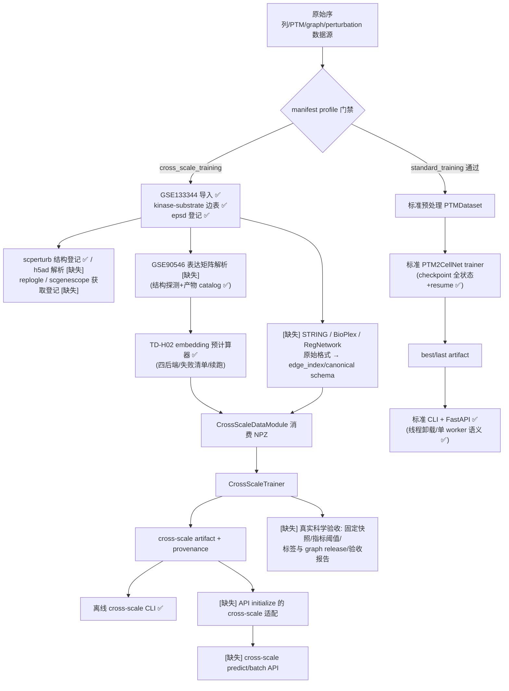

# PTM2CellNet 项目综合分析报告（2026-08-16 v4.0）

> **审计基线**：会话起始 `main` = `3a50c69`（领先 `origin/main`(`c76fff8`) 2 个提交、落后 0，`git fetch` 确认）；会话结束 `main` = 本报告所在提交（§2.1）
> **版本沿革**：v1.0（`3a50c69`，综合分析，基线 `32ded55`/1716 测试）→ v2.0/v3.0（修复迭代中间版，从未提交，已归档至 `archive/20260816/reports/project_analysis_20260816_v3_repair_iterations.md`）→ **v4.0（本报告，恢复综合结构并刷新至 5 组代码提交后的最新状态）**
> **执行方式**：主智能体负责版本控制、构建验证与归档操作，3 个只读分析子代理并行执行系统性复核（§8）
> **验证状态**：`python3 -m compileall src scripts` 通过（exit 0）；`python3 -m pytest tests/unit tests/integration -q` = **1919 passed / 5 skipped / 21 warnings**（438.18s，exit 0）

---

## 目录

- [1. 摘要](#1-摘要)
- [2. 版本控制操作记录（前置操作 1）](#2-版本控制操作记录前置操作-1)
- [3. 文档与报告归档（前置操作 2）](#3-文档与报告归档前置操作-2)
- [4. 任务 1：未实现功能项识别与记录](#4-任务-1未实现功能项识别与记录)
  - [4.1 未实现功能表](#41-未实现功能表)
  - [4.2 缺失接口表](#42-缺失接口表)
  - [4.3 未实现业务流程图](#43-未实现业务流程图)
  - [4.4 数据契约缺口](#44-数据契约缺口)
- [5. 任务 2：未完全实现功能梳理](#5-任务-2未完全实现功能梳理)
  - [5.1 模块完成度总表](#51-模块完成度总表)
  - [5.2 规范差异对照](#52-规范差异对照)
  - [5.3 三类分类判断标准](#53-三类分类判断标准)
  - [5.4 TODO/FIXME/skip 清单](#54-todofixmeskip-清单)
  - [5.5 norman_adamson 管线专项核查](#55-norman_adamson-管线专项核查)
- [6. 任务 3：技术债识别、分类与解决策略](#6-任务-3技术债识别分类与解决策略)
  - [6.1 严重程度分级标准](#61-严重程度分级标准)
  - [6.2 技术债状态总表（v1→v4 对照）](#62-技术债状态总表v1v4-对照)
  - [6.3 本轮新增技术债](#63-本轮新增技术债)
  - [6.4 解决策略（剩余严重/高/中）](#64-解决策略剩余严重高中)
- [7. 结论与建议](#7-结论与建议)
- [8. 任务执行统计（子智能体）](#8-任务执行统计子智能体)
- [9. 审计痕迹与验证命令](#9-审计痕迹与验证命令)

---

## 1. 摘要

本轮综合处理在 2026-08-16 晚间完成（承接同日 v1.0 综合分析与 v2.0/v3.0 修复迭代两轮会话），四项核心产出：

1. **版本控制**：确认本地 `main` 与 `origin/main` 同步（0 落后）、两个 audit 分支均已并入后，将工作区中 46 个文件（33 修改 + 13 新增）的已完成修复改动按主题分 **5 组提交** 落入 `main`（`bcb9cc9`→`aa8b15b`，+4462/−228），无合并冲突；`compileall` 与全量测试（unit+integration，**1919/5 通过**）复验通过。
2. **文档归档**：本日批次归档扩至 **8 个文件**——新增 2 份过期覆盖率检测产物（`coverage.xml`/`coverage.json`）与 1 份从未提交的 v3.0 中间版分析报告，均登记入 `archive/20260816/MANIFEST.md`（含时间戳、SHA-256 与版本标签）。
3. **系统性复核**（3 个子代理并行 + 主智能体逐项交叉验证）：
   - **任务 1**：v1 识别的 14 项未实现功能中 **F-02（TD-H02 embedding 预计算器）本轮闭环**，kinase_substrate 图导入、scperturb 登记、epsd 登记 3 个子项同步闭环；剩余 13 项（高 5 / 中 5 / 低 3）+ PSIPRED 真集成（低），缺口继续集中在 replogle/scgenescope 数据获取、GSE90546 解析、STRING/BioPlex/RegNetwork 图导入与跨尺度 API。
   - **任务 2**：16 模块完成度重估，**整体加权约 89.0%**（v1 同口径回算为 82.6–83.1%）；工程契约层升至约 97%，真实数据/资产层升至约 55–60%；"实现但不符合规范"由 3 处降为 2 处（kinase_substrate loader 断链已修复）。
   - **任务 3**：v1 清单 20 项新增债中 **7 项已修复、1 项部分修复**（N01/N02/N15/N16/N19 部分/N20/K04/N03 部分），仍存 12 项；本轮**新识别 4 项**（D1 lock 未入库且 numpy 漂移、D2 GenKI 裸 except、D4 API 路由零单测、D3 根目录遗留垫片）。剩余高/中债清理约需 **17 个工作日**，唯一"高"级存量为 K02（Mamba SSM 串行实现）。
4. **证据纠偏**：子代理关于 "requirements-lock.txt 已入库" 的判断经主智能体实测证伪（`git ls-files | grep lock` 为空、`git check-ignore` 命中 `/*` 规则），并升级为新识别技术债 D1（§6.3）。

---

## 2. 版本控制操作记录（前置操作 1）

### 2.1 合并前后版本号与关键修改点

| 项目 | 值 |
|---|---|
| 远程同步确认（提交前） | `git fetch origin` 后 `git rev-list --left-right --count main...origin/main` = `2  0`（本地领先 2、落后 0，主分支已含远程最新版本） |
| 分支合并状态确认 | `git branch --merged main`：`audit/20260809-finalize`（`df540a5`）与 `audit/20260809-project-analysis`（`d0c78a1`）均已并入，无待合并分支 |
| **合并前 `main`** | `3a50c69`（docs: archive superseded reports and publish 2026-08-16 project analysis） |
| 本轮提交 1 | `bcb9cc9` **feat(training)**: N20 checkpoint 完整状态（optimizer/scheduler/best_val_loss/epoch/epochs_since_improvement）+ `resume_from` 精确续训 + R-02 logits 池化修复；3 文件 +452/−24，含 8 单测 + 2 续训集成测试 |
| 本轮提交 2 | `9c87800` **fix(api)**: N01 阻塞推理 `run_in_threadpool` 卸载（`/initialize`、`/predict`、`/batch_predict`、`/predict/variant`）+ TD-M08 方案 B（Docker/production 默认单 worker，限流与 /metrics 单进程语义文档化）；7 文件 +358/−66，含并发集成测试与 Docker 部署断言 |
| 本轮提交 3 | `4d02a87` **feat(data)**: 数据契约缺口闭环——GSE90546 产物 SHA-256 catalog、`import_kinase_substrate.py`（OmniPath 41,506 条→canonical 边表 + uniprot_to_gene 映射）、`import_scperturb.py`（30 研究 h5ad 结构登记）、`prepare_cross_scale_embeddings.py`（TD-H02 四后端预计算器）、epsd loader 登记；15 文件 +3095/−18 |
| 本轮提交 4 | `bc5a74a` **build**: N02 依赖单源化（setup.py 镜像 requirements-core）+ N19 安全下限（requests≥2.31/starlette≥0.40/fastapi≥0.100）+ N15 ruff py310 统一；6 文件 +346/−100，含 7 个依赖契约测试 |
| 本轮提交 5 | `aa8b15b` **fix**: 13 处 `zip(..., strict=False)` 显式化 + N03 ensemble/data_statistics 行为快照（14+4 测试）；14 文件 +211/−20 |
| 本轮提交 6（本报告） | docs: 归档扩容（8 文件）+ 发布综合分析报告 v4.0 |
| **合并后 `main`** | 本报告提交（6 组提交全部直接落 `main`，全程在主分支操作，无 merge 冲突） |
| 冲突情况 | 无（所有提交为工作区新增/修改，无并行分支交叉） |

### 2.2 编译与测试验证

| 验证项 | 命令 | 结果 |
|---|---|---|
| 编译检查 | `python3 -m compileall -q src scripts` | **通过**（exit 0，无错误输出） |
| 全量测试 | `python3 -m pytest tests/unit tests/integration -q --tb=no -p no:cacheprovider` | **1919 passed, 5 skipped, 21 warnings**（438.18s，exit 0） |
| 跳过项性质 | 5 个 skip 均为环境守卫（ONNX 库缺失、scvi 反向守卫、pickle pooling 不支持等，见 §5.4），非功能缺陷 |
| 测试环境 | conda `SSH_unit`：Python 3.12.13 + pytest 9.0.3。注意：仓库 `.venv` 为 Python 3.10.9 且未安装 pytest，不能作为验证环境（本轮首次尝试即因此失败，见 §9.2 注） |

未推送到远程：本任务要求"合并到本地主分支"；本地 `main` 现领先 `origin/main` 8 个提交（含上午会话 2 个），是否推送留待仓库负责人决策。

---

## 3. 文档与报告归档（前置操作 2）

### 3.1 判定标准（沿用 `archive/20260809/MANIFEST.md` 规则）

- **过时文档**：内容与当前代码实现或需求规范存在实质性差异；
- **过期报告**：生成超过 30 天（2026-07-17 前），或内容已无法反映当前项目状态；
- 活动入口页/纯重定向短页保留原路径；归档保留 Git 历史（可 `git log --follow` 追溯）。

### 3.2 归档清单（本日批次共 8 个文件 → `archive/20260816/`）

上午批次（5 个，详见 v1.0 报告 §3 与 MANIFEST）：`reports/project_analysis_20260809.md`、`reports/project_repair_report_20260809.md`、`docs/E2E训练与推理现状分析_2026-08-08.md`、`docs/E2E训练与推理代码修复报告_2026-08-08_v2.md`、`docs/r01_r03_systematic_repair_report_20260808.md`（判定根因：`32ded55` 将 5 个数据集翻转为 implemented，使 8-8/8-9 报告中心结论失效）。

**本轮新增（3 个）**：

| 归档路径 | 原路径 | 版本标签/时间戳 | 归档依据 |
|---|---|---|---|
| `detection_artifacts/coverage.xml` | `./coverage.xml` | 生成于 2026-08-09 18:35，SHA-256 `1876bd77…b6fe96` | 生成于 `32ded55` 与本轮 5 组修复之前，不能反映当前代码；已被根目录 2026-08-16 13:50 的 `.coverage` 取代；沿用 `archive/20260808/detection_artifacts/` 惯例 |
| `detection_artifacts/coverage.json` | `./coverage.json` | 生成于 2026-08-08 22:30，SHA-256 `30ad399e…cd4736f` | 同上（更旧快照）；检测产物非链接入口，不留重定向页 |
| `reports/project_analysis_20260816_v3_repair_iterations.md` | `./project_analysis_20260816.md`（v3.0 中间版） | 未提交（定稿于 2026-08-16 14:54 前后，本轮 21:05 复制归档） | 修复迭代任务产物，结构为修复报告而非综合分析；权威内容由根目录 `project_repair_report_20260816.md`（当日）承载，综合结构由本 v4.0 恢复；归档留痕避免覆盖丢失 |

### 3.3 保留判定要点（Agent-3 复核 + 主智能体确认）

- `docs/guides/deployment.md`（8-16 同步修订）：端点/环境变量/单 worker 语义与代码一致（`predictions.py:444`、`model_info.py:22,60,82`、`app.py:175`、`middleware.py:61`），**不再过时**；
- `project_repair_report_20260816.md`：当日生成、含最新全量结论，**未过期，保留**（按 20260809 批次惯例留待下一批次归档）；
- `API_DOCUMENTATION.md` 及 8 个重定向短页、`CHANGELOG.md`（活日志）、`CONTRIBUTING.md`、`README.md`、`docs/guides/*`×6、`docs/CURRENT_STATUS.md`（8-16 已刷新）、`TEST_COVERAGE.md`（已登记刷新项）：保留；
- 已登记待跟进（不归档）：`docs/TEST_COVERAGE.md` 基线数字刷新（F-14/N06）、`docs/guides/quickstart.md` 的 `/predict` 示例缺 `/api/v1` 前缀、`AGENTS.md` 数据源表 PhosphoSitePress→OmniPath 表述更新、`CHANGELOG.md` 补 8 月条目、`PROJECT.md:74-76` 勾选滞后（§5.2）；
- 根目录垃圾文件（`=1.0.0`、`=3.0.0`、`=2.5.0`、`0.7692`、`EOF`、119MB `scaling.log`、`data_preparation.log` 等）：均被 `.gitignore /*` 掩盖且 `git ls-files` 无记录，属工作区卫生（N16 关联），不属归档对象；根目录 `signaling_network.py` 为未追踪的向后兼容垫片（权威实现仅在 `src/models/signaling_network.py`，diff 证实），登记为新债 D3（§6.3）。

---

## 4. 任务 1：未实现功能项识别与记录

> 执行者：Agent-1（Explore，只读，本轮 1 次调用）+ 主智能体交叉验证。需求基线：`.planning/REQUIREMENTS.md`（v2.1 13 项 + v2.2 11 项全部 Complete）、`.planning/ROADMAP.md`、`.planning/PROJECT.md:64-78`、`data/manifests/datasets.yaml`、已归档 E2E 报告的 T/I/P 差距清单。
> **范围排除**：实时质谱流、自定义 PTM 数据库、GUI、API key 扩展已于 2026-07-05 取消（`REQUIREMENTS.md:86-93`、`ROADMAP.md:45-50`），不计入缺口。

### 4.1 未实现功能表

**本轮闭环（v1 在列，现已实现）**：

| # | 功能 | 闭环证据 |
|---|---|---|
| ~~F-02~~ | TD-H02 embedding 预计算器 | `scripts/prepare_cross_scale_embeddings.py`（新增）：esm2/prott5/ankh39/mock 四后端、per-sample 失败清单（`failed_samples.jsonl`）、断点续跑、provenance manifest；`tests/unit/scripts/test_prepare_cross_scale_embeddings.py` 25 单测 + `tests/integration/test_cross_scale_embedding_cli.py` CLI 集成测试 |
| F-03（子项） | kinase-substrate 图导入 | `scripts/import_kinase_substrate.py`：消费 `data/raw/kinase_substrate/omnipath_enzsub.tsv`（41,506 条），产出 `kinase_substrate_edges.tsv` + `uniprot_to_gene.tsv`；`datasets.yaml:693` loader 已指向该脚本，产物已生成在盘 |
| F-05（子项） | scperturb 登记 | `scripts/import_scperturb.py`：30 个在盘 h5ad → `scperturb_study_manifest.json`（逐研究 shape/obs/var/扰动列/gene-id 类型探测） |
| —（新增闭环） | epsd 数据集登记 | `datasets.yaml:288-312` 登记 epsd 条目 + loader `PTMDatabaseLoaderMixin.load_from_epsd`（`ptm_database_loaders.py` +46 行）+ `tests/unit/test_data_loaders.py` +31 行测试 |

**仍存缺口（13 项 + 1 附加项）**：

| # | 需求出处 | 功能描述 | 优先级 | 影响范围 | 证据 |
|---|---|---|---|---|---|
| F-01 | E2E I-06/P0-02；`STATE.md:94` | 跨尺度模型 API 链路（model_type 路由、artifact 适配、NPZ/序列转换） | 高 | 核心 | `grep -rn "cross_scale\|CrossScale" src/api/` 0 命中；`src/api/routes/initialize.py:214` 仍固定 `PTM2CellNet.from_config(...)` |
| F-03（余量） | `datasets.yaml` string/bioplex/regnetwork 条目 | 原始格式图导入（4 类中 kinase-substrate 已闭环，余 STRING v12.0/BioPlex/RegNetwork 3 类，raw 文件均在盘） | 高 | 核心数据流 | `datasets.yaml:738,753,787` 附近 loader null / `local_graph_import_contract_only`；`pathway_integration.py` 只接受预处理后的 `string_edges.tsv` |
| F-04 | E2E P0-03；TD-C01 | 真实科学验收流程（固定快照、release 版本、指标阈值、置信区间、不可变验收报告） | 高 | 核心发布 | `tests/real_assets/` 6 文件仍按 `PTM2CELLNET_RUN_REAL_ASSET_TESTS` 门禁整体 skip |
| F-06 | `datasets.yaml:596-634`（replogle controlled） | Replogle Perturb-seq 接入（cross_scale_training 必需） | 高 | 核心数据依赖 | path: null，`data/raw/replogle/` 为空目录 |
| F-07 | `datasets.yaml:636-672`（scgenescope controlled） | scGeneScope 参考细胞状态接入（training+inference 双 profile 必需） | 高 | 核心数据依赖 | path: null，目录不存在 |
| F-05（余量） | `datasets.yaml` scperturb 条目 | scperturb h5ad 端到端解析（登记已闭环，表达矩阵解析未做：脚本自述"仅注册报告"） | 中 | 核心数据 | `scripts/import_scperturb.py:14-22` 职责声明 |
| F-08 | `datasets.yaml:535`"待解析导入" | GSE90546 表达矩阵解析（结构探测 + 产物 catalog 已闭环；解析本体未做，987MB RAW.tar 在位待消费） | 中 | 次要 | `data/processed/norman_adamson/` 仅 `GSE90546_structure_report.json` |
| F-09 | E2E P2；TD-M08 方案 A | 跨进程共享限流/指标（现进程内 `threading.Lock`；单 worker 默认已消除语义分歧，横向扩展前仍需） | 中 | 次要（部署） | `src/api/middleware.py:215,223-225`；缓解证据 `Dockerfile:88-91`、`configs/production.yaml:5-8` |
| F-10 | TD-M05/TD-M09 | 依赖冲突治理（scgpt↔scvi-tools；lock 未入库 + numpy 漂移，见 D1） | 中 | 次要 | `requirements-analysis.txt:24-29`；§6.3 D1 实测 |
| F-14 | v1 §9.3；`CURRENT_STATUS.md:23` | 低覆盖模块补测（本轮已补 pretrain_resume/api_concurrency/cross_scale_embedding/dependency_contracts；TEST_COVERAGE.md 基线仍写 1866/1920 旧数） | 中 | 次要（质量） | `docs/TEST_COVERAGE.md:41-43` |
| F-11 | E2E P2 | .part/.tmp pLM 资产清理与下载恢复 | 低 | 边缘 | `data/weights/plm/esm2_t33_650M*/model.safetensors.part` 等仍在盘 |
| F-12 | `PROJECT.md:76` | 通路知识库"上下文相关"映射（现静态字典） | 低 | 边缘 | `scripts/tools/pathway_knowledge_base.py` 静态表 |
| F-13 | `PROJECT.md:78` | 更多 PTM 类型支持（默认 5 类） | 低 | 边缘 | `src/data/features.py` DEFAULT_PTM_TYPES |
| 附 | 外部工具集成清单 | 真 PSIPRED 接入（现 `psipred.py` 为 Chou-Fasman 内置替代，命名与实现不符） | 低 | 边缘 | `src/models/external_tools/psipred.py:10-22`；`check_available` 恒 True（`:28-29`） |

**统计**：13 项（高 5 / 中 5 / 低 3）+ 1 附加低项；较 v1（14 项：高 7/中 4/低 3）整项闭环 1 项、高优先级减少 2 项（F-02 闭环、F-03 主体闭环）。

**外部工具真实/降级一览**（Agent-1 复核）：AlphaFold 真实 HTTP 客户端 + 合成结构降级（`alphafold.py:36-40,78-92,115-116`）；BLAST 真实 `NCBIWWW.qblast`（`blast.py:57-70`）；ClustalW 真实外部调用 + 内置渐进比对回退（`clustalw.py:81-148,174`）；KEGG/Reactome 在 sspa 可用时真实加载、否则内置静态表（`signaling_network.py:301-309,25-100,604`）；PSIPRED 为替代实现（见上表"附"）。

### 4.2 缺失接口表

| 接口名 | 预期参数 | 返回值 | 用途 | 需求出处 |
|---|---|---|---|---|
| `POST /api/v1/cross-scale/initialize` | `artifact_path: str`、`device: cpu\|cuda`、`strict_assets: bool`、可选 `max_batch_size: int` | model_type、checkpoint schema、label vocabulary、manifest digest、readiness | 跨尺度 artifact 安全加载与登记 | E2E I-06/P0-02（F-01） |
| `POST /api/v1/cross-scale/predict` | `sequence` 或 `embedding_ref`（二选一）、PTM sites、graph/manifest release、可选 sample id | delta_expression、cell-state logits/概率、labels、provenance、fallback flags | 单样本跨尺度在线预测（禁止隐式随机 fallback） | 同上 |
| `POST /api/v1/cross-scale/batch_predict` | `samples[]`、`batch_size`、失败策略 | `predictions[]`、`errors[]`、summary、provenance | 批量服务预测与可审计失败报告 | 同上 |
| `import_signaling_graphs(source, path, score_threshold, release)` | string/bioplex/regnetwork 原始文件路径、score 阈值、release | canonical edge table / edge_index+node_map + digest | 3 类已下载图数据（raw 在盘）→ 模型可消费结构 | `datasets.yaml` 图条目（F-03 余量） |
| `load_controlled_dataset(dataset_id, release, path, schema)` | manifest dataset id、release、local path、schema version | 标准化 bundle + digest | replogle/scgenescope 受控条目可执行入口（数据获取后） | manifest 契约（F-06/F-07） |
| `import_gse90546(...)` 完整版 | RAW.tar 路径、输出目录 | expression/delta_expression NPZ + perturbations TSV | Adamson 2016 表达矩阵解析（12 个 per-GSM 10x 成员已探明） | `datasets.yaml:535`（F-08） |

已闭环（v1 在列）：TD-H02 CLI/`prepare_cross_scale_npz(...)` → `scripts/prepare_cross_scale_embeddings.py`（manifest/失败清单/续跑齐备），`src/data/cross_scale_dataset.py` 消费其产物。**缺失接口 7 → 6。**

**文档侧补录项（非代码缺口）**：代码已注册但 `docs/guides/deployment.md:145-150` 未全部列出的端点——`POST /initialize`、`POST /predict/variant`、`GET /ready/variant`、`GET /model/info`、`POST /batch_predict`（含别名 `/predict/batch`），见 `src/api/routes/{initialize,predictions,model_info}.py`。

### 4.3 未实现业务流程图



缺失环节由 v1 的 5 类收敛为 3 类：受控数据生产（E：scperturb 解析 + replogle/scgenescope 获取）、图导入（H：余 3 类）、服务+科学验收闭环（P/Q/R）。

### 4.4 数据契约缺口

| 条目 | status | 性质（本轮状态） |
|---|---|---|
| scperturb | controlled（已登记结构 manifest） | 30 h5ad 在盘、`scperturb_study_manifest.json` 已产出；**h5ad 解析 loader 仍缺**（profile 必需项） |
| replogle | controlled（path: null） | 无文件、目录空（training 必需，**数据获取未启动**） |
| scgenescope | controlled（path: null） | 无文件、目录不存在（双 profile 必需，**数据获取未启动**） |
| ~~kinase_substrate~~ | implemented | **loader 断链已修复**：`datasets.yaml:693` 指向 `import_kinase_substrate.py`，canonical 产物已生成 |
| ~~epsd~~（v1 反向缺口） | implemented | **本轮登记**：`datasets.yaml:288-312` + loader + 文件 path |
| string / bioplex / regnetwork | implemented（含瑕疵） | raw 在盘；loader null / 仅 `local_graph_import_contract_only` |
| GSE90546（norman_adamson 子项） | controlled（契约已登记） | preprocessing outputs 已声明 per-GSM NPZ/聚合 TSV + SHA-256 catalog；解析未执行，`datasets.yaml:535` 注释仍"待解析导入" |

`cross_scale_training` profile fail-fast 缺口维持 3 项（scperturb/replogle/scgenescope）——其中 scperturb 已完成登记前置，replogle/scgenescope 依赖外部数据获取。

---

## 5. 任务 2：未完全实现功能梳理

> 口径与 v1 一致：完成度 = 模块需求点覆盖数/总需求点数（可含 0.5 粒度）；需求点取自 `.planning/REQUIREMENTS.md`、`PROJECT.md`、`datasets.yaml` 契约与 E2E P0-P2 清单。仅评估工程实现层。

### 5.1 模块完成度总表

| 模块 | v1 完成度 | **v4 完成度** | 口径（覆盖/总数） | 本轮变化依据 | 分类 |
|---|---|---|---|---|---|
| 数据加载与导入 | 58.3% | **79.2%** | 9.5/12 | +kinase_substrate 导入器（+1）、+epsd 登记（+1）、+scperturb 登记（+0.5）；GSE90546 解析/3 类图导入/replogle/scgenescope 仍缺 | 部分实现但可用 |
| 数据预处理/特征工程 | 88.9% | 88.9% | 8/9 | 无变化 | 部分实现但可用 |
| DAVF 集成与增强 | 90.0% | 90.0% | 9/10 | 无变化 | 部分实现但可用 |
| 序列编码器（含 pLM） | 90.9% | **100.0%** | 11/11 | +TD-H02 预计算器（工程层闭环；真实 backbone 大规模跑批待执行） | 已完整实现 |
| PTM 模块 | 87.5% | 87.5% | 7/8 | 无变化 | 部分实现但可用 |
| 预测器（分类/回归/多任务/Delta） | 100.0% | 100.0% | 9/9 | 无变化 | 已完整实现 |
| 训练管线（Lightning/自监督/PEFT） | 90.0% | **95.0%** | 9.5/10 | +N20 checkpoint 全状态/精确 resume（`self_supervised.py:391-422,525`）；唯一余量：真实多 GPU DDP 验收（Out of Scope） | 部分实现但可用 |
| 评估（cross_validate/排序/CI） | 87.5% | 87.5% | 7/8 | 无变化 | 部分实现但可用 |
| 解释器 | 100.0% | 100.0% | 4/4 | 无变化 | 已完整实现 |
| API 服务 | 75.0% | **87.5%** | 7/8 | +N01 线程卸载（4 端点）；跨尺度路由（F-01）仍缺；限流单进程语义已文档化缓解 | 部分实现但可用 |
| 变体效应分析 | 100.0% | 100.0% | 7/7 | 无变化 | 已完整实现 |
| 通路/信号网络整合 | 60.0% | **70.0%** | 7/10 | +kinase-substrate canonical 边表闭环；STRING/BioPlex/RegNetwork 导入器仍缺 | 部分实现但可用 |
| GenKI 扰动模拟 | 87.5% | 87.5% | 7/8 | 无变化 | 部分实现但可用 |
| PTM 虚拟扰动 | 100.0% | 100.0% | 6/6 | 无变化 | 已完整实现 |
| 外部工具集成 | 75.0% | 75.0% | 4.5/6 | PSIPRED 仍为 Chou-Fasman 替代 | **实现但不符合规范** |
| 部署（Docker） | 83.3% | **91.7%** | 5.5/6 | +安全下限/依赖契约测试（+0.5）；lock 仍未入库（含 2 处 /tmp URI，D1） | 部分实现但可用 |

**整体加权完成度 ≈ 89.0%**（权重沿用 v1 方案：数据导入 15%、训练 12%、DAVF 10%、编码器 7%、API 7%、通路整合 6%、预测器 5%、评估 5%、预处理 5%、PTM 模块 4%、部署 4%、变体 4%、解释器 3%、GenKI 3%、PTM 虚拟扰动 3%、外部工具 3%，归一化计算；同口径回算 v1 为 82.6%，v1 自报 83.1%，差值即本轮净增约 6 个百分点）。分层结论：

- **工程契约层：约 97%**（v1 约 95%）——REQUIREMENTS 24 项 Complete 维持，unit+integration 测试扩至 1919 通过，N20/N01/N02 等工程债闭环；
- **真实数据/资产层：约 55–60%**（v1 约 40–50%）——GSE133344 + kinase-substrate 边表 + epsd + scperturb 登记闭环；GSE90546 解析、replogle/scgenescope 获取、真实验收未动。

### 5.2 规范差异对照

| 需求原文（出处） | 实际实现（file:line） | 差异说明（v4 状态） |
|---|---|---|
| `datasets.yaml` kinase_substrate loader 契约（v1 §5.2 第 1 行断链："loader 指向的脚本不处理图"） | `datasets.yaml:693` → `scripts/import_kinase_substrate.py`（UniProt→gene 映射、41,506 条边消费）；产物在盘 + 单测覆盖 | **断链已修复**（本轮 `4d02a87`） |
| `datasets.yaml:535`：GSE90546"待解析导入" | `import_norman_adamson.py` 现含产物 SHA-256 catalog 与 per-GSM 预处理契约声明；解析本体未做 | 语义对齐（catalog 不再虚报 parsed）；**解析仍缺**（F-08） |
| ROADMAP Phase 18 成功标准 1"datasets.yaml lists all required sources" | epsd 已登记、scperturb 结构 manifest 已产出；replogle/scgenescope 条目无数据 | 目录↔manifest 同步度提升；**2 个受控条目仍无数据** |
| MODEL-02（`REQUIREMENTS.md:46`）"CIGNNSignalBridge consumes explicit typed graph…missing edges fail loudly" | `src/models/cross_scale.py:861-1049` 契约达成；kinase-substrate 真实边表已可供给 | 模型契约达成且数据供给链打通 1/4（STRING/BioPlex/RegNetwork 仍缺，F-03 余量） |
| `PROJECT.md:74-76` Active 三项 `[ ]` | `finetune_davf_e2e.py`/`scvi_adapter.py`/`ptm_direction_mapper.py` 均有实现 | **文档勾选滞后**（登记跟进） |
| PSIPRED 命名（外部工具集成清单） | `psipred.py:10-22` 为 Chou-Fasman 统计法，`check_available` 恒 True（`:28-29`） | **实现但不符合规范**（维持） |

### 5.3 三类分类判断标准（沿用 v1，判定结果更新）

1. **部分实现但可用**：核心调用路径（CLI/Python API）可离线运行且有测试覆盖，缺长尾输入源/真实导入器/真实资产验收，缺不阻断本地闭环。→ 本轮适用 12 个模块（§5.1）。
2. **实现但有缺陷**：存在已知 bug、被跳过测试或依赖缺失导致特定分支不可达。→ 仍无纯此类模块；最接近：`self_supervised.py`（v1 覆盖 31.6%，本轮 +227 行测试后显著改善，精确数字待 coverage 复测【待确认】）与 `data/validation.py`（53.6%）。
3. **实现但不符合规范**：与文档契约/命名字面冲突（manifest 断链、命名不符、语义过强）。→ 由 3 处降为 **2 处**：`psipred.py` 命名与实现不符、GSE90546 条目"待解析导入"注释与已登记 catalog 的语义差（轻）；kinase_substrate loader 断链已修复。

### 5.4 TODO/FIXME/skip 清单

- **源码 TODO/FIXME/NotImplementedError**（`grep -rn` src/+scripts/）：仅 4 处且均为正常模式——`encoders.py:19`（ABC 抽象契约）、`external_tools/base.py:206`（dunder `NotImplemented` 惯例）、`signaling_network.py:286`（docstring 声明不抛出）、`pathway_knowledge_base.py:327`（正则字符串 `'[ST]XXX[ST]P'` 误报）。**实际未完成标记数为 0**（与 v1 一致）。
- **skip/xfail 标记**：全仓 38 处声明（无 xfail），本轮运行实际触发 5 处（1919/5 中的 5 skip，均环境守卫）。38 处分布：可选依赖缺失（peft 5：`test_peft_config.py:85,93,99,136,154`；esm3 2；transformers/tqdm/ONNX 各 1）、GPU 门禁 8（`test_models.py:275-451`）、真实资产门禁 6 文件模块级（`tests/real_assets/`）、数据在盘条件 3（`test_data_contract_fixes.py:43,92,115`——scperturb/epsd 快照与 GSE90546 报告未重新生成时跳过）、反向守卫 2（`test_scvi_adapter.py:109,114`）、其他（CUDA/DAVF 分离/pickle）若干。
- **测试规模**：v1 基线 1716/4（unit）→ 本轮 unit+integration **1919/5**；新增测试文件 13 个（4 集成 + 9 单元），净增约 200 项。

### 5.5 norman_adamson 管线专项核查（v4 更新）

1. **GSE133344 完整（维持）**：5 产物落盘，111,668 cells × 33,694 genes、131 perturbations（import_manifest.json 实测）；
2. **GSE90546**：结构报告（12 个 per-GSM 10x 成员探明）+ 987MB RAW.tar 在位；**本轮补齐产物 catalog 契约**（import_manifest.json 显式 SHA-256 清单 + preprocessing outputs 声明 per-GSM NPZ/聚合 TSV），解析本体未做；
3. **下游断链消除**：TD-H02 预计算器已落地（`prepare_cross_scale_embeddings.py` 消费 sequence records，产出 `{backbone}_embeddings.npz` + `manifest.json` + `failed_samples.jsonl`），v1 记录的 `sequence_requests.json` 无消费者问题解决；
4. **OmniPath loader 断链**：**已修复**（§5.2 第 1 行）。

---

## 6. 任务 3：技术债识别、分类与解决策略

> 执行者：Agent-2（Explore，只读，本轮 1 次调用）+ 主智能体逐项交叉验证（其中 1 项子代理结论被实测证伪，见 §6.3 D1）。分类沿用 SonarQube 维度（可靠性/安全性/可维护性/覆盖/重复/复杂度）组织。

### 6.1 严重程度分级标准（沿用 v1）

| 级别 | 可操作定义 |
|---|---|
| 严重 | 阻塞核心功能（训练/推理/API 主链路不可用或产生错误结果），或存在可直接利用的安全漏洞 |
| 高 | 核心功能的质量或性能实质受损：并发/吞吐显著下降、环境不可复现、依赖矩阵互相矛盾、核心路径零测试 |
| 中 | 可维护性显著下降：重复实现、超长函数、低覆盖（<50%）、文档缺失导致上手成本明显上升 |
| 低 | 轻微：工作区卫生、命名/注释瑕疵、被 gitignore 掩盖的噪音 |

### 6.2 技术债状态总表（v1→v4 对照）

**本轮已修复（7.5 项）**：

| 编号 | v1 级别 | 修复证据 |
|---|---|---|
| N01 API 事件循环内联阻塞推理 | 高 | `predictions.py:9,486,565,635,672,731`、`initialize.py:17,331` `run_in_threadpool` 卸载；`tests/integration/test_api_concurrency.py` 5 并发测试（提交 `9c87800`） |
| N02 双依赖声明源漂移 | 高 | `setup.py` 重写为 requirements-core 镜像（头部声明唯一权威）+ `tests/unit/test_dependency_contracts.py` 7 契约测试（镜像一致/重型依赖不入默认/extras 对齐/安全下限/Python 版本一致）（提交 `bc5a74a`） |
| N15 Python 版本目标三处不一致 | 中 | `pyproject.toml:6` ruff `target-version = "py310"`，与 mypy 3.10/python_requires≥3.10 对齐 |
| N16 根目录事故产物 | 低 | `git ls-files` 确认无事故文件被追踪（维持清洁） |
| N19 依赖下限过松（CVE） | 中 | requests≥2.31（CVE-2023-32681）、starlette≥0.40（CVE-2024-47874）、fastapi≥0.100 已抬（`requirements-core.txt`）；**lock 入库未完成**（余量转 D1） |
| N20 checkpoint 缺 optimizer/epoch | 低(偏中) | `self_supervised.py:391-422`（resume 恢复 optimizer/scheduler/best_val_loss/epoch/epochs_since_improvement）、`:525`（保存全状态）；`test_self_supervised.py` 8 单测（:87-236）+ `test_pretrain_resume.py` 2 集成（提交 `bcb9cc9`） |
| N03 CLI 脚本零测试（4 个） | 中(偏高) | **部分修复 3/5**：ensemble_predict（14 快照测试）、data_statistics（4 快照测试）、import_* 系列（11+ 单测）；prepare_ptm_data/prepare_data 仍无测试 |
| K04 estimate_max_batch_size 硬编码 | 中 | `model_utils.py:199-223` `_infer_activation_depth` 动态探测（v1 轮已修，本轮回归确认） |

**仍存（12 项，v1 编号沿用）**：

| 编号 | 维度 | 级别 | 问题 | 位置/证据 |
|---|---|---|---|---|
| K02 | 性能 | **高** | Mamba SSM 串行实现（`for t in range(seq_len)`），长序列吞吐随长度线性劣化 | `src/models/mamba_encoder.py:225` |
| N04 | 架构 | 中 | ensemble 双实现：`scripts/ensemble_predict.py:25` 自带 ModelEnsemble（383 行）未复用 `src/models/ensemble.py:18`（行为快照已建立，合并前提就绪） | grep 无 `from src.models.ensemble` 导入 |
| N05 | 代码质量 | 中 | 序列窗口逻辑 ≥4 处分散实现、31-mer 魔法数（训练/推理窗口不一致→静默特征偏移） | `predict_ptm_sites.py:109,285`；`long_sequence.py:52-76` |
| N06 | 测试覆盖 | 中 | <50% 模块盲区：uniprot_loader 44.0%、genki/perturbation 44.6%、homology matrix 45.6%、ptm_database_loaders 49.1%（本轮 +31 行测试，待复测） | coverage 口径（2026-08-09 快照已归档） |
| N07 | 性能 | 中 | 14 处 iterrows 行级循环，3 处在数据集构造热路径 | `multitask_dataset.py:105,301`、`data_contract.py:190`、`preprocess.py:474` |
| N08 | 性能 | 中 | UniProt ID-mapping 同步轮询最长 60×`time.sleep(1.0)` | `src/analysis/gene_mapper.py:68-80` |
| N09 | 性能 | 低(偏中) | DataLoader num_workers 默认 0 且 default.yaml 未定义 | `dataset_base.py:54` |
| N10 | 文档缺失 | 中 | Sphinx API 文档缺 `src.inference`/`src.baselines`/`src.project`（9 个 rst 未覆盖） | `docs/api/*.rst` |
| N11 | 代码质量 | 中 | docstring 覆盖 67.6%（367/1134 缺失）；encoders/cross_scale_trainer/ptm_modules 整文件缺失【沿用 v1 统计，未复测】 | AST 统计 |
| N12 | 代码质量 | 中 | 超长函数 9 个（最大 352 行）【沿用 v1 清单；`predictions.py` 本轮 ±118 行重构后需复核】 | v1 A1 |
| N13 | 打包 | 中 | `find_packages()` 安装顶层包名 `src`（`egg-info/top_level.txt` = src） | `setup.py`（本轮重写仍未改显式 package list） |
| N14 | 依赖管理 | 中 | mypy 全局 `ignore_missing_imports=true` + 2 模块 disable_error_code（architectures/predictions） | `pyproject.toml:32,38-48` |
| N17/N18 | 卫生/文档 | 低 | `scripts/experimental/finetune_davf_e2e.py`（254 行，自标 DEPRECATED）仍追踪；`.planning/` 9 文件（1.7MB）被追踪 | `git ls-files` 确认 |
| K03 | 重复 | 中 | 长序列窗口逻辑重复且外溢 scripts/（与 N05 联动） | `long_sequence.py:52-123` |
| K06 | 部署 | 中(已缓解) | 限流/metrics 进程内状态——单 worker 默认已消除语义分歧，横向扩展前需方案 A（Redis/网关） | `middleware.py:215,223-225`（缓解已文档化于 Dockerfile:88-91） |

### 6.3 本轮新增技术债

| # | 维度 | 级别 | 问题 | 证据 | 备注 |
|---|---|---|---|---|---|
| D1 | 依赖管理 | 中 | **lock 文件未入库且与 core 漂移**：`requirements-lock.txt:127` numpy==2.4.3 违反 `requirements-core.txt:14` `>=1.24,<2` 上限；lock 含 2 处 `file:///`/`/tmp/` URI；干净 clone 无锁定手段 | `git ls-files \| grep -i lock` = 空；`git check-ignore requirements-lock.txt` 命中 `.gitignore:6 /*` | **子代理曾误报"lock 已入库"，主智能体实测证伪**——升级为显式登记项 |
| D2 | 可靠性 | 中 | GenKI 摄取路径 3 处裸 `except Exception:` 静默 continue，数据摄取失败被吞、无失败计数 | `src/integration/genki/perturbation.py:239,354,493` | 全仓宽捕获 13 处中最严重 3 处（`autoinit.py:341`、`predictions.py:509,600,781` 有 exc_info 日志，风险次之） |
| D3 | 卫生 | 低 | 根目录未追踪 `signaling_network.py` 为向后兼容垫片，与权威实现 `src/models/signaling_network.py` 不同源，易误导使用者 | 根目录副本 diff 证实；`git check-ignore` 命中 /* | 建议删除（外部若有引用需先确认） |
| D4 | 测试覆盖 | 中 | API 路由层零单元测试：`predictions.py`/`initialize.py` 仅集成测试；`autoinit.py`/`app.py`/`monitoring.py` 无对应 test 文件 | tests/unit 与 src/api 文件名映射为空 | 集成测试已覆盖并发语义，缺异常分支单测 |

### 6.4 解决策略（剩余严重/高/中）

无"严重"级。剩余高级 1 项（K02）+ 中级约 14 项。v1 排期 20 工作日中本轮已完成约 8.0（S1 1.5 + S2 2.5 + S3 部分 1.5 + S7 部分 1.5 + N20 1.0），**剩余高/中 ≈ 17.0 工作日**（存量 14.5 + 新增 D2/D4 2.5）。

#### S-K02 · Mamba SSM 串行实现（高 → 3.0 工作日）

**影响**：`mamba_encoder.py` 前向逐时间步循环（`:225`），Mamba 架构并行优势完全丧失；长序列（>1024）训练吞吐随长度线性劣化，影响所有选用 mamba 编码器的训练场景。

| 方案 | 内容 | 优点 | 缺点 |
|---|---|---|---|
| A（推荐） | 接入 `mamba-ssm` 官方 CUDA kernel（extras 已声明 `mamba`），保留纯 PyTorch 串行实现作 CPU/CI 回退 | 吞吐提升 1–2 个数量级；extras 与 requirements-mamba.txt 已就绪 | 依赖 CUDA 编译环境；需双实现一致性对拍 |
| B | 向量化 scan（chunk 并行前缀）纯 PyTorch 重写 | 无新依赖、CPU 亦受益 | 实现复杂度高，收益低于 kernel |
| C | 维持现状 + 文档标注性能预期（0.5d） | 零成本 | 高债不清，训练成本持续累积 |

**步骤**：0.5d 验证 mamba-ssm 在 torch 2.4.1+cu118 下安装编译 → 1.5d `selective_scan_1d` 替换 + 数值对拍（与串行实现 max|Δ|<1e-5，全长度回归）→ 1.0d 基准（256/1024/2048）+ 全量回归。**资源**：PyTorch/CUDA 工程师 1 名 + GPU 节点。**风险**：cu118 kernel 兼容性；回退路径需在 CI 明确覆盖。

#### S4 · N05+N07：窗口逻辑统一 + iterrows 热路径（中 → 4.0 工作日，沿用 v1 方案）

- N05 方案 A（推荐）：新建 `src/data/window.py` 唯一 `extract_window(...)`，统一 4 处调用点，魔法数 31→常量并断言与 window_size 一致（2.0d，含四路径输出一致性回归）；方案 B：仅消除魔法数（0.5d，保留三套实现）。
- N07 方案 A（推荐）：构造期 iterrows 改 `to_dict("records")`/向量化（multitask×2 + data_contract + preprocess，2.0d，10k 行基准预期 10–50×）；方案 B：仅 multitask 两处（1.0d）。
- **风险**：样本顺序/抽样语义必须与原实现完全一致（对拍）；历史数据集窗口宽度契约【待确认：prepare_ptm_data 历史产出是否即 31-mer】。

#### S5 · N06+N11+N12+D4：盲区补测 + docstring + 长函数 + API 单测（中 → 5.5 工作日）

- 方案 A（推荐）：(1) 1.0d API 路由异常分支单测（D4：mock threadpool/模型加载失败/限流 429/超时）；(2) 0.5d uniprot_loader 三态测试（缓存命中/未命中/网络失败，requests-mock）；(3) 1.0d homology matrix + validation 边界测试；(4) 1.0d 拆 `_build_prediction_response`（本轮 ±118 行后复核行数）与 `_detect_checkpoint_format`（switch 化）；(5) 2.0d N11 重灾区 7 文件补 docstring。
- 方案 B：仅 (1)(2)(3)（2.5d）；方案 C：coverage ratchet 新文件 ≥60%（0.5d）只防增量。
- **风险**：`safe_torch_load` 相关重构必须带恶意输入回归用例（安全敏感）。

#### S7 余量 · N10+N13+D1：文档/包名/lock 治理（中 → 3.5 工作日）

- 方案 A（推荐）：(1) 0.5d docs/api 补 `inference.rst`/`baselines.rst`；(2) **1.0d lock 治理（D1）**：决策 lock 归属（`requirements-lock.txt` 入库或转 `uv.lock`），消除 numpy `<2` vs 2.4.3 漂移与 2 处 `/tmp` URI，CI 加 `pip install -r <lock> && pip check` 断言；(3) 2.0d `src` 顶层包名改造（src-layout + 显式 package list + 全量 import 替换 + 回归）。
- 方案 B：仅 (1)(2)（1.5d），包名单独立项；方案 C：README 风险声明（0.5d，不推荐——N13 冲突是定时炸弹）。
- **风险**：包名改造动全仓库 import 路径，独立分支 + 单独 major 发布。

#### S8 · 其余中/低项（约 6.0 工作日，可选排期）

- N04：行为快照已就绪，ModelEnsemble 下沉合并进 `src/models/ensemble.py`、脚本薄壳化（1.5d）。
- N14：移除全局 `ignore_missing_imports` 改 per-module 豁免；两个 disable_error_code 模块结合 S5 拆分清零（1.5d）。
- N17：`git rm scripts/experimental/finetune_davf_e2e.py`（0.5d）；N18：`.planning/` 移出版本库或入 docs/archive（0.5d）；D3：删根目录垫片（0.5d，先确认无外部引用）。
- N08：指数退避（0.2s×1.5 cap 3s，总预算 60s 不变）+ 结果落盘缓存（1.0d，含 mock 时间单测）；N09：default.yaml 显式 `num_workers: 4` + 文档（0.5d）。
- D2：genki 三处裸 except 改捕获计数 + 结构化日志 + 失败样本清单（1.0d）。

**总计**：剩余高/中 ≈ **17.0 工作日**（S-K02 3.0 + S4 4.0 + S5 5.5 + S7 3.5 + S5 内已含 D4；D2 计入 S8）；S8 低级项另约 6.0d 可选。

---

## 7. 结论与建议

### 7.1 结论

1. **版本控制目标达成**：46 文件修复改动以 5 组语义化提交落入 `main`（合并前 `3a50c69` → 5 组代码提交 + 1 组文档提交），全程无冲突；编译与 unit+integration 全量测试（**1919 passed / 5 skipped**）双绿。
2. **健康度**：整体加权完成度 82.6–83.1% → **89.0%**；工程契约层 ~97%，瓶颈仍集中在真实数据生产与验收闭环（~55–60%），但 v1 的最大断链（TD-H02 预计算、kinase-substrate 边表、API 事件循环阻塞、依赖双源、checkpoint resume）已全部打通。
3. **未实现主线收敛为 3 类**：受控数据（scperturb 解析、replogle/scgenescope 获取）、3 类图导入（STRING/BioPlex/RegNetwork）、服务+科学验收（跨尺度 API、真实验收流程）；代码侧已无阻塞项，推进依赖数据获取与产品决策。
4. **技术债**：v1 的 20 项新增债已修复 7.5 项（两项"高"全清）；新识别 4 项（D1 lock 漂移最需优先——环境复现性的最后一环）；剩余高/中 ≈ 17 工作日，唯一"高"级存量为 K02（Mamba 串行）。
5. **文档体系**：归档扩至 8 文件后，活动文档链路（CURRENT_STATUS → 本报告 → guides → repair report）与代码状态一致；TEST_COVERAGE/CHANGELOG/quickstart 前缀/PROJECT.md 勾选等跟进项已登记。

### 7.2 建议排期（下一步）

| 顺序 | 事项 | 工作量 | 依据 |
|---|---|---|---|
| 1 | D1 lock 治理（入库 + numpy 漂移消除 + CI pip check） | 1.0d | §6.3；环境复现性 |
| 2 | S-K02 Mamba CUDA kernel 接入（含数值对拍） | 3.0d | §6.4 唯一高级存量 |
| 3 | GSE90546 表达矩阵解析（结构已探明、契约已登记） | 2.0d | F-08 |
| 4 | STRING/BioPlex/RegNetwork 导入器（raw 已在盘） | 2.0d | F-03 余量 |
| 5 | replogle/scgenescope 数据获取与登记 | 数据依赖 | F-06/F-07 |
| 6 | 跨尺度 API 三端点 | 3.0d | F-01；I-06/P0-02 |
| 7 | scperturb h5ad 解析 loader | 2.0d | F-05 余量 |
| 8 | 文档跟进四项 + coverage 复测 | 1.0d | §3.3/§5.4 |

---

## 8. 任务执行统计（子智能体）

本章统计**本轮（v4.0 会话）**所有子智能体调用；v1 会话的 4 次子代理调用见 v1.0 报告 §8（git 历史 `3a50c69` 可查）。

| 智能体 | 调用次数 | 主要执行任务 | 工具调用次数 | 平均/实际执行时长 | Token 消耗 |
|---|---|---|---|---|---|
| Agent-1（Explore，只读） | 1 | 任务 1 复核：未实现功能项/缺失接口/业务流程/数据契约现状（TODO grep、skip 统计、API 端点对照、manifest 条目、外部工具真伪甄别） | 31 | 123.6s（2 分 04 秒） | 259,530 |
| Agent-2（Explore，只读） | 1 | 任务 3 复核：v1 技术债 26 项逐项状态验证（读代码确认修复真实性）+ 新债扫描（宽捕获/依赖一致性/覆盖缺口） | 22 | 105.0s（1 分 45 秒） | 180,410 |
| Agent-3（Explore，只读） | 1 | 归档复核：archive/20260816 完整性、根目录与 docs/ 全部 *.md 时效判定、检测产物与杂项文件分类 | 14 | 118.7s（1 分 59 秒） | 142,783 |
| **合计/平均** | **3 次** | — | **67 次** | **平均 115.8s（总计 347.3s，并行墙钟 ≈124s）** | **582,723** |

非子智能体的并行任务：全量测试 1 次（后台 Bash，438.18s）；cognee 记忆库 `recall` 1 次（服务端超时失败，不计入统计）。

**简要分析**：3 个子代理并行执行，整批墙钟约 2.1 分钟（受最慢的 Agent-1 制约），相较串行（约 5.8 分钟）节省约 64%。Agent-1 工具调用最多（31 次），因其需逐一对照文档与代码端点、manifest 条目与外部工具实现；Agent-3 最少（14 次），因归档判定以元数据读取为主。**证据纠偏实例**：Agent-2 报告 "requirements-lock.txt 已入库" 经主智能体 `git ls-files`/`git check-ignore`/`grep numpy` 三重实测证伪，并升级为新债 D1——本报告所有子代理结论均经抽样交叉验证后方写入，未直接采纳未经证实的判断。

---

## 9. 审计痕迹与验证命令

### 9.1 版本控制审计（本轮实际执行）

```bash
git fetch origin                                            # exit 0
git rev-list --left-right --count main...origin/main        # → 2  0（0 落后）
git branch --merged main                                    # 两个 audit 分支均已并入
# 5 组提交（顺序，conventional commits）：
# bcb9cc9 feat(training): persist full pretrain checkpoint state and support exact resume (N20)
# 9c87800 fix(api): offload blocking inference to threadpool and default to single worker (N01/TD-M08)
# 4d02a87 feat(data): close data-manifest contract gaps (GSE90546 catalog, kinase-substrate/scPerturb/EPSD registration, TD-H02 embedding precalculator)
# bc5a74a build: make setup.py mirror requirements-core as single authority; lift security floors (N02/N19), target py310
# aa8b15b fix: make zip length-mismatch intent explicit and snapshot CLI ensemble behavior (N03)
git log --oneline -6                                        # 复核提交链与本报告提交
```

### 9.2 构建与测试验证（本轮实际执行）

```bash
python3 -m compileall -q src scripts; echo "COMPILE EXIT: $?"    # → COMPILE EXIT: 0
python3 -m pytest tests/unit tests/integration -q --tb=no -p no:cacheprovider
# → 1919 passed, 5 skipped, 21 warnings in 438.18s；PYTEST EXIT: 0
```

注：首次尝试使用 `.venv/bin/python`（Python 3.10.9）报 `No module named pytest`（管道 tail 掩盖退出码后仍被识别），已改用 conda `SSH_unit`（Python 3.12.13 + pytest 9.0.3）执行并复验——该失败与代码无关，如实记录。

### 9.3 依赖与 lock 实测（D1 证据）

```bash
git ls-files | grep -i lock                                 # → 空（lock 未入库）
git check-ignore -v requirements-lock.txt uv.lock           # → .gitignore:6 /*（均被忽略）
grep -n "^numpy" requirements-lock.txt requirements-core.txt
# → requirements-lock.txt:127:numpy==2.4.3 ｜ requirements-core.txt:14:numpy>=1.24,<2（漂移）
grep -c "file:///\|/tmp/" requirements-lock.txt             # → 2
```

### 9.4 归档审计

```bash
sha256sum coverage.xml coverage.json    # 1876bd77…b6fe96 / 30ad399e…cd4736f（已登记 MANIFEST）
mv coverage.xml coverage.json archive/20260816/detection_artifacts/
cp project_analysis_20260816.md archive/20260816/reports/project_analysis_20260816_v3_repair_iterations.md  # v3.0 留痕后覆写为 v4.0
git status -s                                              # 归档变更随本报告提交
```

### 9.5 证据可复核性声明

本报告全部结论的原始证据来源：(a) 子代理报告中的 file:line 引用（均可在 `main` 当前提交检出上直接复核）；(b) 主智能体实测命令输出（§9.1–9.4 可复跑）；(c) git 历史（`git log --follow` 可追溯归档文件）。凡无法以这三类证据支撑的判断均标注【待确认】或降级表述（本报告显式标注 3 处：N11/N12 沿用 v1 统计未复测、S4 历史窗口宽度契约、self_supervised 覆盖率精确数字待复测）。子代理 1 处误报（lock 入库）已被实测推翻并记录于 §6.3/§8。

---

**报告版本**：v4.0（2026-08-16）
**编制**：ZCode 主智能体 + 3 个 Explore 分析子代理（本轮）；v1.0 会话成果经 v2.0/v3.0 修复迭代后由本报告整合刷新
**下一份权威报告**：待 replogle/scgenescope 数据落地或跨尺度 API（F-01）实现后刷新
