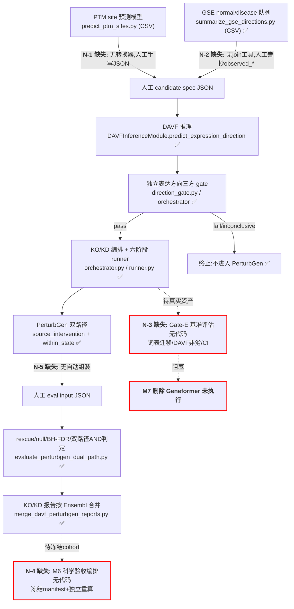

# PTM2CellNet 项目代码与文档综合分析报告（2026-09-10）

> 本报告为当前权威分析。上一版 `project_analysis_20260901.md` 已归档至
> [`archive/20260910/reports/`](archive/20260910/reports/)，完整历史可用
> `git log --follow` 追溯。

## 目录

- [1. 摘要](#1-摘要)
- [2. 版本控制与验证基线](#2-版本控制与验证基线)
  - [2.1 合并前后版本号与关键修改点](#21-合并前后版本号与关键修改点)
  - [2.2 编译与验证结果](#22-编译与验证结果)
  - [2.3 当前环境](#23-当前环境)
- [3. 文档与报告归档](#3-文档与报告归档)
- [4. 任务1：未实现功能项识别与记录](#4-任务1未实现功能项识别与记录)
  - [4.1 未实现功能模块表](#41-未实现功能模块表)
  - [4.2 缺失接口清单](#42-缺失接口清单)
  - [4.3 未实现业务流程（流程图）](#43-未实现业务流程流程图)
  - [4.4 对既有报告结论的对抗性纠正](#44-对既有报告结论的对抗性纠正)
- [5. 任务2：未完全实现功能梳理](#5-任务2未完全实现功能梳理)
  - [5.1 完成度评估表](#51-完成度评估表)
  - [5.2 缺失关键组件与依赖](#52-缺失关键组件与依赖)
  - [5.3 文档原文与实际实现对比](#53-文档原文与实际实现对比)
  - [5.4 三分类清单](#54-三分类清单)
  - [5.5 E2E gate 绕过验证与测试 mock 占比](#55-e2e-gate-绕过验证与测试-mock-占比)
- [6. 任务3：技术债识别、分类与解决策略](#6-任务3技术债识别分类与解决策略)
  - [6.1 严重度分级标准](#61-严重度分级标准)
  - [6.2 新增债务清单](#62-新增债务清单)
  - [6.3 高/中等级债务解决策略](#63-高中等级债务解决策略)
- [7. 验证结果与证据边界](#7-验证结果与证据边界)
- [8. 子智能体执行统计](#8-子智能体执行统计)
- [9. 结论与建议](#9-结论与建议)

## 1. 摘要

本轮完成三部分工作：**版本控制收口**（未提交的 9 月批次工作按 5 个逻辑提交合入 main，远程无新提交、快进合并确认无冲突）、**文档归档**（7 个过期点时报告移入 `archive/20260910/`）、**对抗性技术分析**（3 个子代理并行审查 + 主链验证）。

核心结论：

1. **项目实现度高于其文档声明**。2026-09-01 报告的 U-03/TD-N-48/TD-N-57（"direction gate 未接入生产管线"）已被 9 月新增的 `orchestrator.py` + `run_davf_perturbgen_e2e.py` 解决；方案 §10 的"M4 未开始"也已过时（schema v2 注入已全面落地）。真正的缺口集中在**主线衔接环节**（5 项，§4.1）而非核心模块。
2. **发现 3 个结构性断点**（均为本轮新发现，子代理验证）：E2E 只产 `mask` 模式数据而正式 KO 判定要求 `mask/pad/delete` 三模式（`orchestrator.py:48-51` vs `dual_path.py:85`），E2E 自产数据在正式判定下永远 `inconclusive`；matched null 与多 seed 均只有消费端、无生成/编排端；`davf_score` 字段空转恒为 `None`。
3. **新增技术债 16 项**（TD-NEW-01～16），其中高 4 项：UniProt 批量映射 >500 基因静默截断、Geneformer 词汇表无基因语义（哈希陷阱）、`organism` 参数被静默忽略、**mypy 错误从基线 23 涨至 80**（本轮新增代码引入 57 个，违反"技术债不新增"约定）。
4. **验证基线刷新**：全量离线回归 **2475 passed / 15 skipped / 0 failed**（729s，较 2026-09-01 基线净增 118 个通过用例）；compileall、`ruff check`、requirements 一致性全绿；`pip check` 仍 3 个共享环境冲突（既有债）。

## 2. 版本控制与验证基线

### 2.1 合并前后版本号与关键修改点

| 项目 | 记录 |
|---|---|
| 合并前 HEAD（本轮提交前） | `ff1d7c5`（fix: add RustDesk IBus repair script） |
| 远程同步检查 | `git fetch origin` 后 `git rev-list --left-right --count main...origin/main` = `55 0`，本地包含远程全部提交 |
| 快进合并 | `git merge --ff-only origin/main` 输出 `Already up to date.`，**无冲突** |
| 合并后 HEAD（本节时点） | `25edec2`（收尾提交见 §9.4） |

本轮 5 个逻辑提交（未提交工作区 → main，共 +13,699/-264 行）：

| 提交 | 信息 | 关键修改点 |
|---|---|---|
| `d2ee34f` | feat: add LatentDAVF scPerturb training pipeline with checkpoint contract | 26 文件 +5418：scPerturb pair/dataset 构建器、train/eval/validate 脚本、schema-v2 checkpoint contract、KO/KD baseline 配置 |
| `971da52` | feat: add GSE normal/disease donor pipeline for DAVF direction evidence | 8 文件 +1495：GSE 队列摄取（normal/disease 配对、raw counts、Ensembl）、scVI 训练与方向汇总脚本 |
| `a2a36ed` | feat: add IBD dataset QC integration | 5 文件 +1501：IBD loader + QC 门控 + 集成入口 |
| `d3a2f55` | feat: gate DAVF-PerturbGen E2E through strict orchestrator | 30 文件 +5216/-237：orchestrator（三方 gate 编排）、dimensions、E2E/merge CLI、davf_inference/scvi_adapter/ptm_direction_mapper 扩展 |
| `25edec2` | chore: update dataset manifests, analysis deps and status docs | 6 文件 +269/-25：datasets manifest 登记 GSE/IBD、analysis 依赖、CURRENT_STATUS、IBus 脚本迭代 |

### 2.2 编译与验证结果

执行时间 2026-09-10，全部在提交后工作树上运行：

| 检查 | 命令 | 结果 |
|---|---|---|
| 编译 | `python -m compileall -q src scripts tests` | **通过**（exit 0） |
| 静态检查 | `ruff check src scripts tests`（ruff 0.15.15） | **All checks passed** |
| 全量离线回归 | `python -m pytest -m "not slow and not gpu and not real_assets" --timeout=600 -q` | **2475 passed / 15 skipped / 7 deselected / 54 warnings，729.03s，exit 0** |
| 类型检查 | `python -m mypy src/ --ignore-missing-imports` | **80 errors / 17 files**（基线 23 → 恶化，见 TD-NEW-16） |
| 依赖契约 | `python scripts/check_requirements_consistency.py` | OK（274 lock pins 满足全部核心约束） |
| 环境冲突 | `python -m pip check` | 3 个共享解释器冲突（既有 TD-N-34，无新增） |

### 2.3 当前环境

主进程 conda `SSH_unit`（Python 3.12.13、PyTorch 2.4.1+cu118、pytest 9.0.3）；`ruff` 为用户级安装（`~/.local/bin/ruff` 0.15.15）；项目 `.venv` 不含 pytest/mypy，验证一律使用主解释器。PerturbGen 独立环境 conda `perturbgen`（Python 3.11）不变。

## 3. 文档与报告归档

**判定标准**：①生成时间超过 30 天；②结论已被后续综合报告重新核验取代、无法反映当前 DAVF→PerturbGen 主线状态；③点时检测/修复报告性质（非现行需求或指南）。

| 文件 | 原路径 | 归档前 blob | 处置 |
|---|---|---|---|
| E2E训练与推理代码修复报告_2026-08-08.md（及 _v2） | docs/ | `4e1c775cf3b2` / `0f56171bdfd4` | git mv → `archive/20260910/reports/` |
| E2E训练与推理现状分析_2026-08-08.md | docs/ | `0c5d22239edb` | 同上 |
| E2E训练和推理能力评估报告_2026-08-04_v2.md | docs/ | `f3cef0df0780` | 同上 |
| r01_r03_systematic_repair_report_20260808.md | docs/ | `314d4510c5db` | 同上 |
| td01_td02_technical_summary_20260808.md | docs/ | `c162c5fdc815` | 同上 |
| 问题修复与系统性复核报告_2026-08-04.md | docs/ | `b6e702d58820` | 同上 |
| project_analysis_20260901.md | 根目录 | （收尾提交时记录） | 被本报告取代后 git mv 归档（同上） |

配套修改：`docs/index.rst` toctree 移除 7 个条目（防 Sphinx 死链）；新增 [`archive/20260910/MANIFEST.md`](archive/20260910/MANIFEST.md)（含时间戳、基线提交、归档前 blob 哈希）与 README。

**保留决策**（审查后确认不过时）：根目录 12 个 `project_*_202608xx.md` 为"历史快照入口"指针 stub（正文早已归档，功能是防误读，链接完好）；`docs/DAVF_PerturbGen_双路径整合方案与测试方案_2026-08-21.md` 为现行需求基线；`docs/PTM2CellNet_{项目,技术,文件说明}文档.md` 为指向现行文档的入口 stub；`docs/DATA_UPDATE_WORKFLOW.md` 为有效操作指南且无对被归档文件的引用。

## 4. 任务1：未实现功能项识别与记录

需求基线：`.planning/REQUIREMENTS.md`（v2.1/v2.2，24 项已声明 Complete）+ 双路径方案（2026-08-21）+ `lessons.md` L-2026-0901-01 主线架构决策。已取消范围（实时质谱流、自定义 PTM 数据库、GUI、API-key 扩展）不计。

### 4.1 未实现功能模块表

"未实现"定义为**已明确定义且完全无对应代码**（区别于第 5 节的部分实现）。经关键词矩阵搜索（src/scripts/tests/configs 四域）逐项验证，共 5 项，全部集中在主线**衔接环节**与**验收工具层**：

| # | 功能名 | 需求文档章节引用 | 搜索验证摘要 | 优先级 | 影响范围 |
|---|---|---|---|---|---|
| N-1 | PTM site 预测输出 → `PTMSiteDirectionProposal` 自动转换器（主线第一→第二环衔接） | `lessons.md` L-2026-0901-01；方案 §4.1 工作流 A；e2e CLI 文档 `provenance: "ptm-site-model/run-1"` 示例 | `grep -rn "site_probability\|proposed_direction" src scripts` 仅命中 `run_davf_perturbgen_e2e.py` 手工 JSON 解析；`predict_ptm_sites.py:294-357` 输出纯 CSV，无代码读取它生成 proposal；`tests/real_assets/test_real_davf_perturbgen_bridge.py:103` 的 `site_probability=0.95` 为硬编码 | 高 | 核心（当前须人工手写 candidate JSON） |
| N-2 | 独立表达方向证据 → gate `observed_*` 字段自动 join | 方案 §4.3（"以 held-out-safe normal/disease 差异表达方向为准"）；L-2026-0901-01 | `summarize_gse_directions.py` 产出 `direction_evidence.csv`（donor 级 log2fc/fdr/direction），但排除生产者后 `grep -rn "direction_evidence" src scripts` **零命中**——无任何下游消费者；observed 字段须人工誊抄进 JSON | 高 | 核心（三方 gate 的独立表达一方靠人工转录，有誊抄出错风险） |
| N-3 | Gate-E 词表迁移与非劣基准评估工具 | 方案 §5.4（≥200 PTM→gene 样本固定划分 bootstrap 95% CI；基因覆盖率 ≥99%、token collision=0、action code 迁移前后 100% 不变；DAVF 较旧冻结基线下降 ≤1pp 且 CI 非劣）；§7.2 M4；§5.1 T5 | `grep -rni "gate_e\|GateE\|gene_coverage\|token_collision\|action_code\|noninferiority\|non_inferior" src scripts tests` **零命中**（仅无关 `GATE_ENV`）；训练脚本 argparse 无基准对比入口 | 高 | 核心（工作流 B 收口；M7 删除 Geneformer 的强制前置） |
| N-4 | M6 冻结队列科学验收编排（冻结 cohort/candidate manifest + 独立重算复核） | 方案 §7.2 M6（files：冻结 cohort manifest、候选 manifest、统计报告；verify：独立重算、bootstrap CI、donor/候选泄漏审查） | `grep -rn "frozen_cohort\|cohort_manifest\|candidate_manifest" src scripts configs` **零命中**；统计内核（seeds/null/BH-FDR/bootstrap CI）已在 `results.py`/`dual_path.py` 实现，仅缺 manifest 契约与重算入口 | 中（被真实 cohort 缺失阻断执行，但工具契约可先建） | 核心 |
| N-5 | E2E 输出 → dual-path 评估输入自动组装 | 方案 §7.2 M3 done（"报告可从 manifest 完整重放"）；§4.6.4 | `run_davf_perturbgen_e2e.py` 产出 e2e JSON，`evaluate_perturbgen_dual_path.py` 要求另一格式 `perturbgen_dual_path_eval/v1`，两者间**无任何转换/组装代码** | 中 | 次要（工程闭环断点，手工衔接易不一致） |

反向占位检查：全仓 `TODO|FIXME|NotImplementedError|XXX|HACK` 仅 2 命中（`src/models/encoders.py:19` 抽象方法、`signaling_network.py:286` 验收文案注释），**无需求占位**。

### 4.2 缺失接口清单

| 接口名称 | 需求出处 | 预期参数与返回值（需求原文） | 用途 | 当前替代路径 |
|---|---|---|---|---|
| PTM-site-model 输出 → proposal 转换器（如 `build_proposals_from_ptm_sites(csv_path)` 或 `--ptm-site-predictions` CLI 参数） | 方案 §4.1 工作流 A | 输入位点预测结果（gene/position/ptm_type/probability），输出 `PTMSiteDirectionProposal(gene_symbol, ensembl_id, position, ptm_type, proposed_direction, site_probability, provenance)`（§4.3 契约） | 主线第一环自动供源 | 人工手写 candidate spec JSON |
| direction-evidence join 工具 | 方案 §4.3 方向规则表 | 输入 donor 级 `observed_log2fc/observed_fdr/observed_direction`（§4.3：`Literal["up","down"]`），按 gene+cell_type 匹配候选 | 三方 gate 独立证据自动注入 | 人工从 CSV 誊抄到 JSON |
| Gate-E 评估 CLI | 方案 §5.4 Gate-E；§7.2 M4 | 词表覆盖率/collision/action-code 一致率 + 新旧 DAVF 配对指标 + bootstrap 95% CI | M4 完成判定与 M7 前置门 | 无（无代码无替代） |
| 冻结 cohort manifest schema + 独立重算入口 | 方案 §7.2 M6 | 冻结 cohort/候选 manifest、统计报告、原始配置与日志；独立重算报告 | Gate-5 科学验收的可追溯载体 | 无 |
| e2e→eval 输入组装器 | 方案 §7.2 M3 done | 从 e2e JSON 的 stage manifest 绑定的 h5ad 生成 `perturbgen_dual_path_eval/v1` 输入（candidates[].candidate / h5ad 路径 / donor 切分） | 消除手工组装错误 | 人工组装 eval JSON |

### 4.3 未实现业务流程（流程图）

| 流程名 | 主/分支 | 缺失环节 | 需求引用 |
|---|---|---|---|
| PTM site → DAVF 自动供源 | 主流程 | 预测 CSV 与 proposal 间无转换代码 | L-2026-0901-01；方案 §4.1 |
| 独立表达证据 → gate 自动注入 | 主流程 | `direction_evidence.csv` 无消费者 | 方案 §4.3 |
| E2E → 评估重放闭环 | 主流程 | 两套 JSON schema 间无组装器 | 方案 §7.2 M3 |
| Gate-E 词表迁移验证 | 分支 | 基准集/覆盖率/配对比较全部无代码 | 方案 §5.4、§7.2 M4/T5 |
| M6 冻结队列验收编排 | 主流程（终段） | 冻结 manifest/独立重算/泄漏审查无代码 | 方案 §7.2 M6 |

### 4.4 对既有报告结论的对抗性纠正

以下"未实现"声明经代码验证**已过时**，本报告予以纠正：

| 旧结论（出处） | 代码验证 |
|---|---|
| "U-03 生产管线不调用 direction gate"（project_analysis_20260901 §1.2.4） | **已解决**：`scripts/run_davf_perturbgen_e2e.py:184` 经 `DAVFPerturbGenOrchestrator.prepare_candidates` 在生产路径调用 `build_direction_gated_candidate`（`orchestrator.py:253`） |
| "M4 DAVF runtime 注入未开始"（方案 §10、lessons L-2026-0822-03） | **已实现**：`davf_inference.py:289-323` schema v2 注入、`architectures.py:251-277` 拒绝旧配置、`train_latent_davf.py:285-317`/`build_davf_latent_pairs.py:648-667` 均接入 asset |
| TD-N-48/57"gate/mainline 无生产调用" | gate 段已被 orchestrator 覆盖；`mainline.evaluate_davf_perturbgen_candidate` 语义由 orchestrator（gate）+ `evaluate_perturbgen_dual_path.py`（判定）组合实现，属入口冗余而非缺口 |
| 方案 §4.4 的 14 个新增文件 | 逐一核对**全部存在**（contracts/env_guard/data_prep/config_builder/runner/results/dual_path/reports/embedding_export/gene_vocabulary/perturbgen_embedding/3 脚本/configs 模板） |

**被外部资产阻断（非代码缺口，不计入未实现）**：M0/Gate-0 真实权重执行（工具已存在）、M7 删除 Geneformer（被 Gate-E 阻断，runtime 已迁移）、Replogle/scGeneScope loader（`data/manifests/datasets.yaml:790-860` 显式 `loader: null` 是 DATA-01 资产显式契约设计，属"资产未提供"而非"loader 未实现"）、Gate-4/5 真实证据（硬门已建，按设计 skip）。

## 5. 任务2：未完全实现功能梳理

### 5.1 完成度评估表

完成度为**工程闭合度**（非测试覆盖率/模型准确率/生物学完成度），计算口径在"口径"列明示（分母=需求点数，分子=实现数），全部经代码逐点核验：

| 功能模块 | 完成度 | 计算口径 | 主要证据 |
|---|---:|---|---|
| perturbgen 契约与方向 gate | **93.8%** | 8 个需求点实现 7.5（`davf_score` 恒 None 计 0.5） | `direction_gate.py:36-127,164`；`test_direction_gate.py`（8 用例含 zero-fallback 拒绝） |
| 数据预检 data_prep/gene_vocabulary | **100%**（代码面） | 8/8（raw counts、无版本 ENSG、≥3 donor、resolver 禁 hash 等） | `data_prep.py:38-125,276-289`；`gene_vocabulary.py:53-105`；0 mock 测试 |
| 外部运行器 runner/config_builder/env_guard | **100%**（mocked 面） | 11/11（六 stage、GPU 锁、timeout、指纹 resume、磁盘门、schema 校验） | `runner.py:328-421,528-549`；`test_runner.py`（466 行） |
| 双路径统计 results/dual_path | **83.3%** | 12 点实现 10；**matched null 生成端 0 分、KO 三模式数据生成 0 分** | `results.py:206-455`（消费端齐全） |
| DAVF→PerturbGen E2E 编排 | **代码面 100% / 工作流全链 66.7%** | 代码 8/8；全链另加 4 个科学执行点（3 seeds、≥99 null、held-out donor、真实 cohort）全 0 → 8/12 | `orchestrator.py:263-299`；`test_orchestrator.py` |
| DAVF runtime（schema v2/资产注入/index 分离） | **90.0%** | 10 点实现 9；Gate-E 配对实验 0 分 | `davf_inference.py:789-812,988-1006`；真实 KO/KD checkpoint 在 `checkpoints/davf/` |
| PTM 方向映射 | **85.7%** | 7 点实现 6；默认构造仍回退 Geneformer loader 0 分（M7 未做） | `ptm_direction_mapper.py:230-232,309-368`；`geneformer_embedding.py:250-305` |
| scVI 适配 | **100%** | 8/8（encode/decode/维度校验/decoder index 唯一来源） | `scvi_adapter.py:754-827`；`test_scvi_adapter.py`（mock 约 6%） |
| DAVF 数据线（scPerturb/GSE/latent pairs） | **KO/KD 实跑 88.9%** | 9 点中 8 个代码契约实现且 KO/KD 已真实训练；GSE 真实 cohort 执行 0/1 | `latent_davf_dataset.py:214-284`；`checkpoints/davf/davf_{ko_dixit,kd_nadig}` |
| IBD 分析线 | 代码面完整，验收未定义 | 不在 v2.1/v2.2 与方案需求集内，按模块自述功能全部实现 | `ibd_dataset.py:1-25`；`gene_mapper.py:142-187`（TD-N-24 修复） |
| 测试分层（方案 §5.1 T1–T5） | **60%** | T1/T2/T3 存在；T4 无自动化、T5 不存在 → 3/5 | `tests/{unit,integration,real_assets}/` 清单 |
| 方案 M0–M7 里程碑整体 | **43.8%** | M1/M2/M3 工程面完成、M5 计 0.5；M0 BLOCKED、M4/M6/M7 未开始 → 3.5/8 | 方案 §10 与代码互证 |

### 5.2 缺失关键组件与依赖

| 模块 | 组件类型 | 描述 | 证据 | 需求出处 |
|---|---|---|---|---|
| perturbgen 统计 | 代码（null 生成端） | ≥99 个匹配 null 的选择/运行/分层复用完全无代码；eval CLI 只从外部 JSON 读 `null_distribution_path` | 全仓 grep `null_distribution` 仅消费端 | 方案 §4.7 |
| E2E 编排 | 代码（KO 敏感性模式） | 正式 KO 判定要求 mask/pad/delete，orchestrator 只能产 mask/overexpress，`PerturbGenInvocation` 显式拒绝 pad/delete | `dual_path.py:85` vs `orchestrator.py:48-51,86-87` | 方案 §4.3、§4.7 条件 5 |
| E2E 编排 | 代码（多 seed） | 3 seeds 无编排入口；评估按 seed 分组消费但没人生成多 seed 运行 | e2e CLI 无 seed 参数 | 方案 §4.7 |
| 质量门 | 代码（输入计算路径） | `evaluate_unperturbed_quality` 只有评估器，DEG 方向恢复等计算输入无 CLI/流水线产生 | grep `deg_direction_recovery` 仅评估器与测试 | 方案 §5.4 |
| Gate-E | 数据/基准 | ≥200 可追溯 PTM→gene 基准集、旧冻结基线、配对比较全部不存在 | 无对应代码/配置 | 方案 §5.4 |
| T4 科学验收 | 测试 | 冻结 cohort + evidence JSON 的 release-gate 测试不存在 | `tests/real_assets/` 清单 | 方案 §5.1 |
| 真实队列 | 数据依赖 | 30 个本地 scPerturb 中 0 个满足正式契约 | `outputs/perturbgen/spike/20260903_donor_audit/evidence.json` | 方案 §9 |
| 候选证据 | 数据字段来源 | `CandidateEvidence.davf_score` 无生产者，恒 None | `direction_gate.py:164` | 方案 §4.3 |
| Geneformer 退役 | 代码清理（M7） | 默认 mapper 构造、`latent_davf.py:20` 导入、专属资产与测试仍在 | `architectures.py:279` | 方案 M7 |

### 5.3 文档原文与实际实现对比

| 文档原文（契约） | 实际实现 | 差异判断 |
|---|---|---|
| §4.3 `PathResult.output_h5ad: str`（必填） | `contracts.py:372` `str \| None = None` | 字段弱化（非 evaluable 状态允许无 h5ad，可辩护） |
| §4.3 `davf_score: float \| None` 随候选记录 | `direction_gate.py:164` 恒 None；`DAVFDirectionEvidence` 无 score 字段（仅可选 confidence，从不填充） | **部分实现：字段在、语义空** |
| §4.3"KO/KD：mask 主模式，pad/delete 敏感性" | orchestrator 仅产 ko→mask、oe→overexpress；invocation 拒绝其余 | **功能缺口：E2E 产出永远无法满足 §4.7 条件 5，KO 候选只能 inconclusive** |
| §4.7 条件 2"两路径 `median(rescue_excl_target) > 0`" | `dual_path.py:156-158` 任一 seed rescue≤0 即 fail | **比规范更严**（median>0 但单 seed=0 时规范应 PASS、实现 FAIL），文档未同步 |
| §4.3"若由 DAVF 直接给表达方向，必须新增并验证 gene-level delta 契约" | `predict_expression_direction`（`davf_inference.py:956-1133`）强校验三重 provenance | **符合且超出**（常被误读为缺口） |
| AGENTS.md"编排器和 runner 不得绕过 DAVF gate" | gate 强制只在 orchestrator→e2e 一条链；`run_perturbgen_pipeline.py:63-105` 直接从 YAML 跑六阶段零 gate 要求；`PerturbGenInvocation` 可手工构造 | **规范执行不一致**（详见 §5.5） |
| §2.3/§4.5"未知 gene 不得哈希" | 严格路径不哈希；默认构造路径仍有 sha256 取模 + 随机 embedding fallback | **新链路合规、历史路径保留哈希——两套语义并存** |
| §4.5"不做 silent partial load" | `davf_inference.py:840-852` 无版本 checkpoint 用 `strict=False`（仅 feature 路径，正式路径已封锁） | 部分路径允许，被契约标志隔离 |

### 5.4 三分类清单

判断标准：
- **部分实现但可用**：核心路径代码完整且测试通过，缺的是外部资产/科学执行/增强功能。
- **实现但有缺陷**：存在已知断点、边界问题或自相矛盾行为，可复现地导致功能无法达成声称目标。
- **实现但不符合规范**：行为与需求文档/项目指令定义不一致。

| 分类 | 项 | 证据 |
|---|---|---|
| 部分实现但可用 | PerturbGen 工程层 M1–M3；DAVF 底座 M4（缺 Gate-E）；eval 重放 CLI；IBD 分析线；GSE 证据线 | `test_perturbgen_pipeline_mocked.py`；`checkpoints/davf/` |
| 实现有缺陷 | ① E2E 只产 mask 模式 vs 正式判定要三模式（**生成端/评测端契约互相够不着，E2E 自产数据下 KO 候选永远 inconclusive**）；② matched null 只有消费端；③ `davf_score` 空转；④ 多 seed 无编排端；⑤ 默认 mapper 哈希/随机回退仍可达且零告警 | `orchestrator.py:48-51` vs `dual_path.py:85,161-188`；`results.py:398-430`；`direction_gate.py:164`；`geneformer_embedding.py:250-305` |
| 实现但不符合规范 | ① `run_perturbgen_pipeline.py` 旁路（不要求 gate 证据直接跑含 perturb 的六阶段）；② 库级绕过（手工构造 invocation，`run_perturbgen`/`build_candidate_stage_plans` 不校验 gate 状态）；③ `dual_path` 严格度高于文档；④ `output_h5ad` 可选化 | `run_perturbgen_pipeline.py:57-105`；`orchestrator.py:315-344,429-473` |

### 5.5 E2E gate 绕过验证与测试 mock 占比

**gate 不可绕过性结论：E2E CLI 链内成立；库级与旁路 CLI 可绕过，"不得绕过"目前靠使用约定而非代码强制。**

链内不可绕过的证据：invocation 仅在 `gate.status == "pass"` 时构造（`orchestrator.py:263-289`）；gate 拒绝 zero/synthetic/random 来源、缺 provenance、近零 delta、FDR 超阈、三方不一致（`direction_gate.py:71-116`，有专门回归 `test_zero_fallback_davf_evidence_cannot_pass`）；`--run-perturbgen` 只执行有 invocation 的候选（`run_davf_perturbgen_e2e.py:217-219`）。

可绕过的面（3 条）：`scripts/run_perturbgen_pipeline.py:57-105`（任意 YAML 直跑六阶段）；库级手工构造 `PerturbGenInvocation`（`orchestrator.py:315-344` 不校验 gate）；`evaluate_perturbgen_dual_path.py:44-75`（评估输入全由外部提供，不校验 DAVF 证据）。

**测试 mock/synthetic 占比**（文件级实测，2026-09-10）：

| 测试层 | 文件数 | 含 mock/patch | 占比 |
|---|---|---|---|
| tests/unit | 162 | 58 | 35.8%（其余大量 synthetic fixture） |
| tests/integration | 24 | 3 | 12.5%（perturbgen mocked 文件按 T2 设计为 mock） |
| tests/e2e | 7 | 4 | 57.1% |
| tests/real_assets | 7 | 0 | 0%（默认按设计 skip） |

关键模块：perturbgen 契约/统计测试 0 mock / 100% synthetic；orchestrator 测试的 DAVF 段 100% fake（gate 逻辑本身真测）；`test_davf_inference.py`（662 行）mock 约 1%；`test_scvi_adapter.py`（338 行）mock 约 6%；真实桥接测试用真 checkpoint+真 scVI 但 context 为合成单细胞且止步于外部 PerturbGen 训练之前。

## 6. 任务3：技术债识别、分类与解决策略

本节登记**现有报告（TD-N-06/11/24/25/33/34/35~58 系列）未覆盖的新债**。既有债状态更新见 §6.2 末行。

### 6.1 严重度分级标准

| 级别 | 判定标准 |
|---|---|
| **严重** | 直接阻塞主线（PTM site → DAVF gate → PerturbGen），或产生静默错误数据、破坏数据正确性且当前可达、无可接受绕行 |
| **高** | 功能性缺陷：接口语义错误、核心路径有效性受损、可复现的数据丢失风险；或重大维护负担（一处改动多点故障） |
| **中** | 可维护性/效率问题：重复代码、风格分裂、性能反模式、契约无守护；不改变正确性但持续增加成本 |
| **低** | 风格、次要文档、仓库卫生问题；不影响主线 |

本轮**未发现"严重"级**（正式 LatentDAVF 主线由 manifest 资产与 gate 守护，未踩中新债）。

### 6.2 新增债务清单

| 编号 | 类别（SonarQube 口径） | 级别 | 描述 | 证据 |
|---|---|---|---|---|
| TD-NEW-01 | bug（静默数据丢失） | 高 | UniProt REST fallback 只取第一页 500 条、无分页；`map_genes_batch` 不分批提交，>500 基因时第 501+ 个映射静默丢弃计入 failed→None、无 warning。核心环境不含 `uniprot-id-mapper`（仅 requirements-analysis），默认走此 fallback | `src/analysis/gene_mapper.py:108-112,316` |
| TD-NEW-02 | bug（词汇语义失效+哈希陷阱） | 高 | Geneformer 真实加载路径词汇表是 `{str(i):i}` 整数字符串，从未加载 vocab.json：默认 mapper 的 symbol 查询永远 miss → 全部 mask；`get_gene_embedding` 对未命中基因 sha256 取模静默哈希到随机行**并把哈希写回词汇表污染后续查询**。区别于 TD-N-55（那是模型加载失败分支，有全局 flag），此为加载成功但词汇无语义，完全静默 | `src/models/geneformer_embedding.py:147,300-304`；`ptm_direction_mapper.py:353,360-364` |
| TD-NEW-03 | code smell（接口契约欺骗） | 高 | `map_gene_to_uniprot/map_genes_batch` 的 `organism` 参数被接收写进 docstring 但从不传给底层（`_get_mapper_results` 只收 ids）；传小鼠 taxId 仍返回人类映射，无提示 | `src/analysis/gene_mapper.py:211-232` |
| TD-NEW-04 | maintainability（封装破裂） | 中 | 跨模块私有属性访问：mapper 读 loader 的 `_gene_to_idx`、orchestrator 读 davf 模块的 `_embedding_symbol_to_ensembl`；`getattr(obj,"_x",{})` 把重构失败变成"全部 miss" | `ptm_direction_mapper.py:353`；`orchestrator.py:349` |
| TD-NEW-05 | code smell（风格分裂） | 中 | 可选依赖边界 4 种并存风格（LazyImport / 模块级 flag / require 工厂 / 内联 try），全仓 62 处 `except ImportError`，新代码无从遵循 | `src/analysis/__init__.py:15`；`scvi_adapter.py:66-72`；`ibd_qc.py:30-48`；`davf_scperturb.py:556-560` |
| TD-NEW-06 | maintainability（常量漂移） | 中 | `FORMAL_DAVF_NUM_GENES = 4018` 在 3 个文件独立定义互不导入；不一致时无测试失败 | `davf_checkpoint_contract.py:32`；`gse_normal_disease.py:32`；`davf_scperturb.py:34` |
| TD-NEW-07 | code smell（超长函数） | 中 | >150 行函数 9 个：`create_tech_doc.py:19` 1450 行、`train.py:57` main 520 行、`check_perturbgen_release_evidence.py:113` 312 行、`train_lightning.py:125` 294 行、`davf_scperturb.py:527` 279 行等（AST 实测） | 见左 |
| TD-NEW-08 | code smell（重复代码） | 中 | `load_from_dbptm/epsd/cplm` 三函数 100% 同构（约 120 行复制粘贴，仅差 source 标签与列序） | `src/data/loaders/ptm_database_loaders.py:138-258` |
| TD-NEW-09 | bug 风险（路径猜测） | 中 | `variant_workflow._resolve_model_path` 用 cwd 相对路径探测 + `best_model.pt→best.pt→model_path` 猜测链，仅 warning；违反"不猜路径/checkpoint、不用最新文件替代 manifest"规则 | `src/analysis/variant_workflow.py:72-92` |
| TD-NEW-10 | performance（pandas 反模式） | 中 | 热路径逐行循环：`pmads_ridge._feature_matrix` iterrows 构特征矩阵（O(n·m)）；`predict.py:608`、`predict_ptm_sites.py:402` 批量推理 iterrows；`datasets.py:604-612` 预 tokenize 全表逐行且全量驻留内存无上限 | `src/baselines/pmads_ridge.py:352`；`src/data/datasets.py:604` |
| TD-NEW-11 | performance | 低 | 单基因映射 = 3 个 HTTP 请求，循环内逐基因调用，batch 接口闲置 | `ptm_direction_mapper.py:360` |
| TD-NEW-12 | maintainability | 低 | 51 个脚本各自 sys.path hack，`_ensure_project_root` 复制 12 份 | `scripts/train.py:16-20` 等 |
| TD-NEW-13 | code smell | 低 | 必填参数 >8 的函数 26 个（最多 22 个） | `ibd_dataset.py:127`；`results.py:458` |
| TD-NEW-14 | 仓库卫生 | 低 | 桌面运维脚本混入项目 scripts/ | `scripts/fix_rustdesk_ibus.sh` |
| TD-NEW-15 | maintainability | 低 | 超长函数同时承担解析+校验+汇总多职责（可与 TD-NEW-07 合并处理） | `results.py:458-574` |
| **TD-NEW-16** | **maintainability（类型契约回归）** | **高** | **mypy 错误从 2026-09-01 基线 23 涨至 80（+57），全部来自本轮 9 月新增/修改代码：`ibd_qc.py` 30、`gse_normal_disease.py` 18、`runner.py` 17、`results.py` 8、`scvi_adapter.py` 4 等；违反 CURRENT_STATUS 既有"mypy 基线无新增"约定。典型如 `src/api/routes/cross_scale.py:714` `str \| None` 传 `len`** | `python -m mypy src/ --ignore-missing-imports` → `Found 80 errors in 17 files`（主进程实测 2026-09-10） |

审查过但**确认无新债**的维度：循环依赖（Tarjan SCC 扫描 138 模块 0 环）；requirements/setup.py 一致性（274 pins OK 且有门禁）；TODO/FIXME（仅 1 处正则常量）；异常吞噬（2 处均在 progress_callback 保护上，合理）；`scripts/experimental/finetune_davf_e2e.py` 已标 DEPRECATED；O(n²) 同源矩阵已有 MinHash+LSH 近似路径；模块级测试盲区不存在（davf_losses、ptm loaders 均有覆盖，真实缺口是行为级的）。

**既有债状态更新**：TD-N-48/57（gate 未接线）→ **已解决**（orchestrator 落地，见 §4.4）；TD-N-47（asset 注入）→ 工程面已解决、Gate-E 验收仍缺；TD-N-36（ruff format 298 files）、TD-N-42（Pydantic v1 弃用警告，本轮 warning 数 54 中仍有）、TD-N-44（pip check 共享解释器冲突 ×3）→ 维持开放；TD-N-46（use_davf 静态开关）→ 维持部分修复。

### 6.3 高/中等级债务解决策略

#### TD-NEW-01：UniProt 映射 500 条截断（高）

- **问题与影响**：>500 基因批量映射静默丢结果，核心环境默认触发；影响基因映射、variant/PTM 注释归并，单细胞队列（几千基因）丢一半且不可察觉。
- **方案**：①（推荐）`_RequestsUniProtMapper.get` 内加分页 cursor 循环拉全页——修复彻底、调用方零改动，需处理 cursor 协议；② 调用方按 500 切块循环——改动最小，但直接调 `get()` 的未来调用方仍踩坑；③ `uniprot-id-mapper` 提级进 core——不推荐，外部包超时问题（TD-N-24）会重回核心环境。
- **步骤与时间**：实现 cursor 循环 → 加 ">500 ids 全返回"的 mock 测试（现有 `TestRequestsFallbackMapper` 只测小规模）→ 跑 `tests/unit/analysis/test_gene_mapper.py`。**1.0 天**。
- **资源与风险**：Python/REST 经验；UniProt cursor 协议变更需跟随，`_POLL_BUDGET_S=60s` 对多页可能不够需放宽或显式报错。

#### TD-NEW-02：Geneformer 词汇语义失效（高）

- **问题与影响**：真实资产加载后词汇仍无基因语义：默认 DAVF 方向映射全 mask；`get_gene_embedding` 被接线（DAVF 公开参数）即产出哈希噪声嵌入并污染词汇表。
- **方案**：①（推荐）加载 vocab.json 构建真实 `_gene_to_idx`，取不到 vocab 时 fail-fast，删除哈希写回逻辑——语义正确、符合"不猜映射"规则；② 保守收缩：哈希分支改显式 `raise KeyError` + geneformer 分支一次性 loud warning——0.5 天立刻消除静默，但默认路径仍全 mask（暴露而非修复）；③ 仅加 warning——不推荐，违反 Let it crash。
- **步骤与时间**：确认资产目录含 vocab.json → 实现加载 → 新增测试覆盖"未知基因必须抛错、已知基因命中真实行" → 全量回归。**方案 1 约 1.5 天 / 方案 2 约 0.5 天**。
- **资源与风险**：熟悉 HF 资产结构与 Geneformer tokenization；真实 vocab 会改变现有 fixture 的 gene id 期望值，需同步且不得把旧期望宣称为正式证据。

#### TD-NEW-03：organism 参数静默忽略（高）

- **问题与影响**：接口契约欺骗；跨物种输入拿到同源人类 UniProt ID 且无提示，产生语义错误数据。
- **方案**：①（推荐）`organism` 透传给 idmapping（支持 taxId 过滤），不支持过滤的路径在非 9606 时显式 `raise NotImplementedError`；② 删除 `organism` 参数（主线仅人类，生产调用均用默认值，破坏性实际可控）。
- **步骤与时间**：验证 taxId 参数 → 透传 + 非 9606 显式失败 → 补 `test_map_gene_to_uniprot_nonhuman_raises`。**0.5 天**。
- **资源与风险**：低；外部包若不支持需外包一层过滤。

#### TD-NEW-16：mypy 80 errors 类型回归（高）

- **问题与影响**：9 月批次新增代码引入 57 个类型错误（ibd_qc 30、gse_normal_disease 18、runner 17 为主），违反"mypy 技术债不新增"基线；类型契约失守会随新增代码继续滚大。
- **方案**：①（推荐）按文件分 3 个小 PR 清零新增 57 个（ibd_qc / gse_normal_disease / perturbgen runner+results 各一），恢复 23 基线后在 CI 加 `mypy` 增量门禁（新文件 0 error）；② 一次性全清 80 个——彻底但一次性工作量大（约 2.5 天）且混杂旧债难评审；③ 只修新增、不加门禁——回归会再次发生。
- **步骤与时间**：逐文件修复（多为 `Optional` 收窄、返回类型标注、`str|None` 判空）→ 每文件跑对应单测 → mypy 回到 23 → CI 增量门禁。**1.5 天**。
- **资源与风险**：mypy 经验；注意修复不得改变运行时行为（只加标注/判空），`runner.py` 的 17 个错误涉及 subprocess 返回类型需谨慎。

#### TD-NEW-04：跨模块私有属性访问（中）

公开访问器（property/函数）替代 `getattr(obj,"_x",{})`，缺失即 raise，加契约测试。**0.5 天**。风险低；保留 orchestrator alias 资产缺失的显式报错语义。

#### TD-NEW-05：可选依赖 4 种风格（中）

统一到现有 `LazyImport`（`src/utils/lazy_import.py`）：先写约定，按模块 3~4 个小 PR 收敛（scvi_adapter、ibd_qc、davf_scperturb 各一），保持现有错误消息语义。**1.5 天**。风险低。

#### TD-NEW-06：契约常量三处定义（中）

`davf_checkpoint_contract.py` 作唯一事实源，另两处改 import；`test_dimensions.py` 加同源断言。**0.5 天**。注意 data→models import 方向需实测不引入环（否则提独立 contracts 模块）。

#### TD-NEW-07/15：超长函数（中）

按优先级拆：`train.py main`（520 行）拆 load/configure/fit/evaluate 四段（**1.0 天**）；`build_scperturb_latent_pairs`/`validate_manifest`/`build_stage_plans` 抽子步骤（合计 **1.5 天**）；`create_tech_doc.py`（1450 行）为一次性文档工具，建议移 archive 而非重构（**0.5 天**）。行为等价靠现有 E2E 测试守护，拆分禁止顺手改逻辑。

#### TD-NEW-08：PTM loader 三胞胎（中）

合并为 `_load_generic_ptm_table(..., sep, accession_candidates, source, ptm_type)`，三个公开方法变 3 行委托保留 API；参数化测试覆盖三个 source。**0.5 天**。

#### TD-NEW-09：checkpoint 路径猜测链（中）

`_resolve_model_path` 要求显式 base_dir（不从 cwd 猜），找不到时直接 raise。**0.5 天**。需先 grep 确认依赖 warning 回退行为的调用方。

#### TD-NEW-10：iterrows/iloc 热路径（中）

① `pmads_ridge._feature_matrix` 向量化（先写 golden 数值等价测试再改，**1.0 天**）；② `predict.py`/`predict_ptm_sites.py` 批量循环改 `df.to_dict("records")`（**0.25 天**，2~5 倍提速）；③ `datasets.py` 预 tokenize 加 `max_cache_rows` 上限与按需退化（**0.5 天**）。

**执行顺序建议**：TD-NEW-01+03（同文件，1.5 天，数据正确性优先）→ TD-NEW-02 方案 2 先行（0.5 天消除静默）→ TD-NEW-16（1.5 天止住类型回归）→ TD-NEW-04/06（1.0 天契约守护）→ TD-NEW-08/09/10 快速项（1.25 天）→ TD-NEW-05/07 分批持续清偿。

## 7. 验证结果与证据边界

### 7.1 已执行命令（审计痕迹）

| 命令 | 结果 |
|---|---|
| `git fetch origin` + `git rev-list --left-right --count main...origin/main` | `55 0`（本地领先、远程无新提交） |
| `git merge --ff-only origin/main` | `Already up to date.`（无冲突） |
| `python -m compileall -q src scripts tests`（×2，提交前后） | exit 0 |
| `ruff check src scripts tests` | All checks passed |
| `python -m pytest -m "not slow and not gpu and not real_assets" --timeout=600 -q` | 2475 passed / 15 skipped / 7 deselected / 54 warnings / 729.03s / exit 0 |
| `python -m mypy src/ --ignore-missing-imports` | 80 errors / 17 files（TD-NEW-16） |
| `python -m pip check` | 3 conflicts（ptm2cellnet/NumPy、scgpt/scvi-tools、ssh-unit/torchaudio，均为既有共享环境债） |
| `python scripts/check_requirements_consistency.py` | OK（274 lock pins） |
| 归档操作 | `git mv` ×8（含 20260901 报告）+ `docs/index.rst` 同步修改 |

### 7.2 证据边界

- 全量回归为**离线**口径：大量 synthetic fixture/mock；真实跨尺度图/扰动数据、DAVF 生物学方向准确率、ESM-3/CPTAC、外部 UniProt/KEGG/Reactome、PerturbGen 外部环境和多 GPU DDP 验收仍需 `PTM2CELLNET_RUN_REAL_ASSET_TESTS=1` 与真实资产。
- 本轮真实资产测试**未执行**（资源未显式挂载）；因此"2475 passed"是工程契约证据，**不构成生物学验收**。
- 覆盖率门禁（CI branch `fail_under=74`）本轮未跑 `--cov`，不宣称覆盖率数值。
- 子代理结论均为只读代码验证，关键项（orchestrator gate、KO 三模式断点、null 无生成端）经交叉核对代码位置确认。

## 8. 子智能体执行统计

### 8.1 统计口径

主智能体外本轮共调用 3 个子代理（各 1 次，并行后台执行）；时长与工具调用数为平台返回的实际值；token 为子代理会话消耗。

### 8.2 统计表

| 子智能体（类型均为 general-purpose） | 调用次数 | 主要执行任务 | 执行时长 | 工具调用数 | token 消耗 |
|---|---:|---|---|---:|---:|
| 未实现功能项对抗审查 | 1 | 任务1：需求逐项对照 + 关键词矩阵搜索验证 + 流程图 | 456s（7.6 min） | 43 | 1,577,662 |
| 未完全实现功能梳理 | 1 | 任务2：完成度口径评估 + 三分类 + gate 绕过验证 + mock 统计 | 507s（8.5 min） | 51 | 4,160,346 |
| 技术债识别分级 | 1 | 任务3：六维度扫描 + AST/SCC 实测 + 分级与策略制定 | 553s（9.2 min） | 89 | 2,143,301 |
| **合计** | **3** | — | 平均 505s | 183 | 7,881,309 |

### 8.3 简要分析

三代理并行总墙钟时间约 9.2 分钟（取最长），串行需 25.3 分钟，并行节省约 64%。技术债代理工具调用最多（89 次，因需运行 AST/SCC/pip 等实测命令）；未完全实现代理 token 消耗最大（需通读 orchestrator/dual_path/runner 全文做逐点口径计算）。三份产出零重叠：任务 1 聚焦"无代码"项、任务 2 聚焦"有代码但未达需求"、任务 3 聚焦"现有报告未提的债"，汇总时仅做编号统一与交叉引用。主智能体另独立发现 TD-NEW-16（mypy 回归），未与子代理重复。

## 9. 结论与建议

### 9.1 已完成（本轮收口）

- 未提交的 9 月批次工作（LatentDAVF 管线、GSE 队列、IBD QC、PerturbGen orchestrator/E2E、清单与状态文档）按 5 个逻辑提交合入 main；远程同步、快进合并、编译、全量回归（2475 passed/0 failed）、ruff、requirements 契约全部通过。
- 7 个过期点时报告 + 被取代的 20260901 权威报告归档至 `archive/20260910/`（git mv 保留历史，MANIFEST 记录 blob 哈希与版本标签），`docs/index.rst` 同步更新。
- 对抗性审查产出：5 项未实现衔接项、12 模块完成度口径表、16 项新技债（高 4 / 中 7 / 低 5）及对应解决策略。

### 9.2 不能宣称完成

- 正式 DAVF→PerturbGen 生物学效用验收（Gate-0/E/4/5）：合规 normal/disease donor 队列仍为 0，E2E 自产数据在正式 KO 判定下只能 inconclusive（三模式断点，§5.4）。
- matched null 生成、多 seed 编排、`davf_score` 生产：方案 §4.7 正式判定链路缺这三条腿。
- Gate-E 工具与 M6 冻结验收编排：零代码。
- 覆盖率刷新与真实资产测试：本轮未执行。

### 9.3 建议顺序

1. **先补齐正式判定链的三条腿**（null 生成端、多 seed 编排、pad/delete 模式生成）——否则即使拿到合规 cohort，E2E 也产不出正式 PASS（预计 3~4 天）。
2. **主线自动化衔接**（N-1 PTM site 转换器、N-2 evidence join、N-5 eval 组装器，合计约 2 天）——消除人工誊抄出错面。
3. **数据正确性修复**：TD-NEW-01+03（1.5 天）→ TD-NEW-02 方案 2（0.5 天）。
4. **TD-NEW-16 mypy 清零新增 57 错误并加增量门禁**（1.5 天），守住类型基线。
5. Gate-E 工具与 M6 编排可在上述之后与真实 cohort 供给并行推进。

### 9.4 版本记录

- 本轮代码提交：`d2ee34f` → `971da52` → `a2a36ed` → `d3a2f55` → `25edec2`（前置 `ff1d7c5`）。
- 归档与报告收尾提交：本报告与 `archive/20260910/` 同批提交于 `25edec2` 之后（`git log --oneline -7` 可见，位于收尾首位的 `docs: archive stale reports and publish 2026-09-10 analysis`）。
- 工作树状态：收尾提交后干净；`main...origin/main` 保持领先、无分叉。

---

**报告方法说明**：版本控制与验证由主智能体在主上下文执行（命令与输出见 §7.1）；三项分析任务由 3 个并行只读子代理执行（§8），主智能体对其关键结论做了代码位置交叉核对；mypy 回归（TD-NEW-16）为主智能体独立发现。本轮未使用外部 skill。
