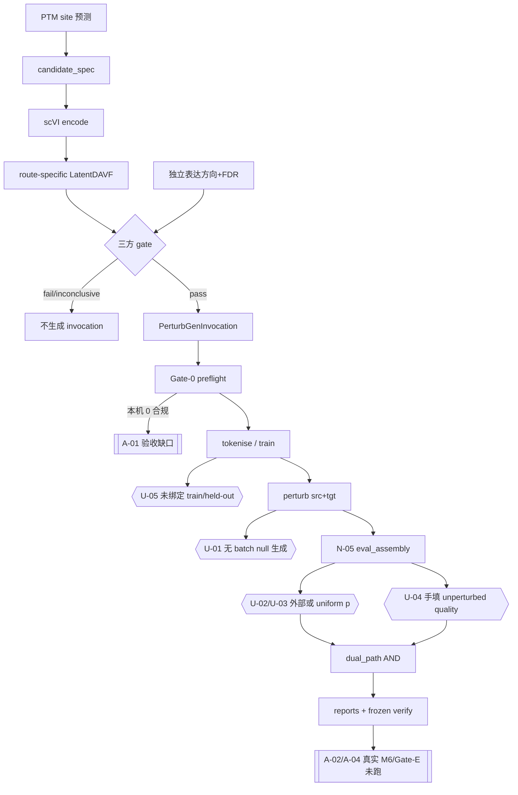

# PTM2CellNet 项目代码与文档综合分析（2026-09-13）

- **日期**：2026-09-13
- **仓库**：`/home/scu/PTM2CellNet`
- **Git**：提交前 `2cb77d8` → 修复提交 `6a194a1` → 本报告与归档提交见 §2
- **事实来源**：当前代码、测试、CI、`docs/CURRENT_STATUS.md`、`lessons.md` 最新条目、`docs/DAVF_PerturbGen_双路径整合方案与测试方案_2026-08-21.md`。历史报告只作背景。
- **可视化**：[project-analysis-20260913 canvas](/home/scu/.cursor/projects/home-scu-PTM2CellNet/canvases/project-analysis-20260913.canvas.tsx)

## 目录

- [1. 执行摘要](#1-执行摘要)
- [2. Phase 1：Git 与验证记录](#2-phase-1git-与验证记录)
- [3. Phase 2：归档记录](#3-phase-2归档记录)
- [4. Task 1：未实现功能](#4-task-1未实现功能)
- [5. Task 2：部分实现模块](#5-task-2部分实现模块)
- [6. Task 3：技术债](#6-task-3技术债)
- [7. 结论与建议](#7-结论与建议)
- [8. 子代理调用统计](#8-子代理调用统计)

## 1. 执行摘要

主线工程已经接通：PTM 候选 → LatentDAVF 方向证据 → 独立表达三方 gate → `PerturbGenInvocation` → 隔离六阶段 runner → 双路径 AND。2026-09-13 又把 runner 报告绑到当前 YAML 身份、把 KO/KD rescue 模式写成显式 route，并把 tokenise/`result_h5ad` lineage 写进评估输入。这些是代码事实，不是生物学 PASS。

本轮离线验证：`2578 passed, 21 skipped, 69 warnings in 798.65s`，exit 0；`ruff check` 通过；`mypy src/` 0 errors / 161 files；requirements consistency 通过。`ruff format --check` 仍有 **329** 个文件需格式化。`pip check` 仍有 3 个环境冲突。覆盖率未在本轮带 `--cov` 重测，CI 门禁仍是 branch `fail_under=74`。

科学闭环仍被四类**代码缺口**和一类**资产缺口**同时挡住：

1. 匹配 null 只有选择/汇总/loader，没有 batch stage 生成端。
2. 候选级 empirical-p 没有跨 path/mode/seed 聚合；`uniform_candidate_pvalue` 和手填 `unperturbed_quality_status` 仍可改正式 q/verdict。
3. `train_latent_davf.py` / E2E tokenise 不接收 `train_donors`/`held_out_donors`。
4. 本机 2026-09-13 donor audit：30 个 h5ad、26 可读、**0 个合规** `normal/disease + raw counts + explicit donor + ≥3 shared + Ensembl` 候选。

取消项（实时质谱流、自定义 PTM 库、GUI、新 API-key）不列入未实现。Gate-E 工具和 M6 verifier 已存在；缺的是 ≥200 真实基准和冻结队列，不是缺模块文件。

## 2. Phase 1：Git 与验证记录

### 2.1 版本标识

| 项 | 值 |
|---|---|
| 默认分支 | `main`（已检出） |
| 远程 | `origin` = `git@github.com:valleyhe/PTM2CellNET.git`（无 NAS remote） |
| 提交前 HEAD | `2cb77d8330699a1caa02d47603f460c6c9f4c320` |
| `origin/main` | `c76fff881f268f9bd0b39d68db8ba547115ec4cf`（本地祖先；fetch 成功；本地超前，**未 push**） |
| 修复提交 | `6a194a111ecc3bab5441763358f178f39c963019` |
| 合并 | 已在 `main`，无需 merge commit |
| 标签 | `v2.0`、`v1.0`（本轮未打新 tag） |
| 工作树状态（提交修复后、本报告前） | clean except 后续归档/报告 |

### 2.2 修复提交在做什么

`6a194a1` 把 2026-09-10/13 已完成的 DAVF–PerturbGen 契约收口入库：**为什么**是防止 runner 接受另一份 YAML 的通过报告、防止 KD/up 被错误要求 mask/pad/delete、以及防止评估层用目录 latest 猜测 tokenise/`h5ad` 身份。71 files, +9142/−1555。未纳入 secrets。`scripts/predict.py` 大 diff 是 CRLF→LF。

### 2.3 验证命令（本轮实测，不是 9/10 数字改写）

命令按 `AGENTS.md`：

```bash
python -m pytest -m "not slow and not gpu" --timeout=300
ruff check src scripts tests
python -m ruff format --check src scripts tests
python -m mypy src/ --ignore-missing-imports
python scripts/check_requirements_consistency.py
```

| 检查 | 结果 |
|---|---|
| pytest（Python 3.12.13，`SSH_unit`） | **2578 passed, 21 skipped, 69 warnings in 798.65s (0:13:18)**，exit 0；收集 2599 items |
| `ruff check src scripts tests` | All checks passed，exit 0 |
| `ruff format --check` | **329 files would be reformatted, 124 already formatted**，exit 1 |
| `mypy src/ --ignore-missing-imports` | Success: no issues found in **161** source files，exit 0 |
| `check_requirements_consistency.py` | lock consistency OK（274 pins），exit 0 |
| `python -m pip check`（环境，非门禁） | `ptm2cellnet` vs NumPy 2.4.3；`scgpt` vs `scvi-tools 1.4.3`；`ssh-unit` vs `torchaudio 2.4.1+cu118` |

相对 2026-09-10 记录的 2573 passed / 15 skipped（当时额外排除 `real_assets`、timeout 600）：本轮按 AGENTS 口径跑，多 5 个通过、多 6 个 skip（含未启用的 real_assets skip）。**不能**把该离线数字写成生物学 PASS。未跑 `--cov`，不宣称当前覆盖率百分比。

### 2.4 关键变化要点（相对 `2cb77d8`）

- Runner 必须用当前 base YAML 的 gene/mode/route/ENSG/seed/path 绑定 E2E report（`scripts/run_perturbgen_pipeline.py`）。
- Dual-path：KO/up 才要求 mask+pad+delete 二取三；KD/up 只要求 mask；down 为 overexpress。
- N-05 assembler 精确 tokenise lineage，并复制 runner 已登记的 `result_h5ad.sha256`。
- Gate-0 对原始 tokenise 输入做 canonical Ensembl 硬检查。
- 新增 `candidate_spec` / `eval_assembly` / `frozen_cohort` / `gate_e` / `null_selection` 及其测试（其中后几项在 9/10 工作树已存在，本轮才入库）。

## 3. Phase 2：归档记录

目录：`archive/20260913/`。清单：[`ARCHIVE_MANIFEST.md`](archive/20260913/ARCHIVE_MANIFEST.md)。

| 类别 | 原路径 | 现路径 | 原因 |
|---|---|---|---|
| 权威分析 | `project_analysis_20260910.md` | `archive/20260913/reports/` | 被本报告取代 |
| 修复日志 | `project_repair_report_20260910.md` | `archive/20260913/reports/` | 被 `project_repair_report_20260913.md` 覆盖 |
| E2E 点时报告 | `docs/guides/davf_perturbgen_e2e_execution_report_20260902.md` | `archive/20260913/reports/` | 不能反映 9/13 契约 |
| 过时计划 | `docs/guides/davf_perturbgen_retraining_plan_20260902.md` | `archive/20260913/guides/` | 自声明被 KO/KD 训练指南取代 |
| 点时战役 | `docs/guides/davf_cell_baseline_training_plan_20260904.md` | `archive/20260913/guides/` | 命令已进入 `davf_ko_kd_training.md` |
| 入口 stub ×12 | 根目录 `project_analysis_202608*` / `project_repair_report_202608*` | `archive/20260913/stubs/` | 正文早已归档；stub 仍自称当前权威 |

未移动 `docs/` 整树。`project_repair_report_20260913.md` 留在根目录作修复证据。先前 `project_analysis_20260901.md` 已在 `archive/20260910/reports/`。

## 4. Task 1：未实现功能

### 4.1 方法与排除项

对比现行需求（方案 v2.0、lessons L-2026-0821-02 至 L-2026-0902-03、guides、测试）与 `src/integration/perturbgen/`、相关 scripts。CodeGraph：465 files / 9912 nodes。

**已实现、不得再列为未实现**：三方 gate、`PerturbGenInvocation` 硬要求 `direction_gate_status=='pass'`、candidate_spec、eval_assembly、frozen verifier、Gate-E **工具**、null **选择/汇总/loader**、六阶段 runner、LatentDAVF schema v2 + embedding asset、9/13 YAML binding。

**取消项（`src/project/scope.py`）**：V2-02 实时质谱流、V2-03 自定义 PTM 库、V2-05 GUI、SEC-AUTH-APIKEY 新 API-key。兼容 auth 只靠测试维护。不暴露 PerturbGen HTTP API 是有意决策。

### 4.2 代码缺口（有接口缺失）

#### U-01 匹配 null 的 batch stage 生成端 — 优先级 H，影响 core

- **需求**：方案 §4.7 / §5.4 正式 ≥99 匹配 null，分层预计算写入 manifest。
- **现状**：`select_matched_nulls`（`src/integration/perturbgen/null_selection.py:155`）无生产 callers（CodeGraph 仅测试 import）。无 `scripts/*null*` 生成器。N-05 仍要求**外部** null manifest。
- **缺失接口（internal/CLI）**：`run_matched_null_stages(selection_manifest, base_config, e2e_gate_report, path, mode, seed, output_root) -> perturbgen_null_distribution/v1`。应复用 `PerturbGenRunner`，返回 ≥99 有限 rescue、null id、stage manifest 与 `result_h5ad.sha256`。

#### U-02 候选级 empirical-p 聚合 — H / core

- **需求**：方案 §4.7 条件 6，候选层 `q_value < 0.05`。
- **现状**：`results.py` 的 `evaluate_null_calibration` 只给单 run `(k+1)/(n+1)`。`evaluate_path_results` 读取 `empirical_pvalue` 写入 summary，**不用它做 verdict**（`dual_path.py:353-367` vs `:210-215`）。`evaluate_perturbgen_dual_path.py:61-63` 对外部 `candidate_pvalue` 做 `benjamini_hochberg`。
- **缺失接口**：`aggregate_candidate_empirical_pvalues(run_results, intervention_type, observed_direction) -> {ensembl_id, pvalue, estimand, provenance}`。规则未定前 formal 路径应拒绝 PASS。

#### U-03 `uniform_candidate_pvalue` 无 formal 隔离 — H / core

- **需求**：L-2026-0902-03；方案 §3 tiny smoke ≠ 科学验收。
- **现状**：`build_eval_input_payload`（`eval_assembly.py:364-372`）在无 table 时接受 uniform p；测试用 `0.04` 走通。无 `mode=formal` 拒绝。

#### U-04 未扰动质量无数据生产者 — H / core

- **需求**：方案 §5.4 未扰动预测质量门。
- **现状**：`evaluate_unperturbed_quality` 仅测试调用。CLI `--unperturbed-quality-status` 手填。`dual_path.py:309-314` 非 `pass` 则不能 AND PASS。
- **缺失接口**：`extract_unperturbed_quality_from_h5ad(...)` → 已有 `UnperturbedQualityResult`。

#### U-05 训练/tokenise 无 donor split — H / core

- **需求**：方案 §4.6-2、§7.2 M6；frozen 契约 ≥2 train + ≥3 held-out disjoint（`frozen_cohort.py:153-169`）⇒ 完整 M6 至少 5 个 shared donor。
- **现状**：`train_donors` 只出现在 frozen manifest。`scripts/train_latent_davf.py:285-328` 校验 asset/scVI/schema/route，不接收 donor。Gate-0 只保证 `min_donors>=3`（`contracts.py:262-281`，`data_prep.py:111-117`）。
- **缺失参数**：训练/E2E/tokenise 的 `train_donors`/`held_out_donors`，并与 frozen manifest SHA 逐值绑定。

#### U-06 PerturbGen pathway/GSEA — M / secondary

- **需求**：L-2026-0901-01 写明 pathway 效用；方案 §4.7 硬 PASS **未**列 pathway。
- **现状**：`src/integration/perturbgen/` 无 GSEA。通路代码在 analysis/GenKI，未接入 dual-path。

#### U-07 M7 删除 Geneformer — M / secondary（Gate-E 门控）

- **需求**：L-2026-0821-02；方案 §7.2 M7。Gate-E 未过不得删。
- **现状**：`geneformer_embedding.py` 仍在；非 semantic vocab 时 `_stable_gene_index` SHA-256 取模（`:353-356`）；load 失败可 random fallback（`:358-377`）。正式 orchestrator 已要求 PerturbGen vocab（`orchestrator.py:230-234`）。实现名是 `load_perturbgen_embedding_asset`，不是 lessons 里的类名 `PerturbGenEmbeddingLoader`——能力已有，不另列缺类。

### 4.3 验收缺口（工具在，资产不在）

| ID | 缺口 | 优先级 | 证据 |
|---|---|---|---|
| A-01 | Gate-0 合规 cohort | H | `outputs/perturbgen/spike/20260913_donor_audit/evidence.json`：30/26/0 |
| A-02 | 真实 M6 冻结队列 | H | `frozen_cohort.py` + `run_frozen_acceptance.py` 在；真实未跑 |
| A-03 | Held-out donor DAVF 方向指标 | H | `evaluate_latent_davf.py` 评 NPZ pair，不是 donor split |
| A-04 | Gate-E ≥200 + 旧基线 | H | `gate_e.py` `MIN_BENCHMARK_SAMPLES = 200`；无真实 CSV |
| A-05 | 正式 3 seed × 双路径 × ≥99 null GPU 矩阵 | H | runner 能排；无合规数据 |
| A-06 | Gate-4 formal evidence | M | `perturbgen-real-assets.yml` 存在；无 formal donor 配置 |
| A-08 | R-01～R-03 真实图/扰动 | M | CURRENT_STATUS；opt-in，不挡主线工程 |

### 4.4 主线流程图（缺失标虚线）



测试锚点：`test_direction_gate_passes_for_three_agreeing_directions`、`test_mainline_does_not_produce_dual_path_when_direction_gate_does_not_pass`、`test_failed_e2e_gate_report_is_rejected`。

## 5. Task 2：部分实现模块

### 5.1 评分规则（100 分，1 位小数）

| 桶 | 满分 | 计分 |
|---|---:|---|
| A 代码已接线且正式路径 fail-fast | 40 | 缺生成器/静默回退扣分 |
| B 默认 CI 能收集的契约测试 | 25 | 只有 KO 覆盖 KO/KD 内核扣分 |
| C 指南与代码一致 | 10 | 把工程闭环写成科学闭环扣分 |
| D 具名真实资产路径存在 | 15 | 仅 Datlinger/smoke 不得给满 |
| E 正式生物学验收已执行 | 10 | 本审计全部模块 **0.0** |

分类：

- **partial but usable**：能跑、合成测试过、缺口是资产/生成器，不是静默错答案。
- **implemented but defective**：可以输出会被外部禁止输入改写的正式 `pass`。
- **implemented but non-compliant**：能跑但与现行主线/schema 冲突。

### 5.2 得分板

| 模块 | % | 分类 | 证据要点 |
|---|---:|---|---|
| PTM site / datasets / training | 72.0 | partial but usable | `PTMSitePredictor` + `candidate_spec.py`；E2E `test_ptm_site_train_predict.py`；CPTAC 为 `real_assets` skip |
| API 推理 | 71.0 | implemented but non-compliant | `/predict` 输出细胞状态；`use_davf` 是 128-d 融合特征，不走三方 gate（`davf_inference.py:986-988`）。融合默认 `latent_dim=10, num_genes=5000`，正式契约是 64×4018 |
| DAVF LatentDAVF / scVI / asset | 75.0 | partial but usable | `predict_expression_direction` 要求 schema v2 + embedding asset（`:1001-1018`）；训练 CLI 无 donor split |
| 三方 gate + orchestrator | 76.0 | partial but usable | `build_direction_gated_candidate` 仅 pass 才建 candidate；`PerturbGenInvocation.__post_init__` 拒绝非 pass（`orchestrator.py:116-117`）。`corrective_action` 在 observed-up 时写 `ko`，KD route 仍走 mask |
| PerturbGen runner/manifest | 80.0 | partial but usable | 六阶段、disk/GPU lock、`env_guard.py`；Datlinger smoke ≠ donor cohort |
| Dual-path 评价 | 59.5 | implemented but defective | AND + route-aware 已实现（`dual_path.py:90-97`）；外部/uniform p 可改 q（`eval_assembly.py:364-426`，`evaluate_perturbgen_dual_path.py:61-63`） |
| Frozen / M6 verifier | 66.0 | partial but usable | `frozen_cohort.py` leakage audit；synthetic verify；无真实 M6 |
| Gate-E | 57.0 | partial but usable | `MIN_BENCHMARK_SAMPLES=200` 硬失败；单元测试用 3 行 CSV + `min_samples=3` |
| Cross-scale（opt-in） | 61.0 | partial but usable | 合成 fixture；replogle/scgenescope 未验 |
| Analysis（mapper/IBD/GSE/variant） | 63.0 | partial but usable | TD-N-24 超时已修（`gene_mapper.py:159-193`）；外部服务仍 opt-in |
| pLM / R-01～R-03 | 66.0 | partial but usable | 权重已本地化；真实图/扰动未验 |
| Geneformer→PerturbGen 迁移 | 50.0 | partial but usable | asset 导出/加载在（`scripts/export_perturbgen_gene_embeddings.py`）；Geneformer 未删，符合 Gate-E 门控 |

加权观感：工程主链约七成可用；科学验收桶全 0。

### 5.3 规格 vs 实现摘录

方案/lessons（L-2026-0901-01）：DAVF 只提供方向/置信，PerturbGen 负责效用。

实现：正式 CLI `run_davf_perturbgen_e2e.py` 默认**不**跑六阶段，必须 `--run-perturbgen`（`:424`）。符合“避免把不完整效用当 PASS”。

方案 §4.7：候选 q 来自匹配 null 的经验校准。

实现：assembler 注释写明 “E2E report does not carry empirical null calibration”（`eval_assembly.py:367-370`）。这是 **defective** 而不是缺文件。

## 6. Task 3：技术债

严重度：严重 = 数据损坏 / gate 绕过 / 密钥泄漏 / 阻断主线；高 = 可产生虚假正式 PASS、身份错配、挂死、错误科学 verdict；中 = 可维护性/覆盖/格式/类型；低 = 风格。

本轮**未**把已关闭的 TD-N-24（mapper 超时）和 TD-N-10（CI analysis job）再打开。`.github/workflows/ci.yml:59-84` 已有 analysis job。缺真实 donor **不是**代码味，除非代码把 biology 标 PASS。

### 6.1 高

#### TD-13-01 外部/uniform 候选 p 可改正式 verdict — CODE_SMELL / BUG，高

- **问题**：`build_eval_input_payload` 允许 `uniform_candidate_pvalue`；evaluator 对该字段 BH 后写入 `q_value`。`empirical_pvalue` 不参与 AND。
- **场景**：有人用 `0.04` uniform 跑 `evaluate_perturbgen_dual_path.py`，dual-path 其它门都过就会 `pass`。
- **方案**：
  1. formal 模式拒绝 uniform/手填 p，只接受带 provenance 的 empirical 聚合。优点：堵住假 PASS。缺点：现有合成测试要改夹具。约 **1.0 人日**。
  2. 保留 uniform，但报告 schema 强制 `evidence_class=synthetic`，发布脚本拒绝该类。优点：演示仍可用。缺点：调用方可漏看字段。约 **0.5 人日**。
  3. 先由统计负责人定义 estimand 再实现聚合。优点：科学正确。缺点：规则未定前不能写死。约 **1.0–2.0 人日**（不含讨论）。
- **风险**：未定义聚合就硬编码会锁死错误 estimand。
- **技能**：Python、多重检验、现有 `benjamini_hochberg`。

#### TD-13-02 null 生成端缺失 — architecture，高

- **问题/影响**：见 U-01。没有真实 null rescue 就不能声称 G-1/BH 闭环。
- **方案**：
  1. 对 selection manifest 循环调用现有 stage plan（mask/OE 按 route）。优点：复用 runner。缺点：GPU 墙钟长。**2.0–3.0 人日** + GPU。
  2. 预计算共享 null 池再按 candidate 绑定。优点：省计算。缺点：要证明匹配距离仍有效。**3.0+ 人日**。
  3. 继续外部手工跑 null，只硬化 manifest 校验。优点：立刻。缺点：不能规模化。**0.5 人日**。
- **依赖**：A-01 合规 cohort，否则只能合成。

#### TD-13-03 训练入口无 donor split — architecture，高

- **问题**：frozen 要 split，训练不要。无法证明 held-out 未进 DAVF/tokenise。
- **方案**：
  1. 训练/latent-pair/E2E 增加显式 donor 列表并写入 manifest。**1.5 人日**。
  2. 只在 frozen verify 比对训练 manifest 的 donor SHA。**1.0 人日**，但要先有训练写出该字段。
  3. 维持现状、文档禁止声称 held-out biology。已部分做到。**0 人日**，科学声明仍禁。

#### TD-13-04 遗留 Geneformer hash/random fallback — SECURITY_HOTSPOT / architecture，高

- **问题**：`get_gene_embedding` 在非 semantic vocab 时 hash（`geneformer_embedding.py:408-412`）；load 失败 random（`:346-351`）。正式方向路径已要求 PerturbGen asset，但 API 融合路径仍可能碰到。
- **方案**：
  1. 非 `PTM2CELLNET_STRICT_MODEL_ASSETS` 也禁止 random/hash，缺词表即失败。优点：与 gene_vocabulary 一致。缺点：无权重的 demo 会挂。**0.5–1.0 人日**。
  2. 仅 API/fusion 拒绝 fallback；loader 测试夹具保留。**1.0 人日**。
  3. Gate-E 过后再删文件（M7）。正确顺序，不能提前。

### 6.2 中

#### TD-13-05 全仓 ruff format 债 — CODE_SMELL，中

329 文件。AGENTS 要求 format check，CI **没有** ruff job（`.github/workflows/` 零 `ruff` 命中）。选项：一次性 format PR（0.5 日，diff 噪音大）；CI 先只检查新文件；继续记录不假装通过。

#### TD-13-06 pip 元数据冲突 — deps，中

与 CI `full-test.yml` 已知取舍一致：scgpt/scvi-tools、ssh-unit/torchaudio、本包 numpy pin vs 环境 NumPy 2。core job 的 `pip check` 只装 core+dev。不要为可选 extra 把 core pin 放宽。选项：文档化；拆 extra 元数据；不装 scgpt 到主环境。

#### TD-13-07 覆盖率未刷新 — tests，中

`.coveragerc` `fail_under=74`；`docs/TEST_COVERAGE.md` 仍写 2026-09-01 2357 passed。本轮无 `--cov`。下一轮独立环境刷新，禁止用历史 75.27%。

#### TD-13-08 `empirical_pvalue` 死字段 — CODE_SMELL，中

dual_path 存储但不用于判决。与 TD-13-01 一起修，避免调用方以为已校准。

#### TD-13-09 CI 默认 job 不含 e2e、timeout 120 vs AGENTS 300 — tests，中

`ci.yml` 核心 job：`tests/unit/ tests/integration/ tests/test_*.py`，timeout 120。全量在 `full-test.yml` nightly。不是功能缺失，但 PR 看不到 PTM site e2e。

#### TD-13-10 API/融合 DAVF 默认 10×5000 — architecture，中

相对 L-2026-0902-01 正式 64×4018。fusion 是历史路径；应在配置层拒绝无 schema v2 的 `use_davf=True` 生产启动，或文档降级为 demo-only。约 **0.5–1.0 人日**。

#### TD-13-11 Geneformer `pickle.load` 词表 — SECURITY_HOTSPOT，中

`geneformer_embedding.py:150` 对官方 vocab pickle 使用 `pickle.load`。正式主线已改 PerturbGen safetensors asset；遗留 loader 仍是热点。选项：只接受 json vocab；限制在已知 sha；M7 删除。约 **0.5 人日**。

#### TD-13-12 生产可选 API-key — SECURITY_HOTSPOT，中

`production_security.py` 已在 `PTM2CELLNET_ENV=production` 缺 key 时 fail-fast（可被 `ALLOW_UNAUTHED_PROD` 关掉）。非 production 默认无 key。取消了新 API-key 产品化，但部署文档必须把 production env 写清楚。约 **0.5 人日** 文档/启动检查测试。

### 6.3 低

- 少量 TODO：`signaling_network.py`、`encoders.py`、`pathway_knowledge_base.py`。
- CodeGraph 未索引 `env_guard.py`（磁盘存在，runner 有 import）——索引滞后，不是缺模块。
- `LatentDAVF` 仍 `import GeneformerEmbeddingLoader`（`latent_davf.py:20`）——M7 前可接受。

### 6.4 未发现为严重的项

未发现生产路径绕过三方 gate 的调用：`run_perturbgen` 只接受 `PerturbGenInvocation`；direct runner 经 `_validated_report_invocation` + `_validate_invocation_binding`。未发现新的密钥写入。缺 cohort 阻断的是**科学发布**，不是仓库编译。

## 7. 结论与建议

1. **工程主线可用，科学主线未闭合。** 证据：gate/orchestrator/runner 测试；donor audit 0 合规；U-01–U-05。
2. **下一步（有资产前仍能做）**：formal 模式拒绝 uniform p 与手填 quality；定义候选 p estimand；给训练/E2E 加上 donor 字段（即使列表来自外部 manifest）。
3. **有资产后**：Gate-0 ≥3 shared → 完整 M6 ≥5 disjoint split → held-out DAVF 方向 → 双路径 3 seed + ≥99 null → Gate-E ≥200。不要跳步把 Datlinger smoke 写成 PASS。
4. **不要做**：重建取消模块；猜 checkpoint/token 映射；在 Gate-E 前删 Geneformer；把 `2578 passed` 当生物学结果。
5. **文档**：本文件取代 20260910 分析；修复细节见根目录 `project_repair_report_20260913.md`。

建议优先级：TD-13-01/U-03 → U-02 规则 → U-05 接口 → U-01 生成器（需 GPU/队列）→ A-01 外部数据。

## 8. 子代理调用统计

本编排器算 1 次调用；另启动 4 个 `generalPurpose` Task。合计 **5**。

| 名称 / 类型 | 次数 | 主要任务 | 开始 (CST) | 结束 (CST) | 时长 (min) |
|---|---:|---|---|---|---:|
| 编排器 / parent | 1 | Git、验证、归档执行、综合报告与 canvas | 13:21 | 本报告落盘 | 见下 |
| [Unimplemented features](ba47513d-3002-4729-8570-c187c624bf61) / Task generalPurpose | 1 | Task 1 未实现 vs 需求 | 13:24 | 13:36（`/tmp/ptm2cellnet_task1_unimplemented.md`） | 11.2 |
| [Partial completion](e280f4fc-6ec8-4950-a2c6-690f1be625d8) / Task generalPurpose | 1 | Task 2 模块完成度 | 13:24 | 13:33（`/tmp/ptm2cellnet_task2_partial.md`） | 8.2 |
| [Tech debt](d2b66780-2c98-4e4d-b4e9-e74db5a652b7) / Task generalPurpose | 1 | Task 3 技术债 | 13:24 | 13:44（`/tmp/ptm2cellnet_task3_debt.md`） | 20.0 |
| [Archive inventory](0e903446-aa58-41a0-86c3-e7f536c28f81) / Task generalPurpose | 1 | 过期文档清单 | 13:24 | 13:35（`/tmp/ptm2cellnet_task4_archive.md`） | 10.2 |

平均时长（4 个 Task）：**(11.2 + 8.2 + 20.0 + 10.2) / 4 = 12.4 min**。

### 8.1 对该表的简要分析

四个工作流并行有效：未实现/部分实现/归档约 8–11 分钟交稿，完成度表与 U-01–U-07 被本报告采纳并核对行号。债务流最慢（20 min），补上了 pickle 热点、生产 API-key 与 CI marker 细节；§6 在其交卷前后交叉合并，没有把未完成稿当权威。自我调用耗时远高于子代理，因为 Git 提交、798s pytest 和 `git mv` 只能在主会话执行。

无额外 Task。未使用云子代理，未改 `lessons.md`。
