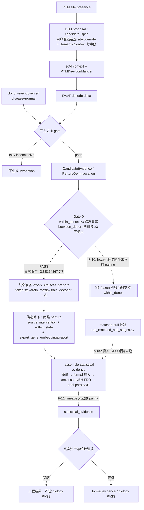

# PTM2CellNet 项目代码与文档综合分析（2026-09-14）

**性质**：第六轮综合处理报告——VCS 收口、文档/报告归档、对抗性复核（未实现功能 / 完成度 / 技术债）。取代 `project_analysis_20260913.md`（已归档至 `archive/20260914/`）；第三/四轮修复细节仍见根目录 `project_repair_report_20260913.md`。

## 目录

- [1. 执行摘要](#1-执行摘要)
- [2. Phase 1：版本控制与编译记录](#2-phase-1版本控制与编译记录)
- [3. Phase 2：归档记录](#3-phase-2归档记录)
- [4. Task 1：未实现功能与验收缺口](#4-task-1未实现功能与验收缺口)
- [5. Task 2：部分实现模块完成度](#5-task-2部分实现模块完成度)
- [6. Task 3：技术债](#6-task-3技术债)
- [7. 结论与建议](#7-结论与建议)
- [8. 子代理调用统计](#8-子代理调用统计)

## 1. 执行摘要

1. **VCS 收口完成**：第四轮（F 系列）与第五轮（Gate-0 between_donor）的未提交修改按 3 个语义提交落在 `main`（`d10e96c` → `57e72d6` → `5e71c69`）；提交前确认 `main` 与 `origin/main` 同步于 `219b81f`（`git rev-list --left-right --count main...origin/main` 为 `0 0`）。合并前后版本号与关键修改点见 §2。
2. **对抗性审查（4 个并行子代理 + 主上下文逐条证据核验）确认**：F-01（E2E 统计接续）、F-02（跨候选共享准备）、F-03（生成端 donor 行绑定）真实落地，调用链、硬失败语义与测试全部对得上，不存在"文档声称已修但代码没修"。
3. **新发现集中在 between_donor 的半程落地**：新配对语义止步于 Gate-0 校验层——冻结验收路径不传播 `pairing`（新编号 F-10，高）、统计 lineage 不记录 `pairing`（F-11，中）、donor split 无 state 覆盖约束（F-12，中）；另有 AD 审计脚本口径过时（F-14，高，重跑会产出与现状相反的"正式"证据）等 7 项新缺口，逐项策略见 §6。
4. **文档反向漂移已修复**：6 处权威文档（README、bridge 指南 §1、方案 v2.1 §11、CHANGELOG、REQUIREMENTS A-01/A-05/A-06，另含未跟踪的 AGENTS.md 约束）在代码落地后仍写"未实现"，本轮统一同步（提交 `55e65ed`）。
5. **归档 2 项、保留 1 项**：`project_analysis_20260913.md`（被本报告取代）与 `task_plan.md`（2026-08-27 已完成计划）`git mv` 至 `archive/20260914/`；`project_repair_report_20260913.md` 经核验仍准确，保留根目录。
6. **科学边界不变**：GSE174367 7/7 细胞类型 between_donor preflight PASS 是**数据契约验收**；真实 GPU matched-null 矩阵、完整六阶段运行与双路径统计未执行，生物学 PASS 仍为 0。

## 2. Phase 1：版本控制与编译记录

### 2.1 合并前后版本号与同步确认

| 项 | 值 |
|---|---|
| 合并前 `main` HEAD | `219b81f`（docs: record round-3 archival re-audit） |
| 远程同步确认 | `git fetch origin` 后 `main...origin/main` = `0 0`（无落后、无分叉；远程 git@github.com:valleyhe/PTM2CellNet.git） |
| 本轮代码提交 | `d10e96c`（第四轮 F 系列）→ `57e72d6`（第五轮 between_donor）→ `5e71c69`（E2E 接线 + 文档） |
| 本轮文档/归档提交 | `55e65ed`（living docs 同步）→ `2cb8cef`（归档批次）→ 本报告发布提交 |
| 分支操作 | 全程在 `main` 上直接提交（未开新分支/worktree），无 merge 冲突可言 |
| push 状态 | 本轮未 push（任务只要求合并到本地 main 并确认与远程同步基线）；本地领先 origin 若干提交 |

### 2.2 提交内容与关键修改点（相对 `219b81f`）

| 提交 | 内容 | 关键文件 |
|---|---|---|
| `d10e96c` | F-01 统计回接核心抽离 `replay_evaluation.py`；F-02 `orchestrator.build_shared_prepare_plans` 共享准备 + `@artifact` 引用解析；F-03 `build_scperturb_latent_pairs` donor 行绑定（`ptm2cellnet.donor_split/v1`）；F-09 runner 边界文档化；TD-13-13/14（API 文档 + `test_davf_losses.py`） | `src/integration/perturbgen/{replay_evaluation,orchestrator,runner,eval_assembly}.py`、`src/data/davf_scperturb.py`、`scripts/{build_davf_scperturb_pairs,evaluate_perturbgen_dual_path}.py`、12 文件 +1299/−1150 |
| `57e72d6` | `PerturbGenDataSpec.pairing`（within_donor 默认 / between_donor）+ `data_prep._validate_obs_contract` 分支 + report 两组 donor 字段；AD 队列审计与标准化脚本（GSE174367 preflight 7/7 PASS）；lessons L-2026-0914-01 冻结语义 | `src/integration/perturbgen/{contracts,data_prep}.py`、`scripts/{audit_ad_cohort_gate0,standardize_gse174367_ad_cohort}.py`、8 文件 +923/−85 |
| `5e71c69` | E2E `--perturbgen-cohort-pairing` 汇入 Gate-0 spec；`--assemble-statistical-evidence/--deg-table/--null-distribution-manifest` 串接统计写回 lineage；CURRENT_STATUS 第五轮、E2E 指南配对模式 | `scripts/run_davf_perturbgen_e2e.py`、4 文件 +492/−29 |
| `55e65ed` | living docs 反向漂移同步（见 §3.3） | 5 文件 +29/−20 |
| `2cb8cef` | 归档 `project_analysis_20260913.md`、`task_plan.md` → `archive/20260914/` + ARCHIVE_MANIFEST | 3 文件 |

### 2.3 编译与验证

- **编译**：`python -m compileall -q src scripts tests` 退出码 0（全部三个提交批次后执行）。
- **静态**：`ruff check src scripts tests` 全部通过；触碰文件已 `ruff format`（全仓 339 文件 format 债维持既有"独立 PR"取舍，见 §6.4）。
- **全量回归（本工作树状态，第五轮实测）**：`python -m pytest -m "not slow and not gpu" --timeout=300` = **2646 passed / 1 failed / 21 skipped**（773.33s）；唯一失败为已知真实资产基线 `tests/integration/test_scvi_davf_connection.py::test_real_current_davf_direction_keeps_token_and_decoder_indices_separate`（本地旧 checkpoint `latent_davf_perturbgen_4018` 非 canonical ENSG，contract fail-fast 生效，与第三/四轮同一已知失败）。`mypy src/ --ignore-missing-imports` = 166 文件 0 errors；requirements consistency 274 lock pins 通过。
- **本轮聚焦回归**（文档归档批次后，覆盖本轮全部触碰模块）：`pytest tests/unit/integration/perturbgen tests/unit/scripts/test_run_davf_perturbgen_e2e.py tests/unit/scripts/test_evaluate_perturbgen_dual_path.py tests/unit/data/test_davf_scperturb.py tests/unit/models/test_davf_losses.py`，结果 **267 passed / 25 warnings（15.03s），全部通过**（含新增 between_donor/statistical-evidence/shared-prepare 测试）。本轮第六轮只改文档与归档，未触碰任何 `src/`/`scripts/` 代码路径。
- **审计口径**：本轮报告整合阶段未重跑全量 pytest/GPU/训练命令；上述数字分别来自第五轮实测与本轮聚焦回归，未以历史数字冒充。

## 3. Phase 2：归档记录

### 3.1 判定标准（沿用 20260913 批次）

过时 DOCUMENT = 内容与当前代码或现行需求存在实质性差异；过期 REPORT = 生成于 2026-08-15 之前或已无法反映当前状态。审计范围：git 跟踪的全部活动文档（docs/ 顶层 + guides + 根目录 .md）；`archive/` 下的历史不再审。

### 3.2 归档执行（提交 `2cb8cef`，基线 `55e65ed`）

| 文件 | 归档前 blob | 最后修改 | 类别 | 依据 |
|---|---|---|---|---|
| `project_analysis_20260913.md` | `e0c07cbf8de6` | 2026-09-13 23:14 | 过期 REPORT + 过时 DOCUMENT | §4.5a/§6.2 的"F-01/F-02/F-03 未闭合"与 §4.3 A-01"0 合规 cohort"已被 `d10e96c`/`5e71c69`/`57e72d6` 证伪并被本报告取代 |
| `task_plan.md` | `4144e6e3a73b` | 2026-09-13 18:55 | 过时 DOCUMENT | 2026-08-27 审计计划，全部执行项完成，基线信息停留在 `a8c480c` 时代 |

归档方式 `git mv`（保留历史，`git log --follow` 可追溯）；清单 `archive/20260914/ARCHIVE_MANIFEST.md`。

### 3.3 未归档与原地修订

- **`project_repair_report_20260913.md` 保留根目录**：第三/四轮修复逐项证据，其闭合声明经子代理 D 逐项核验与当前代码一致，不满足"实质性差异"标准。
- **反向漂移修订（提交 `55e65ed`，属文档同步而非归档）**：

| 文件 | 漂移内容（原文 → 现状） | 修复 |
|---|---|---|
| `README.md` 研究路径 2/3 点 | "当前每个候选都会重新执行…跨候选复用仍是目标"、"E2E 不会自动把…接续成正式结论" | 改为共享准备与 `--assemble-statistical-evidence` 已落地（matched-null 批跑仍独立） |
| `README.md` 推理小节 | 重复"### 推理"标题 + 孤立代码围栏把 PTM 训练命令挤出"训练"小节 | 修复围栏，训练命令归位 |
| `docs/guides/perturbgen_bridge.md` §1 | 六阶段表"没有跨候选 reuse 入口"、"当前代码没有公共准备后跨候选复用的 CLI" | 改写为 `build_shared_prepare_plans`/`_prepare`/引用解析硬失败的实际行为 |
| 方案 v2.1 §11（L573/L575 两行） | "当前每候选重做准备"、"E2E report 仍只汇总 stage manifest" | 追加 2026-09-14 复审注记（正文保留时点记录） |
| `CHANGELOG.md` | [Unreleased] 自 2026-08-24 起为空，近三周提交未记录 | 补 round-3/4/5 条目 |
| `.planning/REQUIREMENTS.md` A-01/A-05/A-06 | "0 compliant cohorts"、"does not yet auto-run the statistical chain"、"repeats … per candidate" | A-01 部分解锁（between_donor preflight 证据指针）；A-05/A-06 改 landed 状态与证据 |
| 本地 `AGENTS.md`（未跟踪）执行约束两条 | 同 bridge 漂移口径 | 同步更新（含"至少 3 个可评估 donor"双模式表述） |

- **本地清理建议（非 git）**：`docs/_build/` 为 2026-08-09 的 Sphinx 构建产物，已被 `.gitignore` 排除，可本地删除或重新生成。
- 文档时效子代理对 docs/ 与根目录其余被跟踪文档（README 各指南、`TEST_COVERAGE.md`、`DATA_UPDATE_WORKFLOW.md`、api stub 等）的结论为"仍准确"；`docs/guides/gse_normal_disease_davf_plan_20260904.md` 标注存疑：其"≥3 共享 donor 才能进入正式配对"表述在 within_donor 下仍真，但未提及 between_donor 解锁的可能性（下轮复审补充，不属过时）。

## 4. Task 1：未实现功能与验收缺口

### 4.1 方法与证据口径

4 个并行子代理（需求对照 / 技术债 / 文档时效 / diff 对抗审查，统计见 §8）+ 主上下文对每条结论做 file:line 级核验。需求事实来源：仓库 `AGENTS.md` 2026-09-13 研究约束、方案 v2.1 §10–§11、`.planning/REQUIREMENTS.md` Active track、lessons.md 最新 6 条、docs/guides/、tests/。证据等级：源码行号 > 测试/CI 配置 > 具名 manifest/资产 > 报告声明。已在上轮报告（归档件 §4）记录且状态未变的条目只引用不重复展开；取消项（实时质谱流 V2-02、自定义 PTM 库 V2-03、GUI V2-05、新 API-key）不列。

### 4.2 第四/五轮声称闭合项核验结论

| 项 | 结论 | 核验证据 |
|---|---|---|
| F-01 E2E 统计接续 | **确认闭合** | `_assemble_statistical_evidence`（`scripts/run_davf_perturbgen_e2e.py:321-433`）真实串接 `extract_unperturbed_quality_from_h5ad`（`results.py:144`）→ `build_eval_input_payload`（`eval_assembly.py:339`，formal 拒绝 uniform/手填 p，`:391-401`）→ `replay_dual_path_evaluation`（`replay_evaluation.py:53`，formal 强制 empirical 聚合 `:205-210`）→ 写回 `payload["statistical_evidence"]`（E2E `:645`）；前置校验（runs 空、flag 缺失、strict 路径解析、目录非空拒绝）齐全；测试 `tests/unit/scripts/test_run_davf_perturbgen_e2e.py:402` |
| F-02 共享准备 | **确认闭合** | `build_shared_prepare_plans`（`orchestrator.py:534-562`）+ `resolve_prepare_artifact_references`（`:565-598`，缺失引用硬失败）+ E2E 接线（`run_davf_perturbgen_e2e.py:584-616`，候选 `skip_prepare_stages=True`）；共享三阶段与候选基因无关（`materialize_candidate_config:478` 只改写 perturb stage），不存在跨候选产物错配路径；测试 `tests/integration/test_perturbgen_pipeline_mocked.py:521` |
| F-03 生成端 donor 行绑定 | **确认闭合** | `davf_scperturb.py:584-618`（缺列/重叠/未知 donor/空池硬失败）+ `:649-718` 行级切分；NPZ `target_donors`/`dataset.donor_rows` 同源写入（`:908/:929`）由 `_validate_donor_split_metadata`（`train_latent_davf.py:297-331`）+ sha256 闭环消费；CLI `build_davf_scperturb_pairs.py:47-88` |
| F-09 invocation/runner 边界 | 维持"文档化边界"（runner 仍只执行 StagePlan，不自行重查 gate；外层 `--e2e-gate-report` 约束不变） | `runner.py:127-168`、`run_perturbgen_pipeline.py:363-385` |
| replay 抽离等价性 | **逐行核验一致**（BH 输入排序、`zip(strict=True)`、AND 判决、聚合函数），旧 CLI 为 41 行薄壳，无双实现残留 | `git show d10e96c^` 对比 + `evaluate_perturbgen_dual_path.py:15-20` re-export 供测试消费 |
| REQUIREMENTS v2.1/v2.2 24 项 Complete | **抽查一致**（13+11 计数吻合，MODEL/BASE 类条目与 `src/models/cross_scale.py:233/861/1050`、`scripts/baseline_pmads_ridge.py` 对得上；取消项未复活） | `.planning/REQUIREMENTS.md:151-171` |

### 4.3 新识别：未实现 / 半程落地项（F-10～F-16）

以下为本轮对抗审查新发现，均经主上下文证据核验。优先级沿用需求口径（高=可产生错误科学 verdict 或阻断正式路径；中=影响可维护性/正确性边界；低=局部）。策略与工期见 §6.2。

| ID | 缺口（接口/参数/返回层面） | 需求出处 / 优先级 / 影响 | 状态与证据 |
|---|---|---|---|
| F-10 | between_donor 未传播到冻结验收路径：`_validate_frozen_cohort_asset` 构造 `PerturbGenDataSpec(donor_col=...)` 未传 `pairing`，固定 within_donor 语义（≥3 跨态共享 donor）；`--frozen-cohort-manifest` 与 `--perturbgen-cohort-pairing between_donor` 组合对 AD 队列必然硬失败 | lessons L-2026-0914-01、方案 v2.1 L269/L423 Gate-0 正式 cohort 要求；高；核心（M6 正式验收路径） | `src/integration/perturbgen/frozen_cohort.py:369`（核验属实）；`run_davf_perturbgen_e2e.py:559-563` 绑定链 |
| F-11 | pairing 语义未进入统计 lineage：`_assemble_statistical_evidence` 返回体与 eval input schema 均无 `pairing` 字段，正式报告无法证明统计所用的 donor 设计 | AGENTS"每次正式分析必须显式记录…cohort"；中；核心 | `run_davf_perturbgen_e2e.py:423-433`（只记 `donor_obs_column`）、`eval_assembly.py:562-569`；`grep pairing` 在 eval_assembly/replay_evaluation/empirical_pvalue/dual_path/null_generation 零命中 |
| F-12 | donor-bound split 无 state 维度约束：held_out_donors 全部来自单一 state 时（between_donor 下现实配置）不报错，test NPZ 可为单态细胞集 | 方案 L271"rescue 判定在 held-out donor 上完成"；中；核心 | `davf_scperturb.py:649-718`（test=held_mask 全量行，`:708`） |
| F-13 | 标准化脚本 donor 推导缺 `Diagnosis` per-sample 一致性检查：`SUBJECT_COVARIATES` 不含 Diagnosis，组计数取 `drop_duplicates` 首行；与 audit 脚本契约不对称 | lessons L-2026-0914-01 第 2 条 donor 证据规则；中；核心（数据入口契约） | `scripts/standardize_gse174367_ad_cohort.py:50,67-76`；对照 `audit_ad_cohort_gate0.py:122,139`。当前数据 18/18 一致，实际未触发；若 GEO 源数据某 SampleID 双标注且两态细胞无共同 cell type，会产出错误分组且 7/7 全 PASS |
| F-14 | AD 审计脚本口径过时：`GATE0_REQUIREMENTS` 仍写"≥3 shared donors"、`structural_shared_donor_analysis` 硬编码"无队列能过 Gate-0"、verdict 硬编码 `GATE0_BLOCKED_SEMANTICS_AND_LABELS`；重跑会产出带新日期、与 7/7 PASS 现状相反的"正式"证据 | lessons L-2026-0914-01、bridge 指南 L92 仍列其为现行审计入口；高；次要（不产虚假 PASS，产虚假 BLOCKED） | `scripts/audit_ad_cohort_gate0.py:39,189-210,235` |
| F-15 | between_donor 无统计端到端测试：现有测试全部停在 Gate-0/spec 构造层，F-10/F-11 缺陷无回归网 | 测试分层要求；低（但为 F-10/F-11 的安全网）；次要 | `test_data_prep.py:114-152`、`test_run_davf_perturbgen_e2e.py:97-108`；统计链测试 `:402` 不含 pairing 变体 |
| F-16 | E2E DEG 表列名硬编码（`donor/gene_symbol/log2fc/fdr`），底层 `build_eval_input_payload` 本支持自定义列，CLI 未暴露 | 中性易用性；低；边缘 | `run_davf_perturbgen_e2e.py:377-383` vs `eval_assembly.py:354-357` |

### 4.4 存续已知项（状态更新，不重复展开）

- **A-01 部分解锁**：GSE174367 between_donor preflight 7/7 PASS（数据契约层）；scPerturb 侧仍 0/30；正式六阶段与统计未跑。A-02/A-03/A-05（真实 GPU null 矩阵）/A-04（Gate-E ≥200）/A-06/A-08 维持开放；A-05 的"automatic"字面语义由 F-01 满足到"显式 flag 自动串接"程度（null 批跑仍独立脚本，lessons 已如实记录该边界）。
- **U-06 pathway/GSEA**：次级接口在，`backend=none` 默认 inconclusive，未接 gseapy 正式执行（不影响 dual-path 判决）。
- **U-07 M7 Geneformer 删除**：继续受 Gate-E 门控，`legacy_davf.py`/`geneformer_embedding.py` 保留。
- **取消项**不恢复。

### 4.5 主线流程图（2026-09-14 现状，实线=已接线，虚线=仍缺）

仍缺的连线即 §4.3/§4.4 清单：F-10（frozen×pairing）、F-11（lineage×pairing）、A-05（真实 null）、A-02/A-03（真实 split 与 held-out 指标）、A-04（Gate-E ≥200）、完整六阶段真实运行。

## 5. Task 2：部分实现模块完成度

### 5.1 评分规则（沿用第三轮五桶，100 分制，1 位小数）

A 代码已接线且正式路径 fail-fast（40）/ B 默认 CI 能收集的契约测试（25）/ C 指南与代码一致（10）/ D 具名真实资产路径存在（15）/ E 正式生物学验收已执行（10）。分类标准沿用：partial but usable（缺口是资产或真实运行）、implemented but defective（可能接受不完整证据）、implemented but non-compliant（与现行契约冲突）。全部模块 E 桶仍为 0.0；百分比为静态估算，非运行成功率。

### 5.2 主线细分完成度（相对第三轮 5.3a 的重估）

| 细分模块 | 第三轮 | 本轮 | 变化依据（桶级） |
|---|---:|---:|---|
| PTM site presence / proposal / candidate_spec | 76.0 | 76.0 | 无变化 |
| scVI context / DAVF decode / frozen embedding asset | 82.0 | 82.0 | 无变化 |
| 三方 direction gate | 84.0 | 84.0 | 无变化 |
| PerturbGen invocation / orchestrator | 75.0 | **80.0** | F-02 落地：接线桶满格化（共享准备 + 引用解析硬失败）+ mock 集成测试；扣分保留：真实多候选 GPU 运行未验证 |
| 六阶段 runner / 双路径执行 | 72.0 | **78.0** | F-01/F-02 接线完成；F-09 仍为文档化边界（接线桶扣分保留） |
| Gate-0 cohort / raw counts / donor | 58.0 | **71.0** | between_donor 双模式校验 + 真实具名资产（GSE174367 h5ad，7/7 preflight PASS，D 桶 10/15）；扣分：F-10/F-11 使新语义未贯穿 frozen/统计层 |
| donor split / frozen M6 | 61.0 | **65.0** | F-03 生成端行绑定落地；F-10/F-12 限制 frozen 全链与 held-out state 覆盖 |
| matched-null / quality / candidate p/q | 72.0 | **78.0** | F-01 E2E 自动串接落地（接线桶满格化）；真实 GPU null 未跑（D 桶低） |
| dual-path AND / Workflow A formal utility | 46.0 | **56.0** | 统计组装 + lineage 落地；真实统计证据、between_donor 统计链与 null 矩阵未形成 |
| Workflow B / Gate-E / encoder 生命周期 | 63.0 | 63.0 | 无变化（≥200 真实 benchmark 仍缺） |

对应广模块行更新：PerturbGen runner/manifest 80.0→**85.0**；Dual-path 评价 63.5→**68.0**；Frozen/M6 verifier 70.0→**72.0**；三方 gate+orchestrator 81.0→**84.0**；其余行不变。加权观感：工程主链约八成可用，科学验收桶全 0——与第三轮"约七成半"相比的提升全部来自第四/五轮代码落地，**不**来自任何新执行的正式验收。

### 5.3 规格 vs 实现摘录（Task 2 对比样例）

| 文档原文（需求规范） | 实际实现 | 判定 |
|---|---|---|
| 方案 §11 L575（09-13 时点）："E2E report 仍只汇总 stage manifest" | `--assemble-statistical-evidence` 已串接四段统计写回 lineage（§4.2 F-01 证据链） | 反向漂移已在本轮修复（§3.3） |
| lessons L-2026-0914-01："between_donor 要求两组 donor 不相交且每组 ≥ min_donors" | Gate-0 层实现一致；但 `frozen_cohort.py:369` 构造 spec 未传 pairing，冻结路径固定 within_donor | **实现但不符合规范（局部）**——F-10 |
| 方案 L271："rescue 判定在 held-out donor 上完成" | held-out 池行全量进 test，无 state 覆盖约束 | 部分实现但有边界缺口——F-12 |

## 6. Task 3：技术债

分级标准（沿用）：严重 = 数据损坏 / gate 绕过 / 密钥泄漏 / 阻断主线；高 = 可产生虚假正式证据/verdict、身份错配、挂死；中 = 可维护性/覆盖/文档正确性；低 = 风格/局部性能。工期按 0.5 工作日粒度。**本轮未发现新的严重级代码项**（新代码路径均为 fail-fast 硬校验风格，无合成证据放行、无 gate 绕过、无密钥写入——子代理 B/D 独立得出同一结论）。

### 6.1 本轮闭合的债务

| 项 | 闭合证据 |
|---|---|
| TD-13-13 API 文档缺 SemanticContext | 第四轮补 `API_DOCUMENTATION.md:26-38`（子代理 B 复核可查） |
| TD-13-14 davf_losses 无测试 | 第四轮 `tests/unit/models/test_davf_losses.py` 数值断言锚定 |
| 文档反向漂移 6 处（README×2、bridge §1、方案 §11、CHANGELOG、REQUIREMENTS；含未跟踪 AGENTS.md） | 本轮提交 `55e65ed`（§3.3 表） |

### 6.2 新识别技术债与解决策略（F-10～F-16 + TD-14 系列）

#### F-10 between_donor 未传播到 frozen 验收路径 — 高（ARCHITECTURE/BUG）

- **问题与影响**：`frozen_cohort.py:369` 固定 within_donor 语义；AD 队列的 M6 冻结验收必然硬失败，`--frozen-cohort-manifest` 与 `--perturbgen-cohort-pairing between_donor` 组合不可用。影响 M6 正式验收路径（核心）。
- **方案**：A. `FrozenCohortManifest` 增加 `pairing` 字段并由 `_validate_frozen_cohort_asset` 传播进 spec（缺省 within_donor 保持向后语义），**0.5 天**；优点：契约显式、改动小，缺点：旧 manifest 需显式补字段才能跑 between_donor。B. E2E 把 `--perturbgen-cohort-pairing` 直接写入冻结 manifest 生成端，校验端只消费，**0.5–1.0 天**；优点：单一事实来源，缺点：生成/校验两端要同步改。
- **资源/风险**：frozen_cohort 维护者；风险低（有 4 条 between_donor 单测可扩展）。

#### F-14 AD 审计脚本口径过时 — 高（BUG：过时口径自动生成错误 verdict）

- **问题与影响**：`audit_ad_cohort_gate0.py:39,189-210,235` 硬编码 shared-donor 口径与 BLOCKED verdict；重跑产出与 7/7 PASS 相反的带新日期"正式"证据，误导协作者。缓解：不产虚假 PASS，只产虚假 BLOCKED。
- **方案**：A. 更新为双 pairing 口径：GSE147528/157827/188545 按"缺 donor/cell 注释"维持 BLOCKED，GSE174367 标注"已按 between_donor 标准化并 preflight PASS，见 20260914_gse174367_gate0 evidence"，**0.5 天**；优点：证据链自洽，缺点：一次性脚本变成需随契约维护的工具。B. 冻结口径：脚本与 evidence 顶层加"结论冻结于 L-2026-0914-01 之前"声明并从 bridge 指南现行命令列表移出，**0.5 天**；优点：改动最小，缺点：重跑仍输出旧 verdict。
- **资源/风险**：数据审计维护者；风险：方案 A 需同步改 bridge 指南引用。

#### F-11 pairing 未进统计 lineage — 中（DOCUMENTATION/契约字段缺失）

- **问题与影响**：正式统计报告无法证明所用 donor 设计（`run_davf_perturbgen_e2e.py:423-433`、`eval_assembly.py:562-569` 无该字段）。
- **方案**：A. eval input schema 与 `statistical_evidence` 各加 `pairing` 字段（来源 Gate-0 spec），**0.5 天**；优点：一行级改动、lineage 完整，缺点：schema 消费方要同步。B. 仅在 E2E payload 记录（不动 eval schema），**0.5 天**；优点：面更小，缺点：replay 侧仍不可见。
- **资源/风险**：eval_assembly 维护者；风险低。

#### F-12 donor split 无 state 覆盖约束 — 中（TEST/契约边界）

- **问题与影响**：`davf_scperturb.py:649-718` 允许 held-out 池全为单一 state，rescue 判定失去疾病状态语义。
- **方案**：A. donor-bound 模式增加显式 `--require-state-coverage` 校验（held-out 池需覆盖两 state，否则硬失败），**0.5 天**；优点：堵住语义漏洞且 opt-in 不破坏旧资产，缺点：between_donor 队列必须显式声明预期。B. 只在 docstring/指南写明该边界并要求研究负责人在 split JSON 里自证，**0 天**；优点：零代码，缺点：无强制。
- **资源/风险**：davf_scperturb 维护者 + 统计负责人（state 覆盖的 estimand 定义）；风险：过度约束会拒绝合法的单态评估设计。

#### F-13 standardize 脚本 Diagnosis per-sample 校验缺口 — 中（BUG/契约不一致）

- **问题与影响**：`standardize_gse174367_ad_cohort.py:50,67-76` 的 per-sample 唯一性检查不含 Diagnosis；源数据错误时可能产出错误 donor 分组（触发条件苛刻：需双标注且两态细胞无共同 cell type，见 §4.3）。
- **方案**：A. `per_sample_cardinality` 列清单加 `Diagnosis`（一行），与 audit 脚本口径对齐，**0.5 天**；优点：对称契约，缺点：无（当前数据不受影响）。B. 顺带为该脚本三个纯函数补合成单测（协变量碰撞/PAR_Y 不成对/每组 <3 donor/barcode 缺失路径），**+0.5–1.0 天**（与 TD-14-06 合并执行）。
- **资源/风险**：数据入口维护者；风险低。

#### F-15 between_donor 统计端到端测试缺失 — 低（TEST，作为 F-10/F-11 回归网）

- **方案**：在 `test_run_davf_perturbgen_e2e.py` 统计链测试上加 pairing 变体断言（F-10/F-11 修复时一并落），**0.5 天**。

#### F-16 E2E DEG 列名硬编码 — 低（易用性）

- **方案**：暴露 `--deg-donor-column/--deg-gene-column/--deg-effect-column/--deg-fdr-column`（默认现值），**0.5 天**；不暴露则维持文档写明固定列名，**0 天**。

#### TD-14 系列（质量/维护性，均为本轮新识别、低）

| ID | 分类 | 证据 | 说明与建议 | 工期 |
|---|---|---|---|---|
| TD-14-01 | DEPS/RELEASE | `CHANGELOG.md:10`（2.1.0，2026-08-24）vs `setup.py:130`（`version="1.0.0"`） | 版本口径不一；建议发布时统一（改 setup.py 或 CHANGELOG 头），不要为对齐而发版 | 0.5 |
| TD-14-02 | CODE_SMELL | `scripts/run_davf_perturbgen_e2e.py:436-653`（`_run` 约 218 行） | TD-13-15 清单外新增（原扫描只覆盖 src/）；下次触碰时抽 `_validate_run_args` | 0.5 |
| TD-14-03 | CODE_SMELL（重复） | `replay_evaluation.py:510`、`reports.py:166`、`orchestrator.py:865`、`run_davf_perturbgen_e2e.py:158` | `_to_plain_object`/`_to_plain`/`_serialize` 四处近似实现；收敛到 `reports._to_plain_object` 一处 | 0.5 |
| TD-14-04 | CODE_SMELL | `audit_ad_cohort_gate0.py:43-45`（死函数 `_first_matrix_group`）、`:52,:91`（`next(glob())` 空目录裸 StopIteration） | 与 F-14 方案 A 一并处理：删死函数、glob 空时 ValueError | 0.5（并入 F-14） |
| TD-14-05 | CODE_SMELL（存疑语义） | `standardize_gse174367_ad_cohort.py:240-242,284` | PARTIAL verdict 退出码 0，`&&` 链会在部分 REJECTED 时继续；如非有意，PARTIAL 返回专用退出码并在 docstring 写明三态 | 0.5 |
| TD-14-06 | TEST | `tests/` 对 standardize/audit 两脚本零引用 | 数据入口核心转换（donor 证据/PAR_Y 折叠/barcode 对齐）无回归网；与 F-13 方案 B 合并执行 | 0.5–1.0 |

### 6.3 核验通过、无需动作的攻击面（对抗审查阴性结果）

- **between_donor 双层校验一致**：obs 层（`data_prep.py:121-146` shared 即 raise）与 report 层（`contracts.py:425-431`）语义对齐；`evaluable_donors`=并集在下游无"shared donor 算术"消费者（dual_path/results/frozen 的计数是独立运行时 donor 数）。
- **spec↔report pairing 同步**：唯一构造点 `data_prep.py:227` 同步写入，无第二构造点或反序列化消费路径。
- **共享准备无跨候选错配**：key=(stage, artifact_name)，缺失硬失败 + runner `_resolve_value` 第二层硬失败；同 ENSG 重复 gated 候选在 `merge_route_preparations:719-720` fail-fast。
- **donor 绑定 NPZ 一致性**：`target_donors`/`dataset.donor_rows` 同源写入，训练端 sha256 校验闭环；control cells 按 pool 分配无泄漏路径。
- **CSC→CSR 转置与 ENSG 折叠数值正确**：10x H5 `shape=[n_genes,n_cells]` 语义、selector 求和保持 int32 无溢出（子代理 D 独立数值验证）。
- **依赖一致性**：`setup.py install_requires` 与 `requirements-core.txt` 逐条一致，`tests/unit/test_dependency_contracts.py:131-169` 镜像门禁在。
- **架构边界**：runner/orchestrator/eval_assembly 职责清晰，replay 抽离后无双实现；新模块无裸 except，ruff 全过。

### 6.4 存量未变项（引用，不重复计数）

全仓 ruff format 339 文件（TD-13-05）、pip 元数据冲突（TD-13-06）、覆盖率未刷新 fail_under=74（TD-13-07）、CI 默认 job 不含完整 e2e（TD-13-09）、Geneformer pickle 词表（TD-13-11，M7 门控）、19 超长函数 + 10 iterrows（TD-13-15/16，TD-14-02 为其 scripts 层增补）、已知真实资产测试失败基线。详见 `archive/20260914/project_analysis_20260913.md` §6。

### 6.5 严重级结论

未发现新的严重级代码项。缺真实资产阻断的是科学发布，不是仓库编译或主线工程；当前无任何代码路径把 smoke/synthetic/bridge 结果标为 biology PASS。

## 7. 结论与建议

1. **第四/五轮修复真实闭合，本轮收口完成**：F-01/F-02/F-03 经对抗审查确认落地；VCS 三笔语义提交 + 文档同步 + 归档全部在 main，编译与静态检查通过。
2. **下一步修复优先级**：F-10（frozen×pairing，0.5 天）与 F-14（审计口径，0.5 天）先做——前者解锁 AD 队列的 M6 正式验收路径，后者消除会持续产出相反结论的证据源；随后 F-11/F-13/F-15 一组（统计 lineage 记 pairing + Diagnosis 校验 + 回归网，合计约 1.0–1.5 天）；F-12 需统计负责人先定义 held-out state 覆盖的 estimand 再动代码。
3. **有资产后的顺序不变**：GSE174367 完整六阶段（`--run-perturbgen --perturbgen-cohort-pairing between_donor`，PerturbGen 环境 + GPU）→ donor split 生成与冻结 manifest（先落 F-10）→ matched-null 批跑 → 统计接续 → A-02/A-03/A-04/Gate-E。契约验收 PASS 不等于生物学 PASS 的口径维持。
4. **不要做**：为对齐版本号仓促发版（TD-14-01 随下次真实 release 处理）；为 F-12/F-16 加防御性开关；把本报告百分比当作运行成功率；重开取消项。
5. **文档**：本报告取代 20260913 分析（归档件可追溯）；修复细节见 `project_repair_report_20260913.md`；后续约束以 `docs/CURRENT_STATUS.md` + `lessons.md` 最新条目为准。

## 8. 子代理调用统计

本轮对抗审查按"子代理分流"原则派发 4 个并行子代理（单次派发窗口 09:03:01 起，约 10.5 分钟全部返回）。与第三轮（3 次派发全部因 `Model provider is not configured` 失败、由主上下文兜底）不同，本轮 4 次全部成功产出，失败率 0。耗时与 tool_uses 来自 Agent 运行元数据；主上下文对每条关键结论做了 file:line 级复核（§4.2/§4.3/§6.3 均为核验后采信）。

| 智能体 | 类型 | 调用次数 | 工具调用数 | 执行时长 | 主要执行任务 | 采信情况 |
|---|---|---:|---:|---:|---|---|
| 需求对照复核 | Explore | 1 | 32 | 550 秒（约 9.2 分） | 需求文档 vs 代码逐项对照、F-01/02/03 闭合核验、REQUIREMENTS 24 项抽查、between_donor 下游消费检查 | F-10/F-11/F-12/F-16 全部核验属实并采纳 |
| 技术债增量扫描 | Explore | 1 | 52 | 599 秒（约 10.0 分） | 新模块测试覆盖、代码质量、架构、依赖、文档五类扫描 | F-14/TD-14-02~06 核验属实并采纳；"未发现"阴性结论采信 |
| 文档时效审计 | Explore | 1 | 20 | 396 秒（约 6.6 分） | docs/ + 根目录被跟踪 .md 全量时效、outputs/ 引用检查 | 归档零新增候选结论采信；6 处反向漂移全部核验属实并修复 |
| diff 对抗审查 | general-purpose | 1 | 57 | 631 秒（约 10.5 分） | `d10e96c`/`57e72d6`/`5e71c69` 逐 diff 攻击面审查（8 个攻击面） | F-13 核验属实并采纳；7 个攻击面核验通过；2 项存疑（test_ratio 静默失效、pairing flag 无 --run-perturbgen 时忽略）记入低级观察 |
| **合计** | — | **4** | **161** | 并行窗口约 10.5 分 | — | — |

主上下文本轮关键动作：3 次子代理结论逐条证据核验（约 12 次源码/文档读取）、7 处文档编辑、2 次 `git mv` 归档 + 清单撰写、6 次 git 提交（含本报告）、compileall/ruff/聚焦 pytest 验证、本报告撰写。简要分析：并行子代理层恢复可用后，需求对照、技术债、文档时效、diff 审查四条线在约 10 分钟内完成独立取证，主上下文只做核验与决策，未出现第三轮"任务全部收敛到主上下文串行"的退化；两个独立子代理（B、D）对"无新增严重级"得出一致结论，交叉验证了该判断。
