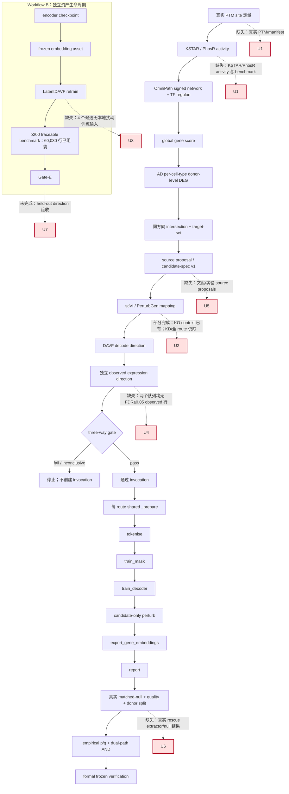

# PTM2CellNet 综合代码、文档与技术分析报告（2026-09-16）

> 报告日期：2026-09-16（Asia/Shanghai）
>
> 事实边界：代码、测试、配置、运行产物和 CI 是实现事实；历史报告只用于追溯。合成、smoke、mock、bridge 和 CPU contract PASS 不等于正式生物学 PASS。
>
> 本报告基于当前仓库快照、归档清单、源码/测试、最新 outputs/manifest 和本轮实际命令输出，并区分 U2–U7 与 T1–T6 两个 2026-09-16 批次。没有把三阶段探针、benchmark evaluator、synthetic/engineering context 或 bridge 结果写成正式生物学 PASS；正式 biology PASS 维持 0。

## 目录

- [1. 摘要](#1-摘要)
- [2. 审计口径与事实来源](#2-审计口径与事实来源)
- [3. 版本控制与文档归档](#3-版本控制与文档归档)
- [4. 当前实现与主线复核](#4-当前实现与主线复核)
- [5. 未实现功能、接口缺口与业务流程](#5-未实现功能接口缺口与业务流程)
- [6. 完成度与实现分类](#6-完成度与实现分类)
- [7. 技术债与解决策略](#7-技术债与解决策略)
- [8. 测试、构建与验收记录](#8-测试构建与验收记录)
- [9. 最小可行后续顺序](#9-最小可行后续顺序)
- [10. 子智能体调用统计](#10-子智能体调用统计)
- [11. 结论](#11-结论)

## 1. 摘要

### 1.1 结论先行

本轮已核实并收口的工程事实：

- U2：新增唯一 `prepare_scvi_context` 入口和 CLI；KO route 真实 context 为 61,472 cells × 4,018 genes，33 个缺失轴基因显式 zero-fill、54,691 个队列外基因丢弃，`davf_batch` 绑定及 rationale 写入 manifest，并经 E2E 同款 encode 得到 `(256, 64)` finite 输出；
- U3/T3：轴覆盖审计确认 KO 仅 APOE、KD 为空；Frangieh KO 扩展链为 240,646 × 4,018、216 个扰动 target，APOE route decode 通过 token/decoder 分离验证；
- U4/T1：donor pseudobulk counts estimand 已冻结并重算；GSE174367、GSE157827 单队列和两队列合并表均没有 FDR ≤ 0.05 行；
- T2/U1：OmniPath signed release 已组装为 12,878 条 signed TF→gene 边，研究 config 已绑定 `omnipath-2026-09-16`，但真实 PTM 定量和 KSTAR/PhosR activity 仍未提供；
- U7：Gate-E vocabulary-migration benchmark 已从真实 CPLM/dbPTM 注释组装 60,030 行、25 类 PTM，evaluator identity 对照通过；这不是方向预测或 held-out biology 验收；
- T4：4/4 截断 scPerturb h5ad 已从 Zenodo 重新下载，size 精确匹配且非 backed 全量读取通过；版本 hash 差异已原样登记；
- 2026-09-16 U2–U7 批次历史全量记录为 2,818 passed / 0 failed / 22 skipped；T1–T6 扩展批次历史全量记录为 2,819 passed / 0 failed / 22 skipped；本轮收口定向验证结果与完整命令见 §8；
- 归档清单中 3 个过时快照仍保持可恢复移动记录，当前状态/方案/指南和 outputs 证据未归档。

当前不能宣布正式生物学结果通过。已确认的运行状态是：

- 真实 GSE174367 pseudobulk aggregate 117,352 行的最小 FDR 为 `0.9153809637763248`；GSE157827 单队列 67,076 行的最小 FDR 为 `0.13651630403524723`；两队列合并 66,854 行的最小 FDR 为 `1.0`，三者 FDR ≤ 0.05 均为 0；
- E2E dry-run 的历史结果为 Gate-0 通过、candidate/gate `inconclusive`，原因为 `observed_expression_not_significant`，没有 invocation，也没有 PerturbGen run；
- KO context 已能接入旧 Dixit route 和新 Frangieh route，但 KD context/候选消费决策没有冻结；当前 formal research config 仍以 GSE174367 为 cohort，T1 合并队列尚未成为正式入口；
- 真实 PTM 定量、KSTAR/PhosR activity、source proposal、正式六阶段、matched-null/quality/p/q/dual-path 和 Workflow B held-out retraining 仍未闭环；
- 正式 biology PASS 仍为 **0**。

### 1.2 主要阻塞项

1. 真实 PTM 定量、KSTAR/PhosR activity 和正式 source proposal 仍是外部输入；signed network release 本身已就绪。
2. observed donor-level DEG 在两个本地 AD 队列的无偏口径下均没有 FDR ≤ 0.05 行，三方 gate 仍不可通过，不能调阈值或手填 p 值。
3. DAVF route coverage 仍不足：本地数据支持 KO/APOE，KD 为空，APP/PSEN1/BACE1/MAPT 没有本地扰动训练输入；T3 新链不能替代缺失的疾病相关训练数据。
4. T1 产物尚未成为正式 cohort 入口，且已生成 DEG manifest 保留了生成时 `PENDING_SIGNED_NETWORK_RELEASE` 快照，需要后续 lineage 决策，不能静默改写。
5. 正式 PerturbGen 六阶段、真实 matched-null、未扰动质量、双路径统计、frozen replay 和 Workflow B held-out retraining 尚未执行。

## 2. 审计口径与事实来源

### 2.1 权威入口

| 来源 | 用途 | 本报告采用方式 |
|---|---|---|
| [`docs/PTM_activity_AD_intersection_DAVF_PerturbGen_执行方案.md:14`](/home/scu/PTM2CellNet/docs/PTM_activity_AD_intersection_DAVF_PerturbGen_执行方案.md:14) | PTM → activity → signed network → AD DEG → DAVF/PerturbGen 主线和非目标 | 作为需求规范；不把 network score 当成表达 ground truth |
| [`docs/guides/ptm_activity_pipeline.md:7`](/home/scu/PTM2CellNet/docs/guides/ptm_activity_pipeline.md:7) | PTM activity 阶段 0–6 的命令和数据合同 | 区分仓库消费标准表与外部 KSTAR/PhosR 执行 |
| [`docs/guides/davf_perturbgen_e2e.md:3`](/home/scu/PTM2CellNet/docs/guides/davf_perturbgen_e2e.md:3) | candidate spec、Gate-0、三方 gate、统计接续和六阶段入口 | 作为 E2E 运行边界 |
| [`docs/guides/perturbgen_bridge.md:242`](/home/scu/PTM2CellNet/docs/guides/perturbgen_bridge.md:242) | Workflow A 六阶段、shared prepare、Workflow B、Gate-E、发布证据 | 作为正式 GPU 验收边界 |
| [`API_DOCUMENTATION.md:13`](/home/scu/PTM2CellNet/API_DOCUMENTATION.md:13) | 当前 PerturbGen contract 入口 | 作为公开 API 摘要；旧 API 快照不作为合同 |
| [`project_analysis_20260915.md:7`](/home/scu/PTM2CellNet/project_analysis_20260915.md:7) | 上一轮已核实状态和阻塞项 | 逐项复核；对其 FDR 表述做了数据校正 |
| [`archive/20260916/ARCHIVE_MANIFEST.md:42`](/home/scu/PTM2CellNet/archive/20260916/ARCHIVE_MANIFEST.md:42) | 本轮归档范围、保留范围和移动后验证 | 作为归档审计记录 |
| [`outputs/ptm_activity/20260916_d1/`](/home/scu/PTM2CellNet/outputs/ptm_activity/20260916_d1/) | U2/U4/U7 的 context、DEG、axis audit 和 benchmark 运行证据 | 直接读取 manifest、表行数和 evaluator 结果 |
| [`outputs/ptm_activity/20260916_t1/`](/home/scu/PTM2CellNet/outputs/ptm_activity/20260916_t1/) | T1 队列扩充、Frangieh context 与两队列 DEG 结果 | 只作为扩展批次证据，不自动升级 formal cohort |
| [`data/processed/signed_network/signed_network_omnipath_20260916.manifest.json`](/home/scu/PTM2CellNet/data/processed/signed_network/signed_network_omnipath_20260916.manifest.json) | T2 signed network release | 核对输入、过滤、边数和 release |
| [`data/raw/scperturb/redownload_verify.json`](/home/scu/PTM2CellNet/data/raw/scperturb/redownload_verify.json) | T4 h5ad 重下完整性和版本差异 | 核对 size、full read 和显式 hash 差异记录 |

### 2.2 正式验收边界

正式效用验收必须同时具备真实 `normal/disease` raw counts、显式 donor、`between_donor` 或 `within_donor` 的明确 pairing、每组/跨态至少 3 个可评估 donor、canonical Ensembl、冻结 scVI gene order、冻结 embedding/manifest、真实 matched-null、未扰动质量、三 seed、两条路径和可重放 lineage。方案明确禁止用 synthetic 或 bridge 结果替代 biology PASS，[方案 §2.3](/home/scu/PTM2CellNet/docs/PTM_activity_AD_intersection_DAVF_PerturbGen_执行方案.md:49)。

### 2.3 DEG estimand 与 FDR 复核

上一份报告在 [`project_analysis_20260915.md:83`](/home/scu/PTM2CellNet/project_analysis_20260915.md:83) 把旧表结果写成“FDR 恒等于 1.0”；该表述不准确。当前直接核对结果如下：

| 产物 | 数据行数 | 最小 FDR | FDR ≤ 0.05 | 解释 |
|---|---:|---:|---:|---|
| `outputs/ptm_activity/20260915_d0/ad_deg_aggregate.tsv`（旧 `per_cell_log2_mean`） | 117,352 | 0.0855418879 | 0 | 旧口径只证明显著行不存在 |
| `outputs/ptm_activity/20260916_d1/ad_deg_aggregate.tsv`（冻结 `pseudobulk_counts`） | 117,352 | 0.9153809637763248 | 0 | 新 estimand 已实现并重算，不能与旧表混用 |
| `outputs/ptm_activity/20260916_t1/gse157827_only/ad_deg_aggregate.tsv` | 67,076 | 0.13651630403524723 | 0 | 新增队列单独重算，仍无显著行 |
| `outputs/ptm_activity/20260916_t1/ad_deg_combined_aggregate.tsv` | 66,854 | 1.0 | 0 | 朴素合并受队列基线偏移影响，仍无显著行 |

U4 的功效诊断还记录：GSE174367 EX 为 7 normal vs 11 disease `between_donor` donors，logCPM pseudobulk Welch 最小 p 为 `1.56e-5`，raw-count t 的最小 p 为 `1.9e-4`，在 16k–19k 表达过滤 universe 下最小 BH FDR 为 0.28–0.94。该证据支持“本地两队列在当前无偏口径下 gate 不可达”的研究结论，不支持通过调低 `deg_max_fdr`、回填 p 值或改写 observed direction 来继续。代码入口为 [`src/analysis/ad_deg_table.py:96`](/home/scu/PTM2CellNet/src/analysis/ad_deg_table.py:96)，estimand 实现为 [`src/data/gse_normal_disease.py:609`](/home/scu/PTM2CellNet/src/data/gse_normal_disease.py:609)，config/manifest 字段为 [`configs/research/ptm_research_config.yaml:31`](/home/scu/PTM2CellNet/configs/research/ptm_research_config.yaml:31)。

## 3. 版本控制与文档归档

### 3.1 版本控制记录

| 项目 | 结果 |
|---|---|
| 工作分支 | `main`；没有本地 `master` |
| fetch | `git fetch origin main` 成功（本轮）；未 push |
| 当前 HEAD（本轮提交前） | `b37779a912e2866aed6ce68304d22c7352e04dbb` |
| 远端 | `origin/main=219b81fe9d77d1f49cd916989e227ca88a2417d7`，`git ls-remote origin refs/heads/main` 已核对 |
| 当前同步关系 | `git rev-list --left-right --count HEAD...origin/main = 8 0`；本地领先 8，远端未领先，无需 merge |
| 提交范围 | 显式提交当前已完成的代码、测试、配置、指南/状态文档、lessons 和两份 20260916 报告；不加入 outputs/运行产物 |
| push | 未 push；本任务没有远程写入授权 |
| 当前未提交范围 | 13 个 tracked `M` + 13 个 untracked 代码/测试/配置/报告文件；无 staged、delete 或 rename |
| 当前静态状态 | 本轮收口验证尚未执行；结果在 §8 逐项记录，不以历史输出代替本轮命令 |

本批次使用显式文件清单，不使用宽泛 `git add -A`；`outputs/` 下忽略的运行产物、checkpoint 和临时 GPU 文件不进入提交。提交后 SHA、状态和 ahead/behind 在本节及 §8.3 回填。

### 3.2 空白与 CRLF 记录

本轮不改写与当前批次无关的历史文件或归档快照；空白检查、提交状态和静态检查以本轮实际命令结果为准，见 §8。

### 3.3 本轮归档内容

归档目录为 [`archive/20260916/`](< /home/scu/PTM2CellNet/archive/20260916/>)，其中包含：

| 原路径 | 归档路径 | 判定 |
|---|---|---|
| `project_repair_report_20260915.md` | [`archive/20260916/project_repair_report_20260915.md`](/home/scu/PTM2CellNet/archive/20260916/project_repair_report_20260915.md) | 后续 20260915 分析、冻结 config、AD DEG 产物和 E2E dry-run 已取代其快照 |
| `project_repair_report_20260914.md` | [`archive/20260916/project_repair_report_20260914.md`](/home/scu/PTM2CellNet/archive/20260916/project_repair_report_20260914.md) | 20260914 修复状态已被后续工程结果取代 |
| `docs/PTM_activity_代码现状分析与后续执行方案_20260914.md` | [`archive/20260916/PTM_activity_代码现状分析与后续执行方案_20260914.md`](/home/scu/PTM2CellNet/archive/20260916/PTM_activity_代码现状分析与后续执行方案_20260914.md) | 方案快照中的阶段 A/B 缺口已部分实现，当前依据改为现行方案和 guide |
| — | [`ARCHIVE_MANIFEST.md`](/home/scu/PTM2CellNet/archive/20260916/ARCHIVE_MANIFEST.md) | 归档操作、原始状态、mtime/大小/行数和移动后验证记录 |

判定依据是内容已发生实质性漂移或仅作为执行快照，不是单纯按文件年龄删除。三个文件使用可恢复移动，源路径不存在、目标路径存在、标题/章节仍在、mtime/大小/行数保持；详情见 manifest 的 [`已移动文件`](/home/scu/PTM2CellNet/archive/20260916/ARCHIVE_MANIFEST.md:23) 和 [`移动后验证`](/home/scu/PTM2CellNet/archive/20260916/ARCHIVE_MANIFEST.md:31)。未计算 SHA、hash 或其他摘要值。

### 3.4 明确保留的当前资料

下列文件保留在原位，不能按“过时报告”归档：

- [`docs/CURRENT_STATUS.md`](/home/scu/PTM2CellNet/docs/CURRENT_STATUS.md) 和 [`API_DOCUMENTATION.md`](/home/scu/PTM2CellNet/API_DOCUMENTATION.md)：当前入口；CURRENT_STATUS 已指向本报告；
- [`project_analysis_20260914.md`](/home/scu/PTM2CellNet/project_analysis_20260914.md)：仍被活动状态入口引用；
- [`project_analysis_20260915.md`](/home/scu/PTM2CellNet/project_analysis_20260915.md)：上一份当前状态证据，本报告对其 FDR 文字做了校正，不移动；
- [`docs/PTM_activity_AD_intersection_DAVF_PerturbGen_执行方案.md`](/home/scu/PTM2CellNet/docs/PTM_activity_AD_intersection_DAVF_PerturbGen_执行方案.md)、[`docs/guides/ptm_activity_pipeline.md`](/home/scu/PTM2CellNet/docs/guides/ptm_activity_pipeline.md)、[`docs/guides/davf_perturbgen_e2e.md`](/home/scu/PTM2CellNet/docs/guides/davf_perturbgen_e2e.md)、[`docs/guides/perturbgen_bridge.md`](/home/scu/PTM2CellNet/docs/guides/perturbgen_bridge.md)：当前方案和运行指南；
- `data/` 和 `outputs/ptm_activity/20260915_d0/`、`outputs/ptm_activity/20260916_d1/`、`outputs/ptm_activity/20260916_t1/` 中的 manifest、DEG、context、network 和 E2E JSON：当前运行证据，不是文档快照。

本轮没有发现可据此声称存在独立、当前有效的安全扫描报告；因此不虚构安全扫描结论。

## 4. 当前实现与主线复核

### 4.1 需求主线和方向语义

当前规范主线为：

```text
PTM site → KSTAR/PhosR activity → signed network propagation
→ global gene score → AD per-cell-type donor-level DEG intersection
→ source gene candidate spec → scVI/DAVF direction
→ independent observed-expression direction → three-way gate
→ passing invocation → PerturbGen source_intervention + within_state
```

方案要求 `ptm_site_direction`、`activity_direction`、`predicted_gene_direction`、`observed_direction`、`davf_predicted_direction` 和 `davf_action` 分字段保存，禁止全局同号或取反，[方案 §3.1](/home/scu/PTM2CellNet/docs/PTM_activity_AD_intersection_DAVF_PerturbGen_执行方案.md:61)。`source_gene` 是干预来源，交集 DEG 是 target/evaluation set，不能合并，[方案 §3.3](/home/scu/PTM2CellNet/docs/PTM_activity_AD_intersection_DAVF_PerturbGen_执行方案.md:84)。

### 4.2 已实现部分与真实边界

| 模块 | 现状 | 真实证据与边界 |
|---|---|---|
| 阶段 0 研究配置 | contract 已实现；AD 侧冻结，signed network 已绑定真实 release，PTM cohort/activity 仍 PENDING | [`configs/research/ptm_research_config.yaml:23`](/home/scu/PTM2CellNet/configs/research/ptm_research_config.yaml:23)；`ptm_cohort` 仍禁止在外部输入缺失时产生正式 PTM score |
| PTM 输入标准化 | 有输入表 contract、gene map 和 CLI | 方案要求 site/donor/condition/total protein 等字段，[方案 §4.1](/home/scu/PTM2CellNet/docs/PTM_activity_AD_intersection_DAVF_PerturbGen_执行方案.md:100)；真实 PTM 队列没有登记 |
| KSTAR/PhosR activity | 仓库可消费标准 `ptm_activity.tsv`，不执行外部工具 | guide 明确“本仓库没有运行 KSTAR/PhosR 的入口”，[`ptm_activity_pipeline.md:76`](/home/scu/PTM2CellNet/docs/guides/ptm_activity_pipeline.md:76) |
| signed network propagation | 算法和输出 contract 已实现 | `signed_network.py` 要求 effect sign、release、confidence，异号平行边整体剔除；路径按 `decay^length` 传播，[`signed_network.py:121`](/home/scu/PTM2CellNet/src/analysis/signed_network.py:121) |
| signed network / global gene score | signed network release 已真实组装；传播和 score contract 已实现 | [`signed_network_omnipath_20260916.manifest.json`](/home/scu/PTM2CellNet/data/processed/signed_network/signed_network_omnipath_20260916.manifest.json) 记录 13,565 输入、12,878 signed 边；`ptm_gene_score.py:113` 仍要求无独立 null 时为 `direction_only` |
| AD DEG 与 cell-type intersection | 真实 GSE174367、GSE157827 单队列和两队列 aggregate/donor-level 表已生成，join/gate 代码存在 | `20260916_d1` 与 `20260916_t1` manifests 记录 pseudobulk 口径；三套表均没有一行达到 FDR 0.05 |
| candidate spec | schema、canonical Ensembl、`context_cell_index`、source DEG gate、sidecar 已实现 | source proposal 仍是外部研究输入；无 source DEG 的记录进 exploratory，不生成正式候选，[`build_celltype_candidate_specs.py:217`](/home/scu/PTM2CellNet/scripts/build_celltype_candidate_specs.py:217) |
| DAVF mapper / direction gate | code contract 和真实 APOE decode dry-run 可用 | `prepare_candidates` 映射、decode、三方 gate 和 pass-only invocation 均已串接，[`orchestrator.py:250`](/home/scu/PTM2CellNet/src/integration/perturbgen/orchestrator.py:250)；正式候选仍被 context/FDR/axis 阻塞 |
| PerturbGen shared prepare | route 级 `tokenise → train_mask → train_decoder` 共享计划已实现 | `build_shared_prepare_plans` 明确只依赖 route 配置/资产并复用，[`orchestrator.py:535`](/home/scu/PTM2CellNet/src/integration/perturbgen/orchestrator.py:535)；E2E 在有 gated candidate 时创建 `<route>/_prepare/`，[`run_davf_perturbgen_e2e.py:914`](/home/scu/PTM2CellNet/scripts/run_davf_perturbgen_e2e.py:914) |
| Workflow A 六阶段 | plan、runner、gate wrapper、统计接口存在；P40 750-cell 三阶段探针通过 eager，真实 formal 六阶段未执行 | 阶段顺序由 guide 固定为六阶段，[`perturbgen_bridge.md:267`](/home/scu/PTM2CellNet/docs/guides/perturbgen_bridge.md:267)；`outputs/perturbgen/d3_probe_20260916/` 仅为工程探针 |
| null / quality / p/q / dual-path | 接口和 lineage 已实现，真实 evidence 未组装 | `--assemble-statistical-evidence` 强制真实 `--run-perturbgen`、DEG 表和 null manifest，[`run_davf_perturbgen_e2e.py:487`](/home/scu/PTM2CellNet/scripts/run_davf_perturbgen_e2e.py:487) |
| target-set downstream evaluation | sidecar、canonical Ensembl 提取和 `matches_predicted`/`matches_observed` 分字段已实现 | 只报告方向 concordance，不替代 source 三方 gate，也不是因果验证，[`downstream_target_evaluation.py:186`](/home/scu/PTM2CellNet/src/integration/perturbgen/downstream_target_evaluation.py:186) |
| Workflow B / Gate-E | evaluator 与真实 60,030 行 vocabulary benchmark 已存在；LatentDAVF retrain/held-out 未完成 | [`gate_e_benchmark.manifest.json`](/home/scu/PTM2CellNet/outputs/ptm_activity/20260916_d1/gate_e_benchmark.manifest.json)；benchmark 只测词表迁移，不是方向预测 |
| T1 AD 队列扩充 | GSE157827 标准化和两队列合并已完成，尚未替换 formal cohort | `data/AD/standardized/GSE157827_ad_cohort.h5ad`、`GSE174367_GSE157827_combined.h5ad` 及 `outputs/ptm_activity/20260916_t1/`；合并 FDR 仍无显著行 |
| T2 signed network release | OmniPath 全等级 signed TF→gene release 已组装并绑定 config；PTM/activity 外部输入仍缺 | `signed_network_omnipath_20260916.manifest.json`：13,565 输入、488 unsigned/conflicting 丢弃、20 unmapped 丢弃、12,878 release edges（+10,124/−2,754） |
| T3 Frangieh KO route | 新 route 的 scVI/DAVF 链和 APOE decode 通过；与旧 Dixit route 不可混用，尚未成为默认 formal config | `configs/davf_ko_frangieh.yaml`、`data/processed/davf_scperturb/ko_frangieh/prepared.manifest.json`、`tests/integration/test_scvi_davf_connection.py:181` |
| T4 scPerturb 资产 | 4/4 重下文件 size 匹配且 non-backed full read 通过；Zenodo 与 figshare baseline hash 差异已登记 | [`data/raw/scperturb/redownload_verify.json`](/home/scu/PTM2CellNet/data/raw/scperturb/redownload_verify.json)；版本差异不等于损坏 |
| T5 运行变量 runbook | 22 个 formal + 9 个 local 变量及 P40 eager 注记已写入 bridge guide；仅需随配置维护 | [`docs/guides/perturbgen_bridge.md:84`](/home/scu/PTM2CellNet/docs/guides/perturbgen_bridge.md:84) |
| T6 R-01–R-03 数据供给 | 本地未发现 replogle/scgenescope 原始数据，真实图/扰动训练仍 blocked | 当前仓库 `data/`、`ref/` 检索结果；不把 synthetic/benchmark 当训练数据 |

### 4.3 已存在的公开接口

| 接口 | 参数 | 返回/产物 | 用途 |
|---|---|---|---|
| `DAVFPerturbGenOrchestrator.prepare_candidates` | `proposals, z_0`；关键 keyword 为 `cell_type`、`ptm_context`、`observed_log2fc`、`observed_fdr`、`observed_direction`、`semantic_context`，可选 scVI context、seed、output | `tuple[DAVFPerturbGenPreparation, ...]`；每行含 mapper、DAVF evidence、direction gate、可选 invocation | 执行 PTM proposal → DAVF decode → 三方 gate；[`orchestrator.py:250`](/home/scu/PTM2CellNet/src/integration/perturbgen/orchestrator.py:250) |
| `PerturbGenInvocation` | `intervention_type`、gene/Ensembl、`target_token_id`、mode、paths、candidate、DAVF evidence、semantic context、config/output/seed | 合同验证后的 invocation；非法或非 pass 候选硬失败 | 允许候选进入 PerturbGen；`direction_gate_status` 必须为 pass，[`orchestrator.py:70`](/home/scu/PTM2CellNet/src/integration/perturbgen/orchestrator.py:70) |
| `build_shared_prepare_plans` | `config_or_path`、命名 `output_root`、可选 `project_root` | `tuple[StagePlan, ...]`，固定包含 tokenise/train_mask/train_decoder | 每 route 公共准备一次；[`orchestrator.py:535`](/home/scu/PTM2CellNet/src/integration/perturbgen/orchestrator.py:535) |
| `resolve_prepare_artifact_references` | pipeline `config`、`artifact_paths[(stage,name)]` | 解析后的 config；缺少共享产物直接 `ValueError` | 防止候选循环重复训练或偷偷 fallback；[`orchestrator.py:566`](/home/scu/PTM2CellNet/src/integration/perturbgen/orchestrator.py:566) |
| `build_candidate_stage_plans` | config、通过的 invocation、paths/seeds/sensitivity modes、`skip_prepare_stages`、共享 artifact paths | 候选级 StagePlan；跳过共享准备时只留下 perturb/export/report | 执行两条候选路径和敏感性模式；[`orchestrator.py:602`](/home/scu/PTM2CellNet/src/integration/perturbgen/orchestrator.py:602) |
| `run_perturbgen_pipeline.py --e2e-gate-report` | config、stages/path、绑定的 E2E JSON；选择 `perturb` 或 `--path` 时必须提供 gate report | 外部 stage manifest / result artifacts | 正式 CLI 的 gate binding；[`run_perturbgen_pipeline.py:335`](/home/scu/PTM2CellNet/scripts/run_perturbgen_pipeline.py:335) |
| `--assemble-statistical-evidence` | 必须同时有真实 `--run-perturbgen`、`--deg-table`、`--null-distribution-manifest` | E2E report 的 `statistical_evidence`，包含 quality、formal eval input、candidate p/q、dual-path 和 lineage | 在六阶段后组装统计；[`run_davf_perturbgen_e2e.py:493`](/home/scu/PTM2CellNet/scripts/run_davf_perturbgen_e2e.py:493) |
| `aggregate_candidate_empirical_pvalues` | path/mode/seed run results、route、observed direction、Ensembl、期望 seed 数 | candidate empirical p 及 `conservative_max_required_runs` provenance | 对两路径 primary mode 的有限 p 取保守最大值；[`empirical_pvalue.py:79`](/home/scu/PTM2CellNet/src/integration/perturbgen/empirical_pvalue.py:79) |
| `evaluate_dual_path_candidate` | path results、observed direction、route、q；可选 null 数、seed 数、quality、evaluation mode、evidence class | `DualPathDecision`；formal 必须有 empirical null 且两路径 AND | 正式双路径科学验收；[`dual_path.py:241`](/home/scu/PTM2CellNet/src/integration/perturbgen/dual_path.py:241) |
| `load_downstream_target_sidecar` / `evaluate_target_set_deltas` | sidecar path；gene × evaluation-unit delta matrix 和 sidecar | `DownstreamTargetSidecar` / source-target evaluation mapping | 记录 target-set 方向一致性；[`downstream_target_evaluation.py:66`](/home/scu/PTM2CellNet/src/integration/perturbgen/downstream_target_evaluation.py:66) |

### 4.4 需求文档与实际实现的差异

| 需求/文档原文要点 | 实际实现或运行结果 | 分类 |
|---|---|---|
| 方案要求真实 PTM → activity → signed network，并把网络版本和输入登记，[方案 §4.1](/home/scu/PTM2CellNet/docs/PTM_activity_AD_intersection_DAVF_PerturbGen_执行方案.md:100) | signed network 已有 `omnipath-2026-09-16` release 和 loader 证据；真实 PTM/KSTAR/PhosR activity 仍是外部输入，仓库不执行该工具 | 部分实现但可用（signed network 工程层；上游数据层未完成） |
| guide 要求当前 DAVF context 与 scVI gene axis 完全一致并有 `davf_batch`，[`davf_perturbgen_e2e.md:64`](/home/scu/PTM2CellNet/docs/guides/davf_perturbgen_e2e.md:64) | `prepare_scvi_context` 已生成 KO context 并绑定 batch；KD route 和 formal candidate 全覆盖仍未冻结，旧 raw cohort 不能直接当 context | 部分实现但可用（KO 路径）；正式全 route 仍不符合规范 |
| guide 要求每个正式候选具有真实 PTM site、外部方向假设和 observed DEG，[`perturbgen_bridge.md:145`](/home/scu/PTM2CellNet/docs/guides/perturbgen_bridge.md:145) | candidate spec builder 和 gate 已校验这些字段，但 source proposal 和显著 observed DEG 尚不能由当前数据提供 | 部分实现但可用 |
| 六阶段后需真实 matched-null 和 formal statistics，[`perturbgen_bridge.md:171`](/home/scu/PTM2CellNet/docs/guides/perturbgen_bridge.md:171) | null selection/assembly API 存在，但 guide 中的 `rescue_extractor` 仍是外部 study code 的 `NotImplementedError` 骨架 | 实现但有缺陷 |
| runner 只执行 StagePlan，formal 入口是 gate-bound invocation，[`perturbgen_bridge.md:277`](/home/scu/PTM2CellNet/docs/guides/perturbgen_bridge.md:277) | 当前 outer CLI 和 orchestrator 已绑定 gate；runner 层仍可被内部直接调用，边界尚未下沉 | 部分实现但可用，存在架构债务 |
| 当前状态文件应指向最新权威分析 | [`docs/CURRENT_STATUS.md:5`](/home/scu/PTM2CellNet/docs/CURRENT_STATUS.md:5) 已指向 `project_analysis_20260916.md`，并列出 U2–U7/T1–T6；旧输出 manifest 内仍保留生成时的 `PENDING_SIGNED_NETWORK_RELEASE` 快照 | 部分实现但可用（入口已修复，历史产物 lineage 保留待解释） |
| 20260915 报告把 FDR 写成全部 1.0 | 真实旧 TSV 的最小 FDR 为 `0.0855418879`，但显著行仍为 0；本报告 §2.3 已校正 | 实现但不符合规范（历史文档事实错误已标明，不改写历史快照） |

## 5. 未实现功能、接口缺口与业务流程

### 5.1 未实现或尚未完成的功能项

“优先级”是本报告的高/中/低研究执行优先级，不是代码质量等级；“影响”区分核心、次要和边缘。

| 编号 | 未实现/未完成项 | 需求章节 | 优先级 | 影响 | 证据与判定 |
|---|---|---|---|---|---|
| M1 | 真实 PTM site 定量、total-protein 关系、donor/condition manifest | 方案 §4.1、§7 阶段 1 | 高 | 核心功能 | `ptm_cohort=PENDING_EXTERNAL_PTM_COHORT`，[`ptm_research_config.yaml:19`](/home/scu/PTM2CellNet/configs/research/ptm_research_config.yaml:19) |
| M2 | KSTAR primary / PhosR sensitivity 的真实运行和 activity benchmark | 方案 §4.2、§7 阶段 2 | 高 | 核心功能 | 仓库只消费 `ptm_activity.tsv`，没有 KSTAR/PhosR 执行入口，[`ptm_activity_pipeline.md:78`](/home/scu/PTM2CellNet/docs/guides/ptm_activity_pipeline.md:78) |
| M3 | 为每个正式 route 提供 scVI-aligned context、缺基因策略和 `davf_batch` 绑定 | E2E guide 候选清单、方案 §4.6 | 高 | 核心功能 | KO context 已由 [`src/data/scvi_context.py:114`](/home/scu/PTM2CellNet/src/data/scvi_context.py:114) 生成并有真实 manifest；KD route 和 formal 全候选仍未冻结 |
| M4 | 覆盖 APP/PSEN1/BACE1/MAPT 的 DAVF gene axis 或明确收缩研究候选 | E2E guide、Workflow B §5 | 高 | 核心功能 | axis audit 的 `axis_covered_per_route` 为 KO=[APOE]、KD=[]；4 个基因虽在 vocab，却无本地扰动训练输入 |
| M5 | 取得可通过 observed gate 的 donor-level DEG 正式输入 | 方案 §4.5、§8、§9.3 | 高 | 核心功能 | estimand 已冻结为 `pseudobulk_counts`，但 GSE174367/GSE157827/合并结果 FDR ≤ 0.05 均为 0；表和 manifest 已产出 |
| M6 | 文献/实验支持的 `source_proposals.tsv` 和逐 site `proposed_direction` | 方案 §5.5、bridge §3 步骤 1 | 高 | 核心功能 | guide 明确方向假设不可自动生成，[`perturbgen_bridge.md:145`](/home/scu/PTM2CellNet/docs/guides/perturbgen_bridge.md:145) |
| M7 | 真实六阶段 GPU 运行：`tokenise → train_mask → train_decoder → perturb → export_gene_embeddings → report` | 方案 §7 阶段 6、bridge §4 | 高 | 核心功能 | 当前只有 plan/runner/shared prepare；E2E dry-run `perturbgen_runs=[]` |
| M8 | 全部 candidate × path × mode × seed 的真实 matched-null、rescue extractor、quality、empirical p/q 和冻结复算 | 方案 §9.4、bridge §3/§6 | 高 | 核心功能 | 统计接口存在但 E2E JSON 为 `statistical_evidence_not_assembled` |
| M9 | Workflow B 的 AD/候选相关冻结 embedding、LatentDAVF 重训、≥200 条可追溯 benchmark 和 Gate-E | 方案 §6.4、bridge §5 | 高 | 核心功能 | 60,030 行 vocabulary benchmark 与 evaluator identity 对照已通过；LatentDAVF 重训和 held-out 仍未跑，且 4 个候选无训练输入 |
| M10 | downstream target-set 结果正式写入 driver–target gate contract | 方案 §5.5、§8.6 | 中 | 次要功能 | sidecar evaluation 已分字段记录，但方案明确 target-set concordance 不能替代 source 三方 gate |
| M11 | 集中登记 18 个 `PTM2CELLNET_PERTURBGEN_*` 运行时变量及其语义 | bridge §3/§4 | 低 | 边缘功能 | 已由 [`docs/guides/perturbgen_bridge.md:84`](/home/scu/PTM2CellNet/docs/guides/perturbgen_bridge.md:84) 的 §2.1 覆盖 22 formal + 9 local；不再是未实现项 |

### 5.2 缺失接口和接口边界

下表只把不存在的入口标为“缺失”；已经存在的函数/CLI 不重新列为开发任务。缺失接口中的参数名是建议的最小合同，不能当作当前可调用 API。

| 缺口接口 | 建议参数 | 应返回/写出 | 用途与当前状态 |
|---|---|---|---|
| `run_external_activity`（仓库不提供，外部环境接口） | 标准 PTM TSV、`method=KSTAR|PhosR`、method version、species、network release、输出目录 | `ptm_activity.tsv`、method log、activity manifest | 由独立 KSTAR/PhosR 环境完成；主环境只应消费标准表 |
| `source_proposal_provider`（研究输入接口，非自动推断） | `protein_id`、position、PTM type、gene/Ensembl、activity id、direction、site probability、provenance | 已审阅 `source_proposals.tsv` | 不能由 site-presence classifier 自动发明方向；当前只存在消费方 `load_source_proposals` |
| `rescue_extractor(request, stage_result)` 的真实实现 | null request、实际 PerturbGen stage result、donor/target metadata | 有限 `rescue_excl_target`、donor consistency 和 provenance | `run_matched_null_stages` 已有编排接口，但 bridge 示例故意保留 `NotImplementedError`，正式研究代码仍缺绑定 |
| `evaluate_driver_target_gate`（缺失） | source gate evidence、target-set deltas、predicted/observed directions、semantic context | source/target 分离的 evidence payload 和明确 verdict | 将 target-set concordance 写入 lineage，而不替换 source 三方 gate；方案 §5.5 要求另行批准后实现 |
| `verify_formal_workflow_a`（缺失的统一验收编排） | E2E report、frozen cohort manifest、null manifest、quality JSON、eval input/report manifest | Gate-4/5 可复核 verdict 和缺失项 | 现有各校验器和 `run_frozen_acceptance.py` 可分别调用，但真实 formal 资产尚未形成一次完整闭环 |

已落地而不再列为缺口的接口：`prepare_scvi_context(cohort, adapter, davf_route, davf_batch, missing_gene_policy, batch_binding_rationale, gene_aliases_path, counts_layer) -> (AnnData, manifest)`（[`src/data/scvi_context.py:114`](/home/scu/PTM2CellNet/src/data/scvi_context.py:114)）；`audit_davf_axis_coverage` CLI 输出 route coverage、未读文件和 formal candidate；`build_gate_e_benchmark(cplm_path, dbptm_phosphorylation_path, ensembl_mapping_path, min_rows) -> (DataFrame, manifest)`（[`src/analysis/gate_e_benchmark.py:105`](/home/scu/PTM2CellNet/src/analysis/gate_e_benchmark.py:105)）。这些接口的存在不代表其外部输入或正式科学验收已经完成。

### 5.3 未完成业务流程

1. **上游 PTM 流程**：真实 site 定量 → 外部 activity → frozen signed network → global score。当前从标准表消费开始，真实输入链尚未闭合。
2. **AD 统计流程**：标准化 cohort → donor-level DEG → FDR/donor gate。三套真实队列口径表已生成并重算，但没有一行达到冻结 FDR 阈值。
3. **候选准入流程**：source proposal → Ensembl/token/scVI mapping → DAVF direction → observed direction → three-way gate。代码流程完整，但真实 context、axis coverage 和 significant observed direction 未同时满足。
4. **Workflow A**：通过 invocation 后先执行每 route 的 shared prepare，再运行 candidate-only perturb/export/report。当前无 pass invocation，所以共享 prepare 和 candidate runs 均未发生。
5. **统计验收流程**：真实六阶段 → matched-null ≥99 → quality → candidate empirical p → BH-FDR → dual-path AND → frozen replay。接口存在，真实数据没有组装。
6. **Workflow B**：基础 encoder → frozen embedding asset → LatentDAVF 重训 → ≥200 条 traceable benchmark → Gate-E。benchmark 已组装且 evaluator identity 通过，但重训/held-out 未完成。

### 5.4 缺失节点流程图



图中红色节点是缺失/未完成的业务输入或正式证据，不是建议用兜底代码跳过的错误。

## 6. 完成度与实现分类

### 6.1 百分比口径

完成度是“工程/研究交付成熟度”，不是测试覆盖率，也不是生物学可信度。每个模块按五项各 20% 评估：

1. contract 和公开入口；
2. 核心实现与 lineage；
3. CPU/合成/单元级验证；
4. 真实数据或真实外部环境执行；
5. formal acceptance（donor、null、held-out、统计和科学门禁）。

因此，代码 contract 已实现但没有真实资产的模块可以有中等工程完成度；正式生物学 PASS 是独立结论，当前为 0.0%。百分比精确到 0.1 是统一口径后的审计值，不等同于某个 pytest coverage 数字。

### 6.2 主要模块完成度

| 模块 | 完成度 | 分类 | 缺口/依赖 |
|---|---:|---|---|
| 标准训练、推理与 API 主链 | 85.0% | 部分实现但可用 | README 明确内置模型是 synthetic demo，不代表真实生物学，[`README.md:3`](/home/scu/PTM2CellNet/README.md:3) |
| 阶段 0 研究 config 与 semantic context | 85.0% | 部分实现但可用 | AD 设计与 signed network release 已冻结；PTM cohort/activity 仍 PENDING |
| 阶段 1 真实 PTM 输入 | 45.0% | 部分实现但可用 | 标准化和消费 contract 有，真实 site 定量、donor manifest、total-protein 证据缺失 |
| 阶段 2 KSTAR/PhosR activity | 20.0% | 部分实现但可用 | 解析器和标准表 contract 有，外部工具实际运行不在仓库 |
| 阶段 3 signed network 与 global score | 75.0% | 部分实现但可用 | 算法、映射、provenance 和 `omnipath-2026-09-16` signed release 有；真实 activity 输入和独立 null 缺失 |
| 阶段 4 AD DEG 与 cell-type intersection | 75.0% | 实现但有缺陷 | 真实表已产出，但当前统计口径使 FDR gate 无法通过 |
| 阶段 5 candidate spec 与 target-set sidecar | 70.0% | 部分实现但可用 | source proposal、显著 source DEG、DAVF axis coverage 未满足 |
| DAVF mapping、decode、三方 gate、invocation | 65.0% | 实现但有缺陷 | APOE dry-run 可验证 gate；正式 context 和 4/5 候选轴覆盖缺失 |
| Workflow A shared prepare 与六阶段 runner | 40.0% | 部分实现但可用 | shared `_prepare`、plan 和 runner 有；正式 GPU stage 未运行 |
| null、quality、empirical p/q、dual-path | 50.0% | 部分实现但可用 | API 和 hard-fail contract 有；真实 null、质量和两路径 evidence 未组装 |
| Workflow B embedding / LatentDAVF / Gate-E | 45.0% | 部分实现但可用 | 60,030 行 traceable vocabulary benchmark 与 evaluator 有；LatentDAVF retrain/held-out 未完成 |
| 当前状态、运行变量和交付文档 | 85.0% | 部分实现但可用 | CURRENT_STATUS、bridge runbook 和本轮报告已同步；历史输出 manifest 与旧报告仍需按快照解释 |
| 正式生物学验收 | 0.0% | 未实现 | 真实 PTM、正式 candidate、六阶段、null、双路径、Gate-E 证据链未闭合 |

### 6.3 三类实现判断标准

| 类别 | 可复核标准 | 当前示例 |
|---|---|---|
| 部分实现但可用 | 入口、schema、主要错误路径和工程级验证存在；在其声明的 synthetic/engineering 范围内可运行，但不满足正式数据或科学门禁 | signed network contract、shared prepare、candidate spec builder |
| 实现但有缺陷 | 主路径能执行并产出结果，但结果在正式目标上失败、统计功效不足、或缺少关键 lineage；不能静默降级为 PASS | 当前 AD DEG FDR gate、真实 E2E 的 inconclusive 结果、formal null extractor 未绑定 |
| 实现但不符合规范 | 代码或文档可运行，但与冻结方案的输入、语义、索引或当前事实不一致 | 历史上原始 GSE 直接当 DAVF context、旧报告把 FDR 写成全为 1；当前旧输出 manifest 与新 network release 不一致时必须按 lineage 处理 |

## 7. 技术债与解决策略

### 7.1 严重度标准

| 等级 | 判定标准 |
|---|---|
| 严重 | 会让正式主线无法生成可解释证据、造成数据/索引语义错误，或只能通过伪造/绕过 gate 才能继续 |
| 高 | 核心研究终点不能完成，或真实结果会系统性偏离冻结设计；需要研究决策、外部资产或 GPU 运行 |
| 中 | 不直接改变模型输出，但会损害可复现性、运维边界、资源可控性、文档事实或验收效率 |
| 低 | 不阻塞核心执行，主要影响操作便利、信息检索或后续维护 |

### 7.2 债务清单（U1–U8）

| 编号 | 债务族 | 类别 | 等级 | 影响 | 证据 |
|---|---|---|---|---|---|
| U1 | 真实 PTM 定量与 KSTAR/PhosR activity 缺失（signed network release 已就绪） | 数据/架构 | 严重 | PTM 主线无法进入正式 score/candidate | [`ptm_research_config.yaml:7`](/home/scu/PTM2CellNet/configs/research/ptm_research_config.yaml:7)、`ptm_cohort` 仍为外部输入 |
| U2 | KD 与 formal 全 route 的 scVI context、缺基因 policy、`davf_batch` binding 未冻结 | 架构/数据 | 严重 | 非 KO/APOE 路径不能绑定正式 context | [`src/data/scvi_context.py:114`](/home/scu/PTM2CellNet/src/data/scvi_context.py:114)、KO manifest |
| U3 | DAVF gene axis 不覆盖 4/5 AD candidates | 模型资产/架构 | 严重 | 四个候选无法产生正式 DAVF evidence | [`project_analysis_20260915.md:68`](/home/scu/PTM2CellNet/project_analysis_20260915.md:68) |
| U4 | donor DEG 统计口径无显著行 | 统计/性能 | 高 | observed 三方 gate 系统性 inconclusive | `outputs/ptm_activity/20260916_d1/`、`20260916_t1/` 三套表与本报告 §2.3 |
| U5 | 候选方向依赖外部文献/实验 proposal，不能自动推断 | 需求/数据 | 严重 | 没有合规 candidate spec 就不能合法创建 invocation | [`perturbgen_bridge.md:145`](/home/scu/PTM2CellNet/docs/guides/perturbgen_bridge.md:145) |
| U6 | 正式六阶段、matched-null、quality、p/q、dual-path 和 frozen verify 未执行 | 运行/验收 | 严重 | 不能得出正式效用结论 | [`API_DOCUMENTATION.md:34`](/home/scu/PTM2CellNet/API_DOCUMENTATION.md:34)、[`project_analysis_20260915.md:126`](/home/scu/PTM2CellNet/project_analysis_20260915.md:126) |
| U7 | Workflow B LatentDAVF 重训与 held-out 验证缺失；benchmark 数据已组装 | 模型资产/测试 | 高 | 不能宣称新 embedding/DAVF 底座科学可替代 | [`perturbgen_bridge.md:302`](/home/scu/PTM2CellNet/docs/guides/perturbgen_bridge.md:302)、Gate-E manifest |
| U8 | PerturbGen 运行时环境变量集中 runbook | 文档/运维 | 低 | 已闭合；后续只需随配置变更维护 | [`perturbgen_bridge.md:84`](/home/scu/PTM2CellNet/docs/guides/perturbgen_bridge.md:84) |

补充债务：`D1` 的当前状态入口和事实指针已同步，但历史产物 manifest 仍保留生成时快照；`D2` runner 层可直接执行任意 `StagePlan`，formal gate 仍主要由 outer wrapper 保证；`D3` 已用 P40 探针实测 eager 路径，formal 载荷峰值尚未测；`D4` 真实资产/正式统计没有进入当前 CI 验收。它们分别属于文档 lineage、架构、性能和测试/验收债务，不应被描述成已经通过的 biology 功能。

### 7.3 严重债务解决策略

#### U1：外部 PTM/activity/network 输入

| 方案 | 优点 | 缺点 | 最小步骤、工期、资源与风险 |
|---|---|---|---|
| A. 由研究负责人提供冻结标准表 | 与当前设计一致；不把重型 KSTAR/PhosR 依赖灌入 core | 依赖外部团队和 release 许可 | 0.5 天冻结 cohort/release；1.0 天登记 PTM manifest；1.0 天运行仓库 contract 和 lineage 校验；合计仓库 2.5 天，外部数据准备 5.0–10.0 天。资源：PTM 分析人员、独立 KSTAR/PhosR 环境。风险：物种、donor 或 release 不匹配会硬失败 |
| B. 委托已有独立环境导出标准结果 | 仓库改动最少，能保持独立环境边界 | 依赖导出方能提供完整 method log 和 input range | 0.5 天冻结输入字段；1.0 天接收/审查 activity 表；1.0 天接入 signed network/id map；合计 2.5 天仓库工作。资源：外部 activity 操作者和网络版本维护者。风险：只交付 score 不交 provenance 时不能升级为 formal |

不建议在 core 环境内重建 KSTAR/PhosR；方案已将它们定义为外部标准表输入，重型依赖不属于核心功能。

#### U2：scVI context 准备与 batch 语义

| 方案 | 优点 | 缺点 | 最小步骤、工期、资源与风险 |
|---|---|---|---|
| A. 新增单一 `prepare_scvi_context` 入口 | 一次冻结缺基因 policy、gene order、`davf_batch` 和 manifest；最容易重放 | 需要研究负责人先选择填零/剔除/重训及 batch | 0.5 天冻结 policy；1.0 天实现/运行 CPU 准备；0.5 天核对 4018 order、batch 和 provenance；合计 2.0 天。资源：scVI/DAVF 工程人员。风险：填零可能改变 latent context，必须在 manifest 明示 |
| B. 用 AD 队列重训 route-specific scVI/DAVF | 从根上消除跨数据集 batch 转移不确定性，并可扩大候选 axis | GPU 成本高，Workflow B 和 Gate-E 随之启动 | 1.0 天准备 cohort/latent-pair；3.0–5.0 GPU 天重训；1.0 天 adapter/manifest 验收；合计 5.0–7.0 天。资源：GPU、scVI/LatentDAVF 人员。风险：新模型必须重新做 held-out 和方向验证 |

#### U3：DAVF gene axis 覆盖

| 方案 | 优点 | 缺点 | 最小步骤、工期、资源与风险 |
|---|---|---|---|
| A. 走 Workflow B，重训覆盖 AD candidates 的 axis | 保留 5 候选研究问题，结果可形成新的冻结资产 | 需要新训练输入、GPU 和 Gate-E | 0.5 天比较候选/axis；1.0 天准备训练数据；3.0–5.0 GPU 天训练；1.0–1.5 天 Gate-E/manifest；合计 5.5–8.0 天。风险：新轴与旧 checkpoint 不可混用 |
| B. 收缩正式候选至已覆盖 gene | 最快恢复一条合法 E2E 路径，改动少 | 丢失 APP/PSEN1/BACE1/MAPT，不能声称完成原 5 基因研究问题 | 0.5 天研究决定；0.5 天更新冻结候选与 lineage；合计 1.0 天。资源：研究负责人。风险：研究结论范围显著缩小 |

#### U5：source proposal 和方向假设

| 方案 | 优点 | 缺点 | 最小步骤、工期、资源与风险 |
|---|---|---|---|
| A. 研究负责人提供审阅后的 `source_proposals.tsv` | 符合方案“方向不可自动生成”的边界，审计责任清晰 | 依赖文献/实验判断，仓库无法自行补齐 | 0.5 天定义候选清单；1.0 天文献/实验审阅和 provenance；合计 1.5 天。风险：position/PTM type/Ensembl 不一致会被硬拒绝 |
| B. 通过受控外部表导入，不新增自动推断器 | 能批量导入多个 cell type，保持 source/target 分离 | 仍需要外部签字/版本和人工审阅 | 0.5 天固定外部表 schema；1.0 天 import/lineage；0.5 天逐行核对；合计 2.0 天。风险：不能把 classifier presence 当成 expression direction |

#### U6：正式六阶段、null 和统计闭环

| 方案 | 优点 | 缺点 | 最小步骤、工期、资源与风险 |
|---|---|---|---|
| A. 按现有 bridge runbook 顺序执行 | 不增加架构；直接复用 shared prepare、resume、统计接口 | 需要完整 GPU/外部 PerturbGen 环境和真实输入 | 0.5 天 preflight；3.0–4.0 GPU 天六阶段和双路径；1.0 GPU 天 matched-null 批跑；0.5 天统计组装；合计 5.0–6.0 天。风险：VRAM 估计 40 GB 高于 P40 24 GB |
| B. 分 route、分候选批次执行并用 manifest resume | 降低单次失败损失，便于定位每个 route 的 axis/资源问题 | 总历时更长，必须严格维护相同 output root 和 manifest | 1.0 天分批计划；4.0–6.0 GPU 天执行/null；1.0 天 formal replay；合计 6.0–8.0 天。风险：批次间 manifest 漂移会使 frozen verify 失败 |

### 7.4 高等级债务解决策略

#### U4：DEG 统计功效

| 方案 | 优点 | 缺点 | 步骤、工期、资源与风险 |
|---|---|---|---|
| A. 冻结 donor pseudobulk counts 聚合并重算 | 直接针对当前功效问题，不改 FDR 阈值语义 | 需要研究负责人批准新 estimand，不能与旧表混用 | 0.5 天冻结 estimand；1.0 天实现/重算；0.5 天核对 manifest 和 gate；合计 2.0 CPU 天。风险：新表必须重新进入 candidate lineage |
| B. 保留现有口径，增加 donor/调整研究 cohort | 代码改动最小，统计语义不变 | 数据获取成本高，不能保证单靠增样本解决所有基因 | 1.0 天功效分析；5.0–10.0 天外部补样本/整理；1.0 天重算；合计 7.0–12.0 天。风险：不能事后只调 `deg_max_fdr` |

#### U7：Workflow B Gate-E

| 方案 | 优点 | 缺点 | 步骤、工期、资源与风险 |
|---|---|---|---|
| A. 用现有导出和 Gate-E evaluator 完成真实 ≥200 benchmark | 最大限度复用现有代码和 schema | 依赖足够的 traceable PTM→gene samples 和 held-out labels | 1.0 天整理 benchmark；3.0–5.0 GPU 天 export/retrain/evaluate；1.0 天 Gate-E report；合计 5.0–7.0 天。风险：benchmark 不独立或不满 200 会被拒绝 |
| B. 先生成候选覆盖更高的 latent pairs，再重训 | 解决 gene axis 与任务输入的根因，科学覆盖更好 | 数据和训练成本更高，旧资产不能直接替代 | 1.5 天准备 pair/metadata；5.0–8.0 GPU 天训练；1.0–1.5 天 held-out/Gate-E；合计 7.5–11.0 天。风险：新 scVI order、embedding manifest 和 DAVF checkpoint 必须一一绑定 |

### 7.5 中等级债务解决策略

#### D1：当前文档指针与事实漂移

| 方案 | 优点 | 缺点 | 步骤、工期、资源与风险 |
|---|---|---|---|
| A. 同步活动入口 | 最小改动，立即消除 `CURRENT_STATUS` 旧指针和 FDR 文字歧义 | 仍依赖人工维护 | 0.5 天更新指针和数值；0.5 天逐链接核对；合计 1.0 天。资源：文档维护者。风险：不要移动仍被入口引用的历史文件 |
| B. 增加报告事实清单检查 | 可阻止旧 commit/数字再次成为当前入口 | 增加维护脚本和规则 | 1.0 天定义当前报告/状态链接；1.0 天接入 CI/read-only check；合计 2.0 天。风险：检查只能发现指针漂移，不能判断科学结论 |

#### D2：runner 与 formal invocation 的边界未下沉

| 方案 | 优点 | 缺点 | 步骤、工期、资源与风险 |
|---|---|---|---|
| A. 在 runner 公共入口增加 invocation binding | 从接口层阻止任意 StagePlan 被误当正式候选 | 内部 null/engineering 调用需要显式区分 | 0.5 天确定调用者；0.5 天加入绑定字段；0.5 天核对内部 null 路径；合计 1.5 天。风险：误伤现有内部工程调用 |
| B. 保持当前 runner 设计，强化 runbook/审计检查 | 零运行时改动，符合现有“runner 只执行计划”设计 | 仍依赖调用者不绕过 wrapper | 0.5 天统一入口说明；0.5 天核对正式命令；合计 1.0 天。风险：人为误用边界仍存在 |

#### D3：VRAM/资源估计未在当前配置组合上实测

| 方案 | 优点 | 缺点 | 步骤、工期、资源与风险 |
|---|---|---|---|
| A. 先做 route-level dry-run/短 benchmark 并更新估计 | 快速判断 P40 是否能运行，避免正式批次中途 OOM | 短 benchmark 不能代表完整训练峰值 | 0.5 天选最小真实输入；0.5 天测 train_mask；0.5 天测 train_decoder；合计 1.5 GPU 天。风险：正式 batch/sequence 仍可能峰值更高 |
| B. 调整 batch/precision 或迁移足够显存 GPU | 可能保留完整模型配置 | 可能影响数值复现，硬件成本增加 | 1.0 天配置对比；1.0–2.0 GPU 天验证；合计 2.0–3.0 天。风险：必须把改变记录进 manifest，不能静默切换 |

#### D4：正式资产验收没有进入当前可重复验证层

| 方案 | 优点 | 缺点 | 步骤、工期、资源与风险 |
|---|---|---|---|
| A. 在可用 self-hosted GPU 上执行真实 asset lane | 能覆盖真实 donor/checkpoint/null 组合 | 依赖外部数据、GPU、环境和 secrets/许可 | 1.0 天准备 runner；1.0 天执行 frozen cohort/Gate-0；1.0 天执行正式验收；合计 3.0 天。风险：资源缺失时只能报告 blocked，不应转成 synthetic PASS |
| B. 先保留 CPU contract replay 并明确未验收 | 成本最低，可持续检查 schema/lineage | 不能发现真实显存、数据分布和外部工具问题 | 0.5 天固化当前证据；0.5 天更新 release wording；合计 1.0 天。风险：长期停留会把“契约具备”误读为“生物学具备” |

### 7.6 低等级债务

U8 采用最小修复：0.5 天在 `perturbgen_bridge.md` 增加变量名、来源、必填性和示例值，并从配置逐项核对；不新增配置层或兼容包装器。其余低风险格式问题不做全仓重写。

## 8. 测试、构建与验收记录

### 8.1 本次实际执行

| 检查 | 结果 | 能发现什么/行动含义 |
|---|---|---|
| ZMemory 注册、agents/claims/events、who/claim | 注册 session `codex-gpt-5-6-luna-54e0db`；两份报告 claim 成功；`zmemory resume` 因 `allow_mcp_exec` 未开启返回错误 | 协作状态已读取；未绕过已有 claim 或覆盖归档文件 |
| archive manifest 与目标路径 | 读取现有 manifest；3 个快照与 manifest 保持原位，未发现需要新增移动的活动快照 | 归档范围未扩张；当前状态、方案/指南和 outputs/data 证据未归档 |
| VCS fetch/远端比较 | `git fetch origin main` 退出 0；`git ls-remote origin refs/heads/main`=`219b81fe9d77d1f49cd916989e227ca88a2417d7`；代码批次提交 `40f115e0985a6cdbf9406cc94051ab84334a570b`；`HEAD...origin/main=9 0`；无 merge、无 push | 当前目标分支为 `main`，远端未领先；本地提交已完成，报告批次仍在本轮收口中 |
| `python -m compileall -q src scripts tests` | 退出码 0 | 未发现 Python 语法/字节码编译错误；只证明可编译，不证明科学正确 |
| 定向 pytest | `python -m pytest tests/unit/analysis/test_ad_deg_table.py tests/unit/analysis/test_gate_e_benchmark.py tests/unit/data/test_scvi_context.py tests/unit/analysis/test_ptm_research_config.py tests/integration/test_scvi_davf_connection.py --timeout=300 -q`：**50 passed / 26 warnings / 4.36s / exit 0** | 覆盖本轮 DEG estimand、Gate-E、scVI context、config 和 Frangieh/DAVF 集成路径；没有跑长时间全量 pytest |
| `ruff check src scripts tests` | **All checks passed / exit 0** | 检查触碰源码、脚本和测试的 lint 问题 |
| `python -m ruff format --check`（本轮 18 个 Python 触碰文件） | **18 files already formatted / exit 0** | 检查本轮写集格式，不批量改写全仓历史文件 |
| `python -m mypy src/ --ignore-missing-imports` | **Success: no issues found in 174 source files / exit 0** | 检查源代码类型错误；既有技术债不隐瞒 |
| `python scripts/check_requirements_consistency.py` | **requirements/lock consistency OK: 274 lock pins satisfy all core constraints / exit 0** | 检查依赖声明与锁定版本一致性 |
| 当前 TSV 行数/FDR 扫描 | `20260916_d1`：117,352 行、min FDR `0.915381`、显著行 0；`20260916_t1` GSE157827：67,076 行、min FDR `0.136516`、显著行 0；combined：66,854 行、min FDR `1`、显著行 0 | 三套真实队列表均未通过 observed FDR gate；旧 `20260915_d0` min FDR=`0.0855419`、显著行仍为 0 |
| 当前 E2E JSON | Gate-0 pass；candidate/gate inconclusive；invocation null；runs 0；`scientific_acceptance=false` | 确认 outer gate 没有绕过，并没有误启动 PerturbGen |

### 8.2 历史验证记录（非本次重新运行）

U2–U7 批次的历史全量结果为 **2818 passed / 0 failed / 22 skipped / 771.67s**；T1–T6 扩展批次的历史全量结果为 **2819 passed / 0 failed / 22 skipped / 859.27s**。本轮没有重新跑长时间全量 pytest，仅执行 §8.1 的 50 项定向回归；因此不把历史全量数字写成本轮实际结果。

历史 GPU/资产证据只确认 Tesla P40 上 D3 三阶段 eager 探针和 T3 Frangieh 训练链可运行；没有运行正式 biology workflow。E2E dry-run 真实产物为 [`e2e_report.json:1`](/home/scu/PTM2CellNet/outputs/ptm_activity/20260915_d0/e2e_dryrun/e2e_report.json:1)，其中 `direction_gate.status=inconclusive`、reason 为 `observed_expression_not_significant`，`perturbgen_runs` 为空；D3、T3 和 Gate-E benchmark 均是工程/资产证据，不提升 biology PASS。

### 8.3 不应误读的结果

- `tests/real_assets`、正式 PerturbGen 六阶段和 Workflow B held-out 不是本轮定向检查的组成部分；没有完整正式证据时不宣称通过。
- 本轮 `git diff --check` 退出 0；它只说明当前未提交 diff 没有检测到空白错误，不等价于 Python 编译通过或 biology 结果通过。
- `engineering_context_ex.h5ad` 是为验证接口构造的工程 context；上一轮报告明确标记它不是正式 context，[`project_analysis_20260915.md:66`](/home/scu/PTM2CellNet/project_analysis_20260915.md:66)。

## 9. 最小可行后续顺序

按依赖关系，下一轮应只做以下顺序：

1. 研究负责人先冻结 DEG estimand、`reference_axis`、`research_objective` 和 context 的 `davf_batch`/缺基因语义；不要通过修改 FDR 阈值掩盖统计功效问题。
2. 在 U3/U7 之间作一个明确决策：重训覆盖候选的 DAVF/Workflow B，或正式收缩候选到已有 gene axis；不要让 4 个不可解码基因继续进入正式计划。
3. 提供真实 PTM 定量、KSTAR/PhosR activity 和审阅后的 source proposal；复用并核对已登记的 `omnipath-2026-09-16` signed network，更新剩余 PENDING 字段并登记新 lineage manifest。
4. 产出正式 scVI-aligned context，重新生成 candidate spec，并通过 Gate-0、Ensembl/token/scVI order 和 source 三方 gate。
5. 只对通过 invocation 的 route 执行 shared `_prepare`，随后执行两条候选路径、seed 和 sensitivity mode；不要把 runner 直接 StagePlan 执行称为正式候选执行。
6. 执行真实 matched-null、quality、candidate p/q、dual-path AND 和 frozen replay；缺一项只能是 `inconclusive` 或 fail。
7. 若选择 Workflow B，再独立完成 frozen embedding、LatentDAVF retrain、≥200 traceable benchmark 和 Gate-E；不要把 Workflow A 的候选结果回灌为 Workflow B 证据。

## 10. 子智能体调用统计

### 10.1 统计范围

统计只覆盖本次 2026-09-16 主会话的 direct execution ledger，不把 ZMemory 中 2026-09-15 或更早的历史 agent 记录算入。本表把容量错误的 Nietzsche 调用计入“调用次数”，但不计入成功执行次数；报告生成由当前主会话直接执行，按用户要求记录为 1 次。`平均执行时长`只在有可靠开始/结束事件时填写；当前仅 Avicenna 和 Fermat 有可靠事件，其余不可计算，绝不估计。

### 10.2 统计表

| 智能体/执行者 | 调用次数 | 成功次数 | 主要执行任务 | 平均执行时长 |
|---|---:|---:|---|---|
| Avicenna | 1 | 1 | VCS 只读审计、分支/远端同步/差异统计 | 约 2 分 48 秒 |
| Fermat | 1 | 1 | 文档/报告归档审计 | 约 16 分 15 秒 |
| Nietzsche | 1 | 0 | 需求/E2E/技术债审计尝试 | 不可计算（模型 capacity error） |
| Darwin | 1 | 1 | 替代需求/E2E/技术债只读审计 | 不可计算（无可靠端到端结束事件） |
| Dirac | 1 | 1 | 执行 3 个快照归档并写 ARCHIVE_MANIFEST | 不可计算（无可靠端到端结束事件） |
| Bacon | 1 | 1 | 活动文档事实同步尝试，未改动文件 | 不可计算（无可靠端到端结束事件） |
| James | 1 | 1 | 差异、暂存范围和提交风险审计 | 不可计算（无可靠端到端结束事件） |
| Socrates | 1 | 1 | fetch、远端比较、显式暂存、提交和 compileall | 不可计算（无可靠 spawn 端到端时长） |
| 当前主会话报告执行者 | 1 | 1 | 读取依据、写入并核验本报告 | 不可计算（无可靠工具端到端时长） |
| **合计** | **9** | **8** | 8 个直接子代理调用 + 1 次报告执行 | 仅 2 个执行者有可计算时长 |

### 10.3 统计解释

成功调用主要完成了当前工程交付所需的审计、归档和版本控制动作；Nietzsche 的 capacity error 没有产生审计结论，Darwin 承担了替代审计。时长不是由所有调用统一返回，故不以两项可靠时长推算其他 agent，也不把历史 ZMemory 的 started_at 当作本次调用耗时。

## 11. 结论

### 11.1 交付结论

本轮已完成现有代码/测试/配置/活动文档的本地 `main` 提交、定向回归和静态检查；报告批次随后单独提交。远端未领先，因此没有 merge；没有 push，没有新增归档移动。最终提交链、验证命令、归档范围和未闭环科学项均以本报告收口记录为准。

### 11.2 科学结论

当前只能说“工程契约和部分 CPU/预资产链路可运行”。正式生物学 PASS 仍为 **0**：observed DEG gate 没有显著行，context 与 DAVF 轴尚未覆盖正式候选，真实 PTM/activity/network 输入和正式 PerturbGen/Workflow B 统计证据尚未闭环。下一步应按 §9 的最小依赖顺序推进；不得把 synthetic、smoke、mock、bridge 或单路结果外推为治疗/因果结论。
