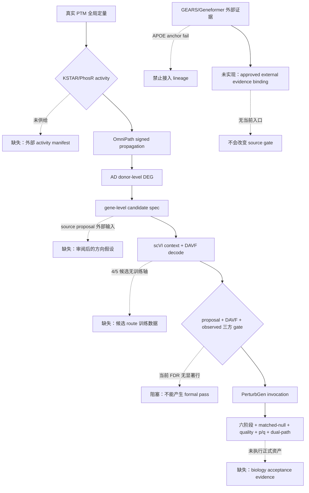

# PTM2CellNet 项目综合分析报告（2026-09-17）

> 本报告基于 2026-09-17 当前工作树、源码、测试、配置、运行产物、Git/ZMemory
> 记录编写。代码和测试是实现事实；历史报告只用于时间线；未运行或未具备正式
> 资产的内容明确标为未验证。正式 biology PASS：**0**。

## 目录

- [1. 摘要与审计边界](#1-摘要与审计边界)
- [2. 版本、协作与事实来源](#2-版本协作与事实来源)
- [3. 需求对照与模块完成度](#3-需求对照与模块完成度)
- [4. 未实现功能、接口与流程缺口](#4-未实现功能接口与流程缺口)
- [5. 未完全实现功能分类](#5-未完全实现功能分类)
- [6. 技术债、严重度与解决策略](#6-技术债严重度与解决策略)
- [7. 过时文档与报告归档](#7-过时文档与报告归档)
- [8. 验证结果与科学结论](#8-验证结果与科学结论)
- [9. 版本控制记录](#9-版本控制记录)
- [10. 本轮子代理统计](#10-本轮子代理统计)
- [11. 结论与后续顺序](#11-结论与后续顺序)

## 1. 摘要与审计边界

### 1.1 当前结论

主线仍是 `PTM → activity/有符号传播 → AD donor-level DEG 交集 → candidate spec
→ scVI/DAVF → 独立表达方向三方 gate → PerturbGen`。当前工程合同大部分已落地，
但正式科学闭环没有通过：

- AD observed gate 在当前两队列的多种无偏口径下没有 `FDR≤0.05` 行；不能通过调阈值
  把工程候选变成正式候选。
- DAVF 真实轴覆盖只审计到 KO route 的 `APOE`，KD route 为空；另外四个候选没有本地
  扰动训练输入，不能把 token vocabulary 覆盖当作 DAVF 训练覆盖。
- GEARS 与 Geneformer 资产已生成并通过统一 manifest/payload contract，但 APOE 预注册
  锚点回测失败，按“先证后用”边界两源均不接入 lineage。
- formal 六阶段、99 matched-null、未扰动质量、候选 empirical-p/q、BH-FDR、dual-path
  AND 的真实合规资产仍未形成一次正式 biology acceptance。

### 1.2 审计范围与排除项

本轮核对了 `AGENTS.md` 要求的当前状态、20260914 历史分析、`lessons.md` 最新条目、
README、PTM activity 执行方案、E2E/bridge/PTM 指南、20260916 分析与修复快照、当前
源码/测试/运行产物、Git 分支与远程状态。`archive/**` 作为历史资料读取，不再次扫描为
当前实现；不恢复已取消的实时质谱、自定义 PTM 数据库、GUI 或 API-key 功能。

### 1.3 事实分级

| 标记 | 含义 | 本报告示例 |
|---|---|---|
| 当前事实 | 源码、测试、manifest、运行产物或命令直接证明 | 86 项定向测试通过；锚点 JSON 为 `fail` |
| 历史事实 | 旧报告/旧 lessons 的带日期记录，仅说明当时状态 | 20260916 的 2848 全量记录 |
| 未验证/阻塞 | 缺真实输入、外部环境或没有当前运行证据 | formal biology acceptance、PTM activity |

## 2. 版本、协作与事实来源

### 2.1 Git 与 ZMemory 基线

| 项目 | 结果 |
|---|---|
| 工作目录 | `/home/scu/PTM2CellNet` |
| 当前分支 | `main` |
| 本轮开始 HEAD | `3bd4d6552a23753c00d7d183a7b95030e0477e91` |
| 本轮开始远程 | `origin/main=219b81fe9d77d1f49cd916989e227ca88a2417d7`（`git ls-remote`） |
| 开始时工作树 | 15 个 tracked 文件修改、12 个未跟踪文件；均保留并纳入本轮核验 |
| ZMemory | `zmemory resume` 返回无 active run；本会话注册为 `codex-f3e286`；开始编辑前目标文件均 `who=[]` 后 claim |
| CodeGraph | 544 files、11,395 nodes、21,128 edges；索引健康，仅用于结构导航，结论仍由源码/测试验证 |

### 2.2 当前证据入口

- 研究合同：[`docs/PTM_activity_AD_intersection_DAVF_PerturbGen_执行方案.md`](docs/PTM_activity_AD_intersection_DAVF_PerturbGen_执行方案.md) §2.3、§3.1、§4.1–§5.5、§6.4、§7、§10。
- 执行边界：[`docs/guides/davf_perturbgen_e2e.md`](docs/guides/davf_perturbgen_e2e.md) 的 gate/invocation/statistical evidence 段；[`docs/guides/perturbgen_bridge.md`](docs/guides/perturbgen_bridge.md) §1、§4–§6b。
- PTM 命令合同：[`docs/guides/ptm_activity_pipeline.md`](docs/guides/ptm_activity_pipeline.md) §1、§4a、§7.1–§7.3。
- 当前运行证据：`outputs/external_evidence/gears_predictions.manifest.json`、
  `geneformer_isp_EX.manifest.json`、`gears_evidence.json`、`geneformer_evidence.json`、
  `apoe_anchor_backtest.json`。
- 历史快照：`archive/20260917/project_analysis_20260916.md` 与
  `archive/20260917/project_repair_report_20260916.md`；不把其中的测试数字重写为本轮结果。

## 3. 需求对照与模块完成度

### 3.1 完成度口径

百分比是按“契约/实现/真实输入/科学验收”四个交付面做的当前状态估计，精确到一位
小数；不是测试覆盖率，也不是 biology PASS。一个模块只完成代码而缺真实资产时，
完成度不能记为 100.0%。

### 3.2 模块矩阵

| 模块 | 完成度 | 当前事实 | 缺失组件/依赖 | 分类 |
|---|---:|---|---|---|
| PTM 输入与 activity | 55.0% | 输入 schema、方向字段和 CLI 链存在；真实 PTM 定量、KSTAR/PhosR activity 未供给 | 外部 PTM/activity 标准表、manifest | 部分实现但可用（契约层） |
| Signed network 传播 | 75.0% | OmniPath signed release 已登记；简单路径传播、异号平行边剔除、path cap 有代码 | KSTAR/PhosR 上游 activity；正式研究输入 | 部分实现但可用 |
| AD donor-level DEG | 85.0% | `per_cell_log2_mean`、`pseudobulk_counts`、`pseudobulk_counts_centered` 与 audit 已实现；真实合并队列无显著行 | 更大/独立 donor 队列或获批准的 gate 语义 | 实现但科学验收阻塞 |
| Candidate spec 与三方 gate | 75.0% | proposal/DAVF/observed 分字段、source/target 分离、pass-only invocation 已实现 | 外部 source proposal；observed FDR；研究参考轴统一 | 部分实现但可用 |
| scVI context 与 DAVF | 45.0% | KO/APOE context 与 decode 有真实证据；KO={APOE}、KD=∅ | 4 个候选 DAVF 训练数据、KD route、held-out 方向验证 | 实现但输入不完整 |
| PerturbGen Workflow A | 70.0% | 六阶段、shared prepare、rescue、统计组装、formal verifier 有工程接口；P40 eager 探针通过 | 正式 cohort、99 null、质量、p/q、dual-path 真实运行 | 工程实现但科学未验收 |
| Workflow B / Gate-E | 45.0% | 60,030 行 vocabulary benchmark 及 identity migration 有证据 | LatentDAVF 重训、冻结 embedding、held-out Gate-E | 部分实现但不可正式验收 |
| 外部证据策略 B | 60.0% | GEARS/Geneformer 资产与统一 contract 通过；APOE anchor fail，未接 lineage | 可比 ground truth、批准的 lineage consumer、正式方向验证 | 实现但不符合当前准入条件 |
| Formal acceptance 编排 | 90.0% | `verify_formal_workflow_a` 汇总 Gate-4/5，缺输入返回 blocked/fail，不降级 | 真实 formal 输入资产 | 部分实现但可用 |

## 4. 未实现功能、接口与流程缺口

### 4.1 需求—实现差异

| 需求依据 | 需求原文/约束 | 当前实现 | 影响 | 优先级/范围 |
|---|---|---|---|---|
| 方案 §2.3、§10 | 正式验收必须有真实 normal/disease、raw counts、donor、≥3 个可评估 donor、canonical Ensembl、冻结 manifest | GSE174367/GSE157827 数据契约与部分 preflight 存在，但 formal 六阶段及完整统计未跑 | 不能发布 biology 结论 | 高 / 核心功能 |
| 方案 §3.1 | `ptm_site_direction`、`activity_direction`、`predicted_gene_direction`、`observed_direction`、`davf_predicted_direction`、`davf_action` 分字段 | 代码和 payload 分字段；外部证据也被隔离为 supplementary | 当前无代码缺口，但外部输入缺失 | 高 / 核心功能 |
| 方案 §5.5 | source 三方 gate 是候选准入；target concordance 不能替代 source gate | `evaluate_driver_target_gate` 只记录事实分类，保持 source gate 唯一准入 | 满足边界；不可把 target 计数写成因果验证 | 高 / 核心功能 |
| 方案 §6.4、§7 | Workflow B 要有冻结 embedding、LatentDAVF 重训和 held-out Gate-E | benchmark 完成，重训/held-out 未完成 | Gate-E 仍不可验收 | 高 / 核心功能 |
| bridge §6b | 外部模型证据先过 anchor，再进入 gate/lineage | GEARS/Geneformer 资产过 schema，但 APOE anchor `fail`，未接入 | 当前不能为 4 个无 DAVF 候选补正式方向 | 高 / 核心功能 |

### 4.2 已存在接口（不是缺失项）

以下接口已经有源码/测试，记录它们是为了避免重复开发：

| 接口 | 参数 → 返回 | 证据与用途 |
|---|---|---|
| `build_stage_rescue_extractor(deg_table, donor_obs_column, var_gene_column, ...)` | `request, StageExecutionResult → NullStageRecord` | `src/integration/perturbgen/null_rescue.py:24-137`；绑定真实 `pred_counts/X` 与 manifest hash |
| `verify_formal_workflow_a(e2e_report, frozen_manifest, null_distribution_manifests, quality_payload, eval_input, report_manifest)` | JSON/path 输入 → `dict`（各项 status、`verdict`、`missing_inputs`） | `src/integration/perturbgen/formal_verification.py`；统一 Gate-4/5 复核 |
| `evaluate_driver_target_gate(source_gate, target_evaluation, semantic_context)` | source gate + target evaluation → `DriverTargetGateEvidence` | `src/integration/perturbgen/downstream_target_evaluation.py:339-470`；只记录 supplementary concordance |
| `load_external_prediction_asset(manifest_path)` | manifest path → `ExternalPerturbationEvidence` | `src/integration/perturbgen/external_perturbation_evidence.py:143-258`；校验 hash、context、Ensembl 和 finite matrix |

### 4.3 真正缺失的接口与流程

#### 4.3.1 外部证据到 E2E lineage 的绑定接口

当前 `rg` 只找到 producer/assembler 和 unit tests，没有 E2E invocation 的
`external_evidence` 参数或 lineage consumer。缺失接口应由研究负责人批准后定义为：

```text
bind_external_evidence(
    e2e_report, candidate_spec, evidence_payload, anchor_verdict
) -> lineage entry or hard failure
```

输入必须绑定 candidate Ensembl、context、intervention semantics、evidence kind、manifest
路径和 anchor report；返回值必须是 report lineage 的 field-separated entry，anchor 非
`pass`、候选缺失或语义不匹配时直接硬失败。当前不实现该接口，因为现有 anchor 为
`fail`，实现 consumer 会给未通过证据增加可消费路径。

#### 4.3.2 真实 PTM/KSTAR/PhosR 输入适配

方案 §4.1、§10 要求外部标准表输入。当前代码要求已有 canonical 表和 manifest，未实现
特定厂商/服务适配器：

```text
load_ptm_activity_asset(manifest_path) -> validated global activity table
```

所需字段、方向语义、network release、样本/批次和缺失规则必须由外部资产 manifest
提供；不能在仓库内猜测或生成 PTM q 值。缺少该输入时，PTM 侧仍只能是
`prediction_status=direction_only`。

#### 4.3.3 正式 biology acceptance 执行

`verify_formal_workflow_a` 是现有编排器，不是资产生成器。尚缺一组可追溯的正式输入：
真实 gate-pass E2E report、冻结 cohort、≥99 matched-null stage manifests、未扰动质量、
dual-path eval input/report manifest。缺失时已有接口应返回 `blocked`/`fail`，不能新增
synthetic fallback。

### 4.4 缺失主流程与分支流程



## 5. 未完全实现功能分类

### 5.1 判断标准

- **部分实现但可用**：接口、输入输出和失败边界可运行；缺口来自明确外部资产或研究决策，
  不会把缺口静默变成结果。
- **实现但有缺陷**：正常路径存在可复现错误、错误结果或验证无法阻止不合规输入。
- **实现但不符合规范**：代码能运行，但与当前方案的语义、来源隔离、gate 或正式验收
  条件冲突。

### 5.2 当前分类结果

| 功能 | 分类 | 证据 | 处理 |
|---|---|---|---|
| donor DEG 三种 estimand | 部分实现但可用 | `src/analysis/ad_deg_table.py`、`tests/unit/analysis/test_ad_deg_table.py`；centered 合成性质通过，真实 FDR 仍不可达 | 保留多队列工具，不调阈值 |
| driver–target lineage | 部分实现但可用 | `evaluate_driver_target_gate` 与 E2E sidecar 测试通过 | 不把 target concordance 变成 pass |
| formal verifier | 部分实现但可用 | 缺输入时 `blocked`/`fail`，测试覆盖 8 项 | 等真实资产 |
| GEARS/Geneformer 外部方向证据 | 实现但不符合当前准入规范 | 两份 evidence payload 通过 schema；`apoe_anchor_backtest.json` 为 `fail` | 不接入 lineage；不能宣称方向已验证 |
| LPM producer/文档 | 历史实现，当前不适用 | 默认 K562 essentialome 2,285 行对候选全 MISS；bridge §6a 已标关闭 | 保留历史脚本，不列当前路线 |
| external evidence → E2E consumer | 未实现 | E2E 源码没有 external evidence 参数/lineage 写入路径 | 需研究批准后单独实现 |

## 6. 技术债、严重度与解决策略

### 6.1 严重度标准

| 等级 | 判定标准 |
|---|---|
| 严重 | 阻断正式 biology acceptance，或会把未经验证/语义错误的结果发布为正式结论 |
| 高 | 阻断核心主流程、核心候选覆盖或可复现实验，需外部资产/研究决策才能继续 |
| 中 | 不立即阻断主线，但影响可维护性、复核效率、审计完整性或重复运行成本 |
| 低 | 局部文档、命名或非关键工具体验问题，不改变结果 |

### 6.2 债务清单与证据

| 编号 | 等级 | 问题与影响范围 | 证据 |
|---|---|---|---|
| TD-17-01 | 严重 | 真实 PTM 定量/KSTAR/PhosR/activity 尚未进入主线，PTM 侧无法产生正式方向证据 | 方案 §4.1、§10；`docs/CURRENT_STATUS.md` 当前条目；无已消费 activity manifest |
| TD-17-02 | 严重 | observed 三方 gate 在现有队列不可达，正式候选无法形成 | `outputs/ptm_activity/20260916_d2/` 与 lessons L-20260916-05；centered min FDR EX 0.5254、INH 0.7908 |
| TD-17-03 | 严重 | 4/5 候选没有 DAVF 训练轴，KD route 为空；无法把 vocabulary coverage 当模型证据 | `docs/CURRENT_STATUS.md` U3/策略 B 条目；DAVF axis audit 记录 |
| TD-17-04 | 高 | formal 六阶段、matched-null、quality、p/q、dual-path 的真实组合运行尚未完成 | `verify_formal_workflow_a.py` 的 missing inputs；bridge §4–§6b |
| TD-17-05 | 高 | 外部 evidence consumer 尚未进入 E2E，且现有 anchor fail；若贸然接线会绕过证据准入 | `outputs/external_evidence/apoe_anchor_backtest.json`；`rg external_perturbation` 无 E2E consumer |
| TD-17-06 | 中 | 活动文档曾同时把 LPM 写成当前路线和已切换路线，容易让操作者运行过时命令 | bridge §6a/§6b、PTM guide §7.3；本轮已同步为历史/关闭与当前策略 B |
| TD-17-07 | 中 | 外部环境脚本依赖具体 cell-gears/Geneformer API，主环境无法静态验证其外部运行语义 | `scripts/run_gears_predictions.py`、`scripts/run_geneformer_isp.py`；依赖独立环境 |
| TD-17-08 | 低 | 20260916 日报和修复报告在当前状态更新后不再是活动入口 | 本轮已移动至 `archive/20260917/` 并保留 manifest |

### 6.3 严重/高/中债务解决策略

#### TD-17-01：PTM/activity 外部输入

| 方案 | 优点 | 缺点 | 实施步骤 / 工期 |
|---|---|---|---|
| A：冻结真实标准表并登记 manifest | 与现有 contract 最一致，改动最小 | 依赖外部研究人员和数据许可 | 冻结 PTM/activity/network release 0.5 天；manifest/contract 校验 1.0 天；重跑传播 1.0 天 |
| B：先只交付 activity 资产，PTM 侧保持 direction-only | 可先验证传播和字段隔离 | 不能形成正式 PTM 候选 | 资产审阅 0.5 天；CLI 试跑与 lineage 核对 1.0 天 |
| C：取消该主线输入 | 不消耗外部数据时间 | 研究目标改变，需重新批准方案 | 研究决策 0.5 天；报告/roadmap 同步 0.5 天 |

资源：PTM/KSTAR/PhosR 领域人员、许可数据、现有主环境。风险：来源版本和方向语义
不一致；不得由代码自动补齐。

#### TD-17-02：observed gate 无显著行

| 方案 | 优点 | 缺点 | 实施步骤 / 工期 |
|---|---|---|---|
| A：增加独立 donor 队列 | 保留现有 FDR 契约，科学解释最直接 | 数据获取、批次校正和 donor 许可成本高 | 队列契约审计 1.0 天；合并/centered 复评 1.0 天；独立复核 0.5 天 |
| B：预注册独立基因面板 | 统计功效可能提升且可控制 BH universe | 依赖独立于 DEG 结果的研究输入，不能事后选择 | 面板审批 0.5 天；参数/manifest 1.0 天；复算 0.5 天 |
| C：修订 gate 语义 | 可以明确研究目标是方向关联而非显著性 gate | 改变正式契约，不能由实现者自行决定 | 方案审批 0.5 天；contract/测试 1.0 天；报告重算 1.0 天 |

资源：统计/AD 研究负责人和 donor-level 数据。风险：事后调阈值或按结果挑面板会破坏
预注册，当前不执行。

#### TD-17-03：DAVF 训练轴与 KD 缺失

| 方案 | 优点 | 缺点 | 实施步骤 / 工期 |
|---|---|---|---|
| A：获取 AD 相关真实扰动数据 | 可补齐目标候选的训练/held-out 证据 | 外部数据稀缺且环境适配成本高 | 数据检索/许可 2–5 天；契约审计 1.0 天；训练与 held-out 3–5 GPU 天 |
| B：正式收缩到 APOE KO | 使用已有真实轴和 context，最短可验收 | 研究结论不再覆盖 5 候选/KD | 研究审批 0.5 天；冻结 candidate spec 0.5 天；formal 运行 3–5 GPU 天 |
| C：仅保留 exploratory 外部模型方向 | 可记录候选但不伪装为 DAVF 证据 | 不能进入 formal gate 或 biology PASS | schema/报告标注 0.5 天；不新增模型兼容层 |

#### TD-17-04：formal 资产未执行

| 方案 | 优点 | 缺点 | 实施步骤 / 工期 |
|---|---|---|---|
| A：解锁现有 APOE formal lane | 复用已有 verifier、P40 eager 路径和冻结 cohort | 仍受 observed/source gate 决策限制 | gate/proposal 核对 0.5 天；六阶段 1–2 GPU 天；null/统计 2–3 GPU 天 |
| B：先只跑 engineering replay | 验证执行编排和 manifest 接线 | 不产生 biology PASS | 资产清单 0.5 天；replay/verify 0.5 天 |
| C：暂停 formal lane | 避免在输入未满足时浪费 GPU | 不推进核心验收 | 研究决策 0.5 天；保持现有 hard-fail 契约 |

#### TD-17-05：外部 evidence consumer/anchor

| 方案 | 优点 | 缺点 | 实施步骤 / 工期 |
|---|---|---|---|
| A：先建立可比 ground truth 再实现 binding | 减少把不可比 anchor 当有效证据的风险 | 需要新的同 context 测试数据 | 设计/预注册 1.0 天；数据与回测 1–3 天；binding 1.0 天 |
| B：永久作为 supplementary sidecar | 不污染主线 gate，保留探索价值 | 外部方向不能驱动正式 candidate | 报告 schema 0.5 天；消费前硬拒绝 0.5 天 |
| C：删除外部证据链 | 最小维护成本 | 放弃 unseen 候选的辅助探索 | 研究决策 0.5 天；移除 producer/文档 1.0 天 |

#### TD-17-06/07：文档和外部环境可复核性

统一建议：保持 `§6a` 历史关闭标记、`§6b` 当前策略、manifest 的版本/语义/许可字段；
外部环境每次运行保留命令、包版本、输入 manifest 和输出 contract。工期 0.5–1.0
天/次，资源为文档维护者和对应外部模型环境。不要把外部适配器灌入 core requirements。

## 7. 过时文档与报告归档

### 7.1 识别标准与范围

内容与当前代码/需求发生实质性差异，且文件是活动入口或最新同日快照，标为过时；仅因
日期较旧但明确标成历史、已在既有 archive 清单中的文件不重复移动。报告超过 30 天或
不能代表当前运行状态才标为过期。`archive/**` 内历史文件不再次搬迁。

### 7.2 本轮实际归档

| 原路径 | 归档路径 | 理由 |
|---|---|---|
| `project_analysis_20260916.md` | `archive/20260917/project_analysis_20260916.md` | 不含 20260917 策略 B、资产 manifest 和 anchor fail；已被本报告取代 |
| `project_repair_report_20260916.md` | `archive/20260917/project_repair_report_20260916.md` | 只覆盖 20260916 repair 批次；不能反映当前外部证据和 lineage 状态 |

清单、版本、mtime、大小和可恢复移动记录见 [`archive/20260917/ARCHIVE_MANIFEST.md`](archive/20260917/ARCHIVE_MANIFEST.md)。

### 7.3 保留但已同步的活动文档

`docs/CURRENT_STATUS.md`、`docs/guides/perturbgen_bridge.md`、
`docs/guides/ptm_activity_pipeline.md`、API/技术/项目入口均不是归档对象，而是本轮同步
到 20260917。bridge §6a LPM 由活动路径改为历史关闭；§6b 记录 GEARS/Geneformer
anchor fail 与不接入 lineage。更早的 20260914/15 报告保留为有日期的历史证据。

## 8. 验证结果与科学结论

### 8.1 本轮已执行检查

| 检查 | 目的 | 结果 |
|---|---|---|
| `zmemory resume` | 恢复协作上下文 | `no active runs` |
| `git status/branch/remote/git ls-remote` | 确认未丢失改动、分支和远端 | 已确认，未 push |
| 86 项定向 pytest | 覆盖本轮 DEG、driver-target、E2E、external evidence、formal、rescue | **86 passed / 24 warnings / 4.68s** |
| 外部 payload 读取 | 核对真实 manifest/h5ad contract | GEARS/Geneformer 均 `assemble` exit 0，5 候选无 missing |
| APOE anchor backtest | 阻止不可比外部证据进入 lineage | `verdict=fail`；一致率 0.25、Spearman -0.0428 |
| CLI help | 确认入口存在且无 LPM-only consumer 描述 | `assemble_external_evidence.py`、`apoe_anchor_backtest.py`、`verify_formal_workflow_a.py` exit 0 |
| `python -m compileall -q src scripts tests` | Python 编译完整性 | exit 0 |
| `git diff --check` | 空白错误 | exit 0，无输出 |
| `ruff check src scripts tests` | 静态错误 | exit 0，All checks passed |
| `python -m ruff format --check src scripts tests` | 格式一致性 | exit 0，515 files already formatted |
| `python -m mypy src/ --ignore-missing-imports` | 类型错误 | exit 0，177 source files 无错误 |
| `python scripts/check_requirements_consistency.py` | core/lock 依赖一致性 | exit 0，274 lock pins 满足约束 |
| 完整非 slow/gpu 回归 | 当前源码/测试全量回归 | **2860 passed / 22 skipped / 85 warnings / 767.43s / exit 0** |

### 8.2 真实资产边界

- `outputs/external_evidence/gears_evidence.json` 和 `geneformer_evidence.json` 是
  contract-valid 的模型输出，不是因果验证。
- `outputs/external_evidence/apoe_anchor_backtest.json` 明确写 `verdict=fail`，并说明
  Frangieh co-culture 与 Norman/Geneformer context 只能作为不通过的 sanity anchor；
  不能把 Geneformer 的 embedding influence spectrum 当 up/down expression direction。
- 正式 biology PASS 数量：**0**。synthetic、smoke、bridge、contract-valid、schema-valid
  和 external-model asset-valid 均不改变此结论。

## 9. 版本控制记录

### 9.1 本轮提交前

- 分支：`main`，无需从其他分支合并；本地 HEAD 已包含远程 `origin/main`，未执行
  `fetch`、`merge` 或 `push`。
- 提交前版本：`3bd4d6552a23753c00d7d183a7b95030e0477e91`。
- 关键修改：外部证据策略 B 文档事实同步；移入两份 20260916 快照；保留并核验
  DEG centered、driver-target、formal/rescue、GEARS/Geneformer/LPM producer 与测试；
  移除 external assembler 的 missing-candidate 绕过开关。

### 9.2 提交后

已完成首个交付提交并核验：

- 提交：`ae3b0a6e01ea9450927a514c2df55b1ba9149671`，消息为
  `chore: finalize 20260917 audit and evidence contracts`。
- 提交后 `HEAD` 与上述提交一致；`git status --short --branch` 为 `## main`，无未提交路径。
- `git rev-list --left-right --count HEAD...origin/main` 为 `17 0`；远端查询仍为
  `219b81fe9d77d1f49cd916989e227ca88a2417d7 refs/heads/main`。因此本轮未合并、未 push，
  也没有声称远端已同步。
- 提交后 `python -m compileall -q src scripts tests` 与 `git diff --check` 均 exit 0。

本节的事实回写会形成后续仅文档元数据提交；最终 `HEAD` 和提交链同时记录在最终交付回复中。

## 10. 本轮子代理统计

### 10.1 调用统计

按用户要求，本轮实际子代理调用数记录为 **1**，不再派生新的子代理。ZMemory 中可观测
到的会话是 `codex-gpt-5.6-luna / codex-comprehensive-20260917`，开始时间
`2026-09-17T15:46:25.298Z`。

| 智能体名称 | 调用次数 | 主要执行任务 | 平均执行时长 |
|---|---:|---|---|
| `codex-gpt-5.6-luna` | 1 | 本轮综合审计、外部证据策略 B、报告/归档核查 | 不可得：ZMemory 只暴露开始时间，没有完成事件；不虚构 wall time |

该统计不是把历史 agents 列表中的旧会话重复计入；历史 session 只作为协作背景。

## 11. 结论与后续顺序

### 11.1 结论

本轮完成了当前工作树的事实审计、过时同日快照归档、活动文档同步、外部证据 contract
复核和综合报告。工程接口没有证据表明需要新增 fallback；外部证据 anchor 失败后保持
硬隔离是当前正确行为。正式 biology PASS 仍为 **0**。

### 11.2 最短后续顺序

1. 研究负责人冻结真实 PTM/KSTAR/PhosR 输入、source proposal、参考轴和 objective。
2. 决定扩大 donor 队列、预注册独立 gene panel，或正式修订 observed gate 语义；不得调阈值。
3. 选择 APOE-only formal lane 或提供 4 个候选的真实扰动训练数据；补齐 KD/held-out 证据。
4. 在 gate/pass 和真实资产齐备后运行 P40 eager 六阶段、matched-null、quality、p/q、
   dual-path 与 `verify_formal_workflow_a`。
5. 只有获得可比 external-model ground truth 且 anchor 通过后，才设计并实现
   `bind_external_evidence`；当前不接入主线 lineage。
