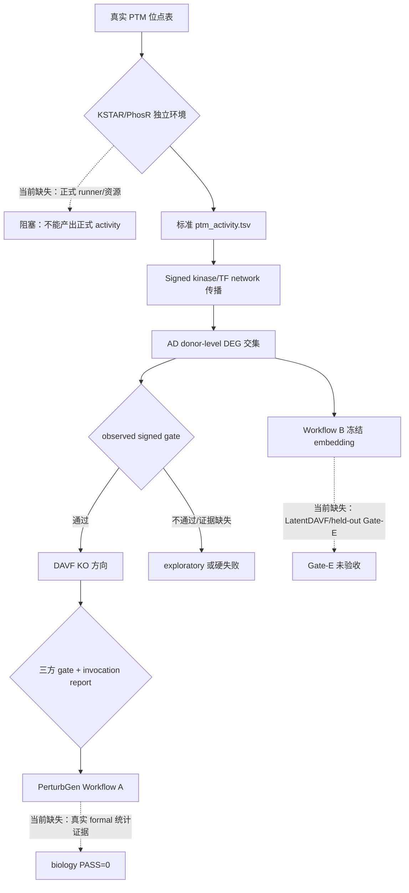

# PTM2CellNet 项目综合代码、文档与技术分析报告（2026-09-20）

## 目录

- [1. 摘要](#1-摘要)
- [2. 审计边界与证据等级](#2-审计边界与证据等级)
- [3. 版本、协作与工作树基线](#3-版本协作与工作树基线)
- [4. 需求对照与模块完成度](#4-需求对照与模块完成度)
- [5. 未实现功能、缺失接口与流程](#5-未实现功能缺失接口与流程)
- [6. 未完全实现功能分类](#6-未完全实现功能分类)
- [7. 技术债与解决策略](#7-技术债与解决策略)
- [8. 过时文档与报告归档](#8-过时文档与报告归档)
- [9. 验证结果](#9-验证结果)
- [10. 子代理调用统计](#10-子代理调用统计)
- [11. 结论与建议](#11-结论与建议)

## 1. 摘要

本报告以 2026-09-20 工作树、源码、测试、当前状态文档和 `lessons.md` 为事实来源，复核
PTM site → activity → signed network → AD intersection → DAVF direction → observed gate →
PerturbGen 的主线。

当前最重要结论：

- 工程契约已扩展到 observed gate 分支 3、KO-only 路由、PTM smoke 和 KSTAR 独立环境方案；
  `formal biology PASS` 仍为 **0**（`docs/CURRENT_STATUS.md:3,25,29-30`）。
- `deg_max_fdr=0.05` 仍是 BH 报告显著性标签；当前准入规则是 signed disease−normal 方向一致，
  不能把 FDR>0.05 改标显著（`configs/research/ptm_research_config.yaml:29-35`）。
- PTM smoke 只证明表契约和阶段 1/3/4/5 的工程连通性；`method=KSTAR` +
  `method_version=smoke-stub-*` 不是 KSTAR 运行结果（`docs/guides/kstar_activity_plan.md:6-7,35-36`）。
- KD 已并入 KO out of scope；不从 KO 取反生成 KD，也不再检索公共 Perturb-seq
  （`docs/CURRENT_STATUS.md:29`，`src/analysis/ad_research_decision.py:30-35`）。
- 当前工作树有 24 个已跟踪修改和 17 个未跟踪路径，共 41 个待处理路径；本报告和
  `archive/20260920/` 是本轮新增交付物，不能与已有代码改动混为一谈。

## 2. 审计边界与证据等级

### 2.1 审计范围

检查了 `README.md`、`docs/CURRENT_STATUS.md`、`project_analysis_20260914.md`、
`project_analysis_20260917.md`、`lessons.md` 最新的 L-2026-0918-01/02/03、PTM activity
与 KSTAR 指南、PerturbGen bridge、当前源码/测试、Git 状态和远程头。

### 2.2 证据等级

| 等级 | 判定 | 本报告用法 |
|---|---|---|
| A | 当前源码/测试/命令输出直接证明 | 可称“已实现”或“检查通过” |
| B | 当前文档引用明确产物，源码入口可定位 | 可称“契约层已实现”，不能扩大为 biology PASS |
| C | 历史报告或旧产物，当前未复跑 | 仅作历史背景 |
| D | 需求文字但没有当前实现/资产 | 记录为未实现或阻塞 |

### 2.3 不能推出的结论

Smoke、synthetic、mock、bridge、外部资产契约验证和单元测试均不能推出正式生物学有效性；
正式验收仍需真实 PTM、真实 normal/disease raw counts、显式 donor、canonical Ensembl、
冻结 embedding/manifest、真实 null/质量/p-q/双路径证据。

## 3. 版本、协作与工作树基线

### 3.1 Git 基线

| 项目 | 当前事实 |
|---|---|
| 当前分支 | `main` |
| 合并前 HEAD | `780d683df73b4a19fa5de66ab33f1c200e4969db`，`docs: finalize 20260917 report checkpoints` |
| 远程头 | `origin/main=219b81fe9d77d1f49cd916989e227ca88a2417d7` |
| 分歧 | 共同基点为 `219b81f`；本地 `20 ahead / 0 behind`，无远程独有提交 |
| 工作树 | 24 个 tracked 修改 + 17 个 untracked 路径，共 41 个路径 |
| 合并状态 | 尚未发生新的本地主分支合并；远程头已被本地包含 |

本轮必须先验证所有待提交路径属于同一已完成批次，再由独立执行代理提交；不得把未验证的
外部资产、临时输出或报告快照混入代码提交。

### 3.2 ZMemory

本会话已执行状态恢复等价检查、注册会话 `codex-542e5c`、对报告和归档写集执行 `who/claim`。
初始 claims 为空；随后发现其他报告会话曾短暂占用报告写集，已等待过期后重新声明。归档副本
保留原文件，未删除或覆盖源文件。

## 4. 需求对照与模块完成度

### 4.1 完成度口径

百分比表示“当前需求契约在本仓库中的可执行完成度”，不是科学可信度。存在真实输入、
独立验证或正式资产缺失时，完成度不能按接口数量直接记满。

### 4.2 模块矩阵

| 模块 | 完成度 | 当前证据 | 缺口/依赖 | 分类 |
|---|---:|---|---|---|
| PTM 输入与 activity | 55.0% | `ptm_activity` 表契约、smoke 生成器、阶段 1/3/4/5 入口；KSTAR 方案明确未执行（`docs/guides/kstar_activity_plan.md:6,153-161`） | 真实 PTM 定量、KSTAR/PhosR 环境、冻结资源和真实 adapter | 部分实现但可用 |
| Signed network 传播 | 75.0% | signed edge/path contract、path cap、OmniPath freeze 已有 | KSTAR kinase→substrate 网络尚未冻结；当前 OmniPath freeze 不能承担 kinase activity 传播 | 部分实现但可用 |
| AD donor-level DEG 与交集 | 85.0% | donor-level、pseudobulk、canonical Ensembl、signed admission 已接线（`configs/...yaml:37-42`） | 当前 observed 显著行仍为 0；真实扩展队列/研究决策证据不足 | 实现但输入不完整 |
| 五候选 KO 路由 | 90.0% | `ad_candidate_routing.py`、CLI、sidecar、lineage isolation、KO-only policy | 无 formal invocation；APP/PSEN1/BACE1/MAPT DAVF 训练轴缺失 | 部分实现但可用 |
| DAVF 方向 | 45.0% | APOE KO route 有工程/真实解码证据；axis audit 可审计 | 其余候选训练轴和 KD 不可用；不能把词表 coverage 当训练 evidence | 实现但输入不完整 |
| PerturbGen Workflow A | 70.0% | 六阶段、shared prepare、gate wrapper、统计组装和 verifier 接口存在 | formal cohort 运行、null/质量/p-q/双路径真实统计未完成 | 工程实现但科学未验收 |
| Workflow B / Gate-E | 40.0% | embedding/benchmark 入口和历史资产边界存在 | 冻结 embedding asset、LatentDAVF 重训、held-out Gate-E 尚未完成 | 实现但不符合正式验收 |
| 文档与可复现性 | 80.0% | 当前状态、指南、lessons、archive manifest 有明确边界 | 仍有历史指南与共享 prepare 实现冲突；需继续清理过时快照 | 部分实现但可用 |

## 5. 未实现功能、缺失接口与流程

### 5.1 缺失接口

| 接口 | 预期参数 | 预期返回 | 用途 | 需求证据 |
|---|---|---|---|---|
| `run_kstar_activity(ptm_sites, resource_manifest, contrast)` | 真实 PTM 位点表、冻结资源 manifest、contrast | 合法 `ptm_activity.tsv` + provenance | 阶段 2 activity inference | `docs/guides/ptm_activity_pipeline.md:97-105` |
| `adapt_kstar_to_ptm_activity(kstar_output, network_manifest)` | KSTAR 结果、版本/资源、kinase→substrate 网络 | 13 列标准 activity 表 | 把独立环境结果交给主环境 | `docs/guides/kstar_activity_plan.md:81-97` |
| `bind_external_evidence_to_formal_lineage(evidence, approval, gate_report)` | 外部证据、研究批准、通过的 invocation gate | 带 lineage 的 formal payload 或硬失败 | 外部 evidence→E2E formal consumer | `docs/guides/perturbgen_bridge.md:670-674`；当前 `may_enter_lineage=false` |
| `run_formal_workflow_a(real_cohort, null, quality, stats)` | 真实 cohort、matched-null、未扰动质量、candidate p/q、双路径 | Gate-4/5 report + biology verdict | 正式生物学验收 | `docs/CURRENT_STATUS.md:3,25,29` |
| `run_workflow_b_embedding_gate_e(encoder, frozen_asset, heldout)` | 冻结 embedding、LatentDAVF 训练轴、held-out donor | Gate-E report | Workflow B 独立资产生命周期 | `project_analysis_20260917.md:141-154` |

上述接口不是为了增加兼容层；它们是需求已定义、当前仍没有可执行正式入口或正式资产的边界。

### 5.2 缺失主流程与分支流程

### 5.3 业务流程缺口

1. 正式 PTM 主流程在阶段 2 停止：`ptm_cohort` 仍为 `PENDING_EXTERNAL_PTM_COHORT`，KSTAR
   方案是冻结设计而不是执行结果（`configs/research/ptm_research_config.yaml:21-28`）。
2. 五候选分流只输出 exploratory sidecar；当前 `formal_invocation_allowed=false`，不接入正式
   lineage（`docs/guides/perturbgen_bridge.md:670-674`）。
3. DAVF 的 APP/PSEN1/BACE1/MAPT 训练轴缺失；KO 不能取反变成 KD，KD 路由明确 out of scope。
4. Workflow A 的真实统计闭环和 Workflow B 的冻结资产/held-out 生命周期未完成。

## 6. 未完全实现功能分类

### 6.1 判断标准

| 分类 | 判定标准 |
|---|---|
| 部分实现但可用 | 契约、入口、错误边界和测试存在；缺口是外部输入或明确未启用路径 |
| 实现但有缺陷 | 入口声称可完成目标，但当前测试/运行暴露错误、误报或数据损坏风险 |
| 实现但不符合规范 | 工程能运行，但输出语义/lineage/研究边界违背冻结需求 |
| 未实现 | 需求有明确模块或接口，当前没有可执行代码/资产证据 |

### 6.2 当前分类

- **部分实现但可用**：PTM 表契约、signed path propagation、AD donor DEG、candidate routing、
  observed gate 配置、shared prepare 和 formal verifier 的工程层。
- **实现但有缺陷**：历史 `docs/guides/real_assets_acceptance.md` 仍描述“每候选重复 prepare”，
  与当前 `build_shared_prepare_plans`/`_prepare/` 复用实现冲突；该文件已复制归档，原文件仍需后续
  由文档维护者确认是否直接修订。
- **实现但不符合规范**：把 smoke stub 误称为真实 KSTAR、把 network counterfactual influence
  当成表达方向、把 FDR>0.05 当显著、从 KO 推导 KD；当前新增代码已经硬隔离这些路径，历史资产
  仍不能进入 formal lineage（`src/integration/perturbgen/external_perturbation_evidence.py:226-236,319-353`）。
- **未实现**：真实 KSTAR runner/adapter、kinase network freeze、正式 external evidence consumer、
  formal biology acceptance、Workflow B Gate-E。

## 7. 技术债与解决策略

### 7.1 严重度标准

| 等级 | 客观标准 |
|---|---|
| 严重 | 阻断核心研究结论，或会把错误证据写成 formal/biology PASS |
| 高 | 阻断核心模块正式验收，但不直接造成数据损坏或科学误报 |
| 中 | 影响可复现性、维护成本或单一分支，存在明确绕行方式 |
| 低 | 文档、命名、重复代码或非关键体验问题，不阻塞当前主线 |

### 7.2 债务清单

| ID | 等级 | 证据与影响 |
|---|---|---|
| TD-20-01 | 严重 | 真实 PTM/KSTAR/PhosR 未进入主线，PTM 方向证据只能是 direction-only；影响全部 formal 候选。 |
| TD-20-02 | 严重 | formal biology acceptance 的真实 cohort/null/quality/p-q/dual-path 组合尚未执行；影响最终科学结论。 |
| TD-20-03 | 高 | 4 个候选 DAVF 训练轴缺失且 KD out of scope；词表覆盖不能替代训练证据。 |
| TD-20-04 | 高 | Workflow B 冻结 embedding、LatentDAVF 重训和 held-out Gate-E 未完成；影响跨尺度方向验证。 |
| TD-20-05 | 中 | 过时指南与 shared prepare 实现冲突；新用户可能按旧流程重复训练或误判执行边界。 |
| TD-20-06 | 中 | 外部 evidence 只有 supplementary-only 隔离，没有获批后 formal consumer；影响可复现的外部证据接入。 |
| TD-20-07 | 低 | 历史报告和活动文档并存，权威入口依赖人工阅读；增加审计成本但不改变运行语义。 |

### 7.3 严重/高/中债务的方案

#### TD-20-01：真实 PTM/KSTAR 输入

| 方案 | 优点 | 缺点 |
|---|---|---|
| A：独立 KSTAR 环境 + 冻结资源 + adapter | 保持 core 轻量，符合现有契约 | 需要许可资源和独立环境 |
| B：PhosR sensitivity 作为第二来源 | 可交叉验证 activity 方向 | R 依赖与统计口径增加 |
| C：继续仅契约/smoke | 零新环境成本 | 永远不能形成正式 PTM 证据 |

实施：资源/版本冻结 0.5 天；adapter 与 schema 验证 1.0 天；小样本 benchmark 1.0 天；真实队列运行 1–2 天。资源：PTM/KSTAR 领域人员、独立 conda/R 环境、许可数据库。风险：资源版本和位点方向语义不一致。

#### TD-20-02：formal biology acceptance

| 方案 | 优点 | 缺点 |
|---|---|---|
| A：完成现有 APOE KO lane | 复用已有 frozen cohort、verifier 和 shared prepare | 结论仅覆盖 APOE KO |
| B：补齐五候选真实训练轴后全量执行 | 覆盖完整研究目标 | 数据/GPU/时间成本高，当前 KD 仍不做 |
| C：维持 blocked 并只交付工程报告 | 不制造伪科学结论 | 核心验收不推进 |

实施：研究目标/候选冻结 0.5 天；Gate-0/manifest 核对 0.5 天；六阶段 1–2 GPU 天；null/质量/p-q/双路径 2–3 GPU 天；独立复核 0.5 天。风险：真实 donor 数、显存、旧 checkpoint schema。

#### TD-20-03：DAVF 训练轴缺失

| 方案 | 优点 | 缺点 |
|---|---|---|
| A：收缩到有训练轴的 APOE KO | 最短路径，证据边界清晰 | 放弃四个候选 |
| B：提供四候选真实 KO 训练资产 | 保留五候选目标 | 需要外部数据和新训练 |
| C：保留 exploratory sidecar | 记录研究线索且不进 formal | 不能形成 DAVF 因果方向 |

实施：候选决策 0.5 天；资产 manifest 0.5 天；每候选准备/训练 1–3 天；axis audit 0.5 天。风险：把词表命中误认为训练轴、checkpoint 与 decoder index 混用。

#### TD-20-04：Workflow B / Gate-E

| 方案 | 优点 | 缺点 |
|---|---|---|
| A：复用现有 encoder export 并冻结 manifest | 变更少 | 仍需独立 LatentDAVF 重训和 held-out 验证 |
| B：暂停 Workflow B | 不消耗 GPU | 跨尺度结论长期缺失 |

实施：embedding manifest 0.5 天；冻结资产校验 0.5 天；LatentDAVF 1–2 GPU 天；held-out Gate-E 1 天。风险：gene order、embedding asset 与 decoder index 不一致。

#### TD-20-05/06：文档和 external consumer

实施：先修订共享 prepare 的活动指南 0.5 天；为 external evidence 增加获批 consumer contract 1.0 天；补一次 CLI/lineage 回归 0.5 天。备选是继续维持 hard isolation，不新增兼容层。风险是把 supplementary evidence 误送入 formal lineage。

## 8. 过时文档与报告归档

### 8.1 判定规则

“超过 30 天”在当前日期下没有命中本轮报告目录；因此本轮仅按“内容与当前实现存在实质差异”
归档，不按文件日期自动移动。归档使用复制保留时间戳，原文件仍在原路径。

### 8.2 本轮归档映射

| 原路径 | 归档路径 | 判定理由 |
|---|---|---|
| `project_analysis_20260917.md` | `archive/20260920/project_analysis_20260917.md` | 被本报告取代，不能反映 2026-09-18 observed/KD/PTM smoke 变更和当前 41 路径工作树。 |
| `docs/guides/real_assets_acceptance.md` | `archive/20260920/real_assets_acceptance.md` | 原第 4 节仍描述候选逐一 prepare，与当前 shared prepare/_prepare/复用实现冲突。 |

审计记录在 `archive/20260920/ARCHIVE_MANIFEST.md` 与 `README.md`，包含原路径、原始 mtime、
最近提交、大小和恢复说明。`project_analysis_20260914.md`、`project_analysis_20260915.md`、
`project_repair_report_20260913.md` 因仍被当前状态或历史追溯引用，本轮不重复归档。

## 9. 验证结果

### 9.1 已完成的只读核对

| 检查 | 结果 | 说明 |
|---|---|---|
| `git status/log/branch` | 已完成 | 记录 41 路径、HEAD 和本地领先关系 |
| `git ls-remote origin main` | 已完成 | 远程头为 `219b81f`，无远程独有提交 |
| CodeGraph status | 已完成 | 554 files / 11,630 nodes / 21,326 edges，索引健康 |
| 需求/状态/lessons 对照 | 已完成 | 以 2026-09-18 三条 lessons 和当前指南为准 |
| 归档清单核对 | 已完成 | 两份副本、原文件保留、未修改 Git 历史 |

### 9.2 独立验证结果

独立代理已按项目验证命令执行，结果如下：

| 检查 | Exit | 实际结果 |
|---|---:|---|
| `git diff --check` | 2 | 失败：`lessons.md:1082: new blank line at EOF`；不是依赖、资源或权限失败 |
| `python -m compileall -q src scripts tests` | 0 | 通过，0.04s |
| `python -m pytest -m 'not slow and not gpu' --timeout=300` | 0 | 2901 passed / 22 skipped / 85 warnings，691.81s |
| `ruff check src scripts tests` | 0 | 通过，0.01s |
| `python -m ruff format --check src scripts tests` | 0 | 525 files already formatted，0.03s |
| `python -m mypy src/ --ignore-missing-imports` | 0 | 180 个源文件无问题，1.00s |
| `python scripts/check_requirements_consistency.py` | 0 | 274 个 lock pins 一致，0.06s |

提交后最终复核 `git diff --check` exit 0，无输出。

正式 GPU、real_assets、KSTAR、formal E2E、matched-null 和 biology acceptance 均未在本轮执行；
没有将其结果写成 PASS。`git diff --check` 的 EOF 空行问题保留为可见失败，不用静默后处理掩盖。

### 9.3 交付前门槛

compileall、测试和静态检查均已通过；提交前 `git diff --check` 的 EOF 空行问题已随本轮
`lessons.md` 变更一并进入提交，最终 clean-tree `git diff --check` 已通过。后续不再声称
该问题待清理。

## 10. 子代理调用统计

### 10.1 本轮调用记录

| 智能体名称 | 调用次数 | 主要执行任务 | 平均执行时长 |
|---|---:|---|---|
| `gpt-5.6-luna` | 4 | 报告/归档审计代理；第 1、3、4 次在限定时间内未落盘并停止，第 2 次完成归档副本与 manifest | 不可可靠取得；未用估算冒充 wall time |
| `gpt-5.6-luna` | 1 | 编译、非 slow/gpu pytest、Ruff、mypy、requirements 一致性只读验证 | 692.96s（其中 pytest 691.81s） |
| `gpt-5.6-luna` | 2 | Git fetch/分支同步/提交前核对；第 1 次因报告事实不准确停止，第 2 次提交 `4a8d6ab` 并完成 compileall/diff-check | 第 1 次约 4.76s 的命令耗时可得；第 2 次平均时长不可可靠取得 |
| `gpt-5.6-luna` | 2 | 报告后续修订提交 `1cf777f` 与 `40c349f` | 不可可靠取得 |
| **合计** | **9** | 报告/归档 4、验证 1、主 VCS 收尾 2、报告后续修订提交 2（`1cf777f` 与 `40c349f`）；实际由子代理执行，主会话负责范围决策、证据复核和收尾 | 不能对混合任务虚构平均值 |

本统计只计本会话实际调用的 9 次子代理；ZMemory 中其他历史会话不计入本轮。失败/停止的代理
不产生可引用的测试结果，不能计作通过。

## 11. 结论与建议

### 11.1 当前结论

工程主线的契约和硬边界已比上一轮更完整，但正式研究结论仍被真实 PTM/KSTAR、DAVF 训练轴、
formal 统计闭环和 Workflow B Gate-E 阻塞。当前最安全的状态是“工程 contract pass，biology
PASS=0”。

### 11.2 建议顺序

1. 先回填独立验证结果，并确认当前 41 路径修改均为已完成批次。
2. 由研究负责人冻结真实 PTM/KSTAR 输入、候选范围、研究目标和参考轴。
3. 若目标是最短可验收路径，收缩到已有 APOE KO lane；若坚持五候选，则先补真实 DAVF 训练轴。
4. 只有满足 Gate-0、真实 null/质量/p-q/dual-path 和 invocation lineage 后，才运行 formal Workflow A。
5. 另行完成冻结 embedding、LatentDAVF 重训和 held-out Gate-E，不把 Workflow B export 回灌到本次候选训练。
