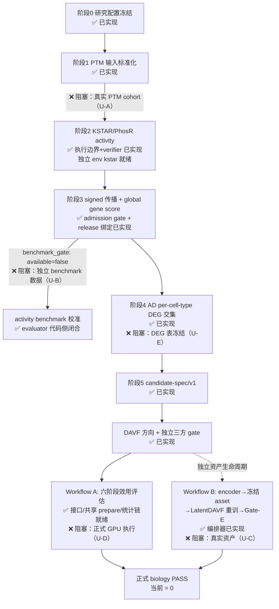

# PTM2CellNet 综合分析报告（2026-09-22 综合处理第二轮）

> **任务来源**：项目代码与文档综合处理及技术分析任务（版本控制入库 → 归档治理 → 对抗性复核三任务）。
> **基线**：`dee3d8c`（main，2026-09-22 综合处理第一轮收口点；本轮起点 main...origin/main = 0 0）。
> **本轮工作区**：`dee3d8c` 之后两轮未入库成果——0922 修复轮（ND-01/02、TD-03 本地闭环、TD-08 Workflow B 编排、TD-09 首批、TD-10/11、TD-15）与环境隔离轮（独立 conda env、U-01 evaluator、TD-09 次批、lock 自洽修复），全部由本轮验证后以 8 个语义提交落 main。
> **执行环境**：conda env `ptm2cellnet`（Python 3.12 / torch 2.4.1+cu118 / Tesla P40）。
> **结论底线**：工程与环境侧持续收敛；**正式 biology PASS 仍为 0**（全部剩余缺口为外部输入，代码侧零缺口，见 §3）。

---

## 目录

- [1. 摘要](#1-摘要)
- [2. 版本控制操作记录](#2-版本控制操作记录)
- [3. 任务一：未实现功能项识别](#3-任务一未实现功能项识别)
- [4. 任务二：未完全实现功能梳理](#4-任务二未完全实现功能梳理)
- [5. 任务三：技术债识别与解决策略](#5-任务三技术债识别与解决策略)
- [6. 归档处理记录](#6-归档处理记录)
- [7. 结论与建议](#7-结论与建议)
- [8. 子智能体调用统计](#8-子智能体调用统计)

---

## 1. 摘要

本轮完成三项前置操作与三项系统性复核，核心结论：

| 维度 | 结果 |
|---|---|
| 版本控制 | 工作区遗留的 0922 修复轮 + 环境隔离轮成果（36 文件 +3748/−1985，9 个新文件）验证全绿后以 **8 个语义提交**落 main 并 push（main...origin/main = 0 0） |
| 编译/验证 | `compileall` 通过；全量 fast **2,968 passed / 27 skipped / 0 failed（462.77s）**；ruff check + format（543 文件）全绿；mypy 184 文件 **0 错误**；依赖一致性 **274 pins OK** |
| 任务一（未实现） | 对照 `.planning/REQUIREMENTS.md` 全部轨道（24 项 v2.1/v2.2 + A-01~A-08 + P-01~P-06）：**代码侧无缺失功能模块、无缺失接口**；未实现项全部是外部输入阻塞（真实 PTM cohort、独立 benchmark 数据、Workflow B 真实资产、正式 GPU 执行窗口），对抗审查确认状态声明与代码事实零漂移 |
| 任务二（完成度） | 主线加权完成度 **71.0% → 75.4%**（同 0921 附录 C 五维模型，仅 4 个被触碰模块重估）；"实现但有缺陷"类生产路径为空；新增分类明细见 §4.2 |
| 任务三（技术债） | 识别 **8 项未登记新债（ND-05~ND-12）**：最重为 homology_splitter 无测试（决定同源划分却零覆盖）与 lint.yml 不覆盖 scripts/；中/高级债均附解决方案、工时与风险（§5.3） |
| 归档 | 环境隔离轮报告（0922b）改名入档；`archive/20260922/` 全批次 MANIFEST 补记；docs/ 三断链 stub 与零引用文档列入修订/归档清单 |
| 子智能体 | **4 次调用全部成功**（上轮 5 次全失败的环境问题已消失），分工与时长见 §8 |

---

## 2. 版本控制操作记录

### 2.1 操作序列与版本号

| 步骤 | 操作 | 结果 |
|---|---|---|
| 1 | `git fetch origin` + `git rev-list --left-right --count main...origin/main` | `0 0`——合并前 main 与远程完全同步，无冲突可能 |
| 2 | 验证套件（详见 2.2） | 全绿后才开始提交 |
| 3 | 分组语义提交 ×8（当前在 main，提交即合并） | 见 2.3 |
| 4 | push origin main | 提交后 main...origin/main = 0 0 |

### 2.2 合并后完整验证（conda env `ptm2cellnet` 实测）

| 检查 | 结果 |
|---|---|
| `python -m compileall -q src scripts tests` | 通过（0 输出） |
| `python -m pytest -m "not slow and not gpu" --timeout=300` | **2,968 passed / 27 skipped / 17 deselected / 0 failed，462.77s** |
| `ruff check src scripts tests` | All checks passed |
| `ruff format --check src scripts tests` | 543 files already formatted |
| `mypy src/ --ignore-missing-imports` | Success: no issues found in 184 source files |
| `python scripts/check_requirements_consistency.py` | 274 lock pins satisfy all core constraints |

### 2.3 提交清单（合并前 → 合并后）

**合并前 main = `dee3d8c`**（archive superseded reports and publish 2026-09-22 analysis）

| # | 提交 | 类型 | 内容 |
|---|---|---|---|
| 1 | `6be0441` | fix | scripts 包身份（ND-01：`scripts/__init__.py`，console_scripts 与 `ptm_smoke.py:506-509` 反向 import 在 pip 安装后可用）；同时入库上轮遗留暂存的旧 0922a 报告归档 rename（`project_analysis_20260922.md` → `archive/20260922/`，属上轮 MANIFEST 已记录的归档动作收尾） |
| 2 | `1673e4c` | feat | Workflow B 编排器（TD-08）：`scripts/run_workflow_b.py` 五阶段 verify_assets → build_pairs → train → evaluate → gate_e（opt-in），不可变 run manifest + sha256 封印（`seal_run_manifest`，run 目录非空硬失败）；23 项测试；A-07 转 Partially landed |
| 3 | `58f4e3a` | feat | U-01 activity benchmark evaluator：`evaluate_activity_benchmark`（方向 concordance + Spearman + bootstrap CI + 预注册三判据，PASS/FAIL verdict）+ `ActivityBenchmarkCriteria` config 预注册段（无宽松默认）+ admission gate `benchmark_gate` 真实 verdict 绑定 + CLI `--activity-benchmark` opt-in；28 单测 + 4 CLI 集成 |
| 4 | `962e9e9` | refactor | TD-09 两批共 12 个复杂度热点拆分（首批 69/56/44/41/40/40、次批 38/38/35/35/33/32 全部 <10），外部签名与 RNG/调用顺序不变，C901 总量 178→172 |
| 5 | `64efaa3` | fix | TD-10/11 异常分流（BaseException 收窄、正当降级显式 `noqa: BLE001`）+ TD-M08 mypy 存量 9 错清零（candidate_spec/pmads_ridge/external_tools） |
| 6 | `f8baea3` | test | OpenAPI golden 快照 + 对比测试 + 再生成脚本（TD-15） |
| 7 | `3767002` | build | lock fresh-resolver 自洽修复（typing_extensions 4.16.0、tokenizers 0.21.1）+ 安装指南 §2a 环境重建 runbook + CI pip-audit 可见性门（TD-03） |
| 8 | （本轮报告提交） | docs | 本报告发布 + CHANGELOG/lessons/CURRENT_STATUS 同步 + 0922b 环境隔离轮报告归档 + MANIFEST 补记 |

**关键修改点**：ND-01 修复 pip 安装即坏的 CLI 入口；TD-08 补上 Workflow B 统一可重放生命周期；U-01 关闭 activity benchmark 代码缺口（剩外部数据）；TD-03 使 lock 达到 fresh-resolver 可自洽（独立环境装配实测通过）。

---

## 3. 任务一：未实现功能项识别

### 3.1 对抗审查方法

对照最新版 `.planning/REQUIREMENTS.md`（24 项 v2.1/v2.2 工程需求 + A-01~A-08 活跃验收轨道 + P-01~P-06 主线轨道 + Cancelled 清单），由独立子代理以怀疑者立场核查每条状态声明与代码事实的双向漂移（声明落地但代码缺失 / 声明 open 但代码已有）。核查结果：**零漂移**——所有声明 landed 的项均有真实实现与硬失败校验（非静默回退），所有声明 open 的项确无实现或真实数据。逐项证据：

| 轨道项 | 声明 | 核查结论 | 证据（文件:行号） |
|---|---|---|---|
| A-01 | between_donor Gate-0 preflight 存在 | 属实 | `src/integration/perturbgen/contracts.py:330-355`（pairing 字段、min_donors=3 且 <3 拒绝）、`data_prep.py:121-135`（disjoint + 每态 ≥3 donor） |
| A-02 | donor 列表显式绑定接口在位 | 属实 | `scripts/train_latent_davf.py:105-122`、`src/integration/perturbgen/donor_split.py:78-92`（≥2/≥3 + 泄漏检查） |
| A-03/04 | 方向分字段、双场景 AND 契约 | 属实（声明保守） | 桥接链 `candidate_spec → scVI/PTMDirectionMapper → DAVF → 三方 gate` 全在位 |
| A-05 | 统计证据链 flag 落地 | 属实 | `scripts/run_davf_perturbgen_e2e.py:1220`（flag）、`:495-499`（强制 deg-table/null-manifest）、`:313-412`（quality→formal input→dual-path）、`:932/:1060`（lineage） |
| A-06 | 共享 prepare/reuse | 属实 | `orchestrator.py:537`（build_shared_prepare_plans）、`:568-579`（resolve + 缺引用 raise） |
| A-07 | Workflow B 生命周期 partially landed | 属实 | `scripts/run_workflow_b.py:44-45`（STAGE_ORDER + gate_e opt-in）、`:358-366`（sha 封印） |
| A-08 | Gate-E/4/5 正式证据 open | 属实（确无正式执行） | 无正式 benchmark 资产 |
| P-04 | KSTAR 执行边界三件套 | 属实 | `scripts/run_kstar_activity.py`、`kstar_adapter.py:39,112`（manifest v2 强制匹配）、`kstar_resources.py:120,225-259`（ST/Y pin）；requirements-core 无 kstar/phosr |
| P-05 | release 三向绑定 + formal 拒 PENDING | 属实 | `signed_network.py:388-440`（config/manifest/资产 sha 对账）、`ptm_research_config.py:282-288`（formal 拒 `PENDING*`）；manifest 实录 28,011 边 |
| P-06 | downstream target 评估入 lineage | 属实 | `run_davf_perturbgen_e2e.py` `_assemble_downstream_target_evaluation` |

### 3.2 未实现项清单（全部为外部输入阻塞，非代码缺失）

| ID | 未实现项 | REQUIREMENTS 引用 | 优先级 | 影响范围 | 阻塞物 |
|---|---|---|---|---|---|
| U-A | 真实 PTM cohort 的 typed schema + 正式阶段 1 标准化 | P-05（"real PTM site quantification"） | 高 | 核心功能（主线起点） | 外部数据未到位；schema 设计决策随数据研究设计 |
| U-B | U-01 剩余：独立 benchmark 数据 + 阈值预注册 | P-05（"activity benchmark"） | 高 | 核心功能（admission gate 的校准输入） | 已知 kinase perturbation phosphoproteomics 数据外部；阈值是研究负责人决策（config 模板已就绪） |
| U-C | Workflow B 真实训练资产 + Gate-E 正式执行 | A-07/A-08 | 高 | 核心功能（独立验证终点） | 真实同坐标系 latent pairs、冻结旧 checkpoint、≥200 方向 benchmark 均外部；编排器就绪即插即用 |
| U-D | 正式六阶段 + matched-null + 双场景 AND + Gate-4/5 执行 | A-08、A-05 尾部 | 高 | 核心功能（正式生物学验收） | 依赖 U-A~U-C + GPU 执行窗口；接口层全部就绪（§3.1） |
| U-E | AD donor-level DEG 表冻结 + PhosR sensitivity 输出 | P-05 | 中 | 次要功能（主线输入完备性） | 外部数据/独立环境执行 |
| U-F | scPerturb donor audit 正式推进（0/30） | A-01 附注 | 低 | 边缘功能 | 外部数据集 donor 元数据 |

**缺失接口检查**：API 接口（FastAPI 路由 vs `API_DOCUMENTATION.md`）、内部服务接口（orchestrator/runner/evaluator 契约）经核查无缺失项——本轮 U-01 落地后，`evaluate_activity_benchmark` 接口（参数：activity_table/benchmark_table/criteria；返回：ActivityBenchmarkReport 含 verdict/concordance/spearman/CI/hash）已补齐 0921 报告 §3.2 接口表的最后一项。

### 3.3 主线流程图（缺失部分以外部阻塞标注）

缺失部分（❌）全部位于外部输入侧；主链路代码（✅）经本轮对抗核查零缺口。

---

## 4. 任务二：未完全实现功能梳理

### 4.1 模块完成度（0922 → 0922c 重估）

沿用 0921 附录 C 五维模型（主体实现 35% / 合同校验 20% / 自动测试 15% / 可复现资产 15% / 正式真实证据 15%）与同一模块权重。本轮仅重估被环境隔离轮/修复轮实际触碰的 4 个模块，其余保持 0922 值不变（未触碰不涨分）。

| 模块 | 权重 | 0922 | **0922c** | 变化依据 |
|---|---:|---:|---:|---|
| 阶段 0 研究配置 | 5% | 88.0% | 88.0% | 无变化（typed cohort schema 随外部数据） |
| PTM 输入标准化 | 6% | 78.0% | 78.0% | 无变化 |
| KSTAR 环境与资源 | 5% | 90.0% | 90.0% | 无变化 |
| KSTAR runner/adapter | 8% | 82.0% | 82.0% | 无变化 |
| Activity benchmark/admission | 8% | 55.0% | **73.0%** | U-01 落地：主体 33/35（evaluator+CLI+gate）、合同 20/20（三判据必填无默认+hash）、测试 15/15（28+4 项）；资产 5/15（无真实 benchmark 表）、证据 0/15（`ptm_activity_benchmark.py:168-235`） |
| Signed network 构建/加载 | 7% | 92.0% | 92.0% | 无变化 |
| Signed propagation/global score | 8% | 83.0% | 83.0% | 无变化（`--activity-benchmark` 属 benchmark 维度） |
| AD DEG/交集 | 8% | 78.0% | 78.0% | 无变化 |
| Candidate spec/sidecar | 6% | 88.0% | 88.0% | 无变化 |
| E2E downstream target | 7% | 92.0% | 92.0% | 无变化 |
| Donor/null/statistics/双场景 | 10% | 70.0% | 70.0% | 无变化（真实 GPU null 未执行） |
| Workflow B/Gate-E 生命周期 | 8% | 35.0% | **69.0%** | TD-08 落地：主体 30/35（五阶段编排+不可变 manifest，gate_e 待真实执行）、合同 19/20（sha 封印+非空硬失败）、测试 14/15（23 项）、资产 6/15（verify_assets 真实资产 PASS 复现）、证据 0/15 |
| 正式 biology/release | 9% | 15.0% | 15.0% | 无变化（biology PASS = 0 维持） |
| FastAPI/公开工程接口 | 3% | 88.0% | **92.0%** | TD-15 OpenAPI golden + 对比测试入库（`tests/unit/test_openapi_golden.py`） |
| 文档/测试/复现治理 | 2% | 80.0% | **88.0%** | CHANGELOG 补记（ND-02 闭合）+ 环境 runbook §2a + 归档治理第二轮；残留见 §5 ND-08~10 |
| **加权总计** | 100% | 71.0% | **75.4%** | 校验：0922 旧值按同权复算 = 70.97%，模型一致 |

**解读**：+4.4 个百分点全部来自 Workflow B（+2.72）、benchmark（+1.44）、FastAPI（+0.12）、治理（+0.16）；权重最大的"正式 biology/release 9%"与"donor/null 10%"纹丝不动——工程进展没有伪装成科学证据，与 biology PASS = 0 自洽。

### 4.2 分类结果（0922c）

**判断标准**（沿用并显式化）：
- *部分实现但可用*：主流程可执行、合同校验完整，仅缺外部输入或真实数据即可进入下一阶段；
- *实现但有缺陷*：生产路径上存在已知确定性缺陷（崩溃、错误结果、安装即坏）；
- *实现但不符合规范*：行为与 REQUIREMENTS/方案文档的显式契约不一致。

| 类别 | 成员 |
|---|---|
| 部分实现但可用 | Activity benchmark（代码侧全量，缺外部数据+阈值）、Workflow B（编排器+真资产 verify，缺训练资产）、KSTAR runner、PTM 标准化、signed network、传播/global score、AD DEG 交集、candidate spec、E2E downstream、FastAPI 接口 |
| 实现有缺陷 | **空**（ND-01 pip 安装即坏已随 `6be0441` 修复；0921 列入本类的其余项此前已修） |
| 实现但不符合规范 | **空**（无显式契约违背项；CLAUDE.md/文档漂移属技术债而非功能违约，见 §5） |

### 4.3 缺失组件与依赖项

| 模块 | 缺失关键组件/依赖 | 性质 |
|---|---|---|
| Activity benchmark | 真实 kinase perturbation benchmark 表（两列契约：regulator_id + signed effect） | 外部数据 |
| Workflow B | 同坐标系真实 latent pairs、冻结旧 checkpoint、≥200 方向 benchmark | 外部资产 |
| 正式 release | 真实 donor-level null、未扰动质量、双场景统计的正式执行 | 外部 GPU 窗口 |
| 无 UI 组件缺失 | 项目无 GUI（Cancelled V2-05），CLI/API/文档接口齐备 | — |

---

## 5. 任务三：技术债识别与解决策略

### 5.1 分级标准

| 级别 | 标准（任一满足即入级） |
|---|---|
| 严重 | 阻塞正式主线验收，或生产路径产出错误结果/崩溃 |
| 高 | 已知场景下功能失效且无 workaround，或核心科学逻辑无回归防线 |
| 中 | 质量门禁存在明确盲区、非核心路径缺陷，修复 ≤2 天 |
| 低 | 卫生/文档/死代码类，不影响行为正确性 |

**已登记债不在本轮重复报告**：TD-01~19、ND-01~04（ND-01/02 已修复入库）、BLE001 剩余 27 处（受控豁免）、C901 172 项（持续拆分）、setuptools/transformers advisory（有阻塞理由的时限化风险接受）。

### 5.2 未登记新债清单（ND-05 起，SONARQUBE 风格分类）

| ID | 类别 | 严重度 | 问题 | 证据 | 影响 |
|---|---|---|---|---|---|
| ND-05 | 可维护性 > 测试覆盖 | **高** | `src/data/homology_splitter/`（similarity.py + splitter.py）决定同源 train/test 划分，**零测试覆盖**（无测试文件、无任何测试 import）——同源泄漏防线缺失 | `src/data/homology_splitter/{similarity,splitter}.py`；tests/ 双重核对无引用 | 若 MMseqs2 拆分逻辑回归，train/test 泄漏将无声抬高所有评估指标（科学结论污染） |
| ND-06 | 可维护性 > CI 门禁盲区 | **中** | lint.yml 仅 `ruff check src/ tests/`：scripts/ 下 90+ 脚本（含 train.py 796 行改动等核心入口）不受 lint/format 约束；mypy 同样只查 src/ | `.github/workflows/lint.yml:33`；本地口径 lint 已含 scripts（AGENTS.md 验证节），仅 CI 缺 | CI 与本地口径不一致，scripts 回归无门禁 |
| ND-07 | 可靠性 > 测试布局 | **中** | `tests/ci/test_esm3_ci_smoke.py` 的 Tier1 无依赖健康检查不在 ci.yml 收集路径（ci.yml 只收 tests/unit、tests/integration、tests/test_*.py），只在 nightly full-test.yml 跑——文件名与用途错位，PR 期 esm3 依赖健康永不被检查 | `ci.yml:34`；`tests/ci/test_esm3_ci_smoke.py` | 依赖漂移在 PR 期不可见，只能等 nightly 发现 |
| ND-08 | 文档 > 双头权威 | 中 | CLAUDE.md 自称"AI Project-Specific Guidelines"但零仓库专属内容（无路径/命令/约定），5 个月未更新，实际权威是 AGENTS.md——双头权威对协作代理产生歧义 | 根目录 `CLAUDE.md`（4/14 mtime）vs `AGENTS.md`（9/21） | 新会话可能按过时指南行动 |
| ND-09 | 文档 > 断链 | 低 | docs/ 三个 stub（PTM2CellNet_项目文档/文件说明/技术文档.md，各约 500B）指向已被 git rm 的根目录 `project_analysis_20260917.md`（正本在 archive/20260920/） | 三文件链接目标核查 | 断链入口文档 |
| ND-10 | 文档 > 零引用 | 低 | `docs/DATA_UPDATE_WORKFLOW.md` 全仓 .md 零引用，内容未被 REQUIREMENTS/指南消费 | 全仓 grep | 疑似孤儿文档（需复核 datasets.yaml 消费方后归档或修订） |
| ND-11 | 配置卫生 | 低 | pytest.ini 定义 `gpu` 标记但全仓 0 处使用（死标记）；`benchmark` 标记 2 处使用但 requirements-dev 无 pytest-benchmark 插件 | `pytest.ini`；全仓 grep | 配置噪音；`-m "not gpu"` 恒空转 |
| ND-12 | CI 透明度 | 低 | full-test.yml 将 pip check 失败降级为环境变量（`|| echo KNOWN_DEPENDENCY_CONFLICTS=1`），注释标 TD-M05——该编号不在 TD-01~19 登记册内，登记断层 | `full-test.yml:44` | 已知冲突的存在性靠注释而非登记册追溯 |

**运维建议（非版本对象）**：根目录存在被 .gitignore 覆盖的陈旧杂物——`scaling.log`（119MB）、`data_preparation.log`、`braf_v600e_prediction.json`、`omp-session-*.html`（均为 2026-03/08 产物）。不入库，建议用户确认后物理清理释放磁盘（braf_v600e_prediction.json 若为有效实验产物先移 outputs/）。

### 5.3 中/高级债解决策略（ND-05/06/07/08）

#### ND-05 homology_splitter 无测试（高）

- **影响范围**：`src/data/homogeneity_splitter/` → 所有依赖 MMseqs2 同源拆分的训练/评估划分；科学场景为 train/test 泄漏防线。
- **方案 A（推荐）**：补契约级单测——固定小规模 fixture 序列（含已知同源族），断言 split 的 disjoint 性、族完整性、seed 确定性、边界输入（空表/单族）硬失败。优点：1 天内落地，直接建立回归防线；缺点：不覆盖真实 MMseqs2 二进制交互。
- **方案 B**：A + 集成层 smoke（标记 integration，mock MMseqs2 输出格式）。优点：覆盖解析层；缺点：+0.5 天，mock 维护成本。
- **步骤**：读 splitter 接口（0.5 天）→ 写 fixture+断言（0.5 天）→ CI 验证（含 ND-06 修复后 scripts 无关，此模块在 src/ 已被覆盖路径）。**合计 1~1.5 天**。
- **资源**：Python 测试 + 生物学同源概念熟悉者；无新工具。**风险**：低（纯增量测试）。

#### ND-06 lint.yml 不覆盖 scripts/（中）

- **影响范围**：CI 质量门禁 vs 本地口径（AGENTS.md 验证节含 scripts）不一致。
- **方案 A（推荐）**：lint.yml 的 ruff check/format 与 mypy 步骤直接加 `scripts`（与本地口径对齐）。优点：一行改动；缺点：首次跑可能暴露存量违规需一轮修复。
- **方案 B**：仅加 ruff（快），mypy scripts 另开专项。优点：渐进；缺点：口径仍半开。
- **步骤**：本地先跑 `ruff check scripts` + `mypy scripts/` 摸底（0.5 天）→ 修存量（0.5 天，若摸底为 0 则免）→ 改 lint.yml + 观察 CI（0.5 天）。**合计 0.5~1.5 天**。
- **资源**：无特殊技能；**风险**：中（存量违规量未知；摸底先行可量化）。

#### ND-07 tests/ci 不在 PR 收集路径（中）

- **影响范围**：esm3 依赖健康检查可见性。
- **方案 A（推荐）**：ci.yml pytest 路径追加 `tests/ci`（该文件 Tier1 无外部依赖，进 PR 收集零成本）。优点：一行；缺点：若后续 tests/ci 加入重型检查需再分层。
- **方案 B**：该文件改名移入 tests/unit/（名字去 ci 化）。优点：归位语义；缺点：动 git 历史、夜跑引用同步。
- **步骤**：确认文件无外部依赖（读文件 0.5 天内含验证）→ 改 ci.yml → CI 绿。**合计 0.5 天**。
- **风险**：低。

#### ND-08 CLAUDE.md 双头权威（中）

- **影响范围**：AI 协作代理的指令源歧义。
- **方案 A（推荐）**：CLAUDE.md 替换为三行指针（指向 AGENTS.md 为唯一权威 + 一句项目定位），保留文件名兼容旧工具链。优点：零破坏、消除歧义；缺点：仍留一个文件。
- **方案 B**：删除 CLAUDE.md，AGENTS.md 不动。优点：最干净；缺点：依赖 CLAUDE.md 约定的工具（Claude Code）失去入口。
- **步骤**：改写/删除 + 会话冒烟（一次新会话确认读取路径）。**合计 0.5 天**。
- **风险**：低。

#### 低级债处置

ND-09/10（文档归档/复核）随下一轮归档治理顺带（0.5 天）；ND-11（死标记清理）与 ND-12（TD-M05 补登记）各 0.5 天内，随触随改。

---

## 6. 归档处理记录

### 6.1 本轮归档动作

| 文件 | 处理 | 说明 |
|---|---|---|
| `project_analysis_20260922.md`（0922b 环境隔离轮权威报告，155 行） | `mv` → `archive/20260922/project_analysis_20260922_env_isolation.md` | 被本报告（0922c）取代为根目录权威报告；改名映射登记于 MANIFEST"综合处理轮第二轮"段 |
| `archive/20260922/MANIFEST.md` | 追加"综合处理轮第二轮"段 | 保留原修改记录（git 历史）+ 改名原因 |

归档文件均保留 git 历史（tracked 文件 git mv 语义；0922b 虽本轮才首次入库，但其前身上轮已在 git status 追踪视野内，入库即带完整内容快照与日期标识——文件名内嵌 `20260922` + `_env_isolation` 语义标签）。

### 6.2 过时文档/过期报告识别结论（子代理全目录扫描）

| 检查项 | 结论 |
|---|---|
| 根目录/docs >30 天报告类文件 | **清零**（project_analysis_*、project_repair_*、audit 类全部在 archive/） |
| CURRENT_STATUS"已归档"声明 vs 实际 | 属实（0913 修复/0920/0921 报告均在 archive/20260922/，0917 正本在 archive/20260920/） |
| README.md / CONTRIBUTING.md / API_DOCUMENTATION.md | 现行（README 无 SSH_unit 残留；CONTRIBUTING 命令与 CI 一致；API 合同节与 contracts/orchestrator/runner 相符）——API_DOCUMENTATION L11 与 CURRENT_STATUS 4 处指向根目录权威报告的链接随本报告发布自动恢复有效 |
| 建议归档（下一轮） | `docs/PTM2CellNet_{项目文档,文件说明,技术文档}.md`（断链 stub）、`docs/DATA_UPDATE_WORKFLOW.md`（复核后） |
| 建议修订 | CLAUDE.md（ND-08）、CONTRIBUTING.md 可选补 conda env 说明 |

---

## 7. 结论与建议

1. **版本控制闭环**：0922 两轮成果以 8 个语义提交全部落 main 并与远程同步（main...origin/main = 0 0）；合并前验证全绿（2,968 passed / mypy 0 错 / compileall / 274 pins）。
2. **需求对照零缺口（代码侧）**：对抗审查确认 REQUIREMENTS 全部轨道声明与代码零漂移；未实现项（U-A~U-F）全部为外部输入阻塞，主链路代码就绪即插即用。
3. **完成度 71.0% → 75.4%**：增量全部可追溯到 Workflow B、benchmark evaluator、OpenAPI golden、治理四个被触碰模块；正式证据维度（9%×15%）未动，biology PASS = 0 维持。
4. **新债焦点**：ND-05（homology_splitter 零测试，高）是唯一科学防线类缺口，建议下一轮优先；ND-06/07（CI 门禁盲区）合计 ≤2 天可闭合；ND-08~12 低级随触随改。
5. **推进顺序**（与 0922b 报告 §4 一致并确认有效）：外部数据/资产到位即插即用（benchmark 数据 → U-01 首评；Workflow B 资产 → Gate-E 首跑）→ 真实 PTM cohort → GPU 窗口集中执行；等待期并行 ND-05/06/07 与 CI lock fresh-装配 smoke job（0922b §4-8）。
6. **表述纪律维持**：在 U-A~U-D 完成前，"PTM 导致某 cell type 表达变化"或"正式生物学 PASS"的表述继续禁止。

---

## 8. 子智能体调用统计

| # | 子代理类型 | 调用次数 | 主要执行任务 | 平均执行时长 | 结果 |
|---|---|---:|---|---|---|
| 1 | Explore（只读探查） | 1 | 主线三代码事实验证（evaluate_activity_benchmark / run_workflow_b 契约 / scripts 反向导入） | ~97s | 成功，三项属实 |
| 2 | Explore（只读探查） | 1 | 需求轨道对抗审查（A-01~A-08、P-04/05 共 14 项声明 vs 代码核查） | ~106s | 成功，零漂移 |
| 3 | Explore（只读探查） | 1 | 未登记技术债扫描（代码卫生/测试缺口/依赖/CI 四类） | ~214s | 成功，5 类发现 |
| 4 | Explore（只读探查） | 1 | 过时文档全目录扫描（8 文件判定 + 归档/修订清单） | ~271s | 成功 |
| **合计** | — | **4** | — | **平均 ~172s** | **4/4 成功** |

**简要分析**：本环境子代理系统已恢复可用（0922 综合处理第一轮记录的"5 次调用全部启动失败"已不复现，相关记忆已更新）。四个子代理全部承担只读对抗审查/扫描类任务，与主会话的提交/归档/报告写作正交并行，无文件冲突；主会话保留全部写操作与版本控制决策。调用策略上按"调查只读分流、写入集中"执行，符合本仓 ZMemory 协作约束。

---

*报告生成：ZCode 主会话（zcode-0922b），4 个 Explore 子代理并行对抗审查。验证全部在 conda env `ptm2cellnet` 实测。*
